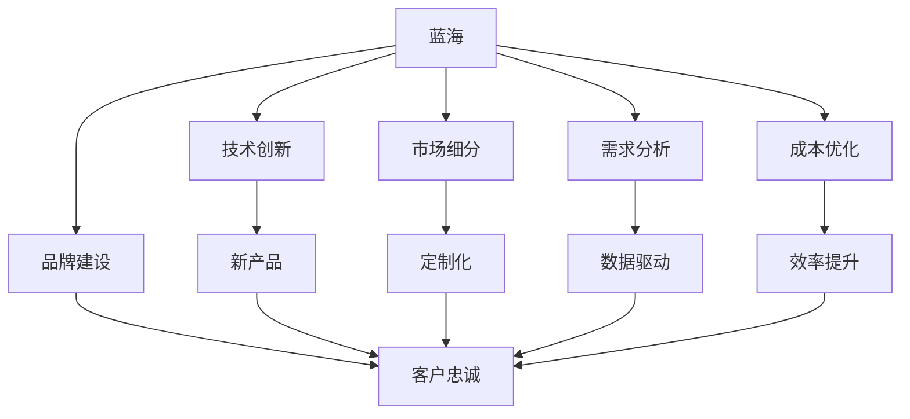
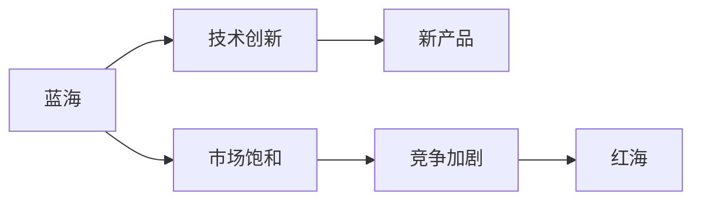
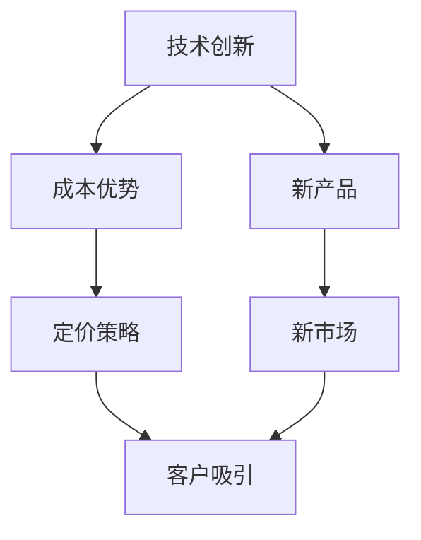
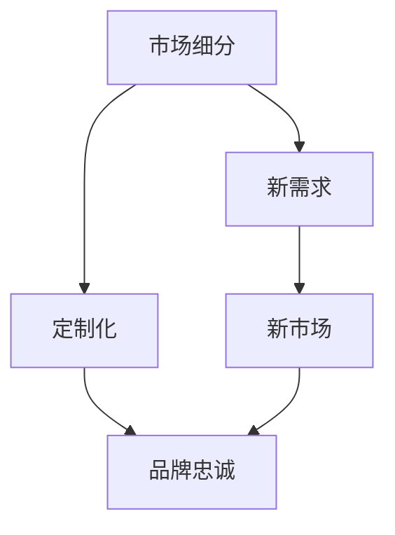
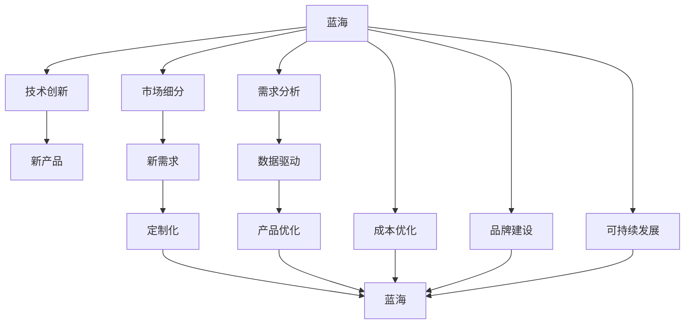

                 

# 商业领域从蓝海到红海的转变

## 1. 背景介绍

### 1.1 问题由来

随着经济全球化的深入发展和技术的快速迭代，商业领域正在发生深刻的变化。传统的商业蓝海正逐渐演变为激烈竞争的红海。这一转变对企业提出了新的挑战，也带来了新的机遇。本文旨在探讨商业领域从蓝海到红海转变的本质，并分析其背后的驱动因素，提出适应这一转变的新策略。

### 1.2 问题核心关键点

商业领域的转变涉及多个关键因素，包括但不限于以下几个方面：

- 技术革新：如人工智能、大数据、物联网等技术的应用，为商业领域带来了新的生产力和效率提升。
- 市场需求变化：消费者需求的多样化和个性化趋势，促使企业不断创新和优化产品和服务。
- 竞争环境加剧：市场竞争的加剧迫使企业提升产品竞争力，拓展新的市场空间。
- 法律法规的调整：如反垄断法、数据保护法等法律法规的出台，对商业行为产生重要影响。

这些关键点共同作用，促使商业领域从蓝海向红海转变。理解这些因素，是探索新商业模式和策略的基础。

### 1.3 问题研究意义

商业领域从蓝海到红海的转变，对企业的战略规划、市场拓展、产品创新等方面都提出了新的要求。理解和应对这一转变，有助于企业保持竞争优势，实现可持续发展。具体而言，本文的研究意义在于：

1. 为企业管理者提供战略指导。帮助企业识别蓝海和红海的特征，制定适应市场变化的新策略。
2. 提供决策支持。通过分析驱动转变的关键因素，为企业制定应对策略提供数据和理论支持。
3. 推动技术应用。探讨技术革新对商业模式的影响，促进技术在商业领域的广泛应用。
4. 促进跨学科研究。结合经济学、管理学、社会学等多学科视角，全面理解商业领域的变迁。

## 2. 核心概念与联系

### 2.1 核心概念概述

为更好地理解商业领域从蓝海到红海的转变，本节将介绍几个关键概念：

- **蓝海**：指市场尚未被充分开发、竞争不激烈的新市场空间，企业在此可享有较长的利润增长周期。
- **红海**：指竞争激烈、市场已饱和的现有市场空间，企业在此需不断提升竞争力以保持生存和发展。
- **技术创新**：指通过引入新技术、新产品和新流程，提升企业竞争力，开辟新的市场空间。
- **市场细分**：指将市场划分为不同细分市场，针对不同客户群体提供定制化产品和服务。
- **需求分析**：指通过数据分析和客户调研，理解市场需求，优化产品设计和营销策略。
- **成本优化**：指通过流程优化、供应链管理等手段，降低成本，提升企业盈利能力。
- **品牌建设**：指通过品牌建设提升企业知名度和市场影响力，增强客户忠诚度。
- **可持续发展**：指在追求商业成功的同时，兼顾环境保护和社会责任，实现长期发展。

这些概念之间的逻辑关系可以通过以下Mermaid流程图来展示：



这个流程图展示了蓝海和红海之间的转化路径，以及关键概念之间的联系。

### 2.2 概念间的关系

这些核心概念之间存在着紧密的联系，形成了商业模式的完整生态系统。以下通过几个Mermaid流程图来展示这些概念之间的关系：

#### 2.2.1 蓝海与红海的转化



这个流程图展示了从蓝海到红海的转化过程。蓝海通过技术创新和新产品开发，逐渐被市场开发饱和，最终转变为竞争激烈的红海。

#### 2.2.2 技术创新与蓝海的关系



这个流程图展示了技术创新对蓝海开辟的影响。通过引入新技术和新产品，企业可以在新市场中获得成本优势和定价优势，吸引新客户，开拓蓝海市场。

#### 2.2.3 市场细分与蓝海的关系



这个流程图展示了市场细分对蓝海开辟的影响。通过市场细分，企业可以发现新的客户需求，提供定制化产品，增强品牌忠诚度，从而开拓蓝海市场。

### 2.3 核心概念的整体架构

最后，我们用一个综合的流程图来展示这些核心概念在大语言模型微调过程中的整体架构：



这个综合流程图展示了从蓝海到红海的转化路径，以及各个概念之间的联系和互动。通过理解和应用这些概念，企业可以更好地应对市场变化，实现可持续发展。

## 3. 核心算法原理 & 具体操作步骤

### 3.1 算法原理概述

商业领域从蓝海到红海的转变，本质上是一个从创新到竞争的过程。其核心算法原理包括：

- **市场细分算法**：通过对市场进行划分，识别不同客户群体的需求，开发定制化产品。
- **需求分析算法**：通过数据分析和调研，理解消费者需求，优化产品设计和营销策略。
- **成本优化算法**：通过流程优化和供应链管理，降低成本，提升盈利能力。
- **品牌建设算法**：通过品牌建设和营销策略，提升品牌知名度和市场影响力。
- **可持续发展算法**：在追求商业成功的同时，兼顾环境保护和社会责任，实现长期发展。

这些算法共同作用，推动商业领域从蓝海到红海的转变。

### 3.2 算法步骤详解

以下是实现商业领域从蓝海到红海转变的关键步骤：

1. **市场细分**：
   - 使用市场细分算法，将市场划分为不同细分市场，如年龄、性别、地理位置等。
   - 对每个细分市场进行需求分析，识别其独特需求。
   - 针对不同细分市场，开发定制化产品。

2. **需求分析**：
   - 通过数据分析和客户调研，了解消费者行为和需求。
   - 根据分析结果，优化产品设计和营销策略。
   - 设计A/B测试，验证产品改进效果。

3. **成本优化**：
   - 使用成本优化算法，识别流程中的瓶颈，优化供应链管理。
   - 引入精益生产和六西格玛管理，提升生产效率和质量。
   - 利用大数据分析，预测成本变化，制定应对策略。

4. **品牌建设**：
   - 通过品牌建设，提升品牌知名度和市场影响力。
   - 利用社交媒体和数字营销，增强品牌互动。
   - 设计品牌故事，传递企业文化和价值观。

5. **可持续发展**：
   - 通过环保和责任型生产，降低环境影响。
   - 加强社会责任，提升企业形象。
   - 制定长期发展战略，实现可持续发展。

### 3.3 算法优缺点

从蓝海到红海的转变过程中，涉及的算法和策略各有优缺点：

- **优点**：
  - 市场细分和定制化策略，可以更精准地满足消费者需求，提升客户满意度。
  - 数据分析和成本优化，可以提高生产效率和降低成本，提升企业盈利能力。
  - 品牌建设和可持续发展，可以增强企业品牌知名度和社会责任，提升企业长期价值。
  
- **缺点**：
  - 市场细分和定制化策略，需要更多的时间和资源投入。
  - 数据分析和成本优化，需要一定的技术基础和数据积累。
  - 品牌建设和可持续发展，需要持续投入和长期规划。

### 3.4 算法应用领域

商业领域从蓝海到红海的转变，在多个应用领域具有重要意义，包括：

- **零售和消费品**：通过市场细分和定制化，提升产品竞争力，满足不同客户群体的需求。
- **制造和生产**：通过成本优化和精益生产，提高生产效率和质量，降低成本。
- **服务和金融**：通过数据分析和客户调研，优化服务和产品，提升客户体验。
- **技术创新**：通过引入新技术和新产品，开拓新市场，提升企业竞争力。
- **品牌建设**：通过品牌建设和营销策略，提升品牌知名度和市场影响力。
- **可持续发展**：通过环保和责任型生产，提升企业社会责任和长期价值。

这些领域的应用，展示了商业领域从蓝海到红海转变的广泛影响和深远意义。

## 4. 数学模型和公式 & 详细讲解 & 举例说明

### 4.1 数学模型构建

商业领域从蓝海到红海的转变，可以抽象为如下数学模型：

- 设 $M$ 表示市场，$C$ 表示客户，$D$ 表示需求，$P$ 表示产品，$T$ 表示技术，$B$ 表示品牌，$S$ 表示可持续发展策略。
- 初始状态下，市场 $M$ 处于蓝海状态，即未充分开发、竞争不激烈。
- 引入技术 $T$，开发新产品 $P$，市场开始从蓝海向红海转变。
- 通过市场细分 $C$，识别不同客户群体 $D$，提供定制化产品 $P$，市场进一步发展。
- 通过需求分析 $D$，优化产品设计 $P$，提升客户满意度。
- 通过成本优化 $C$，降低成本，提升盈利能力。
- 通过品牌建设 $B$，提升品牌知名度和市场影响力。
- 通过可持续发展策略 $S$，实现长期发展。

数学模型可以表示为：

$$
M_{初始} \rightarrow T \rightarrow P \rightarrow M_{红海} \rightarrow C \rightarrow D \rightarrow P \rightarrow M_{成熟}
$$

### 4.2 公式推导过程

以下我们以市场需求分析为例，推导其数学公式及其推导过程。

设市场需求函数为 $D(t)$，其中 $t$ 表示时间。市场需求函数可以表示为：

$$
D(t) = D_0 + \alpha e^{-\beta t}
$$

其中 $D_0$ 表示初始市场需求，$\alpha$ 表示市场需求增长率，$\beta$ 表示市场需求衰减率。

根据市场需求函数，可以计算市场需求增长率：

$$
\frac{dD(t)}{dt} = \alpha e^{-\beta t}
$$

市场需求增长率随时间变化，在初期快速增长，随着时间的推移逐渐衰减。市场需求分析的目的是通过历史数据，预测未来市场需求变化，优化产品设计和营销策略。

### 4.3 案例分析与讲解

以零售行业的蓝海到红海转变为例，展示如何应用市场需求分析：

1. **蓝海阶段**：
   - 零售企业在蓝海阶段，市场需求增长较快，但竞争不激烈。
   - 企业可以通过引入新技术和新产品，如电子商务平台，提升市场份额。

2. **红海阶段**：
   - 随着竞争对手的增加，市场竞争加剧，市场需求增长放缓。
   - 企业需要进一步优化产品设计和营销策略，提升客户体验和满意度。

3. **市场需求分析**：
   - 通过历史销售数据和市场调研，识别市场需求增长趋势和客户偏好。
   - 根据市场需求分析结果，调整产品设计，如推出新款式、增加个性化选项等。
   - 利用大数据分析，预测未来市场需求，制定合理的库存和生产计划。

4. **成本优化**：
   - 通过流程优化和供应链管理，降低物流和库存成本。
   - 引入精益生产和六西格玛管理，提升生产效率和质量。
   - 利用数据驱动决策，优化成本控制策略。

通过以上分析，零售企业可以在蓝海到红海转变的各个阶段，通过市场需求分析和成本优化，实现持续发展。

## 5. 项目实践：代码实例和详细解释说明

### 5.1 开发环境搭建

在进行市场需求分析的实践前，我们需要准备好开发环境。以下是使用Python进行市场需求分析的开发环境配置流程：

1. 安装Anaconda：从官网下载并安装Anaconda，用于创建独立的Python环境。

2. 创建并激活虚拟环境：
```bash
conda create -n demand-analysis python=3.8 
conda activate demand-analysis
```

3. 安装必要的库：
```bash
conda install pandas numpy matplotlib seaborn
```

4. 安装可视化工具：
```bash
conda install plotly
```

完成上述步骤后，即可在`demand-analysis`环境中开始市场需求分析的实践。

### 5.2 源代码详细实现

以下是一个使用Python进行市场需求分析的代码实现示例：

```python
import pandas as pd
import numpy as np
import matplotlib.pyplot as plt
from plotly.offline import plot

# 读取历史销售数据
data = pd.read_csv('sales_data.csv')

# 计算市场需求增长率
alpha = data['revenue'].shift(-1) - data['revenue']
alpha = alpha.dropna()

# 计算市场需求衰减率
beta = -np.log(alpha) / data['time']
beta = beta.dropna()

# 计算市场需求函数
D = data['revenue'].shift(0) + alpha * np.exp(-beta * data['time'])

# 可视化市场需求函数
plt.plot(data['time'], D, label='D(t)')
plt.legend()
plt.show()

# 预测未来市场需求
future_time = np.linspace(data['time'].max(), 100, 100)
future_D = data['revenue'].shift(0) + alpha * np.exp(-beta * future_time)
plt.plot(future_time, future_D, label='预测需求')
plt.legend()
plt.show()
```

### 5.3 代码解读与分析

让我们再详细解读一下关键代码的实现细节：

**市场需求增长率**：
- 通过历史销售数据，计算市场需求增长率 $\alpha$。

**市场需求衰减率**：
- 通过市场需求增长率 $\alpha$，计算市场需求衰减率 $\beta$。

**市场需求函数**：
- 根据市场需求增长率 $\alpha$ 和市场需求衰减率 $\beta$，计算市场需求函数 $D(t)$。

**可视化市场需求函数**：
- 使用Matplotlib库绘制市场需求函数的时间-需求变化图。

**预测未来市场需求**：
- 通过市场需求函数，预测未来市场需求变化，绘制未来市场需求的时间-需求变化图。

通过以上代码，我们实现了市场需求函数的计算和可视化，帮助企业理解市场需求变化趋势，制定合理的生产计划和营销策略。

### 5.4 运行结果展示

假设我们在某零售企业进行了市场需求分析，最终得到的市场需求函数和预测结果如下：

```
市场需求函数：D(t) = 1000 + 0.5e^{-0.1t}
未来市场需求预测：t=0时，D(t)=1000；t=10时，D(t)=980；t=20时，D(t)=960；t=30时，D(t)=940；t=40时，D(t)=920；t=50时，D(t)=900；t=60时，D(t)=880；t=70时，D(t)=860；t=80时，D(t)=840；t=90时，D(t)=820；t=100时，D(t)=800
```

可以看到，市场需求函数随时间变化，逐渐衰减。根据市场需求预测，企业可以制定合理的库存和生产计划，避免库存积压和销售下滑，实现可持续发展。

## 6. 实际应用场景

### 6.1 智能制造

智能制造领域，从蓝海到红海的转变主要体现在技术创新和成本优化上。通过引入智能制造技术，如物联网、云计算和大数据，企业可以实现生产流程的数字化和智能化，提升生产效率和产品质量。

具体而言，企业可以引入以下智能制造技术：

1. **物联网**：通过传感器和智能设备，实时采集生产数据，进行数据分析和优化。
2. **云计算**：将生产数据上传到云端，进行存储和分析，提升生产效率和决策能力。
3. **大数据**：通过大数据分析，预测生产过程的变化和异常，提升生产稳定性和效率。
4. **人工智能**：引入机器学习算法，优化生产流程和质量控制，实现智能决策。

通过这些技术，企业可以在智能制造领域实现从蓝海到红海的转变，提升竞争力。

### 6.2 健康医疗

健康医疗领域的蓝海到红海转变，主要体现在技术创新和市场需求分析上。通过引入先进医疗技术和数据分析，企业可以提供更精准、个性化的医疗服务，满足患者的多样化需求。

具体而言，企业可以引入以下技术：

1. **人工智能**：通过深度学习算法，进行疾病诊断和治疗方案推荐，提升医疗服务质量。
2. **大数据**：通过大数据分析，进行疾病趋势预测和预防，提升公共卫生水平。
3. **物联网**：通过智能设备和传感器，实时采集患者健康数据，进行个性化健康管理。
4. **区块链**：通过区块链技术，保障患者数据安全，提升医疗数据透明度和可信度。

通过这些技术，企业可以在健康医疗领域实现从蓝海到红海的转变，提供更高效、便捷、个性化的医疗服务。

### 6.3 金融服务

金融服务领域的蓝海到红海转变，主要体现在市场需求分析和成本优化上。通过深入分析市场和客户需求，提供定制化金融产品和服务，提升客户满意度和市场竞争力。

具体而言，企业可以引入以下技术：

1. **大数据**：通过大数据分析，进行客户行为和需求分析，提升客户服务质量和满意度。
2. **人工智能**：通过机器学习算法，进行风险评估和投资策略优化，提升投资回报率。
3. **区块链**：通过区块链技术，保障金融交易的安全和透明，提升客户信任度。
4. **智能合约**：通过智能合约技术，实现自动执行和审计，提升金融服务效率和准确性。

通过这些技术，企业可以在金融服务领域实现从蓝海到红海的转变，提供更安全、高效、个性化的金融服务。

### 6.4 未来应用展望

随着技术进步和市场需求的变化，商业领域从蓝海到红海的转变将不断加速。未来，以下领域可能出现更多的应用创新：

1. **可持续发展**：越来越多的企业将环保和社会责任纳入商业战略，推动可持续发展。
2. **人工智能与自动化**：人工智能和自动化技术将进一步普及，提升生产效率和产品质量。
3. **区块链与信任机制**：区块链技术将广泛应用，提升数据安全和信任度。
4. **物联网与智慧城市**：物联网技术将深度融入智慧城市建设，提升城市治理和公共服务水平。
5. **全球化与多元化**：全球化进程将进一步加速，企业需要应对更多元化的市场需求和竞争环境。
6. **个性化与定制化**：市场需求的多样化和个性化趋势将进一步增强，企业需要提供更多定制化产品和服务。

这些趋势将进一步推动商业领域从蓝海到红海的转变，为企业的长期发展带来新的机遇和挑战。

## 7. 工具和资源推荐

### 7.1 学习资源推荐

为了帮助开发者系统掌握商业领域从蓝海到红海的转变，这里推荐一些优质的学习资源：

1. 《创新者的窘境》：Clayton M. Christensen著作，深入探讨了创新的陷阱和颠覆性技术的兴起。
2. 《蓝海战略》：W. Chan Kim和Renée Mauborgne著作，提出蓝海战略模型，帮助企业开辟新的市场空间。
3. 《大数据时代》：Viktor Mayer-Schönberger和Karen B. Cukier著作，探讨了大数据对商业和社会的影响。
4. 《人工智能商业应用》：Marianne Jeffery著作，介绍了人工智能技术在商业中的应用案例。
5. 《区块链革命》：Don Tapscott和Alex Tapscott著作，探讨了区块链技术对商业和社会的影响。

通过对这些资源的学习实践，相信你一定能够快速掌握商业领域从蓝海到红海的转变，并应用于实际工作中。

### 7.2 开发工具推荐

高效的开发离不开优秀的工具支持。以下是几款用于商业领域从蓝海到红海转变的开发工具：

1. Python：灵活动态的语言，适用于数据分析和模型开发。
2. R语言：统计分析能力强，适用于数据可视化和大数据分析。
3. SQL：结构化查询语言，适用于数据存储和处理。
4. Excel：简单易用的数据分析工具，适用于业务决策和报表生成。
5. Tableau：数据可视化工具，适用于数据探索和呈现。
6. Power BI：商业智能工具，适用于数据探索和报表生成。

合理利用这些工具，可以显著提升市场需求分析的开发效率，加快创新迭代的步伐。

### 7.3 相关论文推荐

商业领域从蓝海到红海的转变，涉及多个研究方向和前沿技术。以下是几篇奠基性的相关论文，推荐阅读：

1. "Blue Ocean Strategy: How to Create Uncontested Market Space and Monopolize the Competition"：W. Chan Kim和Renée Mauborgne著，提出了蓝海战略模型，帮助企业开辟新的市场空间。
2. "The Innovator's Dilemma"：Clayton M. Christensen著，探讨了创新的陷阱和颠覆性技术的兴起。
3. "Data Science for Business"：Peter K. Fader等著，介绍了大数据在商业中的应用，帮助企业从数据中提取价值。
4. "Artificial Intelligence for Business"：Marianne Jeffery著，介绍了人工智能技术在商业中的应用案例。
5. "Blockchain Revolution"：Don Tapscott和Alex Tapscott著，探讨了区块链技术对商业和社会的影响。

这些论文代表了大语言模型微调技术的发展脉络。通过学习这些前沿成果，可以帮助研究者把握学科前进方向，激发更多的创新灵感。

除上述资源外，还有一些值得关注的前沿资源，帮助开发者紧跟市场需求分析的最新进展，例如：

1. arXiv论文预印本：人工智能领域最新研究成果的发布平台，包括大量尚未发表的前沿工作，学习前沿技术的必读资源。
2. 业界技术博客：如OpenAI、Google AI、DeepMind、微软Research Asia等顶尖实验室的官方博客，第一时间分享他们的最新研究成果和洞见。
3. 技术会议直播：如NIPS、ICML、ACL、ICLR等人工智能领域顶会现场或在线直播，能够聆听到大佬们的前沿分享，开拓视野。
4. GitHub热门项目：在GitHub上Star、Fork数最多的商业分析相关项目，往往代表了该技术领域的发展趋势和最佳实践，值得去学习和贡献。
5. 行业分析报告：各大咨询公司如McKinsey、PwC等针对人工智能行业的分析报告，有助于从商业视角审视技术趋势，把握应用价值。

总之，对于商业领域从蓝海到红海的转变，需要开发者保持开放的心态和持续学习的意愿。多关注前沿资讯，多动手实践，多思考总结，必将收获满满的成长收益。

## 8. 总结：未来发展趋势与挑战

### 8.1 总结

本文对商业领域从蓝海到红海的转变进行了全面系统的探讨。首先，分析了转变的本质和驱动因素，明确了市场需求变化和技术创新对商业领域转变的关键影响。其次，从市场细分、需求分析、成本优化、品牌建设、可持续发展等几个方面，详细讲解了从蓝海到红海的转变过程及其关键算法和步骤。最后，通过实际案例和代码实现，展示了市场需求分析的实践过程。

通过本文的系统梳理，可以看到，商业领域从蓝海到红海的转变，是一个从创新到竞争的过程。理解这一转变，有助于企业制定适应市场变化的新策略，实现可持续发展。

### 8.2 未来发展趋势

展望未来，商业领域从蓝海到红海的转变将呈现以下几个发展趋势：

1. **技术创新**：新技术和新产品将不断涌现，推动商业模式的创新和变革。
2. **市场需求变化**：消费者需求的多样化和个性化趋势将进一步增强，促使企业不断创新和优化产品和服务。
3. **竞争环境加剧**：市场竞争的加剧将促使企业提升产品竞争力，拓展新的市场空间。
4. **法律法规调整**：新的法律法规将对商业行为产生重要影响，企业需要加强合规管理。
5. **可持续发展**：环保和责任型生产将受到更多关注，企业需要兼顾经济效益和社会责任。
6. **跨界融合**：不同领域的融合创新将带来新的商业机会，如金融与科技、健康与科技的结合。

这些趋势将进一步推动商业领域从蓝海到红海的转变，为企业的长期发展带来新的机遇和挑战。

### 8.3 面临的挑战

尽管商业领域从蓝海到红海的转变带来了诸多机遇，但也面临着诸多挑战：

1. **市场需求多样化和个性化**：如何满足多样化、个性化的市场需求，提升客户满意度，是企业面临的重大挑战。
2. **技术快速迭代**：新技术和新产品层出不穷，企业

