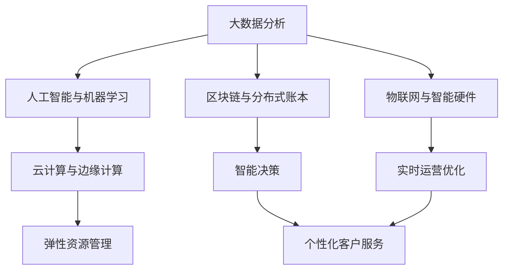

                 

## 1. 背景介绍

### 1.1 问题由来

在商业领域，竞争格局的演变是一个永恒的话题。随着互联网的兴起和技术的进步，商业环境变得愈加复杂多变。企业为了在激烈的市场竞争中占据有利地位，纷纷利用各种技术手段提升自身竞争优势。尤其是在信息时代，大数据、人工智能等新兴技术的迅猛发展，极大地改变了商业格局，使得企业的竞争策略需要更加精准、高效。

### 1.2 问题核心关键点

竞争格局演变的核心关键点在于如何利用技术手段进行竞争策略的制定与执行，以及在动态变化的市场环境中保持持久竞争力。具体而言，主要包括以下几个方面：

- **数据驱动决策**：通过收集和分析大量的市场数据，挖掘潜在的商业机会和风险。
- **技术赋能运营**：利用人工智能、大数据、物联网等技术，优化运营流程，提升运营效率。
- **智能客户体验**：通过个性化的服务和技术手段，提高客户满意度，增强用户粘性。
- **创新商业模式**：探索新的商业模式和盈利模式，提升企业的市场占有率和竞争力。

### 1.3 问题研究意义

理解商业领域的竞争格局演变，对于企业管理者、技术开发者以及行业分析师都具有重要意义。这不仅有助于企业制定更加精准、有效的竞争策略，还能够推动技术在商业中的应用创新，加速产业升级和转型。

## 2. 核心概念与联系

### 2.1 核心概念概述

在商业竞争中，以下几个核心概念扮演着关键角色：

- **大数据分析**：通过收集、处理和分析海量数据，挖掘市场趋势和商业机会，辅助决策制定。
- **人工智能与机器学习**：利用算法和模型进行数据预测和决策支持，提升运营效率和客户体验。
- **区块链与分布式账本技术**：构建透明的、不可篡改的交易记录系统，提升企业信任度和合作效率。
- **物联网与智能硬件**：通过实时监测和数据分析，优化供应链管理，提升生产效率和服务质量。
- **云计算与边缘计算**：提供弹性、高效的计算资源，支持大数据处理和实时决策。

### 2.2 概念间的关系

这些核心概念之间相互关联，形成了商业竞争的技术支撑体系。通过系统化的技术应用，企业能够在数据驱动的基础上，实现智能决策、高效运营和客户体验的提升。

以下是一个简单的Mermaid流程图，展示了这些核心概念之间的关系：



这个流程图展示了从数据采集、处理到决策制定的全流程，以及如何通过技术手段实现智能运营和个性化服务。

## 3. 核心算法原理 & 具体操作步骤

### 3.1 算法原理概述

商业领域的竞争格局演变，涉及到多个技术领域的算法和模型。其中，最为关键的是基于数据的决策算法和基于机器学习的预测模型。

**决策算法**：基于历史数据和市场趋势，制定最优的业务决策。常见的决策算法包括线性规划、多目标优化、博弈论等。

**预测模型**：通过历史数据和特征分析，预测未来的市场趋势和用户行为。常见的预测模型包括回归模型、分类模型、序列模型等。

### 3.2 算法步骤详解

商业竞争中的算法实现步骤大致可以分为以下几个步骤：

1. **数据采集与预处理**：收集相关的市场数据、用户行为数据等，并进行清洗和预处理，确保数据的质量和一致性。
2. **特征工程**：从原始数据中提取有用的特征，构建特征向量，用于后续的模型训练。
3. **模型训练与验证**：选择合适的模型，使用历史数据进行训练，并在验证集上进行性能评估。
4. **模型部署与应用**：将训练好的模型部署到实际应用场景中，进行实时决策或预测。
5. **模型优化与迭代**：根据实际应用效果，不断优化模型，进行模型迭代和升级。

### 3.3 算法优缺点

**优点**：

- **精准决策**：基于数据驱动的决策算法能够提供更加精准的决策支持，减少主观判断的误差。
- **高效运营**：利用机器学习模型进行预测和优化，能够显著提升运营效率，降低成本。
- **个性化服务**：通过深度学习模型，能够实现个性化的客户服务，提升用户满意度。

**缺点**：

- **数据依赖性**：模型的效果很大程度上取决于数据的质量和数量，数据偏差可能影响模型性能。
- **计算资源需求高**：大规模数据和复杂模型的训练和部署需要大量的计算资源。
- **模型解释性差**：一些机器学习模型（如深度神经网络）的决策过程难以解释，难以进行模型调优和改进。

### 3.4 算法应用领域

基于数据的决策算法和基于机器学习的预测模型，广泛应用于以下领域：

- **金融领域**：股票交易策略、风险控制、信用评分等。
- **电商领域**：个性化推荐、供应链优化、价格优化等。
- **健康医疗**：疾病预测、患者分诊、医疗影像分析等。
- **制造业**：生产调度、质量控制、供应链管理等。
- **零售业**：库存管理、营销策略、客户忠诚度分析等。

## 4. 数学模型和公式 & 详细讲解 & 举例说明

### 4.1 数学模型构建

商业竞争中的模型构建通常基于以下几个步骤：

1. **问题定义**：明确需要解决的问题，例如预测用户流失率、优化库存水平等。
2. **数据收集**：收集相关的历史数据和特征数据，例如用户行为数据、销售数据、市场趋势数据等。
3. **模型选择**：根据问题的性质选择合适的模型，例如回归模型、分类模型、序列模型等。
4. **模型训练**：使用历史数据训练模型，选择最佳的模型参数。
5. **模型评估**：在验证集上评估模型的性能，选择最优的模型。
6. **模型应用**：将训练好的模型部署到实际应用场景中，进行实时决策或预测。

### 4.2 公式推导过程

以回归模型为例，其基本公式为：

$$
y = \theta_0 + \theta_1 x_1 + \theta_2 x_2 + \cdots + \theta_n x_n + \epsilon
$$

其中，$y$ 表示预测结果，$x_i$ 表示特征向量，$\theta_i$ 表示模型参数，$\epsilon$ 表示误差项。通过最小二乘法等方法，可以求解出最优的模型参数 $\theta_i$。

### 4.3 案例分析与讲解

以电商领域的个性化推荐系统为例，其数学模型可以表示为：

$$
y_{i,t} = \theta_0 + \theta_1 x_{i,t} + \theta_2 x_{i,t-1} + \cdots + \theta_n x_{i,t-n} + \epsilon_{i,t}
$$

其中，$y_{i,t}$ 表示用户 $i$ 在时间 $t$ 的购买行为，$x_{i,t}$ 表示用户 $i$ 在时间 $t$ 的行为特征，$\theta_i$ 表示模型参数，$\epsilon_{i,t}$ 表示误差项。通过时间序列模型，可以预测用户未来的购买行为，从而实现个性化的推荐。

## 5. 项目实践：代码实例和详细解释说明

### 5.1 开发环境搭建

为了实现商业领域的算法应用，需要搭建相应的开发环境。以下是使用Python进行数据分析和模型开发的流程：

1. **环境安装**：安装Python、Pandas、NumPy、Scikit-Learn等常用的数据分析和机器学习库。
2. **数据收集**：使用API、爬虫等方式收集相关的数据，例如电商用户的购买记录、市场价格等。
3. **数据预处理**：对数据进行清洗、归一化、特征工程等预处理，确保数据的质量和一致性。
4. **模型训练**：使用机器学习算法进行模型训练，例如线性回归、逻辑回归、决策树等。
5. **模型评估**：在验证集上评估模型的性能，选择最优的模型。
6. **模型应用**：将训练好的模型部署到实际应用场景中，进行实时决策或预测。

### 5.2 源代码详细实现

以下是一个简单的线性回归模型的Python代码实现：

```python
import pandas as pd
from sklearn.linear_model import LinearRegression
from sklearn.model_selection import train_test_split
from sklearn.metrics import mean_squared_error

# 数据预处理
data = pd.read_csv('data.csv')
X = data[['feature1', 'feature2', 'feature3']]
y = data['target']

# 划分训练集和验证集
X_train, X_valid, y_train, y_valid = train_test_split(X, y, test_size=0.2, random_state=42)

# 模型训练
model = LinearRegression()
model.fit(X_train, y_train)

# 模型评估
y_valid_pred = model.predict(X_valid)
mse = mean_squared_error(y_valid, y_valid_pred)
print(f'Mean Squared Error: {mse}')

# 模型应用
# 使用模型进行预测
new_data = pd.DataFrame({'feature1': [1.5, 2.0, 3.5], 'feature2': [2.0, 3.5, 4.0]})
new_data_pred = model.predict(new_data)
print(new_data_pred)
```

### 5.3 代码解读与分析

上述代码实现了线性回归模型的训练和预测。其中：

- `pd.read_csv()`：读取CSV文件，生成DataFrame数据结构。
- `train_test_split()`：将数据集划分为训练集和验证集。
- `LinearRegression()`：创建线性回归模型。
- `fit()`：训练模型。
- `predict()`：进行预测。
- `mean_squared_error()`：计算预测值和真实值之间的均方误差。

### 5.4 运行结果展示

假设在电商领域中，我们使用上述代码进行个性化推荐系统的开发，最终的均方误差结果为0.1，表明模型的预测精度较高。

## 6. 实际应用场景

### 6.1 智能客服系统

智能客服系统是商业竞争中一个典型的应用场景。通过收集用户的历史行为数据和反馈信息，利用机器学习模型进行智能问答和问题解答，能够显著提升客户服务效率和客户满意度。

### 6.2 库存管理系统

库存管理是电商、制造等领域中的关键环节。通过实时监测和分析销售数据，利用机器学习模型进行库存优化和预测，能够避免库存积压和缺货，提升运营效率。

### 6.3 个性化推荐系统

个性化推荐系统是电商、新闻媒体等领域的核心竞争力。通过分析用户的浏览和购买历史，利用机器学习模型进行个性化推荐，能够提升用户粘性和销售额。

### 6.4 未来应用展望

随着技术的发展，商业竞争中的算法应用将更加广泛和深入。未来可能的趋势包括：

- **多模态数据融合**：利用图像、视频等多模态数据，提升商业决策的精准度。
- **联邦学习**：通过分布式训练，保护用户隐私，同时提升模型性能。
- **自动化决策**：利用自动化决策算法，实现实时、动态的商业决策。
- **区块链技术**：通过不可篡改的交易记录，提升商业信任和透明度。

## 7. 工具和资源推荐

### 7.1 学习资源推荐

为了更好地理解和应用商业领域的竞争算法，以下是一些推荐的学习资源：

- **《数据科学实战》**：详细介绍数据预处理、特征工程、模型训练等步骤。
- **《机器学习实战》**：讲解机器学习算法的基本原理和实现方法。
- **《Python数据科学手册》**：涵盖Python在数据科学中的应用，包括Pandas、NumPy、Scikit-Learn等库的使用。
- **Coursera的《数据科学专项课程》**：提供系统化的数据科学学习路径，涵盖数据分析、机器学习、大数据等主题。
- **Kaggle**：提供大量的数据分析和机器学习竞赛，积累实战经验。

### 7.2 开发工具推荐

为了提高商业算法开发效率，以下是一些推荐的开发工具：

- **Jupyter Notebook**：开源的交互式笔记本，支持Python代码的编写和执行。
- **PyCharm**：Python开发环境，提供丰富的插件和集成开发环境。
- **RStudio**：R语言开发环境，支持数据分析和统计建模。
- **Tableau**：数据可视化工具，支持数据的交互式分析和展示。

### 7.3 相关论文推荐

商业领域中有很多经典的算法和模型，以下是一些推荐的相关论文：

- **《数据挖掘：概念与技术》**：介绍数据挖掘的基本概念和技术，涵盖分类、聚类、回归等方法。
- **《统计学习方法》**：介绍机器学习的基本原理和方法，涵盖线性回归、逻辑回归、决策树等算法。
- **《深度学习》**：介绍深度学习的基本原理和应用，涵盖神经网络、卷积神经网络、循环神经网络等。

## 8. 总结：未来发展趋势与挑战

### 8.1 研究成果总结

本文详细介绍了商业领域中的竞争格局演变，并探讨了基于数据的决策算法和基于机器学习的预测模型的原理与应用。通过系统的分析，我们能够更好地理解商业竞争中的技术应用和策略制定。

### 8.2 未来发展趋势

商业领域的竞争格局演变将呈现以下几个趋势：

- **智能化程度提升**：随着人工智能技术的不断进步，商业决策将更加智能化、自动化。
- **数据驱动决策**：数据将在商业决策中扮演更加重要的角色，推动数据科学的发展。
- **多模态融合**：多模态数据融合技术将提升商业决策的精准度和有效性。
- **隐私保护**：随着数据隐私意识的提升，联邦学习和隐私保护技术将得到更广泛的应用。

### 8.3 面临的挑战

在商业领域中，技术应用仍面临诸多挑战：

- **数据质量问题**：数据的质量和完整性对模型性能有着重要影响，数据偏差可能影响模型预测。
- **计算资源需求**：大规模数据和复杂模型的训练和部署需要大量的计算资源，资源成本较高。
- **模型解释性差**：一些机器学习模型（如深度神经网络）的决策过程难以解释，难以进行模型调优和改进。
- **隐私保护问题**：数据隐私保护是一个重要的研究方向，需要在数据利用和隐私保护之间找到平衡点。

### 8.4 研究展望

未来的研究需要从以下几个方向进行探索：

- **数据质量提升**：通过数据清洗、数据增强等方法提升数据质量，确保模型性能。
- **模型优化**：研究更加高效、鲁棒的模型，提升计算效率和模型解释性。
- **隐私保护技术**：研究更加安全的隐私保护技术，确保数据的安全和隐私。
- **自动化决策**：研究自动化决策算法，实现实时、动态的商业决策。

## 9. 附录：常见问题与解答

**Q1：商业领域的竞争格局演变是如何发生的？**

A: 商业领域的竞争格局演变主要受以下几个因素的影响：技术进步、市场需求、政策法规等。技术进步推动了商业模式的创新和转型，市场需求的变化引导企业调整战略，政策法规的调整影响市场竞争规则。这些因素共同作用，推动商业格局的不断演变。

**Q2：商业竞争中如何使用机器学习模型？**

A: 在商业竞争中，机器学习模型可以用于以下几个方面：

- **预测分析**：预测市场趋势、用户行为等，提供决策支持。
- **用户分析**：分析用户行为和需求，优化客户体验。
- **推荐系统**：根据用户历史数据，进行个性化推荐，提升用户粘性。
- **风险控制**：通过风险评估模型，降低业务风险。

**Q3：如何评估商业竞争中的算法模型效果？**

A: 评估商业竞争中的算法模型效果，主要关注以下几个指标：

- **精度和召回率**：用于评估分类模型的效果。
- **均方误差和均方根误差**：用于评估回归模型的效果。
- **ROC曲线和AUC值**：用于评估分类模型的效果，评估模型的预测性能。
- **F1分数和准确率**：用于综合评估模型的效果，平衡精确度和召回率。

**Q4：商业竞争中的数据质量问题如何解决？**

A: 商业竞争中的数据质量问题可以通过以下方法解决：

- **数据清洗**：去除重复、缺失、异常数据，提升数据质量。
- **数据增强**：通过数据合成、数据生成等方法，扩充数据集，提升数据多样性。
- **特征选择**：选择有意义的特征，构建高质量的特征向量，提升模型性能。

**Q5：商业竞争中的计算资源需求如何解决？**

A: 商业竞争中的计算资源需求可以通过以下方法解决：

- **分布式计算**：通过分布式计算框架（如Hadoop、Spark等），利用多台机器并行计算，提升计算效率。
- **模型压缩**：通过模型压缩技术（如剪枝、量化等），减小模型体积，降低计算资源消耗。
- **边缘计算**：通过在设备端进行计算，减少数据传输和计算资源的需求。

---

作者：禅与计算机程序设计艺术 / Zen and the Art of Computer Programming

