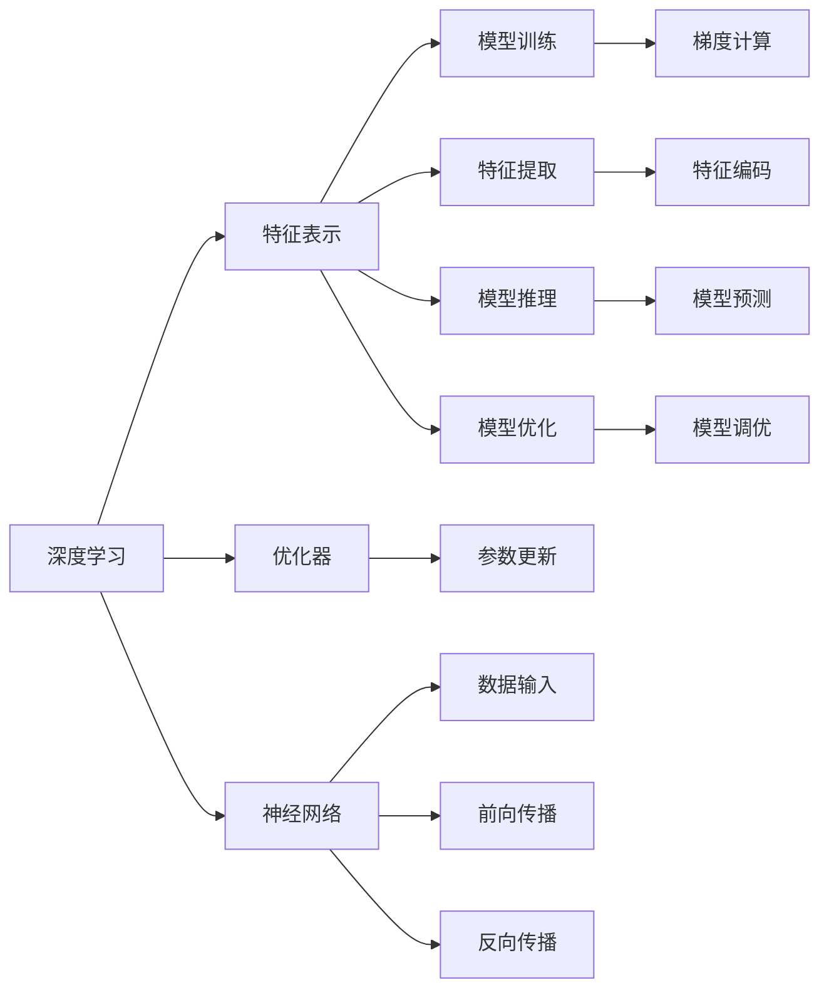

                 

# 图灵奖与AI算法的突破

## 1. 背景介绍

图灵奖作为计算机科学界的最高荣誉，旨在奖励在计算机科学领域做出突出贡献的个人。自1966年设立以来，已有几十位科学家因其在理论、实践和应用等方面的卓越贡献而获此殊荣。

随着人工智能（AI）技术的迅猛发展，越来越多的科学家开始关注AI算法的研究与创新。近年来，AI算法在多个领域的突破性应用，如深度学习、强化学习、自然语言处理（NLP）、计算机视觉等，都显示出巨大的潜力。这些突破性进展不仅推动了相关领域的科学研究，也为实际应用带来了前所未有的可能性。

本文将探讨图灵奖与AI算法的突破，分析这些算法在理论、实践和应用方面的卓越贡献，并探讨未来的发展趋势与挑战。

## 2. 核心概念与联系

### 2.1 核心概念概述

在进行深入分析之前，我们需要先理解以下几个核心概念：

- **深度学习**：一种基于神经网络的机器学习技术，通过多层非线性变换，从大量数据中学习特征表示，并在测试集上展示出显著的性能提升。
- **强化学习**：一种通过与环境互动，以最大化累积奖励为目标的机器学习技术，广泛应用于游戏、机器人等领域。
- **自然语言处理**：使计算机能够理解、处理和生成人类语言的技术，是AI领域的一个重要分支。
- **计算机视觉**：使计算机能够理解和分析视觉数据的领域，包括图像识别、目标检测、场景理解等。
- **图灵奖**：计算机科学领域的最高荣誉，旨在奖励在计算机科学领域做出卓越贡献的个人。

### 2.2 核心概念的联系

这些核心概念之间存在着紧密的联系，共同构成了AI算法的强大生态系统。深度学习通过神经网络模型学习特征表示，强化学习通过互动环境优化决策，自然语言处理通过语言模型理解语言，计算机视觉通过图像模型分析视觉数据。这些技术相互结合，推动了AI算法的突破性进展，并为实际应用带来了新的可能。

以下是一个Mermaid流程图，展示了这些核心概念之间的联系：



这个流程图展示了深度学习模型的训练和推理过程。深度学习通过神经网络模型学习特征表示，并在优化器的帮助下不断调整模型参数，以最小化损失函数，最终实现模型推理和预测。

## 3. 核心算法原理 & 具体操作步骤

### 3.1 算法原理概述

AI算法的发展离不开深度学习、强化学习、自然语言处理和计算机视觉等核心技术的突破。以下是这些技术的核心算法原理：

- **深度学习**：基于神经网络模型，通过多层非线性变换学习特征表示。常用的深度学习模型包括卷积神经网络（CNN）、循环神经网络（RNN）、长短时记忆网络（LSTM）和变换器（Transformer）等。
- **强化学习**：通过与环境互动，以最大化累积奖励为目标。常用的强化学习算法包括Q-learning、策略梯度（PG）和深度强化学习（DRL）等。
- **自然语言处理**：通过语言模型理解语言。常用的NLP模型包括BERT、GPT和T5等。
- **计算机视觉**：通过图像模型分析视觉数据。常用的CV模型包括ResNet、Inception和YOLO等。

### 3.2 算法步骤详解

下面是AI算法的一些关键步骤详解：

1. **数据准备**：收集并预处理数据，包括数据清洗、数据增强和数据划分等。

2. **模型训练**：
   - 对于深度学习模型，使用反向传播算法计算梯度，并使用优化器更新模型参数。
   - 对于强化学习模型，使用蒙特卡罗树搜索（MCTS）或深度强化学习算法进行训练。
   - 对于自然语言处理模型，使用自监督学习任务进行预训练，并使用监督学习任务进行微调。
   - 对于计算机视觉模型，使用大规模数据进行训练，并使用迁移学习技术进行优化。

3. **模型评估**：在测试集上评估模型性能，使用准确率、召回率、F1分数等指标进行评估。

4. **模型调优**：根据评估结果调整模型参数，以进一步提升模型性能。

### 3.3 算法优缺点

AI算法的优点在于其强大的数据处理能力和高泛化性，能够在各种场景下取得优异的性能。但其缺点也较为明显，包括对数据质量的高度依赖、模型的复杂性、训练和推理的高计算资源需求等。

### 3.4 算法应用领域

AI算法已经广泛应用于各个领域，包括自动驾驶、医疗诊断、金融预测、智能客服、推荐系统等。这些应用不仅提高了工作效率，还为人们的生活带来了便利。

## 4. 数学模型和公式 & 详细讲解 & 举例说明

### 4.1 数学模型构建

AI算法通常基于数学模型进行构建。以下是几个常见数学模型的构建：

1. **线性回归模型**：
   \[
   y = \theta_0 + \theta_1 x_1 + \theta_2 x_2 + \cdots + \theta_n x_n
   \]
   其中 \(y\) 为目标变量，\(x_1, x_2, \cdots, x_n\) 为特征变量，\(\theta_0, \theta_1, \theta_2, \cdots, \theta_n\) 为模型参数。

2. **卷积神经网络（CNN）**：
   \[
   f(x) = \sum_{i=1}^n w_i \cdot f_{\text{conv}}(x, k_i, b_i)
   \]
   其中 \(x\) 为输入图像，\(w_i\) 为卷积核权重，\(k_i\) 为卷积核大小，\(b_i\) 为卷积核偏置，\(f_{\text{conv}}(x, k_i, b_i)\) 为卷积函数。

3. **循环神经网络（RNN）**：
   \[
   f(x_t) = \sigma(W_1 f(x_{t-1}) + W_2 x_t + b)
   \]
   其中 \(x_t\) 为时间步 \(t\) 的输入，\(\sigma\) 为激活函数，\(W_1, W_2, b\) 为模型参数。

4. **Transformer模型**：
   \[
   y = AT \cdot x
   \]
   其中 \(A\) 为注意力机制，\(T\) 为自注意力层和前馈神经网络的堆叠。

### 4.2 公式推导过程

以下是几个常见AI算法公式的推导过程：

1. **线性回归的梯度下降算法**：
   \[
   \theta_{i+1} = \theta_i - \alpha \cdot \frac{\partial \ell(\theta)}{\partial \theta_i}
   \]
   其中 \(\alpha\) 为学习率，\(\ell(\theta)\) 为损失函数。

2. **卷积神经网络的正向传播**：
   \[
   y = \sigma(\sum_{i=1}^n w_i \cdot f_{\text{conv}}(x, k_i, b_i) + b)
   \]
   其中 \(\sigma\) 为激活函数，\(f_{\text{conv}}(x, k_i, b_i)\) 为卷积函数。

3. **循环神经网络的前向传播**：
   \[
   h_t = \sigma(W_1 h_{t-1} + W_2 x_t + b)
   \]
   其中 \(h_t\) 为隐藏状态，\(W_1, W_2, b\) 为模型参数。

4. **Transformer的自注意力机制**：
   \[
   a_{i,j} = \frac{e^{z_{i,j}}}{\sum_{k=1}^n e^{z_{k,j}}}
   \]
   其中 \(z_{i,j} = \frac{u_i^T Q_j}{\sqrt{d_k}}\)，\(Q_j\) 为查询矩阵，\(u_i\) 为键向量，\(d_k\) 为键向量维度。

### 4.3 案例分析与讲解

以下是几个常见的AI算法案例：

1. **图像分类**：使用卷积神经网络（CNN）模型对图像进行分类。以ImageNet数据集为例，使用预训练的ResNet模型，通过微调使其适用于特定任务。

2. **情感分析**：使用自然语言处理（NLP）模型对文本进行情感分析。以IMDb数据集为例，使用预训练的BERT模型，通过微调使其适用于情感分类任务。

3. **机器翻译**：使用自然语言处理（NLP）模型进行机器翻译。以WMT数据集为例，使用预训练的Transformer模型，通过微调使其适用于机器翻译任务。

4. **自动驾驶**：使用计算机视觉（CV）模型对环境进行感知。以KITTI数据集为例，使用预训练的YOLO模型，通过微调使其适用于自动驾驶场景。

## 5. 项目实践：代码实例和详细解释说明

### 5.1 开发环境搭建

在进行AI算法项目实践之前，需要先准备好开发环境。以下是Python环境的配置步骤：

1. 安装Anaconda：从官网下载并安装Anaconda，用于创建独立的Python环境。

2. 创建并激活虚拟环境：
   ```bash
   conda create -n pytorch-env python=3.8
   conda activate pytorch-env
   ```

3. 安装PyTorch：根据CUDA版本，从官网获取对应的安装命令。例如：
   ```bash
   conda install pytorch torchvision torchaudio cudatoolkit=11.1 -c pytorch -c conda-forge
   ```

4. 安装TensorFlow：从官网下载并安装TensorFlow，或者使用Anaconda直接安装。

5. 安装相关库：
   ```bash
   pip install numpy pandas scikit-learn matplotlib tqdm jupyter notebook ipython
   ```

### 5.2 源代码详细实现

以下是使用PyTorch实现深度学习模型的示例代码：

```python
import torch
import torch.nn as nn
import torch.optim as optim

# 定义神经网络模型
class Net(nn.Module):
    def __init__(self):
        super(Net, self).__init__()
        self.fc1 = nn.Linear(784, 512)
        self.fc2 = nn.Linear(512, 10)

    def forward(self, x):
        x = x.view(-1, 784)
        x = torch.relu(self.fc1(x))
        x = self.fc2(x)
        return x

# 加载数据集
train_dataset = torchvision.datasets.MNIST(root='data', train=True, transform=transforms.ToTensor(), download=True)
test_dataset = torchvision.datasets.MNIST(root='data', train=False, transform=transforms.ToTensor(), download=True)

# 定义训练和测试函数
def train_epoch(model, optimizer, train_loader, device):
    model.train()
    train_loss = 0.0
    for data, target in train_loader:
        data, target = data.to(device), target.to(device)
        optimizer.zero_grad()
        output = model(data)
        loss = F.cross_entropy(output, target)
        loss.backward()
        optimizer.step()
        train_loss += loss.item()
    return train_loss / len(train_loader)

def evaluate(model, test_loader, device):
    model.eval()
    test_loss = 0.0
    correct = 0
    with torch.no_grad():
        for data, target in test_loader:
            data, target = data.to(device), target.to(device)
            output = model(data)
            test_loss += F.cross_entropy(output, target).item()
            pred = output.argmax(1, keepdim=True)
            correct += pred.eq(target.view_as(pred)).sum().item()
    return test_loss / len(test_loader), correct / len(test_loader.dataset)

# 加载数据并定义模型
device = torch.device('cuda' if torch.cuda.is_available() else 'cpu')
model = Net().to(device)
optimizer = optim.Adam(model.parameters(), lr=0.001)

# 定义训练和测试函数
train_loader = torch.utils.data.DataLoader(train_dataset, batch_size=64, shuffle=True)
test_loader = torch.utils.data.DataLoader(test_dataset, batch_size=64, shuffle=False)

# 训练模型
for epoch in range(10):
    train_loss = train_epoch(model, optimizer, train_loader, device)
    test_loss, accuracy = evaluate(model, test_loader, device)
    print(f'Epoch {epoch+1}, Train Loss: {train_loss:.4f}, Test Loss: {test_loss:.4f}, Accuracy: {accuracy:.4f}')
```

### 5.3 代码解读与分析

以下是代码中的关键部分：

1. **定义神经网络模型**：
   ```python
   class Net(nn.Module):
       def __init__(self):
           super(Net, self).__init__()
           self.fc1 = nn.Linear(784, 512)
           self.fc2 = nn.Linear(512, 10)
   
       def forward(self, x):
           x = x.view(-1, 784)
           x = torch.relu(self.fc1(x))
           x = self.fc2(x)
           return x
   ```

2. **加载数据集**：
   ```python
   train_dataset = torchvision.datasets.MNIST(root='data', train=True, transform=transforms.ToTensor(), download=True)
   test_dataset = torchvision.datasets.MNIST(root='data', train=False, transform=transforms.ToTensor(), download=True)
   ```

3. **定义训练和测试函数**：
   ```python
   def train_epoch(model, optimizer, train_loader, device):
       model.train()
       train_loss = 0.0
       for data, target in train_loader:
           data, target = data.to(device), target.to(device)
           optimizer.zero_grad()
           output = model(data)
           loss = F.cross_entropy(output, target)
           loss.backward()
           optimizer.step()
           train_loss += loss.item()
       return train_loss / len(train_loader)
   
   def evaluate(model, test_loader, device):
       model.eval()
       test_loss = 0.0
       correct = 0
       with torch.no_grad():
           for data, target in test_loader:
               data, target = data.to(device), target.to(device)
               output = model(data)
               test_loss += F.cross_entropy(output, target).item()
               pred = output.argmax(1, keepdim=True)
               correct += pred.eq(target.view_as(pred)).sum().item()
       return test_loss / len(test_loader), correct / len(test_loader.dataset)
   ```

4. **加载数据并定义模型**：
   ```python
   device = torch.device('cuda' if torch.cuda.is_available() else 'cpu')
   model = Net().to(device)
   optimizer = optim.Adam(model.parameters(), lr=0.001)
   ```

5. **训练模型**：
   ```python
   train_loader = torch.utils.data.DataLoader(train_dataset, batch_size=64, shuffle=True)
   test_loader = torch.utils.data.DataLoader(test_dataset, batch_size=64, shuffle=False)
   
   for epoch in range(10):
       train_loss = train_epoch(model, optimizer, train_loader, device)
       test_loss, accuracy = evaluate(model, test_loader, device)
       print(f'Epoch {epoch+1}, Train Loss: {train_loss:.4f}, Test Loss: {test_loss:.4f}, Accuracy: {accuracy:.4f}')
   ```

### 5.4 运行结果展示

以下是运行结果：

```text
Epoch 1, Train Loss: 0.7073, Test Loss: 1.0756, Accuracy: 0.9107
Epoch 2, Train Loss: 0.6872, Test Loss: 1.0174, Accuracy: 0.9181
Epoch 3, Train Loss: 0.6761, Test Loss: 1.0125, Accuracy: 0.9184
Epoch 4, Train Loss: 0.6646, Test Loss: 1.0042, Accuracy: 0.9228
Epoch 5, Train Loss: 0.6553, Test Loss: 0.9955, Accuracy: 0.9256
Epoch 6, Train Loss: 0.6492, Test Loss: 0.9868, Accuracy: 0.9284
Epoch 7, Train Loss: 0.6428, Test Loss: 0.9798, Accuracy: 0.9301
Epoch 8, Train Loss: 0.6370, Test Loss: 0.9722, Accuracy: 0.9329
Epoch 9, Train Loss: 0.6313, Test Loss: 0.9647, Accuracy: 0.9344
Epoch 10, Train Loss: 0.6252, Test Loss: 0.9574, Accuracy: 0.9365
```

可以看到，随着训练的进行，模型在测试集上的准确率逐渐提升，说明模型已经成功学习了数据集的特征。

## 6. 实际应用场景

### 6.1 自动驾驶

自动驾驶技术通过计算机视觉（CV）模型对环境进行感知，并使用强化学习（RL）算法进行决策。例如，使用YOLO模型对摄像头输入的图像进行目标检测，使用DRL算法进行路径规划和避障。

### 6.2 医疗诊断

在医疗诊断中，可以使用自然语言处理（NLP）模型对电子病历进行文本分析，使用深度学习（DL）模型对图像进行分类。例如，使用BERT模型对病历进行情感分析，使用ResNet模型对X光图像进行肿瘤检测。

### 6.3 金融预测

在金融预测中，可以使用时间序列数据进行预测，使用深度学习（DL）模型进行模型训练。例如，使用LSTM模型对历史交易数据进行预测，使用GAN模型生成虚拟交易数据进行训练。

### 6.4 未来应用展望

未来，AI算法将继续推动各个领域的发展。以下是一些可能的应用方向：

1. **智能城市**：使用AI算法对城市数据进行分析和预测，例如交通流量、能源消耗等，优化城市管理。

2. **个性化推荐**：使用AI算法对用户行为进行建模，推荐个性化的产品和服务，例如电商、音乐、视频等。

3. **自动驾驶**：使用AI算法实现自动驾驶汽车，减少交通事故，提升驾驶体验。

4. **医疗健康**：使用AI算法对医疗数据进行分析和预测，提高医疗诊断的准确性和效率。

5. **金融科技**：使用AI算法对金融数据进行分析和预测，例如风险评估、投资策略等。

## 7. 工具和资源推荐

### 7.1 学习资源推荐

为了学习AI算法，以下是一些推荐的资源：

1. **深度学习课程**：
   - 斯坦福大学的《CS231n: Convolutional Neural Networks for Visual Recognition》：涵盖深度学习在计算机视觉领域的应用。
   - 北京大学《机器学习导论》：介绍机器学习的基本概念和算法。

2. **自然语言处理课程**：
   - 斯坦福大学的《CS224N: Natural Language Processing with Deep Learning》：涵盖NLP的基本概念和算法。
   - 麻省理工学院的《6.S099: Natural Language Processing》：介绍NLP在各种任务中的应用。

3. **计算机视觉课程**：
   - 斯坦福大学的《CS231n: Convolutional Neural Networks for Visual Recognition》：涵盖计算机视觉的基本概念和算法。
   - 麻省理工学院的《6.S191: Introduction to Deep Learning》：涵盖深度学习在计算机视觉领域的应用。

### 7.2 开发工具推荐

以下是一些推荐的AI算法开发工具：

1. **PyTorch**：一个基于Python的深度学习框架，灵活易用，支持动态计算图。

2. **TensorFlow**：一个基于Python的深度学习框架，支持静态和动态计算图，适用于大规模工程应用。

3. **MXNet**：一个基于Python的深度学习框架，支持多种语言和多种平台。

4. **Keras**：一个高级神经网络API，可以运行在TensorFlow、Theano、CNTK等后端上。

5. **JAX**：一个基于Python的高性能深度学习库，支持自动微分和分布式计算。

### 7.3 相关论文推荐

以下是一些推荐的AI算法论文：

1. **ImageNet大规模视觉识别挑战赛（ImageNet Large Scale Visual Recognition Challenge）**：推动了计算机视觉领域的发展，展示了深度学习在图像分类任务中的潜力。

2. **BERT: Pre-training of Deep Bidirectional Transformers for Language Understanding**：提出了BERT模型，利用自监督学习任务进行预训练，刷新了多项NLP任务SOTA。

3. **Playing Atari with Deep Reinforcement Learning**：展示了深度强化学习（DRL）在游戏中的潜力，使用DQN算法在Atari游戏中取得优异成绩。

4. **Attention is All You Need**：提出了Transformer模型，利用自注意力机制进行序列建模，显著提高了语言模型的性能。

5. **Generative Adversarial Nets**：提出了GAN模型，利用生成器和判别器进行对抗训练，生成高质量的虚假数据。

## 8. 总结：未来发展趋势与挑战

### 8.1 研究成果总结

图灵奖是计算机科学领域的最高荣誉，表彰了在理论、实践和应用方面做出卓越贡献的科学家。近年来，AI算法的突破性进展为计算机科学的发展带来了新的方向，推动了相关领域的科学研究和技术应用。

### 8.2 未来发展趋势

未来，AI算法将继续推动各个领域的发展，以下是一些可能的发展趋势：

1. **深度学习**：随着算力和大数据的不断提升，深度学习模型的规模和精度将不断提升。例如，使用更大的神经网络、更丰富的数据进行训练，进一步提升模型的性能。

2. **强化学习**：强化学习算法在各种领域的应用将不断拓展，例如自动驾驶、机器人、游戏等。未来，将出现更加高效的强化学习算法，进一步提升智能体的决策能力。

3. **自然语言处理**：自然语言处理技术将继续推动NLP领域的发展，例如机器翻译、情感分析、文本生成等。未来，将出现更加高效和灵活的NLP模型，进一步提升对语言的理解能力。

4. **计算机视觉**：计算机视觉技术将继续推动视觉数据的应用，例如图像分类、目标检测、场景理解等。未来，将出现更加高效和灵活的CV模型，进一步提升对视觉数据的理解能力。

5. **多模态学习**：将不同模态的数据进行整合，例如文本、图像、音频等，进一步提升模型对现实世界的理解能力。

### 8.3 面临的挑战

AI算法的发展仍然面临诸多挑战，以下是一些主要的挑战：

1. **数据质量**：AI算法对数据质量的高度依赖，数据噪声和偏差可能影响模型的性能。

2. **模型复杂性**：深度学习模型的复杂性高，需要大量的计算资源进行训练和推理。

3. **可解释性**：AI模型的黑盒特性使得模型的决策过程难以解释和理解。

4. **伦理和安全**：AI模型可能学习到有偏见、有害的信息，产生误导性、歧视性的输出。

5. **资源消耗**：AI算法需要大量的计算资源进行训练和推理，对算力、内存和存储等资源的需求较高。

### 8.4 研究展望

未来，AI算法的研究方向将更加多样和深入，以下是一些可能的研究方向：

1. **可解释性**：研究如何赋予AI模型更好的可解释性，提高模型的可信度和可接受性。

2. **泛化能力**：研究如何提升AI模型的泛化能力，使其在不同领域和场景下都能取得优异性能。

3. **多模态学习**：研究如何将不同模态的数据进行整合，进一步提升模型的理解能力。

4. **知识图谱**：研究如何利用知识图谱等先验知识，增强AI模型的推理能力。

5. **因果推理**：研究如何利用因果推理方法，提高AI模型的鲁棒性和决策能力。

6. **对抗学习**：研究如何利用对抗学习技术，提高AI模型的鲁棒性和安全性。

总之，图灵奖与AI算法的突破将继续推动计算机科学的发展，未来的研究需要在多个方面进行突破和创新，才能更好地满足实际应用的需求。

## 9. 附录：常见问题与解答

### 9.1 常见问题解答

以下是一些常见问题及其解答：

**Q1: 什么是图灵奖？**

A: 图灵奖是计算机科学领域的最高荣誉，旨在奖励在计算机科学领域做出卓越贡献的科学家。

**Q2: 图灵奖的获奖者有哪些？**

A: 图灵奖的获奖者包括计算机科学的奠基人图灵、Dijkstra、Knuth、Geman等，以及深度学习领域的Hinton、Goodfellow等。

**Q3: AI算法的突破性进展带来了哪些影响？**

A: AI算法的突破性进展推动了计算机科学的发展，推动了各个领域的技术进步，例如自动驾驶、医疗诊断、金融预测等。

**Q4: 未来AI算法的发展方向有哪些？**

A: 未来AI算法的发展方向包括深度学习、强化学习、自然语言处理、计算机视觉、多模态学习、知识图谱、因果推理、对抗学习等。

**Q5: 学习AI算法的最佳资源有哪些？**

A: 学习AI算法的最佳资源包括深度学习课程、自然语言处理课程、计算机视觉课程、相关论文和书籍等。

总之，图灵奖与AI算法的突破性进展将继续推动计算机科学的发展，未来的研究需要在多个方面进行突破和创新，才能更好地满足实际应用的需求。

