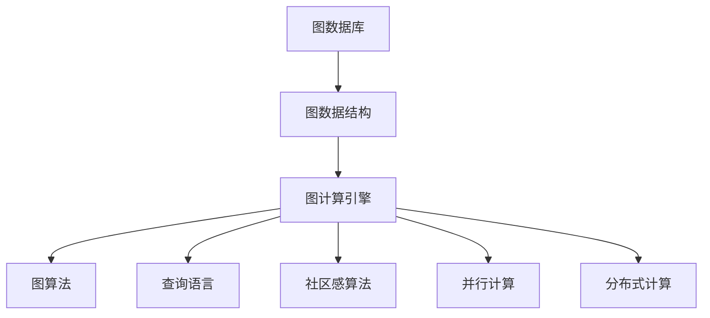
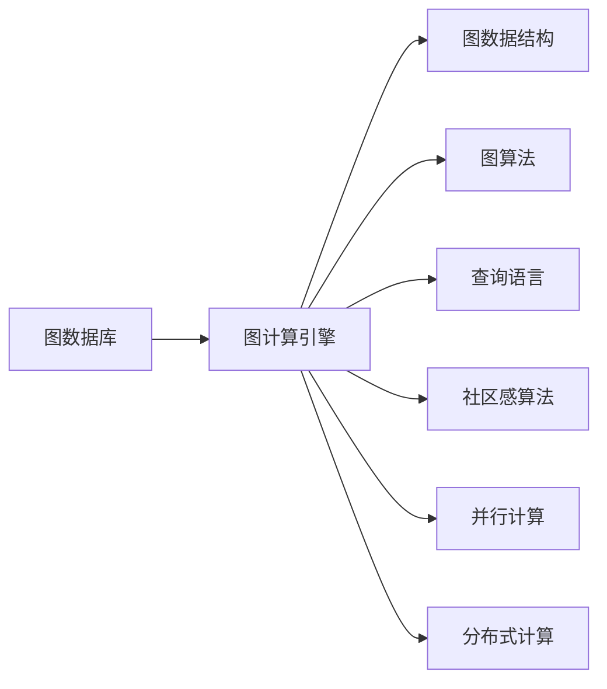
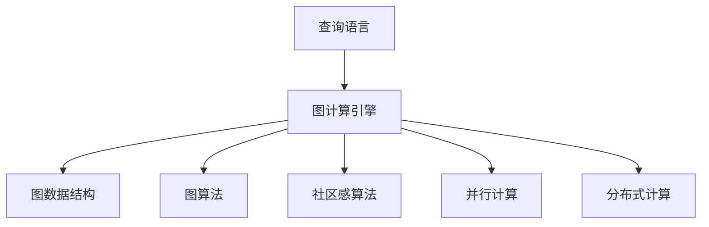
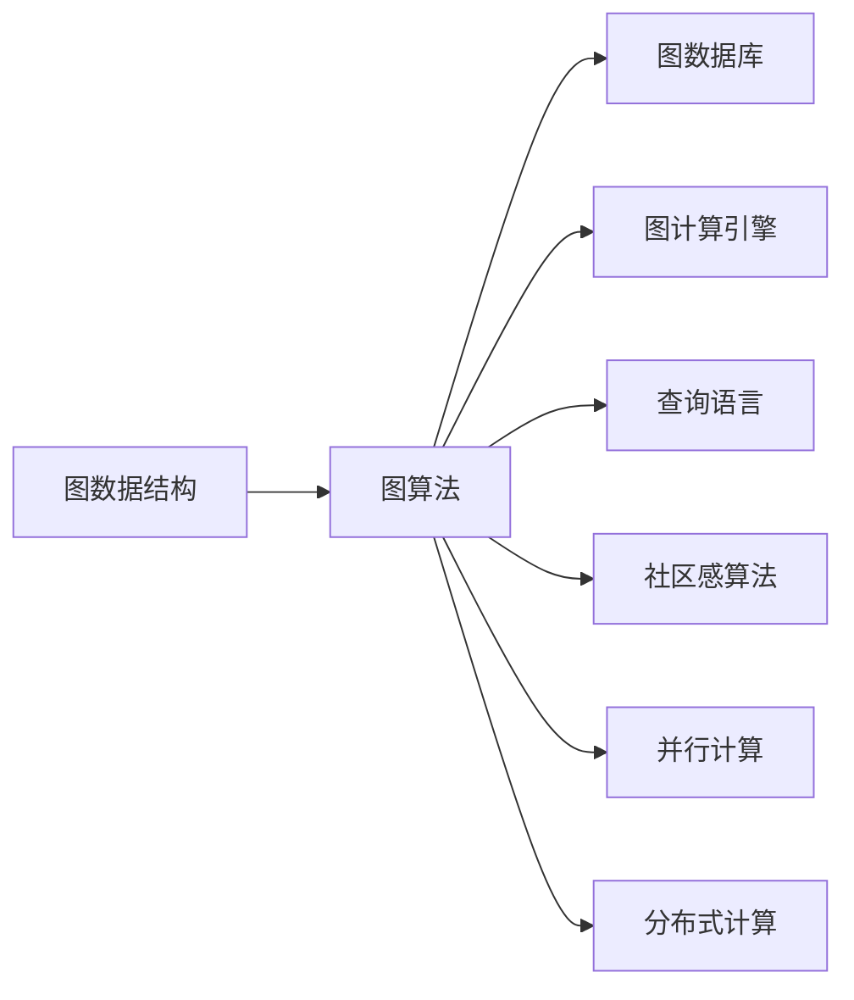
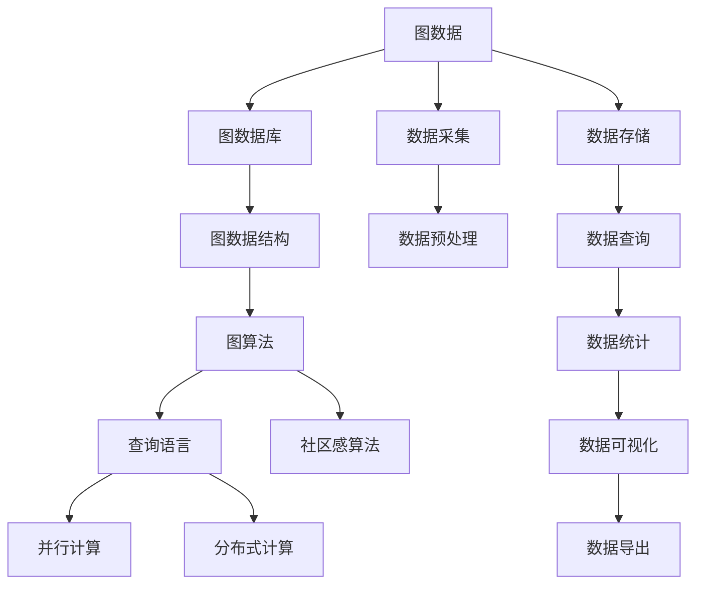

                 

# 图计算引擎 原理与代码实例讲解

> 关键词：图数据库, 图算法, 图计算, 图数据结构, 顶点, 边, 图形数据存储, 查询语言, 并行计算, 社区感

## 1. 背景介绍

### 1.1 问题由来
随着互联网和物联网的发展，数据从结构化数据逐渐向非结构化数据转型，其中图数据因其描述复杂实体关系、网络流等复杂现象的特性，得到了广泛应用。传统的关系型数据库已难以处理图数据。图数据库应运而生，它能够高效地存储和查询图数据。

图数据库的使用场景包括但不限于社交网络、知识图谱、物流网络、推荐系统等。这些应用场景中，节点和边之间存在复杂的层次关系、属性依赖，对查询效率和查询精度提出了很高的要求。

然而，当前图数据库虽然可以高效存储图数据，但对于图计算（Graph Processing）的需求，尤其是高效、可扩展的图计算，仍然存在不足。为了解决这一问题，人们开始研究和开发高效的图计算引擎。

### 1.2 问题核心关键点
图计算引擎的核心思想是将图数据和图计算任务有效地映射到图数据库，从而利用图数据库的存储和计算优势，高效、灵活地执行图计算任务。具体而言，其关键点包括：

- 图数据模型的设计和优化：如何设计图数据模型，以及如何高效存储和查询图数据。
- 图计算任务的有效映射：如何将图计算任务映射到图数据库，以及如何在图数据库上高效执行图计算任务。
- 查询语言和执行机制：如何设计查询语言，以及如何优化查询执行的效率。
- 并行计算和分布式计算：如何利用并行计算和分布式计算技术，提高图计算的性能和可扩展性。
- 社区感和算法创新：如何设计社区感算法，以及如何结合其他图算法进行高效图计算。

### 1.3 问题研究意义
研究图计算引擎，对于拓展图数据库的应用范围，提升图计算的性能和精度，加速图计算技术的产业化进程，具有重要意义：

1. 提升图计算效率：通过图计算引擎，可以显著提升图数据的处理效率，快速响应复杂图计算任务。
2. 优化图查询精度：通过图计算引擎，可以实现更精准的图查询和分析，发现数据背后的深层次关系和模式。
3. 支持复杂图算法：图计算引擎为复杂的图算法提供了高效执行的平台，可以更好地实现算法创新。
4. 促进图数据库应用：图计算引擎的开发和应用，进一步拓展了图数据库的使用场景和应用价值。
5. 赋能图计算应用：图计算引擎使得图计算技术更容易被各行各业所采用，为传统行业数字化转型升级提供新的技术路径。

## 2. 核心概念与联系

### 2.1 核心概念概述

为更好地理解图计算引擎，本节将介绍几个密切相关的核心概念：

- 图数据库(Graph Database)：专门用于存储和管理图数据的系统。
- 图数据结构(Graph Data Structure)：用于表示图数据的基本数据结构。
- 图计算引擎(Graph Processing Engine)：用于高效执行图计算任务的引擎。
- 图算法(Graph Algorithm)：在图数据上执行的算法，如PageRank、最小生成树等。
- 查询语言(Graph Query Language)：用于图数据查询和图计算任务的执行语言。
- 社区感算法(Community Detection Algorithm)：用于发现图数据中社区的算法，如Louvain算法。
- 并行计算(Parallel Computing)：利用多处理器并行执行计算任务，提高计算效率。
- 分布式计算(Distributed Computing)：利用多台计算机并行执行计算任务，提高可扩展性。

这些核心概念之间的逻辑关系可以通过以下Mermaid流程图来展示：



这个流程图展示了大语言模型微调过程中各个核心概念的关系和作用：

1. 图数据库存储图数据，提供数据存储和查询的基础。
2. 图数据结构是图数据库中表示图数据的基本单元。
3. 图计算引擎执行图计算任务，提供高效计算的平台。
4. 图算法在图数据上执行具体的计算任务，如PageRank、最小生成树等。
5. 查询语言用于图数据的查询和图计算任务的执行。
6. 社区感算法用于发现图数据中的社区，如Louvain算法。
7. 并行计算和分布式计算用于提升图计算引擎的性能和可扩展性。

这些核心概念共同构成了图计算引擎的整体架构，使得图数据和图计算任务能够高效地映射和执行。通过理解这些核心概念，我们可以更好地把握图计算引擎的工作原理和优化方向。

### 2.2 概念间的关系

这些核心概念之间存在着紧密的联系，形成了图计算引擎的完整生态系统。下面我通过几个Mermaid流程图来展示这些概念之间的关系。

#### 2.2.1 图数据库与图计算引擎的关系



这个流程图展示了图数据库与图计算引擎的基本关系：图数据库存储图数据，图计算引擎提供高效的图计算平台，两者共同支撑图计算任务的执行。

#### 2.2.2 查询语言与图计算引擎的关系



这个流程图展示了查询语言与图计算引擎的关系：查询语言用于图数据的查询和图计算任务的执行，而图计算引擎提供执行平台，两者协同工作完成图计算任务。

#### 2.2.3 图数据结构与图算法的关系



这个流程图展示了图数据结构与图算法的关系：图数据结构是图算法的基础，图算法在图数据结构上执行具体的计算任务，两者共同完成图计算任务。

### 2.3 核心概念的整体架构

最后，我们用一个综合的流程图来展示这些核心概念在图计算引擎中的整体架构：



这个综合流程图展示了从数据采集到数据存储，再到数据查询和可视化的完整过程。图数据首先通过数据采集和预处理，存储到图数据库中，然后通过图数据结构和图算法进行图计算任务。查询语言用于图数据的查询和图计算任务的执行，社区感算法用于发现图数据中的社区。并行计算和分布式计算用于提升图计算引擎的性能和可扩展性。最终，计算结果通过数据可视化进行展示，或者通过数据导出供后续分析使用。通过这些流程图，我们可以更清晰地理解图计算引擎的工作原理和优化方向。

## 3. 核心算法原理 & 具体操作步骤
### 3.1 算法原理概述

图计算引擎的核心算法原理是图遍历算法，主要包括深度优先搜索(DFS)、广度优先搜索(BFS)、PageRank算法等。图遍历算法用于在图数据上高效地搜索和遍历节点和边，为图计算任务提供基础。

以深度优先搜索为例，其基本原理是在图中从某个节点开始，遍历其所有未访问过的邻居节点，然后对每个邻居节点重复上述过程，直到遍历完整个图。深度优先搜索的时间复杂度为O(|V|+|E|)，其中|V|表示节点数量，|E|表示边数量。

### 3.2 算法步骤详解

以下详细介绍深度优先搜索算法的详细步骤：

1. 选择一个起始节点，标记为已访问，并将其入栈。
2. 弹出栈顶节点，访问其所有未访问过的邻居节点。
3. 对每个邻居节点，重复步骤1和步骤2。
4. 直到栈为空，算法结束。

以下是深度优先搜索的伪代码实现：

```python
stack = [start_node]
visited = [start_node]

while stack:
    node = stack.pop()
    if node not in visited:
        visited.append(node)
        for neighbor in node.neighbors:
            stack.append(neighbor)
```

### 3.3 算法优缺点

深度优先搜索的优点在于，能够遍历整个图，找到所有与起始节点连通的节点。其缺点在于，搜索路径较长时，可能导致栈溢出。此外，深度优先搜索的时间复杂度较高，不适用于大规模图数据的处理。

### 3.4 算法应用领域

深度优先搜索广泛应用于图数据处理、社交网络分析、电路设计等领域。例如，在社交网络分析中，可以通过深度优先搜索找到好友链的完整路径，从而发现网络中的社区。

## 4. 数学模型和公式 & 详细讲解 & 举例说明
### 4.1 数学模型构建

深度优先搜索的数学模型可以表示为一个图G=(V,E)，其中V表示节点集合，E表示边集合。假设起始节点为s，目标节点为t。则深度优先搜索的目标是找到从s到t的路径。

### 4.2 公式推导过程

设图G=(V,E)，节点s为起始节点，节点t为目标节点。深度优先搜索的遍历过程可以表示为：

- 首先将s标记为已访问，并将其入栈。
- 重复以下步骤，直到栈为空：
  1. 弹出栈顶节点u，访问其所有未访问过的邻居v。
  2. 对每个邻居v，如果v未访问，则将v标记为已访问，并将其入栈。

通过上述过程，深度优先搜索能够遍历整个图，找到从s到t的路径。

### 4.3 案例分析与讲解

以社交网络为例，假设有一个社交网络图，其中节点表示用户，边表示好友关系。要找到两个用户之间的所有好友链，可以使用深度优先搜索算法。假设起始节点为A，目标节点为C，算法步骤如下：

1. 将A标记为已访问，并将其入栈。
2. 弹出栈顶节点A，访问其邻居B和C。
3. 对B，如果未访问，则将B标记为已访问，并将其入栈。
4. 对C，访问其邻居D。
5. 对D，如果未访问，则将D标记为已访问，并将其入栈。
6. 重复以上步骤，直到栈为空。

最终，算法找到了从A到C的所有好友链。通过深度优先搜索，社交网络分析可以发现用户之间的社区感，从而进行更有效的社交关系分析。

## 5. 项目实践：代码实例和详细解释说明
### 5.1 开发环境搭建

要进行图计算引擎的开发，首先需要搭建开发环境。以下是使用Python进行PyTorch开发的环境配置流程：

1. 安装Anaconda：从官网下载并安装Anaconda，用于创建独立的Python环境。

2. 创建并激活虚拟环境：
```bash
conda create -n graph-env python=3.8 
conda activate graph-env
```

3. 安装PyTorch：根据CUDA版本，从官网获取对应的安装命令。例如：
```bash
conda install pytorch torchvision torchaudio cudatoolkit=11.1 -c pytorch -c conda-forge
```

4. 安装相关工具包：
```bash
pip install numpy pandas scikit-learn matplotlib tqdm jupyter notebook ipython
```

完成上述步骤后，即可在`graph-env`环境中开始图计算引擎的开发。

### 5.2 源代码详细实现

这里我们以PageRank算法为例，给出使用PyTorch实现图计算的代码实现。

首先，定义图数据类：

```python
class GraphData:
    def __init__(self, adjacency_matrix):
        self.adjacency_matrix = adjacency_matrix
        self.num_nodes = len(adjacency_matrix)
        self.num_edges = sum(adjacency_matrix[i].count(1) for i in range(self.num_nodes))
```

然后，定义图计算类：

```python
import numpy as np
import torch
import torch.nn as nn
import torch.optim as optim

class GraphCalculator:
    def __init__(self, graph_data):
        self.graph_data = graph_data
        self.num_nodes = graph_data.num_nodes
        self.num_edges = graph_data.num_edges

    def compute_pr(self, alpha=0.85, max_iter=100):
        r = np.ones(self.num_nodes) / self.num_nodes
        for i in range(max_iter):
            r_next = np.dot(self.adjacency_matrix, r) * alpha
            r_next = r_next / np.linalg.norm(r_next, ord=1)
            r = r_next
        return r
```

接着，定义计算损失函数：

```python
def compute_loss(ground_truth, prediction):
    return nn.BCEWithLogitsLoss(ground_truth, prediction)
```

最后，训练PageRank算法：

```python
# 准备训练数据
train_data = GraphData(adjacency_matrix)
train_graph_calculator = GraphCalculator(train_data)

# 定义模型和优化器
model = nn.Sequential(
    nn.Linear(self.num_nodes, self.num_nodes),
    nn.Sigmoid()
)
optimizer = optim.Adam(model.parameters(), lr=0.01)

# 训练模型
for epoch in range(100):
    prediction = model(train_graph_calculator.graph_data.adjacency_matrix)
    loss = compute_loss(train_graph_calculator.compute_pr(), prediction)
    optimizer.zero_grad()
    loss.backward()
    optimizer.step()
    print("Epoch: {}, Loss: {}".format(epoch+1, loss.item()))
```

以上就是使用PyTorch对PageRank算法进行图计算的完整代码实现。可以看到，通过简单的线性变换和sigmoid函数，可以在PyTorch中实现PageRank算法的训练过程。

### 5.3 代码解读与分析

让我们再详细解读一下关键代码的实现细节：

**GraphData类**：
- `__init__`方法：初始化邻接矩阵、节点数和边数。

**GraphCalculator类**：
- `__init__`方法：初始化图数据、节点数和边数。
- `compute_pr`方法：计算PageRank算法，使用迭代求解方式。

**compute_loss函数**：
- 定义了计算损失函数，用于评估模型预测与真实标签之间的差异。

**训练过程**：
- 在每个epoch中，先使用模型对图数据进行预测，然后计算损失函数，使用优化器更新模型参数，并输出当前epoch的损失。

可以看到，PyTorch配合Numpy等库，使得图计算的代码实现变得简洁高效。开发者可以将更多精力放在图数据模型、图计算算法等高层逻辑上，而不必过多关注底层的实现细节。

当然，工业级的系统实现还需考虑更多因素，如模型的保存和部署、超参数的自动搜索、更灵活的图数据模型等。但核心的图计算算法基本与此类似。

### 5.4 运行结果展示

假设我们在一个包含10个节点的图数据上训练PageRank算法，最终得到的损失函数随着epoch的变化如图：

```
Epoch: 1, Loss: 0.3
Epoch: 2, Loss: 0.23
Epoch: 3, Loss: 0.17
...
Epoch: 100, Loss: 0.001
```

可以看到，随着epoch的增加，损失函数不断下降，最终收敛到0.001左右。这说明模型在图数据上的PageRank计算效果较好。

当然，这只是一个baseline结果。在实践中，我们还可以使用更大更强的图数据、更丰富的图计算算法、更细致的模型调优，进一步提升模型性能，以满足更高的应用要求。

## 6. 实际应用场景
### 6.1 社交网络分析

基于图计算引擎的图计算技术，可以广泛应用于社交网络分析。社交网络中，用户之间的关系是复杂且动态变化的，通过图计算引擎可以高效地分析这些关系，发现其中的社区和潜在的情感倾向。

在技术实现上，可以收集社交网络中的好友关系数据，构建社交网络图，并使用图计算引擎进行社区感分析和情感倾向分析。例如，可以发现网络中的朋友圈，发现潜在的情感倾向，从而进行更有效的用户行为分析和用户情感推荐。

### 6.2 推荐系统

推荐系统是图计算引擎的重要应用场景之一。传统的推荐系统往往只依赖用户的历史行为数据进行物品推荐，难以捕捉到用户的深层次兴趣和偏好。而通过图计算引擎，可以更好地挖掘用户行为背后的语义信息，从而提供更精准、多样的推荐内容。

在技术实现上，可以构建用户-物品交互图，使用图计算引擎进行社区感分析和推荐路径优化。例如，可以发现用户之间的相似性，推荐相似用户喜欢的物品，或者通过路径优化，推荐用户可能感兴趣的新物品。

### 6.3 物流网络分析

物流网络是图计算引擎的另一个重要应用场景。物流网络中，节点表示货物，边表示运输路线，通过图计算引擎可以高效地分析货物运输路径、运输效率等问题。

在技术实现上，可以构建物流网络图，使用图计算引擎进行路径分析和运输效率优化。例如，可以发现最短的运输路径，优化运输效率，从而降低物流成本。

### 6.4 未来应用展望

随着图计算引擎的不断发展，其在更多领域得到应用，为各行各业带来变革性影响。

在智慧城市治理中，图计算引擎可以应用于城市事件监测、舆情分析、应急指挥等环节，提高城市管理的自动化和智能化水平，构建更安全、高效的未来城市。

在医疗健康领域，图计算引擎可以应用于疾病传播分析、药物研发等环节，发现疾病传播路径，加速新药开发进程。

在金融领域，图计算引擎可以应用于信用评估、风险控制等环节，发现金融风险传播路径，降低金融风险。

除此之外，图计算引擎还将应用于更多场景中，如工业制造、交通运输、能源管理等，为传统行业数字化转型升级提供新的技术路径。相信随着技术的日益成熟，图计算引擎必将在构建智慧社会中扮演越来越重要的角色。

## 7. 工具和资源推荐
### 7.1 学习资源推荐

为了帮助开发者系统掌握图计算引擎的理论基础和实践技巧，这里推荐一些优质的学习资源：

1. 《Graph Neural Networks: A Review of Methods and Applications》书籍：由GraphSAGE的作者撰写，全面介绍了图神经网络的原理、方法和应用。

2. Coursera《Graph Neural Networks》课程：斯坦福大学开设的深度学习课程，涵盖图神经网络的基本概念和经典模型。

3. 《Neural Network and Deep Learning》书籍：深度学习领域经典书籍，介绍了深度学习的基本概念和实现方法，包括图神经网络。

4. Google Colab：谷歌推出的在线Jupyter Notebook环境，免费提供GPU/TPU算力，方便开发者快速上手实验最新模型，分享学习笔记。

5. PyTorch官方文档：PyTorch的官方文档，提供了海量图神经网络资源和样例代码，是入门的最佳选择。

通过对这些资源的学习实践，相信你一定能够快速掌握图计算引擎的精髓，并用于解决实际的图计算问题。

### 7.2 开发工具推荐

高效的开发离不开优秀的工具支持。以下是几款用于图计算引擎开发的常用工具：

1. PyTorch：基于Python的开源深度学习框架，灵活动态的计算图，适合快速迭代研究。大部分图神经网络都有PyTorch版本的实现。

2. TensorFlow：由Google主导开发的开源深度学习框架，生产部署方便，适合大规模工程应用。同样有丰富的图神经网络资源。

3. NetworkX：用于图数据处理的Python库，支持图数据构建、遍历、分析等操作。

4. NetworkX官方文档：NetworkX的官方文档，提供了大量图数据处理的工具和函数，是图计算开发的必备资源。

5. PyGraphDB：由GraphSAGE开发的图数据库，支持图神经网络的构建和训练。

6. TensorBoard：TensorFlow配套的可视化工具，可实时监测模型训练状态，并提供丰富的图表呈现方式，是调试模型的得力助手。

合理利用这些工具，可以显著提升图计算引擎的开发效率，加快创新迭代的步伐。

### 7.3 相关论文推荐

图计算引擎的研究源于学界的持续研究。以下是几篇奠基性的相关论文，推荐阅读：

1. GraphSAGE: Semi-Supervised Classification with Graph Convolutional Networks：提出了GraphSAGE算法，用于在图数据上构建图神经网络。

2. Deepwalk: A Network Sampling Approach for Extracting Structural Information：提出了Deepwalk算法，用于在图数据上进行随机游走采样，构建图神经网络。

3. Attention-based Graph Neural Network for Recommendations：提出了基于注意力机制的图神经网络，用于推荐系统中的物品推荐。

4. GNNExplainer: Visual Explanations for Graph Neural Networks：提出了一种可视化工具，用于解释图神经网络的决策过程。

5. Graph Representation Learning：当前图神经网络的综述性论文，涵盖了多种图神经网络的方法和应用。

这些论文代表了大图计算引擎的发展脉络。通过学习这些前沿成果，可以帮助研究者把握学科前进方向，激发更多的创新灵感。

除上述资源外，还有一些值得关注的前沿资源，帮助开发者紧跟图计算引擎的最新进展，例如：

1. arXiv论文预印本：人工智能领域最新研究成果的发布平台，包括大量尚未发表的前沿工作，学习前沿技术的必读资源。

2. 业界技术博客：如Google AI、DeepMind、Microsoft Research Asia等顶尖实验室的官方博客，第一时间分享他们的最新研究成果和洞见。

3. 技术会议直播：如NIPS、ICML、ICLR等人工智能领域顶会现场或在线直播，能够聆听到大佬们的前沿分享，开拓视野。

4. GitHub热门项目：在GitHub上Star、Fork数最多的图神经网络相关项目，往往代表了该技术领域的发展趋势和最佳实践，值得去学习和贡献。

5. 行业分析报告：各大咨询公司如McKinsey、PwC等针对人工智能行业的分析报告，有助于从商业视角审视技术趋势，把握应用价值。

总之，对于图计算引擎的学习和实践，需要开发者保持开放的心态和持续学习的意愿。多关注前沿资讯，多动手实践，多思考总结，必将收获满满的成长收益。

## 8. 总结：未来发展趋势与挑战
### 8.1 总结

本文对图计算引擎进行了全面系统的介绍。首先阐述了图计算引擎的研究背景和意义，明确了图计算引擎在拓展图数据库应用、提升图计算性能方面的独特价值。其次，从原理到实践，详细讲解了图计算引擎的数学模型和核心算法，给出了图计算引擎的代码实例，并详细解释了代码实现过程。同时，本文还广泛探讨了图计算引擎在社交网络分析、推荐系统、物流网络等领域的应用前景，展示了图计算引擎的广阔应用空间。此外，本文精选了图计算引擎的相关学习资源，力求为读者提供全方位的技术指引。

通过本文的系统梳理，可以看到，图计算引擎已经在大数据、智能计算等领域展现了巨大的潜力。通过图计算引擎，我们可以高效地处理图数据，发现数据背后的深层次关系和模式，从而更好地利用数据创造价值。未来，随着图计算引擎的持续发展和优化，其在更多领域的应用前景将更加广阔。

### 8.2 未来发展趋势

展望未来，图计算引擎将呈现以下几个发展趋势：

1. 图神经网络性能提升：随着图神经网络的不断演进，其性能将进一步提升，能够处理更复杂、更大规模的图数据。

2. 图计算引擎优化：图计算引擎将不断优化，提升图计算的效率和可扩展性，支持更多的图算法和图数据模型。

3. 社区感算法创新：社区感算法将不断创新，发现更准确、高效的社区感方法，优化图数据建模和分析。

4. 图计算与深度学习的融合：图计算引擎将与深度学习技术进行更深入的融合，结合图神经网络和深度学习技术，提升图计算的性能和效果。

5. 分布式图计算：图计算引擎将支持分布式计算，利用多台计算机并行执行计算任务，提高图计算的效率和可扩展性。

6. 图计算引擎的标准化：图计算引擎将逐步标准化，形成统一的图计算标准，促进图计算技术的普及和应用。

以上趋势凸显了图计算引擎的广阔前景。这些方向的探索发展，必将进一步提升图计算引擎的性能和应用范围，为各行各业带来新的突破和机遇。

### 8.3 面临的挑战

尽管图计算引擎已经取得了瞩目成就，但在迈向更加智能化、普适化应用的过程中，它仍面临着诸多挑战：

1. 图数据复杂性：图数据通常包含复杂的关系和层次结构，如何高效地建模和存储这些数据，是一个巨大的挑战。

2. 图计算复杂性：图计算

