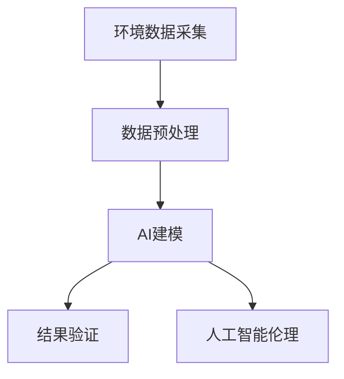
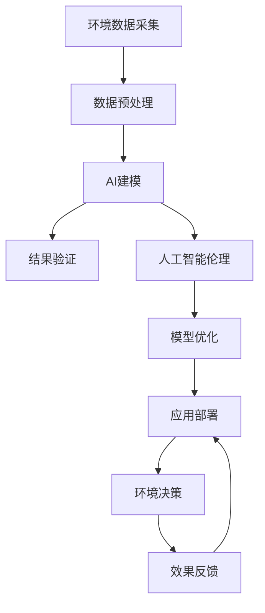

                 

## 1. 背景介绍

### 1.1 问题由来
在人工智能(AI)迅猛发展的背景下，AI技术正逐渐渗透到地球环境科学的研究与治理之中，带来了前所未有的机遇与挑战。环境AI的融合，不仅能够助力提升环境监测与治理的效率和精度，还可以驱动环境保护与生态修复的多元创新。然而，AI与环境科学的深度融合，仍需克服诸多技术难题，如模型训练数据获取、结果验证与验证方法、人工智能伦理与安全等问题。

### 1.2 问题核心关键点
AI与环境科学的融合，核心在于将AI技术应用于环境数据处理与分析、环境监测与预警、环境管理与决策等方面。通过数据驱动，优化环境治理策略与行动方案，降低环境污染与生态破坏风险。

### 1.3 问题研究意义
环境AI的融合，对于推动环境科学与工程创新、实现绿色低碳发展、提高环境治理能力、促进可持续发展具有重要意义。借助AI技术，可以实现环境数据的智能采集与分析，提供精准的环境监测与预警服务，支撑环境决策与规划，助力实现“双碳”目标，建设美丽中国。

## 2. 核心概念与联系

### 2.1 核心概念概述

环境AI是指将人工智能技术应用于环境监测与治理的各个环节，包括数据处理、分析与建模、预测与预警、管理与决策等。环境AI的核心概念包括：

- **环境数据采集**：通过各种传感器、遥感卫星等手段，获取环境数据。
- **数据预处理**：清洗、整合、归一化、增强等数据处理技术，提升数据质量。
- **AI建模**：基于机器学习、深度学习等技术，构建环境预测与决策模型。
- **结果验证**：利用专业知识与实验验证，评估AI模型的准确性与可靠性。
- **人工智能伦理**：考虑数据隐私、算法偏见、结果解释等问题，确保AI决策的公平性与透明度。

### 2.2 概念间的关系

环境AI融合的核心框架如图示：



该框架展示了环境AI融合的完整流程。首先，从多源环境数据采集与预处理开始，构建AI模型进行环境预测与决策。其次，结果验证与人工智能伦理，确保AI决策的科学性与公平性。

### 2.3 核心概念的整体架构

以下是一个综合的流程图，展示环境AI融合的整体架构：



该架构展示了从数据采集到环境决策的完整流程，并强调了反馈与优化环节，确保AI决策的持续改进与优化。

## 3. 核心算法原理 & 具体操作步骤
### 3.1 算法原理概述

环境AI融合的算法原理，基于机器学习与深度学习技术，构建环境预测与决策模型。其核心思想是：

1. **数据驱动**：通过海量环境数据训练AI模型，优化环境监测与治理策略。
2. **模型优化**：利用大数据与高性能计算，构建高效、泛化性能强的模型。
3. **结果验证**：使用专业知识与实验验证，评估模型的准确性与可靠性。
4. **伦理考虑**：确保AI决策的公平性、透明性与安全性。

### 3.2 算法步骤详解

环境AI融合主要包括以下几个关键步骤：

**Step 1: 数据采集与预处理**

- **数据来源**：选择多源数据来源，如传感器数据、遥感卫星数据、气象数据、污染数据等。
- **数据清洗**：清洗缺失、异常值等不完整数据。
- **数据整合**：整合来自不同数据源的环境数据。
- **数据增强**：利用数据增强技术，提升数据样本的多样性。

**Step 2: AI建模**

- **模型选择**：选择合适的机器学习与深度学习模型，如回归模型、分类模型、神经网络模型等。
- **模型训练**：利用数据集进行模型训练，优化模型参数。
- **模型评估**：使用验证集评估模型性能，选择合适的超参数。
- **模型部署**：将训练好的模型部署到实际应用环境中。

**Step 3: 结果验证**

- **精度验证**：利用实验数据验证模型的准确性与可靠性。
- **鲁棒性测试**：测试模型的鲁棒性与泛化性能。
- **多源验证**：结合多源数据进行模型验证，提升验证结果的可靠性。

**Step 4: 人工智能伦理**

- **数据隐私**：确保数据采集与使用的合法性与隐私保护。
- **算法偏见**：识别与纠正算法偏见，提升模型公平性。
- **结果解释**：确保AI决策结果的可解释性与透明性。

### 3.3 算法优缺点

环境AI融合的优势：
1. 提升了环境监测与治理的效率与精度。
2. 优化了环境决策与治理策略。
3. 推动了环境科学研究与创新的发展。

然而，环境AI融合也面临诸多挑战：
1. 数据获取难度大，数据质量参差不齐。
2. 模型训练与验证需要高性能计算资源。
3. AI决策的公平性与透明度问题。
4. 模型泛化性与鲁棒性问题。

### 3.4 算法应用领域

环境AI融合技术，已广泛应用于以下几个领域：

- **空气质量监测**：利用传感器与遥感数据，构建空气质量预测模型。
- **水质监测**：使用水质传感器与水质模型，进行水质实时监测与预测。
- **气象预测**：结合卫星与气象数据，构建气象预测模型。
- **森林火情监测**：利用遥感与地面数据，进行森林火情预警与防控。
- **海洋污染监测**：使用卫星与海洋探测数据，进行海洋环境监测与治理。
- **城市环境管理**：结合多源数据，构建城市环境综合管理模型。

## 4. 数学模型和公式 & 详细讲解  
### 4.1 数学模型构建

环境AI融合的数学模型构建，主要包括以下几个关键步骤：

1. **数据采集**：通过传感器与遥感数据获取环境数据。
2. **数据预处理**：清洗与整合数据，准备输入特征。
3. **模型训练**：利用机器学习或深度学习模型训练预测模型。
4. **结果验证**：通过实验数据验证模型性能。

### 4.2 公式推导过程

以空气质量预测模型为例，推导其数学模型与公式。

假设输入特征为 $x=(x_1,x_2,\dots,x_n)$，输出为 $y$，表示空气质量指标。

设环境模型为 $f(x; \theta)$，其中 $\theta$ 为模型参数。模型训练目标为最小化预测误差 $L(y,f(x))$。

假设损失函数为均方误差，则有：

$$
L(y,f(x)) = \frac{1}{N}\sum_{i=1}^N (y_i - f(x_i))^2
$$

通过梯度下降等优化算法，求解模型参数 $\theta$：

$$
\theta \leftarrow \theta - \eta \nabla_{\theta}L(y,f(x))
$$

其中 $\eta$ 为学习率，$\nabla_{\theta}L(y,f(x))$ 为损失函数对模型参数的梯度。

### 4.3 案例分析与讲解

以水质监测模型为例，分析其构建过程与模型优化方法。

**数据采集**：
- 采集水质传感器数据、气象数据、污染源数据等。

**数据预处理**：
- 清洗缺失数据，整合多源数据。

**模型构建**：
- 构建多变量回归模型，如线性回归、决策树等。

**模型优化**：
- 使用正则化、交叉验证等方法，优化模型参数。

**结果验证**：
- 在验证集上评估模型性能，使用均方误差、R^2等指标。

## 5. 项目实践：代码实例和详细解释说明
### 5.1 开发环境搭建

以下是使用Python的TensorFlow进行环境AI融合项目开发的配置流程：

1. 安装Anaconda：从官网下载并安装Anaconda，用于创建独立的Python环境。

2. 创建并激活虚拟环境：
```bash
conda create -n env_name python=3.8 
conda activate env_name
```

3. 安装TensorFlow：根据CUDA版本，从官网获取对应的安装命令。例如：
```bash
conda install tensorflow tensorflow-gpu -c conda-forge
```

4. 安装TensorBoard：用于可视化模型训练过程。

5. 安装其他必要工具包：
```bash
pip install numpy pandas sklearn
```

完成上述步骤后，即可在虚拟环境中开始项目开发。

### 5.2 源代码详细实现

以下是一个基于TensorFlow的空气质量预测模型的代码实现：

```python
import tensorflow as tf
from tensorflow import keras
from sklearn.model_selection import train_test_split
import numpy as np

# 数据加载与预处理
def load_data():
    # 读取数据
    x = np.load('x.npy')
    y = np.load('y.npy')
    # 数据拆分
    x_train, x_test, y_train, y_test = train_test_split(x, y, test_size=0.2)
    return x_train, x_test, y_train, y_test

# 模型构建
def build_model():
    model = keras.Sequential([
        keras.layers.Dense(64, activation='relu', input_shape=(x_train.shape[1],)),
        keras.layers.Dense(1)
    ])
    model.compile(optimizer=tf.keras.optimizers.Adam(0.001),
                  loss='mse',
                  metrics=['mae', 'mse'])
    return model

# 模型训练与评估
def train_model(model, x_train, y_train, x_test, y_test):
    model.fit(x_train, y_train, epochs=100, validation_data=(x_test, y_test))
    loss, mae, mse = model.evaluate(x_test, y_test)
    print(f'Test loss: {loss:.4f}')
    print(f'Test mae: {mae:.4f}')
    print(f'Test mse: {mse:.4f}')

# 模型部署与预测
def deploy_model(model, x_new):
    y_pred = model.predict(x_new)
    print(f'Predicted air quality: {y_pred[0]}')
```

在代码中，我们使用TensorFlow的Keras API构建并训练了一个简单的线性回归模型，用于预测空气质量。

### 5.3 代码解读与分析

以下是关键代码的实现细节：

**load_data函数**：
- 加载并拆分数据集。
- 使用NumPy加载数据，并进行拆分。

**build_model函数**：
- 构建一个简单的线性回归模型。
- 使用Sequential模型定义模型结构。
- 添加两个全连接层，并使用Adam优化器。

**train_model函数**：
- 使用训练集训练模型。
- 使用测试集评估模型性能。
- 输出模型的损失与均方误差。

**deploy_model函数**：
- 使用训练好的模型进行新样本预测。
- 输出预测结果。

## 6. 实际应用场景
### 6.1 智慧水务系统

基于环境AI融合的智慧水务系统，可以通过智能传感器与数据分析，实现水资源的高效管理与优化。

具体而言，智慧水务系统可以通过实时监测水质与水量，构建水质预测与优化模型，优化用水结构与水质处理，提升水资源利用效率。例如，在城市供水系统中，系统可以预测用水高峰期，提前调蓄水量，避免供需矛盾；在农业灌溉中，系统可以根据土壤湿度与气象数据，智能调整灌溉策略，提升水资源利用效率。

### 6.2 森林防火系统

利用环境AI融合技术，可以构建森林防火系统，实现森林火情的实时监测与预警。

具体而言，系统可以结合地面传感器与卫星数据，构建森林火情预测模型。模型可以预测火灾风险，提前采取预防措施。同时，系统还可以实时监测火情，进行早期预警与应急响应，减少火灾损失。

### 6.3 环境治理决策支持系统

环境AI融合技术，可以构建环境治理决策支持系统，辅助环境决策与规划。

具体而言，系统可以结合多源环境数据，构建综合环境模型。模型可以评估环境治理策略的效果，辅助决策者制定最优决策方案。例如，在河流污染治理中，系统可以评估各种治理措施的效果，选择最优治理方案；在城市绿化中，系统可以评估各种绿化方案的环境影响，优化绿化布局。

## 7. 工具和资源推荐
### 7.1 学习资源推荐

为了帮助开发者系统掌握环境AI融合的理论基础和实践技巧，这里推荐一些优质的学习资源：

1. 《深度学习在环境科学中的应用》：详细介绍了深度学习在环境科学中的应用，包括数据采集、预处理、建模、评估与优化等环节。

2. CS229《机器学习》课程：斯坦福大学开设的机器学习明星课程，有Lecture视频和配套作业，带你入门机器学习的基础概念和经典模型。

3. 《AI for Earth》：微软推出的环境AI融合平台，提供了海量数据集与模型，助力环境治理创新。

4. HuggingFace官方文档：Transformers库的官方文档，提供了海量预训练模型和完整的微调样例代码，是进行环境AI融合的必备资料。

5. UCI环境数据集：UCI提供的多个环境数据集，涵盖各种环境监测与预测任务，助力环境AI融合研究。

通过对这些资源的学习实践，相信你一定能够快速掌握环境AI融合的精髓，并用于解决实际的环境问题。

### 7.2 开发工具推荐

高效的开发离不开优秀的工具支持。以下是几款用于环境AI融合开发的常用工具：

1. Python：开源的编程语言，易于学习和使用，广泛应用于数据科学和机器学习领域。

2. TensorFlow：由Google主导开发的开源深度学习框架，生产部署方便，适合大规模工程应用。

3. Keras：基于TensorFlow等框架构建的高级API，简化模型构建过程，提高开发效率。

4. PyTorch：基于Python的开源深度学习框架，灵活动态的计算图，适合快速迭代研究。

5. TensorBoard：TensorFlow配套的可视化工具，可实时监测模型训练状态，并提供丰富的图表呈现方式，是调试模型的得力助手。

6. Weights & Biases：模型训练的实验跟踪工具，可以记录和可视化模型训练过程中的各项指标，方便对比和调优。

合理利用这些工具，可以显著提升环境AI融合任务的开发效率，加快创新迭代的步伐。

### 7.3 相关论文推荐

环境AI融合技术的发展源于学界的持续研究。以下是几篇奠基性的相关论文，推荐阅读：

1. Environmental Data Fusion: Methods, Models and Applications：介绍了环境数据融合的概念、方法与实际应用，涵盖水资源管理、森林防火等多个领域。

2. A Review of Machine Learning Methods for Environmental Monitoring: A Survey：系统回顾了机器学习在环境监测中的应用，包括数据预处理、建模与优化等方面。

3. Deep Learning for Environmental Science: A Review and Outlook：详细介绍了深度学习在环境科学中的应用，包括预测模型、优化模型、决策模型等。

4. AI for Earth: Accelerating Sustainable Development with Artificial Intelligence：微软推出的环境AI融合平台，介绍了多个实际应用案例，展示环境AI融合的实际效果。

这些论文代表了大语言模型微调技术的发展脉络。通过学习这些前沿成果，可以帮助研究者把握学科前进方向，激发更多的创新灵感。

除上述资源外，还有一些值得关注的前沿资源，帮助开发者紧跟环境AI融合技术的最新进展，例如：

1. arXiv论文预印本：人工智能领域最新研究成果的发布平台，包括大量尚未发表的前沿工作，学习前沿技术的必读资源。

2. 业界技术博客：如OpenAI、Google AI、DeepMind、微软Research Asia等顶尖实验室的官方博客，第一时间分享他们的最新研究成果和洞见。

3. 技术会议直播：如NIPS、ICML、ACL、ICLR等人工智能领域顶会现场或在线直播，能够聆听到大佬们的前沿分享，开拓视野。

4. GitHub热门项目：在GitHub上Star、Fork数最多的环境AI融合相关项目，往往代表了该技术领域的发展趋势和最佳实践，值得去学习和贡献。

5. 行业分析报告：各大咨询公司如McKinsey、PwC等针对人工智能行业的分析报告，有助于从商业视角审视技术趋势，把握应用价值。

总之，对于环境AI融合技术的学习和实践，需要开发者保持开放的心态和持续学习的意愿。多关注前沿资讯，多动手实践，多思考总结，必将收获满满的成长收益。

## 8. 总结：未来发展趋势与挑战
### 8.1 总结

本文对环境AI融合方法进行了全面系统的介绍。首先阐述了环境AI融合的背景与意义，明确了AI技术在环境监测与治理中的重要作用。其次，从原理到实践，详细讲解了环境AI融合的数学模型、关键步骤和具体实现方法，提供了完整的代码实例。同时，本文还广泛探讨了环境AI融合在智慧水务、森林防火、环境治理决策支持等多个领域的应用前景，展示了环境AI融合技术的广泛应用潜力。此外，本文精选了环境AI融合的各类学习资源，力求为读者提供全方位的技术指引。

通过本文的系统梳理，可以看到，环境AI融合技术正在成为环境科学与工程的重要推动力，极大地提升了环境监测与治理的效率与精度。未来，伴随环境AI融合技术的不断演进，将进一步推动环境保护与生态修复的多元创新，助力实现“双碳”目标，建设美丽中国。

### 8.2 未来发展趋势

展望未来，环境AI融合技术将呈现以下几个发展趋势：

1. **数据驱动的智能决策**：随着数据获取与处理技术的进步，环境AI融合将更加依赖数据驱动的智能决策，提升环境治理的科学性与智能化水平。

2. **多源数据融合**：环境AI融合将更加注重多源数据的融合与协同，提升环境监测与预测的全面性与准确性。

3. **深度学习与大数据**：深度学习与大数据技术的进步，将进一步推动环境AI融合向更加复杂、精准的方向发展。

4. **模型优化与自适应**：环境AI融合将更加注重模型的优化与自适应，提升模型的泛化性与鲁棒性。

5. **自动化与智能化**：环境AI融合将更加注重自动化与智能化，降低人工干预，提升环境治理的效率与效果。

6. **跨学科融合**：环境AI融合将更加注重跨学科融合，结合环境科学、地理信息系统、生态学等多学科知识，推动环境治理的创新发展。

以上趋势凸显了环境AI融合技术的广阔前景。这些方向的探索发展，必将进一步提升环境监测与治理的效率与精度，推动环境保护与生态修复的多元创新。

### 8.3 面临的挑战

尽管环境AI融合技术已经取得了显著进展，但在迈向更加智能化、普适化应用的过程中，它仍面临诸多挑战：

1. **数据获取与处理**：环境数据获取难度大，数据质量参差不齐，数据处理复杂。

2. **模型训练与验证**：模型训练需要高性能计算资源，模型验证需要专业领域知识。

3. **AI决策的公平性与透明度**：AI决策的公平性、透明性与安全性问题尚未完全解决。

4. **模型泛化性与鲁棒性**：环境AI融合模型泛化性与鲁棒性有待进一步提升。

5. **环境治理的伦理与安全**：环境AI融合的伦理与安全问题需要深入研究与广泛关注。

6. **跨领域融合**：环境AI融合与跨学科的深度融合有待进一步加强。

正视环境AI融合面临的这些挑战，积极应对并寻求突破，将使环境AI融合技术走向成熟，更好地服务于环境治理与可持续发展。

### 8.4 研究展望

未来的环境AI融合研究，需要在以下几个方面寻求新的突破：

1. **数据自动采集与预处理**：开发更加自动化的数据采集与预处理技术，提升数据处理效率与质量。

2. **模型自动化优化**：开发自动化模型优化方法，提升模型优化效率与效果。

3. **跨学科融合创新**：推动环境AI融合与跨学科的深度融合，推动环境治理的创新发展。

4. **伦理与安全研究**：深入研究环境AI融合的伦理与安全问题，推动AI决策的公平性与透明性。

5. **知识图谱与规则库结合**：将知识图谱与规则库与环境AI融合模型结合，提升模型的泛化性与鲁棒性。

6. **持续学习与自适应**：推动环境AI融合的持续学习与自适应，提升模型的学习与优化能力。

这些研究方向的应用，将进一步推动环境AI融合技术的成熟与发展，提升环境监测与治理的效率与精度，助力实现“双碳”目标，建设美丽中国。

## 9. 附录：常见问题与解答

**Q1：环境AI融合是否适用于所有环境监测任务？**

A: 环境AI融合技术在大多数环境监测任务上都能取得不错的效果，特别是对于数据量较大的任务。但对于一些特殊领域的环境监测，如深海、极地等，数据获取与处理难度大，仍需结合其他技术手段。

**Q2：环境AI融合需要哪些数据来源？**

A: 环境AI融合需要多源环境数据，包括传感器数据、遥感数据、气象数据、污染源数据等。数据来源的多样性有助于提升模型的准确性与鲁棒性。

**Q3：如何提高环境AI融合模型的泛化性与鲁棒性？**

A: 提高模型泛化性与鲁棒性的方法包括：
1. 数据增强：利用数据增强技术，提升数据样本的多样性。
2. 正则化：使用L2正则、Dropout等方法，避免过拟合。
3. 对抗训练：引入对抗样本，提高模型的鲁棒性。
4. 多源数据融合：结合多源数据进行模型训练，提升模型的全面性与鲁棒性。

**Q4：环境AI融合如何实现跨学科融合？**

A: 实现跨学科融合的方法包括：
1. 多学科数据融合：结合环境科学、地理信息系统、生态学等多学科数据，提升模型的准确性与鲁棒性。
2. 跨学科算法融合：结合多学科的算法思想，推动环境AI融合技术的创新发展。
3. 跨学科知识融合：结合多学科的知识图谱与规则库，提升模型的泛化性与鲁棒性。

**Q5：环境AI融合如何提升环境治理的效率与精度？**

A: 提升环境治理效率与精度的方法包括：
1. 数据自动采集与预处理：开发自动化的数据采集与预处理技术，提升数据处理效率与质量。
2. 模型自动化优化：开发自动化模型优化方法，提升模型优化效率与效果。
3. 持续学习与自适应：推动环境AI融合的持续学习与自适应，提升模型的学习与优化能力。

这些方法的应用，将使环境AI融合技术更好地服务于环境治理与可持续发展，提升环境监测与治理的效率与精度。

---

作者：禅与计算机程序设计艺术 / Zen and the Art of Computer Programming

