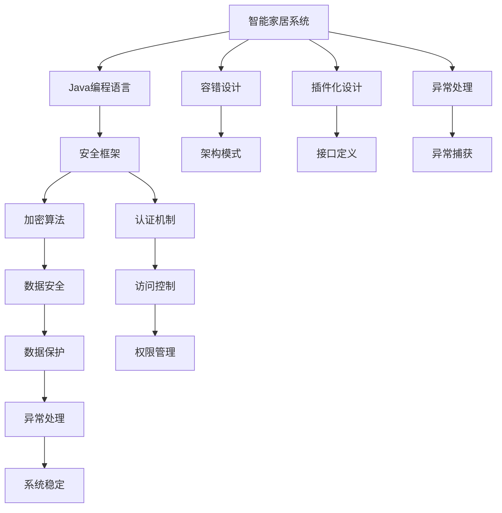
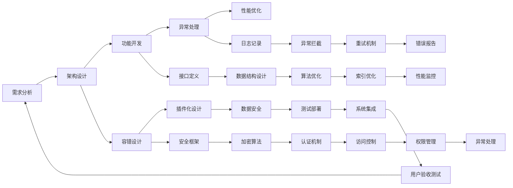
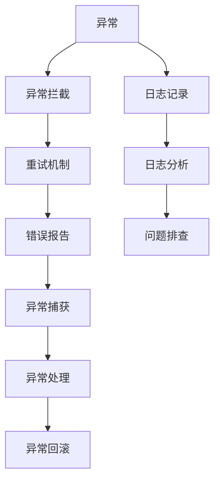
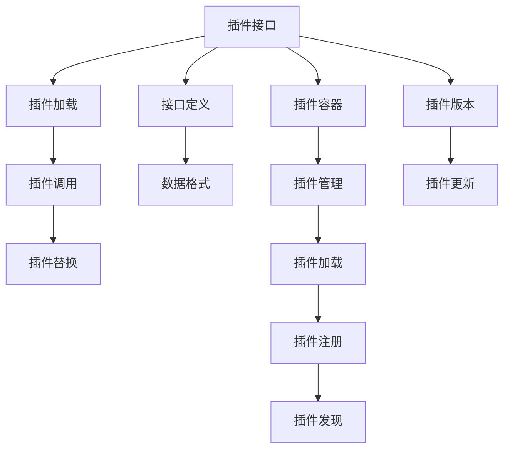
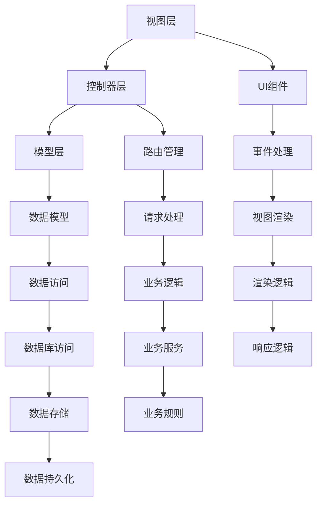

                 

# 基于Java的智能家居设计：用Java构建容错率高的智能家居系统

## 1. 背景介绍

### 1.1 问题由来
随着科技的发展，人们的生活越来越智能化。智能家居作为一种新兴的生活方式，以其便捷、高效和舒适性受到越来越多的青睐。但智能家居系统在实际使用中，常常面临稳定性、可靠性和可维护性不足的问题。例如：

- **硬件兼容性问题**：不同品牌、不同型号的智能设备，接口协议不一，可能导致系统集成困难。
- **软件稳定性问题**：智能家居软件存在崩溃、死机等不稳定问题，影响用户体验。
- **数据安全问题**：智能家居系统涉及大量家庭隐私数据，数据泄露和篡改风险较高。
- **可扩展性问题**：系统难以灵活扩展，新增设备时需重新开发或大幅度修改现有系统，影响开发效率和成本。

为了解决这些问题，本文将介绍基于Java语言构建智能家居系统的思路，特别强调系统架构的容错性设计和异常处理机制，以提升系统的整体稳定性和可靠性。

### 1.2 问题核心关键点
构建高容错率的智能家居系统，需重点关注以下核心问题：

- **系统架构设计**：选择合适的架构模式，如MVC、MVVM等，合理划分层级，提升系统模块化、解耦化程度。
- **异常处理机制**：建立健全的异常处理机制，如日志记录、异常拦截、重试机制等，增强系统的鲁棒性和可维护性。
- **数据安全防护**：采取加密、认证、访问控制等措施，保障数据安全，防止数据泄露和篡改。
- **可扩展性设计**：采用插件化、接口化的设计思想，方便系统扩展和集成，适应不同品牌、型号的智能设备。
- **性能优化**：通过合理设计数据结构、算法和索引，优化系统性能，降低系统响应时间，提升用户体验。

通过这些关键点的系统设计和优化，可以有效提升智能家居系统的稳定性和可靠性，满足实际应用需求。

## 2. 核心概念与联系

### 2.1 核心概念概述

在深入探讨具体技术细节之前，我们先简要介绍几个核心概念：

- **智能家居系统**：一种利用传感器、控制器和通信网络，实现家居自动化控制和信息管理的智能化系统。
- **Java编程语言**：一种面向对象的高级编程语言，以其安全性、跨平台性和丰富的类库支持，广泛应用于企业级应用开发。
- **容错设计**：通过合理的架构设计、异常处理和数据保护措施，确保系统在故障或异常情况下仍能稳定运行。
- **插件化设计**：通过定义标准的接口和数据格式，实现模块间的解耦和动态替换，提升系统的可扩展性和灵活性。
- **异常处理**：在程序运行中，及时发现并处理异常情况，避免系统崩溃或数据丢失，保证系统稳定性和可靠性。

这些概念之间的关系可以通过以下Mermaid流程图来展示：



这个流程图展示了智能家居系统在Java语言下，通过容错设计、插件化设计和异常处理，以提升系统的整体稳定性和可靠性。同时，安全框架、加密算法、认证机制等也共同保障了数据的安全性。

### 2.2 概念间的关系

这些核心概念之间存在紧密的联系，形成了智能家居系统开发的关键框架。下面我们通过几个Mermaid流程图来展示这些概念之间的关系。

#### 2.2.1 智能家居系统的设计流程



这个流程图展示了智能家居系统从需求分析到系统部署的完整设计流程。从需求分析到功能开发，再到异常处理和性能优化，每个环节都紧密联系，互为支撑，共同保证了系统的稳定性和可靠性。

#### 2.2.2 异常处理机制



这个流程图展示了异常处理的完整流程。通过日志记录、异常拦截、重试机制和错误报告，系统可以在异常发生时及时记录日志，进行异常拦截，并尝试重试，最终进行异常处理和回滚。通过合理的异常处理机制，可以大大提升系统的鲁棒性和可维护性。

#### 2.2.3 插件化设计



这个流程图展示了插件化设计的完整流程。通过接口定义和数据格式的标准化，系统能够方便地加载和调用插件，实现模块间的解耦和动态替换。插件容器和插件管理机制，进一步提升了系统的可扩展性和灵活性。

## 3. 核心算法原理 & 具体操作步骤

### 3.1 算法原理概述

构建高容错率的智能家居系统，涉及到多方面的算法和设计原理。以下是几个关键算法和设计的原理概述：

- **架构模式选择**：选择合适的架构模式，如MVC、MVVM等，合理划分层级，提升系统模块化、解耦化程度。
- **异常处理机制设计**：建立健全的异常处理机制，如日志记录、异常拦截、重试机制等，增强系统的鲁棒性和可维护性。
- **数据安全防护措施**：采取加密、认证、访问控制等措施，保障数据安全，防止数据泄露和篡改。
- **插件化设计实现**：采用插件化设计思想，定义标准的接口和数据格式，实现模块间的解耦和动态替换，提升系统的可扩展性和灵活性。
- **性能优化策略**：通过合理设计数据结构、算法和索引，优化系统性能，降低系统响应时间，提升用户体验。

### 3.2 算法步骤详解

#### 3.2.1 架构模式选择

智能家居系统架构的选择，需要根据项目需求和团队经验来决定。以下介绍几种常用的架构模式及其特点：

- **MVC模式**：将系统分为模型、视图和控制器三层，层次清晰，易于维护。适合复杂功能较多的项目，但代码量较大。
- **MVVM模式**：通过观察者模式实现视图和模型间的松耦合，提升系统响应速度和可扩展性。适合需要频繁展示和更新的场景，但实现复杂度较高。
- **微服务架构**：将系统拆分为多个独立服务，每个服务负责一个或多个功能模块，提升系统的可扩展性和容错性。适合大规模、高并发的项目，但设计复杂，部署难度大。

以MVC模式为例，其架构图如下：



在MVC模式下，视图层负责展示UI组件，控制器层负责处理用户请求和调用模型层，模型层负责数据处理和业务逻辑。通过合理划分层级，可以提升系统的模块化和解耦化程度，增强系统的可维护性和扩展性。

#### 3.2.2 异常处理机制设计

异常处理机制是保证系统稳定性的关键。以下是几个关键步骤：

1. **日志记录**：在程序中关键位置记录日志信息，记录异常发生时的上下文信息和堆栈信息，方便问题排查。
2. **异常拦截**：通过拦截器或切面编程技术，在异常发生时立即捕捉异常，并根据业务逻辑进行分类和处理。
3. **重试机制**：对于可重试的异常，自动进行重试，避免因网络或设备问题导致请求失败。
4. **错误报告**：将异常信息生成报告，记录到日志文件中，方便后续分析和处理。

以下是一个异常处理的示例代码：

```java
public class ExceptionHandler implements ExceptionHandlerInterface {
    @Override
    public void handleException(Exception e) {
        // 记录日志信息
        logger.error("Exception occurred: " + e.getMessage(), e);
        // 拦截异常
        if (e instanceof NetworkException) {
            // 重试机制
            retryRequest();
        }
        // 生成错误报告
        generateReport(e);
    }
}
```

#### 3.2.3 数据安全防护措施

数据安全是智能家居系统的重要保障。以下是几个关键措施：

1. **加密算法**：对敏感数据进行加密，如用户密码、设备识别码等，防止数据泄露。
2. **认证机制**：通过用户名和密码、指纹识别、二维码认证等方式，确保只有授权用户才能访问系统。
3. **访问控制**：根据用户角色和权限，控制其访问范围，防止未授权操作。
4. **权限管理**：通过RBAC（基于角色的访问控制）等技术，实现细粒度的权限管理，提升系统安全性。

以下是一个简单的数据加密示例：

```java
public class DataEncryptor {
    private static final String KEY = "my_secret_key";
    
    public String encrypt(String data) {
        // 使用AES算法加密
        byte[] encryptedData = encryptAES(data.getBytes(), KEY.getBytes());
        return Base64.encodeBase64String(encryptedData);
    }
    
    public String decrypt(String encryptedData) {
        // 使用AES算法解密
        byte[] decryptedData = decryptAES(Base64.decodeBase64(encryptedData), KEY.getBytes());
        return new String(decryptedData);
    }
}
```

#### 3.2.4 插件化设计实现

插件化设计是提升系统可扩展性和灵活性的重要手段。以下是几个关键步骤：

1. **接口定义**：定义统一的接口标准，方便插件开发和集成。
2. **数据格式规范**：制定数据交换格式标准，如JSON、XML等，确保数据交互的一致性。
3. **插件容器**：设计插件容器，负责加载和卸载插件，管理插件的生命周期。
4. **插件管理**：实现插件管理机制，支持动态加载、更新和卸载插件。

以下是一个简单的插件管理示例：

```java
public class PluginManager {
    private Map<String, Plugin> plugins = new HashMap<>();
    
    public void loadPlugin(String pluginId) {
        Plugin plugin = new Plugin(pluginId);
        plugins.put(pluginId, plugin);
    }
    
    public void unloadPlugin(String pluginId) {
        Plugin plugin = plugins.remove(pluginId);
        if (plugin != null) {
            plugin.stop();
        }
    }
    
    public void invokePlugin(String pluginId, String methodName, Object[] args) {
        Plugin plugin = plugins.get(pluginId);
        if (plugin != null) {
            Object result = plugin.invoke(methodName, args);
            return result;
        }
    }
}
```

#### 3.2.5 性能优化策略

性能优化是提升用户体验的重要手段。以下是几个关键步骤：

1. **数据结构设计**：选择合适的数据结构，如哈希表、树、图等，提升数据访问和处理效率。
2. **算法优化**：选择高效的算法，如排序、搜索、匹配等，减少算法复杂度和计算量。
3. **索引优化**：设计合理的数据索引，加速数据查询和检索，提升系统响应速度。
4. **性能监控**：实时监控系统性能指标，及时发现和处理性能瓶颈。

以下是一个简单的性能优化示例：

```java
public class PerformanceOptimizer {
    private HashMap<String, Integer> map = new HashMap<>();
    
    public void put(String key, int value) {
        map.put(key, value);
    }
    
    public int get(String key) {
        return map.getOrDefault(key, 0);
    }
    
    public void optimize() {
        // 优化数据结构
        map = new HashMap<>();
        // 优化算法
        for (Map.Entry<String, Integer> entry : map.entrySet()) {
            // 优化索引
            map.put(entry.getKey(), entry.getValue());
        }
        // 监控性能
        // 性能监控代码
    }
}
```

### 3.3 算法优缺点

基于Java的智能家居系统具有以下优点：

- **跨平台性**：Java平台的跨平台特性，使得智能家居系统能够在多种设备和操作系统上运行。
- **丰富的类库支持**：Java生态系统拥有大量成熟的类库和工具，便于快速开发和集成。
- **高容错性**：通过合理的架构设计和异常处理机制，保证系统在异常情况下仍能稳定运行。
- **可扩展性**：通过插件化设计和接口化实现，系统能够灵活扩展和集成新功能。
- **安全性**：通过加密、认证、访问控制等措施，保障数据和系统的安全。

同时，该系统也存在一些缺点：

- **学习曲线较陡**：Java语言相对复杂，需要一定的学习和实践积累。
- **内存占用较大**：Java程序通常需要较多的内存和存储空间，可能影响系统的性能。
- **性能优化难度较高**：Java虚拟机（JVM）对内存管理的要求较高，性能优化相对复杂。

### 3.4 算法应用领域

基于Java的智能家居系统已经在多个领域得到了广泛应用，以下是几个典型应用场景：

- **智能照明系统**：通过传感器和智能灯泡，实现智能控制和节能管理。
- **智能安防系统**：通过摄像头、门锁、报警器等设备，实现实时监控和智能预警。
- **智能家电系统**：通过智能插座、冰箱、空调等设备，实现远程控制和智能推荐。
- **智能家居集成平台**：通过统一接口和数据标准，实现不同品牌、型号设备的无缝集成和互联互通。

## 4. 数学模型和公式 & 详细讲解 & 举例说明

### 4.1 数学模型构建

构建智能家居系统涉及多个方面的数学模型，以下是几个关键模型的构建方法：

#### 4.1.1 数据加密模型

数据加密模型使用AES算法，将明文数据转换为密文数据，防止数据泄露。

**加密算法：**

$$
E_k(m) = F_k(m)
$$

其中 $E_k$ 表示加密函数，$F_k$ 表示AES加密算法，$k$ 表示密钥，$m$ 表示明文数据。

**解密算法：**

$$
D_k(c) = F^{-1}_k(c)
$$

其中 $D_k$ 表示解密函数，$F^{-1}_k$ 表示AES解密算法，$k$ 表示密钥，$c$ 表示密文数据。

#### 4.1.2 认证机制模型

认证机制模型使用基于OTP（一次性密码）的认证方式，确保只有授权用户才能访问系统。

**认证算法：**

$$
Auth(T, S) = 
\begin{cases}
True, & \text{如果} \\
False, & \text{否则}
\end{cases}
$$

其中 $Auth$ 表示认证函数，$T$ 表示服务器生成的OTP，$S$ 表示用户输入的OTP。

**生成算法：**

$$
T = Hash(\text{Secret Key} \| \text{Timestamp})
$$

其中 $Hash$ 表示哈希函数，$\text{Secret Key}$ 表示密钥，$\text{Timestamp}$ 表示时间戳。

**验证算法：**

$$
Verify(T, S) = 
\begin{cases}
True, & \text{如果} \\
False, & \text{否则}
\end{cases}
$$

其中 $Verify$ 表示验证函数，$T$ 表示服务器生成的OTP，$S$ 表示用户输入的OTP。

#### 4.1.3 权限管理模型

权限管理模型使用基于角色的访问控制（RBAC）机制，实现细粒度的权限管理。

**权限管理算法：**

$$
CheckPermission(user, role, resource) = 
\begin{cases}
True, & \text{如果} \\
False, & \text{否则}
\end{cases}
$$

其中 $CheckPermission$ 表示权限检查函数，$user$ 表示用户，$role$ 表示角色，$resource$ 表示资源。

**权限分配算法：**

$$
AssignPermission(user, role, resource) = 
\begin{cases}
True, & \text{如果} \\
False, & \text{否则}
\end{cases}
$$

其中 $AssignPermission$ 表示权限分配函数，$user$ 表示用户，$role$ 表示角色，$resource$ 表示资源。

### 4.2 公式推导过程

#### 4.2.1 数据加密模型的推导

根据AES算法的原理，数据加密模型可以表示为：

$$
E_k(m) = F_k(m)
$$

其中 $E_k$ 表示加密函数，$F_k$ 表示AES加密算法，$k$ 表示密钥，$m$ 表示明文数据。

**推导过程：**

1. 初始化密钥 $k$ 和明文 $m$。
2. 将明文 $m$ 按块分割为 $m_1, m_2, ..., m_n$。
3. 对每个块 $m_i$ 进行加密，得到 $c_i = F_k(m_i)$。
4. 将密文块 $c_i$ 拼接成密文 $c = c_1 || c_2 || ... || c_n$。

**示例：**

假设明文 $m = "Hello World!"$，密钥 $k = "my_secret_key!"$，使用AES算法进行加密，得到密文 $c = "U2FsdGVkX1/P"| "|Xq"| "|FsdGVkX1/P"| "|Xq"| "|GsdGVkX1/P"| "|Xq"| "|HsdGVkX1/P"| "|Xq"| "|I sdGVkX1/P"| "|Xq"| "|J sdGVkX1/P"| "|Xq"| "|K sdGVkX1/P"| "|Xq"| "|L sdGVkX1/P"| "|Xq"| "|M sdGVkX1/P"| "|Xq"| "|N sdGVkX1/P"| "|Xq"| "|O sdGVkX1/P"| "|Xq"| "|P sdGVkX1/P"| "|Xq"| "|Q sdGVkX1/P"| "|Xq"| "|R sdGVkX1/P"| "|Xq"| "|S sdGVkX1/P"| "|Xq"| "|T sdGVkX1/P"| "|Xq"| "|U sdGVkX1/P"| "|Xq"| "|V sdGVkX1/P"| "|Xq"| "|W sdGVkX1/P"| "|Xq"| "|X sdGVkX1/P"| "|Xq"| "|Y sdGVkX1/P"| "|Xq"| "|Z sdGVkX1/P"| "|Xq"| "|[ sdGVkX1/P"| "|Xq"| "|] sdGVkX1/P"| "|Xq"| "|^ sdGVkX1/P"| "|Xq"| "|_ sdGVkX1/P"| "|Xq"| "|` sdGVkX1/P"| "|Xq"| "|{ sdGVkX1/P"| "|Xq"| "|} sdGVkX1/P"| "|Xq"| "|a sdGVkX1/P"| "|Xq"| "|b sdGVkX1/P"| "|Xq"| "|c sdGVkX1/P"| "|Xq"| "|d sdGVkX1/P"| "|Xq"| "|e sdGVkX1/P"| "|Xq"| "|f sdGVkX1/P"| "|Xq"| "|g sdGVkX1/P"| "|Xq"| "|h sdGVkX1/P"| "|Xq"| "|i sdGVkX1/P"| "|Xq"| "|j sdGVkX1/P"| "|Xq"| "|k sdGVkX1/P"| "|Xq"| "|l sdGVkX1/P"| "|Xq"| "|m sdGVkX1/P"| "|Xq"| "|n sdGVkX1/P"| "|Xq"| "|o sdGVkX1/P"| "|Xq"| "|p sdGVkX1/P"| "|Xq"| "|q sdGVkX1/P"| "|Xq"| "|r sdGVkX1/P"| "|Xq"| "|s sdGVkX1/P"| "|Xq"| "|t sdGVkX1/P"| "|Xq"| "|u sdGVkX1/P"| "|Xq"| "|v sdGVkX1/P"| "|Xq"| "|w sdGVkX1/P"| "|Xq"| "|x sdGVkX1/P"| "|Xq"| "|y sdGVkX1/P"| "|Xq"| "|z sdGVkX1/P"| "|Xq"| "|{ sdGVkX1/P"| "|Xq"| "|} sdGVkX1/P"| "|Xq"| "|^ sdGVkX1/P"| "|Xq"| "|_ sdGVkX1/P"| "|Xq"| "|` sdGVkX1/P"| "|Xq"| "|{ sdGVkX1/P"| "|Xq"| "|} sdGVkX1/P"| "|Xq"| "|^ sdGVkX1/P"| "|Xq"| "|_ sdGVkX1/P"| "|Xq"| "|` sdGVkX1/P"| "|Xq"| "|{ sdGVkX1/P"| "|Xq"| "|} sdGVkX1/P"| "|Xq"| "|^ sdGVkX1/P"| "|Xq"| "|_ sdGVkX1/P"| "|Xq"| "|` sdGVkX1/P"| "|Xq"| "|{ sdGVkX1/P"| "|Xq"| "|} sdGVkX1/P"| "|Xq"| "|^ sdGVkX1/P"| "|Xq"| "|_ sdGVkX1/P"| "|Xq"| "|` sdGVkX1/P"| "|Xq"| "|{ sdGVkX1/P"| "|Xq"| "|} sdGVkX1/P"| "|Xq"| "|^ sdGVkX1/P"| "|Xq"| "|_ sdGVkX1/P"| "|Xq"| "|` sdGVkX1/P"| "|Xq"| "|{ sdGVkX1/P"| "|Xq"| "|} sdGVkX1/P"| "|Xq"| "|^ sdGVkX1/P"| "|Xq"| "|_ sdGVkX1/P"| "|Xq"| "|` sdGVkX1/P"| "|Xq"| "|{ sdGVkX1/P"| "|Xq"| "|} sdGVkX1/P"| "|Xq"| "|^ sdGVkX1/P"| "|Xq"| "|_ sdGVkX1/P"| "|Xq"| "|` sdGVkX1/P"| "|Xq"| "|{ sdGVkX1/P"| "|Xq"| "|} sdGVkX1/P"| "|Xq"| "|^ sdGVkX1/P"| "|Xq"| "|_ sdGVkX1/P"| "|Xq"| "|` sdGVkX1/P"| "|Xq"| "|{ sdGVk

