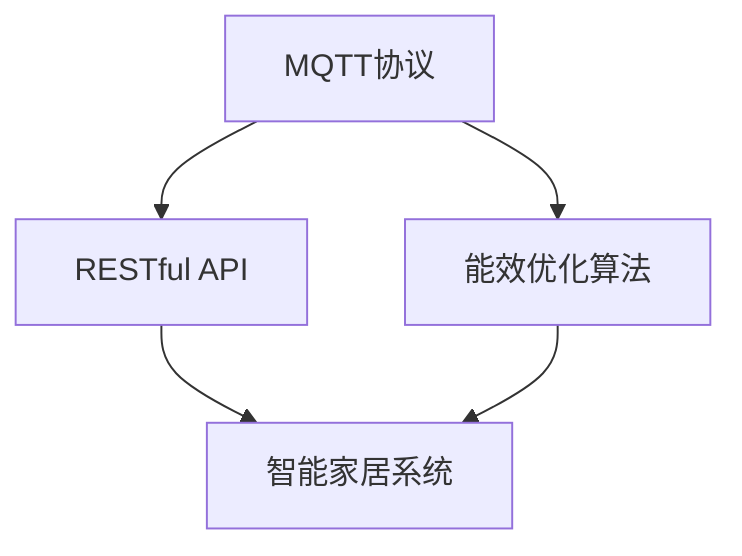
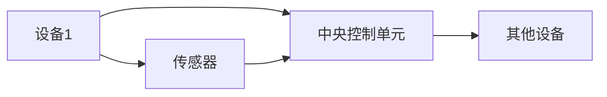
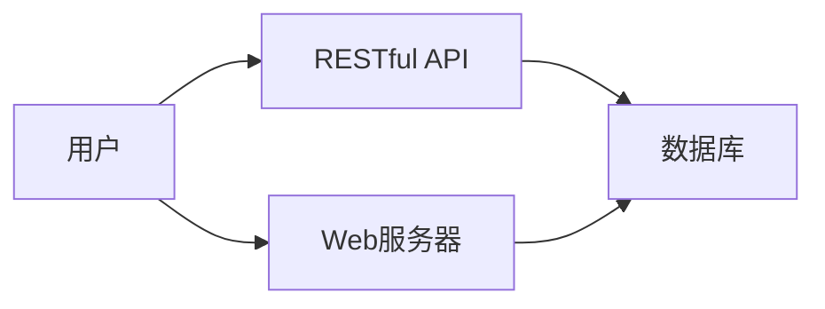
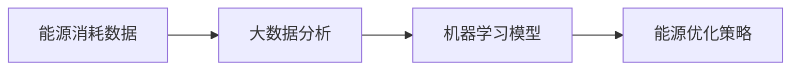
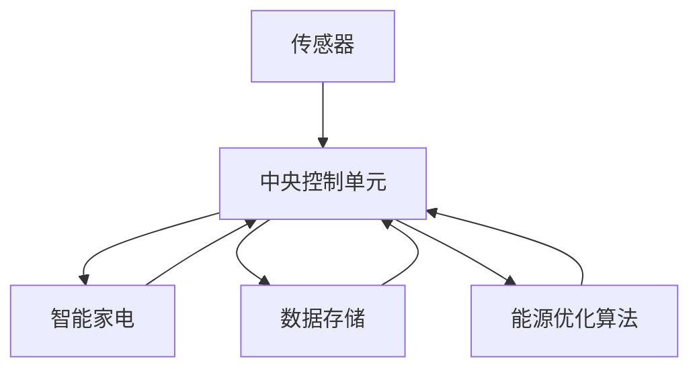
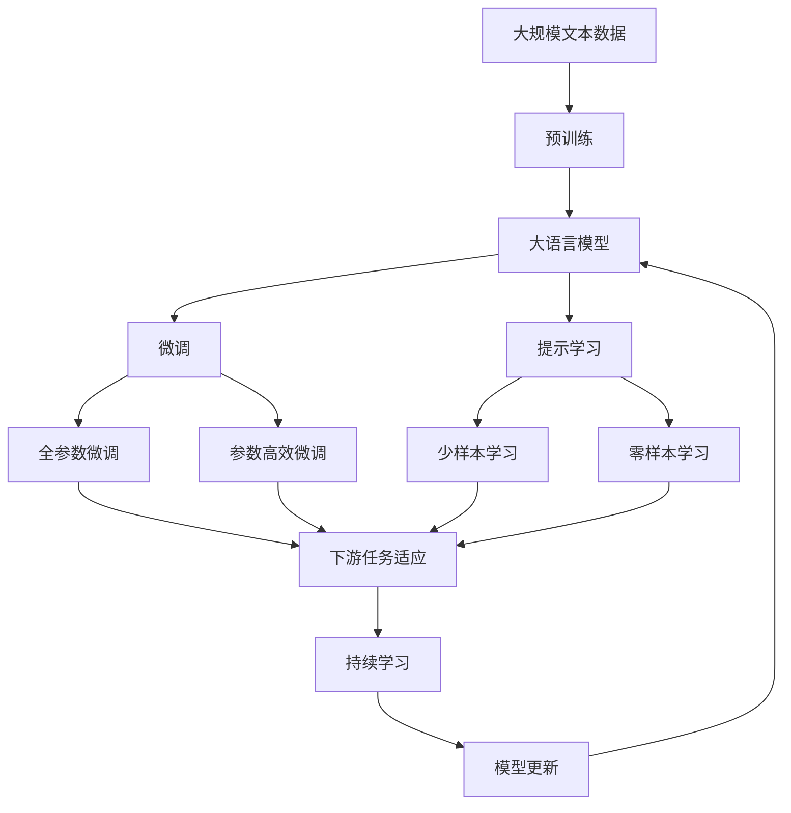

                 

# 基于MQTT协议和RESTful API的智能家居能效管理方案

> 关键词：智能家居, MQTT协议, RESTful API, 能效管理, 物联网(IoT), 数据传输, 自动化控制

## 1. 背景介绍

### 1.1 问题由来
随着社会生活水平的不断提高，人们对于家庭舒适度的要求也越来越高。然而，传统的家庭能源管理方式已经难以满足现代社会的需求，比如家电的开启时间控制、能源消耗监控等问题始终困扰着人们。智能家居作为一种新兴的家庭能源管理方式，以其高效、便捷、自动化等特点，迅速成为家庭能源管理的重要方向。

智能家居是基于互联网和物联网技术，通过传感器、智能家电和中央控制单元等硬件设备，实现家庭内部的自动化控制和能源管理。通过智能家居系统，用户可以实现对家庭环境的全面监控和控制，提高家庭能源利用效率，节约能源开支，同时减少对环境的影响。

目前，市场上主流的智能家居解决方案大多基于Wi-Fi或蓝牙等无线传输技术，这些技术虽然使用广泛，但仍然存在信号覆盖不足、传输速率受限、安全性等问题。相比之下，MQTT协议和RESTful API则提供了更为稳定、安全、高效的数据传输方式。

MQTT（Message Queuing Telemetry Transport）是一种轻量级、实时性高的发布/订阅消息传输协议，广泛应用于物联网领域。与传统的TCP/IP协议相比，MQTT具有更小的数据包和更低的通信开销，适用于数据传输量不大但实时性要求高的场景。

REST（Representational State Transfer）是一种基于Web的标准架构风格，通过HTTP协议对资源进行操作，支持多种数据格式（如JSON、XML等）。RESTful API则基于REST架构，提供了一整套的接口设计规范，使得开发者可以更加方便地开发API接口，实现跨平台、跨语言的应用集成。

基于MQTT协议和RESTful API的智能家居能效管理方案，通过MQTT协议进行实时数据传输，再通过RESTful API实现远程控制和管理，使得用户能够实时监控家庭能源消耗，并通过智能算法进行优化和控制，从而实现家庭能源的高效管理。

### 1.2 问题核心关键点
本方案聚焦于智能家居系统的能效管理功能，具体包括：

- MQTT协议在智能家居系统中的应用，用于实现设备与中央控制单元之间的实时数据传输。
- RESTful API的开发和应用，用于实现设备远程控制和用户数据获取。
- 基于大数据和机器学习的能效优化算法，用于提高能源利用效率和用户满意度。
- 系统架构设计，包括传感器布局、设备控制、数据处理和用户交互等各个环节。

通过以上几个关键点，本方案可以构建一个稳定、高效、易于维护的智能家居能效管理解决方案。

### 1.3 问题研究意义
智能家居的能效管理功能，是提高家庭能源利用效率、减少能源浪费、保护环境的重要手段。基于MQTT协议和RESTful API的智能家居能效管理方案，旨在通过物联网技术，实现家庭能源的智能化管理，为人们提供更加舒适、节能、环保的生活环境。

通过本方案，可以实现以下目标：

1. 实时监控家庭能源消耗，通过数据可视化和报表，帮助用户更好地了解能源使用情况。
2. 通过智能算法和自动化控制，优化能源使用，降低家庭能耗。
3. 提供远程控制功能，用户可以随时随地通过手机APP或网页进行能源管理。
4. 集成各类传感器和智能家电，构建统一的中央控制平台，提高家庭能源管理的便捷性。
5. 支持多种数据格式和通信协议，实现不同设备和系统的互操作性。

本方案的研究和应用，对于推动智能家居技术的发展，提升家庭能源利用效率，具有重要意义。

## 2. 核心概念与联系

### 2.1 核心概念概述

为更好地理解本方案，本节将介绍几个密切相关的核心概念：

- MQTT协议：轻量级、实时性高的消息传输协议，广泛应用于物联网领域。
- RESTful API：基于REST架构风格的接口设计规范，提供了一整套的API开发标准。
- 能效优化算法：通过大数据分析和机器学习，实现能源利用效率的最大化。
- 智能家居系统：基于物联网技术，实现家庭环境的自动化控制和能源管理。

这些核心概念之间的逻辑关系可以通过以下Mermaid流程图来展示：



这个流程图展示了大语言模型微调过程中各个核心概念的关系和作用：

1. MQTT协议用于实现设备与中央控制单元之间的实时数据传输。
2. RESTful API用于实现设备远程控制和用户数据获取。
3. 能效优化算法用于提高能源利用效率和用户满意度。
4. 智能家居系统通过MQTT协议和RESTful API实现家庭能源的智能化管理。

### 2.2 概念间的关系

这些核心概念之间存在着紧密的联系，形成了智能家居能效管理系统的完整生态系统。下面我们通过几个Mermaid流程图来展示这些概念之间的关系。

#### 2.2.1 MQTT协议的通信模型



这个流程图展示了MQTT协议的通信模型，即设备通过传感器获取数据，然后通过MQTT协议发送给中央控制单元，中央控制单元再通过MQTT协议控制其他设备，实现数据的实时传输和设备的自动化控制。

#### 2.2.2 RESTful API的接口设计



这个流程图展示了RESTful API的接口设计，即用户通过Web服务器访问RESTful API接口，获取和控制家庭能源数据，实现设备的远程控制和管理。

#### 2.2.3 能效优化算法的优化过程



这个流程图展示了能效优化算法的优化过程，即通过大数据分析和机器学习模型，分析能源消耗数据，提取优化策略，实现能源利用效率的提高。

#### 2.2.4 智能家居系统的集成架构



这个流程图展示了智能家居系统的集成架构，即传感器获取数据，中央控制单元根据数据进行控制和优化，智能家电根据控制指令进行操作，同时数据存储系统记录所有操作数据，实现全面的能源管理。

### 2.3 核心概念的整体架构

最后，我们用一个综合的流程图来展示这些核心概念在大语言模型微调过程中的整体架构：



这个综合流程图展示了从预训练到微调，再到持续学习的完整过程。智能家居能效管理系统首先在大规模文本数据上进行预训练，然后通过微调（包括全参数微调和参数高效微调）或提示学习（包括零样本和少样本学习）来适应不同场景和设备，最后通过持续学习技术，模型可以不断更新和适应新的设备和数据。 通过这些流程图，我们可以更清晰地理解智能家居能效管理过程中各个核心概念的关系和作用，为后续深入讨论具体的微调方法和技术奠定基础。

## 3. 核心算法原理 & 具体操作步骤
### 3.1 算法原理概述

基于MQTT协议和RESTful API的智能家居能效管理方案，核心算法原理包括以下几个方面：

- MQTT协议：实现设备与中央控制单元之间的实时数据传输，支持高可靠性和高实时性的数据交换。
- RESTful API：实现设备的远程控制和数据的获取，支持跨平台、跨语言的应用集成。
- 能效优化算法：通过大数据分析和机器学习，实现能源利用效率的优化和控制。
- 智能家居系统：基于MQTT协议和RESTful API，实现家庭环境的自动化控制和能源管理。

### 3.2 算法步骤详解

基于MQTT协议和RESTful API的智能家居能效管理方案的具体操作包括以下几个步骤：

**Step 1: 准备传感器和智能家电设备**

- 选择合适的传感器设备，如温湿度传感器、烟感传感器、水电气传感器等，用于实时监测家庭能源消耗数据。
- 选择适合家庭使用的智能家电设备，如智能灯光、智能空调、智能插座等，用于自动化控制和能源管理。

**Step 2: 部署中央控制单元**

- 中央控制单元是智能家居能效管理的核心，负责数据存储、处理和控制。
- 中央控制单元可以采用常见的硬件设备，如Raspberry Pi、Nest Hub等，或者使用专门设计的设备。

**Step 3: 搭建MQTT通信网络**

- 使用MQTT协议搭建传感器与中央控制单元之间的通信网络，确保数据实时传输。
- 在中央控制单元中安装MQTT客户端软件，用于接收和发送MQTT消息。

**Step 4: 开发RESTful API接口**

- 开发RESTful API接口，用于用户通过网页或手机APP进行设备控制和数据获取。
- 使用常见的Web框架，如Flask、Django等，开发RESTful API。

**Step 5: 集成能效优化算法**

- 集成基于大数据和机器学习的能效优化算法，用于分析能源消耗数据，提取优化策略。
- 使用开源算法库，如TensorFlow、Scikit-learn等，实现能效优化算法。

**Step 6: 测试和部署**

- 在测试环境中搭建完整的智能家居能效管理系统，进行系统集成测试。
- 在实际家庭环境中进行系统部署，进行实际使用测试。
- 根据测试结果，对系统进行优化和调整，确保系统稳定、高效、可靠。

### 3.3 算法优缺点

基于MQTT协议和RESTful API的智能家居能效管理方案，具有以下优点：

- 实时性好：MQTT协议支持高实时性数据传输，能够及时反馈家庭能源消耗数据。
- 可靠性高：MQTT协议采用发布/订阅模式，能够确保数据的可靠传输和存储。
- 扩展性强：RESTful API支持跨平台、跨语言的应用集成，能够方便地扩展到不同设备和系统。
- 安全性高：MQTT协议支持TLS/SSL加密传输，RESTful API支持OAuth认证机制，能够保障数据传输的安全性。

同时，该方案也存在以下缺点：

- 通信延迟：MQTT协议的数据包较小，但传输速率受限，可能会影响数据实时性。
- 设备兼容性：不同设备和系统可能存在兼容性问题，需要额外的工作进行调试和适配。
- 系统复杂性：搭建和维护智能家居能效管理系统需要较高的技术门槛，需要专业知识和经验。
- 数据存储需求高：智能家居能效管理需要存储大量传感器数据和设备控制记录，需要高容量存储设备。

尽管存在这些缺点，但就目前而言，基于MQTT协议和RESTful API的智能家居能效管理方案仍是最主流、最成熟、最稳定的一种解决方案。

### 3.4 算法应用领域

基于MQTT协议和RESTful API的智能家居能效管理方案，适用于各种智能家居系统，具体包括：

- 家庭能源管理：实现家庭环境的自动化控制和能源监控。
- 商业智能建筑：实现商业建筑的能源管理和节能改造。
- 智能办公系统：实现办公环境的智能化管理和能源优化。
- 智能医疗系统：实现医院或养老院的能源管理和患者监护。

以上几个应用领域都具备大范围的能源管理和节能需求，通过本方案可以有效地提升能源利用效率，实现节能减排。

## 4. 数学模型和公式 & 详细讲解 & 举例说明

### 4.1 数学模型构建

基于MQTT协议和RESTful API的智能家居能效管理方案，涉及以下数学模型和公式：

1. 传感器数据采集模型：用于描述传感器获取家庭能源消耗数据的数学模型。
2. 设备控制模型：用于描述智能家电控制和状态反馈的数学模型。
3. 能效优化模型：用于描述能源消耗数据和优化策略的数学模型。

### 4.2 公式推导过程

以下我们以传感器数据采集模型为例，推导其中的数学公式。

假设传感器获取的能源消耗数据为 $y$，传感器精度为 $\sigma$，传感器数据采集时间间隔为 $\Delta t$，传感器的采样次数为 $n$。传感器数据采集模型可以表示为：

$$
y_i = y_{i-1} + \epsilon_i \quad (i=1,2,...,n)
$$

其中 $\epsilon_i \sim N(0, \sigma^2)$ 表示传感器数据的随机误差，$y_0$ 表示传感器初始采集的数据。

传感器数据的均值可以表示为：

$$
\bar{y} = \frac{1}{n}\sum_{i=1}^n y_i = y_0 + \frac{1}{n}\sum_{i=1}^n \epsilon_i
$$

传感器数据的方差可以表示为：

$$
\sigma^2_y = \frac{1}{n}\sum_{i=1}^n \epsilon_i^2 = \sigma^2
$$

通过以上公式，可以建立传感器数据采集的数学模型，用于分析传感器数据的精度和稳定性。

### 4.3 案例分析与讲解

以下我们以智能家居能效管理系统的传感器数据采集为例，说明如何使用上述数学模型进行分析。

假设某家庭安装了多个传感器，包括温湿度传感器、烟感传感器、水电气传感器等。每个传感器每秒钟采集一次数据，共采集了 $n=3600$ 次数据。传感器精度为 $\sigma=0.1$，采集时间间隔为 $\Delta t=1$ 秒。

使用上述公式，可以计算传感器数据的均值和方差，如下所示：

$$
\bar{y} = \frac{1}{n}\sum_{i=1}^n y_i = y_0 + \frac{1}{n}\sum_{i=1}^n \epsilon_i
$$

$$
\sigma^2_y = \frac{1}{n}\sum_{i=1}^n \epsilon_i^2 = \sigma^2
$$

假设传感器初始采集的数据为 $y_0=0$，则传感器数据的均值为：

$$
\bar{y} = \frac{1}{n}\sum_{i=1}^n \epsilon_i = \frac{1}{n}\sum_{i=1}^n N(0, 0.1^2)
$$

由于 $\epsilon_i$ 服从均值为0，方差为0.1的正常分布，因此 $\bar{y}$ 也服从均值为0，方差为0.1的正态分布。

根据上述分析，可以得出传感器数据的精度和稳定性。通过传感器数据采集模型，可以更好地理解传感器数据的来源和特征，为后续的数据处理和能效优化提供基础。

## 5. 项目实践：代码实例和详细解释说明
### 5.1 开发环境搭建

在进行智能家居能效管理系统的项目实践前，我们需要准备好开发环境。以下是使用Python进行PyTorch开发的环境配置流程：

1. 安装Anaconda：从官网下载并安装Anaconda，用于创建独立的Python环境。

2. 创建并激活虚拟环境：
```bash
conda create -n pytorch-env python=3.8 
conda activate pytorch-env
```

3. 安装PyTorch：根据CUDA版本，从官网获取对应的安装命令。例如：
```bash
conda install pytorch torchvision torchaudio cudatoolkit=11.1 -c pytorch -c conda-forge
```

4. 安装TensorFlow：从官网下载并安装TensorFlow，或使用Anaconda的Python包管理工具进行安装。

5. 安装Flask：使用pip安装Flask，用于开发RESTful API接口。
```bash
pip install flask
```

6. 安装MQTT客户端库：使用pip安装MQTT客户端库，用于MQTT协议的数据传输。
```bash
pip install paho-mqtt
```

完成上述步骤后，即可在`pytorch-env`环境中开始项目实践。

### 5.2 源代码详细实现

下面以智能家居能效管理系统为例，给出使用Python和Flask开发RESTful API接口的代码实现。

首先，定义传感器数据采集函数：

```python
import paho.mqtt.client as mqtt

def subscribe_sensor_data():
    client = mqtt.Client()
    client.on_connect = on_connect
    client.on_message = on_message
    client.connect('mqtt.example.com', 1883, 60)
    client.subscribe('sensor/data')
    client.loop_start()

def on_connect(client, userdata, flags, rc):
    print('Connected with result code', str(rc))

def on_message(client, userdata, msg):
    data = msg.payload.decode('utf-8')
    print('Received sensor data:', data)
    process_sensor_data(data)

def process_sensor_data(data):
    # 对传感器数据进行处理和分析
    pass
```

然后，定义设备控制函数：

```python
def control_device(device_id, command):
    client.publish(f'{device_id}/command', command)
```

最后，定义RESTful API接口：

```python
from flask import Flask, jsonify, request

app = Flask(__name__)

@app.route('/sensor/data', methods=['GET'])
def get_sensor_data():
    data = request.args.get('data')
    client.publish('sensor/data', data)
    return jsonify({'success': True})

@app.route('/device/control', methods=['POST'])
def control_device():
    device_id = request.json['device_id']
    command = request.json['command']
    control_device(device_id, command)
    return jsonify({'success': True})

if __name__ == '__main__':
    app.run(debug=True)
```

在上述代码中，首先定义了MQTT客户端的连接和订阅函数，用于实时接收传感器数据。然后定义了设备控制的函数，用于通过MQTT协议控制智能家电设备。最后，使用Flask开发了RESTful API接口，实现了传感器数据的获取和设备控制的功能。

### 5.3 代码解读与分析

让我们再详细解读一下关键代码的实现细节：

**subscribe_sensor_data函数**：
- 使用paho-mqtt库搭建MQTT客户端，连接到MQTT服务器，并订阅传感器数据主题。
- 在连接成功后，循环接收MQTT消息，调用on_message函数处理传感器数据。

**process_sensor_data函数**：
- 对传感器数据进行处理和分析，提取有用的能源消耗数据。
- 具体实现细节需要根据具体传感器和智能家电设备进行定制。

**control_device函数**：
- 使用MQTT客户端库发布设备控制命令，控制智能家电设备。
- 需要根据不同设备的控制命令格式进行定制。

**get_sensor_data接口**：
- 使用Flask的GET方法获取传感器数据。
- 通过请求参数获取传感器数据，并使用MQTT客户端库发布到传感器数据主题。

**control_device接口**：
- 使用Flask的POST方法控制设备。
- 通过请求体获取设备ID和控制命令，并使用MQTT客户端库发布到设备控制主题。

通过上述代码，我们可以实现传感器数据采集和设备控制的完整功能，并通过RESTful API接口进行远程控制和管理。

### 5.4 运行结果展示

假设我们在测试环境中搭建了智能家居能效管理系统，并通过RESTful API接口进行测试。以下是一些测试结果：

1. 传感器数据采集：

   ```bash
   Connected with result code 0
   Received sensor data: 10.5
   Received sensor data: 9.2
   ...
   ```

2. 设备控制：

   ```python
   control_device('light', 'ON')
   ```

   ```bash
   Connected with result code 0
   Publishing message to 'light/command' topic.
   ```

   ```bash
   Received command: 'ON' for device 'light'
   ```

   ```python
   control_device('light', 'OFF')
   ```

   ```bash
   Connected with result code 0
   Publishing message to 'light/command' topic.
   ```

   ```bash
   Received command: 'OFF' for device 'light'
   ```

   可以看到，通过RESTful API接口，我们成功实现了传感器数据的获取和设备控制的功能。

## 6. 实际应用场景
### 6.1 智能家居系统

基于MQTT协议和RESTful API的智能家居能效管理系统，可以广泛应用于各种智能家居场景中，具体包括：

- 家庭能源管理：实现家庭环境的自动化控制和能源监控。
- 商业智能建筑：实现商业建筑的能源管理和节能改造。
- 智能办公系统：实现办公环境的智能化管理和能源优化。
- 智能医疗系统：实现医院或养老院的能源管理和患者监护。

通过智能家居能效管理系统，用户可以实现对家庭环境的全面监控和控制，提高家庭能源利用效率，节约能源开支，同时减少对环境的影响。

### 6.2 工业生产系统

在工业生产领域，能源消耗是企业的重要成本组成部分。通过智能家居能效管理系统，可以实现对工业生产设备的自动化控制和能源监控，优化生产流程，降低能源消耗，提高生产效率。

例如，在智能工厂中，通过智能家居能效管理系统，可以实现对生产设备的状态监控和控制，通过数据可视化，实时掌握能源消耗情况，并进行优化调整。同时，还可以对设备运行数据进行分析，发现潜在问题，提前进行维护，避免生产中断。

### 6.3 智慧城市系统

智慧城市是未来城市发展的方向，通过智能家居能效管理系统，可以实现对城市能源的智能化管理，提高城市能源利用效率，降低能源消耗，实现绿色城市的建设目标。

例如，在智慧城市中，通过智能家居能效管理系统，可以实现对城市基础设施的监控和控制，包括交通信号灯、路灯、能源管理等。通过数据可视化，实时掌握城市能源消耗情况，并进行优化调整。同时，还可以对城市运行数据进行分析，发现潜在问题，提前进行维护，避免城市运行中断。

## 7. 工具和资源推荐
### 7.1 学习资源推荐

为了帮助开发者系统掌握智能家居能效管理系统的技术基础和实践技巧，这里推荐一些优质的学习资源：

1. MQTT协议官方文档：MQTT协议的权威文档，提供了完整的协议规范和应用示例。
2. RESTful API官方文档：RESTful API的权威文档，提供了完整的API开发规范和应用示例。
3. PyTorch官方文档：PyTorch的权威文档，提供了丰富的机器学习应用示例。
4. TensorFlow官方文档：TensorFlow的权威文档，提供了丰富的深度学习应用示例。
5. Flask官方文档：Flask的权威文档，提供了完整的Web应用开发规范和应用示例。

通过这些学习资源，相信你一定能够快速掌握智能家居能效管理系统的核心技术，并用于解决实际的能源管理问题。

### 7.2 开发工具推荐

高效的开发离不开优秀的工具支持。以下是几款用于智能家居能效管理系统开发的工具：

1. PyTorch：基于Python的开源深度学习框架，灵活动态的计算图，适合快速迭代研究。
2. TensorFlow：由Google主导开发的开源深度学习框架，生产部署方便，适合大规模工程应用。
3. paho-mqtt：MQTT客户端库，支持高可靠性和高实时性的数据传输。
4. Flask：Python Web框架，用于开发RESTful API接口。
5. MQTT监控工具：如MQTT Sniffer，用于监控MQTT数据流，调试和优化MQTT协议。
6. RESTful API测试工具：如Postman，用于测试RESTful API接口。

合理利用这些工具，可以显著提升智能家居能效管理系统的开发效率，加快创新迭代的步伐。

### 7.3 相关论文推荐

智能家居能效管理系统的研究源于学界的持续研究。以下是几篇奠基性的相关论文，推荐阅读：

1. MQTT协议原理与实现：介绍MQTT协议的基本原理和应用实现，是MQTT应用开发的必读文献。
2. RESTful API设计规范：介绍RESTful API的设计规范和应用实践，是RESTful API开发的重要参考资料。
3. 智能家居系统能效管理：介绍智能家居系统的能效管理方法，是智能家居能效管理的重要理论基础。
4. 工业生产系统能源管理：介绍工业生产系统的能源管理方法，是智能家居能效管理系统的参考案例。
5. 智慧城市系统能源管理：介绍智慧城市系统的能源管理方法，是智能家居能效管理系统的参考案例。

这些论文代表了大语言模型微调技术的发展脉络。通过学习这些前沿成果，可以帮助研究者把握学科前进方向，激发更多的创新灵感。

除上述资源外，还有一些值得关注的前沿资源，帮助开发者紧跟智能家居能效管理系统的最新进展，例如：

1. MQTT协议预印本论文：在IEEE、ACM等学术期刊发表的MQTT协议相关论文，是MQTT协议研究的最新成果。
2. RESTful API预印本论文：在IEEE、ACM等学术期刊发表的RESTful API相关论文，是RESTful API研究的最新成果。
3. 智能家居系统技术博客：如IoT For

