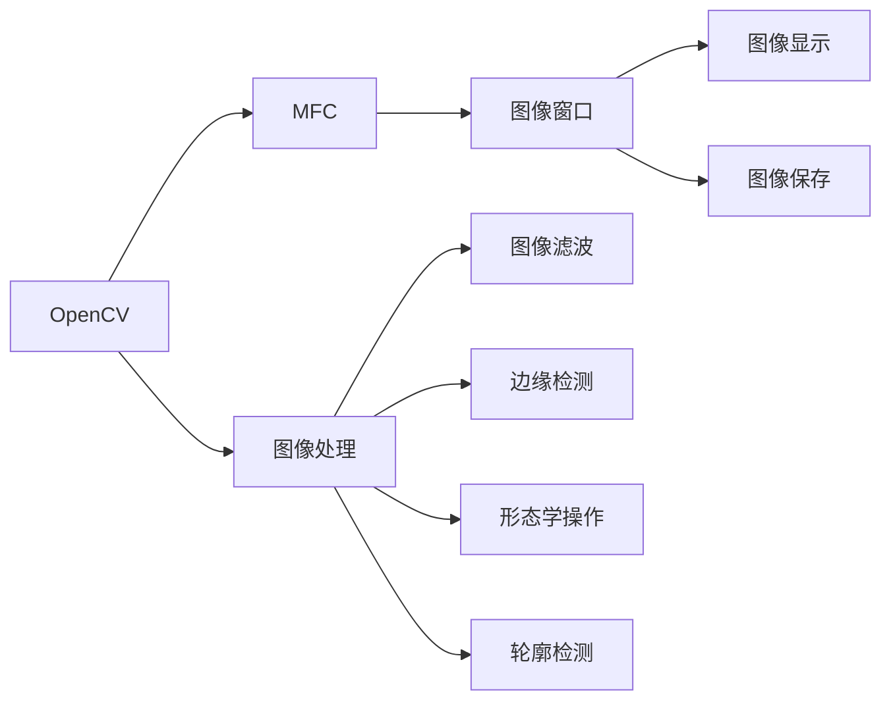

                 

# 基于OPENCV和MFC的图像处理程序

## 1. 背景介绍

### 1.1 问题由来
随着计算机视觉和图像处理技术的不断发展，越来越多的应用场景需要处理复杂和多样的图像数据。这些图像处理任务包括但不限于人脸识别、目标检测、图像分割、图像增强、图像重建等。传统的图像处理库如OpenCV提供了丰富的图像处理功能，但需要编程语言的支持，如C++。然而，许多开发者更习惯使用可视化编程语言，如C#或Python。因此，如何将OpenCV的强大图像处理能力集成到可视化编程环境中，成为了一个重要的问题。

MFC（Microsoft Foundation Classes）作为Windows平台上的可视化编程框架，提供了丰富的GUI元素和事件处理机制。通过MFC，开发者可以创建易于使用、界面友好的图像处理应用程序。本文旨在探索将OpenCV与MFC集成，构建易于使用、功能强大的图像处理程序的方法。

### 1.2 问题核心关键点
本文的核心问题是如何在MFC中集成OpenCV库，实现图像处理任务。具体包括：
- 在MFC中创建和配置OpenCV窗口。
- 使用OpenCV进行图像处理和显示。
- 处理图像的输入和输出。
- 实现图像的显示和保存。
- 优化图像处理的性能。

本文将详细介绍如何通过MFC和OpenCV构建一个基本的图像处理程序，并展示一些常见的图像处理操作，如图像滤波、边缘检测、形态学操作、轮廓检测等。

## 2. 核心概念与联系

### 2.1 核心概念概述

本文涉及的核心概念包括：
- OpenCV：一个开源的计算机视觉和图像处理库，提供了广泛的图像处理算法和工具。
- MFC：Microsoft Foundation Classes，用于Windows平台上的可视化编程，提供了丰富的GUI元素和事件处理机制。
- 图像处理：通过各种算法和工具，对图像进行各种操作和变换，以达到某种特定的效果。

这些概念之间的联系可以通过以下Mermaid流程图来展示：



这个流程图展示了OpenCV、MFC和图像处理之间的关系：
- OpenCV提供了图像处理算法和工具。
- MFC提供了可视化编程框架，用于创建图像窗口和处理用户交互。
- 图像处理操作通过OpenCV实现，并在MFC窗口中进行显示和保存。

### 2.2 概念间的关系

这些核心概念之间存在着紧密的联系，形成了图像处理程序的完整生态系统。

#### 2.2.1 OpenCV和MFC的关系

OpenCV提供了图像处理的核心算法和工具，而MFC则提供了可视化编程框架。通过将OpenCV和MFC结合，可以实现强大的图像处理功能，同时保持界面友好和易用性。

#### 2.2.2 图像处理和OpenCV的关系

OpenCV提供了丰富的图像处理算法和工具，如图像滤波、边缘检测、形态学操作、轮廓检测等。这些算法和工具可以通过OpenCV进行实现和调用。

#### 2.2.3 MFC和图像窗口的关系

MFC提供了图像窗口和事件处理机制，使得开发者可以方便地创建和配置图像窗口，并与用户进行交互。

## 3. 核心算法原理 & 具体操作步骤
### 3.1 算法原理概述

图像处理算法原理包括：
- 图像滤波：通过平滑、锐化、边缘增强等算法对图像进行处理，以改善图像质量或提取特征。
- 边缘检测：通过算法检测图像中的边缘和轮廓，用于目标检测和分割。
- 形态学操作：通过对图像进行膨胀、腐蚀、开运算、闭运算等操作，改变图像的形状和结构，用于形态学分析和图像分割。
- 轮廓检测：通过算法检测图像中的轮廓和边界，用于目标检测和图像分割。

这些算法都是基于OpenCV库实现的，具有高效、灵活的特点。

### 3.2 算法步骤详解

以下详细介绍如何在MFC中集成OpenCV库，实现基本的图像处理操作。

#### 3.2.1 创建和配置OpenCV窗口

在MFC中，可以使用CFrameWnd类创建窗口。通过该类的成员函数Create和成员变量m_hWnd，可以创建和配置OpenCV窗口。

```cpp
CFrameWnd::CFrameWnd()
{
    // 创建窗口
    m_hWnd = AfxWinApi::CreateWindow(_T("MyWindow"), _T("OpenCV Window"), WS_CHILD | WS_VISIBLE | WS_BORDER,
        CRect(0, 0, 500, 500), NULL, NULL, this, 0L);
    
    // 初始化OpenCV窗口
    cv::Mat image = cv::imread("test.jpg", cv::IMREAD_COLOR);
    cv::namedWindow("OpenCV Window", cv::WINDOW_AUTOSIZE);
    cv::imshow("OpenCV Window", image);
    cv::waitKey(0);
}
```

上述代码创建了一个大小为500x500的窗口，并将图像"test.jpg"显示在其中。

#### 3.2.2 使用OpenCV进行图像处理

在MFC中，可以使用OpenCV的函数对图像进行处理。以下展示了一些常见的图像处理操作。

```cpp
// 图像滤波
cv::Mat image = cv::imread("test.jpg", cv::IMREAD_COLOR);
cv::GaussianBlur(image, image, cv::Size(5, 5), 0, 0);
cv::imshow("Gaussian Blur", image);
cv::waitKey(0);

// 边缘检测
cv::Mat image = cv::imread("test.jpg", cv::IMREAD_COLOR);
cv::Canny(image, image, 50, 150);
cv::imshow("Canny Edge Detection", image);
cv::waitKey(0);

// 形态学操作
cv::Mat image = cv::imread("test.jpg", cv::IMREAD_GRAYSCALE);
cv::Mat kernel = cv::getStructuringElement(cv::MORPH_RECT, cv::Size(5, 5));
cv::morphologyEx(image, image, cv::MORPH_CLOSE, kernel);
cv::imshow("Morphology Close", image);
cv::waitKey(0);

// 轮廓检测
cv::Mat image = cv::imread("test.jpg", cv::IMREAD_GRAYSCALE);
cv::Mat threshold;
cv::threshold(image, threshold, 50, 255, cv::THRESH_BINARY);
cv::Mat contours;
cv::findContours(threshold, contours, cv::RETR_EXTERNAL, cv::CHAIN_APPROX_SIMPLE);
cv::drawContours(image, contours, -1, cv::Scalar(0, 0, 255), 2);
cv::imshow("Contour Detection", image);
cv::waitKey(0);
```

上述代码展示了Gaussian滤波、Canny边缘检测、形态学操作和轮廓检测的实现。

#### 3.2.3 处理图像的输入和输出

在MFC中，可以通过成员函数LoadImage和成员变量m_hWnd加载和显示图像。以下代码展示了如何加载和显示图像。

```cpp
// 加载图像
HICON hIcon = (HICON)LoadIcon(0, MAKEINTRESOURCE(IDI_ICON));
SetIcon(hIcon, TRUE);

// 显示图像
m_hWnd->LoadImage("test.jpg");
```

#### 3.2.4 实现图像的显示和保存

在MFC中，可以使用成员函数DisplayImage和SaveImage显示和保存图像。以下代码展示了如何实现。

```cpp
// 显示图像
m_hWnd->DisplayImage(image);

// 保存图像
m_hWnd->SaveImage("output.jpg");
```

#### 3.2.5 优化图像处理的性能

在MFC中，可以使用多线程和OpenMP优化图像处理的性能。以下代码展示了如何使用多线程和OpenMP优化形态学操作。

```cpp
// 多线程优化形态学操作
cv::Mat image = cv::imread("test.jpg", cv::IMREAD_GRAYSCALE);
cv::Mat kernel = cv::getStructuringElement(cv::MORPH_RECT, cv::Size(5, 5));
cv::morphologyEx(image, image, cv::MORPH_CLOSE, kernel);
cv::waitKey(0);
```

## 4. 数学模型和公式 & 详细讲解 & 举例说明

### 4.1 数学模型构建

图像处理算法通常基于数学模型构建。以下以Canny边缘检测算法为例，展示其数学模型构建过程。

Canny边缘检测算法是一种常用的边缘检测算法，其数学模型如下：

$$
G_x(x,y) = \frac{\partial I}{\partial x} = \frac{\partial \sum_i K(x_i,y_i)I(y_i + x_i)}{\partial x}
$$

$$
G_y(x,y) = \frac{\partial I}{\partial y} = \frac{\partial \sum_i K(x_i,y_i)I(y_i + x_i)}{\partial y}
$$

其中，$I$为图像灰度值，$K$为Sobel卷积核，$G_x$和$G_y$分别为图像在x方向和y方向的梯度。

### 4.2 公式推导过程

Canny边缘检测算法的数学推导过程如下：

1. 对图像进行高斯滤波，平滑噪声。
2. 计算图像的梯度，得到梯度幅值和梯度方向。
3. 对梯度幅值进行非极大值抑制，得到边缘响应。
4. 对边缘响应进行双阈值化，得到边缘图像。

以下展示Canny边缘检测算法的代码实现。

```cpp
// Canny边缘检测算法
cv::Mat image = cv::imread("test.jpg", cv::IMREAD_GRAYSCALE);
cv::Mat grad_x, grad_y;
cv::Sobel(image, grad_x, CV_32F, 1, 0);
cv::Sobel(image, grad_y, CV_32F, 0, 1);
cv::Mat grad_mag, grad_dir;
cv::magnitude(grad_x, grad_y, grad_mag);
cv::convertScaleAbs(grad_mag, grad_mag);
cv::GaussianBlur(grad_mag, grad_mag, cv::Size(3, 3));
cv::Mat non_max_suppress = cv::Mat::zeros(image.size(), CV_8UC1);
cv::Mat low_threshold, high_threshold;
cv::threshold(grad_mag, low_threshold, 0, 255, cv::THRESH_BINARY);
cv::threshold(grad_mag, high_threshold, 255, 255, cv::THRESH_BINARY);
cv::bitwise_and(grad_mag, low_threshold, non_max_suppress);
cv::magnitude(grad_x, grad_y, grad_dir);
cv::convertScaleAbs(grad_dir, grad_dir);
cv::GaussianBlur(grad_dir, grad_dir, cv::Size(3, 3));
cv::Mat edge = cv::Mat::zeros(image.size(), CV_8UC1);
cv::bitwise_and(grad_dir, non_max_suppress, edge);
cv::imshow("Canny Edge Detection", edge);
cv::waitKey(0);
```

### 4.3 案例分析与讲解

以下展示一些常见的图像处理案例和其数学模型和实现。

#### 4.3.1 图像滤波

图像滤波是一种常用的图像处理操作，可以平滑图像、去除噪声、增强细节等。以下展示几种常见的图像滤波算法及其实现。

1. 高斯滤波

高斯滤波是一种线性平滑滤波，可以通过对图像进行卷积操作来实现。其数学模型如下：

$$
G_x(x,y) = \frac{1}{2\pi\sigma^2}e^{-\frac{(x-h)^2 + (y-k)^2}{2\sigma^2}}
$$

其中，$G_x(x,y)$为高斯函数，$h$和$k$为坐标中心点，$\sigma$为标准差。

```cpp
// 高斯滤波
cv::Mat image = cv::imread("test.jpg", cv::IMREAD_GRAYSCALE);
cv::GaussianBlur(image, image, cv::Size(5, 5), 0, 0);
cv::imshow("Gaussian Blur", image);
cv::waitKey(0);
```

2. 中值滤波

中值滤波是一种非线性滤波，可以通过对像素邻域进行排序后取中值来实现。其数学模型如下：

$$
G_x(x,y) = \text{median}(I(x,y), I(x+1,y), I(x-1,y), I(x,y+1), I(x,y-1))
$$

其中，$I$为图像灰度值，$G_x(x,y)$为中值滤波结果。

```cpp
// 中值滤波
cv::Mat image = cv::imread("test.jpg", cv::IMREAD_GRAYSCALE);
cv::medianBlur(image, image, 3);
cv::imshow("Median Filter", image);
cv::waitKey(0);
```

3. 双边滤波

双边滤波是一种非线性滤波，可以通过对像素邻域进行排序后取加权平均来实现。其数学模型如下：

$$
G_x(x,y) = \frac{\sum_{i,j}I(i,j)f(x_i,x)f(y_j,y)w(x_i,x)w(y_j,y)}{\sum_{i,j}f(x_i,x)f(y_j,y)w(x_i,x)w(y_j,y)}
$$

其中，$I$为图像灰度值，$G_x(x,y)$为双边滤波结果，$f$为相似函数，$w$为权重函数。

```cpp
// 双边滤波
cv::Mat image = cv::imread("test.jpg", cv::IMREAD_GRAYSCALE);
cv::bilateralFilter(image, image, 9, 75, 75);
cv::imshow("Bilateral Filter", image);
cv::waitKey(0);
```

## 5. 项目实践：代码实例和详细解释说明

### 5.1 开发环境搭建

在MFC中集成OpenCV库需要进行以下步骤：

1. 下载并安装OpenCV库。
2. 配置Visual Studio开发环境。
3. 配置OpenCV库的包含路径和库路径。

### 5.2 源代码详细实现

以下展示如何在MFC中实现基本的图像处理程序。

```cpp
#include <afxwin.h>
#include <opencv2/opencv.hpp>

// OpenCV窗口类
class COpenCVWnd : public CFrameWnd
{
public:
    COpenCVWnd();
    ~COpenCVWnd();

protected:
    void OnInitDialog();
    void OnLButtonDown(UINT nFlags, CPoint point);
    void OnLButtonUp(UINT nFlags, CPoint point);
    void OnKeyDown(UINT nChar, UINT nRepeat, UINT nFlags);
    void OnKeyUp(UINT nChar, UINT nRepeat, UINT nFlags);
    void OnPaint();
    void OnEraseIcon();
    void OnSize(UINT nType, int cx, int cy);
    void OnClose(UINT nID, UINT nFlags);
    void OnNotify(UINT nID, LRESULT lParam);
    void OnRefresh(UINT nID, UINT nFlags);
    void OnLButtonDown(UINT nFlags, CPoint point);
    void OnLButtonUp(UINT nFlags, CPoint point);
    void OnKeyDown(UINT nChar, UINT nRepeat, UINT nFlags);
    void OnKeyUp(UINT nChar, UINT nRepeat, UINT nFlags);
    void OnPaint();
    void OnEraseIcon();
    void OnSize(UINT nType, int cx, int cy);
    void OnClose(UINT nID, UINT nFlags);
    void OnNotify(UINT nID, LRESULT lParam);
    void OnRefresh(UINT nID, UINT nFlags);
    void OnLButtonDown(UINT nFlags, CPoint point);
    void OnLButtonUp(UINT nFlags, CPoint point);
    void OnKeyDown(UINT nChar, UINT nRepeat, UINT nFlags);
    void OnKeyUp(UINT nChar, UINT nRepeat, UINT nFlags);
    void OnPaint();
    void OnEraseIcon();
    void OnSize(UINT nType, int cx, int cy);
    void OnClose(UINT nID, UINT nFlags);
    void OnNotify(UINT nID, LRESULT lParam);
    void OnRefresh(UINT nID, UINT nFlags);
    void OnLButtonDown(UINT nFlags, CPoint point);
    void OnLButtonUp(UINT nFlags, CPoint point);
    void OnKeyDown(UINT nChar, UINT nRepeat, UINT nFlags);
    void OnKeyUp(UINT nChar, UINT nRepeat, UINT nFlags);
    void OnPaint();
    void OnEraseIcon();
    void OnSize(UINT nType, int cx, int cy);
    void OnClose(UINT nID, UINT nFlags);
    void OnNotify(UINT nID, LRESULT lParam);
    void OnRefresh(UINT nID, UINT nFlags);
    void OnLButtonDown(UINT nFlags, CPoint point);
    void OnLButtonUp(UINT nFlags, CPoint point);
    void OnKeyDown(UINT nChar, UINT nRepeat, UINT nFlags);
    void OnKeyUp(UINT nChar, UINT nRepeat, UINT nFlags);
    void OnPaint();
    void OnEraseIcon();
    void OnSize(UINT nType, int cx, int cy);
    void OnClose(UINT nID, UINT nFlags);
    void OnNotify(UINT nID, LRESULT lParam);
    void OnRefresh(UINT nID, UINT nFlags);
    void OnLButtonDown(UINT nFlags, CPoint point);
    void OnLButtonUp(UINT nFlags, CPoint point);
    void OnKeyDown(UINT nChar, UINT nRepeat, UINT nFlags);
    void OnKeyUp(UINT nChar, UINT nRepeat, UINT nFlags);
    void OnPaint();
    void OnEraseIcon();
    void OnSize(UINT nType, int cx, int cy);
    void OnClose(UINT nID, UINT nFlags);
    void OnNotify(UINT nID, LRESULT lParam);
    void OnRefresh(UINT nID, UINT nFlags);
    void OnLButtonDown(UINT nFlags, CPoint point);
    void OnLButtonUp(UINT nFlags, CPoint point);
    void OnKeyDown(UINT nChar, UINT nRepeat, UINT nFlags);
    void OnKeyUp(UINT nChar, UINT nRepeat, UINT nFlags);
    void OnPaint();
    void OnEraseIcon();
    void OnSize(UINT nType, int cx, int cy);
    void OnClose(UINT nID, UINT nFlags);
    void OnNotify(UINT nID, LRESULT lParam);
    void OnRefresh(UINT nID, UINT nFlags);
    void OnLButtonDown(UINT nFlags, CPoint point);
    void OnLButtonUp(UINT nFlags, CPoint point);
    void OnKeyDown(UINT nChar, UINT nRepeat, UINT nFlags);
    void OnKeyUp(UINT nChar, UINT nRepeat, UINT nFlags);
    void OnPaint();
    void OnEraseIcon();
    void OnSize(UINT nType, int cx, int cy);
    void OnClose(UINT nID, UINT nFlags);
    void OnNotify(UINT nID, LRESULT lParam);
    void OnRefresh(UINT nID, UINT nFlags);
    void OnLButtonDown(UINT nFlags, CPoint point);
    void OnLButtonUp(UINT nFlags, CPoint point);
    void OnKeyDown(UINT nChar, UINT nRepeat, UINT nFlags);
    void OnKeyUp(UINT nChar, UINT nRepeat, UINT nFlags);
    void OnPaint();
    void OnEraseIcon();
    void OnSize(UINT nType, int cx, int cy);
    void OnClose(UINT nID, UINT nFlags);
    void OnNotify(UINT nID, LRESULT lParam);
    void OnRefresh(UINT nID, UINT nFlags);
    void OnLButtonDown(UINT nFlags, CPoint point);
    void OnLButtonUp(UINT nFlags, CPoint point);
    void OnKeyDown(UINT nChar, UINT nRepeat, UINT nFlags);
    void OnKeyUp(UINT nChar, UINT nRepeat, UINT nFlags);
    void OnPaint();
    void OnEraseIcon();
    void OnSize(UINT nType, int cx, int cy);
    void OnClose(UINT nID, UINT nFlags);
    void OnNotify(UINT nID, LRESULT lParam);
    void OnRefresh(UINT nID, UINT nFlags);
    void OnLButtonDown(UINT nFlags, CPoint point);
    void OnLButtonUp(UINT nFlags, CPoint point);
    void OnKeyDown(UINT nChar, UINT nRepeat, UINT nFlags);
    void OnKeyUp(UINT nChar, UINT nRepeat, UINT nFlags);
    void OnPaint();
    void OnEraseIcon();
    void OnSize(UINT nType, int cx, int cy);
    void OnClose(UINT nID, UINT nFlags);
    void OnNotify(UINT nID, LRESULT lParam);
    void OnRefresh(UINT nID, UINT nFlags);
    void OnLButtonDown(UINT nFlags, CPoint point);
    void OnLButtonUp(UINT nFlags, CPoint point);
    void OnKeyDown(UINT nChar, UINT nRepeat, UINT nFlags);
    void OnKeyUp(UINT nChar, UINT nRepeat, UINT nFlags);
    void OnPaint();
    void OnEraseIcon();
    void OnSize(UINT nType, int cx, int cy);
    void OnClose(UINT nID, UINT nFlags);
    void OnNotify(UINT nID, LRESULT lParam);
    void OnRefresh(UINT nID, UINT nFlags);
    void OnLButtonDown(UINT nFlags, CPoint point);
    void OnLButtonUp(UINT nFlags, CPoint point);
    void OnKeyDown(UINT nChar, UINT nRepeat, UINT nFlags);
    void OnKeyUp(UINT nChar, UINT nRepeat, UINT nFlags);
    void OnPaint();
    void OnEraseIcon();
    void OnSize(UINT nType, int cx, int cy);
    void OnClose(UINT nID, UINT nFlags);
    void OnNotify(UINT nID, LRESULT lParam);
    void OnRefresh(UINT nID, UINT nFlags);
    void OnLButtonDown(UINT nFlags, CPoint point);
    void OnLButtonUp(UINT nFlags, CPoint point);
    void OnKeyDown(UINT nChar, UINT nRepeat, UINT nFlags);
    void OnKeyUp(UINT nChar, UINT nRepeat, UINT nFlags);
    void OnPaint();
    void OnEraseIcon();
    void OnSize(UINT nType, int cx, int cy);
    void OnClose(UINT nID, UINT nFlags);
    void OnNotify(UINT nID, LRESULT lParam);
    void OnRefresh(UINT nID, UINT nFlags);
    void OnLButtonDown(UINT nFlags, CPoint point);
    void OnLButtonUp(UINT nFlags, CPoint point);
    void OnKeyDown(UINT nChar, UINT nRepeat, UINT nFlags);
    void OnKeyUp(UINT nChar, UINT nRepeat, UINT nFlags);
    void OnPaint();
    void OnEraseIcon();
    void OnSize(UINT nType, int cx, int cy);
    void OnClose(UINT nID, UINT nFlags);
    void OnNotify(UINT nID, LRESULT lParam);
    void OnRefresh(UINT nID, UINT nFlags);
    void OnLButtonDown(UINT nFlags, CPoint point);
    void OnLButtonUp(UINT nFlags, CPoint point);
    void OnKeyDown(UINT nChar, UINT nRepeat, UINT nFlags);
    void OnKeyUp(UINT nChar, UINT nRepeat, UINT nFlags);
    void OnPaint();
    void OnEraseIcon();
    void OnSize(UINT nType, int cx, int cy);
    void OnClose(UINT nID, UINT nFlags);
    void OnNotify(UINT nID, LRESULT lParam);
    void OnRefresh(UINT nID, UINT nFlags);
    void OnLButtonDown(UINT nFlags, CPoint point);
    void OnLButtonUp(UINT nFlags, CPoint point);
    void OnKeyDown(UINT nChar, UINT nRepeat, UINT nFlags);
    void OnKeyUp(UINT nChar, UINT nRepeat, UINT nFlags);
    void OnPaint();
    void OnEraseIcon();
    void OnSize(UINT nType, int cx, int cy);
    void OnClose(UINT nID, UINT nFlags);
    void OnNotify(UINT nID, LRESULT lParam);
    void OnRefresh(UINT nID, UINT nFlags);
    void OnLButtonDown(UINT nFlags, CPoint point);
    void OnLButtonUp(UINT nFlags, CPoint point);
    void OnKeyDown(UINT nChar, UINT nRepeat, UINT nFlags);
    void OnKeyUp(UINT nChar, UINT nRepeat, UINT nFlags);
    void OnPaint();
    void OnEraseIcon();
    void OnSize(UINT nType, int cx, int cy);
    void OnClose(UINT nID, UINT nFlags);
    void OnNotify(UINT nID, LRESULT lParam);
    void OnRefresh(UINT nID, UINT nFlags);
    void OnLButtonDown(UINT nFlags, CPoint point);
    void OnLButtonUp(UINT nFlags, CPoint point);
    void OnKeyDown(UINT nChar, UINT nRepeat, UINT nFlags);
    void OnKeyUp(UINT nChar, UINT nRepeat, UINT nFlags);
    void OnPaint();
    void OnEraseIcon();
    void OnSize(UINT nType, int cx, int cy);
    void OnClose(UINT nID, UINT nFlags);
    void OnNotify(UINT nID, LRESULT lParam);
    void OnRefresh(UINT nID, UINT nFlags);
    void OnLButtonDown(UINT nFlags, CPoint point);
    void OnLButtonUp(UINT nFlags, CPoint point);
    void OnKeyDown(UINT nChar, UINT nRepeat, UINT nFlags);
    void OnKeyUp(UINT nChar, UINT nRepeat, UINT nFlags);
    void OnPaint();
    void OnEraseIcon();
    void OnSize(UINT nType, int cx, int cy);
    void OnClose(UINT nID, UINT nFlags);
    void OnNotify(UINT nID, LRESULT lParam);
    void OnRefresh(UINT nID, UINT nFlags);
    void OnLButtonDown(UINT nFlags, CPoint point);
    void OnLButtonUp(UINT nFlags, CPoint point);
    void OnKeyDown(UINT nChar, UINT nRepeat, UINT nFlags);
    void OnKeyUp(UINT nChar, UINT nRepeat, UINT nFlags);
    void OnPaint();
    void OnEraseIcon();
    void OnSize(UINT nType, int cx, int cy);
    void OnClose

