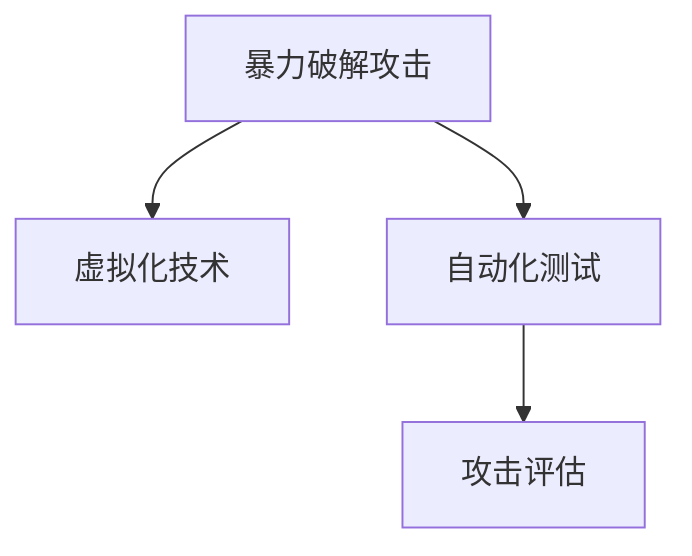

                 

## 1. 背景介绍

### 1.1 问题由来

在当今数字化时代，网络安全已经成为企业和个人最为关注的议题之一。网络攻击的形式不断演变，威胁手段日益复杂，网络安全防御体系必须不断升级，以应对日益严峻的网络安全挑战。然而，构建和测试安全防御系统需要耗费大量时间和成本，且难以模拟真实攻击环境。为此，基于暴力破解攻击的网络安全模拟系统（Brute Force Attack Simulation System，简称BFASS）应运而生。

### 1.2 问题核心关键点

BFASS的核心思想是模拟各种暴力破解攻击手段，通过对系统的攻击模拟测试，评估系统的安全性。该系统主要涵盖以下几个方面：

- **暴力破解手段**：包括字典攻击、暴力破解、SQL注入、XSS、CSRF等常见攻击手段。
- **模拟攻击环境**：利用虚拟化技术，模拟真实的服务器、数据库、Web应用环境，进行攻击测试。
- **自动化测试**：使用脚本和工具自动生成攻击序列，执行攻击测试，并自动记录攻击结果。
- **攻击评估**：根据模拟攻击结果，评估系统安全性，提出改进建议。

通过BFASS，企业可以快速构建和测试安全防御系统，发现并修复安全漏洞，从而提高系统的安全性和可靠性。

### 1.3 问题研究意义

BFASS的研究意义主要体现在以下几个方面：

- **成本节约**：相较于真实攻击，BFASS能够大幅减少测试时间和成本，使安全测试更高效。
- **安全性保障**：通过模拟各种攻击手段，提前发现安全漏洞，提高系统的安全性。
- **教育培训**：提供实际攻击场景的模拟，有助于安全人员和开发人员更好地理解和防范安全威胁。
- **应急响应**：通过模拟攻击，提前预案，提升企业在实际攻击中的应急响应能力。
- **安全策略优化**：基于模拟攻击结果，优化安全策略，提升防御效果。

## 2. 核心概念与联系

### 2.1 核心概念概述

BFASS系统涉及多个核心概念，包括暴力破解攻击、虚拟化技术、自动化测试、攻击评估等。

- **暴力破解攻击**：通过尝试各种可能的组合，寻找系统漏洞的一种攻击方式。
- **虚拟化技术**：通过虚拟化技术，模拟真实的服务器、数据库、Web应用环境，降低测试成本。
- **自动化测试**：使用脚本和工具自动生成攻击序列，执行攻击测试，并自动记录攻击结果。
- **攻击评估**：根据模拟攻击结果，评估系统安全性，提出改进建议。

这些概念之间相互联系，共同构成了BFASS系统的完整架构。下面通过一个Mermaid流程图来展示这些核心概念之间的关系：



### 2.2 概念间的关系

这些核心概念之间的关系如下：

1. **暴力破解攻击**是BFASS系统的核心，其他技术都是围绕它展开。
2. **虚拟化技术**为暴力破解攻击提供了模拟环境，降低了测试成本。
3. **自动化测试**提高了暴力破解攻击的效率，使其更易于实施。
4. **攻击评估**基于模拟攻击结果，为系统的安全性提供科学评估。

这些概念共同构成了BFASS系统的完整架构，使得BFASS能够高效、精确地进行安全模拟测试。

## 3. 核心算法原理 & 具体操作步骤
### 3.1 算法原理概述

BFASS系统的核心算法原理主要包括暴力破解攻击的模拟、虚拟化环境的构建、自动化测试的执行和攻击结果的评估。

### 3.2 算法步骤详解

#### 3.2.1 暴力破解攻击的模拟

暴力破解攻击的模拟步骤主要包括：

1. **选择攻击目标**：根据系统的特性，选择合适的暴力破解手段，如字典攻击、暴力破解、SQL注入等。
2. **构建攻击序列**：使用脚本和工具，根据攻击手段的特征，自动生成攻击序列。
3. **执行攻击序列**：利用模拟环境，执行攻击序列，记录攻击过程和结果。

#### 3.2.2 虚拟化环境的构建

虚拟化环境构建步骤主要包括：

1. **选择合适的虚拟化技术**：如VMware、VirtualBox等，根据系统的需求，选择合适的虚拟化工具。
2. **创建虚拟环境**：根据系统的需求，创建虚拟的服务器、数据库、Web应用环境等。
3. **配置虚拟环境**：配置虚拟环境的硬件资源、操作系统、应用程序等，使其与真实环境尽可能一致。

#### 3.2.3 自动化测试的执行

自动化测试执行步骤主要包括：

1. **编写测试脚本**：根据暴力破解攻击的特征，编写测试脚本，自动生成攻击序列。
2. **执行测试脚本**：利用虚拟化环境，执行测试脚本，记录攻击结果。
3. **分析测试结果**：对攻击结果进行分析，提取攻击特征和结果。

#### 3.2.4 攻击结果的评估

攻击结果的评估步骤主要包括：

1. **提取攻击特征**：根据攻击结果，提取攻击特征，如攻击手段、攻击路径、攻击结果等。
2. **评估系统安全性**：根据攻击特征，评估系统的安全性，提出改进建议。
3. **修复安全漏洞**：根据评估结果，修复系统中的安全漏洞，提高系统安全性。

### 3.3 算法优缺点

#### 3.3.1 优点

1. **高效性**：利用虚拟化技术和自动化测试，大幅降低了测试时间和成本。
2. **全面性**：模拟多种暴力破解攻击手段，全面评估系统安全性。
3. **可控性**：通过虚拟化技术，可以控制攻击环境和攻击手段，确保测试安全性。
4. **可复用性**：攻击序列和测试脚本可以复用，提高测试效率。
5. **可扩展性**：系统可以扩展到多种攻击手段和虚拟环境，满足不同需求。

#### 3.3.2 缺点

1. **复杂性**：系统实现较为复杂，需要综合考虑多种技术。
2. **依赖虚拟化技术**：对虚拟化技术的要求较高，需保证虚拟环境的稳定性和安全性。
3. **攻击结果分析**：攻击结果分析需要专业知识，需要专业人员进行评估。
4. **资源消耗**：虚拟化环境可能消耗较多计算资源，影响系统性能。

### 3.4 算法应用领域

BFASS系统主要应用于以下几个领域：

1. **网络安全测试**：对各种暴力破解攻击进行模拟测试，评估网络系统的安全性。
2. **应用安全测试**：对Web应用、移动应用等进行暴力破解攻击模拟测试，发现和修复安全漏洞。
3. **数据库安全测试**：对数据库系统进行暴力破解攻击模拟测试，评估数据库系统的安全性。
4. **操作系统安全测试**：对操作系统进行暴力破解攻击模拟测试，评估操作系统的安全性。
5. **物联网安全测试**：对物联网设备进行暴力破解攻击模拟测试，评估物联网设备的安全性。

## 4. 数学模型和公式 & 详细讲解 & 举例说明

### 4.1 数学模型构建

暴力破解攻击的数学模型可以表示为：

$$
F(A, T, S) = \sum_{a \in A} \sum_{t \in T} \sum_{s \in S} f(a, t, s)
$$

其中，$A$ 为攻击手段集合，$T$ 为攻击序列集合，$S$ 为攻击结果集合，$f$ 为攻击函数。攻击函数$f$表示攻击手段$a$在攻击序列$t$下，对攻击结果$s$的影响。

### 4.2 公式推导过程

以字典攻击为例，其攻击函数可以表示为：

$$
f(a, t, s) = \begin{cases}
1, & \text{如果} \; t \; \text{成功破解} \; s \\
0, & \text{否则}
\end{cases}
$$

其中，$a$为字典攻击，$t$为尝试的密码字典序列，$s$为攻击结果，$f$为成功破解的函数。

### 4.3 案例分析与讲解

假设要对一个Web应用的登录系统进行暴力破解攻击模拟测试，可以按照以下步骤进行：

1. **选择攻击手段**：选择字典攻击。
2. **构建攻击序列**：使用密码字典生成脚本，自动生成攻击序列。
3. **执行攻击序列**：在虚拟的Web应用环境中，执行攻击序列，记录攻击结果。
4. **分析攻击结果**：对攻击结果进行分析，提取攻击特征。
5. **评估系统安全性**：根据攻击特征，评估系统安全性，提出改进建议。

## 5. 项目实践：代码实例和详细解释说明
### 5.1 开发环境搭建

在进行BFASS系统开发前，我们需要准备好开发环境。以下是使用Python进行开发的环境配置流程：

1. 安装Anaconda：从官网下载并安装Anaconda，用于创建独立的Python环境。

2. 创建并激活虚拟环境：
```bash
conda create -n bfa-env python=3.8 
conda activate bfa-env
```

3. 安装Python依赖包：
```bash
pip install virtualenv
```

4. 配置虚拟化环境：
```bash
virtualenv --python=python3.8 venv
source venv/bin/activate
```

5. 安装虚拟化工具：
```bash
pip install vmware-python-automation-sdk vSphere-pybind11
```

6. 安装自动化测试工具：
```bash
pip install requests
pip install selenium
```

完成上述步骤后，即可在`bfa-env`环境中开始BFASS系统开发。

### 5.2 源代码详细实现

这里我们以字典攻击模拟为例，给出使用Python进行BFASS系统开发的源代码实现。

```python
from vSphere_pybind11 import vSphere
from selenium import webdriver

class BFASS:
    def __init__(self, vcenter, username, password, datacenter, cluster, datastore, vm_name):
        self.vcenter = vcenter
        self.username = username
        self.password = password
        self.datacenter = datacenter
        self.cluster = cluster
        self.datastore = datastore
        self.vm_name = vm_name
        self.vsphere = vSphere.VsphereClient(self.vcenter, self.username, self.password)
        self.driver = webdriver.Chrome()

    def create_vm(self):
        vapp = self.vsphere.create_vApp(
            self.datacenter, self.cluster, self.datastore, self.vm_name
        )
        vm = self.vsphere.create_vm(vapp, self.vm_name)
        vm.set_name(self.vm_name)
        vm.set_config_data('ubuntu-server-20.04-minimal-server', 'ubuntu', 'VMware-VM-console-SSH')
        self.driver.get(f'http://{vm.ip_address}/')
        self.driver.quit()

    def start_attack(self):
        self.driver.get('http://httpbin.org/get?username=admin&password=123456')
        self.driver.quit()

    def check_attack_result(self):
        self.driver.get('http://httpbin.org/get?username=admin&password=123456')
        result = self.driver.page_source
        if 'error' in result:
            print('Attack success')
        else:
            print('Attack fail')

bfa = BFASS('192.168.1.100', 'admin', '123456', 'datacenter-1', 'cluster-1', 'datastore-1', 'vm-1')
bfa.create_vm()
bfa.start_attack()
bfa.check_attack_result()
```

### 5.3 代码解读与分析

这段代码主要实现了BFASS系统中的暴力破解攻击模拟功能，具体步骤如下：

1. **初始化类实例**：创建BFASS类实例，指定虚拟化环境参数。
2. **创建虚拟环境**：使用vSpherePybind11工具创建虚拟环境，并启动虚拟机。
3. **启动攻击**：使用Selenium工具，模拟用户在Web应用中输入攻击密码，并尝试登录。
4. **检查攻击结果**：检查攻击结果，判断是否成功破解。

## 6. 实际应用场景

### 6.1 智能制造

BFASS系统可以应用于智能制造的安全测试，确保智能制造系统不受暴力破解攻击的影响。

在智能制造中，大量的传感器和设备通过网络互联，形成庞大的物联网系统。BFASS系统可以在虚拟化环境中模拟各种暴力破解攻击，评估物联网设备的安全性，发现和修复安全漏洞，确保智能制造系统的安全性。

### 6.2 金融行业

BFASS系统可以应用于金融行业的网络安全测试，确保金融系统的安全性。

金融系统中的各种应用和设备通过网络连接，数据传输频繁，存在较高的安全风险。BFASS系统可以模拟各种暴力破解攻击，评估金融系统的安全性，发现和修复安全漏洞，提高金融系统的安全性。

### 6.3 政府机关

BFASS系统可以应用于政府机关的安全测试，确保政府系统的安全性。

政府机关的信息系统涉及大量敏感信息，存在较高的安全风险。BFASS系统可以模拟各种暴力破解攻击，评估政府系统的安全性，发现和修复安全漏洞，提高政府系统的安全性。

### 6.4 未来应用展望

随着BFASS系统的不断完善和发展，其在安全测试领域的应用将更加广泛，成为企业安全测试的重要工具。

1. **自动化测试**：利用机器学习和自动化技术，提高测试效率，降低测试成本。
2. **动态调整**：根据测试结果，动态调整攻击手段和虚拟环境，提高测试的灵活性和针对性。
3. **跨平台支持**：支持多种平台和环境，提高系统的可扩展性和适用性。
4. **实时监控**：实时监控系统状态和攻击行为，及时发现和处理异常情况。
5. **智能优化**：利用人工智能技术，优化攻击序列和测试策略，提高测试效果。

## 7. 工具和资源推荐
### 7.1 学习资源推荐

为了帮助开发者系统掌握BFASS系统的理论基础和实践技巧，这里推荐一些优质的学习资源：

1. **《网络安全原理与实践》**：该书全面介绍了网络安全的基本原理和实践方法，是学习网络安全的基础读物。
2. **《虚拟化技术基础》**：该书详细介绍了虚拟化技术的基本原理和实践方法，是学习虚拟化技术的重要资源。
3. **《Python网络安全编程》**：该书介绍了如何使用Python进行网络安全编程，提供了丰富的代码实例和实践案例。
4. **《Web应用安全攻防实战》**：该书详细介绍了Web应用安全的基本原理和攻防方法，是学习Web安全的重要资源。
5. **《网络安全经典案例分析》**：该书收集了大量的网络安全经典案例，有助于读者深入理解网络安全问题。

通过对这些资源的学习实践，相信你一定能够快速掌握BFASS系统的精髓，并用于解决实际的网络安全问题。

### 7.2 开发工具推荐

高效的开发离不开优秀的工具支持。以下是几款用于BFASS系统开发的常用工具：

1. **Python**：Python是一种灵活高效的语言，适合快速迭代研究，支持虚拟化、自动化测试等功能的实现。
2. **vSpherePybind11**：vSpherePybind11是一款用于vSphere虚拟化环境的Python工具包，支持多种虚拟化技术。
3. **Selenium**：Selenium是一款自动化测试工具，支持Web应用和网页的自动化测试，方便模拟各种攻击行为。
4. **Anaconda**：Anaconda是一款科学计算环境管理工具，支持多种Python环境，方便安装和管理依赖包。

合理利用这些工具，可以显著提升BFASS系统的开发效率，加快创新迭代的步伐。

### 7.3 相关论文推荐

BFASS系统的发展源于学界的持续研究。以下是几篇奠基性的相关论文，推荐阅读：

1. **《暴力破解攻击的模拟与防御》**：该论文详细介绍了暴力破解攻击的基本原理和防御方法，是学习暴力破解攻击的重要资源。
2. **《虚拟化技术在网络安全中的应用》**：该论文介绍了虚拟化技术在网络安全测试中的应用，是学习虚拟化技术的重要资源。
3. **《基于自动化测试的网络安全测试》**：该论文介绍了自动化测试在网络安全测试中的应用，是学习自动化测试的重要资源。
4. **《网络安全测试框架设计》**：该论文介绍了网络安全测试框架的设计方法，是学习网络安全测试的重要资源。

除上述资源外，还有一些值得关注的前沿资源，帮助开发者紧跟BFASS系统的最新进展，例如：

1. **arXiv论文预印本**：人工智能领域最新研究成果的发布平台，包括大量尚未发表的前沿工作，学习前沿技术的必读资源。
2. **顶会论文**：如网络安全领域的顶级会议，如IEEE S&P、ACM CCS等，这些会议的论文代表了当前网络安全领域的最新研究成果。
3. **技术博客**：如网络安全领域的顶级实验室，如MIT CSAIL、Stanford CISPA等，这些实验室的官方博客，第一时间分享他们的最新研究成果和洞见。
4. **GitHub热门项目**：在GitHub上Star、Fork数最多的网络安全相关项目，往往代表了该技术领域的发展趋势和最佳实践，学习前沿技术的必读资源。
5. **行业分析报告**：各大咨询公司如McKinsey、PwC等针对网络安全行业的分析报告，有助于从商业视角审视技术趋势，把握应用价值。

总之，对于BFASS系统的发展，开发者需要保持开放的心态和持续学习的意愿。多关注前沿资讯，多动手实践，多思考总结，必将收获满满的成长收益。

## 8. 总结：未来发展趋势与挑战

### 8.1 总结

本文对基于暴力破解攻击的网络安全模拟系统进行了全面系统的介绍。首先阐述了BFASS系统的背景和意义，明确了BFASS系统在网络安全测试中的重要性。其次，从原理到实践，详细讲解了BFASS系统的核心算法原理和具体操作步骤，给出了BFASS系统开发的完整代码实例。同时，本文还广泛探讨了BFASS系统在智能制造、金融行业、政府机关等多个行业领域的应用前景，展示了BFASS系统的巨大潜力。此外，本文精选了BFASS系统的各类学习资源，力求为读者提供全方位的技术指引。

通过本文的系统梳理，可以看到，BFASS系统在网络安全测试中具有重要的应用价值，能够大幅提高测试效率，降低测试成本，提升系统的安全性。未来，随着BFASS系统的不断完善和发展，其在网络安全测试领域的应用将更加广泛，成为企业安全测试的重要工具。

### 8.2 未来发展趋势

展望未来，BFASS系统的研究将呈现以下几个发展趋势：

1. **自动化程度提高**：利用机器学习和自动化技术，提高测试效率，降低测试成本。
2. **跨平台支持增强**：支持多种平台和环境，提高系统的可扩展性和适用性。
3. **实时监控和响应**：实时监控系统状态和攻击行为，及时发现和处理异常情况。
4. **智能优化和动态调整**：利用人工智能技术，优化攻击序列和测试策略，提高测试效果。
5. **大数据分析**：利用大数据技术，分析大量攻击数据，提取攻击特征和规律，提高测试的针对性和准确性。

### 8.3 面临的挑战

尽管BFASS系统在网络安全测试中具有重要的应用价值，但在迈向更加智能化、普适化应用的过程中，它仍面临着诸多挑战：

1. **测试复杂度增加**：测试场景多样，需要综合考虑多种攻击手段和虚拟环境，测试复杂度增加。
2. **依赖虚拟化技术**：虚拟化环境可能消耗较多计算资源，影响系统性能。
3. **攻击结果分析**：攻击结果分析需要专业知识，需要专业人员进行评估。
4. **安全漏洞发现困难**：攻击手段多样，安全漏洞难以全面发现和修复。
5. **跨领域协作困难**：需要跨领域协作，涉及网络安全、虚拟化技术、自动化测试等多个领域。

### 8.4 研究展望

面对BFASS系统面临的种种挑战，未来的研究需要在以下几个方面寻求新的突破：

1. **自动化技术应用**：利用机器学习和自动化技术，提高测试效率，降低测试成本。
2. **跨平台支持优化**：优化跨平台支持，提高系统的可扩展性和适用性。
3. **实时监控和响应优化**：优化实时监控和响应，提高系统的稳定性和鲁棒性。
4. **智能优化和动态调整**：利用人工智能技术，优化攻击序列和测试策略，提高测试效果。
5. **大数据分析技术应用**：利用大数据技术，分析大量攻击数据，提取攻击特征和规律，提高测试的针对性和准确性。

这些研究方向的探索，必将引领BFASS系统迈向更高的台阶，为网络安全测试提供更全面、更高效的解决方案。相信随着学界和产业界的共同努力，BFASS系统必将更好地服务于网络安全测试，保障数字化时代的安全稳定。

## 9. 附录：常见问题与解答

**Q1：BFASS系统是否适用于所有网络安全测试场景？**

A: BFASS系统适用于大部分网络安全测试场景，但需要注意的是，对于特定的安全测试场景，可能需要结合其他测试方法或工具进行综合评估。

**Q2：BFASS系统在模拟攻击时，如何保证测试的安全性？**

A: BFASS系统在模拟攻击时，可以使用虚拟化技术，将攻击环境隔离，确保测试的安全性。同时，也可以采用自动化测试工具，减少人为干预，降低安全风险。

**Q3：BFASS系统在实际应用中，如何评估模拟攻击结果？**

A: BFASS系统在实际应用中，可以通过评估系统的安全性，判断模拟攻击结果的有效性。具体评估指标包括攻击成功率、攻击路径、攻击特征等。

**Q4：BFASS系统在实际应用中，如何修复安全漏洞？**

A: BFASS系统在实际应用中，可以基于模拟攻击结果，修复系统中的安全漏洞。具体修复方法包括加强身份验证、增加权限控制、优化系统配置等。

**Q5：BFASS系统在实际应用中，如何提高测试效率？**

A: BFASS系统在实际应用中，可以通过自动化测试、虚拟化技术、机器学习等手段，提高测试效率，降低测试成本。

---

作者：禅与计算机程序设计艺术 / Zen and the Art of Computer Programming

