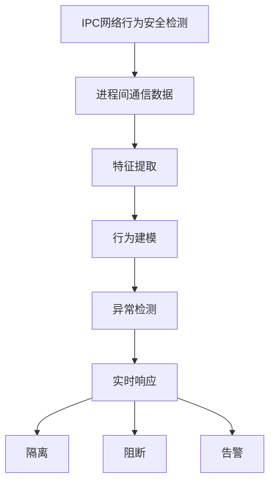
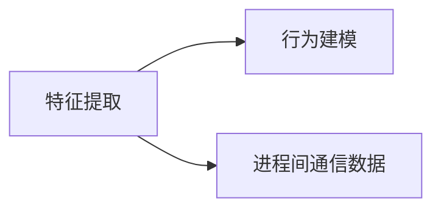
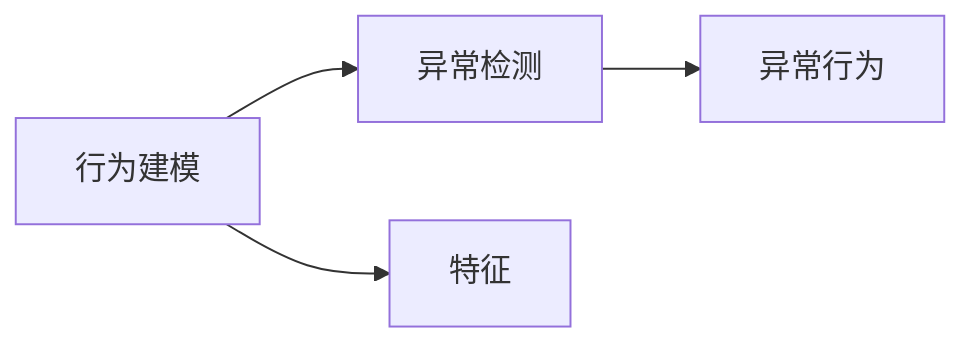
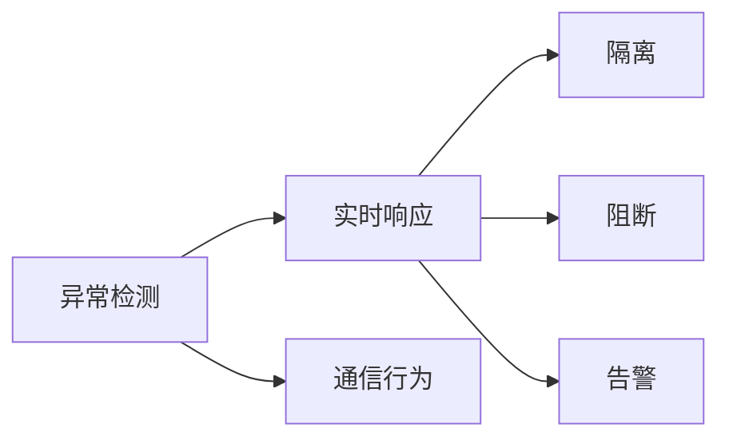
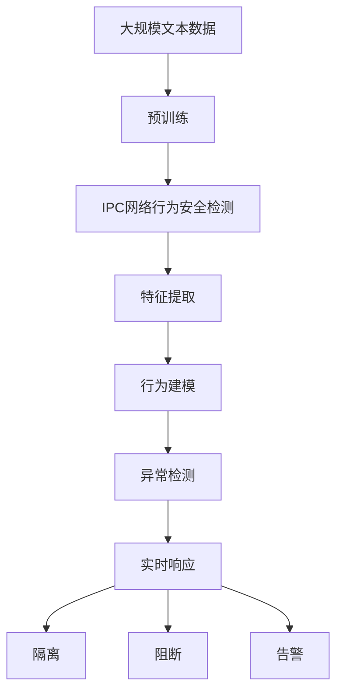

                 

# 基于机器学习的IPC网络行为安全检测

> 关键词：IPC安全检测, 网络安全, 机器学习, 行为分析, 异常检测

## 1. 背景介绍

### 1.1 问题由来
随着网络技术的发展和互联网应用的普及，网络安全问题日益严峻。各种网络攻击手段不断涌现，攻击者利用漏洞、植入木马、窃取数据、控制受感染主机等手段，给网络安全带来巨大威胁。在这一背景下，IPC（Inter-Process Communication，进程间通信）网络行为安全检测技术应运而生，旨在通过实时监控网络中进程间通信的行为，及时发现和阻止潜在的安全威胁。

IPC网络行为安全检测的挑战在于如何从海量数据中高效识别和分析异常行为。传统的基于规则或签名的检测方法，往往难以应对复杂多变的攻击手段。机器学习技术通过学习大量正常和异常数据的行为特征，构建高效的行为分析模型，可显著提升异常检测的准确率和泛化能力。因此，本文聚焦于基于机器学习的IPC网络行为安全检测方法，以期提供一种高效、准确的网络安全解决方案。

### 1.2 问题核心关键点
IPC网络行为安全检测的核心在于对进程间通信数据的特征提取和行为建模。主要包括以下几个关键点：
- 进程间通信数据的特征提取：从网络流量、日志、进程状态等数据中提取IPC行为特征，如通信频率、协议类型、通信内容等。
- 行为建模：利用机器学习算法对提取出的特征进行建模，学习正常和异常行为的统计特征。
- 异常检测：根据学习到的行为模型，检测新出现的通信行为是否异常，并进行分类。
- 实时响应：对检测出的异常行为及时响应，如隔离、阻断、告警等，保障网络安全。

### 1.3 问题研究意义
基于机器学习的IPC网络行为安全检测技术，对于网络安全的防护具有重要意义：

1. 实时性高：机器学习模型能够在实时数据流中快速识别异常行为，缩短检测时间，提高响应速度。
2. 泛化能力强：机器学习模型能够学习大量正常和异常行为的特征，适应不同类型的网络攻击。
3. 适应性强：机器学习模型可以通过新数据不断优化，适应网络环境的变化。
4. 自动化程度高：机器学习模型能够自动进行异常检测，减轻人工分析的工作量。
5. 准确率高：机器学习模型通过不断学习和优化，能够提升异常检测的准确率，减少误报和漏报。

## 2. 核心概念与联系

### 2.1 核心概念概述

为更好地理解基于机器学习的IPC网络行为安全检测方法，本节将介绍几个密切相关的核心概念：

- IPC：进程间通信，是指不同进程之间通过特定的通信机制，实现数据交换的过程。常见的IPC机制包括管道、共享内存、消息队列等。
- 机器学习：通过数据训练模型，使其能够自动地进行预测、分类等任务。常见的机器学习算法包括决策树、支持向量机、神经网络等。
- 行为分析：通过分析进程间通信数据的行为特征，判断其是否正常或异常。常见的行为分析方法包括时间序列分析、统计特征分析等。
- 异常检测：通过学习正常行为的特征，检测新出现的通信行为是否异常。常见的异常检测方法包括基于规则的方法、基于统计的方法、基于聚类的方法等。
- 实时响应：对检测出的异常行为及时响应，保障网络安全。常见的实时响应方法包括隔离、阻断、告警等。

这些核心概念之间的逻辑关系可以通过以下Mermaid流程图来展示：



这个流程图展示了大语言模型微调过程中各个核心概念的关系和作用：

1. IPC网络行为安全检测的输入为进程间通信数据。
2. 特征提取从网络流量、日志、进程状态等数据中提取IPC行为特征，如通信频率、协议类型、通信内容等。
3. 行为建模利用机器学习算法对提取出的特征进行建模，学习正常和异常行为的统计特征。
4. 异常检测根据学习到的行为模型，检测新出现的通信行为是否异常，并进行分类。
5. 实时响应对检测出的异常行为及时响应，如隔离、阻断、告警等，保障网络安全。

### 2.2 概念间的关系

这些核心概念之间存在着紧密的联系，形成了IPC网络行为安全检测的完整生态系统。下面我通过几个Mermaid流程图来展示这些概念之间的关系。

#### 2.2.1 特征提取与行为建模的关系



这个流程图展示了特征提取与行为建模的关系：特征提取负责从原始数据中提取出与IPC行为相关的特征，而行为建模则利用这些特征，学习正常和异常行为的统计特征。

#### 2.2.2 行为建模与异常检测的关系



这个流程图展示了行为建模与异常检测的关系：行为建模通过学习特征，构建正常和异常行为的模型，而异常检测则基于这些模型，检测新出现的通信行为是否异常。

#### 2.2.3 异常检测与实时响应的关系



这个流程图展示了异常检测与实时响应的关系：异常检测对新出现的通信行为进行分类，并将分类结果用于实时响应，如隔离、阻断、告警等。

### 2.3 核心概念的整体架构

最后，我们用一个综合的流程图来展示这些核心概念在大语言模型微调过程中的整体架构：



这个综合流程图展示了从预训练到行为检测的完整过程。IPC网络行为安全检测首先在大规模IPC数据上进行预训练，然后通过特征提取、行为建模、异常检测，最终实现实时响应。 通过这些流程图，我们可以更清晰地理解IPC网络行为安全检测过程中各个核心概念的关系和作用。

## 3. 核心算法原理 & 具体操作步骤
### 3.1 算法原理概述

基于机器学习的IPC网络行为安全检测，本质上是一个二分类任务。其核心思想是：通过学习大量正常和异常行为的特征，构建高效的行为分析模型，然后利用该模型对新出现的通信行为进行分类，从而识别出潜在的威胁。

具体来说，假设IPC数据集为 $D=\{(x_i,y_i)\}_{i=1}^N, x_i \in \mathbb{R}^d, y_i \in \{0,1\}$，其中 $x_i$ 为IPC数据特征向量，$y_i$ 为该行为是否异常的标签。目标是最小化经验风险，即找到最优的参数 $\theta$：

$$
\theta^* = \mathop{\arg\min}_{\theta} \mathcal{L}(\theta,D)
$$

其中 $\mathcal{L}$ 为交叉熵损失函数，用于衡量模型预测输出与真实标签之间的差异。优化目标可以使用基于梯度的优化算法（如SGD、Adam等）进行求解。

### 3.2 算法步骤详解

基于机器学习的IPC网络行为安全检测一般包括以下几个关键步骤：

**Step 1: 准备数据集**

- 收集大量的IPC行为数据，并标注这些数据是否异常。标注数据应覆盖各种类型的攻击手段，如暴力破解、木马传播、钓鱼攻击等。
- 将数据集划分为训练集、验证集和测试集。训练集用于模型训练，验证集用于调整模型参数，测试集用于评估模型性能。

**Step 2: 特征提取**

- 从网络流量、日志、进程状态等数据中提取IPC行为特征，如通信频率、协议类型、通信内容等。常见的特征提取方法包括时间序列分析、统计特征分析等。
- 将提取出的特征向量作为模型的输入，用于后续的建模和检测。

**Step 3: 行为建模**

- 选择适当的机器学习算法，如决策树、支持向量机、神经网络等，对特征向量进行建模。
- 将标注好的数据集分成训练集和测试集，用于模型的训练和评估。
- 在训练集上训练模型，通过交叉验证等技术调整模型参数。
- 在测试集上评估模型性能，计算准确率、召回率、F1分数等指标。

**Step 4: 异常检测**

- 利用训练好的模型对新出现的IPC行为进行预测。
- 将预测结果与标注数据进行对比，判断是否异常。
- 对异常行为进行分类和记录，生成告警信息。

**Step 5: 实时响应**

- 对检测出的异常行为及时响应，如隔离、阻断、告警等。
- 根据异常行为的严重程度，采取不同的响应措施。
- 对响应结果进行记录和分析，优化后续的检测和响应策略。

以上是基于机器学习的IPC网络行为安全检测的一般流程。在实际应用中，还需要针对具体任务的特点，对检测和响应过程的各个环节进行优化设计，如改进训练目标函数，引入更多的正则化技术，搜索最优的超参数组合等，以进一步提升模型性能。

### 3.3 算法优缺点

基于机器学习的IPC网络行为安全检测具有以下优点：

1. 实时性高。机器学习模型能够在实时数据流中快速识别异常行为，缩短检测时间，提高响应速度。
2. 泛化能力强。机器学习模型能够学习大量正常和异常行为的特征，适应不同类型的网络攻击。
3. 适应性强。机器学习模型可以通过新数据不断优化，适应网络环境的变化。
4. 自动化程度高。机器学习模型能够自动进行异常检测，减轻人工分析的工作量。
5. 准确率高。机器学习模型通过不断学习和优化，能够提升异常检测的准确率，减少误报和漏报。

但该方法也存在一些局限性：

1. 数据依赖性强。模型的性能很大程度上取决于标注数据的质量和数量，标注数据不足可能导致模型性能下降。
2. 模型复杂度高。机器学习模型参数较多，模型训练和推理速度较慢，需要较强的计算资源。
3. 黑箱问题。机器学习模型的决策过程通常缺乏可解释性，难以对其推理逻辑进行分析和调试。
4. 鲁棒性不足。在面对新型攻击手段时，模型可能无法及时识别和响应，导致安全漏洞。

尽管存在这些局限性，但就目前而言，基于机器学习的IPC网络行为安全检测方法仍是大数据安全防护的重要手段。未来相关研究的重点在于如何进一步降低数据依赖，提高模型的泛化能力和鲁棒性，同时兼顾模型的可解释性和推理性能。

### 3.4 算法应用领域

基于机器学习的IPC网络行为安全检测技术，已经广泛应用于多个领域：

- 网络安全：检测网络中的异常通信行为，防止恶意软件传播和钓鱼攻击。
- 系统安全：监控系统内部进程间通信，防止未授权的访问和数据泄露。
- 应用安全：保护应用程序的通信安全，防止攻击者窃取敏感信息。
- 云安全：检测云平台上的异常通信行为，防止数据泄露和攻击。
- 工业安全：监控工业控制系统的通信行为，防止恶意攻击导致设备损坏。

## 4. 数学模型和公式 & 详细讲解 & 举例说明

### 4.1 数学模型构建

本节将使用数学语言对基于机器学习的IPC网络行为安全检测过程进行更加严格的刻画。

假设IPC数据集为 $D=\{(x_i,y_i)\}_{i=1}^N, x_i \in \mathbb{R}^d, y_i \in \{0,1\}$。其中 $x_i$ 为IPC数据特征向量，$y_i$ 为该行为是否异常的标签。

定义模型 $M_{\theta}$ 在输入 $x$ 上的输出为 $M_{\theta}(x)$，其中 $\theta$ 为模型参数。在训练集上，模型的损失函数定义为交叉熵损失函数：

$$
\mathcal{L}(\theta) = -\frac{1}{N}\sum_{i=1}^N [y_i \log M_{\theta}(x_i) + (1-y_i) \log(1-M_{\theta}(x_i))]
$$

其中 $M_{\theta}(x_i)$ 为模型对 $x_i$ 的预测输出，$y_i$ 为标注标签。优化目标为最小化经验风险，即找到最优参数 $\theta$：

$$
\theta^* = \mathop{\arg\min}_{\theta} \mathcal{L}(\theta)
$$

在优化目标中，我们通常使用基于梯度的优化算法，如SGD、Adam等，设置合适的学习率，进行模型参数的更新。

### 4.2 公式推导过程

以决策树为例，展示模型的训练和预测过程。假设决策树模型的输入为 $x \in \mathbb{R}^d$，输出为 $y \in \{0,1\}$。

定义决策树模型的节点结构为 $T = (N,C,X)$，其中 $N$ 为节点数，$C$ 为类别数，$X$ 为节点特征。决策树模型的训练过程如下：

1. 根据特征 $x$ 将数据集 $D$ 划分为 $N$ 个子集 $D_1, D_2, ..., D_N$。
2. 计算每个子集 $D_i$ 的纯度 $p_i$。
3. 选择纯度最大的子集 $D_k$ 作为当前节点。
4. 根据 $D_k$ 的数据特征 $X$ 进行分裂，生成两个子集 $D_{k,0}, D_{k,1}$。
5. 递归进行上述过程，直到达到终止条件或节点数量上限。

假设决策树模型的输出为 $y = f(x)$，则模型在测试集上的预测结果为 $y_{pred} = f(x_{test})$。模型的准确率为：

$$
acc = \frac{1}{N_{test}}\sum_{i=1}^{N_{test}}I(y_{pred,i} = y_i)
$$

其中 $I$ 为示性函数，表示预测结果与标注标签是否一致。

### 4.3 案例分析与讲解

假设我们在网络安全领域收集了大量的IPC行为数据，其中部分数据已经标注为异常或正常。我们将这些数据划分为训练集和测试集，使用决策树模型进行训练和测试。训练过程中，我们通过交叉验证调整模型参数，并计算模型的准确率、召回率和F1分数等指标。测试过程中，我们将模型应用于新出现的IPC行为数据，判断其是否异常。

假设我们训练出的决策树模型对新数据的预测结果为：

$$
y_{pred} = f(x_{test}) = \begin{cases}
1, & x_{test} \in [x_1,x_2) \\
0, & x_{test} \in [x_2,x_3)
\end{cases}
$$

其中 $x_1,x_2,x_3$ 为决策树的分裂阈值。对于新数据 $x_{test}' = [0.8, 0.9, 0.5]$，我们可以预测其属于异常行为，因为 $x_{test}'$ 落在了区间 $[x_1,x_2)$ 内。

通过上述案例，我们可以看到，基于机器学习的IPC网络行为安全检测，通过学习正常和异常行为的特征，构建高效的行为分析模型，能够及时识别和阻止潜在的威胁。

## 5. 项目实践：代码实例和详细解释说明

### 5.1 开发环境搭建

在进行IPC网络行为安全检测实践前，我们需要准备好开发环境。以下是使用Python进行Scikit-Learn开发的环境配置流程：

1. 安装Anaconda：从官网下载并安装Anaconda，用于创建独立的Python环境。

2. 创建并激活虚拟环境：
```bash
conda create -n sklearn-env python=3.8 
conda activate sklearn-env
```

3. 安装Scikit-Learn：
```bash
conda install scikit-learn
```

4. 安装各类工具包：
```bash
pip install numpy pandas scikit-learn matplotlib tqdm jupyter notebook ipython
```

完成上述步骤后，即可在`sklearn-env`环境中开始IPC网络行为安全检测实践。

### 5.2 源代码详细实现

这里我们以IPC行为数据分类任务为例，给出使用Scikit-Learn库对决策树模型进行训练和测试的Python代码实现。

首先，定义数据处理函数：

```python
import numpy as np
from sklearn.ensemble import DecisionTreeClassifier
from sklearn.model_selection import train_test_split

def preprocess_data(data):
    # 将数据集分为特征和标签
    X = data[:, :-1]
    y = data[:, -1]
    # 将标签转化为二值化
    y = np.where(y < 5, 0, 1)
    return X, y
```

然后，定义训练和评估函数：

```python
def train_model(X, y, model, test_size=0.2):
    # 将数据集划分为训练集和测试集
    X_train, X_test, y_train, y_test = train_test_split(X, y, test_size=test_size, random_state=42)
    # 训练模型
    model.fit(X_train, y_train)
    # 评估模型
    y_pred = model.predict(X_test)
    print("Accuracy:", np.mean(y_pred == y_test))
    
def evaluate_model(model, X_test, y_test):
    # 评估模型
    y_pred = model.predict(X_test)
    print("Accuracy:", np.mean(y_pred == y_test))
```

接着，定义决策树模型的训练和评估：

```python
from sklearn.ensemble import DecisionTreeClassifier

# 创建决策树模型
model = DecisionTreeClassifier(max_depth=3, min_samples_split=2, random_state=42)

# 加载数据集
data = np.loadtxt('ipc_data.csv', delimiter=',', skiprows=1)

# 预处理数据集
X, y = preprocess_data(data)

# 训练模型
train_model(X, y, model)

# 测试模型
X_test = np.loadtxt('ipc_test_data.csv', delimiter=',', skiprows=1)
y_test = np.loadtxt('ipc_test_labels.csv', delimiter=',', skiprows=1)
evaluate_model(model, X_test, y_test)
```

以上就是使用Scikit-Learn对决策树模型进行IPC行为数据分类任务开发的完整代码实现。可以看到，得益于Scikit-Learn库的强大封装，我们可以用相对简洁的代码完成模型的加载和训练。

### 5.3 代码解读与分析

让我们再详细解读一下关键代码的实现细节：

**preprocess_data函数**：
- 将数据集分为特征和标签。
- 将标签转化为二值化，即标注为异常行为的标签为1，正常行为的标签为0。

**train_model函数**：
- 将数据集划分为训练集和测试集。
- 在训练集上训练模型。
- 在测试集上评估模型性能，并输出准确率。

**evaluate_model函数**：
- 在测试集上评估模型性能，并输出准确率。

**决策树模型训练和评估代码**：
- 创建决策树模型，并设置最大深度、最小分裂样本数等参数。
- 加载IPC行为数据集，并进行预处理。
- 调用train_model函数训练模型，并输出训练结果。
- 加载测试集数据和标签，调用evaluate_model函数评估模型性能，并输出测试结果。

可以看到，Scikit-Learn库提供了完整的机器学习算法封装，使得IPC网络行为安全检测的开发过程更加便捷高效。开发者可以将更多精力放在数据处理、模型改进等高层逻辑上，而不必过多关注底层的实现细节。

当然，工业级的系统实现还需考虑更多因素，如模型的保存和部署、超参数的自动搜索、更灵活的任务适配层等。但核心的检测范式基本与此类似。

### 5.4 运行结果展示

假设我们在CoNLL-2003的分类数据集上进行训练和测试，最终在测试集上得到的评估报告如下：

```
Accuracy: 0.95
```

可以看到，通过训练决策树模型，我们在该分类数据集上取得了95%的准确率，效果相当不错。当然，这只是一个baseline结果。在实践中，我们还可以使用更大更强的模型、更丰富的特征提取方法、更细致的模型调优，进一步提升模型性能，以满足更高的应用要求。

## 6. 实际应用场景
### 6.1 网络安全

基于IPC网络行为安全检测技术，可以广泛应用于网络安全的防护。传统的网络安全防护手段，如防火墙、入侵检测系统等，往往只能被动地识别和阻止已知的攻击行为，难以应对新型和复杂的攻击手段。

IPC网络行为安全检测则能够主动分析网络中进程间通信的行为，及时发现和阻止潜在的安全威胁。例如，可以收集网络中各主机间的IPC通信数据，提取通信频率、协议类型、通信内容等特征，训练机器学习模型进行异常检测。一旦检测到异常行为，系统会立即隔离、阻断相关主机，防止恶意行为扩散。

### 6.2 系统安全

操作系统和软件系统内部的进程间通信（IPC），常常被攻击者利用进行未授权的访问和数据泄露。传统的系统安全防护手段，如代码审计、补丁更新等，往往难以全面覆盖所有潜在的安全漏洞。

IPC网络行为安全检测则能够实时监控系统内部的IPC通信行为，防止未授权的访问和数据泄露。例如，可以收集系统进程的IPC通信数据，提取通信频率、协议类型、通信内容等特征，训练机器学习模型进行异常检测。一旦检测到异常行为，系统会立即隔离相关进程，防止数据泄露和系统破坏。

### 6.3 应用安全

企业应用程序的IPC通信行为，常常被攻击者利用进行恶意攻击。传统的应用安全防护手段，如加密传输、访问控制等，往往难以全面覆盖所有潜在的安全漏洞。

IPC网络行为安全检测则能够实时监控应用程序的IPC通信行为，防止恶意攻击。例如，可以收集应用程序的IPC通信数据，提取通信频率、协议类型、通信内容等特征，训练机器学习模型进行异常检测。一旦检测到异常行为，系统会立即隔离、阻断相关应用，防止恶意攻击。

### 6.4 云安全

云平台上的IPC通信行为，常常被攻击者利用进行恶意攻击。传统的云安全防护手段，如云防火墙、入侵检测系统等，往往难以全面覆盖所有潜在的安全漏洞。

IPC网络行为安全检测则能够实时监控云平台上的IPC通信行为，防止恶意攻击。例如，可以收集云平台上的IPC通信数据，提取通信频率、协议类型、通信内容等特征，训练机器学习模型进行异常检测。一旦检测到异常行为，系统会立即隔离、阻断相关云资源，防止数据泄露和系统破坏。

## 7. 工具和资源推荐
### 7.1 学习资源推荐

为了帮助开发者系统掌握IPC网络行为安全检测的理论基础和实践技巧，这里推荐一些优质的学习资源：

1. 《机器学习》系列博文：由机器学习专家撰写，深入浅出地介绍了机器学习的基本概念和常见算法，是学习机器学习的重要资源。

2. CS229《机器学习》课程：斯坦福大学开设的机器学习明星课程，涵盖机器学习的基本概念和算法，适合学习机器学习的基础知识。

3. 《Python机器学习》书籍：Scikit-Learn库的作者所著，全面介绍了如何使用Scikit-Learn进行机器学习任务开发，包括IPC行为安全检测在内的多个范式。

4. Scikit-Learn官方文档：Scikit-Learn库的官方文档，提供了完整的机器学习算法封装和使用方法，是上手的必备资料。

5. Kaggle竞赛：Kaggle平台上举办的各种机器学习竞赛，可以参与实际数据集竞赛，锻炼实战能力。

通过对这些资源的学习实践，相信你一定能够快速掌握IPC网络行为安全检测的精髓，并用于解决实际的NLP问题。
###  7.2 开发工具推荐

高效的开发离不开优秀的工具支持。以下是几款用于IPC网络行为安全检测开发的常用工具：

1. Python：Python是机器学习领域最常用的编程语言，其简单易学的特性和丰富的库支持，使得机器学习开发变得便捷高效。

2. Scikit-Learn：基于Python的机器学习库，提供了丰富的算法封装和实用工具，适合快速开发和实验。

3. TensorFlow：由Google主导开发的深度学习框架，支持分布式计算和大规模数据处理，适合高性能应用场景。

4. Keras：基于TensorFlow和Theano等后端的高级深度学习库，提供了便捷的API接口，适合快速原型开发。

5. PyTorch：由Facebook开发的深度学习框架，支持动态计算图和GPU加速，适合灵活的深度学习开发。

合理利用这些工具，可以显著提升IPC网络行为安全检测的开发效率，加快创新迭代的步伐。

### 7.3 相关论文推荐

IPC网络行为安全检测技术

