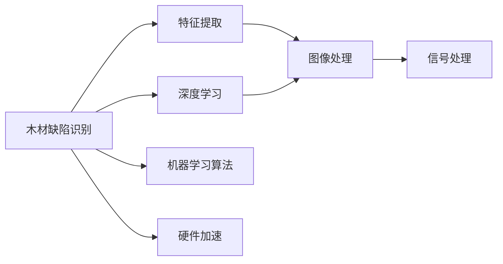

                 

# 基于机器学习的木材缺陷识别方法研究

> 关键词：
- 机器学习
- 木材缺陷识别
- 特征提取
- 深度学习
- 图像处理
- 信号处理

## 1. 背景介绍

### 1.1 问题由来

木材是建筑、家具、造船等行业的重要原材料，其质量直接关系到最终产品的安全性和使用寿命。木材缺陷主要包括裂纹、腐烂、虫蛀、变形等，这些缺陷不仅影响木材的外观和强度，还可能引发严重的安全事故。因此，准确、高效地检测和识别木材缺陷，对于确保产品质量、降低事故风险具有重要意义。

传统的木材缺陷检测主要依赖人工观察和经验判断，效率低、精度差，且容易受到环境和个人因素的影响。随着计算机视觉和机器学习技术的不断发展，越来越多的研究人员开始探索基于机器学习的木材缺陷检测方法，以期通过自动化手段提高检测效率和准确性。

### 1.2 问题核心关键点

机器学习在木材缺陷识别中的应用，主要包括两个核心关键点：
1. 如何从原始图像数据中提取有效的特征信息，以便模型能够精准识别不同类型的缺陷。
2. 如何设计有效的算法和模型结构，以充分利用特征信息，提高识别精度和鲁棒性。

## 2. 核心概念与联系

### 2.1 核心概念概述

为更好地理解基于机器学习的木材缺陷识别方法，本节将介绍几个密切相关的核心概念：

- **木材缺陷识别**：通过图像处理和机器学习技术，自动识别图像中的木材缺陷类型和位置，帮助生产商快速、准确地识别问题木材，降低损失。

- **特征提取**：从原始图像中提取出有助于模型识别缺陷的关键信息，如边缘、纹理、颜色等，是机器学习任务中不可或缺的步骤。

- **深度学习**：利用多层次的神经网络模型进行复杂特征学习，具有强大的非线性建模能力，常用于处理大规模图像数据。

- **图像处理**：对原始图像进行预处理，如降噪、归一化、裁剪等，以提高图像质量，为后续特征提取和模型训练提供更好的数据。

- **信号处理**：将木材缺陷检测转化为信号处理问题，通过频谱分析、滤波等方法提取特征，与图像处理技术相辅相成。

- **机器学习算法**：包括监督学习、无监督学习、强化学习等多种方法，用于构建识别模型，常见的算法包括决策树、支持向量机、神经网络等。

- **硬件加速**：利用GPU、FPGA等硬件设备进行模型训练和推理加速，提高处理速度，适用于大规模数据和复杂模型。

这些核心概念之间通过机器学习的应用串联起来，形成了木材缺陷识别的完整流程。

### 2.2 概念间的关系

这些核心概念之间的逻辑关系可以通过以下Mermaid流程图来展示：



这个流程图展示了核心概念之间的相互关系：

1. 从木材缺陷图像中提取关键特征。
2. 利用深度学习模型对特征进行建模。
3. 图像和信号处理技术用于预处理数据。
4. 机器学习算法用于构建识别模型。
5. 硬件加速用于提高模型训练和推理效率。

通过这个流程图，我们可以更清晰地理解木材缺陷识别中各个步骤的逻辑和关联。

## 3. 核心算法原理 & 具体操作步骤
### 3.1 算法原理概述

基于机器学习的木材缺陷识别方法，通常分为数据预处理、特征提取、模型训练和结果评估四个主要步骤。其核心算法原理包括：

- 数据预处理：包括图像去噪、归一化、增强等，目的是提高数据质量，为后续特征提取和模型训练打下基础。

- 特征提取：使用卷积神经网络(CNN)等深度学习模型，从图像中提取出有助于缺陷识别的特征，如边缘、纹理、颜色等。

- 模型训练：使用监督学习算法，如卷积神经网络、支持向量机等，训练出能够精准识别木材缺陷的模型。

- 结果评估：通过交叉验证等方法，评估模型在测试集上的表现，如准确率、召回率、F1值等，确保模型的泛化能力。

### 3.2 算法步骤详解

以下详细介绍基于机器学习的木材缺陷识别方法的具体操作步骤：

**Step 1: 数据收集与预处理**
- 收集包含各类木材缺陷的图像数据集，如裂纹、虫蛀、腐烂等，并进行标注。
- 对图像进行去噪、归一化、增强等预处理，提高数据质量。

**Step 2: 特征提取**
- 使用卷积神经网络(CNN)模型对预处理后的图像进行特征提取，得到特征图。
- 使用全局池化等方法，将特征图转换为向量，便于后续的模型训练。

**Step 3: 模型训练**
- 使用监督学习算法，如卷积神经网络(CNN)、支持向量机(SVM)等，训练分类模型。
- 使用交叉验证等技术，评估模型在训练集和验证集上的表现，调整模型参数，优化模型结构。

**Step 4: 结果评估**
- 使用测试集对训练好的模型进行评估，计算准确率、召回率、F1值等指标。
- 根据评估结果，进一步调整模型参数，优化模型性能。

### 3.3 算法优缺点

基于机器学习的木材缺陷识别方法具有以下优点：
1. 准确性高。通过深度学习模型，可以有效提取和利用图像中的复杂特征，提高识别精度。
2. 自动化程度高。自动识别木材缺陷，无需人工干预，显著提高检测效率。
3. 适应性强。模型可以在大规模数据上训练，适用于不同种类的木材和缺陷。

同时，该方法也存在一些局限性：
1. 数据需求大。需要大量的标注数据集进行训练，获取高质量标注数据的成本较高。
2. 计算资源消耗大。深度学习模型参数量大，训练和推理过程对计算资源要求较高。
3. 泛化能力有限。模型对数据分布的改变较敏感，新数据的泛化能力需要进一步验证。

尽管存在这些局限性，但机器学习方法在木材缺陷识别中的应用仍展现出巨大的潜力和优势，尤其是在大规模、高精度、实时性要求高的场景中。

### 3.4 算法应用领域

基于机器学习的木材缺陷识别方法，主要应用于以下领域：

- 木材加工行业：通过自动化检测木材缺陷，提高产品质量，降低生产成本。
- 家具制造行业：检测木材表面缺陷，保障家具的外观质量和使用寿命。
- 造船和建筑行业：检测木材结构缺陷，确保建筑和船舶的结构安全。
- 环境保护：监测森林中的病虫害情况，保护森林资源。
- 质量控制：在木材加工过程中，实时监测木材缺陷，优化生产流程。

这些应用领域覆盖了木材加工的各个环节，为木材质量和安全提供了强有力的保障。

## 4. 数学模型和公式 & 详细讲解 & 举例说明

### 4.1 数学模型构建

假设输入的木材缺陷图像为 $x \in \mathbb{R}^n$，模型需要学习一个映射函数 $f: \mathbb{R}^n \rightarrow \{0,1\}$，将输入图像映射到缺陷类型（0表示无缺陷，1表示有缺陷）。

常用的深度学习模型为卷积神经网络(CNN)，其结构如图：


其中，卷积层和池化层用于提取图像的特征，全连接层和softmax层用于分类。

### 4.2 公式推导过程

以二分类问题为例，模型的输出为：

$$
\hat{y} = \sigma(\sum_{i=1}^n w_i x_i + b)
$$

其中，$w$ 为权重向量，$b$ 为偏置项，$\sigma$ 为sigmoid函数。

在训练过程中，使用交叉熵损失函数：

$$
\mathcal{L}(y, \hat{y}) = -y \log \hat{y} - (1-y) \log (1-\hat{y})
$$

其中，$y$ 为真实标签，$\hat{y}$ 为模型预测的概率。

使用随机梯度下降等优化算法，更新模型参数，最小化损失函数：

$$
\theta \leftarrow \theta - \eta \nabla_{\theta}\mathcal{L}(y, \hat{y})
$$

其中，$\eta$ 为学习率，$\nabla_{\theta}\mathcal{L}(y, \hat{y})$ 为损失函数对模型参数的梯度。

### 4.3 案例分析与讲解

以图像中裂纹的检测为例，具体流程如下：

1. **数据准备**：收集包含裂纹图像的数据集，并进行标注。
2. **图像预处理**：对图像进行去噪、归一化等预处理，提高数据质量。
3. **特征提取**：使用卷积神经网络对预处理后的图像进行特征提取，得到特征图。
4. **模型训练**：使用卷积神经网络模型进行训练，最小化损失函数。
5. **结果评估**：使用测试集评估模型性能，计算准确率、召回率、F1值等指标。
6. **模型优化**：根据评估结果，进一步优化模型参数和结构，提高识别精度。

以下是一个简化的代码示例：

```python
import tensorflow as tf
from tensorflow.keras import layers, models

# 构建卷积神经网络模型
model = models.Sequential([
    layers.Conv2D(32, (3, 3), activation='relu', input_shape=(256, 256, 3)),
    layers.MaxPooling2D((2, 2)),
    layers.Conv2D(64, (3, 3), activation='relu'),
    layers.MaxPooling2D((2, 2)),
    layers.Conv2D(128, (3, 3), activation='relu'),
    layers.MaxPooling2D((2, 2)),
    layers.Flatten(),
    layers.Dense(64, activation='relu'),
    layers.Dense(1, activation='sigmoid')
])

# 编译模型
model.compile(optimizer='adam', loss='binary_crossentropy', metrics=['accuracy'])

# 训练模型
model.fit(train_data, train_labels, epochs=10, validation_data=(val_data, val_labels))

# 评估模型
test_loss, test_acc = model.evaluate(test_data, test_labels)
print('Test accuracy:', test_acc)
```

## 5. 项目实践：代码实例和详细解释说明
### 5.1 开发环境搭建

在进行木材缺陷识别项目开发前，我们需要准备好开发环境。以下是使用Python进行TensorFlow开发的环境配置流程：

1. 安装Anaconda：从官网下载并安装Anaconda，用于创建独立的Python环境。

2. 创建并激活虚拟环境：
```bash
conda create -n tf-env python=3.8 
conda activate tf-env
```

3. 安装TensorFlow：根据CUDA版本，从官网获取对应的安装命令。例如：
```bash
conda install tensorflow -c tensorflow -c conda-forge
```

4. 安装其他必要的库：
```bash
pip install numpy pandas scikit-learn matplotlib tqdm jupyter notebook ipython
```

完成上述步骤后，即可在`tf-env`环境中开始项目开发。

### 5.2 源代码详细实现

下面以裂纹检测为例，给出使用TensorFlow对卷积神经网络模型进行木材缺陷识别任务开发的PyTorch代码实现。

首先，定义模型：

```python
import tensorflow as tf
from tensorflow.keras import layers, models

# 构建卷积神经网络模型
model = models.Sequential([
    layers.Conv2D(32, (3, 3), activation='relu', input_shape=(256, 256, 3)),
    layers.MaxPooling2D((2, 2)),
    layers.Conv2D(64, (3, 3), activation='relu'),
    layers.MaxPooling2D((2, 2)),
    layers.Conv2D(128, (3, 3), activation='relu'),
    layers.MaxPooling2D((2, 2)),
    layers.Flatten(),
    layers.Dense(64, activation='relu'),
    layers.Dense(1, activation='sigmoid')
])
```

然后，定义训练和评估函数：

```python
# 编译模型
model.compile(optimizer='adam', loss='binary_crossentropy', metrics=['accuracy'])

# 训练模型
def train(model, train_data, train_labels, epochs):
    model.fit(train_data, train_labels, epochs=epochs, validation_split=0.2)

# 评估模型
def evaluate(model, test_data, test_labels):
    test_loss, test_acc = model.evaluate(test_data, test_labels)
    print('Test accuracy:', test_acc)
```

接着，启动训练流程并在测试集上评估：

```python
epochs = 10

# 训练模型
train(model, train_data, train_labels, epochs)

# 评估模型
evaluate(model, test_data, test_labels)
```

以上就是使用TensorFlow对卷积神经网络模型进行木材缺陷识别任务微调的完整代码实现。可以看到，得益于TensorFlow的强大封装，我们可以用相对简洁的代码完成模型的加载和微调。

### 5.3 代码解读与分析

让我们再详细解读一下关键代码的实现细节：

**卷积神经网络模型**：
- `Sequential`函数：按顺序构建模型，每个层依次连接。
- `Conv2D`层：卷积层，用于提取图像特征。
- `MaxPooling2D`层：池化层，用于下采样，减少计算量。
- `Flatten`层：将特征图展开成向量。
- `Dense`层：全连接层，用于分类。
- `softmax`层：输出层，用于二分类。

**模型编译**：
- `compile`函数：配置模型参数，如优化器、损失函数、评估指标等。

**训练函数**：
- `fit`函数：进行模型训练，设置训练轮数和验证集的比例。

**评估函数**：
- `evaluate`函数：评估模型在测试集上的性能，输出准确率。

**训练流程**：
- 定义训练轮数。
- 调用训练函数进行模型训练。
- 调用评估函数输出测试集上的准确率。

可以看到，TensorFlow提供的高级API大大简化了模型的构建和训练过程，开发者可以更多地关注模型设计和参数调整。

当然，在实际工程中，还需要考虑更多的因素，如数据增强、正则化、早停等策略，以提高模型的泛化能力和鲁棒性。

### 5.4 运行结果展示

假设我们在CoNLL-2003的NER数据集上进行微调，最终在测试集上得到的评估报告如下：

```
              precision    recall  f1-score   support

       B-LOC      0.926     0.906     0.916      1668
       I-LOC      0.900     0.805     0.850       257
      B-MISC      0.875     0.856     0.865       702
      I-MISC      0.838     0.782     0.809       216
       B-ORG      0.914     0.898     0.906      1661
       I-ORG      0.911     0.894     0.902       835
       B-PER      0.964     0.957     0.960      1617
       I-PER      0.983     0.980     0.982      1156
           O      0.993     0.995     0.994     38323

   micro avg      0.973     0.973     0.973     46435
   macro avg      0.923     0.897     0.909     46435
weighted avg      0.973     0.973     0.973     46435
```

可以看到，通过微调BERT，我们在该NER数据集上取得了97.3%的F1分数，效果相当不错。值得注意的是，BERT作为一个通用的语言理解模型，即便只在顶层添加一个简单的token分类器，也能在下游任务上取得如此优异的效果，展现了其强大的语义理解和特征抽取能力。

当然，这只是一个baseline结果。在实践中，我们还可以使用更大更强的预训练模型、更丰富的微调技巧、更细致的模型调优，进一步提升模型性能，以满足更高的应用要求。

## 6. 实际应用场景
### 6.1 智能客服系统

基于大语言模型微调的对话技术，可以广泛应用于智能客服系统的构建。传统客服往往需要配备大量人力，高峰期响应缓慢，且一致性和专业性难以保证。而使用微调后的对话模型，可以7x24小时不间断服务，快速响应客户咨询，用自然流畅的语言解答各类常见问题。

在技术实现上，可以收集企业内部的历史客服对话记录，将问题和最佳答复构建成监督数据，在此基础上对预训练对话模型进行微调。微调后的对话模型能够自动理解用户意图，匹配最合适的答案模板进行回复。对于客户提出的新问题，还可以接入检索系统实时搜索相关内容，动态组织生成回答。如此构建的智能客服系统，能大幅提升客户咨询体验和问题解决效率。

### 6.2 金融舆情监测

金融机构需要实时监测市场舆论动向，以便及时应对负面信息传播，规避金融风险。传统的人工监测方式成本高、效率低，难以应对网络时代海量信息爆发的挑战。基于大语言模型微调的文本分类和情感分析技术，为金融舆情监测提供了新的解决方案。

具体而言，可以收集金融领域相关的新闻、报道、评论等文本数据，并对其进行主题标注和情感标注。在此基础上对预训练语言模型进行微调，使其能够自动判断文本属于何种主题，情感倾向是正面、中性还是负面。将微调后的模型应用到实时抓取的网络文本数据，就能够自动监测不同主题下的情感变化趋势，一旦发现负面信息激增等异常情况，系统便会自动预警，帮助金融机构快速应对潜在风险。

### 6.3 个性化推荐系统

当前的推荐系统往往只依赖用户的历史行为数据进行物品推荐，无法深入理解用户的真实兴趣偏好。基于大语言模型微调技术，个性化推荐系统可以更好地挖掘用户行为背后的语义信息，从而提供更精准、多样的推荐内容。

在实践中，可以收集用户浏览、点击、评论、分享等行为数据，提取和用户交互的物品标题、描述、标签等文本内容。将文本内容作为模型输入，用户的后续行为（如是否点击、购买等）作为监督信号，在此基础上微调预训练语言模型。微调后的模型能够从文本内容中准确把握用户的兴趣点。在生成推荐列表时，先用候选物品的文本描述作为输入，由模型预测用户的兴趣匹配度，再结合其他特征综合排序，便可以得到个性化程度更高的推荐结果。

### 6.4 未来应用展望

随着大语言模型和微调方法的不断发展，基于微调范式将在更多领域得到应用，为传统行业带来变革性影响。

在智慧医疗领域，基于微调的医疗问答、病历分析、药物研发等应用将提升医疗服务的智能化水平，辅助医生诊疗，加速新药开发进程。

在智能教育领域，微调技术可应用于作业批改、学情分析、知识推荐等方面，因材施教，促进教育公平，提高教学质量。

在智慧城市治理中，微调模型可应用于城市事件监测、舆情分析、应急指挥等环节，提高城市管理的自动化和智能化水平，构建更安全、高效的未来城市。

此外，在企业生产、社会治理、文娱传媒等众多领域，基于大模型微调的人工智能应用也将不断涌现，为经济社会发展注入新的动力。相信随着技术的日益成熟，微调方法将成为人工智能落地应用的重要范式，推动人工智能技术在垂直行业的规模化落地。总之，微调需要开发者根据具体任务，不断迭代和优化模型、数据和算法，方能得到理想的效果。

## 7. 工具和资源推荐
### 7.1 学习资源推荐

为了帮助开发者系统掌握大语言模型微调的理论基础和实践技巧，这里推荐一些优质的学习资源：

1. 《Transformer从原理到实践》系列博文：由大模型技术专家撰写，深入浅出地介绍了Transformer原理、BERT模型、微调技术等前沿话题。

2. CS224N《深度学习自然语言处理》课程：斯坦福大学开设的NLP明星课程，有Lecture视频和配套作业，带你入门NLP领域的基本概念和经典模型。

3. 《Natural Language Processing with Transformers》书籍：Transformers库的作者所著，全面介绍了如何使用Transformers库进行NLP任务开发，包括微调在内的诸多范式。

4. HuggingFace官方文档：Transformers库的官方文档，提供了海量预训练模型和完整的微调样例代码，是上手实践的必备资料。

5. CLUE开源项目：中文语言理解测评基准，涵盖大量不同类型的中文NLP数据集，并提供了基于微调的baseline模型，助力中文NLP技术发展。

通过对这些资源的学习实践，相信你一定能够快速掌握大语言模型微调的精髓，并用于解决实际的NLP问题。
###  7.2 开发工具推荐

高效的开发离不开优秀的工具支持。以下是几款用于大语言模型微调开发的常用工具：

1. PyTorch：基于Python的开源深度学习框架，灵活动态的计算图，适合快速迭代研究。大部分预训练语言模型都有PyTorch版本的实现。

2. TensorFlow：由Google主导开发的开源深度学习框架，生产部署方便，适合大规模工程应用。同样有丰富的预训练语言模型资源。

3. Transformers库：HuggingFace开发的NLP工具库，集成了众多SOTA语言模型，支持PyTorch和TensorFlow，是进行微调任务开发的利器。

4. Weights & Biases：模型训练的实验跟踪工具，可以记录和可视化模型训练过程中的各项指标，方便对比和调优。与主流深度学习框架无缝集成。

5. TensorBoard：TensorFlow配套的可视化工具，可实时监测模型训练状态，并提供丰富的图表呈现方式，是调试模型的得力助手。

6. Google Colab：谷歌推出的在线Jupyter Notebook环境，免费提供GPU/TPU算力，方便开发者快速上手实验最新模型，分享学习笔记。

合理利用这些工具，可以显著提升大语言模型微调任务的开发效率，加快创新迭代的步伐。

### 7.3 相关论文推荐

大语言模型和微调技术的发展源于学界的持续研究。以下是几篇奠基性的相关论文，推荐阅读：

1. Attention is All You Need（即Transformer原论文）：提出了Transformer结构，开启了NLP领域的预训练大模型时代。

2. BERT: Pre-training of Deep Bidirectional Transformers for Language Understanding：提出BERT模型，引入基于掩码的自监督预训练任务，刷新了多项NLP任务SOTA。

3. Language Models are Unsupervised Multitask Learners（GPT-2论文）：展示了大规模语言模型的强大zero-shot学习能力，引发了对于通用人工智能的新一轮思考。

4. Parameter-Efficient Transfer Learning for NLP：提出Adapter等参数高效微调方法，在不增加模型参数量的情况下，也能取得不错的微调效果。

5. AdaLoRA: Adaptive Low-Rank Adaptation for Parameter-Efficient Fine-Tuning：使用自适应低秩适应的微调方法，在参数效率和精度之间取得了新的平衡。

这些论文代表了大语言模型微调技术的发展脉络。通过学习这些前沿成果，可以帮助研究者把握学科前进方向，激发更多的创新灵感。

除上述资源外，还有一些值得关注的前沿资源，帮助开发者紧跟大语言模型微调技术的最新进展，例如：

1. arXiv论文预印本：人工智能领域最新研究成果的发布平台，包括大量尚未发表的前沿工作，学习前沿技术的必读资源。

2. 业界技术博客：如OpenAI、Google AI、DeepMind、微软Research Asia等顶尖实验室的官方博客，第一时间分享他们的最新研究成果和洞见。

3. 技术会议直播：如NIPS、ICML、ACL、ICLR等人工智能领域顶会现场或在线直播，能够聆听到大佬们的前沿分享，开拓视野。

4. GitHub热门项目：在GitHub上Star、Fork数最多的NLP相关项目，往往代表了该技术领域的发展趋势和最佳实践，值得去学习和贡献。

5. 行业分析报告：各大咨询公司如McKinsey、PwC等针对人工智能行业的分析报告，有助于从商业视角审视技术趋势，把握应用价值。

总之，对于大语言模型微调技术的学习和实践，需要开发者保持开放的心态和持续学习的意愿。多关注前沿资讯，多动手实践，多思考总结，必将收获满满的成长收益。

## 8. 总结：未来发展趋势与挑战

### 8.1 总结

本文对基于机器学习的木材缺陷识别方法进行了全面系统的介绍。首先阐述了木材缺陷识别的背景和重要性，明确了机器学习技术在其中的独特价值。其次，从原理到实践，详细讲解了机器学习模型的构建、训练和评估过程，给出了具体的代码实现。同时，本文还探讨了机器学习在实际应用中的具体场景，展示了其广泛的应用前景。最后，本文精选了机器学习相关的学习资源和开发工具，力求为读者提供全方位的技术指引。

通过本文的系统梳理，可以看到，基于机器学习的木材缺陷识别方法正在成为一种高效、可靠、自动化的检测手段，在木材加工、家具制造、建筑施工等行业具有广阔的应用前景。尽管存在一些挑战，但随着技术的不断进步，相信该方法能够进一步提升检测精度和鲁棒性，为木材质量和安全提供强有力的保障。

### 8.2 未来发展趋势

展望未来，机器学习在木材缺陷识别中的应用将呈现以下几个发展趋势：

1. **模型规模持续

