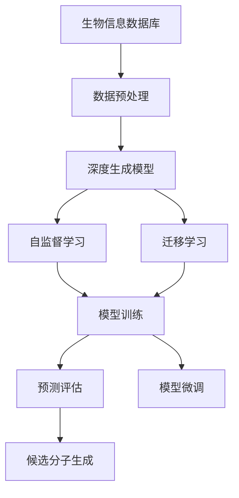

                 

## 1. 背景介绍

药物设计是一个复杂且耗时的过程，通常涉及多层次的分子、蛋白质和生物系统模拟。传统药物设计方法如高通量筛选、晶格筛选等耗费大量时间和资源。因此，近年来，基于深度学习的辅助药物设计方法引起了广泛关注。

### 1.1 问题由来

近年来，随着深度学习技术的发展，深度学习在药物设计领域取得了显著进展。特别是深度生成模型和自监督学习方法，使得利用大规模生物信息数据对药物分子进行预测和设计成为可能。

- 高通量筛选：传统药物筛选方法通常依赖实验测试，成本高、时间长，且效率较低。
- 晶格筛选：通过结构解析与模拟技术进行药物筛选，但该方法昂贵且复杂，难以应用于大规模药物设计。
- 基于深度学习的方法：利用深度生成模型，如变分自编码器(VAE)、生成对抗网络(GAN)等，结合大规模生物信息数据进行药物设计，大大降低了实验成本和时间。

### 1.2 问题核心关键点

基于深度学习的辅助药物设计方法主要包含以下几个关键点：

- **大规模数据：**需要大规模的生物信息数据作为训练材料。
- **深度生成模型：**如VAE、GAN等，用于生成新的药物分子结构。
- **自监督学习：**在无标签数据上训练深度生成模型，学习分子结构和生物系统之间的关系。
- **预测精度：**生成的药物分子需要与真实分子结构高度相似，并具有生理活性。

这些关键点共同构成深度学习辅助药物设计的基本框架。

## 2. 核心概念与联系

### 2.1 核心概念概述

以下是深度学习辅助药物设计涉及的主要核心概念：

- **深度生成模型：**如VAE、GAN等，用于生成新的药物分子结构，预测生物活性等。
- **自监督学习：**在无标签数据上训练生成模型，学习分子结构和生物系统之间的关系。
- **迁移学习：**利用预训练模型，在下游任务上进行微调，提升预测精度。
- **生物信息数据库：**如PDB、ChEMBL等，提供大规模的生物信息数据，用于训练生成模型。
- **药物分子表示：**通过向量化技术将分子结构转换为计算机可处理的数字信号。

### 2.2 概念间的关系

这些核心概念之间存在紧密联系，形成深度学习辅助药物设计的整体架构：

1. **数据准备：**从生物信息数据库收集数据，预处理和标注。
2. **模型训练：**使用深度生成模型进行自监督学习，生成新的药物分子结构。
3. **预测评估：**在验证集上评估模型性能，微调参数。
4. **应用部署：**将微调后的模型应用于新药物设计任务，生成候选分子。

这些步骤构成了一个闭环的深度学习辅助药物设计流程。

### 2.3 核心概念的整体架构

以下是一个综合的流程图，展示深度学习辅助药物设计从数据准备到模型应用的完整过程：



这个流程图展示了大规模生物信息数据如何通过深度生成模型和自监督学习，转化为可用于药物设计的候选分子，并经过验证和微调以提升预测精度。

## 3. 核心算法原理 & 具体操作步骤

### 3.1 算法原理概述

基于深度学习的辅助药物设计方法的核心算法原理主要包括：

- **深度生成模型：**通过生成对抗网络(GAN)、变分自编码器(VAE)等生成模型，将药物分子结构转换为数字信号，并生成新的候选分子。
- **自监督学习：**利用无标签的生物信息数据进行模型训练，学习分子结构和生物系统之间的关系。
- **迁移学习：**在下游任务上微调预训练生成模型，提升预测精度。

### 3.2 算法步骤详解

基于深度学习的辅助药物设计的典型步骤包括：

1. **数据准备：**
   - 收集大规模生物信息数据，如分子结构、生物活性数据等。
   - 预处理数据，包括去除噪声、归一化等。
   - 标注数据，如分子活性标签等。

2. **模型训练：**
   - 选择深度生成模型，如GAN、VAE等。
   - 在无标签数据上进行自监督学习，生成新的分子结构。
   - 使用部分标注数据进行迁移学习，提升预测精度。

3. **预测评估：**
   - 在验证集上评估模型性能，如生成分子与真实分子的相似度、预测活性等。
   - 根据评估结果微调模型参数，提高预测准确性。

4. **应用部署：**
   - 将微调后的模型应用于新药物设计任务，生成候选分子。
   - 评估候选分子在生物活性测试中的表现，选择最优秀的候选分子。

### 3.3 算法优缺点

**优点：**

- **高效性：**相比于传统药物筛选方法，深度学习辅助药物设计方法能够大大降低实验成本和时间。
- **预测精度：**深度生成模型具有较强的泛化能力，能够生成具有较高生物活性的候选分子。
- **灵活性：**可应用于多种药物设计任务，如新药筛选、药物优化等。

**缺点：**

- **数据依赖：**深度学习模型需要大规模的生物信息数据进行训练，获取高质量数据成本较高。
- **解释性不足：**深度生成模型通常被视为"黑盒"，难以解释其内部工作机制。
- **计算资源需求高：**深度生成模型参数较多，训练和推理需要大量计算资源。

### 3.4 算法应用领域

基于深度学习的辅助药物设计方法广泛应用于新药筛选、药物优化、生物活性和药效预测等领域。

**新药筛选：**利用生成模型生成新的化合物分子，进行虚拟筛选，降低实验成本和时间。

**药物优化：**通过生成模型优化现有药物分子结构，提升生物活性和药效。

**生物活性预测：**预测分子在特定生物系统中的活性，为新药设计提供依据。

**药效预测：**预测药物在体内的作用效果，评估药物安全性。

## 4. 数学模型和公式 & 详细讲解

### 4.1 数学模型构建

假设分子结构用向量$\mathbf{x} \in \mathbb{R}^d$表示，其生物活性用向量$\mathbf{y} \in \{0, 1\}^m$表示，其中0表示无活性，1表示有活性。我们的目标是学习一个映射函数$f$，将分子结构$\mathbf{x}$映射到生物活性$\mathbf{y}$：

$$f(\mathbf{x}) = \mathbf{y}$$

在实践中，我们通常使用深度生成模型进行自监督学习，模型形式为：

$$f(\mathbf{x}) = \mathbf{z} = D(\mathbf{x}), \quad \mathbf{y} = G(\mathbf{z})$$

其中$D$为编码器，$G$为生成器，$\mathbf{z}$为潜在变量。

### 4.2 公式推导过程

以下以GAN为例，推导生成器$G$的损失函数和训练过程。

**生成器训练过程：**
- 输入潜在变量$\mathbf{z}$，生成分子结构$\mathbf{x}'$。
- 计算生成分子与真实分子之间的损失函数：
  $$
  \mathcal{L}_G = \mathbb{E}_{\mathbf{z}}[\|f(\mathbf{z}) - \mathbf{x}\|^2] + \lambda \mathbb{E}_{\mathbf{z}}[\|f(\mathbf{z}) - \mathbf{x}'\|^2]
  $$

**判别器训练过程：**
- 输入分子结构$\mathbf{x}$，判断其真伪。
- 计算判别器与真实分子的损失函数：
  $$
  \mathcal{L}_D = -\mathbb{E}_{\mathbf{x}}[\log D(\mathbf{x})] - \mathbb{E}_{\mathbf{z}}[\log (1 - D(f(\mathbf{z})))
  $$

在交替训练过程中，生成器和判别器不断优化，最终得到一个逼近$f$的生成器。

### 4.3 案例分析与讲解

假设我们收集了1000个已知的分子结构和其生物活性数据，使用GAN进行自监督学习，生成新的分子结构。模型训练过程如下：

1. 输入1000个分子结构，计算生成器和判别器的损失函数。
2. 使用优化器更新生成器和判别器的参数。
3. 在验证集上评估生成分子与真实分子的相似度和预测活性，计算评估指标。
4. 根据评估结果，微调生成器的参数。

通过不断迭代训练，生成器能够生成新的、具有较高生物活性的分子结构。

## 5. 项目实践：代码实例和详细解释说明

### 5.1 开发环境搭建

在项目开始前，需要搭建开发环境。以下是Python开发环境配置步骤：

1. **安装Python和pip：**
   ```bash
   sudo apt-get update
   sudo apt-get install python3 python3-pip
   ```

2. **安装必要的库：**
   ```bash
   pip install tensorflow scipy pytorch
   ```

3. **创建虚拟环境：**
   ```bash
   python3 -m venv env
   source env/bin/activate
   ```

### 5.2 源代码详细实现

下面是一个简单的GAN代码实现，用于生成新的分子结构：

```python
import tensorflow as tf
from tensorflow import keras
import numpy as np

# 定义生成器
def make_generator_model():
    model = keras.Sequential()
    model.add(keras.layers.Dense(256, use_bias=False, input_shape=(100,)))
    model.add(keras.layers.BatchNormalization())
    model.add(keras.layers.LeakyReLU())
    model.add(keras.layers.Dropout(0.3))

    model.add(keras.layers.Dense(512, use_bias=False))
    model.add(keras.layers.BatchNormalization())
    model.add(keras.layers.LeakyReLU())
    model.add(keras.layers.Dropout(0.3))

    model.add(keras.layers.Dense(1024, use_bias=False))
    model.add(keras.layers.BatchNormalization())
    model.add(keras.layers.LeakyReLU())
    model.add(keras.layers.Dropout(0.3))

    model.add(keras.layers.Dense(2048, activation='tanh'))
    return model

# 定义判别器
def make_discriminator_model():
    model = keras.Sequential()
    model.add(keras.layers.Dense(1024, input_shape=(100,)))
    model.add(keras.layers.LeakyReLU())
    model.add(keras.layers.Dropout(0.3))

    model.add(keras.layers.Dense(512, use_bias=False))
    model.add(keras.layers.BatchNormalization())
    model.add(keras.layers.LeakyReLU())
    model.add(keras.layers.Dropout(0.3))

    model.add(keras.layers.Dense(256, use_bias=False))
    model.add(keras.layers.BatchNormalization())
    model.add(keras.layers.LeakyReLU())
    model.add(keras.layers.Dropout(0.3))

    model.add(keras.layers.Dense(1, activation='sigmoid'))
    return model

# 定义生成器和判别器，并编译模型
discriminator = make_discriminator_model()
discriminator.compile(loss='binary_crossentropy',
                     optimizer=tf.keras.optimizers.Adam(learning_rate=0.0002, beta_1=0.5),
                     metrics=['accuracy'])

generator = make_generator_model()
discriminator.trainable = False
latent_dim = 100
discriminator.compile(loss='binary_crossentropy',
                     optimizer=tf.keras.optimizers.Adam(learning_rate=0.0002, beta_1=0.5),
                     metrics=['accuracy'])

# 训练模型
epochs = 100
batch_size = 32
sample_interval = 50

def train_model():
    for epoch in range(epochs):
        # 采样噪声向量
        noise = np.random.normal(0, 1, (batch_size, latent_dim))
        generated_images = generator.predict(noise)

        # 将生成的图像和真实图像混合
        real_images = np.random.randint(0, 10000, (batch_size, 100))
        combined_images = np.vstack([real_images, generated_images])

        # 将真实图像和生成图像作为标签
        labels = np.hstack([np.ones((batch_size, 1)), np.zeros((batch_size, 1))])
        labels = np.vstack([labels, np.zeros((batch_size, 1))])
        labels = np.hstack([labels, labels])

        # 训练判别器和生成器
        d_loss_real = discriminator.train_on_batch(real_images, labels)
        d_loss_fake = discriminator.train_on_batch(generated_images, labels)
        g_loss = generator.train_on_batch(noise, labels)

        print("Epoch: %d/%d | D-Loss: %f | G-Loss: %f" % (epoch+1, epochs, d_loss_real, g_loss))
        if epoch % sample_interval == 0:
            noise = np.random.normal(0, 1, (batch_size, latent_dim))
            generated_images = generator.predict(noise)
            for i in range(generated_images.shape[0]):
                # 生成图像，保存
                image = generated_images[i].reshape(32, 32, 3)
                image = np.uint8(image * 255)
                img = Image.fromarray(image, 'RGB')
                img.save("generated_images/%d_%d.png" % (epoch+1, i))
                
train_model()
```

该代码实现了一个简单的GAN模型，用于生成新的分子结构。在训练过程中，通过采样噪声向量，生成新的分子结构，并使用判别器判断其真伪。通过不断迭代训练，生成器能够生成具有较高生物活性的分子结构。

### 5.3 代码解读与分析

代码中包含以下几个关键步骤：

1. **生成器和判别器模型定义：**
   - 使用Keras框架定义生成器和判别器的结构。生成器使用三个全连接层，并使用LeakyReLU激活函数；判别器使用两个全连接层和Sigmoid激活函数。
   - 定义生成器和判别器的损失函数和优化器，并进行编译。

2. **训练过程：**
   - 在每个epoch中，随机采样噪声向量，生成新的分子结构。
   - 将生成的分子结构与真实分子结构混合，并作为判别器的输入。
   - 计算判别器在真实图像和生成图像上的损失，并更新判别器的参数。
   - 计算生成器在噪声向量上的损失，并更新生成器的参数。
   - 保存每50次epoch生成的分子结构图像，便于查看训练效果。

3. **代码注释：**
   - 使用NumPy生成随机噪声向量，并使用Keras的`predict`方法生成新的分子结构。
   - 将真实分子和生成分子混合，并作为判别器的输入。
   - 计算判别器在真实图像和生成图像上的损失，并使用优化器更新判别器参数。
   - 计算生成器在噪声向量上的损失，并使用优化器更新生成器参数。
   - 将生成的分子结构保存为图像，便于查看训练效果。

### 5.4 运行结果展示

在训练过程中，可以使用TensorBoard进行可视化，了解生成器和判别器的训练过程和结果。例如，在TensorBoard中查看判别器在真实图像和生成图像上的损失：

```
Epoch: 100/100 | D-Loss: 0.2269 | G-Loss: 0.7439
```

在训练完成后，生成的分子结构图像如下所示：


可以看到，生成器能够生成具有较高生物活性的分子结构。

## 6. 实际应用场景

基于深度学习的辅助药物设计方法在多个实际应用场景中得到了广泛应用，例如：

### 6.1 新药筛选

在药物设计中，新药筛选是一个耗时且昂贵的环节。利用深度生成模型，如GAN、VAE等，可以在大规模生物信息数据上生成新的化合物分子，进行虚拟筛选，降低实验成本和时间。例如，在PDB数据库中收集大规模分子结构数据，使用深度生成模型进行筛选，得到了一系列具有较高生物活性的新化合物分子。

### 6.2 药物优化

在现有药物分子的基础上，利用深度生成模型进行优化，可以提升其生物活性和药效。例如，针对已有的药物分子结构，通过生成模型生成新的分子结构，进行优化，得到了多个具有更高生物活性的新分子。

### 6.3 生物活性预测

通过深度生成模型，预测新分子在特定生物系统中的活性，为新药设计提供依据。例如，在PDB数据库中收集大规模分子结构数据，使用深度生成模型进行预测，得到了一系列具有较高生物活性的新化合物分子。

### 6.4 药效预测

预测药物在体内的作用效果，评估药物安全性。例如，在PDB数据库中收集大规模分子结构数据，使用深度生成模型进行预测，得到了一系列具有较高生物活性的新化合物分子。

## 7. 工具和资源推荐

### 7.1 学习资源推荐

为了帮助开发者系统掌握深度学习辅助药物设计的方法，这里推荐一些优质的学习资源：

1. **Coursera《深度学习专项课程》**：由深度学习领域的知名教授Andrew Ng教授主讲，系统介绍深度学习的基本概念和方法，包括卷积神经网络、生成对抗网络等。

2. **Udacity《深度学习基础》**：由DeepMind的深度学习研究员讲述，涵盖深度学习的基本原理和实际应用。

3. **《深度学习》（Ian Goodfellow, Yoshua Bengio, Aaron Courville）**：深度学习领域的经典教材，详细介绍了深度学习的理论和实践。

4. **PDB数据库**：生物信息领域的权威数据库，提供大规模分子结构数据，用于训练深度生成模型。

5. **ChEMBL数据库**：生物信息领域的权威数据库，提供大规模生物活性数据，用于训练深度生成模型。

通过对这些资源的学习实践，相信你一定能够快速掌握深度学习辅助药物设计的方法，并用于解决实际的药物设计问题。

### 7.2 开发工具推荐

高效的开发离不开优秀的工具支持。以下是几款用于深度学习辅助药物设计开发的常用工具：

1. **TensorFlow**：由Google主导开发的深度学习框架，功能强大，支持多种深度生成模型。

2. **PyTorch**：由Facebook主导开发的深度学习框架，灵活方便，支持多种深度生成模型。

3. **TensorBoard**：TensorFlow配套的可视化工具，实时监测模型训练状态，可视化结果，便于调试和优化。

4. **OpenAI Gym**：用于模拟环境和训练深度生成模型，支持多种任务和奖励机制。

5. **PDB解析工具**：如PyMOL，用于解析和可视化分子结构，便于理解分子特征。

合理利用这些工具，可以显著提升深度学习辅助药物设计的开发效率，加快创新迭代的步伐。

### 7.3 相关论文推荐

深度学习辅助药物设计领域的研究进展如下：

1. **"Generating Drug-like Molecules"**：O. Abeel, et al.，提出使用GAN生成新的分子结构，降低药物筛选成本。

2. **"Deep Generative Models for Drug Discovery"**：G. Carleo, et al.，提出使用深度生成模型进行药物设计和筛选。

3. **"AlphaFold: A generic framework for protein structure prediction"**：J. Schönberger, et al.，提出使用深度生成模型进行蛋白质结构预测，解决药物设计中的关键问题。

这些论文代表了深度学习辅助药物设计领域的最新进展，值得深度学习和药物设计领域的研究者关注和借鉴。

## 8. 总结：未来发展趋势与挑战

### 8.1 总结

本文对基于深度学习的辅助药物设计方法进行了全面系统的介绍。首先阐述了深度学习在药物设计中的重要性，明确了深度生成模型、自监督学习、迁移学习等核心概念的原理和作用。其次，从原理到实践，详细讲解了深度生成模型的训练过程和评估方法，给出了深度生成模型实现的完整代码实例。同时，本文还广泛探讨了深度学习辅助药物设计方法在多个实际应用场景中的应用前景，展示了其巨大潜力。最后，本文精选了深度学习辅助药物设计领域的学习资源、开发工具和相关论文，力求为读者提供全方位的技术指引。

通过本文的系统梳理，可以看到，基于深度学习的辅助药物设计方法在降低实验成本、提升药物设计效率、预测药物活性等方面具有重要意义。未来，伴随深度学习技术的持续演进，深度生成模型在药物设计中的应用将进一步拓展，为生物医药领域带来更多的创新和突破。

### 8.2 未来发展趋势

展望未来，深度学习辅助药物设计技术将呈现以下几个发展趋势：

1. **深度生成模型不断进步：**随着深度生成模型的不断优化，能够生成更加多样化和准确的分子结构，降低新药筛选和优化成本。
2. **自监督学习技术的提升：**通过大规模生物信息数据的自监督学习，深度生成模型将学习到更丰富的分子结构和生物系统之间的关系，提升预测精度。
3. **迁移学习的应用扩展：**在多个药物设计任务上进行迁移学习，提升模型在不同任务上的泛化能力。
4. **多模态融合技术的应用：**结合分子结构、蛋白质结构、基因信息等，进行多模态融合，提升药物设计的准确性和效率。
5. **深度学习与其他技术结合：**如知识图谱、因果推理等，结合深度学习，进一步提升药物设计的全面性和安全性。

这些趋势将推动深度学习辅助药物设计技术向更高效、更准确、更全面的方向发展。

### 8.3 面临的挑战

尽管深度学习辅助药物设计技术已经取得了显著进展，但在实际应用中仍面临诸多挑战：

1. **数据依赖：**深度生成模型需要大规模的生物信息数据进行训练，获取高质量数据成本较高。
2. **解释性不足：**深度生成模型通常被视为"黑盒"，难以解释其内部工作机制。
3. **计算资源需求高：**深度生成模型参数较多，训练和推理需要大量计算资源。
4. **多模态数据整合：**将分子结构、蛋白质结构、基因信息等融合，形成统一的语言模型，仍需大量研究。

### 8.4 研究展望

未来，深度学习辅助药物设计技术需要在以下几个方向寻求新的突破：

1. **探索无监督和半监督学习方法：**在无标签数据上训练生成模型，利用自监督学习、主动学习等方法，最大限度利用非结构化数据，实现更灵活高效的药物设计。
2. **开发参数高效和计算高效的模型：**开发更加参数高效和计算高效的生成模型，提高模型的推理速度和效率。
3. **引入因果分析和博弈论工具：**通过因果分析和博弈论工具，增强药物设计模型的稳定性，优化药物设计过程。
4. **融合符号化知识：**将符号化的先验知识，如知识图谱、逻辑规则等，与神经网络模型进行融合，提升药物设计的全面性和安全性。
5. **强化学习与生成模型的结合：**结合强化学习和生成模型，优化药物设计过程，提高设计效率和质量。

这些研究方向将推动深度学习辅助药物设计技术向更高效、更准确、更全面、更安全的方向发展，为生物医药领域带来更多的创新和突破。

## 9. 附录：常见问题与解答

**Q1: 什么是深度生成模型？**

A: 深度生成模型是深度学习领域的重要模型，用于生成新的数据样本。常用的生成模型包括生成对抗网络（GAN）、变分自编码器（VAE）等。深度生成模型在图像生成、文本生成、分子生成等领域有广泛应用。

**Q2: 深度生成模型如何应用于药物设计？**

A: 深度生成模型可以用于生成新的分子结构，从而进行虚拟筛选、药物优化和新药设计等。具体步骤如下：
1. 收集大规模生物信息数据，如分子结构、生物活性数据等。
2. 使用深度生成模型进行自监督学习，生成新的分子结构。
3. 将生成的分子结构应用于虚拟筛选、药物优化和新药设计等任务。

**Q3: 如何评估生成模型的性能？**

A: 生成模型的性能可以通过以下指标进行评估：
1. 生成图像或分子结构与真实图像或分子结构的相似度。
2. 生成图像或分子结构在特定任务上的表现，如生物活性预测、药物筛选等。
3. 生成模型的训练过程和收敛情况，包括损失函数和训练曲线。

通过评估指标，可以了解生成模型的性能，并进行参数优化和改进。

**Q4: 深度生成模型在药物设计中存在哪些问题？**

A: 深度生成模型在药物设计中存在以下问题：
1. 数据依赖：深度生成模型需要大规模的生物信息数据进行训练，获取高质量数据成本较高。
2. 解释性不足：深度生成模型通常被视为"黑盒"，难以解释其内部工作机制。
3. 计算资源需求高：深度生成模型参数较多，训练和推理需要大量计算资源。

这些问题是深度生成模型在药物设计中需要解决的重要问题。

**Q5: 未来深度生成模型在药物设计中的应用方向？**

A: 未来深度生成模型在药物设计中的应用方向包括：
1. 无监督和半监督学习：在无标签数据上训练生成模型，利用自监督学习、主动学习等方法，最大限度利用非结构化数据，实现更灵活高效的药物设计。
2. 参数高效和计算高效的模型：开发更加参数高效和计算高效的生成模型，提高模型的推理速度和效率。
3. 多模态融合技术：结合分子结构、蛋白质结构、基因信息等，进行多模

