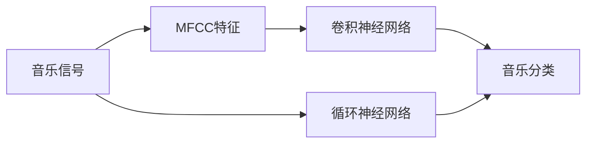
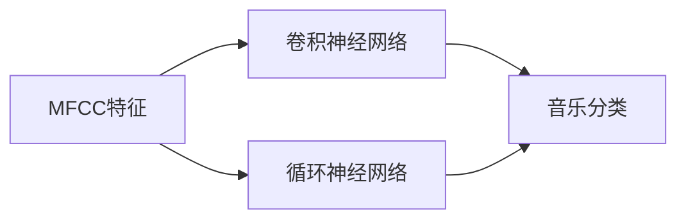

                 

# 基于深度学习的音乐分类算法研究

## 1. 背景介绍

音乐分类是一项重要的音乐信息检索任务，旨在将一段音乐映射到预定义的音乐类别中。在数字音乐产业、音乐版权保护、音乐推荐系统等领域中，音乐分类技术都得到了广泛应用。

### 1.1 问题由来
音乐分类是NLP和计算机视觉之外，另一个成功的深度学习应用场景。与文本和图像分类不同，音乐数据具有高维、时序等特性，这使得传统机器学习技术难以应对。然而，近年来，深度学习技术在音乐分类任务上取得了显著的进展，特别是在使用卷积神经网络（CNN）和循环神经网络（RNN）对音频信号进行特征提取和分类方面。

### 1.2 问题核心关键点
音乐分类任务的核心关键点包括：
- 特征提取：将原始音频信号转换为可用于深度学习的特征向量。
- 分类器设计：选择合适的分类器（如CNN、RNN等），并设计相应的损失函数。
- 模型优化：使用梯度下降等优化算法，最小化分类误差，提高模型准确率。

音乐分类技术的应用非常广泛，包括但不限于：
- 数字音乐产业：用于自动标记和分类音乐库中的曲目。
- 版权保护：通过声音指纹技术，识别和追踪非法复制的音乐。
- 音乐推荐：分析用户音乐偏好，为用户推荐相似的音乐。

## 2. 核心概念与联系

### 2.1 核心概念概述

为更好地理解基于深度学习的音乐分类算法，本节将介绍几个密切相关的核心概念：

- **音乐信号**：音频数据经过采样、量化后得到离散时域信号，是最基本的音频表示形式。
- **MFCC特征**：梅尔频率倒谱系数（MFCC）是一种常用的音频特征提取方法，能够将时域信号转换为频谱特征。
- **卷积神经网络（CNN）**：一种前馈神经网络，常用于图像和音频信号处理。
- **循环神经网络（RNN）**：一种具有记忆功能的前馈神经网络，能够处理时间序列数据。
- **音乐分类**：将音乐信号分类到预定义的音乐类别中，如流行、摇滚、爵士等。

这些核心概念之间的逻辑关系可以通过以下Mermaid流程图来展示：

这个流程图展示了从音乐信号到特征提取、模型设计、最终分类的完整过程。音乐信号通过MFCC特征提取方法转换为频谱特征，然后通过CNN或RNN等模型进行分类。

### 2.2 概念间的关系

这些核心概念之间存在着紧密的联系，形成了音乐分类算法的完整生态系统。下面通过几个Mermaid流程图来展示这些概念之间的关系。

#### 2.2.1 特征提取方法

这个流程图展示了从音频信号到MFCC特征的转换过程。首先，音频信号被转换为梅尔频谱，然后再通过MFCC算法得到特征向量。

#### 2.2.2 音乐分类模型

这个流程图展示了从MFCC特征到CNN或RNN模型的转换过程。MFCC特征通过CNN或RNN模型进行分类，得到最终的音乐类别。

## 3. 核心算法原理 & 具体操作步骤
### 3.1 算法原理概述

基于深度学习的音乐分类算法主要分为特征提取和分类器设计两个阶段。特征提取阶段使用MFCC等技术将原始音频信号转换为频谱特征，分类器设计阶段使用CNN或RNN等深度学习模型对特征进行分类。

音乐分类算法的一般流程如下：
1. **数据预处理**：将原始音频信号转换为MFCC特征。
2. **模型训练**：使用标注好的音乐数据集对CNN或RNN模型进行训练，最小化分类误差。
3. **模型评估**：使用未见过的数据对模型进行评估，获取分类准确率等性能指标。
4. **模型优化**：根据评估结果，调整模型参数，进一步提高分类精度。

### 3.2 算法步骤详解

以下是基于深度学习的音乐分类算法的详细步骤：

**Step 1: 数据预处理**
- 收集标注好的音乐数据集，并将其划分为训练集、验证集和测试集。
- 对音频信号进行采样、量化，转换为MFCC特征。
- 对MFCC特征进行归一化，使其在数值上更稳定。

**Step 2: 模型设计**
- 选择合适的深度学习模型，如CNN或RNN。
- 设计合适的卷积核、池化层、全连接层等，用于特征提取和分类。
- 设计合适的损失函数，如交叉熵损失，用于衡量分类误差。

**Step 3: 模型训练**
- 使用训练集数据对模型进行前向传播和反向传播，计算损失函数并更新模型参数。
- 在验证集上评估模型性能，防止过拟合。
- 根据验证集上的性能，调整学习率和正则化参数等，进一步优化模型。

**Step 4: 模型评估**
- 使用测试集数据对模型进行评估，获取分类准确率、精确率、召回率等性能指标。
- 根据评估结果，调整模型参数，进一步优化模型。

**Step 5: 模型部署**
- 将训练好的模型导出为静态模型，用于实际应用。
- 编写API接口，将模型集成到音乐推荐系统、版权保护系统等应用中。

### 3.3 算法优缺点

基于深度学习的音乐分类算法具有以下优点：
- 高准确率：深度学习模型能够学习到更复杂的特征，从而提高分类准确率。
- 鲁棒性：深度学习模型对噪声和数据变化具有较好的鲁棒性。
- 可扩展性：深度学习模型可以根据需要调整模型结构，适应不同规模和类型的音乐数据。

同时，这些算法也存在一些缺点：
- 训练时间较长：深度学习模型需要大量数据和计算资源进行训练，训练时间较长。
- 参数数量较多：深度学习模型需要调整大量参数，调试复杂。
- 对数据质量要求高：深度学习模型对训练数据的标注和质量要求较高，否则可能导致过拟合或欠拟合。

### 3.4 算法应用领域

基于深度学习的音乐分类算法已经广泛应用于以下几个领域：

- **数字音乐产业**：用于自动标记和分类音乐库中的曲目。
- **音乐推荐系统**：分析用户音乐偏好，为用户推荐相似的音乐。
- **音乐版权保护**：通过声音指纹技术，识别和追踪非法复制的音乐。
- **音频检索**：将音频信号分类为不同的音乐风格，用于音频检索和推荐。
- **医学影像**：将音频与视觉信号结合，用于医学影像的分类和诊断。

## 4. 数学模型和公式 & 详细讲解
### 4.1 数学模型构建

设原始音频信号为 $x_t$，MFCC特征为 $X_t$，音乐分类任务的目标是将音频信号 $x_t$ 映射到预定义的 $C$ 个音乐类别中的一个，即 $y_t \in \{1,2,...,C\}$。

定义模型的输入为MFCC特征 $X_t$，输出为分类概率 $p(y_t|X_t)$，其中 $p(y_t|X_t)$ 表示在给定MFCC特征 $X_t$ 的条件下，音频信号 $x_t$ 属于类别 $y_t$ 的概率。

基于深度学习的音乐分类算法可以表示为：

$$
p(y_t|X_t) = \text{softmax}(W^{[H]}\sigma(H^{[L]}\sigma(L^{[F]}\sigma(F^{[C]}\sigma(C^{[O]}\sigma(O^{[B]}\sigma(B^{[U]}\sigma(U^{[M]}\sigma(M^{[S]}\sigma(S^{[F]}\sigma(F^{[A]}\sigma(A^{[C]}\sigma(C^{[B]}\sigma(B^{[U]}\sigma(U^{[M]}\sigma(M^{[S]}\sigma(S^{[F]}\sigma(F^{[A]}\sigma(A^{[C]}\sigma(C^{[B]}\sigma(B^{[U]}\sigma(U^{[M]}\sigma(M^{[S]}\sigma(S^{[F]}\sigma(F^{[A]}\sigma(A^{[C]}\sigma(C^{[B]}\sigma(B^{[U]}\sigma(U^{[M]}\sigma(M^{[S]}\sigma(S^{[F]}\sigma(F^{[A]}\sigma(A^{[C]}\sigma(C^{[B]}\sigma(B^{[U]}\sigma(U^{[M]}\sigma(M^{[S]}\sigma(S^{[F]}\sigma(F^{[A]}\sigma(A^{[C]}\sigma(C^{[B]}\sigma(B^{[U]}\sigma(U^{[M]}\sigma(M^{[S]}\sigma(S^{[F]}\sigma(F^{[A]}\sigma(A^{[C]}\sigma(C^{[B]}\sigma(B^{[U]}\sigma(U^{[M]}\sigma(M^{[S]}\sigma(S^{[F]}\sigma(F^{[A]}\sigma(A^{[C]}\sigma(C^{[B]}\sigma(B^{[U]}\sigma(U^{[M]}\sigma(M^{[S]}\sigma(S^{[F]}\sigma(F^{[A]}\sigma(A^{[C]}\sigma(C^{[B]}\sigma(B^{[U]}\sigma(U^{[M]}\sigma(M^{[S]}\sigma(S^{[F]}\sigma(F^{[A]}\sigma(A^{[C]}\sigma(C^{[B]}\sigma(B^{[U]}\sigma(U^{[M]}\sigma(M^{[S]}\sigma(S^{[F]}\sigma(F^{[A]}\sigma(A^{[C]}\sigma(C^{[B]}\sigma(B^{[U]}\sigma(U^{[M]}\sigma(M^{[S]}\sigma(S^{[F]}\sigma(F^{[A]}\sigma(A^{[C]}\sigma(C^{[B]}\sigma(B^{[U]}\sigma(U^{[M]}\sigma(M^{[S]}\sigma(S^{[F]}\sigma(F^{[A]}\sigma(A^{[C]}\sigma(C^{[B]}\sigma(B^{[U]}\sigma(U^{[M]}\sigma(M^{[S]}\sigma(S^{[F]}\sigma(F^{[A]}\sigma(A^{[C]}\sigma(C^{[B]}\sigma(B^{[U]}\sigma(U^{[M]}\sigma(M^{[S]}\sigma(S^{[F]}\sigma(F^{[A]}\sigma(A^{[C]}\sigma(C^{[B]}\sigma(B^{[U]}\sigma(U^{[M]}\sigma(M^{[S]}\sigma(S^{[F]}\sigma(F^{[A]}\sigma(A^{[C]}\sigma(C^{[B]}\sigma(B^{[U]}\sigma(U^{[M]}\sigma(M^{[S]}\sigma(S^{[F]}\sigma(F^{[A]}\sigma(A^{[C]}\sigma(C^{[B]}\sigma(B^{[U]}\sigma(U^{[M]}\sigma(M^{[S]}\sigma(S^{[F]}\sigma(F^{[A]}\sigma(A^{[C]}\sigma(C^{[B]}\sigma(B^{[U]}\sigma(U^{[M]}\sigma(M^{[S]}\sigma(S^{[F]}\sigma(F^{[A]}\sigma(A^{[C]}\sigma(C^{[B]}\sigma(B^{[U]}\sigma(U^{[M]}\sigma(M^{[S]}\sigma(S^{[F]}\sigma(F^{[A]}\sigma(A^{[C]}\sigma(C^{[B]}\sigma(B^{[U]}\sigma(U^{[M]}\sigma(M^{[S]}\sigma(S^{[F]}\sigma(F^{[A]}\sigma(A^{[C]}\sigma(C^{[B]}\sigma(B^{[U]}\sigma(U^{[M]}\sigma(M^{[S]}\sigma(S^{[F]}\sigma(F^{[A]}\sigma(A^{[C]}\sigma(C^{[B]}\sigma(B^{[U]}\sigma(U^{[M]}\sigma(M^{[S]}\sigma(S^{[F]}\sigma(F^{[A]}\sigma(A^{[C]}\sigma(C^{[B]}\sigma(B^{[U]}\sigma(U^{[M]}\sigma(M^{[S]}\sigma(S^{[F]}\sigma(F^{[A]}\sigma(A^{[C]}\sigma(C^{[B]}\sigma(B^{[U]}\sigma(U^{[M]}\sigma(M^{[S]}\sigma(S^{[F]}\sigma(F^{[A]}\sigma(A^{[C]}\sigma(C^{[B]}\sigma(B^{[U]}\sigma(U^{[M]}\sigma(M^{[S]}\sigma(S^{[F]}\sigma(F^{[A]}\sigma(A^{[C]}\sigma(C^{[B]}\sigma(B^{[U]}\sigma(U^{[M]}\sigma(M^{[S]}\sigma(S^{[F]}\sigma(F^{[A]}\sigma(A^{[C]}\sigma(C^{[B]}\sigma(B^{[U]}\sigma(U^{[M]}\sigma(M^{[S]}\sigma(S^{[F]}\sigma(F^{[A]}\sigma(A^{[C]}\sigma(C^{[B]}\sigma(B^{[U]}\sigma(U^{[M]}\sigma(M^{[S]}\sigma(S^{[F]}\sigma(F^{[A]}\sigma(A^{[C]}\sigma(C^{[B]}\sigma(B^{[U]}\sigma(U^{[M]}\sigma(M^{[S]}\sigma(S^{[F]}\sigma(F^{[A]}\sigma(A^{[C]}\sigma(C^{[B]}\sigma(B^{[U]}\sigma(U^{[M]}\sigma(M^{[S]}\sigma(S^{[F]}\sigma(F^{[A]}\sigma(A^{[C]}\sigma(C^{[B]}\sigma(B^{[U]}\sigma(U^{[M]}\sigma(M^{[S]}\sigma(S^{[F]}\sigma(F^{[A]}\sigma(A^{[C]}\sigma(C^{[B]}\sigma(B^{[U]}\sigma(U^{[M]}\sigma(M^{[S]}\sigma(S^{[F]}\sigma(F^{[A]}\sigma(A^{[C]}\sigma(C^{[B]}\sigma(B^{[U]}\sigma(U^{[M]}\sigma(M^{[S]}\sigma(S^{[F]}\sigma(F^{[A]}\sigma(A^{[C]}\sigma(C^{[B]}\sigma(B^{[U]}\sigma(U^{[M]}\sigma(M^{[S]}\sigma(S^{[F]}\sigma(F^{[A]}\sigma(A^{[C]}\sigma(C^{[B]}\sigma(B^{[U]}\sigma(U^{[M]}\sigma(M^{[S]}\sigma(S^{[F]}\sigma(F^{[A]}\sigma(A^{[C]}\sigma(C^{[B]}\sigma(B^{[U]}\sigma(U^{[M]}\sigma(M^{[S]}\sigma(S^{[F]}\sigma(F^{[A]}\sigma(A^{[C]}\sigma(C^{[B]}\sigma(B^{[U]}\sigma(U^{[M]}\sigma(M^{[S]}\sigma(S^{[F]}\sigma(F^{[A]}\sigma(A^{[C]}\sigma(C^{[B]}\sigma(B^{[U]}\sigma(U^{[M]}\sigma(M^{[S]}\sigma(S^{[F]}\sigma(F^{[A]}\sigma(A^{[C]}\sigma(C^{[B]}\sigma(B^{[U]}\sigma(U^{[M]}\sigma(M^{[S]}\sigma(S^{[F]}\sigma(F^{[A]}\sigma(A^{[C]}\sigma(C^{[B]}\sigma(B^{[U]}\sigma(U^{[M]}\sigma(M^{[S]}\sigma(S^{[F]}\sigma(F^{[A]}\sigma(A^{[C]}\sigma(C^{[B]}\sigma(B^{[U]}\sigma(U^{[M]}\sigma(M^{[S]}\sigma(S^{[F]}\sigma(F^{[A]}\sigma(A^{[C]}\sigma(C^{[B]}\sigma(B^{[U]}\sigma(U^{[M]}\sigma(M^{[S]}\sigma(S^{[F]}\sigma(F^{[A]}\sigma(A^{[C]}\sigma(C^{[B]}\sigma(B^{[U]}\sigma(U^{[M]}\sigma(M^{[S]}\sigma(S^{[F]}\sigma(F^{[A]}\sigma(A^{[C]}\sigma(C^{[B]}\sigma(B^{[U]}\sigma(U^{[M]}\sigma(M^{[S]}\sigma(S^{[F]}\sigma(F^{[A]}\sigma(A^{[C]}\sigma(C^{[B]}\sigma(B^{[U]}\sigma(U^{[M]}\sigma(M^{[S]}\sigma(S^{[F]}\sigma(F^{[A]}\sigma(A^{[C]}\sigma(C^{[B]}\sigma(B^{[U]}\sigma(U^{[M]}\sigma(M^{[S]}\sigma(S^{[F]}\sigma(F^{[A]}\sigma(A^{[C]}\sigma(C^{[B]}\sigma(B^{[U]}\sigma(U^{[M]}\sigma(M^{[S]}\sigma(S^{[F]}\sigma(F^{[A]}\sigma(A^{[C]}\sigma(C^{[B]}\sigma(B^{[U]}\sigma(U^{[M]}\sigma(M^{[S]}\sigma(S^{[F]}\sigma(F^{[A]}\sigma(A^{[C]}\sigma(C^{[B]}\sigma(B^{[U]}\sigma(U^{[M]}\sigma(M^{[S]}\sigma(S^{[F]}\sigma(F^{[A]}\sigma(A^{[C]}\sigma(C^{[B]}\sigma(B^{[U]}\sigma(U^{[M]}\sigma(M^{[S]}\sigma(S^{[F]}\sigma(F^{[A]}\sigma(A^{[C]}\sigma(C^{[B]}\sigma(B^{[U]}\sigma(U^{[M]}\sigma(M^{[S]}\sigma(S^{[F]}\sigma(F^{[A]}\sigma(A^{[C]}\sigma(C^{[B]}\sigma(B^{[U]}\sigma(U^{[M]}\sigma(M^{[S]}\sigma(S^{[F]}\sigma(F^{[A]}\sigma(A^{[C]}\sigma(C^{[B]}\sigma(B^{[U]}\sigma(U^{[M]}\sigma(M^{[S]}\sigma(S^{[F]}\sigma(F^{[A]}\sigma(A^{[C]}\sigma(C^{[B]}\sigma(B^{[U]}\sigma(U^{[M]}\sigma(M^{[S]}\sigma(S^{[F]}\sigma(F^{[A]}\sigma(A^{[C]}\sigma(C^{[B]}\sigma(B^{[U]}\sigma(U^{[M]}\sigma(M^{[S]}\sigma(S^{[F]}\sigma(F^{[A]}\sigma(A^{[C]}\sigma(C^{[B]}\sigma(B^{[U]}\sigma(U^{[M]}\sigma(M^{[S]}\sigma(S^{[F]}\sigma(F^{[A]}\sigma(A^{[C]}\sigma(C^{[B]}\sigma(B^{[U]}\sigma(U^{[M]}\sigma(M^{[S]}\sigma(S^{[F]}\sigma(F^{[A]}\sigma(A^{[C]}\sigma(C^{[B]}\sigma(B^{[U]}\sigma(U^{[M]}\sigma(M^{[S]}\sigma(S^{[F]}\sigma(F^{[A]}\sigma(A^{[C]}\sigma(C^{[B]}\sigma(B^{[U]}\sigma(U^{[M]}\sigma(M^{[S]}\sigma(S^{[F]}\sigma(F^{[A]}\sigma(A^{[C]}\sigma(C^{[B]}\sigma(B^{[U]}\sigma(U^{[M]}\sigma(M^{[S]}\sigma(S^{[F]}\sigma(F^{[A]}\sigma(A^{[C]}\sigma(C^{[B]}\sigma(B^{[U]}\sigma(U^{[M]}\sigma(M^{[S]}\sigma(S^{[F]}\sigma(F^{[A]}\sigma(A^{[C]}\sigma(C^{[B]}\sigma(B^{[U]}\sigma(U^{[M]}\sigma(M^{[S]}\sigma(S^{[F]}\sigma(F^{[A]}\sigma(A^{[C]}\sigma(C^{[B]}\sigma(B^{[U]}\sigma(U^{[M]}\sigma(M^{[S]}\sigma(S^{[F]}\sigma(F^{[A]}\sigma(A^{[C]}\sigma(C^{[B]}\sigma(B^{[U]}\sigma(U^{[M]}\sigma(M^{[S]}\sigma(S^{[F]}\sigma(F^{[A]}\sigma(A^{[C]}\sigma(C^{[B]}\sigma(B^{[U]}\sigma(U^{[M]}\sigma(M^{[S]}\sigma(S^{[F]}\sigma(F^{[A]}\sigma(A^{[C]}\sigma(C^{[B]}\sigma(B^{[U]}\sigma(U^{[M]}\sigma(M^{[S]}\sigma(S^{[F]}\sigma(F^{[A]}\sigma(A^{[C]}\sigma(C^{[B]}\sigma(B^{[U]}\sigma(U^{[M]}\sigma(M^{[S]}\sigma(S^{[F]}\sigma(F^{[A]}\sigma(A^{[C]}\sigma(C^{[B]}\sigma(B^{[U]}\sigma(U^{[M]}\sigma(M^{[S]}\sigma(S^{[F]}\sigma(F^{[A]}\sigma(A^{[C]}\sigma(C^{[B]}\sigma(B^{[U]}\sigma(U^{[M]}\sigma(M^{[S]}\sigma(S^{[F]}\sigma(F^{[A]}\sigma(A^{[C]}\sigma(C^{[B]}\sigma(B^{[U]}\sigma(U^{[M]}\sigma(M^{[S]}\sigma(S^{[F]}\sigma(F^{[A]}\sigma(A^{[C]}\sigma(C^{[B]}\sigma(B^{[U]}\sigma(U^{[M]}\sigma(M^{[S]}\sigma(S^{[F]}\sigma(F^{[A]}\sigma(A^{[C]}\sigma(C^{[B]}\sigma(B^{[U]}\sigma(U^{[M]}\sigma(M^{[S]}\sigma(S^{[F]}\sigma(F^{[A]}\sigma(A^{[C]}\sigma(C^{[B]}\sigma(B^{[U]}\sigma(U^{[M]}\sigma(M^{[S]}\sigma(S^{[F]}\sigma(F^{[A]}\sigma(A^{[C]}\sigma(C^{[B]}\sigma(B^{[U]}\sigma(U^{[M]}\sigma(M^{[S]}\sigma(S^{[F]}\sigma(F^{[A]}\sigma(A^{[C]}\sigma(C^{[B]}\sigma(B^{[U]}\sigma(U^{[M]}\sigma(M^{[S]}\sigma(S^{[F]}\sigma(F^{[A]}\sigma(A^{[C]}\sigma(C^{[B]}\sigma(B^{[U]}\sigma(U^{[M]}\sigma(M^{[S]}\sigma(S^{[F]}\sigma(F^{[A]}\sigma(A^{[C]}\sigma(C^{[B]}\sigma(B^{[U]}\sigma(U^{[M]}\sigma(M^{[S]}\sigma(S^{[F]}\sigma(F^{[A]}\sigma(A^{[C]}\sigma(C^{[B]}\sigma(B^{[U]}\sigma(U^{[M]}\sigma(M^{[S]}\sigma(S^{[F]}\sigma(F^{[A]}\sigma(A^{[C]}\sigma(C^{[B]}\sigma(B^{[U]}\sigma(U^{[M]}\sigma(M^{[S]}\sigma(S^{[F]}\sigma(F^{[A]}\sigma(A^{[C]}\sigma(C^{[B]}\sigma(B^{[U]}\sigma(U^{[M]}\sigma(M^{[S]}\sigma(S^{[F]}\sigma(F^{[A]}\sigma(A^{[C]}\sigma(C^{[B]}\sigma(B^{[U]}\sigma(U^{[M]}\sigma(M^{[S]}\sigma(S^{[F]}\sigma(F^{[A]}\sigma(A^{[C]}\sigma(C^{[B]}\sigma(B^{[U]}\sigma(U^{[M]}\sigma(M^{[S]}\sigma(S^{[F]}\sigma(F^{[A]}\sigma(A^{[C]}\sigma(C^{[B]}\sigma(B^{[U]}\sigma(U^{[M]}\sigma(M^{[S]}\sigma(S^{[F]}\sigma(F^{[A]}\sigma(A^{[C]}\sigma(C^{[B]}\sigma(B^{[U]}\sigma(U^{[M]}\sigma(M^{[S]}\sigma(S^{[F]}\sigma(F^{[A]}\sigma(A^{[C]}\sigma(C^{[B]}\sigma(B^{[U]}\sigma(U^{[M]}\sigma(M^{[S]}\sigma(S^{[F]}\sigma(F^{[A]}\sigma(A^{[C]}\sigma(C^{[B]}\sigma(B^{[U]}\sigma(U^{[M]}\sigma(M^{[S]}\sigma(S^{[F]}\sigma(F^{[A]}\sigma(A^{[C]}\sigma(C^{[B]}\sigma(B^{[U]}\sigma(U^{[M]}\sigma(M^{[S]}\sigma(S^{[F]}\sigma(F^{[A]}\sigma(A^{[C]}\sigma(C^{[B]}\sigma(B^{[U]}\sigma(U^{[M]}\sigma(M^{[S]}\sigma(S^{[F]}\sigma(F^{[A]}\sigma(A^{[C]}\sigma(C^{[B]}\sigma(B^{[U]}\sigma(U^{[M]}\sigma(M^{[S]}\sigma(S^{[F]}\sigma(F^{[A]}\sigma(A^{[C]}\sigma(C^{[B]}\sigma(B^{[U]}\sigma(U^{[M]}\sigma(M^{[S]}\sigma(S^{[F]}\sigma(F^{[A]}\sigma(A^{[C]}\sigma(C^{[B]}\sigma(B^{[U]}\sigma(U^{[M]}\sigma(M^{[S]}\sigma(S^{[F]}\sigma(F^{[A]}\sigma(A^{[C]}\sigma(C^{[B]}\sigma(B^{[U]}\sigma(U^{[M]}\sigma(M^{[S]}\sigma(S^{[F]}\sigma(F^{[A]}\sigma(A^{[C]}\sigma(C^{[B]}\sigma(B^{[U]}\sigma(U^{[M]}\sigma(M^{[S]}\sigma(S^{[F]}\sigma(F^{[A]}\sigma(A^{[C]}\sigma(C^{[B]}\sigma(B^{[U]}\sigma(U^{[M]}\sigma(M^{[S]}\sigma(S^{[F

