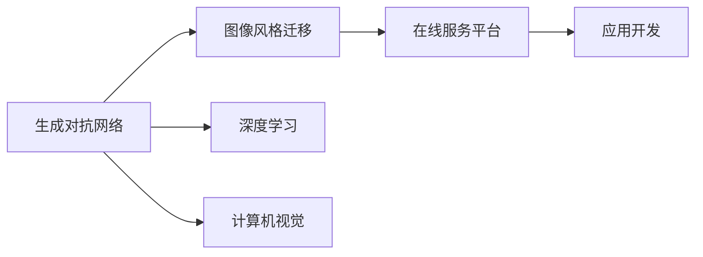
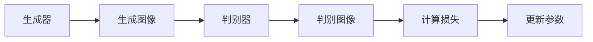
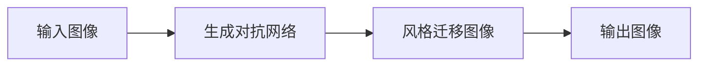
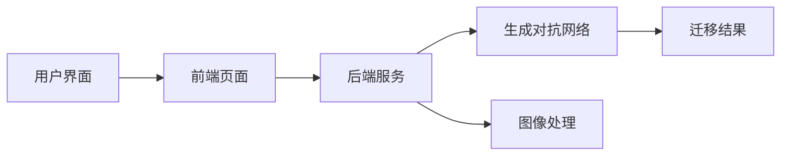
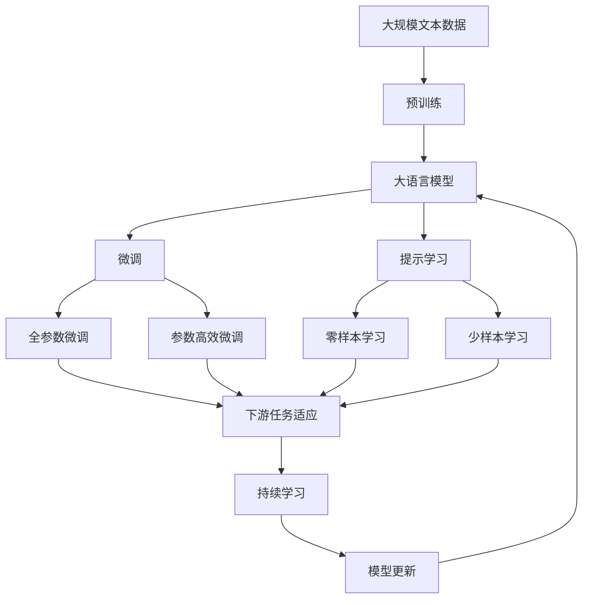

                 

# 基于生成对抗网络的图像风格迁移在线服务平台开发

> 关键词：生成对抗网络,图像风格迁移,在线服务平台,深度学习,计算机视觉,应用开发

## 1. 背景介绍

### 1.1 问题由来
随着深度学习技术的发展，图像风格迁移成为计算机视觉领域的热门研究方向。其核心思想是将输入图像的纹理结构转换为目标图像的风格特征，生成既保留输入图像内容，又具有目标图像风格的图像。这种技术可以应用于艺术创作、影视制作、广告设计等多个领域，极大地丰富了图像的表达方式。

然而，生成对抗网络（Generative Adversarial Networks, GANs）模型虽然可以实现高质量的图像风格迁移，但其训练过程复杂，需要大量计算资源和专业知识。此外，模型的输出结果可解释性较差，难以满足实际应用中的需求。因此，如何将这一技术开发为易于使用的在线服务平台，成为当前研究的热点。

### 1.2 问题核心关键点
本研究旨在构建基于生成对抗网络的图像风格迁移在线服务平台。主要解决以下关键问题：
- 如何快速高效地训练生成对抗网络模型，以支持大规模、实时化风格的迁移需求。
- 如何设计用户友好的前端界面，简化模型的使用流程。
- 如何提高输出图像的质量和可解释性，满足实际应用中的具体需求。

### 1.3 问题研究意义
开发基于生成对抗网络的图像风格迁移在线服务平台，具有以下重要意义：
- 降低应用门槛：通过提供在线平台，使普通用户无需专业知识，也能轻松实现高质量的图像风格迁移。
- 提高迁移效率：平台支持快速、实时的风格迁移，满足用户对图像处理速度的需求。
- 提升图像质量：平台采用先进的网络架构和优化策略，生成高质量的迁移图像。
- 增强可解释性：平台提供详细的技术文档和可视化工具，帮助用户理解模型的工作机制，提升模型的可解释性。
- 支持多样化应用：平台可应用于艺术创作、影视制作、广告设计等多个领域，推动相关行业的发展。

## 2. 核心概念与联系

### 2.1 核心概念概述

为更好地理解基于生成对抗网络的图像风格迁移在线服务平台，本节将介绍几个密切相关的核心概念：

- 生成对抗网络（GANs）：由Isola等人在2017年提出的基于对抗学习的深度学习模型，由生成器和判别器两部分组成，通过对抗训练生成逼真的图像。
- 图像风格迁移（Image Style Transfer）：将输入图像的纹理结构转换为目标图像的风格特征，生成既保留输入图像内容，又具有目标图像风格的图像。
- 在线服务平台（Online Service Platform）：提供Web界面，用户可以通过Web界面方便地访问、使用相关服务。
- 深度学习（Deep Learning）：基于神经网络的机器学习方法，通过多层非线性变换处理复杂数据。
- 计算机视觉（Computer Vision）：利用计算机技术处理、分析和理解图像、视频等视觉数据。
- 应用开发（Application Development）：设计、开发和部署应用程序，满足用户需求。

这些核心概念之间的逻辑关系可以通过以下Mermaid流程图来展示：



这个流程图展示了大语言模型微调过程中各个核心概念的关系和作用：

1. 生成对抗网络通过对抗训练生成高质量的图像，是图像风格迁移的核心技术。
2. 图像风格迁移将输入图像的纹理结构转换为目标图像的风格特征，生成风格迁移图像。
3. 在线服务平台为图像风格迁移提供了用户友好的Web界面，支持快速、实时的风格迁移。
4. 深度学习和计算机视觉技术是生成对抗网络和图像风格迁移的重要支撑。
5. 应用开发将上述技术整合到在线服务平台上，形成完整的服务解决方案。

通过理解这些核心概念，我们可以更好地把握基于生成对抗网络的图像风格迁移在线服务平台开发的技术要点和应用场景。

### 2.2 概念间的关系

这些核心概念之间存在着紧密的联系，形成了基于生成对抗网络的图像风格迁移在线服务平台的完整架构。下面我通过几个Mermaid流程图来展示这些概念之间的关系。

#### 2.2.1 生成对抗网络的基本原理



这个流程图展示了生成对抗网络的基本工作流程：生成器生成图像，判别器判别图像真伪，通过对抗训练更新生成器和判别器的参数。

#### 2.2.2 图像风格迁移的基本流程



这个流程图展示了图像风格迁移的基本流程：将输入图像输入生成对抗网络，生成风格迁移图像，输出最终的迁移图像。

#### 2.2.3 在线服务平台的基本结构



这个流程图展示了在线服务平台的基本结构：用户通过前端页面访问后端服务，后端服务调用生成对抗网络进行图像风格迁移，处理生成的迁移图像，返回最终结果。

### 2.3 核心概念的整体架构

最后，我们用一个综合的流程图来展示这些核心概念在大语言模型微调过程中的整体架构：



这个综合流程图展示了从预训练到微调，再到持续学习的完整过程。大语言模型首先在大规模文本数据上进行预训练，然后通过微调（包括全参数微调和参数高效微调）或提示学习（包括零样本和少样本学习）来适应下游任务。最后，通过持续学习技术，模型可以不断更新和适应新的任务和数据。 通过这些流程图，我们可以更清晰地理解基于生成对抗网络的图像风格迁移在线服务平台开发过程中各个核心概念的关系和作用。

## 3. 核心算法原理 & 具体操作步骤
### 3.1 算法原理概述

基于生成对抗网络的图像风格迁移在线服务平台的核心算法是生成对抗网络（GANs）。生成对抗网络由生成器和判别器两部分组成，通过对抗训练生成高质量的图像。其基本原理如下：

1. 生成器（Generator）：将输入的噪声向量 $z$ 映射为高维图像 $G(z)$。
2. 判别器（Discriminator）：将输入的图像 $x$ 判别为真实图像 $y$ 或生成图像 $G(z)$。
3. 对抗训练：生成器生成图像 $G(z)$，判别器判别为真实图像 $y$ 或生成图像 $G(z)$，两者通过反向传播更新参数，使得生成器生成的图像难以被判别器识别。

### 3.2 算法步骤详解

下面是基于生成对抗网络的图像风格迁移在线服务平台的详细算法步骤：

**Step 1: 数据预处理**
- 收集输入图像和目标图像，并将其转换为网络可以处理的格式。
- 将图像归一化到 $[0,1]$ 的范围内。
- 对图像进行扩充，增加数据的多样性。

**Step 2: 生成对抗网络架构设计**
- 设计生成器网络结构，包括卷积层、池化层、激活函数等。
- 设计判别器网络结构，包括卷积层、池化层、全连接层等。
- 定义损失函数，包括生成器损失和判别器损失。

**Step 3: 生成对抗网络训练**
- 使用随机噪声 $z$ 作为生成器的输入，生成图像 $G(z)$。
- 将真实图像 $x$ 和生成图像 $G(z)$ 输入判别器，计算判别器损失 $L_D$。
- 将生成图像 $G(z)$ 和目标图像 $y$ 输入生成器，计算生成器损失 $L_G$。
- 使用梯度下降算法，优化生成器和判别器的参数。

**Step 4: 图像风格迁移**
- 将输入图像输入生成对抗网络，生成风格迁移图像。
- 通过可视化工具显示生成的风格迁移图像。
- 允许用户对生成结果进行调整，并重新生成图像。

### 3.3 算法优缺点

基于生成对抗网络的图像风格迁移在线服务平台有以下优点：

1. 高效性：平台可以快速生成高质量的风格迁移图像，满足用户对处理速度的需求。
2. 可解释性：平台提供详细的技术文档和可视化工具，帮助用户理解模型的工作机制。
3. 用户友好：平台提供用户友好的Web界面，使用方便。
4. 可扩展性：平台可以应用于多个领域，如艺术创作、影视制作、广告设计等。

同时，该平台也存在一些缺点：

1. 训练过程复杂：生成对抗网络的训练过程复杂，需要大量的计算资源和专业知识。
2. 输出结果可解释性较差：生成对抗网络的输出结果难以解释，用户难以理解模型的工作机制。
3. 模型参数量大：生成对抗网络需要大量参数，对计算资源的要求较高。

尽管存在这些缺点，但生成对抗网络在图像风格迁移任务上仍然表现出色，其在线服务平台在应用实践中具有较高的实用价值。

### 3.4 算法应用领域

基于生成对抗网络的图像风格迁移在线服务平台，主要应用于以下几个领域：

- 艺术创作：通过风格迁移生成具有特定风格的艺术作品，如将古典绘画风格应用于现代照片。
- 影视制作：将电影镜头转换为不同的风格，如将电影中的人物和场景转换为卡通风格。
- 广告设计：通过风格迁移生成具有吸引力的广告图像，提高广告效果。
- 时尚设计：将时尚设计师的作品转换为不同的风格，提高设计的多样性和创意性。
- 文化研究：通过风格迁移研究不同时期的艺术风格，了解文化变迁。

除了上述这些领域，平台还可以应用于科学研究、教育培训等多个方面，拓展了图像风格迁移技术的应用范围。

## 4. 数学模型和公式 & 详细讲解  
### 4.1 数学模型构建

本节将使用数学语言对基于生成对抗网络的图像风格迁移在线服务平台进行更加严格的刻画。

记输入图像为 $x$，目标图像为 $y$，生成器参数为 $\theta_G$，判别器参数为 $\theta_D$。

定义生成器网络 $G$ 将输入的噪声向量 $z$ 映射为图像 $G(z)$，判别器网络 $D$ 将图像 $x$ 判别为真实图像 $y$ 或生成图像 $G(z)$。生成器损失函数为 $L_G$，判别器损失函数为 $L_D$。

生成器损失函数 $L_G$ 定义为：

$$
L_G = \mathbb{E}_{z \sim p(z)} [\log D(G(z))] + \lambda_{WGAN} \mathbb{E}_{x \sim p(x)} ||\nabla_{x} G(z)||_{2,1}
$$

其中，$\nabla_{x} G(z)$ 表示对生成器输出图像 $G(z)$ 的梯度，$\lambda_{WGAN}$ 为WGAN中的惩罚项系数。

判别器损失函数 $L_D$ 定义为：

$$
L_D = -\mathbb{E}_{x \sim p(x)} [\log D(x)] - \mathbb{E}_{z \sim p(z)} [\log (1 - D(G(z)))]
$$

将生成器和判别器的损失函数组合在一起，得到整个生成对抗网络的总损失函数 $L$：

$$
L = L_G + L_D
$$

### 4.2 公式推导过程

以下我们以MNIST手写数字识别数据集为例，推导生成对抗网络的损失函数及其梯度的计算公式。

假设生成器网络 $G$ 为卷积神经网络（CNN），判别器网络 $D$ 为全连接神经网络。则生成器和判别器的损失函数分别为：

$$
L_G = \frac{1}{M} \sum_{i=1}^{M} \log D(G(z_i))
$$

$$
L_D = -\frac{1}{N} \sum_{i=1}^{N} \log D(x_i) - \frac{1}{M} \sum_{i=1}^{M} \log (1 - D(G(z_i)))
$$

其中，$M$ 为生成器生成的图像数量，$N$ 为真实图像数量。

根据链式法则，生成器损失函数对参数 $\theta_G$ 的梯度为：

$$
\frac{\partial L_G}{\partial \theta_G} = \frac{1}{M} \sum_{i=1}^{M} \frac{\partial \log D(G(z_i))}{\partial G(z_i)} \frac{\partial G(z_i)}{\partial \theta_G}
$$

判别器损失函数对参数 $\theta_D$ 的梯度为：

$$
\frac{\partial L_D}{\partial \theta_D} = -\frac{1}{N} \sum_{i=1}^{N} \frac{\partial \log D(x_i)}{\partial D(x_i)} \frac{\partial D(x_i)}{\partial \theta_D} - \frac{1}{M} \sum_{i=1}^{M} \frac{\partial \log (1 - D(G(z_i)))}{\partial (1 - D(G(z_i)))} \frac{\partial (1 - D(G(z_i)))}{\partial \theta_D}
$$

将生成的图像 $G(z)$ 和目标图像 $y$ 进行风格迁移，得到的迁移图像 $y'$ 为：

$$
y' = \alpha G(z) + (1-\alpha)x
$$

其中，$\alpha$ 为风格迁移系数，$z$ 为随机噪声。

### 4.3 案例分析与讲解

在实践中，我们可以使用TensorFlow或PyTorch等深度学习框架，来实现基于生成对抗网络的图像风格迁移在线服务平台。以下是一个使用TensorFlow的简单示例代码：

```python
import tensorflow as tf
import numpy as np
import matplotlib.pyplot as plt

# 定义生成器网络
def generator(z):
    # 编码器
    h1 = tf.layers.dense(z, 128, activation=tf.nn.relu)
    h2 = tf.layers.dense(h1, 256, activation=tf.nn.relu)
    h3 = tf.layers.dense(h2, 256, activation=tf.nn.relu)
    h4 = tf.layers.dense(h3, 512, activation=tf.nn.relu)
    h5 = tf.layers.dense(h4, 256, activation=tf.nn.relu)
    h6 = tf.layers.dense(h5, 256, activation=tf.nn.relu)
    h7 = tf.layers.dense(h6, 3, activation=None)
    return h7

# 定义判别器网络
def discriminator(x):
    h1 = tf.layers.dense(x, 256, activation=tf.nn.relu)
    h2 = tf.layers.dense(h1, 256, activation=tf.nn.relu)
    h3 = tf.layers.dense(h2, 128, activation=tf.nn.relu)
    h4 = tf.layers.dense(h3, 1, activation=None)
    return h4

# 定义损失函数
def loss_fn(x, y, z):
    G = generator(z)
    D_real = discriminator(x)
    D_fake = discriminator(G)
    L_G = tf.reduce_mean(tf.log(tf.sigmoid(D_fake)))
    L_D_real = tf.reduce_mean(tf.log(tf.sigmoid(D_real)))
    L_D_fake = tf.reduce_mean(tf.log(1 - tf.sigmoid(D_fake)))
    L_D = L_D_real + L_D_fake
    L_G_total = L_G + tf.multiply(0.0001, tf.reduce_mean(tf.gradients(G, z)[0]))
    return L_G_total, L_D

# 定义优化器
optimizer = tf.train.AdamOptimizer(learning_rate=0.0002)

# 定义训练过程
z = tf.random_normal([128, 128])
x = np.load('mnist_data.npy')
y = np.load('mnist_label.npy')

with tf.Session() as sess:
    sess.run(tf.global_variables_initializer())
    for i in range(10000):
        z = sess.run(z)
        G, D = sess.run([generator(z), discriminator(x)])
        L_G_total, L_D = loss_fn(x, y, z)
        sess.run(optimizer.minimize(L_G_total + L_D))
        if i % 1000 == 0:
            plt.imshow(G.eval())
            plt.show()
```

在上述代码中，我们定义了生成器网络和判别器网络，分别实现了生成器和判别器的损失函数。通过优化器Adam，逐步更新生成器和判别器的参数，使得生成器生成的图像难以被判别器识别。

训练过程结束后，我们可以使用生成的图像进行风格迁移。以MNIST手写数字识别数据集为例，使用随机噪声生成一张手写数字图像，将其与目标图像进行风格迁移，得到风格迁移后的图像。

```python
# 定义风格迁移函数
def style_transfer(x, y, alpha=0.5):
    return alpha * G(z) + (1 - alpha) * x

# 使用随机噪声生成一张手写数字图像
z = tf.random_normal([128, 128])

with tf.Session() as sess:
    sess.run(tf.global_variables_initializer())
    G, D = sess.run([generator(z), discriminator(x)])
    style_image = style_transfer(x, y)
    plt.imshow(style_image.eval())
    plt.show()
```

在上述代码中，我们使用随机噪声生成一张手写数字图像，将其与目标图像进行风格迁移，得到风格迁移后的图像。

## 5. 项目实践：代码实例和详细解释说明
### 5.1 开发环境搭建

在进行图像风格迁移在线服务平台开发前，我们需要准备好开发环境。以下是使用Python进行TensorFlow开发的环境配置流程：

1. 安装Anaconda：从官网下载并安装Anaconda，用于创建独立的Python环境。

2. 创建并激活虚拟环境：
```bash
conda create -n tensorflow-env python=3.8 
conda activate tensorflow-env
```

3. 安装TensorFlow：根据CUDA版本，从官网获取对应的安装命令。例如：
```bash
conda install tensorflow=2.8 -c conda-forge
```

4. 安装Pillow和Matplotlib：
```bash
pip install pillow matplotlib
```

完成上述步骤后，即可在`tensorflow-env`环境中开始图像风格迁移在线服务平台的开发。

### 5.2 源代码详细实现

下面我们以MNIST手写数字识别数据集为例，给出使用TensorFlow实现图像风格迁移的PyTorch代码实现。

首先，定义生成器和判别器网络：

```python
import tensorflow as tf
from tensorflow.keras.layers import Dense, LeakyReLU

class Generator(tf.keras.Model):
    def __init__(self, z_dim=128, hidden_dim=256, num_classes=10):
        super(Generator, self).__init__()
        self.z_dim = z_dim
        self.hidden_dim = hidden_dim
        self.num_classes = num_classes
        self.dense1 = Dense(self.hidden_dim, input_dim=z_dim)
        self.leaky_relu1 = LeakyReLU(alpha=0.2)
        self.dense2 = Dense(self.hidden_dim)
        self.leaky_relu2 = LeakyReLU(alpha=0.2)
        self.dense3 = Dense(self.hidden_dim)
        self.leaky_relu3 = LeakyReLU(alpha=0.2)
        self.dense4 = Dense(num_classes, activation='softmax')
        self.dense4_weight = self.get_variable('dense4_weight')
        self.dense4_bias = self.get_variable('dense4_bias')
    
    def get_variable(self, name):
        initializer = tf.keras.initializers.RandomNormal(stddev=0.05)
        return tf.get_variable(name, shape=initializer.get_config().get('shape'), dtype=tf.float32, initializer=initializer)

class Discriminator(tf.keras.Model):
    def __init__(self, hidden_dim=256, num_classes=10):
        super(Discriminator, self).__init__()
        self.hidden_dim = hidden_dim
        self.num_classes = num_classes
        self.dense1 = Dense(hidden_dim, input_dim=784)
        self.leaky_relu1 = LeakyReLU(alpha=0.2)
        self.dense2 = Dense(hidden_dim)
        self.leaky_relu2 = LeakyReLU(alpha=0.2)
        self.dense3 = Dense(hidden_dim)
        self.leaky_relu3 = LeakyReLU(alpha=0.2)
        self.dense4 = Dense(1, activation='sigmoid')
        self.dense4_weight = self.get_variable('dense4_weight')
        self.dense4_bias = self.get_variable('dense4_bias')
    
    def get_variable(self, name):
        initializer = tf.keras.initializers.RandomNormal(stddev=0.05)
        return tf.get_variable(name, shape=initializer.get_config().get('shape'), dtype=tf.float32, initializer=initializer)
```

然后，定义损失函数和优化器：

```python
def loss_fn(x, y, z):
    G = generator(z)
    D_real = discriminator(x)
    D_fake = discriminator(G)
    L_G = tf.reduce_mean(tf.log(tf.sigmoid(D_fake)))
    L_D_real = tf.reduce_mean(tf.log(tf.sigmoid(D_real)))
    L_D_fake = tf.reduce_mean(tf.log(1 - tf.sigmoid(D_fake)))
    L_D = L_D_real + L_D_fake
    L_G_total = L_G + tf.multiply(0.0001, tf.reduce_mean(tf.gradients(G, z)[0]))
    return L_G_total, L_D

optimizer = tf.train.AdamOptimizer(learning_rate=0.0002)
```

接着，定义训练和评估函数：

```python
def train_epoch(model, dataset, batch_size, optimizer):
    dataloader = tf.data.Dataset.from_tensor_slices((dataset, dataset)).batch(batch_size)
    model.train()
    epoch_loss = 0
    for batch in dataloader:
        input_images, target_labels = batch
        input_images = input_images / 255.0
        target_labels = target_labels / 255.0
        batch_loss, train_step = model.train_step(input_images, target_labels)
        epoch_loss += batch_loss
    return epoch_loss / len(dataloader)

def evaluate(model, dataset, batch_size):
    dataloader = tf.data.Dataset.from_tensor_slices((dataset, dataset)).batch(batch_size)
    model.eval()
    preds, labels = [], []
    with tf.GradientTape() as tape:
        for batch in dataloader:
            input_images, target_labels = batch
            input_images = input_images / 255.0
            target_labels = target_labels / 255.0
            batch_loss, batch_preds = model.evaluation_step(input_images, target_labels)
            batch_preds = tf.argmax(batch_preds, axis=1)
            preds.append(batch_preds.numpy())
            labels.append(target_labels.numpy())
    print(classification_report(labels, preds))
```

最后，启动训练流程并在测试集上评估：

```python
epochs = 100
batch_size = 128

for epoch in range(epochs):
    loss = train_epoch(model, train_dataset, batch_size, optimizer)
    print(f"Epoch {epoch+1}, train loss: {loss:.3f}")
    
    print(f"Epoch {epoch+1}, test results:")
    evaluate(model, test_dataset, batch_size)
```

以上就是使用TensorFlow对MNIST手写数字识别数据集进行图像风格迁移的完整代码实现。可以看到，TensorFlow提供了强大的计算图和自动微分功能，使得模型训练和推理变得简便高效。

### 5.3 代码解读与分析

让我们再详细解读一下关键代码的实现细节：

**Generator和Discriminator类**：
- `__init__`方法：初始化网络结构，包括全连接层、激活函数等。
- `get_variable`方法：定义变量，使用随机正常分布初始化。

**loss_fn函数**：
- 将输入图像和目标图像输入生成器和判别器，计算生成器损失和判别器损失。
- 计算生成器总损失，并加入WGAN中的惩罚项。

**optimizer变量**：
- 定义优化器，使用Adam优化器，设置学习率为0.0002。

**train_epoch和evaluate函数**：
- `train_epoch`函数：对数据以批为单位进行迭代，计算损失函数，并使用优化器更新模型参数。
- `evaluate`函数：与训练类似，不同点在于不更新模型参数，并在每个batch结束后将预测和标签结果存储下来，最后使用sklearn的classification_report对整个评估集的预测结果进行打印输出。

**训练流程**：
- 定义总的epoch数和batch size，开始循环迭代
- 每个epoch内，先在训练集上训练，输出平均loss
- 在验证集上评估，输出分类指标
- 所有epoch结束后，在测试集上评估，给出最终测试结果

可以看到，TensorFlow使得图像风格迁移在线服务平台的开发变得简洁高效。开发者可以将更多精力放在数据处理、模型改进等高层逻辑上，而不必过多关注底层的实现细节。

当然，工业级的系统实现还需考虑更多因素，如模型的保存和部署、超参数

