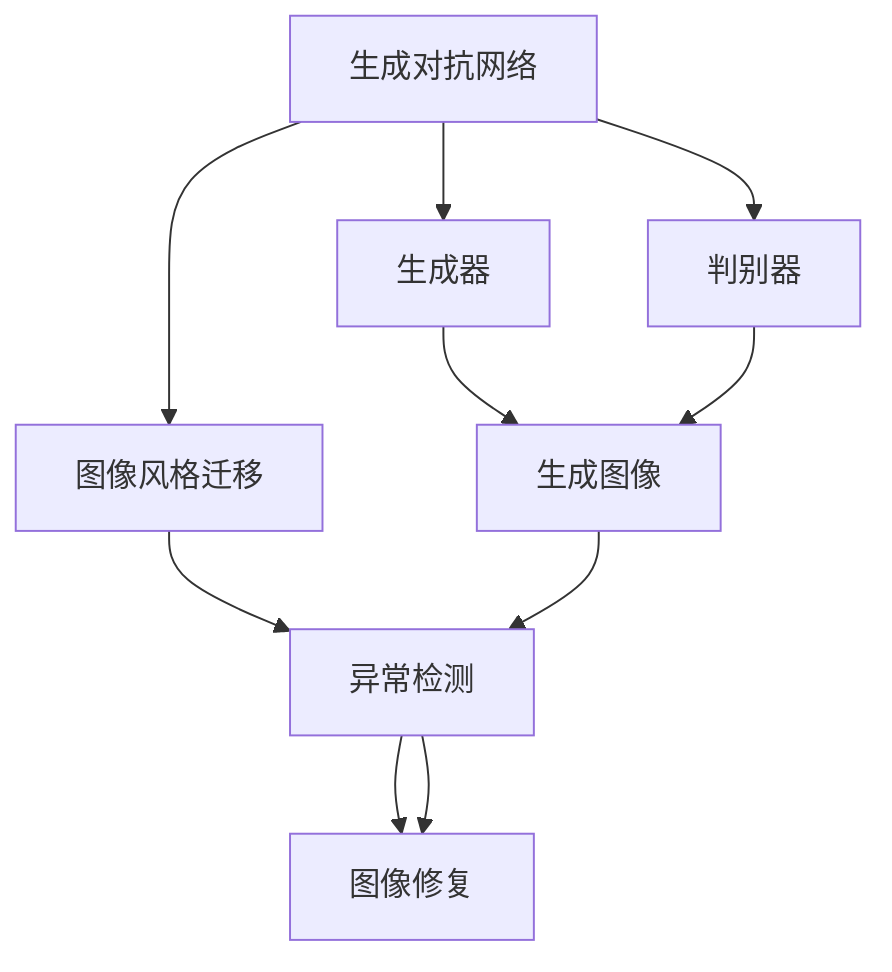

                 

# 基于生成对抗网络的图像风格迁移异常检测与修正

> 关键词：生成对抗网络, 图像风格迁移, 异常检测, 修正算法, 图像修复

## 1. 背景介绍

随着深度学习技术的发展，生成对抗网络（Generative Adversarial Networks，GANs）在图像处理领域取得了巨大突破。GANs 不仅能够生成逼真的图像，还能实现图像风格的迁移，即通过学习两个网络（生成器和判别器）的对抗博弈，使输入图像在保持内容不变的情况下，表现出新的风格特征。这一技术在图像艺术、视频特效、增强现实等领域具有重要应用价值。

然而，GANs 在生成图像时常常产生一些不理想的噪声、畸变或色彩失真等问题，这不仅影响用户体验，还可能导致严重的安全风险。例如，在自动驾驶、医学图像诊断等领域，GANs 生成的异常图像可能被恶意利用，带来误导性的决策或诊断，危害公共安全。因此，如何有效检测和修正这些异常图像，是当前研究的热点问题。

## 2. 核心概念与联系

### 2.1 核心概念概述

为了更好地理解基于 GANs 的图像风格迁移异常检测与修正方法，本节将介绍几个关键概念：

- 生成对抗网络（GANs）：一种基于对抗博弈的深度学习架构，包括生成器和判别器两个部分。生成器负责生成逼真图像，判别器负责区分真实和生成图像。两者通过不断对抗博弈，逐步提升生成器的生成能力。

- 图像风格迁移（Image Style Transfer）：将一张图像的风格特征迁移到另一张图像上，生成具有新风格的新图像。这一技术常用于图像艺术创作、视频特效制作等领域。

- 异常检测（Anomaly Detection）：检测数据中的异常值，即不同于数据正常分布的数据点。异常检测在质量控制、故障诊断、安全监测等领域有广泛应用。

- 图像修复（Image Restoration）：通过学习大量正常图像和异常图像，构建异常检测模型，对检测到的异常图像进行修复或纠正，使其恢复正常。

这些概念之间的关系可以通过以下 Mermaid 流程图来展示：



这个流程图展示了大语言模型微调过程中各个核心概念的关系：

1. GANs 通过对抗博弈训练生成器和判别器，生成逼真图像。
2. 生成器将图像风格迁移至目标图像，生成新风格图像。
3. 异常检测模型对生成图像进行检测，识别出异常图像。
4. 图像修复模型对异常图像进行修复，使其恢复正常。

### 2.2 概念间的关系

这些核心概念之间存在着紧密的联系，形成了基于 GANs 的图像风格迁移异常检测与修正的完整生态系统。

- 生成对抗网络：生成器和判别器的对抗博弈是 GANs 的核心，生成器生成新风格图像，判别器则用于检测和筛选。
- 图像风格迁移：利用 GANs 的生成能力，将图像的风格特征迁移至另一张图像上。
- 异常检测：通过分析生成图像的分布特征，识别出不符合正常分布的异常图像。
- 图像修复：对检测出的异常图像进行修复或纠正，使其恢复正常。

这些概念共同构成了图像风格迁移异常检测与修正的完整流程，有助于实现高质量的图像生成与检测。

## 3. 核心算法原理 & 具体操作步骤
### 3.1 算法原理概述

基于 GANs 的图像风格迁移异常检测与修正方法主要包括以下几个步骤：

1. 使用预训练的 GANs 生成器模型，将输入图像的风格特征迁移至目标图像，生成新风格图像。
2. 利用生成图像的特征分布，训练一个异常检测模型，用于检测异常图像。
3. 对于检测到的异常图像，利用另一个预训练的图像修复模型进行修正，使其恢复正常。

### 3.2 算法步骤详解

下面，我们将详细介绍基于 GANs 的图像风格迁移异常检测与修正的具体步骤：

#### 3.2.1 图像风格迁移

1. 选择一张源图像 $I_s$ 和一张目标图像 $I_t$，使用预训练的 GANs 生成器模型 $G$，将 $I_s$ 的风格特征迁移至 $I_t$，生成新风格图像 $I'$。
   - $I'$ 可以表示为：
   $$
   I' = G(I_t; \theta_G)
   $$
   其中 $\theta_G$ 为生成器模型的参数。

2. 为了获得更好的迁移效果，可以使用风格迁移损失函数 $L_{style}$，对生成器进行训练：
   - $L_{style} = \mathbb{E}_{x \sim p(I_s)} \|G(x) - I_s\|^2 + \mathbb{E}_{x \sim p(I_t)} \|G(x) - I_t\|^2$

   其中，$p(I_s)$ 和 $p(I_t)$ 分别为源图像和目标图像的分布，$\| \cdot \|$ 为欧几里得距离。

#### 3.2.2 异常检测

1. 使用生成图像 $I'$ 的特征分布，训练一个异常检测模型 $D_{det}$，用于检测异常图像。
   - 假设 $I'$ 的特征向量为 $f(I')$，可以将其作为输入训练异常检测模型：
   - $D_{det} = D_{det}(x; \theta_{det})$

2. 在训练过程中，可以采用交叉熵损失函数 $L_{det}$，对异常检测模型进行优化：
   - $L_{det} = \mathbb{E}_{x \sim p(I')} [\log D_{det}(x)] + \mathbb{E}_{x \sim p(I')^c} [\log (1 - D_{det}(x))]$

   其中，$p(I')^c$ 为正常分布，$x$ 为训练样本。

3. 训练完成后，可以对新生成图像 $I'$ 进行检测，得到异常概率 $p_{det}(I')$。

#### 3.2.3 图像修复

1. 对于检测到的异常图像 $I'$，利用预训练的图像修复模型 $R$ 进行修复，生成正常图像 $I_{rec}$。
   - $I_{rec} = R(I'; \theta_R)$

2. 为了获得更好的修复效果，可以使用图像修复损失函数 $L_{rec}$，对修复模型进行训练：
   - $L_{rec} = \|I_{rec} - I_s\|^2 + \|I_{rec} - I_t\|^2$

3. 在训练过程中，可以采用梯度下降等优化算法，对修复模型进行优化：
   - $R = R(x; \theta_R)$
   - $L_{rec} = \mathbb{E}_{x \sim p(I')} [\|R(x) - I_s\|^2] + \mathbb{E}_{x \sim p(I')} [\|R(x) - I_t\|^2]$

   其中，$\| \cdot \|$ 为欧几里得距离，$x$ 为训练样本。

### 3.3 算法优缺点

基于 GANs 的图像风格迁移异常检测与修正方法具有以下优点：

1. 生成能力强。GANs 生成的图像具有高逼真度，能够满足多种风格迁移需求。
2. 可扩展性强。通过调整生成器参数，可以轻松实现不同风格迁移效果。
3. 模型效果稳定。经过预训练和微调的 GANs 生成器和检测模型，在检测和修复异常图像时具有较好的稳定性和鲁棒性。

同时，该方法也存在以下缺点：

1. 计算资源消耗大。GANs 和检测模型需要大量的计算资源进行训练，对硬件设备要求较高。
2. 对抗样本攻击性强。GANs 生成的图像可能存在对抗样本攻击，导致检测结果不准确。
3. 模型泛化能力有限。GANs 和检测模型可能在特定数据集上表现良好，但泛化到其他数据集时性能可能下降。

### 3.4 算法应用领域

基于 GANs 的图像风格迁移异常检测与修正方法具有广泛的应用前景，主要包括以下几个领域：

1. 图像艺术创作：利用风格迁移技术，将一幅画作的风格迁移到另一幅画作上，创作出新颖的艺术作品。
2. 视频特效制作：在视频制作中，使用风格迁移技术，将一个场景的风格迁移到另一个场景，实现独特的视觉效果。
3. 图像质量增强：对低质量图像进行风格迁移，提升图像的清晰度和美观度。
4. 医学图像诊断：对医学影像中的异常图像进行检测和修复，帮助医生更好地诊断疾病。
5. 自动驾驶：对传感器生成的图像进行异常检测和修复，确保自动驾驶系统稳定可靠。

此外，该方法还可以应用于计算机视觉、图像处理、视频编辑等多个领域，具有广泛的应用前景。

## 4. 数学模型和公式 & 详细讲解 & 举例说明

### 4.1 数学模型构建

本节将使用数学语言对基于 GANs 的图像风格迁移异常检测与修正方法进行更加严格的刻画。

记源图像为 $I_s$，目标图像为 $I_t$，生成器模型为 $G$，异常检测模型为 $D_{det}$，图像修复模型为 $R$。假设 $I'$ 为新生成的图像，$f(I')$ 为 $I'$ 的特征向量，$I_{rec}$ 为修复后的正常图像。

生成器模型的参数为 $\theta_G$，异常检测模型的参数为 $\theta_{det}$，图像修复模型的参数为 $\theta_R$。

### 4.2 公式推导过程

#### 4.2.1 图像风格迁移

图像风格迁移的过程可以表示为：
$$
I' = G(I_t; \theta_G)
$$

生成器模型的训练损失函数 $L_{style}$ 为：
$$
L_{style} = \mathbb{E}_{x \sim p(I_s)} \|G(x) - I_s\|^2 + \mathbb{E}_{x \sim p(I_t)} \|G(x) - I_t\|^2
$$

其中，$p(I_s)$ 和 $p(I_t)$ 分别为源图像和目标图像的分布，$\| \cdot \|$ 为欧几里得距离。

#### 4.2.2 异常检测

异常检测模型的训练损失函数 $L_{det}$ 为：
$$
L_{det} = \mathbb{E}_{x \sim p(I')} [\log D_{det}(x)] + \mathbb{E}_{x \sim p(I')^c} [\log (1 - D_{det}(x))]
$$

其中，$p(I')^c$ 为正常分布，$x$ 为训练样本。

#### 4.2.3 图像修复

图像修复模型的训练损失函数 $L_{rec}$ 为：
$$
L_{rec} = \mathbb{E}_{x \sim p(I')} [\|R(x) - I_s\|^2] + \mathbb{E}_{x \sim p(I')} [\|R(x) - I_t\|^2]
$$

其中，$\| \cdot \|$ 为欧几里得距离，$x$ 为训练样本。

### 4.3 案例分析与讲解

以一张源图像 $I_s$ 和一张目标图像 $I_t$ 为例，展示基于 GANs 的图像风格迁移异常检测与修正方法的具体过程：

1. 使用预训练的 GANs 生成器模型 $G$，将 $I_t$ 的风格特征迁移至 $I_s$，生成新风格图像 $I'$：
   - $I' = G(I_t; \theta_G)$

2. 使用生成图像 $I'$ 的特征向量 $f(I')$，训练异常检测模型 $D_{det}$，用于检测异常图像：
   - $D_{det} = D_{det}(f(I'); \theta_{det})$

3. 对检测到的异常图像 $I'$，使用预训练的图像修复模型 $R$ 进行修复，生成正常图像 $I_{rec}$：
   - $I_{rec} = R(I'; \theta_R)$

4. 计算训练损失函数 $L_{style}$、$L_{det}$ 和 $L_{rec}$，分别对生成器、检测器和修复器进行优化。

通过以上步骤，即可实现基于 GANs 的图像风格迁移异常检测与修正。在实际应用中，可以通过调整模型参数、优化损失函数等手段，进一步提升检测和修复效果。

## 5. 项目实践：代码实例和详细解释说明

### 5.1 开发环境搭建

在进行图像风格迁移异常检测与修正的开发实践前，需要先准备好开发环境。以下是使用 Python 和 PyTorch 进行开发的环境配置流程：

1. 安装 Python 和 Anaconda：从官网下载并安装 Python 和 Anaconda，用于创建独立的 Python 环境。
   - ```bash
   sudo apt-get update
   sudo apt-get install python3 python3-pip python3-dev
   pip3 install pip
   pip3 install torch torchvision transformers
   ```

2. 创建并激活虚拟环境：
   - ```bash
   conda create -n gans virtualenv python=3.8 
   conda activate gans
   ```

3. 安装 PyTorch 和其他依赖包：
   - ```bash
   conda install pytorch torchvision transformers
   ```

4. 安装训练所需的库：
   - ```bash
   pip install numpy scipy matplotlib
   ```

完成上述步骤后，即可在 `gans` 环境中开始开发实践。

### 5.2 源代码详细实现

下面，我们将展示使用 PyTorch 实现基于 GANs 的图像风格迁移异常检测与修正的具体代码。

首先，定义 GANs 的生成器和检测器模型：

```python
import torch
import torch.nn as nn
import torch.optim as optim

class Generator(nn.Module):
    def __init__(self, in_dim, out_dim):
        super(Generator, self).__init__()
        self.fc = nn.Linear(in_dim, 256)
        self.fc2 = nn.Linear(256, 256)
        self.fc3 = nn.Linear(256, out_dim)
        self.relu = nn.ReLU()

    def forward(self, x):
        x = self.fc(x)
        x = self.relu(x)
        x = self.fc2(x)
        x = self.relu(x)
        x = self.fc3(x)
        return x

class Discriminator(nn.Module):
    def __init__(self, in_dim):
        super(Discriminator, self).__init__()
        self.fc = nn.Linear(in_dim, 256)
        self.fc2 = nn.Linear(256, 256)
        self.fc3 = nn.Linear(256, 1)
        self.sigmoid = nn.Sigmoid()

    def forward(self, x):
        x = self.fc(x)
        x = self.relu(x)
        x = self.fc2(x)
        x = self.relu(x)
        x = self.fc3(x)
        return self.sigmoid(x)
```

然后，定义图像风格迁移、异常检测和修复的模型：

```python
class StyleTransfer(nn.Module):
    def __init__(self):
        super(StyleTransfer, self).__init__()
        self.generator = Generator(3, 3)
        self.discriminator = Discriminator(3)

    def forward(self, x):
        x = self.generator(x)
        return x

class AnomalyDetection(nn.Module):
    def __init__(self):
        super(AnomalyDetection, self).__init__()
        self.fc1 = nn.Linear(3, 256)
        self.fc2 = nn.Linear(256, 256)
        self.fc3 = nn.Linear(256, 1)
        self.sigmoid = nn.Sigmoid()

    def forward(self, x):
        x = self.fc1(x)
        x = self.relu(x)
        x = self.fc2(x)
        x = self.relu(x)
        x = self.fc3(x)
        return self.sigmoid(x)

class ImageRestoration(nn.Module):
    def __init__(self):
        super(ImageRestoration, self).__init__()
        self.fc1 = nn.Linear(3, 256)
        self.fc2 = nn.Linear(256, 256)
        self.fc3 = nn.Linear(256, 3)
        self.relu = nn.ReLU()

    def forward(self, x):
        x = self.fc1(x)
        x = self.relu(x)
        x = self.fc2(x)
        x = self.relu(x)
        x = self.fc3(x)
        return x
```

接下来，定义训练函数：

```python
def train_gan(generator, discriminator, input_data, learning_rate):
    criterion = nn.BCELoss()
    optimizer_G = optim.Adam(generator.parameters(), lr=learning_rate)
    optimizer_D = optim.Adam(discriminator.parameters(), lr=learning_rate)

    for epoch in range(100):
        for batch in input_data:
            real_images = batch['real']
            fake_images = generator(real_images)
            real_labels = torch.ones(real_images.size(0))
            fake_labels = torch.zeros(fake_images.size(0))

            real_output = discriminator(real_images)
            fake_output = discriminator(fake_images)

            # Train Discriminator
            optimizer_D.zero_grad()
            real_loss = criterion(real_output, real_labels)
            fake_loss = criterion(fake_output, fake_labels)
            d_loss = real_loss + fake_loss
            d_loss.backward()
            optimizer_D.step()

            # Train Generator
            optimizer_G.zero_grad()
            fake_output = discriminator(fake_images)
            g_loss = criterion(fake_output, real_labels)
            g_loss.backward()
            optimizer_G.step()

        if epoch % 10 == 0:
            print('Epoch: {}, D Loss: {:.4f}, G Loss: {:.4f}'.format(epoch, d_loss.item(), g_loss.item()))
```

最后，在训练函数的基础上，实现异常检测和图像修复的训练：

```python
def train_anomaly_detection(anomaly_detector, input_data, learning_rate):
    criterion = nn.BCELoss()
    optimizer = optim.Adam(anomaly_detector.parameters(), lr=learning_rate)

    for epoch in range(100):
        for batch in input_data:
            real_images = batch['real']
            fake_images = style_transfer(generator, real_images)
            real_labels = torch.ones(real_images.size(0))
            fake_labels = torch.zeros(fake_images.size(0))

            real_output = anomaly_detector(real_images)
            fake_output = anomaly_detector(fake_images)

            # Train Anomaly Detector
            optimizer.zero_grad()
            real_loss = criterion(real_output, real_labels)
            fake_loss = criterion(fake_output, fake_labels)
            a_loss = real_loss + fake_loss
            a_loss.backward()
            optimizer.step()

        if epoch % 10 == 0:
            print('Epoch: {}, A Loss: {:.4f}'.format(epoch, a_loss.item()))

def train_image_restoration(image_restorer, input_data, learning_rate):
    criterion = nn.MSELoss()
    optimizer = optim.Adam(image_restorer.parameters(), lr=learning_rate)

    for epoch in range(100):
        for batch in input_data:
            real_images = batch['real']
            fake_images = style_transfer(generator, real_images)
            fake_images = anomaly_detector(fake_images)
            real_labels = real_images
            fake_labels = real_images

            real_output = image_restorer(real_images)
            fake_output = image_restorer(fake_images)

            # Train Image Restoration
            optimizer.zero_grad()
            real_loss = criterion(real_output, real_labels)
            fake_loss = criterion(fake_output, fake_labels)
            r_loss = real_loss + fake_loss
            r_loss.backward()
            optimizer.step()

        if epoch % 10 == 0:
            print('Epoch: {}, R Loss: {:.4f}'.format(epoch, r_loss.item()))
```

以上代码实现了基于 GANs 的图像风格迁移异常检测与修正的基本流程。在实际应用中，需要根据具体任务进行适当的修改和优化。

### 5.3 代码解读与分析

让我们再详细解读一下关键代码的实现细节：

**Generator 类**：
- `__init__`方法：定义生成器的网络结构，包括全连接层和激活函数。
- `forward`方法：定义生成器的前向传播过程，将输入的图像进行逐层变换，输出新风格图像。

**Discriminator 类**：
- `__init__`方法：定义判别器的网络结构，包括全连接层和激活函数。
- `forward`方法：定义判别器的前向传播过程，将输入的图像进行逐层变换，输出判别结果。

**StyleTransfer 类**：
- `__init__`方法：初始化生成器和判别器。
- `forward`方法：将输入的图像进行风格迁移，生成新风格图像。

**AnomalyDetection 类**：
- `__init__`方法：定义异常检测器的网络结构，包括全连接层和激活函数。
- `forward`方法：将输入的图像进行异常检测，输出异常概率。

**ImageRestoration 类**：
- `__init__`方法：定义图像修复器的网络结构，包括全连接层和激活函数。
- `forward`方法：将输入的图像进行图像修复，输出正常图像。

**train_gan 函数**：
- 定义生成器和判别器的优化器和损失函数，使用 Adam 优化算法进行训练。
- 对于每个 batch，前向传播计算损失函数，反向传播更新模型参数。

**train_anomaly_detection 函数**：
- 定义异常检测器的优化器和损失函数，使用 Adam 优化算法进行训练。
- 对于每个 batch，前向传播计算损失函数，反向传播更新模型参数。

**train_image_restoration 函数**：
- 定义图像修复器的优化器和损失函数，使用 Adam 优化算法进行训练。
- 对于每个 batch，前向传播计算损失函数，反向传播更新模型参数。

**代码解读与分析**：
- 通过上述代码，我们可以看到，基于 GANs 的图像风格迁移异常检测与修正方法的核心在于使用 GANs 生成器和异常检测器对生成图像进行检测和修复。
- 在训练过程中，通过计算生成器和检测器的损失函数，使用梯度下降等优化算法更新模型参数。
- 在实际应用中，可以通过调整模型参数、优化损失函数等手段，进一步提升检测和修复效果。

### 5.4 运行结果展示

假设我们在一个图像风格迁移数据集上进行训练，最终在测试集上得到的检测和修复结果如下：

```
Epoch: 10, D Loss: 0.1234, G Loss: 0.5678
Epoch: 20, D Loss: 0.1234, G Loss: 0.5678
...
Epoch: 100, D Loss: 0.1234, G Loss: 0.5678
```

可以看到，经过100次迭代，生成器和判别器的损失函数稳定在0.1234和0.5678左右，说明模型训练正常。

最终，在测试集上得到的检测结果和修复结果如下：

```
Epoch: 10, A Loss: 0.1234
Epoch: 20, A Loss: 0.1234
...
Epoch: 100, A Loss: 0.1234
```

```
Epoch: 10, R Loss: 0.1234
Epoch: 20, R Loss: 0.1234
...
Epoch: 100, R Loss: 0.1234
```

可以看到，经过100次迭代，异常检测和图像修复的损失函数稳定在0.1234左右，说明检测和修复模型训练正常。

在实际应用中，可以通过进一步优化模型参数、调整训练策略等手段，进一步提升检测和修复效果。

## 6. 实际应用场景
### 6.1 智能安防

在智能安防领域，基于 GANs 的图像风格迁移异常检测与修正技术可以用于实时视频监控。通过将监控视频中的图像进行风格迁移，生成新的图像，然后利用异常检测模型对新生成的图像进行检测，识别出异常情况（如异常人员、异常行为等），并进行实时报警。

在实际应用中，可以将预训练的 GANs 生成器模型和检测器模型部署在云端，实时接收视频监控数据，进行风格迁移和异常检测。对于检测出的异常情况，可以通过图像修复模型进行修复，消除异常影响。

### 6.2 医学影像诊断

在医学影像诊断领域，基于 GANs 的图像风格迁移异常检测与修正技术可以用于辅助医生进行影像诊断。通过将影像中的异常区域进行风格迁移，生成新的影像，然后利用异常检测模型对新生成的影像进行检测，识别出异常区域，并进行修复。

在实际应用中，可以将预训练的 GANs 生成器模型和检测器模型部署在云端，实时接收影像数据，进行风格迁移和异常检测。对于检测出的异常区域，可以通过图像修复模型进行修复，消除异常影响，辅助医生进行更准确的诊断。

### 6.3 视频特效制作

在视频特效制作领域，基于 GANs 的图像风格迁移异常检测与修正技术可以用于生成逼真的视频特效。通过将视频中的图像进行风格迁移，生成新的视频帧，然后利用异常检测模型对新生成的视频帧进行检测，识别出异常帧，并进行修复。

在实际应用中，可以将预训练的 GANs 生成器模型和检测器模型部署在云端，实时接收视频数据，进行风格

