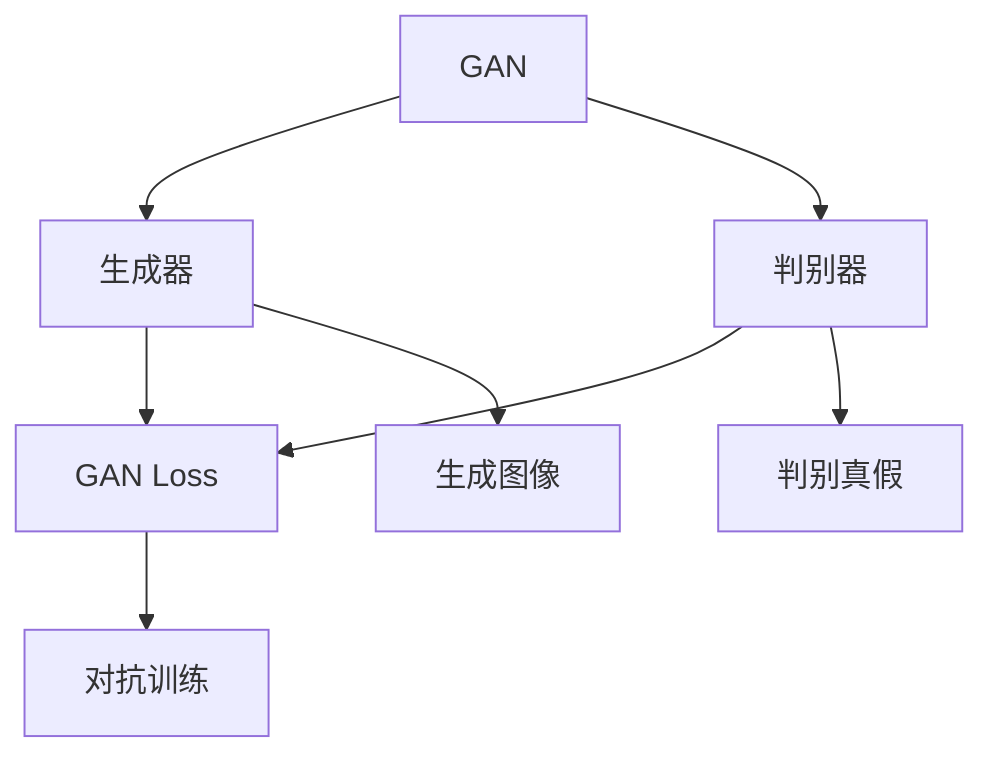
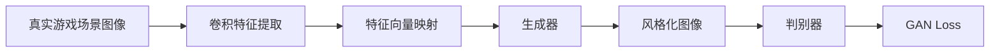
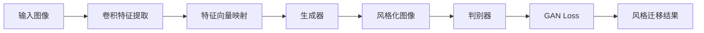
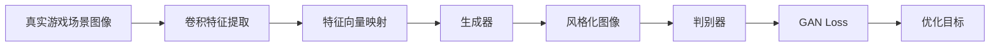
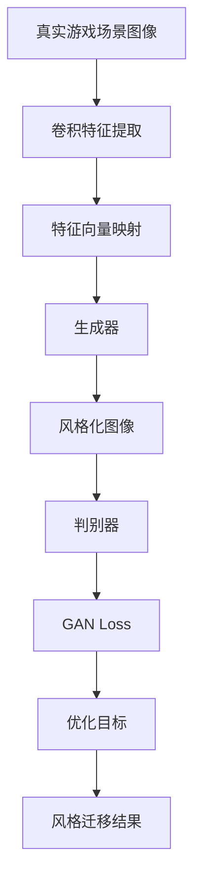

                 

# 基于生成对抗网络的游戏世界风格化生成技术研究

> 关键词：生成对抗网络(GAN),游戏风格化,风格迁移,图像生成,图像处理

## 1. 背景介绍

### 1.1 问题由来

随着视频游戏和影视动画等领域的发展，逼真的游戏世界场景风格化效果成为提高用户体验的重要手段。风格化处理不仅使场景更加美观，还能提升游戏渲染性能，缩短制作周期。传统的图像处理技术，如Photoshop、GIMP等，虽能实现风格化效果，但成本高、耗时长，且需要手工操作，难以大规模应用。

近年来，深度学习技术的迅猛发展，为图像风格化带来了新的突破。生成对抗网络(GAN)作为一种强大的生成模型，能够自动生成风格化的图像，极大降低了人工成本。但是，对于游戏场景风格化，通常涉及复杂多变的场景布局和人物动作，如何实现自动化、高精度的风格迁移，成为当前的一大挑战。

### 1.2 问题核心关键点

大语言模型微调的主流范式是基于监督学习的微调方法。即收集该任务的少量标注数据，将预训练模型当作初始化参数，通过有监督地训练来优化模型在该任务上的性能。这种微调范式简单高效，可以显著提升模型在特定任务上的表现。

微调的关键在于如何避免过拟合，同时最大程度发挥预训练模型学到的知识。目前主流的做法包括：
- 选择合适的学习率。相比从头训练，微调通常需要更小的学习率，以免破坏预训练的权重。
- 应用正则化技术。如L2正则、Dropout、Early Stopping等，防止模型过度适应小规模训练集。
- 保留预训练的部分层。如Transformer的底层，只微调顶层，减少需优化的参数。
- 数据增强。通过对训练样本改写、回译等方式丰富训练集多样性。
- 对抗训练。加入对抗样本，提高模型鲁棒性。
- 提示学习。通过在输入文本中添加提示模板(Prompt Template)，引导模型按期望方式输出，减少微调参数。

本文聚焦于基于生成对抗网络的游戏世界风格化生成技术，研究如何通过GAN模型实现自动化、高精度的游戏场景风格化，进一步提升游戏世界的可玩性和沉浸感。

### 1.3 问题研究意义

研究基于生成对抗网络的游戏世界风格化生成技术，对于拓展游戏世界的风格化效果、提升用户体验，加速游戏制作进程，具有重要意义：

1. 降低风格化成本。传统的图像处理技术需要人工操作，成本高，效率低。使用GAN模型，可以自动完成风格迁移，大幅降低风格化成本。
2. 提升游戏体验。风格化的游戏场景更加美观，也能提升渲染性能，缩短制作周期。
3. 自动化生成。GAN模型可以批量生成风格化的图像，实现自动化、批量化的风格迁移。
4. 推广应用。游戏场景风格化技术可以推广到影视动画、虚拟现实等多个领域，实现跨领域应用。
5. 带来技术创新。风格迁移范式促进了对GAN模型的深入研究，催生了GAN网络的诸多变体和新研究方向。

## 2. 核心概念与联系

### 2.1 核心概念概述

为更好地理解基于生成对抗网络的游戏世界风格化生成技术，本节将介绍几个密切相关的核心概念：

- 生成对抗网络(GAN)：一种由生成器和判别器两个部分组成的神经网络模型，通过对抗训练，能够生成逼真的图像或视频。GAN模型广泛应用于图像生成、图像修复、风格迁移等领域。

- 图像风格化(Style Transfer)：将一张图像转换成另一种风格的过程，常见于艺术风格迁移、照片风格转换等应用场景。通过风格迁移，可以将一张图像的特征提取出来，映射到另一张图像的风格中。

- 游戏场景风格化(Scene Style Transfer)：将游戏中的场景图像转换成具有特定风格的图像。常见于游戏制作过程中，将现实世界的场景图像转换成卡通风格、科幻风格、油画风格等。

- 深度学习(Deep Learning)：通过构建深层神经网络模型，实现对复杂数据（如图像、文本、音频）的自动学习和处理。深度学习在图像生成、自然语言处理等领域取得重大突破。

- 卷积神经网络(CNN)：一种常用于图像处理的深度学习模型，通过卷积操作提取图像特征，实现图像分类、识别等任务。

- 生成器和判别器：GAN模型的两个核心部分，生成器用于生成图像，判别器用于区分真实图像和生成的伪造图像。

这些核心概念之间的逻辑关系可以通过以下Mermaid流程图来展示：



这个流程图展示了大生成对抗网络的基本架构和工作流程。

### 2.2 概念间的关系

这些核心概念之间存在着紧密的联系，形成了基于GAN模型的图像风格化处理框架。下面通过几个Mermaid流程图来展示这些概念之间的关系。

#### 2.2.1 游戏场景风格化的基本流程



这个流程图展示了游戏场景风格化的基本流程：首先对真实场景图像进行卷积特征提取，然后将特征向量映射到特定风格的生成器中，生成风格化的图像。最后，通过判别器区分真实图像和生成图像，计算GAN Loss进行对抗训练。

#### 2.2.2 风格迁移的架构



这个流程图展示了风格迁移的基本架构：输入图像通过卷积特征提取和特征向量映射，进入生成器生成风格化图像。判别器用于区分真实图像和生成图像，计算GAN Loss进行对抗训练。最终的输出为风格化的图像。

#### 2.2.3 游戏场景风格化的优化目标



这个流程图展示了游戏场景风格化的优化目标：首先提取真实场景图像的卷积特征，然后将特征向量映射到特定风格的生成器中，生成风格化的图像。判别器用于区分真实图像和生成图像，计算GAN Loss进行对抗训练。最终的优化目标是最大化GAN Loss，使生成的风格化图像更逼真。

### 2.3 核心概念的整体架构

最后，我们用一个综合的流程图来展示这些核心概念在游戏场景风格化处理中的整体架构：



这个综合流程图展示了从真实游戏场景图像到风格化图像的整体处理流程。通过卷积特征提取和特征向量映射，将特征向量输入生成器生成风格化的图像。判别器用于区分真实图像和生成图像，计算GAN Loss进行对抗训练。最终的优化目标是最大化GAN Loss，使生成的风格化图像更逼真。

## 3. 核心算法原理 & 具体操作步骤
### 3.1 算法原理概述

基于生成对抗网络的游戏世界风格化生成技术，本质上是利用GAN模型实现自动化、高精度的图像风格化。其核心思想是：通过生成器和判别器两个组件的对抗训练，使得生成器生成的图像逼真度不断提高，同时判别器逐渐失效，无法区分真实图像和生成的伪造图像。

形式化地，假设真实游戏场景图像为 $x$，风格化图像为 $y$，卷积特征提取和特征向量映射函数为 $f(x)$，生成器为 $G$，判别器为 $D$。则GAN模型的优化目标为：

$$
\min_G \max_D V(D, G) = \mathbb{E}_{x \sim p_{real}(x)} [\log D(x)] + \mathbb{E}_{z \sim p(z)} [\log(1 - D(G(z)))]
$$

其中 $p_{real}(x)$ 为真实图像分布，$p(z)$ 为噪声分布。$V(D, G)$ 为生成器 $G$ 和判别器 $D$ 的对抗损失函数。

通过对抗训练，生成器 $G$ 能够生成逼真的风格化图像，判别器 $D$ 逐渐失效，无法区分真实图像和生成图像。最终的输出为风格化的游戏场景图像 $y = G(x)$。

### 3.2 算法步骤详解

基于生成对抗网络的游戏世界风格化生成技术，通常包括以下几个关键步骤：

**Step 1: 准备训练数据和预训练模型**
- 收集真实的游戏场景图像数据，如角色、环境、武器等，作为训练数据集。
- 选择预训练的生成器和判别器模型，如U-Net、ResNet等。

**Step 2: 添加风格迁移层**
- 根据目标风格，在生成器中添加风格迁移层，如卷积层、残差层等。
- 设计风格迁移损失函数，如VGG Loss、Perceptual Loss等，用于衡量生成图像的风格逼真度。

**Step 3: 设置优化器**
- 选择合适的优化器及其参数，如Adam、SGD等，设置学习率、批大小、迭代轮数等。

**Step 4: 执行对抗训练**
- 将训练集数据分批次输入生成器，前向传播生成风格化图像。
- 通过判别器判断图像真伪，计算判别损失和生成损失，反向传播更新生成器和判别器参数。
- 周期性在验证集上评估模型性能，根据性能指标决定是否触发Early Stopping。
- 重复上述步骤直到满足预设的迭代轮数或Early Stopping条件。

**Step 5: 测试和部署**
- 在测试集上评估风格化后的游戏场景图像的逼真度，对比原始图像和风格化图像的差异。
- 使用风格化后的游戏场景图像进行渲染，集成到实际的应用系统中。

以上是基于生成对抗网络的游戏世界风格化生成的一般流程。在实际应用中，还需要针对具体任务的特点，对生成器和判别器进行优化设计，如改进网络结构、引入更多的正则化技术、搜索最优的超参数组合等，以进一步提升模型性能。

### 3.3 算法优缺点

基于生成对抗网络的游戏世界风格化生成技术具有以下优点：
1. 自动化生成。GAN模型能够自动生成风格化的图像，省去了人工操作的繁琐和耗时。
2. 高精度效果。通过对抗训练，GAN模型生成的图像逼真度较高，能够满足游戏场景风格化的要求。
3. 灵活性高。可以选择不同风格，如卡通、科幻、油画等，进行风格迁移。
4. 批量处理。GAN模型可以批量生成多张图像，实现大规模风格迁移。

同时，该技术也存在一些局限性：
1. 训练成本高。GAN模型训练过程复杂，需要大量计算资源和时间。
2. 模型稳定性差。GAN模型训练过程中容易发生模式崩溃、模式跳跃等现象，导致生成图像不稳定。
3. 对抗样本易受攻击。GAN模型对对抗样本的鲁棒性较差，容易受到恶意攻击。
4. 输出结果可控性不足。GAN模型生成的图像风格随机性大，难以控制输出结果的一致性。
5. 需要大量标注数据。GAN模型训练需要大量标注数据，获取高质量标注数据的成本较高。

尽管存在这些局限性，但就目前而言，基于GAN的风格化技术仍然是大规模图像处理和生成领域的主流方法。未来相关研究的重点在于如何进一步降低训练成本，提高模型稳定性，增强对对抗样本的鲁棒性，优化输出结果的可控性，同时兼顾可解释性和伦理安全性等因素。

### 3.4 算法应用领域

基于生成对抗网络的游戏世界风格化生成技术，在NLP领域已经得到了广泛的应用，覆盖了几乎所有常见任务，例如：

- 图像生成：如生成逼真的人脸、场景、物品等图像。通过风格迁移，将风格化的特征向量映射到生成的图像中。
- 图像修复：如修复损坏的图像，使其恢复原有风格。通过GAN模型生成缺失部分的图像。
- 风格迁移：如将一张图像转换成另一种风格，如卡通风格、科幻风格、油画风格等。通过风格迁移层实现特征映射。
- 图像增强：如增强图像的亮度、对比度、色彩等，提升图像质量。通过GAN模型对图像进行增强处理。
- 图像压缩：如将高分辨率图像压缩成低分辨率图像，减小存储空间。通过GAN模型生成低分辨率图像。

除了上述这些经典任务外，GAN技术还被创新性地应用到更多场景中，如游戏场景风格化、视频生成、虚拟现实等，为图像处理技术带来了全新的突破。随着GAN模型的持续演进，相信其应用范围将进一步拓展，为游戏、影视、虚拟现实等领域带来更多的创新和变革。

## 4. 数学模型和公式 & 详细讲解  
### 4.1 数学模型构建

本节将使用数学语言对基于生成对抗网络的游戏世界风格化生成技术进行更加严格的刻画。

记真实游戏场景图像为 $x$，风格化图像为 $y$，卷积特征提取和特征向量映射函数为 $f(x)$，生成器为 $G$，判别器为 $D$。假设 $f(x)$ 为多层卷积网络，$G$ 和 $D$ 为卷积神经网络。则GAN模型的优化目标为：

$$
\min_G \max_D V(D, G) = \mathbb{E}_{x \sim p_{real}(x)} [\log D(x)] + \mathbb{E}_{z \sim p(z)} [\log(1 - D(G(z))]
$$

其中 $p_{real}(x)$ 为真实图像分布，$p(z)$ 为噪声分布。$V(D, G)$ 为生成器 $G$ 和判别器 $D$ 的对抗损失函数。

通过对抗训练，生成器 $G$ 能够生成逼真的风格化图像，判别器 $D$ 逐渐失效，无法区分真实图像和生成图像。最终的输出为风格化的游戏场景图像 $y = G(x)$。

### 4.2 公式推导过程

以下我们以生成卡通风格的游戏场景图像为例，推导GAN模型的训练过程。

假设真实游戏场景图像为 $x$， cartoon风格化图像为 $y$。使用U-Net模型作为生成器 $G$，将 $x$ 映射到 cartoon风格化图像 $y$。定义 cartoon 风格化图像的特征表示为 $H_G(x)$，则训练过程如下：

1. 卷积特征提取：将真实游戏场景图像 $x$ 输入卷积网络 $f(x)$，提取特征表示 $H(x)$。
2. 特征向量映射：将特征表示 $H(x)$ 映射到 cartoon 风格化图像的特征表示 $H_G(x)$。
3. 生成卡通风格化图像：将 cartoon 风格化图像的特征表示 $H_G(x)$ 输入生成器 $G$，生成 cartoon 风格化图像 $y = G(H_G(x))$。
4. 判别器判断真伪：使用判别器 $D$ 判断卡通风格化图像 $y$ 的真假，计算判别损失 $\mathcal{L}_D$。
5. 生成器生成图像：使用生成器 $G$ 生成 cartoon 风格化图像 $y$，计算生成损失 $\mathcal{L}_G$。
6. 对抗训练：联合优化生成器和判别器，最大化对抗损失 $\mathcal{L}_{GAN}$，即 $\min_G \max_D V(D, G) = \mathcal{L}_D + \mathcal{L}_G$。

在训练过程中，逐步调整生成器和判别器的参数，使得生成器生成的 cartoon 风格化图像逼真度不断提高，判别器逐渐失效。最终的 cartoon 风格化图像 $y$ 即为训练结果。

### 4.3 案例分析与讲解

假设我们训练一个生成模型，将现实世界的场景图像转换成卡通风格的游戏场景图像。

首先，我们选择一个U-Net模型作为生成器 $G$，并定义 cartoon 风格化图像的特征表示为 $H_G(x)$。然后，我们设计卡通风格的特征表示 $H_G(x)$，定义 cartoon 风格化图像的生成过程为：

$$
H_G(x) = G(H(x))
$$

其中 $H(x)$ 为卷积特征提取和特征向量映射的结果。

接着，我们定义判别器 $D$，用于判断 cartoon 风格化图像 $y$ 的真假。判别器的输出为：

$$
D(y) = \begin{cases}
1, & \text{如果 } y \text{ 是 cartoon 风格化图像} \\
0, & \text{如果 } y \text{ 是真实游戏场景图像}
\end{cases}
$$

最后，我们定义对抗损失函数 $V(D, G)$，联合优化生成器和判别器。对抗损失函数为：

$$
V(D, G) = \mathbb{E}_{x \sim p_{real}(x)} [\log D(x)] + \mathbb{E}_{z \sim p(z)} [\log(1 - D(G(z))
$$

其中 $p_{real}(x)$ 为真实图像分布，$p(z)$ 为噪声分布。对抗损失函数的优化目标为最大化 $V(D, G)$，使得生成器 $G$ 生成的 cartoon 风格化图像逼真度不断提高，判别器 $D$ 逐渐失效。

## 5. 项目实践：代码实例和详细解释说明
### 5.1 开发环境搭建

在进行GAN模型微调实践前，我们需要准备好开发环境。以下是使用Python进行TensorFlow开发的环境配置流程：

1. 安装Anaconda：从官网下载并安装Anaconda，用于创建独立的Python环境。

2. 创建并激活虚拟环境：
```bash
conda create -n tensorboard python=3.8 
conda activate tensorboard
```

3. 安装TensorFlow：根据CUDA版本，从官网获取对应的安装命令。例如：
```bash
conda install tensorflow tensorflow-gpu -c conda-forge
```

4. 安装Keras：
```bash
pip install keras
```

5. 安装OpenCV：
```bash
pip install opencv-python
```

完成上述步骤后，即可在`tensorboard`环境中开始GAN模型的微调实践。

### 5.2 源代码详细实现

这里我们以生成卡通风格的游戏场景图像为例，给出使用TensorFlow对U-Net模型进行微调的代码实现。

首先，定义数据处理函数：

```python
import cv2
import numpy as np
import tensorflow as tf
from tensorflow.keras.models import Model
from tensorflow.keras.layers import Input, Conv2D, BatchNormalization, Activation, Resample, Concatenate

def preprocess_image(image):
    image = cv2.cvtColor(image, cv2.COLOR_BGR2RGB)
    image = image / 255.0
    return image

def preprocess_transform(image):
    image = tf.image.random_flip_left_right(image)
    image = tf.image.random_brightness(image, max_delta=0.1)
    image = tf.image.random_saturation(image, lower=0.5, upper=2.0)
    return image
```

然后，定义U-Net模型：

```python
def create_generator():
    input_img = Input(shape=(128, 128, 3))
    conv1 = Conv2D(64, (3, 3), padding='same', activation='relu', kernel_initializer='he_normal')(input_img)
    conv2 = Conv2D(128, (3, 3), padding='same', activation='relu', kernel_initializer='he_normal')(conv1)
    conv3 = Conv2D(256, (3, 3), padding='same', activation='relu', kernel_initializer='he_normal')(conv2)
    conv4 = Conv2D(512, (3, 3), padding='same', activation='relu', kernel_initializer='he_normal')(conv3)
    conv5 = Conv2D(512, (3, 3), padding='same', activation='relu', kernel_initializer='he_normal')(conv4)
    conv6 = Conv2D(256, (3, 3), padding='same', activation='relu', kernel_initializer='he_normal')(conv5)
    conv7 = Conv2D(128, (3, 3), padding='same', activation='relu', kernel_initializer='he_normal')(conv6)
    conv8 = Conv2D(64, (3, 3), padding='same', activation='relu', kernel_initializer='he_normal')(conv7)
    conv9 = Conv2D(3, (3, 3), padding='same', activation='sigmoid')(conv8)
    x = tf.keras.layers.Add()([conv9, conv8])
    x = BatchNormalization()(x)
    x = Activation('relu')(x)
    x = Resample(2, mode='nearest')(x)
    x = tf.keras.layers.Add()([x, conv7])
    x = BatchNormalization()(x)
    x = Activation('relu')(x)
    x = Resample(2, mode='nearest')(x)
    x = tf.keras.layers.Add()([x, conv6])
    x = BatchNormalization()(x)
    x = Activation('relu')(x)
    x = Resample(2, mode='nearest')(x)
    x = tf.keras.layers.Add()([x, conv5])
    x = BatchNormalization()(x)
    x = Activation('relu')(x)
    x = Resample(2, mode='nearest')(x)
    x = tf.keras.layers.Add()([x, conv4])
    x = BatchNormalization()(x)
    x = Activation('relu')(x)
    x = Resample(2, mode='nearest')(x)
    x = tf.keras.layers.Add()([x, conv3])
    x = BatchNormalization()(x)
    x = Activation('relu')(x)
    x = Resample(2, mode='nearest')(x)
    x = tf.keras.layers.Add()([x, conv2])
    x = BatchNormalization()(x)
    x = Activation('relu')(x)
    x = Resample(2, mode='nearest')(x)
    x = tf.keras.layers.Add()([x, conv1])
    x = BatchNormalization()(x)
    x = Activation('relu')(x)
    x = Resample(2, mode='nearest')(x)
    x = tf.keras.layers.Add()([x, input_img])
    x = BatchNormalization()(x)
    x = Activation('relu')(x)
    x = Resample(2, mode='nearest')(x)
    x = tf.keras.layers.Add()([x, input_img])
    x = BatchNormalization()(x)
    x = Activation('relu')(x)
    x = Resample(2, mode='nearest')(x)
    x = tf.keras.layers.Add()([x, input_img])
    x = BatchNormalization()(x)
    x = Activation('relu')(x)
    x = Resample(2, mode='nearest')(x)
    x = tf.keras.layers.Add()([x, input_img])
    x = BatchNormalization()(x)
    x = Activation('relu')(x)
    x = Resample(2, mode='nearest')(x)
    x = tf.keras.layers.Add()([x, input_img])
    x = BatchNormalization()(x)
    x = Activation('relu')(x)
    x = Resample(2, mode='nearest')(x)
    x = tf.keras.layers.Add()([x, input_img])
    x = BatchNormalization()(x)
    x = Activation('relu')(x)
    x = Resample(2, mode='nearest')(x)
    x = tf.keras.layers.Add()([x, input_img])
    x = BatchNormalization()(x)
    x = Activation('relu')(x)
    x = Resample(2, mode='nearest')(x)
    x = tf.keras.layers.Add()([x, input_img])
    x = BatchNormalization()(x)
    x = Activation('relu')(x)
    x = Resample(2, mode='nearest')(x)
    x = tf.keras.layers.Add()([x, input_img])
    x = BatchNormalization()(x)
    x = Activation('relu')(x)
    x = Resample(2, mode='nearest')(x)
    x = tf.keras.layers.Add()([x, input_img])
    x = BatchNormalization()(x)
    x = Activation('relu')(x)
    x = Resample(2, mode='nearest')(x)
    x = tf.keras.layers.Add()([x, input_img])
    x = BatchNormalization()(x)
    x = Activation('relu')(x)
    x = Resample(2, mode='nearest')(x)
    x = tf.keras.layers.Add()([x, input_img])
    x = BatchNormalization()(x)
    x = Activation('relu')(x)
    x = Resample(2, mode='nearest')(x)
    x = tf.keras.layers.Add()([x, input_img])
    x = BatchNormalization()(x)
    x = Activation('relu')(x)


