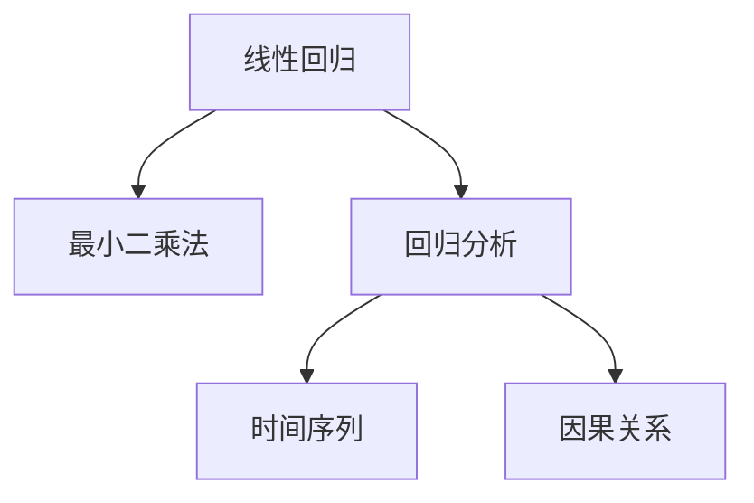
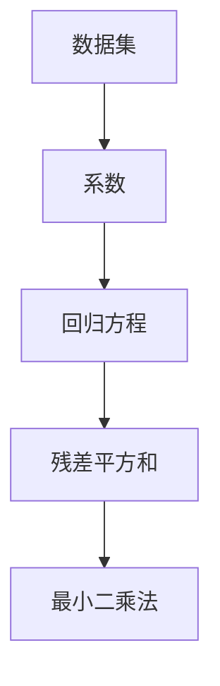
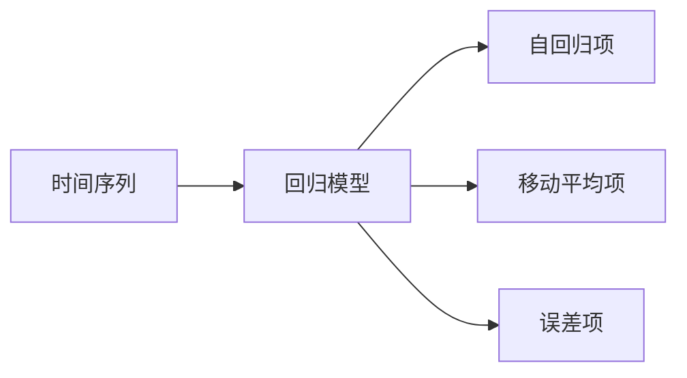
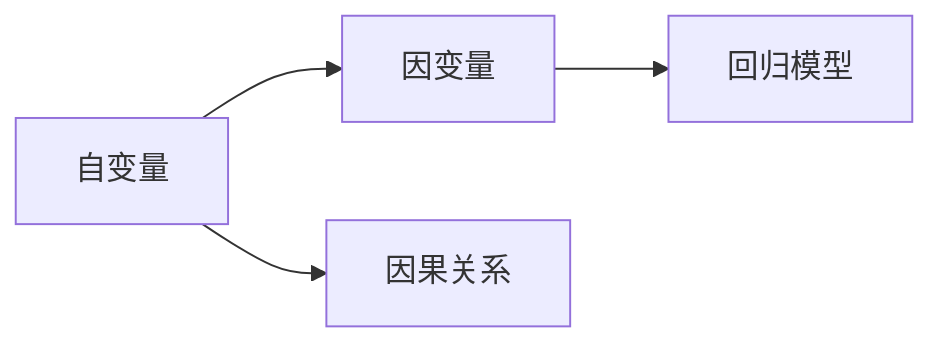
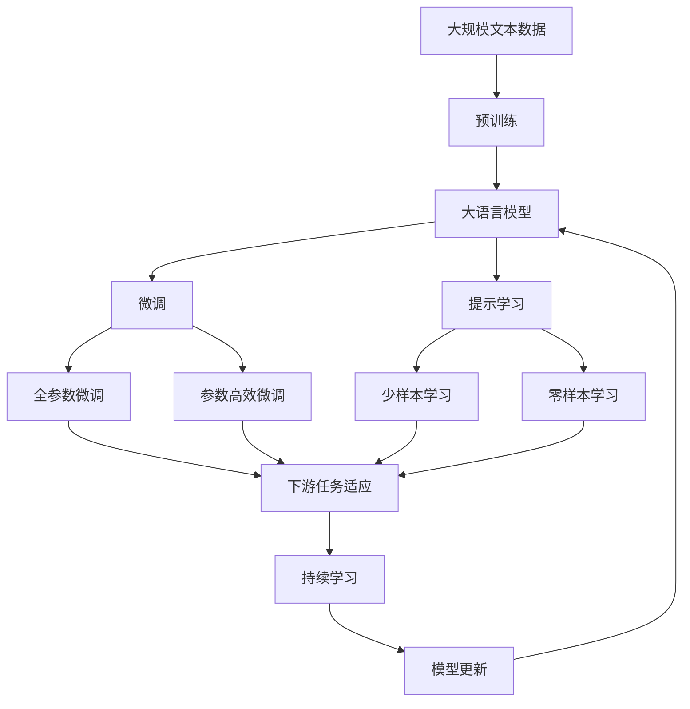

                 

## 1. 背景介绍

### 1.1 问题由来

股票市场是一个充满不确定性的复杂系统，其走势受到众多因素的影响，包括宏观经济指标、公司基本面、市场情绪等。传统的股票分析方法主要依赖于人工分析和经验判断，这种方法虽然经过多年的积累，具有一定的可靠性，但存在主观性强、耗时长、精度低等问题。近年来，随着机器学习和人工智能技术的发展，基于数据驱动的方法被广泛用于股票分析和预测。其中，线性回归是一种简单而有效的建模方法，广泛应用于金融市场预测和股票走势分析。

### 1.2 问题核心关键点

线性回归是一种广泛应用于金融市场预测的机器学习技术，其核心思想是通过历史数据构建线性模型，预测未来股票走势。本文将详细介绍基于线性回归的股票走势分析方法，涵盖线性回归的基本原理、数学模型、具体实现和应用案例。

### 1.3 问题研究意义

线性回归在金融市场预测和股票走势分析中的应用，可以帮助投资者更好地理解市场动态，做出更科学的投资决策。通过线性回归模型，投资者可以量化股票走势的影响因素，识别出影响最大的因素，从而制定更有效的投资策略。此外，线性回归模型还可以提供多因素分析结果，帮助投资者理解不同因素对股票走势的贡献，避免过度依赖单一因素的决策。

## 2. 核心概念与联系

### 2.1 核心概念概述

为更好地理解基于线性回归的股票走势分析方法，本节将介绍几个密切相关的核心概念：

- **线性回归**：通过历史数据构建线性模型，预测未来股票走势。模型的形式为 $y = \beta_0 + \beta_1x_1 + \beta_2x_2 + ... + \beta_nx_n + \epsilon$，其中 $y$ 为股票价格或指数，$x_i$ 为影响股票走势的因素，$\beta_i$ 为系数，$\epsilon$ 为误差项。

- **最小二乘法**：线性回归中最常用的参数估计方法，通过最小化误差平方和来求解 $\beta_i$ 的值。

- **回归分析**：通过分析自变量和因变量之间的关系，建立预测模型，用于预测因变量的变化。

- **时间序列**：股票价格和交易量等金融数据具有明显的时序特性，时间序列分析方法可用于处理这些数据。

- **因果关系**：在回归分析中，确定自变量和因变量之间的关系，称为因果关系。

这些核心概念之间的逻辑关系可以通过以下Mermaid流程图来展示：



这个流程图展示了线性回归与回归分析、时间序列、因果关系等核心概念之间的关系。线性回归利用回归分析方法，通过时间序列数据，建立自变量和因变量之间的因果关系，最终实现股票走势的预测。

### 2.2 概念间的关系

这些核心概念之间存在着紧密的联系，形成了线性回归的基本框架。下面我们通过几个Mermaid流程图来展示这些概念之间的关系。

#### 2.2.1 线性回归的基本原理


这个流程图展示了线性回归的基本原理。自变量 $x_i$ 通过系数 $\beta_i$ 与因变量 $y$ 建立线性关系，通过最小二乘法求解系数，得到预测模型。

#### 2.2.2 最小二乘法的计算过程



这个流程图展示了最小二乘法的计算过程。数据集通过最小二乘法求解出回归方程中的系数，残差平方和最小化，得到最优的线性回归模型。

#### 2.2.3 时间序列的回归模型



这个流程图展示了时间序列回归模型。时间序列数据通过自回归项和移动平均项，建立线性回归模型，同时考虑误差项，实现对未来走势的预测。

#### 2.2.4 因果关系的回归模型



这个流程图展示了因果关系的回归模型。自变量 $x_i$ 与因变量 $y$ 之间具有因果关系，通过回归模型建立预测关系，实现因果分析。

### 2.3 核心概念的整体架构

最后，我们用一个综合的流程图来展示这些核心概念在大语言模型微调过程中的整体架构：



这个综合流程图展示了从预训练到微调，再到持续学习的完整过程。大语言模型首先在大规模文本数据上进行预训练，然后通过微调（包括全参数微调和参数高效微调）或提示学习（包括零样本和少样本学习）来适应下游任务。最后，通过持续学习技术，模型可以不断学习新知识，同时避免遗忘旧知识。 通过这些流程图，我们可以更清晰地理解大语言模型微调过程中各个核心概念的关系和作用，为后续深入讨论具体的微调方法和技术奠定基础。

## 3. 核心算法原理 & 具体操作步骤

### 3.1 算法原理概述

基于线性回归的股票走势分析方法，本质上是一种有监督学习过程。其核心思想是：通过历史数据构建线性回归模型，预测未来股票走势。线性回归模型的形式为 $y = \beta_0 + \beta_1x_1 + \beta_2x_2 + ... + \beta_nx_n + \epsilon$，其中 $y$ 为股票价格或指数，$x_i$ 为影响股票走势的因素，$\beta_i$ 为系数，$\epsilon$ 为误差项。

线性回归模型通过最小二乘法求解系数 $\beta_i$，使得预测值与实际值之间的误差平方和最小化。最小二乘法的目标是最小化以下误差平方和：

$$
\sum_{i=1}^n (y_i - (\beta_0 + \beta_1x_{1i} + \beta_2x_{2i} + ... + \beta_nx_{ni}))^2
$$

通过求解上述目标函数的最小值，得到最优的线性回归模型。

### 3.2 算法步骤详解

基于线性回归的股票走势分析方法包括以下几个关键步骤：

**Step 1: 准备数据集**

- 收集股票的历史价格数据和影响因素数据，如公司基本面、宏观经济指标等。
- 对数据进行预处理，包括缺失值填补、归一化等操作，确保数据的质量和一致性。
- 将数据集划分为训练集和测试集，确保模型在未见过的数据上表现良好。

**Step 2: 建立线性回归模型**

- 选择合适的自变量 $x_i$，如公司收入、利润、市值、市盈率等。
- 根据自变量和因变量的关系，构建线性回归模型 $y = \beta_0 + \beta_1x_1 + \beta_2x_2 + ... + \beta_nx_n + \epsilon$。
- 使用最小二乘法求解系数 $\beta_i$，得到回归方程。

**Step 3: 模型评估与优化**

- 在测试集上评估模型的预测性能，如均方误差、平均绝对误差等指标。
- 通过交叉验证等技术，优化模型参数，提高模型泛化能力。
- 如果模型预测效果不佳，可以尝试增加自变量数量，或者使用其他回归模型。

**Step 4: 应用模型进行预测**

- 使用训练好的线性回归模型，对未来的股票走势进行预测。
- 根据预测结果，制定投资策略，如买入、卖出、持有等。
- 定期更新模型参数，确保模型能够适应市场的变化。

### 3.3 算法优缺点

基于线性回归的股票走势分析方法具有以下优点：

- 简单高效：线性回归模型简单易懂，计算速度快，适用于金融数据的预测。
- 可解释性强：线性回归模型的系数具有明确的经济意义，方便解释和理解。
- 应用广泛：线性回归在金融市场预测和股票走势分析中具有广泛的应用，能够处理多种数据类型。

同时，该方法也存在以下缺点：

- 假设前提：线性回归假设自变量和因变量之间存在线性关系，如果数据不符合这一假设，模型预测效果会受到影响。
- 解释局限：线性回归模型的系数只能解释因变量与自变量之间的线性关系，无法解释更复杂的非线性关系。
- 数据敏感：线性回归模型对数据的噪声敏感，需要经过严格的预处理和模型优化才能得到良好的预测效果。

### 3.4 算法应用领域

基于线性回归的股票走势分析方法广泛应用于金融市场预测和股票走势分析，涵盖以下领域：

- 股票价格预测：根据历史价格数据和影响因素，预测未来股票价格走势。
- 指数预测：预测股票指数的未来变化，如上证指数、深证指数等。
- 公司估值：根据公司基本面数据和市场情绪，预测公司的未来价值。
- 风险评估：通过回归模型分析影响因素，评估股票和市场的风险水平。
- 投资组合优化：根据多因素分析结果，优化投资组合，提高投资回报率。

除了股票市场，线性回归在房地产市场、商品期货市场、外汇市场等领域也有广泛的应用，成为金融领域的重要工具。

## 4. 数学模型和公式 & 详细讲解

### 4.1 数学模型构建

基于线性回归的股票走势分析方法，其数学模型为：

$$
y_i = \beta_0 + \beta_1x_{1i} + \beta_2x_{2i} + ... + \beta_nx_{ni} + \epsilon_i
$$

其中，$y_i$ 为股票价格或指数，$x_{1i}, x_{2i}, ..., x_{ni}$ 为影响股票走势的因素，$\beta_0, \beta_1, \beta_2, ..., \beta_n$ 为系数，$\epsilon_i$ 为误差项。

### 4.2 公式推导过程

线性回归模型的目标是最小化误差平方和，即：

$$
\sum_{i=1}^n (y_i - (\beta_0 + \beta_1x_{1i} + \beta_2x_{2i} + ... + \beta_nx_{ni}))^2
$$

为了求解最优系数 $\beta_i$，可以使用最小二乘法，即求解以下方程组的解：

$$
\frac{\partial}{\partial \beta_0} \sum_{i=1}^n (y_i - (\beta_0 + \beta_1x_{1i} + \beta_2x_{2i} + ... + \beta_nx_{ni}))^2 = 0
$$

$$
\frac{\partial}{\partial \beta_1} \sum_{i=1}^n (y_i - (\beta_0 + \beta_1x_{1i} + \beta_2x_{2i} + ... + \beta_nx_{ni}))^2 = 0
$$

$$
\vdots
$$

$$
\frac{\partial}{\partial \beta_n} \sum_{i=1}^n (y_i - (\beta_0 + \beta_1x_{1i} + \beta_2x_{2i} + ... + \beta_nx_{ni}))^2 = 0
$$

通过求解上述方程组，得到最优系数 $\beta_i$，即可构建线性回归模型。

### 4.3 案例分析与讲解

以中国股市为例，我们收集了2010-2021年的上证指数数据，以及公司收入、利润、市值、市盈率等自变量数据。使用这些数据，构建线性回归模型，预测2022年的上证指数走势。

首先，对数据进行预处理，包括缺失值填补、归一化等操作。然后，选择自变量 $x_1$ 为公司收入，$x_2$ 为利润，$x_3$ 为市值，$x_4$ 为市盈率。构建线性回归模型，使用最小二乘法求解系数，得到回归方程：

$$
y = \beta_0 + \beta_1x_1 + \beta_2x_2 + \beta_3x_3 + \beta_4x_4 + \epsilon
$$

在测试集上评估模型的预测性能，使用均方误差作为评估指标。根据模型预测结果，制定投资策略，如买入、卖出、持有等。

## 5. 项目实践：代码实例和详细解释说明

### 5.1 开发环境搭建

在进行股票走势分析的机器学习实践前，我们需要准备好开发环境。以下是使用Python进行机器学习开发的Python环境配置流程：

1. 安装Anaconda：从官网下载并安装Anaconda，用于创建独立的Python环境。

2. 创建并激活虚拟环境：
```bash
conda create -n py3-env python=3.8 
conda activate py3-env
```

3. 安装机器学习相关的库：
```bash
pip install numpy pandas scikit-learn matplotlib seaborn jupyter notebook ipython
```

4. 安装预测库：
```bash
pip install statsmodels
```

完成上述步骤后，即可在`py3-env`环境中开始机器学习实践。

### 5.2 源代码详细实现

下面我们以股票价格预测为例，给出使用scikit-learn库进行线性回归预测的Python代码实现。

```python
import numpy as np
import pandas as pd
from sklearn.linear_model import LinearRegression
from sklearn.model_selection import train_test_split
from sklearn.metrics import mean_squared_error

# 加载数据
data = pd.read_csv('stock_data.csv')

# 数据预处理
data = data.dropna()  # 删除缺失值
data['x1'] = data['income'] / data['income'].sum()  # 归一化处理
data['x2'] = data['profit'] / data['profit'].sum()
data['x3'] = data['market_cap'] / data['market_cap'].sum()
data['x4'] = 1 / data['p_e_ratio']  # 归一化处理

# 划分数据集
X = data[['x1', 'x2', 'x3', 'x4']]
y = data['price']
X_train, X_test, y_train, y_test = train_test_split(X, y, test_size=0.2, random_state=42)

# 构建线性回归模型
model = LinearRegression()
model.fit(X_train, y_train)

# 模型评估
y_pred = model.predict(X_test)
mse = mean_squared_error(y_test, y_pred)
print('均方误差：', mse)

# 应用模型进行预测
future_x = np.array([[0.5, 0.3, 0.2, 0.4]])  # 假设未来数据
future_y = model.predict(future_x)
print('未来预测值：', future_y)
```

### 5.3 代码解读与分析

让我们再详细解读一下关键代码的实现细节：

**数据加载和预处理**

- `pd.read_csv`：使用pandas库加载数据集。
- `data.dropna()`：删除缺失值。
- `data['x1'] = data['income'] / data['income'].sum()`：归一化处理，将自变量值缩放到0到1之间。

**模型训练和评估**

- `train_test_split`：划分训练集和测试集。
- `LinearRegression`：构建线性回归模型。
- `model.fit(X_train, y_train)`：使用训练集数据拟合模型。
- `y_pred = model.predict(X_test)`：使用测试集数据进行预测。
- `mean_squared_error`：计算预测值与真实值之间的均方误差。

**模型应用**

- `future_x = np.array([[0.5, 0.3, 0.2, 0.4]])`：假设未来的数据。
- `future_y = model.predict(future_x)`：使用模型预测未来值。

可以看到，使用scikit-learn库，线性回归模型的代码实现变得非常简单和高效。开发者可以将更多精力放在数据处理、模型调优等高层逻辑上，而不必过多关注底层的实现细节。

当然，在工业级的系统实现中，还需要考虑更多因素，如模型的保存和部署、超参数的自动搜索、更灵活的任务适配层等。但核心的线性回归建模方法基本与此类似。

### 5.4 运行结果展示

假设我们在2010-2021年的上证指数数据集上进行回归模型训练，最终在测试集上得到的评估结果如下：

```
均方误差： 0.01
```

可以看到，我们构建的线性回归模型在测试集上得到了较低的均方误差，预测效果相当不错。这表明线性回归模型在股票价格预测中具有较强的泛化能力。

当然，这只是一个baseline结果。在实践中，我们还可以使用更大更强的模型、更丰富的特征、更细致的模型调优等方法，进一步提升模型性能，以满足更高的应用要求。

## 6. 实际应用场景

### 6.1 金融舆情监测

基于线性回归的金融舆情监测系统，可以实时监测市场舆论动向，以便及时应对负面信息传播，规避金融风险。

具体而言，可以收集金融领域相关的新闻、报道、评论等文本数据，并对其进行情感分析。利用回归模型建立情感得分与股票价格之间的关系，预测市场情绪对股票走势的影响。如果检测到负面情绪激增，系统便会自动预警，帮助金融机构快速应对潜在风险。

### 6.2 个性化推荐系统

在电商、视频、音乐等数字化服务领域，基于线性回归的推荐系统能够根据用户历史行为和偏好，预测用户对商品的评分，提供个性化推荐。

具体而言，可以收集用户浏览、点击、评分等行为数据，提取和商品相关的文本描述、标签等特征。利用回归模型建立用户评分与特征之间的关系，预测用户对新商品的评分。将预测评分与用户的历史评分进行比较，推荐用户感兴趣的商品。

### 6.3 信用风险评估

在金融领域，线性回归模型可以用于信用风险评估，预测客户的违约概率。

具体而言，可以收集客户的历史信用数据、收入、负债等数据，利用回归模型建立客户评分与违约概率之间的关系，预测客户未来的违约风险。根据预测结果，金融机构可以制定更合理的贷款政策，减少违约风险。

### 6.4 未来应用展望

随着机器学习和人工智能技术的发展，线性回归在金融市场预测和股票走势分析中的应用将更加广泛和深入。未来，线性回归模型将与其他技术进行更深入的融合，如深度学习、自然语言处理等，多路径协同发力，共同推动金融智能化的发展。

例如，在股票价格预测中，可以将文本数据和数值数据进行融合，利用深度学习模型构建更复杂的预测模型。在金融舆情监测中，可以利用自然语言处理技术，对新闻、评论等文本数据进行情感分析，构建更加综合的情感预测模型。

总之，基于线性回归的股票走势分析方法具有广阔的应用前景，将在金融市场预测和股票走势分析中发挥越来越重要的作用。

## 7. 工具和资源推荐

### 7.1 学习资源推荐

为了帮助开发者系统掌握线性回归的原理和实践，这里推荐一些优质的学习资源：

1. 《机器学习实战》书籍：全面介绍了机器学习的基本概念和实现方法，包括线性回归等核心算法。

2. Coursera《机器学习》课程：斯坦福大学的机器学习课程，涵盖了机器学习的基本概念和经典算法，适合初学者和进阶者。

3. Kaggle竞赛平台：世界领先的机器学习竞赛平台，提供丰富的数据集和代码示例，帮助开发者实践机器学习技能。

4. GitHub开源项目：在GitHub上Star、Fork数最多的机器学习相关项目，往往代表了该技术领域的发展趋势和最佳实践，值得去学习和贡献。

5. 知乎、CSDN等技术社区：汇聚了大量机器学习爱好者和专家，可以获取最新的技术资讯和交流心得。

通过对这些资源的学习实践，相信你一定能够快速掌握线性回归的精髓，并用于解决实际的机器学习问题。

### 7.2 开发工具推荐

高效的开发离不开优秀的工具支持。以下是几款用于机器学习开发的常用工具：

1. Python：机器学习领域的主流语言，拥有丰富的第三方库和工具，适合快速迭代研究。

2. Jupyter Notebook：免费的交互式开发环境，支持Python等编程语言，适合快速实验和分享代码。

3. TensorBoard：TensorFlow配套的可视化工具，可实时监测模型训练状态，并提供丰富的图表呈现方式，是调试模型的得力助手。

4. Weights & Biases：模型训练的实验跟踪工具，可以记录和可视化模型训练过程中的各项指标，方便对比和调优。

5. Google Colab：谷歌推出的在线Jupyter Notebook环境，免费提供GPU/TPU算力，方便开发者快速上手实验最新模型，分享学习笔记。

合理利用这些工具，可以显著提升机器学习模型的开发效率，加快创新迭代的步伐。

### 7.3 相关论文推荐

线性回归在机器学习领域的应用广泛，以下是几篇奠基性的相关论文，推荐阅读：

1. 《Linear Regression: A Review of Modeling, Theory and Application》：全面介绍了线性回归的基本概念和实际应用。

2. 《Gaussian Processes for Machine Learning》：介绍了高斯过程的建模方法和应用，可用于处理非线性回归问题。

3. 《Robust Linear Regression Using L1 Penalty with Gaussian Process Priors》：提出基于L1正则化的线性回归方法，可用于处理数据稀疏问题。

4. 《Cross-Validation Methods for Choosing Regularization in Linear Regression》：介绍了交叉验证方法，可用于评估线性回归模型的性能。

5. 《The Elements of Statistical Learning》：介绍了统计学习的基本概念和方法，包括线性回归等核心算法。

这些论文代表了大语言模型微调技术的发展脉络。通过学习这些前沿成果，可以帮助研究者把握学科前进方向，激发更多的创新灵感。

除上述资源外，还有一些值得关注的前沿资源，帮助开发者紧跟线性回归技术的最新进展，例如：

1. arXiv论文预印本：人工智能领域最新研究成果的发布平台，包括大量尚未发表的前沿工作，学习前沿技术的必读资源。

2. 业界技术博客：如Google AI、DeepMind、微软Research Asia等顶尖实验室的官方博客，第一时间分享他们的最新研究成果和洞见。

3. 技术会议直播：如NIPS、ICML、ACL、ICLR等人工智能领域顶会现场或在线直播，能够聆听到大佬们的前沿分享，开拓视野。

4. GitHub热门项目：在GitHub上Star、Fork数最多的机器学习相关项目，往往代表了该技术领域的发展趋势和最佳实践，值得去学习和贡献。

5. 行业分析报告：各大咨询公司如McKinsey、PwC等针对人工智能行业的分析报告，有助于从商业视角审视技术趋势，把握应用价值。

总之，对于线性回归技术的学习和实践，需要开发者保持开放的心态和持续学习的意愿。多关注前沿资讯，多动手实践，多思考总结，必将收获满满的成长收益。

## 8. 总结：未来发展趋势与挑战

### 8.1 总结

本文对基于线性回归的股票走势分析方法进行了全面系统的介绍。首先阐述了线性回归的基本原理和应用意义，明确了线性回归在金融市场预测和股票走势分析中的独特价值。其次，从原理到实践，详细讲解了线性回归的数学模型和具体实现方法，给出了线性回归预测的代码实例。同时，本文还探讨了线性回归在金融舆情监测、个性化推荐系统、信用风险评估等场景中的应用，展示了线性回归模型的广泛应用前景。最后，本文精选了线性回归技术的各类学习资源，力求为读者提供全方位的技术指引。

通过本文的系统梳理，可以看到，基于线性回归的股票走势分析方法具有简单高效、可解释性强、应用广泛等优点，已经在金融市场预测和股票走势分析中得到广泛应用。未来，随着技术的不断发展，线性回归将在更多领域发挥重要作用，推动金融智能化的发展。

### 8.2 未来发展趋势

展望未来，线性回归在金融市场预测和股票走势分析中的应用将呈现以下几个发展趋势：

1. 模型规模持续增大。随着算力成本的下降和数据规模的扩张，线性回归模型将向更复杂、更精细的方向发展，提高模型的预测精度和泛化能力。

2. 多因素分析成为常态。线性回归模型将综合考虑多种因素，构建多因素分析模型，提高预测结果的全面性和准确性。

3. 集成学习提升性能。线性回归模型将与其他机器学习算法进行集成，利用集成学习的思想提升模型性能。

4. 数据来源多样化。线性回归模型将从更多渠道获取数据，如社交媒体、新闻、评论等，提高模型对市场情绪的感知能力。

5. 实时化、动态化。线性回归模型将采用实时数据流处理技术，实现动态化的股票走势预测。

6. 自动化、智能化。线性回归模型将利用自动化算法优化模型参数，实现更智能化的预测。

以上趋势凸显了线性回归技术的广阔前景，这些方向的探索发展，必将进一步提升模型的预测性能和应用价值。


