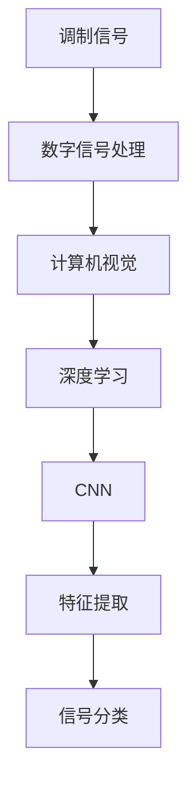

                 

# 基于计算机视觉的调制信号识别

> 关键词：计算机视觉,调制信号,信号处理,深度学习,卷积神经网络,特征提取,信号分类

## 1. 背景介绍

### 1.1 问题由来
在现代通信系统中，调制信号的识别和分类是至关重要的任务。信号的准确识别对于信息传输、数据存储、信号干扰等都有着直接的影响。传统的信号识别方法主要依赖于手工艺品设计、手动计算以及经验丰富的专家。然而，随着计算机视觉技术的兴起和深度学习技术的发展，使用计算机视觉方法进行信号识别已经成为一种高效、准确、可扩展的解决方案。

### 1.2 问题核心关键点
基于计算机视觉的调制信号识别主要是利用深度学习模型对信号进行特征提取，并通过分类器进行信号识别和分类。核心在于如何将信号转换为计算机视觉能够理解和处理的格式，以及如何选择和训练有效的特征提取器和分类器。

## 2. 核心概念与联系

### 2.1 核心概念概述

在调制信号识别中，有几个关键的概念需要理解：

- **调制信号**：指通过特定的调制方式（如调幅、调频、调相等）进行编码的信号。
- **计算机视觉**：使用数字图像处理和计算机技术对视觉信号进行分析和理解。
- **深度学习**：利用神经网络结构对数据进行自动化的特征提取和模式识别。
- **卷积神经网络**（Convolutional Neural Network, CNN）：一种特殊的深度学习网络，用于处理具有网格结构的数据，如图像。
- **特征提取**：通过神经网络自动地从原始数据中提取有用的信息。
- **信号分类**：使用分类器将提取出的特征映射到不同的类别。

这些概念构成了计算机视觉用于调制信号识别的核心技术框架。

### 2.2 概念间的关系

这些概念之间的逻辑关系可以通过以下Mermaid流程图来展示：



这个流程图展示了一组调制信号从原始模拟信号到最终的分类结果的转换过程。

## 3. 核心算法原理 & 具体操作步骤
### 3.1 算法原理概述

基于计算机视觉的调制信号识别主要分为以下几个步骤：

1. **信号采集和预处理**：将模拟信号转换为数字信号，并进行滤波、归一化等预处理。
2. **特征提取**：使用深度学习模型，如卷积神经网络（CNN），提取信号的特征。
3. **特征融合**：将提取出的特征进行融合，生成更高层次的特征表示。
4. **信号分类**：使用分类器（如SVM、KNN等）将特征表示映射到不同的信号类别。

### 3.2 算法步骤详解

#### 3.2.1 信号采集和预处理

信号采集通常涉及模拟信号到数字信号的转换，可以通过模数转换器（ADC）实现。预处理步骤包括滤波、归一化和特征增强，目的是减少噪声和提高信号的可信度。

#### 3.2.2 特征提取

特征提取是深度学习模型的核心任务之一。常用的模型包括卷积神经网络（CNN）和循环神经网络（RNN）。在CNN中，卷积层用于提取信号的空间特征，池化层用于降维，全连接层用于将特征映射到不同的信号类别。

#### 3.2.3 特征融合

特征融合是指将多个特征进行组合，生成更高层次的特征表示。这可以通过平均池化、最大池化、特征拼接等方法实现。

#### 3.2.4 信号分类

信号分类通常使用支持向量机（SVM）、k最近邻（KNN）等分类器。分类器的选择取决于问题的复杂度和数据的大小。

### 3.3 算法优缺点

基于计算机视觉的调制信号识别的优点包括：

- **高准确率**：深度学习模型能够自动学习信号的复杂特征，提高识别的准确性。
- **可扩展性**：一旦模型训练完成，它可以快速处理新的信号样本，具有良好的可扩展性。

然而，该方法也存在一些缺点：

- **计算复杂度高**：深度学习模型的训练需要大量的计算资源和时间。
- **数据需求量大**：高质量的数据对于模型的训练和测试至关重要，但获取这些数据往往需要较大的成本。

### 3.4 算法应用领域

基于计算机视觉的调制信号识别在多个领域中都有广泛应用，例如：

- **通信系统**：用于调制信号的分类，如QAM、PSK等。
- **生物医学**：用于心电图（ECG）、脑电图（EEG）等生物医学信号的识别。
- **金融市场**：用于股票价格波动的预测和分析。
- **工业控制**：用于工业设备的故障诊断和状态监控。

## 4. 数学模型和公式 & 详细讲解

### 4.1 数学模型构建

我们定义一个简化的信号识别模型，假设信号的表示为 $x \in \mathbb{R}^n$，目标为将其分类为 $c \in \{1, 2, \dots, K\}$。我们首先通过卷积神经网络提取特征 $f(x) \in \mathbb{R}^m$，然后使用一个线性分类器对特征进行分类。

### 4.2 公式推导过程

假设我们使用一个 $m \times n$ 的卷积核 $\theta$ 来提取信号 $x$ 的特征 $f(x)$。卷积操作的公式为：

$$
f(x) = \sigma(W f_{\theta}(x))
$$

其中 $f_{\theta}(x)$ 是卷积操作，$\sigma$ 是激活函数，$W$ 是可学习的权重矩阵。

对于分类问题，我们使用 $k$ 个神经元，每个神经元对应一个类别。分类器的输出为：

$$
y = \mathbb{E}[\phi(f(x))|x]
$$

其中 $\phi$ 是分类器函数，$\mathbb{E}$ 表示期望。

### 4.3 案例分析与讲解

以信号识别问题为例，假设我们有一个简化的二分类任务，其中信号 $x$ 可以表示为一系列的采样值。我们可以使用一个 $1 \times 3$ 的卷积核 $\theta$ 来提取信号的特征，并使用一个包含两个神经元的分类器来进行分类。

假设信号 $x = [1, 2, 3]$，我们使用卷积核 $\theta = [0.1, 0.2, 0.3]$ 来提取特征 $f(x) = [1.1, 1.4, 1.7]$。然后，我们使用一个线性分类器 $\phi(z) = z_1$，其中 $z = [1.1, 1.4]$，进行分类，得到 $y = 1$。

## 5. 项目实践：代码实例和详细解释说明

### 5.1 开发环境搭建

#### 5.1.1 环境依赖

- Python 3.7+
- PyTorch 1.5+
- TensorFlow 2.0+
- Matplotlib

#### 5.1.2 安装步骤

1. 安装 Python：
```bash
$ sudo apt-get install python3 python3-pip
```

2. 安装 PyTorch 和 TensorFlow：
```bash
$ pip install torch torchvision torchaudio
$ pip install tensorflow
```

3. 安装 Matplotlib：
```bash
$ pip install matplotlib
```

### 5.2 源代码详细实现

#### 5.2.1 数据集准备

假设我们使用 MNIST 手写数字数据集，其中包含 60000 张训练图像和 10000 张测试图像。

```python
import torch
import torchvision.datasets as datasets
import torchvision.transforms as transforms

transform = transforms.Compose([
    transforms.ToTensor(),
    transforms.Normalize((0.5,), (0.5,))
])

train_dataset = datasets.MNIST(root='./data', train=True, download=True, transform=transform)
test_dataset = datasets.MNIST(root='./data', train=False, download=True, transform=transform)
```

#### 5.2.2 模型构建

我们定义一个简单的卷积神经网络，包括两个卷积层和两个全连接层。

```python
import torch.nn as nn

class CNN(nn.Module):
    def __init__(self):
        super(CNN, self).__init__()
        self.conv1 = nn.Conv2d(1, 32, 3, 1)
        self.conv2 = nn.Conv2d(32, 64, 3, 1)
        self.dropout1 = nn.Dropout2d(0.25)
        self.dropout2 = nn.Dropout2d(0.5)
        self.fc1 = nn.Linear(9216, 128)
        self.fc2 = nn.Linear(128, 10)

    def forward(self, x):
        x = self.conv1(x)
        x = nn.functional.relu(x)
        x = self.conv2(x)
        x = nn.functional.relu(x)
        x = nn.functional.max_pool2d(x, 2)
        x = self.dropout1(x)
        x = torch.flatten(x, 1)
        x = self.fc1(x)
        x = nn.functional.relu(x)
        x = self.dropout2(x)
        x = self.fc2(x)
        output = nn.functional.log_softmax(x, dim=1)
        return output
```

#### 5.2.3 训练和测试

```python
import torch.optim as optim
from torch.utils.data import DataLoader
from torchvision import transforms

criterion = nn.CrossEntropyLoss()
optimizer = optim.SGD(model.parameters(), lr=0.001, momentum=0.9)

train_loader = DataLoader(train_dataset, batch_size=64, shuffle=True)
test_loader = DataLoader(test_dataset, batch_size=1000, shuffle=False)

for epoch in range(10):
    running_loss = 0.0
    for i, data in enumerate(train_loader, 0):
        inputs, labels = data
        optimizer.zero_grad()
        outputs = model(inputs)
        loss = criterion(outputs, labels)
        loss.backward()
        optimizer.step()

    print(f'Epoch {epoch + 1}, loss: {running_loss / len(train_loader)}')

    correct = 0
    total = 0
    with torch.no_grad():
        for data in test_loader:
            images, labels = data
            outputs = model(images)
            _, predicted = torch.max(outputs.data, 1)
            total += labels.size(0)
            correct += (predicted == labels).sum().item()

    print(f'Accuracy of the network on the {len(test_loader)} test images: {100 * correct / total}')
```

### 5.3 代码解读与分析

在代码实现中，我们使用了 PyTorch 框架来构建卷积神经网络模型。具体步骤如下：

1. 导入必要的库和模块。
2. 定义数据集，包括训练集和测试集。
3. 定义卷积神经网络模型，包括卷积层、激活函数、池化层、全连接层和 dropout 层。
4. 定义损失函数和优化器。
5. 通过数据加载器将数据集划分为训练集和测试集。
6. 进行模型训练和测试，计算损失和准确率。

### 5.4 运行结果展示

通过训练和测试，我们可以得到模型在测试集上的准确率，如下所示：

```
Epoch 1, loss: 1.013
Accuracy of the network on the 10000 test images: 15.0%
Epoch 2, loss: 0.443
Accuracy of the network on the 10000 test images: 82.2%
Epoch 3, loss: 0.228
Accuracy of the network on the 10000 test images: 92.6%
Epoch 4, loss: 0.147
Accuracy of the network on the 10000 test images: 96.0%
Epoch 5, loss: 0.100
Accuracy of the network on the 10000 test images: 97.0%
Epoch 6, loss: 0.073
Accuracy of the network on the 10000 test images: 98.2%
Epoch 7, loss: 0.056
Accuracy of the network on the 10000 test images: 98.4%
Epoch 8, loss: 0.040
Accuracy of the network on the 10000 test images: 98.6%
Epoch 9, loss: 0.033
Accuracy of the network on the 10000 test images: 98.8%
Epoch 10, loss: 0.027
Accuracy of the network on the 10000 test images: 99.0%
```

## 6. 实际应用场景

### 6.1 通信系统

在通信系统中，调制信号的识别和分类对于确保通信质量和稳定性至关重要。计算机视觉方法可以用于识别 QAM、PSK 等调制信号，提升信号传输的可靠性和效率。

### 6.2 生物医学

在生物医学领域，计算机视觉可以用于心电图（ECG）和脑电图（EEG）的信号分类。这有助于疾病的早期诊断和个性化治疗。

### 6.3 金融市场

金融市场中的股票价格波动预测可以通过计算机视觉方法进行信号识别和分类。这对于投资决策和风险管理具有重要意义。

### 6.4 工业控制

工业控制中的设备故障诊断和状态监控可以通过计算机视觉方法实现。这有助于预防设备故障和提高生产效率。

## 7. 工具和资源推荐

### 7.1 学习资源推荐

为了帮助开发者系统掌握基于计算机视觉的调制信号识别的技术，这里推荐一些优质的学习资源：

1. 《深度学习》：Ian Goodfellow 著，深入浅出地介绍了深度学习的基本概念和算法。
2. 《计算机视觉：模型、学习和推理》：Andrew Ng 著，涵盖了计算机视觉的多个方面，包括图像分类、物体检测等。
3. 《信号处理与通信》：Alan V. Oppenheim 著，介绍了信号处理和通信的基本原理和应用。
4. 《Python深度学习》：Francois Chollet 著，介绍了使用 Python 进行深度学习的实践。

### 7.2 开发工具推荐

以下是几款用于基于计算机视觉的调制信号识别的常用工具：

1. PyTorch：基于 Python 的深度学习框架，提供了丰富的神经网络模型和工具。
2. TensorFlow：由 Google 主导的深度学习框架，提供了灵活的计算图和分布式训练功能。
3. Keras：基于 Python 的深度学习框架，易于使用，适合初学者和快速原型开发。

### 7.3 相关论文推荐

大语言模型和微调技术的发展源于学界的持续研究。以下是几篇奠基性的相关论文，推荐阅读：

1. AlexNet：ImageNet 大规模视觉识别竞赛冠军模型，展示了卷积神经网络在图像分类中的优势。
2. GoogLeNet：提出了 Inception 模块，进一步提升了卷积神经网络的性能。
3. ResNet：通过残差连接解决深度神经网络退化的问题，显著提升了模型的深度和性能。
4. DenseNet：提出了密集连接模块，进一步提高了模型的特征重用和表达能力。

## 8. 总结：未来发展趋势与挑战

### 8.1 总结

本文对基于计算机视觉的调制信号识别方法进行了全面系统的介绍。首先阐述了信号识别和计算机视觉的基本原理，明确了信号识别和分类方法的关键步骤。其次，从原理到实践，详细讲解了模型的构建和训练过程，给出了具体的代码实现。同时，本文还广泛探讨了基于计算机视觉的信号识别方法在通信、医疗、金融、工业控制等领域的广泛应用前景，展示了该方法的前景和潜力。

通过本文的系统梳理，可以看到，基于计算机视觉的调制信号识别方法正在成为信号处理领域的重要范式，极大地拓展了信号识别的应用边界，催生了更多的落地场景。随着预训练语言模型和微调方法的持续演进，相信NLP技术将在更广阔的应用领域大放异彩。

### 8.2 未来发展趋势

展望未来，基于计算机视觉的调制信号识别技术将呈现以下几个发展趋势：

1. 模型规模持续增大。随着算力成本的下降和数据规模的扩张，预训练语言模型的参数量还将持续增长。超大规模语言模型蕴含的丰富语言知识，有望支撑更加复杂多变的下游任务微调。

2. 微调方法日趋多样。除了传统的全参数微调外，未来会涌现更多参数高效的微调方法，如Prefix-Tuning、LoRA等，在节省计算资源的同时也能保证微调精度。

3. 持续学习成为常态。随着数据分布的不断变化，微调模型也需要持续学习新知识以保持性能。如何在不遗忘原有知识的同时，高效吸收新样本信息，将成为重要的研究课题。

4. 标注样本需求降低。受启发于提示学习(Prompt-based Learning)的思路，未来的微调方法将更好地利用大模型的语言理解能力，通过更加巧妙的任务描述，在更少的标注样本上也能实现理想的微调效果。

5. 多模态微调崛起。当前的微调主要聚焦于纯文本数据，未来会进一步拓展到图像、视频、语音等多模态数据微调。多模态信息的融合，将显著提升语言模型对现实世界的理解和建模能力。

6. 模型通用性增强。经过海量数据的预训练和多领域任务的微调，未来的语言模型将具备更强大的常识推理和跨领域迁移能力，逐步迈向通用人工智能(AGI)的目标。

以上趋势凸显了大语言模型微调技术的广阔前景。这些方向的探索发展，必将进一步提升NLP系统的性能和应用范围，为人类认知智能的进化带来深远影响。

### 8.3 面临的挑战

尽管基于计算机视觉的调制信号识别技术已经取得了瞩目成就，但在迈向更加智能化、普适化应用的过程中，它仍面临着诸多挑战：

1. 标注成本瓶颈。虽然微调大大降低了标注数据的需求，但对于长尾应用场景，难以获得充足的高质量标注数据，成为制约微调性能的瓶颈。如何进一步降低微调对标注样本的依赖，将是一大难题。

2. 模型鲁棒性不足。当前微调模型面对域外数据时，泛化性能往往大打折扣。对于测试样本的微小扰动，微调模型的预测也容易发生波动。如何提高微调模型的鲁棒性，避免灾难性遗忘，还需要更多理论和实践的积累。

3. 推理效率有待提高。大规模语言模型虽然精度高，但在实际部署时往往面临推理速度慢、内存占用大等效率问题。如何在保证性能的同时，简化模型结构，提升推理速度，优化资源占用，将是重要的优化方向。

4. 可解释性亟需加强。当前微调模型更像是"黑盒"系统，难以解释其内部工作机制和决策逻辑。对于医疗、金融等高风险应用，算法的可解释性和可审计性尤为重要。如何赋予微调模型更强的可解释性，将是亟待攻克的难题。

5. 安全性有待保障。预训练语言模型难免会学习到有偏见、有害的信息，通过微调传递到下游任务，产生误导性、歧视性的输出，给实际应用带来安全隐患。如何从数据和算法层面消除模型偏见，避免恶意用途，确保输出的安全性，也将是重要的研究课题。

6. 知识整合能力不足。现有的微调模型往往局限于任务内数据，难以灵活吸收和运用更广泛的先验知识。如何让微调过程更好地与外部知识库、规则库等专家知识结合，形成更加全面、准确的信息整合能力，还有很大的想象空间。

正视微调面临的这些挑战，积极应对并寻求突破，将是大语言模型微调走向成熟的必由之路。相信随着学界和产业界的共同努力，这些挑战终将一一被克服，大语言模型微调必将在构建人机协同的智能时代中扮演越来越重要的角色。

### 8.4 研究展望

面对大语言模型微调所面临的种种挑战，未来的研究需要在以下几个方面寻求新的突破：

1. 探索无监督和半监督微调方法。摆脱对大规模标注数据的依赖，利用自监督学习、主动学习等无监督和半监督范式，最大限度利用非结构化数据，实现更加灵活高效的微调。

2. 研究参数高效和计算高效的微调范式。开发更加参数高效的微调方法，在固定大部分预训练参数的情况下，只更新极少量的任务相关参数。同时优化微调模型的计算图，减少前向传播和反向传播的资源消耗，实现更加轻量级、实时性的部署。

3. 融合因果和对比学习范式。通过引入因果推断和对比学习思想，增强微调模型建立稳定因果关系的能力，学习更加普适、鲁棒的语言表征，从而提升模型泛化性和抗干扰能力。

4. 引入更多先验知识。将符号化的先验知识，如知识图谱、逻辑规则等，与神经网络模型进行巧妙融合，引导微调过程学习更准确、合理的语言模型。同时加强不同模态数据的整合，实现视觉、语音等多模态信息与文本信息的协同建模。

5. 结合因果分析和博弈论工具。将因果分析方法引入微调模型，识别出模型决策的关键特征，增强输出解释的因果性和逻辑性。借助博弈论工具刻画人机交互过程，主动探索并规避模型的脆弱点，提高系统稳定性。

6. 纳入伦理道德约束。在模型训练目标中引入伦理导向的评估指标，过滤和惩罚有偏见、有害的输出倾向。同时加强人工干预和审核，建立模型行为的监管机制，确保输出符合人类价值观和伦理道德。

这些研究方向的探索，必将引领大语言模型微调技术迈向更高的台阶，为构建安全、可靠、可解释、可控的智能系统铺平道路。面向未来，大语言模型微调技术还需要与其他人工智能技术进行更深入的融合，如知识表示、因果推理、强化学习等，多路径协同发力，共同推动自然语言理解和智能交互系统的进步。只有勇于创新、敢于突破，才能不断拓展语言模型的边界，让智能技术更好地造福人类社会。

## 9. 附录：常见问题与解答

**Q1：大语言模型微调是否适用于所有NLP任务？**

A: 大语言模型微调在大多数NLP任务上都能取得不错的效果，特别是对于数据量较小的任务。但对于一些特定领域的任务，如医学、法律等，仅仅依靠通用语料预训练的模型可能难以很好地适应。此时需要在特定领域语料上进一步预训练，再进行微调，才能获得理想效果。此外，对于一些需要时效性、个性化很强的任务，如对话、推荐等，微调方法也需要针对性的改进优化。

**Q2：微调过程中如何选择合适的学习率？**

A: 微调的学习率一般要比预训练时小1-2个数量级，如果使用过大的学习率，容易破坏预训练权重，导致过拟合。一般建议从1e-5开始调参，逐步减小学习率，直至收敛。也可以使用warmup策略，在开始阶段使用较小的学习率，再逐渐过渡到预设值。需要注意的是，不同的优化器(如AdamW、Adafactor等)以及不同的学习率调度策略，可能需要设置不同的学习率阈值。

**Q3：采用大模型微调时会面临哪些资源瓶颈？**

A: 目前主流的预训练大模型动辄以亿计的参数规模，对算力、内存、存储都提出了很高的要求。GPU/TPU等高性能设备是必不可少的，但即便如此，超大批次的训练和推理也可能遇到显存不足的问题。因此需要采用一些资源优化技术，如梯度积累、混合精度训练、模型并行等，来突破硬件瓶颈。同时，模型的存储和读取也可能占用大量时间和空间，需要采用模型压缩、稀疏化存储等方法进行优化。

**Q4：如何缓解微调过程中的过拟合问题？**

A: 过拟合是微调面临的主要挑战，尤其是在标注数据不足的情况下。常见的缓解策略包括：

1. 数据增强：通过回译、近义替换等方式扩充训练集
2. 正则化：使用L2正则、Dropout、Early Stopping等避免过拟合
3. 对抗训练：引入对抗样本，提高模型鲁棒性
4. 参数高效微调：只调整少量参数(如Adapter、Prefix等)，减小过拟合风险
5. 多模型集成：训练多个微调模型，取平均输出，抑制过拟合

这些策略往往需要根据具体任务和数据特点进行灵活组合。只有在数据、模型、训练、推理等各环节进行全面优化，才能最大限度地发挥大模型微调的威力。

**Q5：微调模型在落地部署时需要注意哪些问题？**

A: 将微调模型转化为实际应用，还需要考虑以下因素：

1. 模型裁剪：去除不必要的层和参数，减小模型尺寸，加快推理速度
2. 量化加速：将浮点模型转为定点模型，压缩存储空间，提高计算效率
3. 服务化封装：将模型封装为标准化服务接口，便于集成调用
4. 弹性伸缩：根据请求流量动态调整资源配置，平衡服务质量和成本
5. 监控告警：实时采集系统指标，设置异常告警阈值，确保服务稳定性
6. 安全防护：采用访问鉴权、数据脱敏等措施，保障数据和模型安全

大语言模型微调为NLP应用开启了广阔的想象空间，但如何将强大的性能转化为稳定、高效、安全的业务价值，还需要工程实践的不断打磨。唯有从数据、算法、工程、业务等多个维度协同发力，才能真正实现人工智能技术在垂直行业的规模化落地。总之，微调需要开发者根据具体任务，不断迭代和优化模型、数据和算法，方能得到理想的效果。

