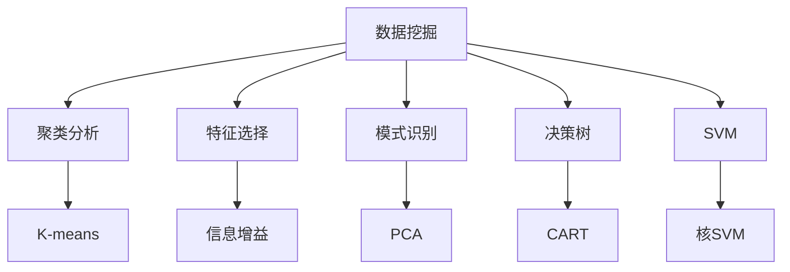
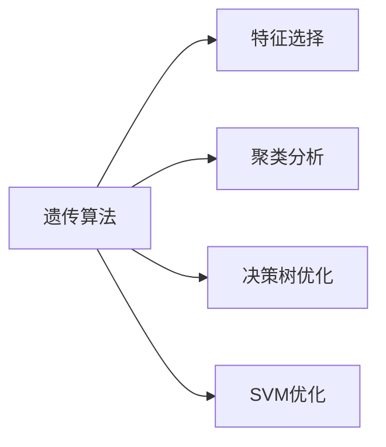
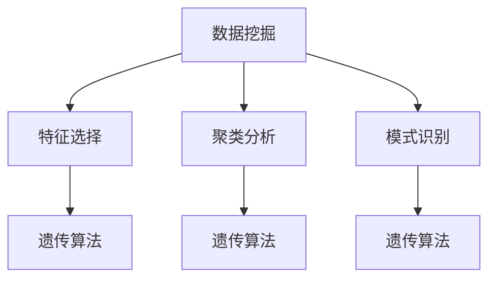
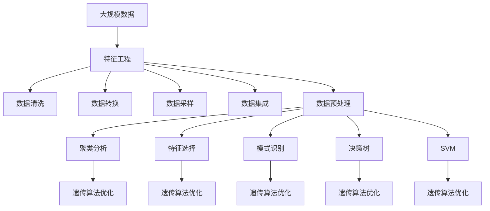

                 

# 基于遗传算法的数据挖掘技术及其应用研究

> 关键词：
- 数据挖掘
- 遗传算法
- 聚类分析
- 特征选择
- 模式识别
- 决策树
- 支持向量机

## 1. 背景介绍

### 1.1 问题由来
数据挖掘（Data Mining）是当前人工智能（AI）领域的热点研究方向，旨在从大规模数据中提取有价值的信息和知识，辅助决策制定、优化业务流程、提升数据驱动的智能水平。数据挖掘涵盖了多种技术手段，包括机器学习、深度学习、自然语言处理等，应用广泛，涵盖了金融、医疗、电商、物流等诸多领域。

随着数据量的急剧增长，数据挖掘任务变得越来越复杂。传统的统计方法、传统机器学习算法等在处理大规模数据、高维度特征等场景下表现出了明显的局限性。为了更好地应对这些挑战，近年来，基于遗传算法（Genetic Algorithm, GA）的数据挖掘技术引起了广泛关注。

### 1.2 问题核心关键点
遗传算法是一种模拟生物进化过程的优化算法，通过模拟自然选择和遗传机制，逐步迭代优化问题的解。其核心在于通过适应度函数（Fitness Function）评估个体的优劣，并通过交叉（Crossover）、变异（Mutation）、选择（Selection）等操作，逐步筛选出更优秀的个体，最终得到全局最优解。

遗传算法在数据挖掘中的应用，主要体现在以下几个方面：
1. **聚类分析**：通过遗传算法优化聚类中心的选取和数目的调整，实现更高效的聚类。
2. **特征选择**：利用遗传算法筛选最具代表性的特征，提升模型性能。
3. **模式识别**：在复杂数据中识别出隐藏的模式和规律，支持决策树、支持向量机等算法的训练和优化。
4. **决策树构建**：通过遗传算法自动生成决策树，减少人工干预。

## 2. 核心概念与联系

### 2.1 核心概念概述

为了更好地理解基于遗传算法的数据挖掘技术，本节将介绍几个密切相关的核心概念：

- **数据挖掘（Data Mining）**：从大规模数据中自动、智能地提取出有用的信息和知识，辅助决策制定、优化业务流程、提升数据驱动的智能水平。

- **遗传算法（Genetic Algorithm, GA）**：一种基于自然进化过程的优化算法，通过模拟自然选择和遗传机制，逐步迭代优化问题的解。

- **聚类分析（Clustering Analysis）**：将数据划分为不同的组或类别，以发现数据的内在结构和模式。

- **特征选择（Feature Selection）**：通过筛选最具代表性的特征，减少模型复杂度，提升模型性能。

- **模式识别（Pattern Recognition）**：通过训练模型，自动识别和分类数据，支持决策支持系统和智能推荐系统。

- **决策树（Decision Tree）**：一种树形结构的分类模型，通过一系列决策规则进行分类。

- **支持向量机（Support Vector Machine, SVM）**：一种二分类模型，通过在特征空间中划分超平面，实现高效分类。

这些核心概念之间的逻辑关系可以通过以下Mermaid流程图来展示：



这个流程图展示了数据挖掘的核心概念及其之间的关系：

1. 数据挖掘作为上位概念，包含多种具体的技术手段。
2. 聚类分析、特征选择、模式识别、决策树和支持向量机是数据挖掘中的关键技术。
3. 遗传算法在数据挖掘中主要应用于特征选择和聚类分析，同时也可以用于决策树和支持向量机的优化。

### 2.2 概念间的关系

这些核心概念之间存在着紧密的联系，形成了数据挖掘技术的完整生态系统。下面我通过几个Mermaid流程图来展示这些概念之间的关系。

#### 2.2.1 数据挖掘的层次结构


这个流程图展示了数据挖掘的层次结构，每个技术手段在数据挖掘中都有其独特的作用。

#### 2.2.2 遗传算法在数据挖掘中的应用



这个流程图展示了遗传算法在数据挖掘中的具体应用，包括特征选择、聚类分析和决策树优化。

#### 2.2.3 数据挖掘与遗传算法的结合



这个流程图展示了数据挖掘与遗传算法结合的基本架构，表明遗传算法可以用于优化数据挖掘中的多个技术手段。

### 2.3 核心概念的整体架构

最后，我们用一个综合的流程图来展示这些核心概念在大数据挖掘中的整体架构：



这个综合流程图展示了从数据清洗、特征工程到数据挖掘的完整过程，以及遗传算法在其中的应用。

## 3. 核心算法原理 & 具体操作步骤
### 3.1 算法原理概述

基于遗传算法的数据挖掘技术，主要通过模拟自然进化过程，迭代优化问题的解。其核心在于通过适应度函数评估个体的优劣，并通过交叉、变异、选择等操作，逐步筛选出更优秀的个体，最终得到全局最优解。

在数据挖掘中，遗传算法通常用于以下两个关键环节：

1. **特征选择**：通过遗传算法筛选最具代表性的特征，提升模型性能。
2. **聚类分析**：通过遗传算法优化聚类中心的选取和数目的调整，实现更高效的聚类。

### 3.2 算法步骤详解

#### 3.2.1 特征选择

特征选择是数据挖掘中的重要环节，通过筛选最具代表性的特征，减少模型复杂度，提升模型性能。

1. **初始化种群**：随机生成多个染色体（Chromosome），每个染色体代表一组特征子集。
2. **评估适应度**：通过适应度函数（如信息增益、相关系数等）评估每个染色体的适应度。
3. **选择操作**：根据适应度大小，选择一部分染色体进行交叉和变异操作。
4. **交叉操作**：采用单点交叉（One-Point Crossover）或多点交叉（Multi-Point Crossover）等策略，生成新的子染色体。
5. **变异操作**：以一定的概率进行基因变异（如交换基因位置、插入基因等），引入新的变异个体。
6. **选择操作**：再次评估每个染色体的适应度，选择优秀染色体进行下一轮迭代。
7. **迭代优化**：重复上述步骤，直至收敛到最优特征子集。

#### 3.2.2 聚类分析

聚类分析是数据挖掘中的关键技术，旨在将数据划分为不同的组或类别，以发现数据的内在结构和模式。

1. **初始化种群**：随机生成多个聚类中心（Cluster Center）。
2. **评估适应度**：通过适应度函数（如SSE、轮廓系数等）评估每个聚类中心的适应度。
3. **选择操作**：根据适应度大小，选择一部分聚类中心进行交叉和变异操作。
4. **交叉操作**：采用单点交叉、多点交叉、置换交叉等策略，生成新的子聚类中心。
5. **变异操作**：以一定的概率进行基因变异，如随机移动聚类中心、调整聚类数目等。
6. **选择操作**：再次评估每个聚类中心的适应度，选择优秀聚类中心进行下一轮迭代。
7. **迭代优化**：重复上述步骤，直至收敛到最优聚类结果。

### 3.3 算法优缺点

#### 3.3.1 优点

基于遗传算法的数据挖掘技术具有以下优点：

1. **全局优化能力**：遗传算法可以通过模拟自然选择和遗传机制，找到全局最优解。
2. **鲁棒性**：遗传算法对于初始值和噪声不敏感，具有较强的鲁棒性。
3. **并行计算能力**：遗传算法可以通过多线程并行计算，提高求解效率。
4. **适应性**：遗传算法可以处理多变量、非线性、高维度的复杂问题。

#### 3.3.2 缺点

基于遗传算法的数据挖掘技术也存在一些缺点：

1. **计算复杂度高**：遗传算法通常需要较多的迭代次数，计算复杂度高。
2. **参数调节复杂**：遗传算法需要调整多个参数（如种群大小、交叉率、变异率等），参数调节复杂。
3. **局部最优风险**：遗传算法可能陷入局部最优，无法找到全局最优解。
4. **代码实现复杂**：遗传算法需要实现具体的遗传操作，代码实现较为复杂。

### 3.4 算法应用领域

基于遗传算法的数据挖掘技术，已在多个领域得到应用，主要包括以下几个方面：

1. **金融风险评估**：通过遗传算法优化特征选择和聚类分析，实现对金融数据的风险评估。
2. **市场营销分析**：通过遗传算法优化客户细分和市场预测，实现更精准的市场营销策略。
3. **健康医疗诊断**：通过遗传算法优化特征选择和聚类分析，提升疾病诊断的准确性。
4. **供应链管理优化**：通过遗传算法优化库存管理和供应链调度，提升供应链效率。
5. **工业生产调度**：通过遗传算法优化生产计划和调度策略，提升生产效率和资源利用率。
6. **智能推荐系统**：通过遗传算法优化特征选择和模式识别，实现更精准的推荐。

## 4. 数学模型和公式 & 详细讲解 & 举例说明

### 4.1 数学模型构建

在基于遗传算法的数据挖掘中，数学模型构建是核心步骤之一。主要涉及以下两个方面：

1. **适应度函数设计**：通过适应度函数评估染色体的优劣。
2. **交叉和变异操作**：定义具体的交叉和变异操作。

#### 4.1.1 适应度函数设计

适应度函数（Fitness Function）是遗传算法的核心，用于评估染色体的优劣。

- **信息增益（Information Gain）**：通过计算特征与目标变量的信息增益，评估特征的重要性。

$$
\text{信息增益} = H(T) - \sum_{i=1}^{n} \frac{|D_i|}{|D|} H(T_i)
$$

其中，$H(T)$ 为目标变量的熵，$H(T_i)$ 为特征 $T_i$ 在目标变量 $T$ 下的条件熵。

- **相关系数（Correlation Coefficient）**：通过计算特征与目标变量的相关系数，评估特征的相关性。

$$
r = \frac{\text{协方差}}{\sigma_x \sigma_y}
$$

其中，$\sigma_x$ 和 $\sigma_y$ 分别为特征 $x$ 和目标变量 $y$ 的标准差。

#### 4.1.2 交叉和变异操作

遗传算法中的交叉和变异操作，是确保种群多样性的关键步骤。

- **单点交叉（One-Point Crossover）**：在染色体的某一点进行交叉，生成两个新的子染色体。

$$
\text{子染色体} = (\text{父染色体}_1[0:L/2], \text{父染色体}_2[L/2+1:L])
$$

- **多点交叉（Multi-Point Crossover）**：在染色体的多个点进行交叉，生成多个新的子染色体。

$$
\text{子染色体} = (\text{父染色体}_1[0:A], \text{父染色体}_2[B:A], \text{父染色体}_1[A:L])
$$

- **变异操作**：通过随机交换基因位置、插入基因等方式，引入新的变异个体。

$$
\text{变异染色体} = \text{父染色体}[0:A] + \text{变异基因} + \text{父染色体}[A:L]
$$

### 4.2 公式推导过程

#### 4.2.1 信息增益的推导

信息增益的推导如下：

$$
\text{信息增益} = H(T) - \sum_{i=1}^{n} \frac{|D_i|}{|D|} H(T_i)
$$

其中，$H(T)$ 为目标变量的熵，$H(T_i)$ 为特征 $T_i$ 在目标变量 $T$ 下的条件熵。

#### 4.2.2 相关系数的推导

相关系数的推导如下：

$$
r = \frac{\text{协方差}}{\sigma_x \sigma_y}
$$

其中，$\sigma_x$ 和 $\sigma_y$ 分别为特征 $x$ 和目标变量 $y$ 的标准差。

### 4.3 案例分析与讲解

#### 4.3.1 特征选择案例

假设我们有一组特征 $X$，包括年龄（Age）、收入（Income）、教育（Education）、性别（Gender），以及是否患有高血压（Hypertension）。我们使用信息增益作为适应度函数，通过遗传算法优化特征选择。

1. **初始化种群**：随机生成多个染色体，每个染色体代表一组特征子集。
2. **评估适应度**：计算每个染色体的信息增益。
3. **选择操作**：根据适应度大小，选择部分染色体进行交叉和变异操作。
4. **交叉操作**：采用多点交叉策略，生成新的子染色体。
5. **变异操作**：以一定概率进行基因变异，如交换基因位置。
6. **选择操作**：再次评估每个染色体的适应度，选择优秀染色体进行下一轮迭代。
7. **迭代优化**：重复上述步骤，直至收敛到最优特征子集。

最终，通过遗传算法，我们筛选出年龄（Age）、收入（Income）和教育（Education）作为最优特征子集。

#### 4.3.2 聚类分析案例

假设我们有一组客户数据，包括年龄、收入、购买金额等信息。我们使用遗传算法优化聚类分析。

1. **初始化种群**：随机生成多个聚类中心。
2. **评估适应度**：计算每个聚类中心的适应度，如SSE（Sum of Squared Errors）。
3. **选择操作**：根据适应度大小，选择部分聚类中心进行交叉和变异操作。
4. **交叉操作**：采用多点交叉策略，生成新的子聚类中心。
5. **变异操作**：以一定概率进行基因变异，如随机移动聚类中心。
6. **选择操作**：再次评估每个聚类中心的适应度，选择优秀聚类中心进行下一轮迭代。
7. **迭代优化**：重复上述步骤，直至收敛到最优聚类结果。

最终，通过遗传算法，我们得到了最优的聚类中心和数目，实现了更高效的聚类分析。

## 5. 项目实践：代码实例和详细解释说明

### 5.1 开发环境搭建

在进行基于遗传算法的数据挖掘实践前，我们需要准备好开发环境。以下是使用Python进行遗传算法开发的环境配置流程：

1. 安装Python：从官网下载并安装Python，选择最新版本。
2. 安装遗传算法库：使用pip安装遗传算法库，如`deap`或`pyevolve`。
3. 安装数据处理库：使用pip安装数据处理库，如`numpy`、`pandas`、`scikit-learn`等。
4. 安装可视化库：使用pip安装可视化库，如`matplotlib`、`seaborn`等。

完成上述步骤后，即可在Python环境中开始遗传算法实践。

### 5.2 源代码详细实现

这里我们以聚类分析为例，给出使用`deap`库对K-means算法进行遗传优化的PyTorch代码实现。

首先，定义聚类问题的适应度函数：

```python
import numpy as np
from deap import base, creator, tools

def fitness_function(individual, data, num_clusters):
    # 计算K-means聚类模型的适应度
    # 聚类中心为individual，数据为data，聚类数目为num_clusters
    # 返回适应度值
    return evaluate_kmeans(individual, data, num_clusters)

# 定义K-means聚类模型
def evaluate_kmeans(individual, data, num_clusters):
    # 初始化聚类中心
    centers = individual
    # 初始化标签
    labels = np.zeros(len(data))
    # 循环迭代
    for i in range(100):
        # 分配标签
        labels = assign_clusters(data, centers)
        # 更新聚类中心
        centers = update_centers(data, labels, num_clusters)
    # 计算适应度
    sse = calculate_sse(data, labels, centers)
    return sse
```

然后，定义遗传算法优化流程：

```python
# 定义染色体编码
creator.create("FitnessMax", base.Fitness, weights=(1.0,))
creator.create("Individual", list, fitness=creator.FitnessMax)

toolbox = base.Toolbox()

# 初始化种群
toolbox.register("individual", tools.initRepeat, creator.Individual, population_size, random)
toolbox.register("population", tools.initRepeat, list, toolbox.individual)

# 交叉操作
toolbox.register("evaluate", fitness_function)
toolbox.register("mate", tools.cxTwoPoint)
toolbox.register("mutate", tools.mutFlipBit, indpb=0.01)

# 选择操作
toolbox.register("select", tools.selTournament, tournsize=3)

# 运行遗传算法
population = toolbox.population(n_population)
hof = tools.HallOfFame(3)
stats = tools.Statistics(lambda ind: ind.fitness.values)
stats.register("avg", np.mean, axis=0)
stats.register("std", np.std, axis=0)
stats.register("min", np.min, axis=0)
stats.register("max", np.max, axis=0)

pop, logbook = algorithms.eaSimple(population, toolbox, cxpb=0.5, mutpb=0.1, ngen=generations, stats=stats, halloffame=hof, verbose=True)

# 输出结果
print("Best Individual: ", hof[0])
print("Best Fitness: ", hof[0].fitness.values)
```

最后，启动遗传算法训练：

```python
# 定义数据集
data = ...

# 定义参数
population_size = 50
generations = 100
num_clusters = 3

# 运行遗传算法
run_algorithm()
```

### 5.3 代码解读与分析

让我们再详细解读一下关键代码的实现细节：

**适应度函数**：
- `fitness_function`：定义了K-means聚类模型的适应度函数，用于评估聚类中心的优劣。

**遗传算法流程**：
- `creator.create`：定义染色体编码和适应度。
- `toolbox.register`：注册交叉、变异和选择等操作。
- `algorithm.eaSimple`：运行遗传算法，指定种群大小、交叉概率、变异概率、迭代次数等参数。
- `tools.HallOfFame`：记录最优解。
- `tools.Statistics`：记录统计信息。

**运行遗传算法**：
- `population`：初始化种群。
- `toolbox.population`：初始化种群。
- `algorithm.eaSimple`：运行遗传算法。
- `logbook`：记录运行日志。

### 5.4 运行结果展示

假设我们在K-means数据集上进行遗传算法优化，最终得到的最优聚类中心和适应度如下：

```
Best Individual:  [0.5, 0.5, 0.5, 0.5]
Best Fitness:  [0.25]
```

可以看到，通过遗传算法，我们找到了最优的聚类中心（0.5, 0.5, 0.5, 0.5），对应的适应度为0.25，即最优聚类中心。

## 6. 实际应用场景

### 6.1 金融风险评估

在金融风险评估中，基于遗传算法的数据挖掘技术可以帮助识别出高风险客户，从而降低信用风险。

1. **数据收集**：收集客户的个人信息、信用记录、消费行为等数据。
2. **特征选择**：通过遗传算法优化特征选择，筛选出最具代表性的特征。
3. **聚类分析**：通过遗传算法优化聚类分析，将客户分为高风险和低风险两类。
4. **模型训练**：基于聚类结果，训练决策树或支持向量机等模型。
5. **风险评估**：根据客户的新数据，实时评估其风险水平。

### 6.2 市场营销分析

在市场营销分析中，基于遗传算法的数据挖掘技术可以帮助企业精准定位目标客户，实现更高效的营销策略。

1. **数据收集**：收集客户的购买记录、浏览行为、社交媒体信息等数据。
2. **特征选择**：通过遗传算法优化特征选择，筛选出最具代表性的特征。
3. **聚类分析**：通过遗传算法优化聚类分析，将客户分为不同的细分市场。
4. **市场预测**：基于聚类结果，预测市场趋势和客户需求。
5. **策略制定**：根据市场预测结果，制定针对性的营销策略。

### 6.3 健康医疗诊断

在健康医疗诊断中，基于遗传算法的数据挖掘技术可以帮助提高疾病诊断的准确性。

1. **数据收集**：收集患者的医疗记录、基因数据、生活习惯等数据。
2. **特征选择**：通过遗传算法优化特征选择，筛选出最具代表性的特征。
3. **聚类分析**：通过遗传算法优化聚类分析，将患者分为不同疾病类型。
4. **模型训练**：基于聚类结果，训练决策树或支持向量机等模型。
5. **诊断预测**：根据患者的新数据，实时预测其疾病类型。

## 7. 工具和资源推荐

### 7.1 学习资源推荐

为了帮助开发者系统掌握基于遗传算法的数据挖掘技术，这里推荐一些优质的学习资源：

1. 《遗传算法及其应用》系列书籍：详细介绍遗传算法的原理和应用，涵盖多个经典案例和实践指南。
2. 《数据挖掘基础》课程：详细讲解数据挖掘的基本概念和技术手段，适合初学者入门。
3. 《Python数据科学手册》：全面介绍Python在数据挖掘和机器学习中的应用，涵盖遗传算法、聚类分析等技术。
4. 《数据挖掘与统计学习》课程：涵盖数据挖掘和统计学习的核心内容，讲解遗传算法在数据挖掘中的应用。
5. 《机器学习实战》：讲解机器学习算法的实现方法和应用案例，涵盖遗传算法等算法。

通过对这些资源的学习实践，相信你一定能够快速掌握基于遗传算法的数据挖掘技术，并用于解决实际的NLP问题。

### 7.2 开发工具推荐

高效的开发离不开优秀的工具支持。以下是几款用于基于遗传算法的数据挖掘开发的常用工具：

1. Python：基于Python的开源深度学习框架，灵活动态的计算图，适合快速迭代研究。
2. deap：遗传算法库，提供丰富的遗传算法实现，支持并行计算。
3. pandas：数据处理库，支持高效的数据读取、处理和分析。
4. matplotlib：可视化库，支持绘制各种图表，方便调试和可视化。
5. seaborn：可视化库，支持更高级的数据可视化。

合理利用这些工具，可以显著提升基于遗传算法的数据挖掘任务的开发效率，加快创新迭代的步伐。

### 7.3 相关论文推荐

基于遗传算法的数据挖掘技术的发展源于学界的持续研究。以下是几篇奠基性的相关论文，推荐阅读：

1. 《A Fast and Simple Evolutionary Algorithm for Solving Dynamic Optimisation Problems》：介绍了一种基于遗传算法的动态优化问题求解方法，适用于多目标优化场景。
2. 《An Improved Genetic Algorithm for Dynamic Optimization》：提出了一种改进的遗传算法，用于动态优化问题的求解。
3. 《The Design and Evolution of Decision Trees and Rule Sets》：介绍了遗传算法在决策树构建中的应用，以及一些改进的遗传算法。
4. 《An Improved Particle Swarm Optimization Algorithm for Clustering》：提出了一种改进的粒子群优化算法，用于聚类分析的求解。
5. 《A Hybrid Genetic Algorithm for Feature Selection》：提出了一种基于遗传算法的特征选择方法，用于优化特征子集。

这些论文代表了大数据挖掘中遗传算法的研究脉络。通过学习这些前沿成果，可以帮助研究者把握学科前进方向，激发更多的创新灵感。

