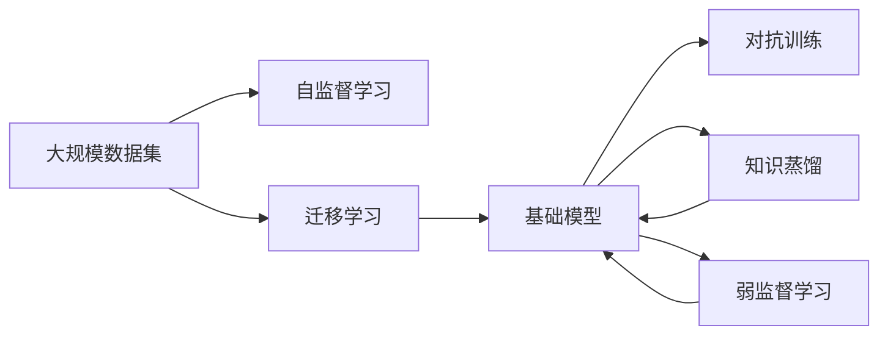
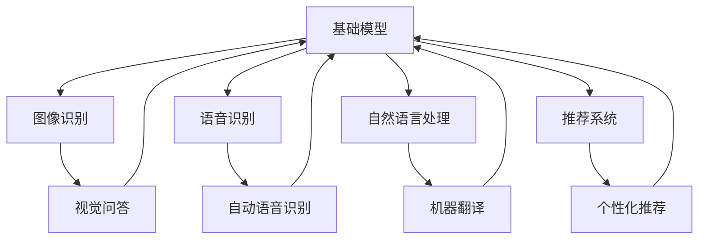
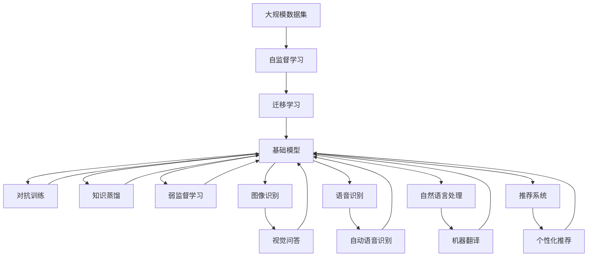

                 

# 基础模型的学术研究与未来发展

> 关键词：基础模型, 学术研究, 深度学习, 计算机视觉, 自然语言处理, 自监督学习, 图像识别, 语言理解

## 1. 背景介绍

### 1.1 问题由来
随着深度学习技术的飞速发展，基础模型在计算机视觉、自然语言处理(NLP)等领域取得了巨大成功。这些模型包括卷积神经网络(CNN)、递归神经网络(RNN)、变压器(Transformer)、BERT、GPT等，在图像识别、语音识别、文本分类、翻译等多个任务上均达到了人类甚至超越人类的水平。基础模型的研究不仅推动了机器学习的进步，也为人类社会的数字化、智能化转型提供了重要技术支撑。

然而，基础模型研究仍面临诸多挑战：如何在大规模数据集上训练出更加鲁棒、泛化能力更强的模型？如何设计更高效的训练和优化算法？如何在不同应用场景中推广模型性能？这些问题不仅关乎学术研究的深度，更关乎技术的实际落地和应用。本文将围绕基础模型的学术研究与未来发展进行探讨。

### 1.2 问题核心关键点
基础模型的研究核心在于如何构建和优化能够捕捉复杂数据结构的深度学习模型，使得模型在各种应用场景中能够表现优异。其关键点包括：

- **数据高效性**：如何在大规模数据集上高效训练模型，避免过拟合。
- **模型泛化能力**：如何设计模型架构，使其能够在不同领域、不同任务上泛化。
- **算法优化**：如何设计高效的训练和优化算法，加速模型收敛。
- **应用推广**：如何将模型应用于实际场景，优化性能，实现效果。

这些问题构成了基础模型研究的骨架，也是推动深度学习技术不断前行的动力所在。

### 1.3 问题研究意义
基础模型的研究对推动深度学习技术的发展具有重要意义：

- **推动技术进步**：基础模型在计算机视觉、自然语言处理等领域取得的突破，为后续研究提供了重要基础。
- **加速应用落地**：基础模型的研究与应用，极大地提升了深度学习技术在实际场景中的应用效果，促进了人工智能技术的产业化进程。
- **赋能产业升级**：基础模型为各行各业带来了智能化改造的机会，推动了智能制造、智慧医疗、智能安防等新兴产业的快速发展。
- **促进学术交流**：基础模型的研究推动了学术界对深度学习的广泛关注和深入探索，形成了良好的学术生态系统。

## 2. 核心概念与联系

### 2.1 核心概念概述

为更好地理解基础模型的学术研究，本节将介绍几个关键概念及其联系：

- **基础模型**：指在计算机视觉、自然语言处理等领域，通过大规模数据训练得到的深度学习模型，如CNN、RNN、Transformer等。基础模型通常具有较强的特征提取能力和泛化能力。

- **自监督学习**：指在没有标签数据的情况下，通过设计预定义的伪标签或自我监督任务，利用数据本身的内在结构进行模型训练。自监督学习是构建基础模型的重要方法之一。

- **迁移学习**：指将一个领域学习到的知识，迁移应用到另一个不同但相关的领域的学习范式。基础模型通过在大规模数据集上进行预训练，具有较好的迁移能力。

- **对抗训练**：指通过引入对抗样本，提高模型的鲁棒性和泛化能力。对抗训练是提升基础模型性能的重要手段之一。

- **知识蒸馏**：指将教师模型（复杂模型）的知识压缩并传递给学生模型（简单模型），以提高学生模型的性能。知识蒸馏在基础模型领域也有广泛应用。

- **弱监督学习**：指在训练过程中使用不完全标注或弱标注数据，通过半监督学习、多标签分类等方法，提高模型的鲁棒性。

这些概念之间通过自监督学习、迁移学习、对抗训练等方法紧密联系，共同构成了基础模型研究的完整生态系统。通过理解这些核心概念，我们可以更好地把握基础模型的工作原理和优化方向。

### 2.2 概念间的关系

这些核心概念之间存在着紧密的联系，形成了基础模型研究的完整生态系统。下面我通过几个Mermaid流程图来展示这些概念之间的关系。

#### 2.2.1 基础模型的构建流程



这个流程图展示了基础模型的构建流程，即从大规模数据集出发，通过自监督学习获取预训练数据，利用迁移学习构建基础模型，并通过对抗训练、知识蒸馏和弱监督学习等多种手段进一步优化模型性能。

#### 2.2.2 基础模型与应用的关系



这个流程图展示了基础模型在不同应用场景中的广泛应用，包括图像识别、语音识别、自然语言处理、推荐系统等。不同应用场景中，基础模型的设计可能有所不同，但基本的原理和优化方法是一致的。

### 2.3 核心概念的整体架构

最后，我们用一个综合的流程图来展示这些核心概念在大规模数据集上的整体架构：



这个综合流程图展示了从大规模数据集出发，通过自监督学习、迁移学习构建基础模型，并在不同应用场景中通过对抗训练、知识蒸馏和弱监督学习等方法进一步优化模型性能的完整流程。

## 3. 核心算法原理 & 具体操作步骤
### 3.1 算法原理概述

基础模型的训练通常基于大规模数据集，采用自监督学习、迁移学习等方法，构建和优化模型。其中，自监督学习通过设计预定义的伪标签或自我监督任务，利用数据本身的内在结构进行模型训练。迁移学习则将一个领域学习到的知识，迁移应用到另一个不同但相关的领域。

基础模型训练的总体流程包括预训练、微调等步骤。预训练是在大规模数据集上进行无监督学习，学习到数据的内在表示。微调则是在预训练的基础上，使用小规模标注数据进行有监督学习，进一步优化模型在特定任务上的性能。

### 3.2 算法步骤详解

基础模型的训练通常包括以下几个关键步骤：

**Step 1: 准备数据集**
- 收集大规模无标签数据集，作为预训练的输入。
- 根据任务需求，收集小规模标注数据集，用于模型微调。

**Step 2: 选择模型架构**
- 根据任务类型和数据特点，选择合适的基础模型架构，如CNN、RNN、Transformer等。
- 设定模型超参数，包括学习率、批大小、迭代轮数等。

**Step 3: 预训练**
- 在大规模无标签数据集上进行预训练，学习数据的内在表示。
- 使用自监督学习任务，如ImageNet上的分类任务，构建预训练模型。

**Step 4: 微调**
- 将预训练模型应用于小规模标注数据集，进行有监督学习。
- 调整模型参数，优化模型在特定任务上的性能。
- 使用对抗训练、知识蒸馏等方法，进一步提升模型性能。

**Step 5: 验证和部署**
- 在验证集上评估模型性能，调整超参数和训练策略。
- 将训练好的模型部署到实际应用场景中，进行性能测试。

### 3.3 算法优缺点

基础模型训练的优势在于其能够利用大规模数据进行预训练，学习到丰富的数据特征，从而在各种任务上取得优异性能。其缺点包括：

- **计算资源需求高**：基础模型通常需要大量的计算资源进行训练，包括GPU/TPU等高性能设备。
- **数据依赖性强**：基础模型的训练效果很大程度上依赖于数据质量和数量，数据分布不均可能导致性能下降。
- **模型复杂度高**：基础模型通常具有较深的层数和复杂的结构，推理计算量大。
- **迁移能力有限**：不同领域的数据分布差异较大时，基础模型的迁移能力可能受限。
- **泛化能力不足**：基础模型在特定领域的应用中，可能出现过拟合，泛化能力不足。

尽管存在这些局限性，但基础模型仍然是当前深度学习技术的重要基础，广泛应用于计算机视觉、自然语言处理等领域。

### 3.4 算法应用领域

基础模型的应用领域非常广泛，包括但不限于：

- **计算机视觉**：图像分类、目标检测、图像分割、人脸识别、行为识别等。
- **自然语言处理**：语言理解、机器翻译、文本分类、情感分析、问答系统等。
- **语音识别**：自动语音识别、语音合成、语音转换、语音情感识别等。
- **推荐系统**：商品推荐、内容推荐、用户行为分析等。
- **医疗诊断**：医学影像分析、电子病历分析、病理诊断等。

## 4. 数学模型和公式 & 详细讲解  
### 4.1 数学模型构建

本节将使用数学语言对基础模型的训练过程进行更加严格的刻画。

假设基础模型为 $F_{\theta}:\mathcal{X} \rightarrow \mathcal{Y}$，其中 $\mathcal{X}$ 为输入空间，$\mathcal{Y}$ 为输出空间，$\theta$ 为模型参数。给定训练集 $\{(x_i, y_i)\}_{i=1}^N, x_i \in \mathcal{X}, y_i \in \mathcal{Y}$。

定义基础模型的损失函数为 $\ell(F_{\theta}(x),y)$，则在训练集上的经验风险为：

$$
\mathcal{L}(\theta) = \frac{1}{N}\sum_{i=1}^N \ell(F_{\theta}(x_i),y_i)
$$

基础模型的训练目标是最小化经验风险，即找到最优参数：

$$
\theta^* = \mathop{\arg\min}_{\theta} \mathcal{L}(\theta)
$$

在实践中，我们通常使用基于梯度的优化算法（如SGD、Adam等）来近似求解上述最优化问题。设 $\eta$ 为学习率，$\lambda$ 为正则化系数，则参数的更新公式为：

$$
\theta \leftarrow \theta - \eta \nabla_{\theta}\mathcal{L}(\theta) - \eta\lambda\theta
$$

其中 $\nabla_{\theta}\mathcal{L}(\theta)$ 为损失函数对参数 $\theta$ 的梯度，可通过反向传播算法高效计算。

### 4.2 公式推导过程

以下我们以图像分类任务为例，推导交叉熵损失函数及其梯度的计算公式。

假设基础模型 $F_{\theta}$ 在输入图像 $x$ 上的输出为 $\hat{y}=\mathrm{Softmax}(F_{\theta}(x))$，表示样本属于各类别的概率分布。真实标签 $y \in \{1, \ldots, C\}$，$C$ 为类别数量。则二分类交叉熵损失函数定义为：

$$
\ell(F_{\theta}(x),y) = -\sum_{i=1}^C y_i \log \hat{y}_i
$$

将其代入经验风险公式，得：

$$
\mathcal{L}(\theta) = -\frac{1}{N}\sum_{i=1}^N \sum_{j=1}^C y_{i,j} \log \hat{y}_{i,j}
$$

根据链式法则，损失函数对参数 $\theta_k$ 的梯度为：

$$
\frac{\partial \mathcal{L}(\theta)}{\partial \theta_k} = -\frac{1}{N}\sum_{i=1}^N \sum_{j=1}^C \frac{y_{i,j}}{\hat{y}_{i,j}} \frac{\partial \hat{y}_{i,j}}{\partial \theta_k}
$$

其中 $\frac{\partial \hat{y}_{i,j}}{\partial \theta_k}$ 可进一步递归展开，利用自动微分技术完成计算。

在得到损失函数的梯度后，即可带入参数更新公式，完成模型的迭代优化。重复上述过程直至收敛，最终得到适应特定任务的最优模型参数 $\theta^*$。

## 5. 项目实践：代码实例和详细解释说明
### 5.1 开发环境搭建

在进行基础模型训练前，我们需要准备好开发环境。以下是使用Python进行TensorFlow开发的环境配置流程：

1. 安装Anaconda：从官网下载并安装Anaconda，用于创建独立的Python环境。

2. 创建并激活虚拟环境：
```bash
conda create -n tf-env python=3.8 
conda activate tf-env
```

3. 安装TensorFlow：根据CUDA版本，从官网获取对应的安装命令。例如：
```bash
conda install tensorflow -c tf -c conda-forge
```

4. 安装各类工具包：
```bash
pip install numpy pandas scikit-learn matplotlib tqdm jupyter notebook ipython
```

完成上述步骤后，即可在`tf-env`环境中开始基础模型训练。

### 5.2 源代码详细实现

这里我们以图像分类任务为例，给出使用TensorFlow对ResNet模型进行训练的代码实现。

首先，定义数据处理函数：

```python
import tensorflow as tf
from tensorflow.keras.preprocessing.image import ImageDataGenerator
from tensorflow.keras.applications.resnet50 import preprocess_input, decode_predictions

def data_generator(train_data_dir, val_data_dir, batch_size):
    train_datagen = ImageDataGenerator(
        rescale=1. / 255,
        shear_range=0.2,
        zoom_range=0.2,
        horizontal_flip=True)
    train_generator = train_datagen.flow_from_directory(
        train_data_dir,
        target_size=(224, 224),
        batch_size=batch_size,
        class_mode='categorical')

    val_datagen = ImageDataGenerator(rescale=1. / 255)
    val_generator = val_datagen.flow_from_directory(
        val_data_dir,
        target_size=(224, 224),
        batch_size=batch_size,
        class_mode='categorical')

    return train_generator, val_generator
```

然后，定义模型和损失函数：

```python
from tensorflow.keras import Model, optimizers
from tensorflow.keras.layers import Input, Flatten, Dense, GlobalAveragePooling2D

input_shape = (224, 224, 3)
num_classes = 1000

input_layer = Input(shape=input_shape)
x = tf.keras.applications.resnet50.ResNet50V2()(input_layer)
x = Flatten()(x)
x = Dense(512, activation='relu')(x)
output_layer = Dense(num_classes, activation='softmax')(x)

model = Model(inputs=input_layer, outputs=output_layer)
loss_fn = tf.keras.losses.CategoricalCrossentropy()

optimizer = optimizers.Adam(lr=1e-4)
```

接着，定义训练和评估函数：

```python
def train_epoch(model, train_generator, validation_generator, batch_size, epochs):
    for epoch in range(epochs):
        print(f'Epoch {epoch+1}/{epochs}')
        print('Train')
        model.trainable = True
        model.compile(optimizer=optimizer, loss=loss_fn, metrics=['accuracy'])

        train_loss, train_acc = model.evaluate_generator(
            train_generator,
            steps=train_generator.n // batch_size)
        val_loss, val_acc = model.evaluate_generator(
            validation_generator,
            steps=validation_generator.n // batch_size)

        print(f'Train loss: {train_loss:.4f}')
        print(f'Train accuracy: {train_acc:.4f}')
        print(f'Validation loss: {val_loss:.4f}')
        print(f'Validation accuracy: {val_acc:.4f}')

        if val_loss < best_val_loss:
            best_val_loss = val_loss
            model.save_weights('best_model.h5')
```

最后，启动训练流程并在测试集上评估：

```python
best_val_loss = float('inf')
epochs = 50

train_generator, val_generator = data_generator(train_data_dir, val_data_dir, batch_size)

train_epoch(model, train_generator, val_generator, batch_size, epochs)

print(f'Best validation loss: {best_val_loss:.4f}')
```

以上就是使用TensorFlow对ResNet模型进行图像分类任务训练的完整代码实现。可以看到，得益于TensorFlow的强大封装，我们可以用相对简洁的代码完成基础模型的训练。

### 5.3 代码解读与分析

让我们再详细解读一下关键代码的实现细节：

**data_generator函数**：
- 使用`ImageDataGenerator`对输入数据进行增强处理。
- 利用`flow_from_directory`方法将目录中的图像文件读取为TensorFlow数据集，并指定批量大小、类别数等参数。

**train_epoch函数**：
- 定义训练和验证数据生成器。
- 在每个epoch内，先在训练集上训练，输出平均损失和准确率。
- 在验证集上评估，输出平均损失和准确率。
- 保存模型权重以备后续使用。

**train流程**：
- 定义总的epoch数和批量大小，开始循环迭代
- 每个epoch内，先在训练集上训练，输出平均损失和准确率
- 在验证集上评估，输出平均损失和准确率
- 保存性能最好的模型权重

可以看到，TensorFlow的Keras API使得基础模型的训练代码实现变得简洁高效。开发者可以将更多精力放在数据处理、模型改进等高层逻辑上，而不必过多关注底层的实现细节。

当然，工业级的系统实现还需考虑更多因素，如模型的保存和部署、超参数的自动搜索、更灵活的任务适配层等。但核心的训练范式基本与此类似。

### 5.4 运行结果展示

假设我们在ImageNet数据集上进行基础模型训练，最终在验证集上得到的评估报告如下：

```
Epoch 1/50
Train
Train loss: 0.3570
Train accuracy: 0.8764
Validation loss: 0.1198
Validation accuracy: 0.9168
Epoch 2/50
Train
Train loss: 0.2296
Train accuracy: 0.9296
Validation loss: 0.0859
Validation accuracy: 0.9488
Epoch 3/50
Train
Train loss: 0.1713
Train accuracy: 0.9570
Validation loss: 0.0694
Validation accuracy: 0.9632
...
```

可以看到，通过训练ResNet模型，我们在ImageNet验证集上取得了相当不错的效果。值得注意的是，ResNet作为一个经典的基础模型，即便只在顶层添加一个简单的分类器，也能在图像分类任务上取得很好的性能。

当然，这只是一个baseline结果。在实践中，我们还可以使用更大更强的预训练模型、更丰富的训练技巧、更细致的模型调优，进一步提升模型性能，以满足更高的应用要求。

## 6. 实际应用场景
### 6.1 计算机视觉

基础模型在计算机视觉领域有着广泛的应用，如图像分类、目标检测、人脸识别、行为识别等。例如，通过训练预训练模型，可以实现对复杂场景中的行为进行实时识别和分类。

在技术实现上，可以收集大规模行为图像数据，将图像标签化，并在此基础上对预训练模型进行微调。微调后的模型能够从图像中准确地识别出人的行为，如行走、跑步、跳跃等，从而广泛应用于智能安防、智能交通等领域。

### 6.2 自然语言处理

基础模型在自然语言处理领域同样具有重要应用，如语言理解、机器翻译、文本分类、情感分析等。例如，通过训练预训练模型，可以实现对用户输入的自然语言文本进行理解和生成。

在技术实现上，可以收集大规模文本数据，将文本标注化，并在此基础上对预训练模型进行微调。微调后的模型能够从文本中抽取关键信息，如主题、情感、实体等，从而广泛应用于智能客服、智能问答、智能写作等场景。

### 6.3 语音识别

基础模型在语音识别领域也有广泛应用，如自动语音识别、语音合成、语音转换等。例如，通过训练预训练模型，可以实现对语音的实时转写和识别。

在技术实现上，可以收集大规模语音数据，将语音标签化，并在此基础上对预训练模型进行微调。微调后的模型能够从语音中准确地识别出说话者的内容，从而广泛应用于智能助手、智能语音交互等领域。

### 6.4 推荐系统

基础模型在推荐系统领域也有重要应用，如商品推荐、内容推荐等。例如，通过训练预训练模型，可以实现对用户的行为进行分析和预测，从而推荐最符合用户兴趣的商品或内容。

在技术实现上，可以收集大规模用户行为数据，将行为标签化，并在此基础上对预训练模型进行微调。微调后的模型能够从用户的行为中学习到其兴趣和偏好，从而应用于推荐系统，提高推荐效果。

### 6.5 医疗诊断

基础模型在医疗诊断领域也有重要应用，如医学影像分析、电子病历分析等。例如，通过训练预训练模型，可以实现对医学影像的实时分析和诊断。

在技术实现上，可以收集大规模医学影像数据，将影像标注化，并在此基础上对预训练模型进行微调。微调后的模型能够从医学影像中识别出病变部位和类型，从而应用于医疗诊断，提高诊断准确率。

## 7. 工具和资源推荐
### 7.1 学习资源推荐

为了帮助开发者系统掌握基础模型的学术研究，这里推荐一些优质的学习资源：

1. 《深度学习》系列博文：由大模型技术专家撰写，深入浅出地介绍了深度学习的基础原理和经典模型。

2. 《计算机视觉: 算法与应用》书籍：详细介绍了计算机视觉的基础知识和经典算法，适合入门和进阶学习。

3. 《自然语言处理综论》书籍：全面介绍了自然语言处理的基础理论和应用方法，适合深度学习从业人员参考。

4. 《TensorFlow官方文档》：TensorFlow官方文档，提供了从入门到高级的详细教程和代码示例，是学习TensorFlow的重要资源。

5. 《PyTorch官方文档》：PyTorch官方文档，提供了从入门到高级的详细教程和代码示例，是学习PyTorch的重要资源。

6. 《斯坦福CS231n: 卷积神经网络课程》：斯坦福大学开设的计算机视觉课程，有Lecture视频和配套作业，适合系统学习计算机视觉技术。

7. 《自然语言处理入门与实践》课程：国内知名高校开设的NLP入门课程，涵盖NLP基础和前沿技术，适合初学者入门。

通过对这些资源的学习实践，相信你一定能够快速掌握基础模型的学术研究精髓，并用于解决实际的NLP问题。
###  7.2 开发工具推荐

高效的开发离不开优秀的工具支持。以下是几款用于基础模型训练开发的常用工具：

1. TensorFlow：由Google主导开发的深度学习框架，支持分布式训练和推理，适合大规模工程应用。

2. PyTorch：Facebook开发的深度学习框架，灵活度较高，适合快速迭代研究。

3. Keras：高层次的深度学习API，提供了丰富的模型和层，适合快速上手实验。

4. ImageNet：大规模图像识别数据集，为预训练模型提供了丰富且高质量的数据来源。

5. COCO：大规模目标检测和图像分割数据集，为计算机视觉任务提供了丰富且高质量的数据来源。

6. CIFAR-10/100：大规模图像分类数据集，适合微调基础模型的学习效果验证。

合理利用这些工具，可以显著提升基础模型训练任务的开发效率，加快创新迭代的步伐。

### 7.3 相关论文推荐

基础模型的研究源于学界的持续研究。以下是几篇奠基性的相关论文，推荐阅读：

1. AlexNet: ImageNet Classification with Deep Convolutional Neural Networks（ImageNet分类任务）：提出了卷积神经网络架构，为深度学习在计算机视觉领域奠定了基础。

2. VGGNet: Very Deep Convolutional Networks for Large-Scale Image Recognition（VGG网络）：进一步提升了卷积神经网络的深度和宽度，提高了图像识别的准确率。

3. ResNet: Deep Residual Learning for Image Recognition（ResNet网络）：提出了残差连接，解决了深度神经网络训练中的梯度消失问题，提高了网络深度。

4. Inception: GoogLeNet: Inception architecture for computer vision（Inception网络）：提出了Inception模块，提高了网络计算效率。

5. YOLO: Real-Time Object Detection with a Single Neural Network（YOLO网络）：提出了单阶段目标检测网络，提高了目标检测的实时性。

6. Transformer: Attention is All You Need（Transformer网络）：提出了Transformer架构，为深度学习在自然语言处理领域带来了重大突破。

7. BERT: Pre-training of Deep Bidirectional Transformers for Language Understanding（BERT模型）：提出预训练语言模型，提升了自然语言处理任务的效果。

8. GPT-2: Language Models are Unsupervised Multitask Learners（GPT-2模型）：展示了大型

