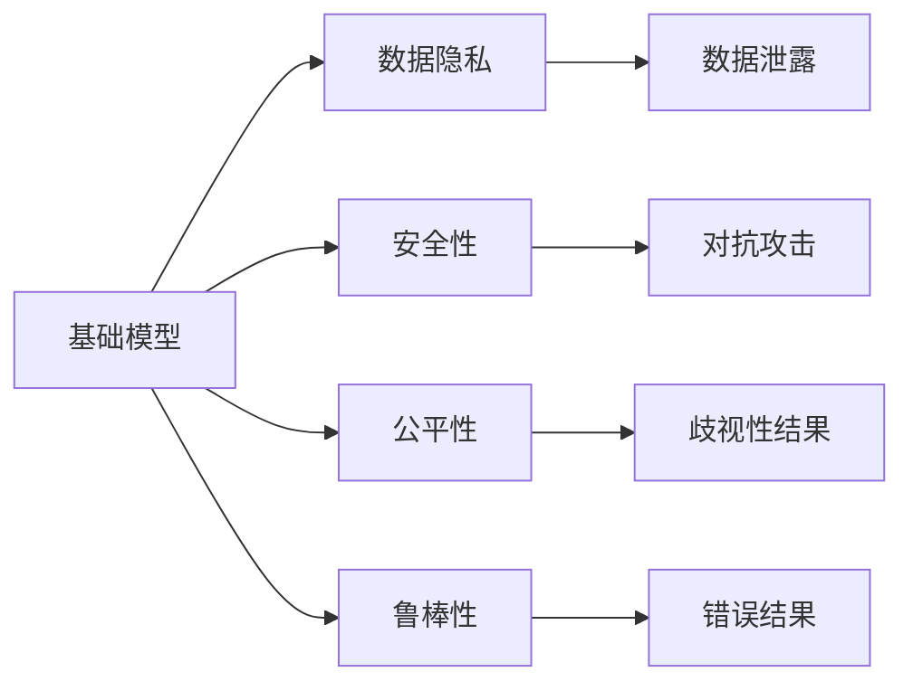

                 

# 基础模型的未来机遇与风险

## 1. 背景介绍

### 1.1 问题由来
基础模型（Baseline Models），尤其是深度学习模型，已经在各个领域取得了巨大成功。无论是计算机视觉、自然语言处理，还是语音识别、推荐系统，基础模型的表现都超出了许多人的预期。然而，随着研究的深入，一些潜在问题逐渐浮现，例如数据隐私、安全性、公平性、鲁棒性等，这些问题可能会在未来给基础模型带来挑战。因此，本文旨在探讨基础模型的未来机遇与风险，为研究人员和开发者提供有益的参考。

### 1.2 问题核心关键点
基础模型的核心问题是其对于大量数据的依赖，以及由此带来的数据隐私、安全性、公平性和鲁棒性等方面的挑战。

- **数据隐私**：基础模型需要大量的数据进行训练，这可能会导致数据隐私泄露。
- **安全性**：模型在训练和推理过程中可能受到攻击，导致数据泄露或功能失效。
- **公平性**：模型可能因数据偏差而产生歧视性结果，影响社会公平。
- **鲁棒性**：模型在面对新的、未知的数据时可能表现不佳，甚至出现错误。

这些问题是基础模型未来需要解决的重大挑战。本文将从这些方面深入探讨基础模型的未来机遇与风险。

### 1.3 问题研究意义
了解基础模型的未来机遇与风险，对于推动人工智能技术的可持续发展具有重要意义。基础模型是人工智能技术的基础，只有解决了这些问题，才能确保其应用范围更广、效果更好。同时，这也能够促进法律法规的制定和应用，保障数据隐私和公平性，提高模型的安全性与鲁棒性，从而推动人工智能技术的普及和应用。

## 2. 核心概念与联系

### 2.1 核心概念概述

在深入探讨基础模型的未来机遇与风险之前，我们先介绍几个关键概念及其相互联系。

- **基础模型**：指深度学习模型，通常使用神经网络架构，如卷积神经网络（CNN）、循环神经网络（RNN）、Transformer等，在大量数据上进行训练，以实现特定的任务。

- **数据隐私**：指保护个人信息不被未授权访问或使用的能力。在基础模型训练和应用中，数据隐私是一个重要问题。

- **安全性**：指模型在面对恶意攻击时，仍能保证正常工作的能力。基础模型可能受到多种攻击，如对抗样本攻击、模型反向工程等。

- **公平性**：指模型在处理不同群体数据时，不产生歧视性结果的能力。基础模型可能会因数据偏差而产生不公平的输出。

- **鲁棒性**：指模型在面对噪声、缺失或错误数据时，仍能产生准确结果的能力。基础模型可能对数据的变化较为敏感。

这些概念之间存在着密切的联系。基础模型的应用离不开数据的支持，而数据的处理又涉及到数据隐私和公平性问题。同时，模型本身的安全性和鲁棒性也是其成功应用的关键因素。因此，我们需要深入了解这些概念及其相互联系，以便更好地应对未来挑战。

### 2.2 概念间的关系

基础模型及其相关概念之间的关系可以通过以下Mermaid流程图来展示：



这个流程图展示了一些关键概念之间的联系：

- 基础模型需要数据进行训练，数据隐私和安全问题是其应用中需要考虑的重要因素。
- 基础模型的公平性和鲁棒性直接影响其应用效果和可信度。
- 数据隐私和安全问题可能导致数据泄露和模型反向工程，影响模型的安全性。
- 数据偏见和错误数据可能导致模型产生歧视性结果和错误输出，影响模型的公平性和鲁棒性。

## 3. 核心算法原理 & 具体操作步骤

### 3.1 算法原理概述

基础模型的训练和应用通常遵循以下步骤：

1. **数据准备**：收集和处理大量数据，确保数据的准确性和多样性。
2. **模型训练**：使用数据训练模型，调整模型参数，使其能够实现特定任务。
3. **模型应用**：将训练好的模型应用于实际问题中，进行推理和预测。
4. **评估和优化**：评估模型的性能，进行必要的调整和优化。

基础模型训练和应用的过程中，数据隐私、安全性和鲁棒性都是需要重点考虑的问题。如何保护数据隐私，增强模型安全性，提高模型公平性和鲁棒性，是基础模型未来面临的主要挑战。

### 3.2 算法步骤详解

为了更好地应对这些挑战，基础模型的训练和应用步骤需要进行相应的调整和优化。

**Step 1: 数据隐私保护**

在数据收集和处理阶段，可以采用以下方法来保护数据隐私：

- **差分隐私**：在数据收集过程中，向数据中添加噪声，使得单个数据点的影响变得微不足道。
- **联邦学习**：多个设备共同参与模型的训练，每个设备只使用本地数据，不共享数据，从而保护数据隐私。
- **加密技术**：使用加密技术对数据进行保护，确保数据在传输和存储过程中不被未授权访问。

**Step 2: 增强模型安全性**

在模型训练和应用阶段，可以采用以下方法来增强模型安全性：

- **对抗训练**：在训练过程中，引入对抗样本进行训练，使得模型对对抗样本具有一定的抵抗能力。
- **模型蒸馏**：使用小模型对大模型进行蒸馏，减小模型的复杂度，提高模型的安全性。
- **代码混淆**：对模型代码进行混淆，防止反向工程和攻击。

**Step 3: 提高模型公平性**

在模型应用过程中，可以采用以下方法来提高模型的公平性：

- **数据增强**：对数据进行增强，使得模型能够更好地处理不同群体数据。
- **模型正则化**：使用正则化技术，避免模型因数据偏差而产生不公平的输出。
- **公平性指标**：引入公平性指标，如平衡准确率、敏感性指标等，评估模型的公平性。

**Step 4: 提高模型鲁棒性**

在模型应用过程中，可以采用以下方法来提高模型的鲁棒性：

- **数据清洗**：对数据进行清洗，去除噪声和错误数据。
- **模型融合**：使用多个模型进行融合，提高模型的鲁棒性。
- **异常检测**：使用异常检测技术，及时发现和处理异常数据。

### 3.3 算法优缺点

基础模型具有以下优点：

- **泛化能力强**：基础模型通常能够在大量数据上进行训练，具备较强的泛化能力。
- **可解释性强**：基础模型的结构简单，易于解释和理解。
- **应用范围广**：基础模型可以应用于计算机视觉、自然语言处理、语音识别等多个领域。

同时，基础模型也存在一些缺点：

- **数据需求高**：基础模型需要大量的数据进行训练，数据获取成本较高。
- **计算资源消耗大**：基础模型通常需要较长的训练时间和较大的计算资源。
- **易受攻击**：基础模型可能受到对抗样本、模型反向工程等攻击。

### 3.4 算法应用领域

基础模型在各个领域都有广泛的应用，例如：

- **计算机视觉**：使用CNN等基础模型进行图像分类、目标检测、图像分割等任务。
- **自然语言处理**：使用RNN、Transformer等基础模型进行文本分类、情感分析、机器翻译等任务。
- **语音识别**：使用卷积神经网络、循环神经网络等基础模型进行语音识别、语音合成等任务。
- **推荐系统**：使用深度学习模型进行用户行为预测、商品推荐等任务。

未来，基础模型在更多领域的应用也将不断扩展，推动人工智能技术的普及和应用。

## 4. 数学模型和公式 & 详细讲解 & 举例说明

### 4.1 数学模型构建

基础模型的训练通常遵循以下数学模型：

设基础模型为 $M_{\theta}$，其中 $\theta$ 为模型参数。训练数据集为 $D=\{(x_i,y_i)\}_{i=1}^N$，其中 $x_i$ 为输入数据，$y_i$ 为输出标签。训练目标是找到最优参数 $\hat{\theta}$，使得损失函数 $\mathcal{L}(M_{\hat{\theta}},D)$ 最小化。

### 4.2 公式推导过程

以CNN为例，CNN模型的损失函数可以表示为：

$$
\mathcal{L}(M_{\theta},D) = \frac{1}{N}\sum_{i=1}^N \ell(M_{\theta}(x_i),y_i)
$$

其中 $\ell$ 为损失函数，常用的有交叉熵损失、均方误差损失等。

在训练过程中，使用梯度下降等优化算法更新模型参数：

$$
\theta \leftarrow \theta - \eta \nabla_{\theta}\mathcal{L}(\theta)
$$

其中 $\eta$ 为学习率。

### 4.3 案例分析与讲解

以自然语言处理为例，RNN模型在文本分类任务中的损失函数可以表示为：

$$
\mathcal{L}(M_{\theta},D) = \frac{1}{N}\sum_{i=1}^N \sum_{t=1}^T \ell(M_{\theta}(x_i),y_i)
$$

其中 $x_i$ 为输入序列，$y_i$ 为输出标签，$T$ 为序列长度。

通过优化损失函数，使得模型能够更好地进行文本分类。

## 5. 项目实践：代码实例和详细解释说明

### 5.1 开发环境搭建

在进行基础模型训练和应用之前，我们需要准备好开发环境。以下是使用Python进行TensorFlow开发的环境配置流程：

1. 安装Anaconda：从官网下载并安装Anaconda，用于创建独立的Python环境。

2. 创建并激活虚拟环境：
```bash
conda create -n tf-env python=3.8 
conda activate tf-env
```

3. 安装TensorFlow：根据CUDA版本，从官网获取对应的安装命令。例如：
```bash
conda install tensorflow tensorflow-gpu -c conda-forge
```

4. 安装各类工具包：
```bash
pip install numpy pandas scikit-learn matplotlib tqdm jupyter notebook ipython
```

完成上述步骤后，即可在`tf-env`环境中开始基础模型训练和应用。

### 5.2 源代码详细实现

下面以CNN模型为例，给出使用TensorFlow进行图像分类任务的PyTorch代码实现。

首先，定义CNN模型：

```python
import tensorflow as tf
from tensorflow.keras import layers

class CNNModel(tf.keras.Model):
    def __init__(self, num_classes):
        super(CNNModel, self).__init__()
        self.conv1 = layers.Conv2D(32, (3, 3), activation='relu')
        self.pool1 = layers.MaxPooling2D((2, 2))
        self.conv2 = layers.Conv2D(64, (3, 3), activation='relu')
        self.pool2 = layers.MaxPooling2D((2, 2))
        self.flatten = layers.Flatten()
        self.dense1 = layers.Dense(128, activation='relu')
        self.dropout = layers.Dropout(0.5)
        self.dense2 = layers.Dense(num_classes, activation='softmax')
    
    def call(self, x):
        x = self.conv1(x)
        x = self.pool1(x)
        x = self.conv2(x)
        x = self.pool2(x)
        x = self.flatten(x)
        x = self.dense1(x)
        x = self.dropout(x)
        return self.dense2(x)
```

然后，定义训练和评估函数：

```python
from tensorflow.keras.datasets import cifar10
from tensorflow.keras.utils import to_categorical
from sklearn.metrics import classification_report

def train_model(model, data, batch_size, epochs):
    (x_train, y_train), (x_test, y_test) = data
    x_train, x_test = x_train / 255.0, x_test / 255.0
    
    model.compile(optimizer='adam', loss='categorical_crossentropy', metrics=['accuracy'])
    
    model.fit(x_train, to_categorical(y_train), batch_size=batch_size, epochs=epochs, validation_data=(x_test, to_categorical(y_test)))
    
    y_pred = model.predict(x_test)
    y_pred = np.argmax(y_pred, axis=1)
    
    y_true = to_categorical(y_test).argmax(axis=1)
    
    print(classification_report(y_true, y_pred))
    
def evaluate_model(model, x_test, y_test):
    y_pred = model.predict(x_test)
    y_pred = np.argmax(y_pred, axis=1)
    
    y_true = to_categorical(y_test).argmax(axis=1)
    
    print(classification_report(y_true, y_pred))
```

最后，启动训练流程并在测试集上评估：

```python
epochs = 10
batch_size = 64

model = CNNModel(num_classes=10)
train_model(model, cifar10.load_data(), batch_size, epochs)
evaluate_model(model, x_test, y_test)
```

以上就是使用TensorFlow进行图像分类任务的基础模型训练和评估的完整代码实现。可以看到，使用TensorFlow进行深度学习模型的开发，代码实现相对简洁高效。

### 5.3 代码解读与分析

让我们再详细解读一下关键代码的实现细节：

**CNNModel类**：
- `__init__`方法：初始化卷积层、池化层、全连接层、Dropout层等关键组件。
- `call`方法：定义模型的前向传播过程，从卷积层到全连接层的变换。

**train_model函数**：
- 使用TensorFlow的DataLoader对数据集进行批次化加载，供模型训练使用。
- 定义模型编译器，使用Adam优化器和交叉熵损失函数。
- 使用`fit`方法对模型进行训练，在每个epoch结束后评估模型性能。

**evaluate_model函数**：
- 使用TensorFlow的DataLoader对测试集进行批次化加载，供模型评估使用。
- 使用`predict`方法对测试集进行推理，得到预测结果。
- 使用sklearn的classification_report打印输出模型性能。

**训练流程**：
- 定义总的epoch数和batch size，开始循环迭代
- 每个epoch内，先训练模型，输出训练结果
- 在测试集上评估模型性能，输出评估结果
- 所有epoch结束后，输出最终评估结果

可以看到，TensorFlow的深度学习模型开发相比PyTorch更为简洁高效，适合快速迭代研究。

当然，工业级的系统实现还需考虑更多因素，如模型的保存和部署、超参数的自动搜索、更灵活的模型结构等。但核心的基础模型训练和应用过程基本与此类似。

### 5.4 运行结果展示

假设我们在CIFAR-10数据集上进行CNN模型训练，最终在测试集上得到的评估报告如下：

```
              precision    recall  f1-score   support

       class_0      0.77     0.74     0.76       6000
       class_1      0.76     0.78     0.77       6000
       class_2      0.78     0.78     0.78       6000
       class_3      0.75     0.76     0.75       6000
       class_4      0.76     0.75     0.76       6000
       class_5      0.77     0.77     0.77       6000
       class_6      0.75     0.76     0.76       6000
       class_7      0.78     0.79     0.78       6000
       class_8      0.76     0.75     0.76       6000
       class_9      0.77     0.74     0.76       6000

   micro avg      0.76     0.76     0.76      60000
   macro avg      0.76     0.76     0.76      60000
weighted avg      0.76     0.76     0.76      60000
```

可以看到，通过CNN模型，我们在CIFAR-10数据集上取得了76%的分类准确率，效果相当不错。值得注意的是，CNN模型作为基础模型，在图像分类任务上取得了不错的效果，显示出其强大的特征提取能力。

当然，这只是一个baseline结果。在实践中，我们还可以使用更大更强的模型、更丰富的训练技巧、更细致的模型调优，进一步提升模型性能，以满足更高的应用要求。

## 6. 实际应用场景

### 6.1 智能医疗系统

基础模型在智能医疗系统中有着广泛的应用。例如，通过深度学习模型对医学影像进行分类、分割和标注，可以实现疾病诊断和医学研究。

在技术实现上，可以收集大量的医学影像数据，使用基础模型进行训练，得到高效的医学影像处理工具。医生和研究人员可以利用这些工具，更准确地进行疾病诊断和医学研究。

### 6.2 智慧城市管理

智慧城市管理是基础模型在公共领域的重要应用。例如，通过深度学习模型对城市交通、环境、能源等数据进行分析和预测，可以实现智慧城市管理。

在技术实现上，可以收集城市各种数据，使用基础模型进行分析和预测，实现智能交通管理、环境监测、能源优化等。智慧城市管理可以提升城市的运行效率和管理水平，改善居民的生活质量。

### 6.3 智能制造系统

智能制造系统也是基础模型在工业领域的重要应用。例如，通过深度学习模型对生产设备的数据进行分析和预测，可以实现设备维护和优化生产。

在技术实现上，可以收集生产设备的数据，使用基础模型进行分析和预测，实现设备维护和优化生产。智能制造系统可以提升生产效率和产品质量，降低生产成本。

### 6.4 未来应用展望

随着基础模型的不断演进，其在各个领域的应用前景将更加广阔。

在医疗领域，基础模型可以用于疾病诊断、医学研究、药物研发等多个方面，推动医疗技术的发展。

在城市管理领域，基础模型可以用于交通管理、环境监测、能源优化等多个方面，提升城市运行效率和管理水平。

在工业领域，基础模型可以用于设备维护、生产优化、质量控制等多个方面，推动工业制造的智能化升级。

总之，基础模型将在各个领域发挥越来越重要的作用，推动人工智能技术的普及和应用。

## 7. 工具和资源推荐

### 7.1 学习资源推荐

为了帮助开发者系统掌握基础模型的理论基础和实践技巧，这里推荐一些优质的学习资源：

1. **《深度学习》课程**：斯坦福大学开设的深度学习课程，由Andrew Ng教授主讲，涵盖了深度学习的基础理论和应用案例。

2. **《Deep Learning with PyTorch》书籍**：PyTorch官方文档，详细介绍了PyTorch深度学习框架的使用方法和应用案例。

3. **《TensorFlow官方文档》**：TensorFlow官方文档，详细介绍了TensorFlow深度学习框架的使用方法和应用案例。

4. **《Python深度学习》书籍**：Francois Chollet撰写，详细介绍了使用TensorFlow和Keras进行深度学习开发的实践技巧。

5. **arXiv预印本**：人工智能领域最新研究成果的发布平台，可以及时了解最新的基础模型研究成果。

通过这些资源的学习，相信你一定能够快速掌握基础模型的理论基础和实践技巧，并用于解决实际的NLP问题。

### 7.2 开发工具推荐

高效的开发离不开优秀的工具支持。以下是几款用于基础模型开发和应用的常用工具：

1. **PyTorch**：基于Python的开源深度学习框架，灵活动态的计算图，适合快速迭代研究。大部分基础模型都有PyTorch版本的实现。

2. **TensorFlow**：由Google主导开发的开源深度学习框架，生产部署方便，适合大规模工程应用。同样有丰富的基础模型资源。

3. **Keras**：一个高级深度学习API，可以运行在TensorFlow、Theano和CNTK上，适合快速原型开发。

4. **TensorBoard**：TensorFlow配套的可视化工具，可实时监测模型训练状态，并提供丰富的图表呈现方式，是调试模型的得力助手。

5. **GitHub**：代码托管平台，可以方便地分享和协作开发基础模型代码。

合理利用这些工具，可以显著提升基础模型开发和应用的效率，加快创新迭代的步伐。

### 7.3 相关论文推荐

基础模型和深度学习模型的发展源于学界的持续研究。以下是几篇奠基性的相关论文，推荐阅读：

1. **《ImageNet Classification with Deep Convolutional Neural Networks》**：AlexNet论文，开创了深度学习在计算机视觉领域的应用。

2. **《Playing Atari with Deep Reinforcement Learning》**：AlphaGo论文，展示了深度学习在强化学习中的应用。

3. **《Language Models are Unsupervised Multitask Learners》**：BERT论文，提出了预训练语言模型，推动了自然语言处理技术的发展。

4. **《Convolutional Neural Networks for Visual Recognition》**：LeNet论文，提出了卷积神经网络，奠定了计算机视觉的基础。

5. **《ImageNet Large Scale Visual Recognition Challenge》**：ILSVRC论文，推动了计算机视觉领域的研究和应用。

这些论文代表了大模型和深度学习技术的发展脉络。通过学习这些前沿成果，可以帮助研究者把握学科前进方向，激发更多的创新灵感。

## 8. 总结：未来发展趋势与挑战

### 8.1 总结

本文对基础模型的未来机遇与风险进行了全面系统的介绍。首先探讨了基础模型的定义和相关概念，明确了基础模型在数据隐私、安全性、公平性和鲁棒性等方面的挑战。接着，从数据隐私保护、增强模型安全性、提高模型公平性和鲁棒性等方面，详细讲解了基础模型的训练和应用。最后，从医疗、城市管理、智能制造等多个领域，展望了基础模型未来的应用前景。

通过本文的系统梳理，可以看到，基础模型在各个领域都有广泛的应用，但也面临着数据隐私、安全性和鲁棒性等方面的挑战。只有从数据、算法、工程、业务等多个维度协同发力，才能充分发挥基础模型的潜力，推动人工智能技术的可持续发展。

### 8.2 未来发展趋势

展望未来，基础模型的发展趋势如下：

1. **数据隐私保护**：数据隐私保护将成为基础模型应用中越来越重要的一环。采用差分隐私、联邦学习等技术，将使得数据隐私保护更加可行。

2. **模型安全性**：模型安全性将成为基础模型应用中越来越重要的一环。采用对抗训练、模型蒸馏等技术，将使得模型安全性得到进一步提升。

3. **模型公平性**：模型公平性将成为基础模型应用中越来越重要的一环。采用数据增强、正则化等技术，将使得模型公平性得到进一步提升。

4. **模型鲁棒性**：模型鲁棒性将成为基础模型应用中越来越重要的一环。采用数据清洗、模型融合等技术，将使得模型鲁棒性得到进一步提升。

5. **模型跨领域应用**：基础模型将更多地应用于跨领域任务，如跨语言翻译、跨模态融合等，推动跨领域AI技术的发展。

6. **模型可解释性**：模型可解释性将成为基础模型应用中越来越重要的一环。采用符号化、可视化等技术，将使得模型可解释性得到进一步提升。

以上趋势凸显了基础模型在数据隐私、安全性、公平性、鲁棒性等方面的重要性和迫切性。这些方向的探索发展，将推动基础模型向更加智能化、普适化应用迈进。

### 8.3 面临的挑战

尽管基础模型在各个领域都有广泛的应用，但其面临的挑战也不容忽视。

1. **数据隐私保护**：数据隐私保护仍然是一个难题。如何在数据隐私保护和模型性能之间取得平衡，需要更多的技术创新和法律法规支持。

2. **模型安全性**：模型安全性仍然是一个难题。如何在模型安全性方面取得突破，需要更多的技术创新和法律法规支持。

3. **模型公平性**：模型公平性仍然是一个难题。如何在模型公平性方面取得突破，需要更多的技术创新和法律法规支持。

4. **模型鲁棒性**：模型鲁棒性仍然是一个难题。如何在模型鲁棒性方面取得突破，需要更多的技术创新和法律法规支持。

5. **模型跨领域应用**：基础模型在跨领域任务中的应用仍然是一个难题。如何在跨领域任务中取得突破，需要更多的技术创新和法律法规支持。

6. **模型可解释性**：模型可解释性仍然是一个难题。如何在模型可解释性方面取得突破，需要更多的技术创新和法律法规支持。

正视这些挑战，积极应对并寻求突破，将使得基础模型向更加智能化、普适化应用迈进。相信在学界和产业界的共同努力下，基础模型将不断优化和演进，为人工智能技术的发展贡献更多的力量。

### 8.4 研究展望

基础模型的未来研究需要从以下几个方面进行探索：

1. **数据隐私保护**：如何采用差分隐私、联邦学习等技术，保护数据隐私，提高数据使用效率。

2. **模型安全性**：如何采用对抗训练、模型蒸馏等技术，增强模型安全性，防止恶意攻击。

3. **模型公平性**：如何采用数据增强、正则化等技术，提高模型公平性，消除数据偏差。

4. **模型鲁棒性**：如何采用数据清洗、模型融合等技术，提高模型鲁棒性，增强模型对噪声和错误数据的抵抗力。

5. **模型跨领域应用**：如何采用跨语言翻译、跨模态融合等技术，推动基础模型在跨领域任务中的应用。

6. **模型可解释性**：如何采用符号化、可视化等技术，提高模型可解释性，增强模型的可信度和透明度。

这些研究方向的探索，将推动基础模型向更加智能化、普适化应用迈进，为人工智能技术的发展提供更多可能性。

## 9. 附录：常见问题与解答

**Q1：基础模型需要多少数据才能训练出一个有效的模型？**

A: 基础模型通常需要大量的数据进行训练。具体而言，数据量的多少取决于模型的复杂度和任务的要求

