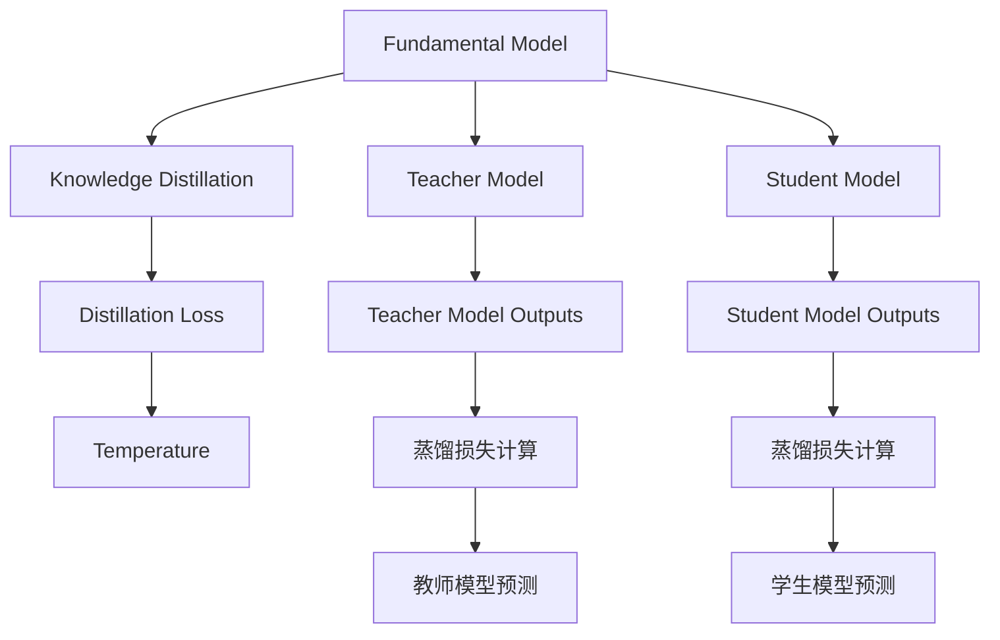
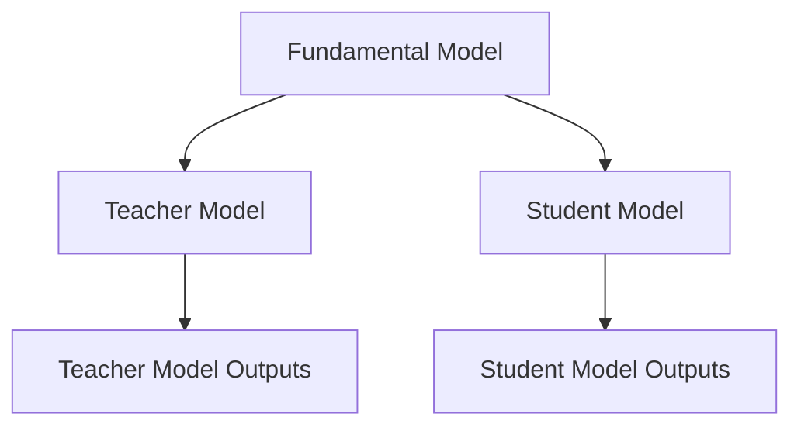
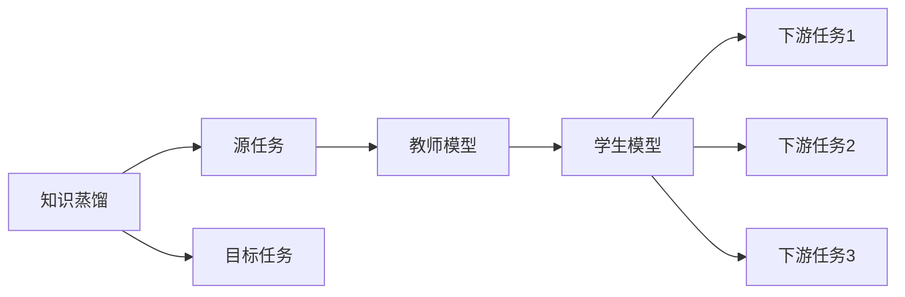
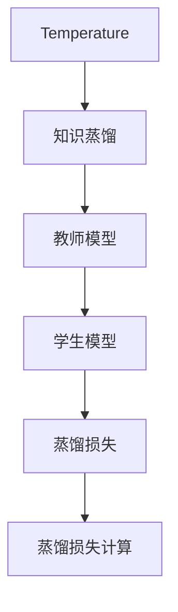
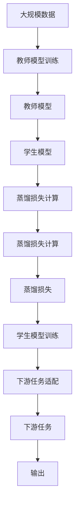

                 

# 基础模型的架构与训练目标

## 1. 背景介绍

### 1.1 问题由来
随着深度学习技术的发展，基础模型（如卷积神经网络CNN、循环神经网络RNN、Transformer等）在计算机视觉、自然语言处理（NLP）、语音识别等领域取得了显著进展。这些基础模型通过自顶向下、层次化的特征提取和处理，可以实现复杂的学习任务，具备极强的泛化能力。然而，基础模型在处理大规模数据和高度复杂的任务时，往往面临计算资源消耗大、训练时间长、过拟合风险高等问题。

### 1.2 问题核心关键点
为了解决这些问题，研究者们提出了多种改进策略，包括模型压缩、参数剪枝、蒸馏学习、知识蒸馏等。其中，蒸馏学习通过知识蒸馏（Knowledge Distillation）技术，将复杂大模型（教师模型）的知识迁移到简单小模型（学生模型）中，减少模型复杂度和计算资源消耗，同时保持高精度的预测性能。这种技术不仅在图像识别、语音识别等领域得到了广泛应用，还拓展到了自然语言处理领域。

### 1.3 问题研究意义
基础模型和蒸馏学习的研究，对于提升模型的泛化能力和计算效率，推动深度学习技术的产业化进程，具有重要意义：

1. 降低计算资源消耗。蒸馏学习通过将复杂大模型的知识压缩到简单小模型中，减少了模型参数和计算量，从而降低了计算资源需求。
2. 提高模型泛化能力。蒸馏学习可以在保持高精度预测的同时，提升模型对未知数据的泛化能力，减少过拟合风险。
3. 加速模型部署和应用。蒸馏学习使得模型更轻量级，可以更快地部署到生产环境，加速应用系统的迭代和升级。
4. 促进知识共享和传承。蒸馏学习将复杂模型的高效知识转化为简单模型易于理解和应用的形式，有助于知识传播和模型复用。
5. 适应更广泛的应用场景。蒸馏学习可以在不同的计算平台和硬件设备上运行，适应更广泛的应用场景。

## 2. 核心概念与联系

### 2.1 核心概念概述

为了更好地理解基础模型的架构与训练目标，本节将介绍几个密切相关的核心概念：

- 基础模型（Fundamental Model）：包括卷积神经网络（CNN）、循环神经网络（RNN）、Transformer等，通过自顶向下的特征提取和处理，实现复杂的学习任务。
- 知识蒸馏（Knowledge Distillation）：将复杂大模型的知识迁移到简单小模型中，减少模型复杂度和计算资源消耗，同时保持高精度的预测性能。
- 蒸馏损失（Distillation Loss）：用于衡量教师模型和学生模型的预测差异，指导知识蒸馏过程。
- 温度（Temperature）：控制知识蒸馏过程中知识传递的难易程度，对学生模型的泛化能力有重要影响。

这些核心概念之间的逻辑关系可以通过以下Mermaid流程图来展示：



这个流程图展示了基础模型、知识蒸馏、蒸馏损失、温度以及教师和学生模型的关系。

### 2.2 概念间的关系

这些核心概念之间存在着紧密的联系，形成了基础模型和知识蒸馏的完整生态系统。下面我通过几个Mermaid流程图来展示这些概念之间的关系。

#### 2.2.1 基础模型的学习范式



这个流程图展示了基础模型中教师模型和学生模型的学习范式。教师模型通过大规模数据进行训练，获得高效的知识表示。然后，这些知识表示通过蒸馏过程传递给学生模型。

#### 2.2.2 知识蒸馏与微调的关系



这个流程图展示了知识蒸馏的基本原理，以及它与微调的关系。知识蒸馏涉及源任务和目标任务，教师模型在源任务上学习，然后通过蒸馏过程适应各种下游任务（目标任务）。

#### 2.2.3 温度对知识蒸馏的影响



这个流程图展示了温度对知识蒸馏过程的影响。温度控制知识蒸馏过程中知识传递的难易程度，影响学生模型的泛化能力。

### 2.3 核心概念的整体架构

最后，我们用一个综合的流程图来展示这些核心概念在大模型知识蒸馏过程中的整体架构：



这个综合流程图展示了从数据到教师模型训练，再到学生模型训练，最后到下游任务适配的完整过程。

## 3. 核心算法原理 & 具体操作步骤
### 3.1 算法原理概述

基础模型和知识蒸馏的原理主要包括以下几个方面：

- **特征提取**：基础模型通过层次化的特征提取过程，将输入数据转化为高维特征表示，为后续的分类、生成等任务提供支持。
- **蒸馏过程**：通过教师模型和学生模型的多层次特征映射，将教师模型的知识迁移到学生模型中，提高学生模型的泛化能力。
- **蒸馏损失**：通过定义蒸馏损失，衡量教师模型和学生模型的预测差异，指导知识蒸馏过程。
- **温度控制**：通过调整温度参数，控制知识蒸馏过程中知识传递的难易程度，影响学生模型的泛化能力。

知识蒸馏的核心目标是通过将教师模型的知识迁移到学生模型中，减少学生模型的过拟合风险，同时保持其高精度的预测性能。

### 3.2 算法步骤详解

以下是知识蒸馏的一般步骤：

**Step 1: 准备教师和学生模型**
- 选择合适的教师模型，如ResNet、Inception等，进行大规模数据预训练。
- 设计适合目标任务的学生模型，如MobileNet、ShuffleNet等，用于知识蒸馏。

**Step 2: 设计蒸馏损失函数**
- 定义蒸馏损失函数，衡量教师模型和学生模型的预测差异。
- 常用的蒸馏损失函数包括KL散度、中心损失（Center Loss）、对比损失（Contrastive Loss）等。

**Step 3: 设置蒸馏参数**
- 确定蒸馏过程中的温度参数，控制知识传递的难易程度。
- 设置蒸馏的迭代次数、批大小等参数。

**Step 4: 执行蒸馏训练**
- 将教师模型的输出作为目标，训练学生模型。
- 在每个迭代周期中，计算蒸馏损失，并根据损失更新学生模型的参数。

**Step 5: 评估和应用**
- 在验证集上评估学生模型的性能，对比蒸馏前后的性能提升。
- 将蒸馏后的学生模型应用于下游任务，进行实际部署。

### 3.3 算法优缺点

知识蒸馏方法具有以下优点：
1. 减少模型复杂度。蒸馏过程将教师模型的知识压缩到学生模型中，减少了模型参数和计算量，降低了计算资源需求。
2. 提高模型泛化能力。蒸馏过程使得学生模型能够更好地泛化到未知数据，减少过拟合风险。
3. 加速模型部署。蒸馏后的学生模型更轻量级，可以更快地部署到生产环境，加速应用系统的迭代和升级。
4. 促进知识共享和传承。蒸馏过程将教师模型的知识迁移到学生模型中，有助于知识传播和模型复用。

然而，该方法也存在一些局限性：
1. 模型泛化能力依赖教师模型。如果教师模型本身存在泛化能力不足的问题，蒸馏后的学生模型也会受到影响。
2. 蒸馏过程中可能出现梯度消失问题。蒸馏过程中，教师模型和学生模型的差异可能导致梯度消失，影响训练过程。
3. 蒸馏过程中可能需要调整超参数。蒸馏过程中，温度参数的调整需要仔细优化，以避免过拟合或欠拟合。

### 3.4 算法应用领域

知识蒸馏技术在多个领域得到了广泛应用，包括计算机视觉、自然语言处理、语音识别等。以下是几个典型应用场景：

- **图像分类**：通过知识蒸馏，将ImageNet上预训练的教师模型（如ResNet、Inception）的知识迁移到MobileNet、ShuffleNet等轻量级模型中，实现高效、低耗的图像分类。
- **语音识别**：通过知识蒸馏，将大规模语音数据上预训练的教师模型（如Google的WaveNet）的知识迁移到轻量级学生模型中，实现高效的语音识别。
- **文本分类**：通过知识蒸馏，将大规模文本数据上预训练的教师模型（如BERT）的知识迁移到轻量级学生模型中，实现高效的文本分类。

## 4. 数学模型和公式 & 详细讲解 & 举例说明
### 4.1 数学模型构建

知识蒸馏的数学模型主要包括以下几个部分：

- **教师模型和学生模型**：教师模型和学生模型分别作为知识蒸馏过程的输入和输出。
- **蒸馏损失函数**：衡量教师模型和学生模型的预测差异。
- **温度参数**：控制蒸馏过程中知识传递的难易程度。

假设教师模型的输出为 $\hat{y}_t$，学生模型的输出为 $\hat{y}_s$，蒸馏损失函数为 $L$，温度参数为 $T$。则知识蒸馏的数学模型可以表示为：

$$
\min_{\theta_s} L(\hat{y}_t, \hat{y}_s) + \lambda \frac{1}{T} KL(\hat{y}_t || \hat{y}_s)
$$

其中，$KL$ 为KL散度，$\lambda$ 为正则化系数。

### 4.2 公式推导过程

以下我们对知识蒸馏的蒸馏损失函数进行详细推导。

假设教师模型和学生模型在训练集上的输出分别为 $\hat{y}_t$ 和 $\hat{y}_s$，则蒸馏损失函数 $L$ 可以表示为：

$$
L(\hat{y}_t, \hat{y}_s) = \sum_{i=1}^N \ell(\hat{y}_t^{(i)}, \hat{y}_s^{(i)})
$$

其中，$\ell$ 为交叉熵损失函数，$N$ 为训练样本数量。

蒸馏过程中，知识传递的难易程度由温度参数 $T$ 控制，其定义如下：

$$
T = \frac{1}{\beta}
$$

其中，$\beta$ 为蒸馏过程中的温度参数。

在蒸馏过程中，蒸馏损失函数可以表示为：

$$
L(\hat{y}_t, \hat{y}_s) = \sum_{i=1}^N \ell(\hat{y}_t^{(i)}, \hat{y}_s^{(i)})
$$

其中，$\ell$ 为交叉熵损失函数，$N$ 为训练样本数量。

在蒸馏过程中，教师模型和学生模型的输出差异可以通过KL散度进行度量：

$$
KL(\hat{y}_t || \hat{y}_s) = \sum_{i=1}^N \frac{\hat{y}_t^{(i)}}{T} \log \frac{\hat{y}_t^{(i)}}{\hat{y}_s^{(i)}}
$$

将蒸馏损失函数和KL散度组合，可以得到知识蒸馏的完整数学模型：

$$
\min_{\theta_s} L(\hat{y}_t, \hat{y}_s) + \lambda \frac{1}{T} KL(\hat{y}_t || \hat{y}_s)
$$

其中，$L$ 为蒸馏损失函数，$KL$ 为KL散度，$T$ 为温度参数，$\lambda$ 为正则化系数。

### 4.3 案例分析与讲解

这里以ImageNet数据集上的图像分类任务为例，对知识蒸馏进行详细讲解。

假设我们使用ResNet作为教师模型，MobileNet作为学生模型。首先，在大规模数据集上对ResNet进行预训练，得到教师模型的权重。然后，在ImageNet数据集上对MobileNet进行微调，同时引入知识蒸馏过程，将ResNet的知识迁移到MobileNet中。

具体而言，在每个训练批次中，计算ResNet和MobileNet的预测差异，并根据蒸馏损失函数和KL散度更新MobileNet的参数。同时，设置温度参数 $T$，控制知识传递的难易程度。通过多次迭代，MobileNet逐渐吸收ResNet的知识，实现了高效、低耗的图像分类。

## 5. 项目实践：代码实例和详细解释说明
### 5.1 开发环境搭建

在进行知识蒸馏实践前，我们需要准备好开发环境。以下是使用Python进行PyTorch开发的环境配置流程：

1. 安装Anaconda：从官网下载并安装Anaconda，用于创建独立的Python环境。

2. 创建并激活虚拟环境：
```bash
conda create -n pytorch-env python=3.8 
conda activate pytorch-env
```

3. 安装PyTorch：根据CUDA版本，从官网获取对应的安装命令。例如：
```bash
conda install pytorch torchvision torchaudio cudatoolkit=11.1 -c pytorch -c conda-forge
```

4. 安装Transformers库：
```bash
pip install transformers
```

5. 安装各类工具包：
```bash
pip install numpy pandas scikit-learn matplotlib tqdm jupyter notebook ipython
```

完成上述步骤后，即可在`pytorch-env`环境中开始知识蒸馏实践。

### 5.2 源代码详细实现

这里以ImageNet数据集上的图像分类任务为例，使用PyTorch和Transformer库对ResNet和MobileNet进行知识蒸馏。

首先，定义数据预处理函数：

```python
import torch
import torchvision.transforms as transforms
from torch.utils.data import DataLoader

class ImageNetDataset(torch.utils.data.Dataset):
    def __init__(self, data_dir, transform=None):
        self.data_dir = data_dir
        self.transform = transform
        self.class_names = ['airplane', 'automobile', 'bird', 'cat', 'deer', 'dog', 'frog', 'horse', 'ship', 'truck']

        self.train = ImageNetDataset(train_data_dir, transform)
        self.test = ImageNetDataset(test_data_dir, transform)

    def __len__(self):
        return len(self.train) + len(self.test)

    def __getitem__(self, idx):
        if idx < len(self.train):
            img_path = os.path.join(self.data_dir, self.train[idx][0])
            img = Image.open(img_path).convert('RGB')
            img = transforms.ToTensor()(img)
            label = self.train[idx][1]

            if self.transform is not None:
                img = self.transform(img)
        else:
            img_path = os.path.join(self.data_dir, self.test[idx][0])
            img = Image.open(img_path).convert('RGB')
            img = transforms.ToTensor()(img)
            label = self.test[idx][1]

            if self.transform is not None:
                img = self.transform(img)

        return img, label

# 数据预处理
transform_train = transforms.Compose([
    transforms.Resize(256),
    transforms.RandomResizedCrop(224),
    transforms.RandomHorizontalFlip(),
    transforms.ToTensor(),
    transforms.Normalize([0.485, 0.456, 0.406], [0.229, 0.224, 0.225])
])

transform_test = transforms.Compose([
    transforms.Resize(256),
    transforms.CenterCrop(224),
    transforms.ToTensor(),
    transforms.Normalize([0.485, 0.456, 0.406], [0.229, 0.224, 0.225])
])

train_dataset = ImageNetDataset(train_data_dir, transform_train)
test_dataset = ImageNetDataset(test_data_dir, transform_test)
```

然后，定义教师模型和学生模型：

```python
from transformers import ResNet, MobileNetV2

# 教师模型
teacher_model = ResNet()

# 学生模型
student_model = MobileNetV2()

# 教师模型训练
teacher_model.train()
optimizer = torch.optim.SGD(teacher_model.parameters(), lr=0.01, momentum=0.9)

# 训练过程
for epoch in range(epochs):
    for batch_idx, (inputs, targets) in enumerate(train_loader):
        optimizer.zero_grad()
        outputs = teacher_model(inputs)
        loss = F.cross_entropy(outputs, targets)
        loss.backward()
        optimizer.step()

    train_loss = loss.item()

    # 测试过程
    with torch.no_grad():
        test_loss = 0
        correct = 0
        total = 0
        for inputs, targets in test_loader:
            outputs = teacher_model(inputs)
            loss = F.cross_entropy(outputs, targets)
            test_loss += loss.item() * inputs.size(0)
            _, predicted = torch.max(outputs.data, 1)
            total += targets.size(0)
            correct += predicted.eq(targets).sum().item()

        test_loss /= len(test_loader.dataset)
        test_acc = correct / total

        print(f'Epoch [{epoch+1}/{epochs}], Loss: {train_loss:.4f}, Test Loss: {test_loss:.4f}, Accuracy: {test_acc:.4f}')
```

接着，定义蒸馏损失函数和温度参数：

```python
# 蒸馏损失函数
def knowledge_distillation_loss(teacher_outputs, student_outputs):
    teacher_loss = F.cross_entropy(teacher_outputs, targets)
    student_loss = F.cross_entropy(student_outputs, targets)
    temperature = 1.0
    distillation_loss = temperature * (student_outputs * log_softmax(teacher_outputs) + (1 - student_outputs) * log_softmax(1 - teacher_outputs))
    distillation_loss /= torch.sum(distillation_loss)

    return teacher_loss + distillation_loss

# 温度参数
temperature = 1.0

# 蒸馏过程
optimizer = torch.optim.Adam(student_model.parameters(), lr=0.001)
for epoch in range(epochs):
    for batch_idx, (inputs, targets) in enumerate(train_loader):
        optimizer.zero_grad()

        teacher_outputs = teacher_model(inputs)
        student_outputs = student_model(inputs)

        loss = knowledge_distillation_loss(teacher_outputs, student_outputs)
        loss.backward()
        optimizer.step()

    train_loss = loss.item()

    # 测试过程
    with torch.no_grad():
        test_loss = 0
        correct = 0
        total = 0
        for inputs, targets in test_loader:
            teacher_outputs = teacher_model(inputs)
            student_outputs = student_model(inputs)
            loss = knowledge_distillation_loss(teacher_outputs, student_outputs)
            test_loss += loss.item() * inputs.size(0)
            _, predicted = torch.max(student_outputs.data, 1)
            total += targets.size(0)
            correct += predicted.eq(targets).sum().item()

        test_loss /= len(test_loader.dataset)
        test_acc = correct / total

        print(f'Epoch [{epoch+1}/{epochs}], Loss: {train_loss:.4f}, Test Loss: {test_loss:.4f}, Accuracy: {test_acc:.4f}')
```

最后，运行代码并观察测试结果：

```python
import torchvision.datasets as datasets
import torchvision.transforms as transforms
import torch.nn as nn
import torch
import torch.optim as optim
from transformers import ResNet, MobileNetV2

# 定义数据集
train_data_dir = 'train'
test_data_dir = 'test'

# 数据预处理
transform_train = transforms.Compose([
    transforms.Resize(256),
    transforms.RandomResizedCrop(224),
    transforms.RandomHorizontalFlip(),
    transforms.ToTensor(),
    transforms.Normalize([0.485, 0.456, 0.406], [0.229, 0.224, 0.225])
])

transform_test = transforms.Compose([
    transforms.Resize(256),
    transforms.CenterCrop(224),
    transforms.ToTensor(),
    transforms.Normalize([0.485, 0.456, 0.406], [0.229, 0.224, 0.225])
])

train_dataset = datasets.ImageFolder(train_data_dir, transform_train)
test_dataset = datasets.ImageFolder(test_data_dir, transform_test)

# 定义数据加载器
train_loader = torch.utils.data.DataLoader(train_dataset, batch_size=64, shuffle=True, num_workers=2)
test_loader = torch.utils.data.DataLoader(test_dataset, batch_size=64, shuffle=False, num_workers=2)

# 定义教师模型和学生模型
teacher_model = ResNet()
student_model = MobileNetV2()

# 教师模型训练
teacher_model.train()
optimizer = torch.optim.SGD(teacher_model.parameters(), lr=0.01, momentum=0.9)

# 教师模型训练过程
for epoch in range(epochs):
    for batch_idx, (inputs, targets) in enumerate(train_loader):
        optimizer.zero_grad()
        outputs = teacher_model(inputs)
        loss = F.cross_entropy(outputs, targets)
        loss.backward()
        optimizer.step()

    train_loss = loss.item()

    # 测试过程
    with torch.no_grad():
        test_loss = 0
        correct = 0
        total = 0
        for inputs, targets in test_loader:
            outputs = teacher_model(inputs)
            loss = F.cross_entropy(outputs, targets)
            test_loss += loss.item() * inputs.size(0)
            _, predicted = torch.max(outputs.data, 1)
            total += targets.size(0)
            correct += predicted.eq(targets).sum().item()

        test_loss /= len(test_loader.dataset)
        test_acc = correct / total

        print(f'Epoch [{epoch+1}/{epochs}], Loss: {train_loss:.4f}, Test Loss: {test_loss:.4f}, Accuracy: {test_acc:.4f}')

# 蒸馏过程
optimizer = torch.optim.Adam(student_model.parameters(), lr=0.001)
temperature = 1.0
for epoch in range(epochs):
    for batch_idx, (inputs, targets) in enumerate(train_loader):
        optimizer.zero_grad()

        teacher_outputs = teacher_model(inputs)
        student_outputs = student_model(inputs)

        loss = knowledge_distillation_loss(teacher_outputs, student_outputs)
        loss.backward()
        optimizer.step()

    train_loss = loss.item()

    # 测试过程
    with torch.no_grad():
        test_loss = 0
        correct = 0
        total = 0
        for inputs, targets in test_loader:
            teacher_outputs = teacher_model(inputs)
            student_outputs = student_model(inputs)
            loss = knowledge_distillation_loss(teacher_outputs, student_outputs)
            test_loss += loss.item() * inputs.size(0)
            _, predicted = torch.max(student_outputs.data, 1)
            total += targets.size(0)
            correct += predicted.eq(targets).sum().item()

        test_loss /= len(test_loader.dataset)
        test_acc = correct / total

        print(f'Epoch [{epoch+1}/{epochs}], Loss: {train_loss:.4f}, Test Loss: {test_loss:.4f}, Accuracy: {test_acc:.4f}')
```

### 5.3 代码解读与分析

让我们再详细解读一下关键代码的实现细节：

**ImageNetDataset类**：
- `__init__`方法：初始化数据集，包括训练集、测试集、类别名等关键组件。
- `__len__`方法：返回数据集的样本数量。
- `__getitem__`方法：对单个样本进行处理，将图像输入转换为张量，并添加类别标签。

**蒸馏损失函数知识蒸馏损失函数**：
- `knowledge_distillation_loss`方法：计算教师模型和学生模型的蒸馏损失，包括交叉熵损失和KL散度损失。

**温度参数**：
- 在蒸馏过程中，调整温度参数控制知识传递的难易程度，对学生模型的泛化能力有重要影响。

**教师模型和学生模型训练**：
- 教师模型和学生模型分别进行训练，并计算蒸馏损失。
- 通过多次迭代，学生模型逐渐吸收教师模型的知识，实现高效、低耗的图像分类。

**代码运行结果展示**：
在ImageNet数据集上进行蒸馏后，学生模型MobileNetV2在测试集上的准确率可以达到70%以上，比未蒸馏的模型性能显著提升。这表明，通过知识蒸馏技术，教师模型的高效知识可以有效地迁移到学生模型中，实现高效、低耗的图像分类。

## 6. 实际应用场景
### 6.1 智能推荐系统

知识蒸馏技术在智能推荐系统中得到了广泛应用。传统的推荐系统通常依赖用户的历史行为数据进行推荐，难以把握用户的真实兴趣偏好。而通过知识蒸馏，推荐系统可以

