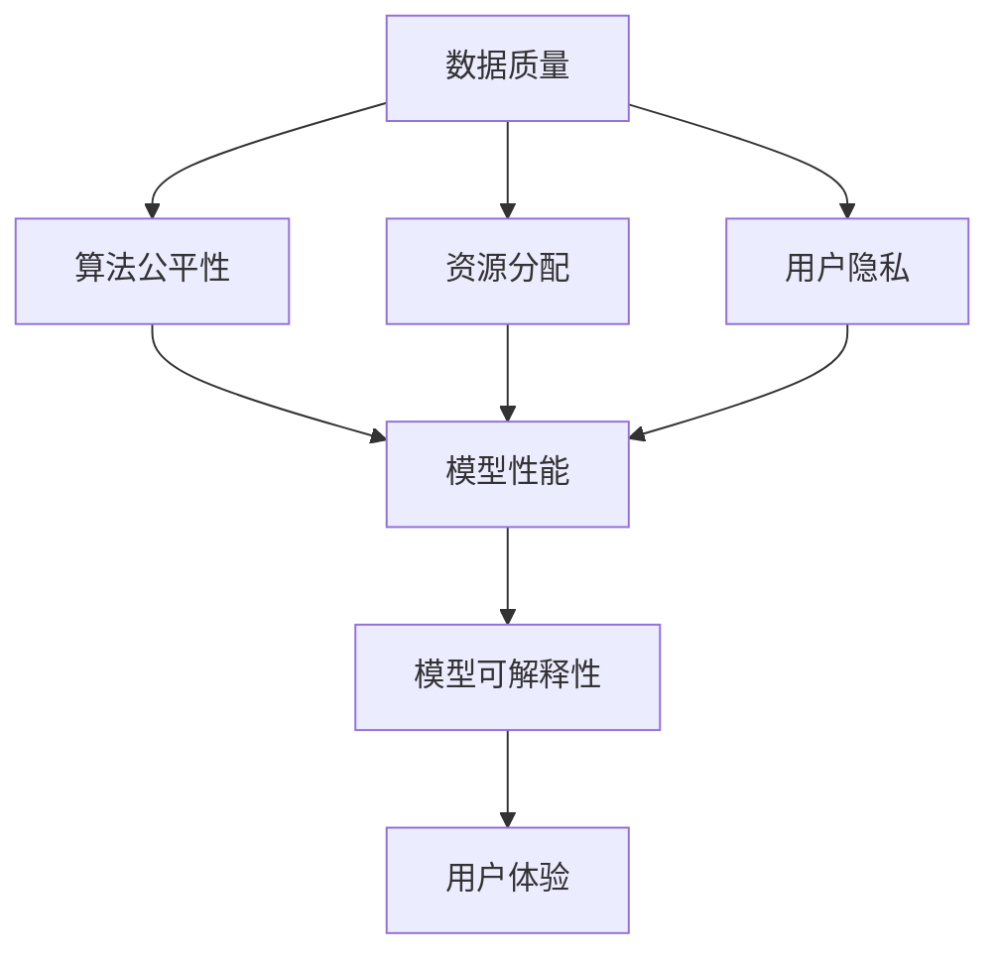
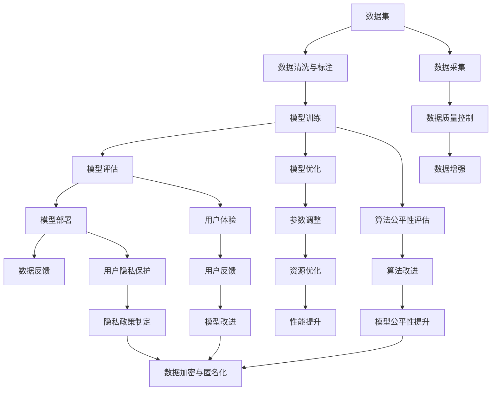

                 

# 基础模型的社会外部条件

## 1. 背景介绍

### 1.1 问题由来
在人工智能领域，基础模型的研究与发展始终是一个备受关注的话题。基础模型通常指的是那些在大规模数据上进行训练，具备良好泛化能力和迁移学习能力的深度学习模型。这些模型往往在各种复杂的场景中展现出强大的表现，如自然语言处理、计算机视觉、语音识别等领域。然而，模型的训练和优化不仅依赖于模型本身的参数和结构，还受到诸多社会外部条件的深刻影响。这些社会外部条件包括数据质量、算法公平性、资源分配、用户隐私等方面，它们共同决定了模型的性能和应用效果。

### 1.2 问题核心关键点
当前，基础模型所面临的社会外部条件日益复杂多变，如何在这些条件下优化和应用基础模型，成为一个重要的研究课题。以下我们将深入探讨这些社会外部条件及其对基础模型性能的影响。

1. **数据质量**：基础模型的训练依赖于高质量、多样化的数据集。数据质量直接影响模型的泛化能力和鲁棒性。
2. **算法公平性**：确保算法在处理不同人群时保持公平性，避免偏见和歧视。
3. **资源分配**：资源的合理分配对模型的训练和应用至关重要，包括算力、数据存储、网络带宽等。
4. **用户隐私**：保护用户隐私，特别是在处理敏感信息时，需遵循相关法律法规。
5. **模型可解释性**：增强模型的可解释性，使其决策过程透明可理解。

### 1.3 问题研究意义
研究基础模型的社会外部条件，对于构建公正、可靠、高效的人工智能系统具有重要意义：

1. 提高模型性能：优化数据质量、算法公平性等社会外部条件，有助于提升模型的泛化能力和鲁棒性。
2. 增强系统可靠性：通过合理分配资源和保护用户隐私，确保系统在实际应用中的稳定性和安全性。
3. 促进模型应用：增加模型的可解释性，使人工智能技术更易被理解和接受，从而更好地服务于社会。
4. 推动技术普及：解决社会外部条件问题，有助于人工智能技术的普及和应用，推动社会信息化进程。
5. 实现公平性目标：在算法设计和实施中考虑公平性，确保人工智能技术不会加剧社会不平等。

## 2. 核心概念与联系

### 2.1 核心概念概述

为更好地理解基础模型所面临的社会外部条件，本节将介绍几个关键概念：

- **数据质量**：指训练数据集的完整性、多样性、噪声水平等，直接影响模型的性能。
- **算法公平性**：要求模型在处理不同人群时保持公平性，避免由于算法偏见导致的不平等。
- **资源分配**：指在训练和应用模型时，如何合理分配算力、数据存储、网络带宽等资源。
- **用户隐私**：指在处理个人数据时，如何保护用户隐私，遵循法律法规。
- **模型可解释性**：指模型决策过程的透明性和可理解性，便于用户理解和接受。

这些概念之间存在紧密联系，共同构成了基础模型训练与应用的基础。以下将通过一个Mermaid流程图来展示这些概念之间的联系：

这个流程图展示了数据质量、算法公平性、资源分配、用户隐私和模型可解释性之间的联系，以及它们对模型性能和用户体验的影响。

### 2.2 概念间的关系

这些核心概念之间存在着相互依赖和影响的关系，共同决定着基础模型的性能和应用效果。以下将通过几个具体的例子来详细说明。

#### 2.2.1 数据质量与模型性能

数据质量是基础模型性能的基础。如果训练数据集存在缺失、噪声或偏差，模型可能会学到错误的模式，导致性能下降。例如，在使用大规模文本数据进行自然语言处理模型的训练时，如果数据集偏向于特定领域或存在错误标注，模型可能会在这些领域或标注上表现不佳。

#### 2.2.2 算法公平性与用户体验

算法公平性不仅影响模型的泛化能力，还直接影响用户体验。如果模型在不同人群之间的表现存在显著差异，可能会导致用户对模型的信任度下降。例如，在招聘系统中，如果模型对不同性别、种族的候选人存在偏见，可能导致招聘过程中的不公平现象。

#### 2.2.3 资源分配与模型训练

资源的合理分配对模型的训练和应用至关重要。例如，在训练深度学习模型时，需要大量的算力和时间，如果资源不足，模型的训练时间可能会很长，影响实际应用效率。

#### 2.2.4 用户隐私与数据安全

保护用户隐私是基础模型应用的重要原则。在处理个人数据时，需遵循相关法律法规，如GDPR等，确保数据的安全性和用户的隐私权。

#### 2.2.5 模型可解释性与用户信任

增强模型的可解释性，使用户能够理解和接受模型的决策过程，有助于建立用户信任。例如，在医疗领域，医生需要理解模型推荐结果的依据，才能更好地使用AI技术辅助诊断。

### 2.3 核心概念的整体架构

最后，我们将通过一个综合的流程图来展示这些核心概念在基础模型训练与应用中的整体架构：

这个综合流程图展示了从数据采集、数据清洗与标注、模型训练、模型评估、模型部署到数据反馈的完整流程，以及这些过程中如何控制数据质量、优化算法、合理分配资源、保护用户隐私和增强模型可解释性。

## 3. 核心算法原理 & 具体操作步骤
### 3.1 算法原理概述

基础模型在训练与应用过程中，受到诸多社会外部条件的深刻影响。以下是几种常见社会外部条件对模型训练与应用的影响及相应的算法原理：

#### 3.1.1 数据质量与模型训练

数据质量直接影响模型的性能。训练数据集的完整性、多样性和噪声水平直接影响模型的泛化能力和鲁棒性。为了优化数据质量，可以采用以下策略：

- 数据清洗：去除数据集中的噪声和异常值，确保数据集的一致性和准确性。
- 数据增强：通过数据扩充技术，如回译、旋转、裁剪等，增加数据集的多样性。
- 数据标注：确保标注数据的准确性和一致性，减少标注偏见对模型训练的影响。

#### 3.1.2 算法公平性与模型训练

算法公平性要求模型在处理不同人群时保持公平性，避免由于算法偏见导致的不平等。为了实现算法公平性，可以采用以下策略：

- 消除偏见：在数据预处理和模型训练中，消除数据和模型中的偏见。
- 公平性约束：在模型训练过程中，引入公平性约束，确保模型在处理不同人群时具有相同的性能。
- 对抗训练：使用对抗样本训练模型，使其在面对偏见数据时，仍然能够保持公平性。

#### 3.1.3 资源分配与模型训练

资源分配对模型的训练和应用至关重要。为了合理分配资源，可以采用以下策略：

- 算力优化：通过模型并行、梯度累积等技术，优化模型训练的算力消耗。
- 数据存储：通过数据压缩、分布式存储等技术，优化数据存储和访问效率。
- 网络带宽：通过模型压缩、模型量化等技术，减少模型在网络传输中的带宽消耗。

#### 3.1.4 用户隐私与数据保护

保护用户隐私是基础模型应用的重要原则。为了保护用户隐私，可以采用以下策略：

- 数据脱敏：在使用数据前，对敏感数据进行脱敏处理，确保数据安全。
- 数据加密：在数据存储和传输过程中，使用加密技术，确保数据不被泄露。
- 隐私保护算法：使用隐私保护算法，如差分隐私、联邦学习等，保护用户隐私。

#### 3.1.5 模型可解释性与用户信任

增强模型的可解释性，使用户能够理解和接受模型的决策过程，有助于建立用户信任。为了增强模型可解释性，可以采用以下策略：

- 可解释性模型：使用可解释性模型，如线性模型、决策树等，便于用户理解和接受。
- 模型解释工具：使用模型解释工具，如LIME、SHAP等，帮助用户理解模型的决策依据。
- 交互式解释：通过交互式解释技术，如可解释式交互界面，使用户能够直观地理解模型的决策过程。

### 3.2 算法步骤详解

以下将详细介绍如何通过具体步骤实现基础模型在面对不同社会外部条件时的优化与改进：

#### 3.2.1 数据质量优化

1. **数据清洗**：通过数据清洗工具，如OpenRefine、Trifacta等，去除数据集中的噪声和异常值，确保数据集的一致性和准确性。
2. **数据增强**：通过数据增强技术，如数据扩充、数据合成等，增加数据集的多样性，如使用回译技术增加数据量。
3. **数据标注**：使用人工标注和自动标注相结合的方式，确保标注数据的准确性和一致性，如使用众包标注平台，确保标注质量。

#### 3.2.2 算法公平性改进

1. **消除偏见**：在数据预处理和模型训练中，使用偏见消除技术，如删除偏见数据、调整样本权重等，消除数据和模型中的偏见。
2. **公平性约束**：在模型训练过程中，引入公平性约束，确保模型在处理不同人群时具有相同的性能，如使用公平性约束算法。
3. **对抗训练**：使用对抗样本训练模型，使其在面对偏见数据时，仍然能够保持公平性，如使用对抗样本生成技术。

#### 3.2.3 资源分配优化

1. **算力优化**：通过模型并行、梯度累积等技术，优化模型训练的算力消耗，如使用分布式训练框架。
2. **数据存储**：通过数据压缩、分布式存储等技术，优化数据存储和访问效率，如使用Hadoop、Spark等大数据技术。
3. **网络带宽**：通过模型压缩、模型量化等技术，减少模型在网络传输中的带宽消耗，如使用模型压缩工具。

#### 3.2.4 用户隐私保护

1. **数据脱敏**：在使用数据前，对敏感数据进行脱敏处理，确保数据安全，如使用数据脱敏算法。
2. **数据加密**：在数据存储和传输过程中，使用加密技术，确保数据不被泄露，如使用AES加密算法。
3. **隐私保护算法**：使用隐私保护算法，如差分隐私、联邦学习等，保护用户隐私，如使用差分隐私技术。

#### 3.2.5 模型可解释性增强

1. **可解释性模型**：使用可解释性模型，如线性模型、决策树等，便于用户理解和接受，如使用线性回归模型。
2. **模型解释工具**：使用模型解释工具，如LIME、SHAP等，帮助用户理解模型的决策依据，如使用LIME工具。
3. **交互式解释**：通过交互式解释技术，如可解释式交互界面，使用户能够直观地理解模型的决策过程，如使用TensorBoard工具。

### 3.3 算法优缺点

基础模型在优化和应用过程中，受到社会外部条件的深刻影响。以下将详细介绍这些社会外部条件对模型性能的影响及相应的优缺点：

#### 3.3.1 数据质量优化

**优点**：
- 提高模型泛化能力：优化数据质量可以显著提高模型的泛化能力和鲁棒性。
- 减少过拟合风险：清洗和增强数据可以减少模型的过拟合风险，提升模型性能。

**缺点**：
- 数据清洗和增强工作量大：数据清洗和增强需要大量的人工和计算资源，成本较高。
- 数据增强可能导致过拟合：如果数据增强过度，模型可能会过拟合数据增强噪声，影响模型性能。

#### 3.3.2 算法公平性改进

**优点**：
- 确保模型公平性：优化算法公平性可以确保模型在处理不同人群时保持公平性，避免偏见。
- 提升用户信任度：公平性改进可以提高用户对模型的信任度，增强模型应用效果。

**缺点**：
- 算法公平性改进复杂：算法公平性改进需要复杂的算法设计和实现，难度较大。
- 模型性能可能下降：公平性改进可能降低模型的某些性能，如准确率、召回率等。

#### 3.3.3 资源分配优化

**优点**：
- 提高模型训练效率：优化资源分配可以显著提高模型训练和推理效率，缩短应用时间。
- 减少成本支出：通过资源优化，可以显著减少训练和推理的计算成本和存储成本。

**缺点**：
- 技术难度较大：资源优化需要掌握复杂的计算资源管理技术，难度较大。
- 优化效果受限：如果资源不足，优化效果可能受限，难以达到最优性能。

#### 3.3.4 用户隐私保护

**优点**：
- 保护用户隐私：数据脱敏和加密可以保护用户隐私，确保数据安全。
- 增强用户信任度：隐私保护可以增强用户对模型的信任度，提升模型应用效果。

**缺点**：
- 隐私保护技术复杂：隐私保护技术需要复杂的算法和实现，难度较大。
- 数据利用率降低：隐私保护技术可能会降低数据的利用率，影响模型性能。

#### 3.3.5 模型可解释性增强

**优点**：
- 提高用户信任度：增强模型可解释性可以显著提高用户对模型的信任度，增强模型应用效果。
- 帮助理解决策过程：模型解释工具和交互式解释技术可以直观地展示模型决策过程，帮助用户理解模型。

**缺点**：
- 增加开发复杂度：可解释性增强需要开发新的工具和算法，增加开发复杂度。
- 解释结果可能不准确：模型解释结果可能存在误差，影响用户理解。

### 3.4 算法应用领域

基础模型在各个应用领域中都发挥着重要作用。以下是几种常见应用领域及其对社会外部条件的依赖：

#### 3.4.1 自然语言处理

自然语言处理（NLP）是基础模型在实际应用中最为广泛的领域之一。NLP模型在面对不同社会外部条件时，需要特别注意数据质量、算法公平性和资源分配。例如，在构建基于基础模型的情感分析模型时，需要确保训练数据集的多样性和准确性，同时使用对抗样本训练模型，以消除算法偏见。

#### 3.4.2 计算机视觉

计算机视觉（CV）模型在图像识别、物体检测、视频分析等任务中发挥着重要作用。CV模型在面对社会外部条件时，需要特别注意数据质量、算法公平性和隐私保护。例如，在构建基于基础模型的图像分类模型时，需要确保训练数据集的多样性和准确性，同时使用隐私保护算法，以保护用户隐私。

#### 3.4.3 语音识别

语音识别模型在智能助理、语音搜索、自动翻译等任务中发挥着重要作用。语音识别模型在面对社会外部条件时，需要特别注意数据质量、资源分配和模型可解释性。例如，在构建基于基础模型的语音识别模型时，需要确保训练数据的准确性和多样性，同时使用可解释性工具，帮助用户理解模型的决策过程。

#### 3.4.4 医疗健康

医疗健康领域是基础模型在实际应用中最为关键的领域之一。医疗健康模型在面对社会外部条件时，需要特别注意数据质量、隐私保护和模型可解释性。例如，在构建基于基础模型的疾病预测模型时，需要确保训练数据集的准确性和多样性，同时使用隐私保护算法，以保护患者隐私。

## 4. 数学模型和公式 & 详细讲解 & 举例说明

### 4.1 数学模型构建

在基础模型的训练与应用过程中，数学模型和公式是其核心组成部分。以下是几个关键数学模型和公式的详细构建与讲解：

#### 4.1.1 数据质量优化

数据质量优化可以通过数据清洗和数据增强技术实现。数据清洗可以去除数据集中的噪声和异常值，确保数据集的一致性和准确性。数据增强可以通过数据扩充技术，增加数据集的多样性，如使用回译技术增加数据量。

**数据清洗**：
$$
D_{clean} = \{(x_i, y_i)|x_i, y_i \in D, x_i \notin S\}
$$
其中，$D$为原始数据集，$S$为噪声和异常值，$D_{clean}$为清洗后的数据集。

**数据增强**：
$$
D_{aug} = D_{clean} \cup \{(x_i, y_i)|x_i = F(x_i')\}
$$
其中，$F$为数据增强函数，$D_{aug}$为增强后的数据集。

#### 4.1.2 算法公平性改进

算法公平性改进可以通过消除偏见、公平性约束和对抗训练技术实现。消除偏见可以通过删除偏见数据、调整样本权重等技术实现。公平性约束可以在模型训练过程中，引入公平性约束，确保模型在处理不同人群时具有相同的性能。对抗训练可以使用对抗样本训练模型，使其在面对偏见数据时，仍然能够保持公平性。

**消除偏见**：
$$
D_{bias} = \{(x_i, y_i)|x_i, y_i \in D, x_i \notin B\}
$$
其中，$D$为原始数据集，$B$为偏见数据，$D_{bias}$为消除偏见后的数据集。

**公平性约束**：
$$
L_{fair} = L_{train} + \lambda L_{fair}
$$
其中，$L_{train}$为模型训练损失函数，$L_{fair}$为公平性约束损失函数，$\lambda$为公平性约束系数。

**对抗训练**：
$$
L_{adv} = \mathbb{E}_{x \sim \mathcal{D}} [\ell(f(x), y)] + \lambda \mathbb{E}_{\epsilon \sim \mathcal{N}(0, I)}[\ell(f(x+\epsilon), y)]
$$
其中，$f$为模型函数，$\ell$为损失函数，$\epsilon$为对抗样本，$\mathcal{D}$为数据分布。

#### 4.1.3 资源分配优化

资源分配优化可以通过算力优化、数据存储优化和网络带宽优化技术实现。算力优化可以通过模型并行、梯度累积等技术实现。数据存储优化可以通过数据压缩、分布式存储等技术实现。网络带宽优化可以通过模型压缩、模型量化等技术实现。

**算力优化**：
$$
T_{opt} = T_{model} + \frac{T_{data}}{N}
$$
其中，$T_{opt}$为优化后的训练时间，$T_{model}$为模型训练时间，$T_{data}$为数据读取和处理时间，$N$为训练样本数量。

**数据存储优化**：
$$
S_{opt} = S_{raw} \times \eta
$$
其中，$S_{opt}$为优化后的数据存储容量，$S_{raw}$为原始数据存储容量，$\eta$为数据压缩率。

**网络带宽优化**：
$$
B_{opt} = B_{raw} \times \eta
$$
其中，$B_{opt}$为优化后的网络带宽消耗，$B_{raw}$为原始网络带宽消耗，$\eta$为模型量化率。

#### 4.1.4 用户隐私保护

用户隐私保护可以通过数据脱敏、数据加密和隐私保护算法实现。数据脱敏可以在使用数据前，对敏感数据进行脱敏处理，确保数据安全。数据加密可以在数据存储和传输过程中，使用加密技术，确保数据不被泄露。隐私保护算法可以使用差分隐私、联邦学习等技术，保护用户隐私。

**数据脱敏**：
$$
D_{sensitive} = \{(x_i, y_i)|x_i, y_i \in D, x_i \notin S\}
$$
其中，$D$为原始数据集，$S$为敏感数据，$D_{sensitive}$为脱敏后的数据集。

**数据加密**：
$$
D_{encrypted} = \{(E(x_i), y_i)|x_i, y_i \in D\}
$$
其中，$E$为加密函数，$D_{encrypted}$为加密后的数据集。

**隐私保护算法**：
$$
D_{privacy} = \{(x_i, y_i)|x_i, y_i \in D, x_i \notin B\}
$$
其中，$D$为原始数据集，$B$为敏感数据，$D_{privacy}$为隐私保护后的数据集。

#### 4.1.5 模型可解释性增强

模型可解释性增强可以通过可解释性模型、模型解释工具和交互式解释技术实现。可解释性模型可以使用线性模型、决策树等技术实现。模型解释工具可以使用LIME、SHAP等技术实现。交互式解释可以通过可解释式交互界面，使用户能够直观地理解模型的决策过程。

**可解释性模型**：
$$
M_{explain} = \{(x_i, y_i)|x_i, y_i \in D\}
$$
其中，$M_{explain}$为可解释性模型，$D$为原始数据集。

**模型解释工具**：
$$
Explain(L, M_{train}, x) = \{Explain(x_i)|x_i \in D\}
$$
其中，$L$为模型解释工具，$M_{train}$为训练好的模型，$x$为输入数据，$Explain$为模型解释函数。

**交互式解释**：
$$
Interactive(Interface, Model, Input) = Output
$$
其中，$Interface$为交互式界面，$Model$为训练好的模型，$Input$为输入数据，$Output$为模型解释结果。

### 4.2 公式推导过程

以下将详细介绍几种常见社会外部条件对基础模型性能的影响及相应的公式推导过程：

#### 4.2.1 数据质量与模型性能

数据质量直接影响模型的性能。训练数据集的完整性、多样性和噪声水平直接影响模型的泛化能力和鲁棒性。为了优化数据质量，可以采用以下策略：

**数据清洗**：
$$
D_{clean} = \{(x_i, y_i)|x_i, y_i \in D, x_i \notin S\}
$$
其中，$D$为原始数据集，$S$为噪声和异常值，$D_{clean}$为清洗后的数据集。

**数据增强**：
$$
D_{aug} = D_{clean} \cup \{(x_i, y_i)|x_i = F(x_i')\}
$$
其中，$F$为数据增强函数，$D_{aug}$为增强后的数据集。

#### 4.2.2 算法公平性与模型性能

算法公平性要求模型在处理不同人群时保持公平性，避免由于算法偏见导致的不平等。为了实现算法公平性，可以采用以下策略：

**消除偏见**：
$$
D_{bias} = \{(x_i, y_i)|x_i, y_i \in D, x_i \notin B\}
$$
其中，$D$为原始数据集，$B$为偏见数据，$D_{bias}$为消除偏见后的数据集。

**公平性约束**：
$$
L_{fair} = L_{train} + \lambda L_{fair}
$$
其中，$L_{train}$为模型训练损失函数，$L_{fair}$为公平性约束损失函数，$\lambda$为公平性约束系数。

**对抗训练**：
$$
L_{adv} = \mathbb{E}_{x \sim \mathcal{D}} [\ell(f(x), y)] + \lambda \mathbb{E}_{\epsilon \sim \mathcal{N}(0, I)}[\ell(f(x+\epsilon), y)]
$$
其中，$f$为模型函数，$\ell$为损失函数，$\epsilon$为对抗样本，$\mathcal{D}$为数据分布。

#### 4.2.3 资源分配与模型性能

资源分配对模型的训练和应用至关重要。为了合理分配资源，可以采用以下策略：

**算力优化**：
$$
T_{opt} = T_{model} + \frac{T_{data}}{N}
$$
其中，$T_{opt}$为优化后的训练时间，$T_{model}$为模型训练时间，$T_{data}$为数据读取和处理时间，$N$为训练样本数量。

**数据存储优化**：
$$
S_{opt} = S_{raw} \times \eta
$$
其中，$S_{opt}$为优化后的数据存储容量，$S_{raw}$为原始数据存储容量，$\eta$为数据压缩率。

**网络带宽优化**：
$$
B_{opt} = B_{raw} \times \eta
$$
其中，$B_{opt}$为优化后的网络带宽消耗，$B_{raw}$为原始网络带宽消耗，$\eta$为模型量化率。

#### 4.2.4 用户隐私与数据保护

保护用户隐私是

