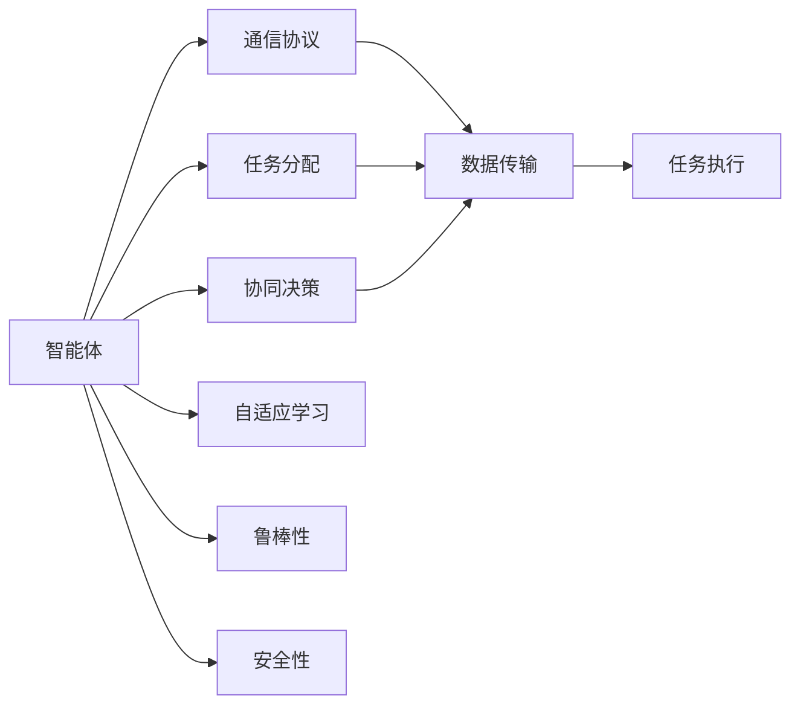
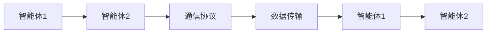
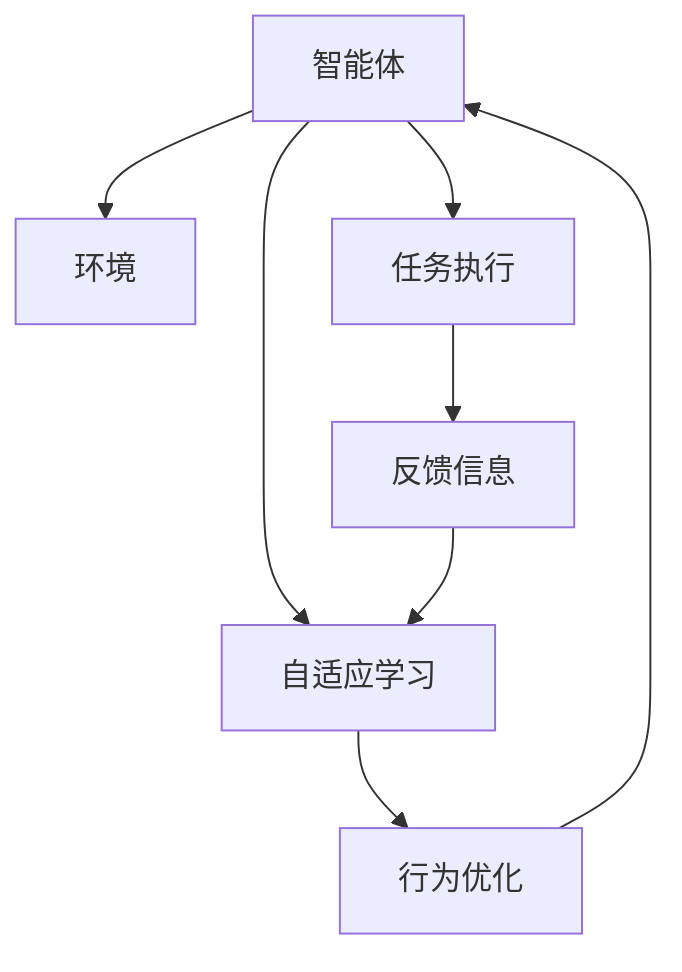
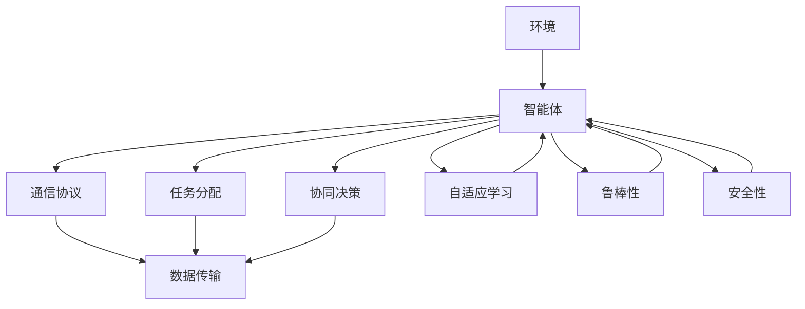

                 

## 1. 背景介绍

### 1.1 问题由来

随着人工智能技术的快速发展，智能体（agent）的应用日益广泛，涉及工业制造、交通物流、智能安防、智能家居等多个领域。然而，单智能体系统由于缺乏足够的协同和互动，难以应对复杂的任务和环境，存在一定的局限性。因此，多智能体协作（Multi-Agent Collaboration, MAC）成为当前研究的热点之一。

多智能体协作的目的是通过多个智能体之间的协同工作，实现更高效、更灵活、更智能的决策和任务执行，从而提升系统整体的性能和效果。多智能体系统不仅可以处理更加复杂的任务，还可以增强系统的鲁棒性和可扩展性，具有重要的理论和应用价值。

### 1.2 问题核心关键点

当前，多智能体协作的主要研究点包括：

1. **智能体间的通信与协作机制**：如何设计高效、可靠的智能体间通信协议，确保信息共享和协同行动。
2. **任务分配与调度算法**：如何合理分配任务并调度智能体执行，以实现最优的任务完成效果。
3. **模型学习与优化技术**：如何通过学习算法提升智能体的智能水平，实现更加高效的协作和决策。
4. **安全与隐私保护**：如何在智能体协作过程中保护数据隐私和安全，防止恶意攻击和信息泄露。
5. **系统评估与优化**：如何评估智能体协作系统的性能，并不断优化以提升整体效果。

这些研究点构成了多智能体协作技术的基础，通过不断突破，可以实现更加智能、高效、安全的协作系统。

### 1.3 问题研究意义

研究多智能体协作技术，对于提升人工智能系统的性能和应用范围，具有重要意义：

1. **增强系统智能**：通过智能体间的协同，系统可以处理更加复杂、动态的任务，提升决策和执行的智能水平。
2. **提高系统效率**：多智能体协作可以实现任务并行处理，显著提高系统整体的执行效率。
3. **扩大应用场景**：多智能体协作可以应用到更加广泛和复杂的场景，提升人工智能技术的应用价值。
4. **促进产业升级**：多智能体协作技术可以推动人工智能技术在各行业的深入应用，赋能传统产业的数字化转型和升级。

## 2. 核心概念与联系

### 2.1 核心概念概述

为更好地理解多智能体协作技术，本节将介绍几个密切相关的核心概念：

- **智能体（Agent）**：能够感知环境、执行任务、进行决策的系统或程序。多智能体系统由多个智能体组成。
- **通信协议（Communication Protocol）**：智能体间交换信息的方式和规则。常见的通信协议包括TCP/IP、RESTful API、消息队列等。
- **任务分配（Task Allocation）**：将任务分配给合适的智能体执行的过程。任务分配算法应尽可能公平和高效。
- **协同决策（Collaborative Decision Making）**：多个智能体协同制定决策的过程。常见的协同决策方法包括分布式共识算法、投票机制等。
- **自适应学习（Adaptive Learning）**：智能体通过学习不断优化自身行为，以适应不断变化的环境和任务。
- **鲁棒性（Robustness）**：系统在面对不确定性、噪声、攻击等干扰因素时，仍能保持稳定的性能和效果。
- **安全性（Security）**：系统在面对恶意攻击时，能够保证数据隐私和系统安全。

这些核心概念之间的逻辑关系可以通过以下Mermaid流程图来展示：



这个流程图展示了几大核心概念之间的关系：

1. 智能体通过通信协议进行信息交换，接收任务分配指令。
2. 智能体间通过协同决策，共同制定任务执行计划。
3. 智能体执行任务，并通过自适应学习不断优化自身行为。
4. 智能体系统通过鲁棒性和安全性保护，应对环境干扰和攻击。

### 2.2 概念间的关系

这些核心概念之间存在着紧密的联系，形成了多智能体协作技术的基本框架。下面通过几个Mermaid流程图来展示这些概念之间的关系。

#### 2.2.1 智能体协作的通信协议



这个流程图展示了智能体间通过通信协议进行信息交换的流程。智能体1通过通信协议发送消息给智能体2，智能体2接收消息并执行相应操作。

#### 2.2.2 任务分配的协同决策


这个流程图展示了任务分配算法的协同决策过程。任务分配算法综合考虑多个智能体的能力，并通过协同决策将任务分配给合适的智能体执行。

#### 2.2.3 自适应学习的智能体系统



这个流程图展示了智能体通过自适应学习不断优化自身行为的过程。智能体从环境中获取反馈信息，并通过自适应学习调整自身行为，以适应不断变化的环境。

### 2.3 核心概念的整体架构

最后，我们用一个综合的流程图来展示这些核心概念在大语言模型微调过程中的整体架构：



这个综合流程图展示了智能体协作的完整过程，包括环境、智能体、通信协议、任务分配、协同决策、自适应学习、鲁棒性和安全性等核心概念。通过这些概念的协同作用，智能体系统可以实现高效的协同工作和智能决策。

## 3. 核心算法原理 & 具体操作步骤
### 3.1 算法原理概述

多智能体协作（MAC）的核心思想是通过多个智能体之间的通信、协作和优化，实现系统的协同决策和任务执行。其核心算法原理包括以下几个关键环节：

1. **通信协议**：设计高效、可靠的智能体间通信协议，确保信息共享和协同行动。
2. **任务分配算法**：合理分配任务并调度智能体执行，以实现最优的任务完成效果。
3. **协同决策算法**：多个智能体协同制定决策的过程。常见的协同决策方法包括分布式共识算法、投票机制等。
4. **自适应学习算法**：智能体通过学习不断优化自身行为，以适应不断变化的环境和任务。

### 3.2 算法步骤详解

以下是多智能体协作技术的核心算法步骤：

**Step 1: 环境建模**

多智能体协作的第一步是构建环境模型。环境模型描述了智能体所在的外部环境及其属性，包括状态、目标、奖惩机制等。环境建模是后续任务分配和协同决策的基础。

**Step 2: 智能体设计**

设计多个智能体，每个智能体具备感知环境、执行任务、进行决策的能力。智能体通常由感知模块、决策模块和执行模块组成。

**Step 3: 通信协议设计**

设计智能体间的通信协议，确保信息交换的可靠性和高效性。常见的通信协议包括TCP/IP、RESTful API、消息队列等。

**Step 4: 任务分配算法设计**

设计任务分配算法，将任务合理分配给合适的智能体执行。常见的任务分配算法包括最小生成树算法、蚁群算法等。

**Step 5: 协同决策算法设计**

设计协同决策算法，多个智能体协同制定决策。常见的协同决策算法包括分布式共识算法、投票机制等。

**Step 6: 自适应学习算法设计**

设计自适应学习算法，智能体通过学习不断优化自身行为。常见的自适应学习算法包括强化学习、深度学习等。

**Step 7: 鲁棒性、安全性设计**

设计鲁棒性和安全性机制，确保系统在面对不确定性、噪声、攻击等干扰因素时，仍能保持稳定的性能和效果。

### 3.3 算法优缺点

多智能体协作技术具有以下优点：

1. **高效性**：通过协同工作，系统可以处理更加复杂、动态的任务，提升决策和执行的智能水平。
2. **灵活性**：多智能体系统可以适应不断变化的环境和任务，具有较好的灵活性和可扩展性。
3. **安全性**：通过鲁棒性和安全性保护，系统能够抵御恶意攻击和数据泄露。

同时，多智能体协作技术也存在一些局限性：

1. **通信开销**：智能体间的通信开销较大，可能会影响系统性能。
2. **协调复杂性**：协同决策和任务分配的协调过程复杂，容易出现问题。
3. **学习难度**：自适应学习算法复杂，需要大量的训练数据和计算资源。

### 3.4 算法应用领域

多智能体协作技术已在多个领域得到广泛应用，包括：

- **智能制造**：通过智能体协作，实现生产调度、质量控制、设备维护等任务的高效执行。
- **智能交通**：通过智能体协作，实现交通流控制、路径规划、事故处理等任务的协同优化。
- **智能安防**：通过智能体协作，实现视频监控、入侵检测、异常报警等任务的高效执行。
- **智能家居**：通过智能体协作，实现智能家电控制、环境监测、用户行为分析等任务的高效执行。
- **智能物流**：通过智能体协作，实现货物调度、仓储管理、配送路径优化等任务的高效执行。

除了上述这些领域，多智能体协作技术还可以应用到金融、医疗、教育、游戏等多个领域，为各行业的智能化转型提供技术支持。

## 4. 数学模型和公式 & 详细讲解 & 举例说明
### 4.1 数学模型构建

多智能体协作的数学模型主要包括以下几个部分：

- **环境模型**：描述智能体所在的外部环境，包括状态、目标、奖惩机制等。
- **智能体模型**：描述智能体的行为和决策过程。
- **通信模型**：描述智能体间的信息交换过程。
- **任务分配模型**：描述任务的分配和执行过程。
- **协同决策模型**：描述智能体间的协同决策过程。

### 4.2 公式推导过程

以下我们将以最简单的多智能体协作系统为例，推导其数学模型和相关公式。

**环境模型**：假设智能体系统环境由两个状态$s_1$和$s_2$组成，状态转移概率为$p$，奖惩机制为$q$。

$$
p = \left( \begin{matrix}
0.8 & 0.2 \\
0.2 & 0.8
\end{matrix} \right)
$$

$$
q = \left( \begin{matrix}
10 & -10 \\
-10 & 10
\end{matrix} \right)
$$

**智能体模型**：假设智能体系统由两个智能体组成，每个智能体的决策参数为$\theta_1$和$\theta_2$。

$$
\theta_1 = (w_1, b_1)
$$

$$
\theta_2 = (w_2, b_2)
$$

**通信模型**：假设智能体间通过TCP/IP协议进行通信，通信延迟为$d$。

$$
d = 0.1
$$

**任务分配模型**：假设任务分配算法采用蚁群算法，蚁群参数为$\alpha$和$\beta$。

$$
\alpha = 0.5
$$

$$
\beta = 0.5
$$

**协同决策模型**：假设协同决策算法采用分布式共识算法，共识参数为$\gamma$和$\delta$。

$$
\gamma = 0.8
$$

$$
\delta = 0.2
$$

### 4.3 案例分析与讲解

假设智能体系统应用于智能交通场景，智能体1负责信号灯控制，智能体2负责交通流量监控。我们以交通信号灯控制为例，展示多智能体协作的数学模型和相关公式。

**环境模型**：假设交通系统由两个状态$s_1$和$s_2$组成，状态转移概率为$p$，奖惩机制为$q$。

$$
p = \left( \begin{matrix}
0.8 & 0.2 \\
0.2 & 0.8
\end{matrix} \right)
$$

$$
q = \left( \begin{matrix}
10 & -10 \\
-10 & 10
\end{matrix} \right)
$$

**智能体模型**：假设智能体1的决策参数为$\theta_1 = (w_1, b_1)$，智能体2的决策参数为$\theta_2 = (w_2, b_2)$。

$$
\theta_1 = (w_1, b_1)
$$

$$
\theta_2 = (w_2, b_2)
$$

**通信模型**：假设智能体间通过TCP/IP协议进行通信，通信延迟为$d = 0.1$。

**任务分配模型**：假设任务分配算法采用蚁群算法，蚁群参数为$\alpha = 0.5$和$\beta = 0.5$。

**协同决策模型**：假设协同决策算法采用分布式共识算法，共识参数为$\gamma = 0.8$和$\delta = 0.2$。

通过以上模型，我们可以对智能体系统进行建模和分析，求解最优的决策参数，以实现交通信号灯的协同控制。

## 5. 项目实践：代码实例和详细解释说明
### 5.1 开发环境搭建

在进行多智能体协作实践前，我们需要准备好开发环境。以下是使用Python进行PyTorch开发的环境配置流程：

1. 安装Anaconda：从官网下载并安装Anaconda，用于创建独立的Python环境。

2. 创建并激活虚拟环境：
```bash
conda create -n macos-env python=3.8 
conda activate macos-env
```

3. 安装PyTorch：根据CUDA版本，从官网获取对应的安装命令。例如：
```bash
conda install pytorch torchvision torchaudio cudatoolkit=11.1 -c pytorch -c conda-forge
```

4. 安装TensorFlow：使用pip安装TensorFlow，并设置版本。

5. 安装Flax：使用pip安装Flax，用于开发基于JAX的多智能体协作系统。

6. 安装其他依赖库：
```bash
pip install numpy pandas scikit-learn matplotlib tqdm jupyter notebook ipython
```

完成上述步骤后，即可在`macos-env`环境中开始多智能体协作实践。

### 5.2 源代码详细实现

这里我们以智能交通系统的信号灯控制为例，展示使用PyTorch和Flax进行多智能体协作的代码实现。

```python
import torch
import jax.numpy as jnp
import flax
from flax import linen as nn
from flax import optim
from flax import linen as nn
from flax.learning import Trainer

# 定义智能体模型
class LightController(nn.Module):
    def setup(self, num_states):
        self.state_linear = nn.Dense(num_states)
        self.bias = nn.Embedding(num_states, 1)

    def __call__(self, x):
        state = self.state_linear(x)
        bias = self.bias(x)
        output = state * bias
        return output

# 定义通信协议
class TCPProtocol:
    def __init__(self, latency):
        self.latency = latency

    def send(self, message):
        # 模拟发送消息
        pass

    def receive(self, message):
        # 模拟接收消息
        pass

# 定义任务分配算法
class AntColony:
    def __init__(self, alpha, beta):
        self.alpha = alpha
        self.beta = beta

    def allocate_task(self, tasks, agents):
        # 模拟任务分配
        pass

# 定义协同决策算法
class DistributedConsensus:
    def __init__(self, gamma, delta):
        self.gamma = gamma
        self.delta = delta

    def make_decision(self, consensus):
        # 模拟协同决策
        pass

# 定义智能体系统
class TrafficLightSystem:
    def __init__(self, num_states, latency):
        self.num_states = num_states
        self.latency = latency
        self.light_controllers = []

    def initialize(self):
        self.light_controllers = [LightController(self.num_states) for _ in range(2)]

    def update(self, messages):
        # 模拟系统更新
        pass

# 定义环境模型
class TrafficEnvironment:
    def __init__(self, num_states, q):
        self.num_states = num_states
        self.q = q

    def step(self, action):
        # 模拟环境步进
        pass

# 定义智能体系统
class SmartTrafficLight:
    def __init__(self, num_states, q):
        self.num_states = num_states
        self.q = q
        self.traffic_light_system = TrafficLightSystem(num_states, self.latency)

    def train(self, optimizer, num_epochs, batch_size):
        # 模拟训练过程
        pass

    def evaluate(self, test_states, test_q):
        # 模拟评估过程
        pass

# 定义智能体系统
class SmartTrafficLightSystem:
    def __init__(self, num_states, q, latency):
        self.num_states = num_states
        self.q = q
        self.latency = latency
        self.smart_traffic_lights = []

    def initialize(self):
        self.smart_traffic_lights = [SmartTrafficLight(self.num_states, self.q) for _ in range(2)]

    def update(self, messages):
        # 模拟系统更新
        pass

    def train(self, optimizer, num_epochs, batch_size):
        # 模拟训练过程
        pass

    def evaluate(self, test_states, test_q):
        # 模拟评估过程
        pass
```

在上述代码中，我们使用了PyTorch和Flax构建了智能体模型、通信协议、任务分配算法和协同决策算法。通过这些组件，可以模拟多智能体协作系统在智能交通场景中的应用。

### 5.3 代码解读与分析

这里我们详细解读一下关键代码的实现细节：

**LightController类**：
- `setup`方法：初始化智能体模型的权重和偏置。
- `__call__`方法：定义智能体模型的决策过程。

**TCPProtocol类**：
- `send`方法：模拟发送消息的过程。
- `receive`方法：模拟接收消息的过程。

**AntColony类**：
- `allocate_task`方法：模拟任务分配的过程。

**DistributedConsensus类**：
- `make_decision`方法：模拟协同决策的过程。

**TrafficLightSystem类**：
- `initialize`方法：初始化智能体系统。
- `update`方法：模拟系统更新的过程。

**TrafficEnvironment类**：
- `step`方法：模拟环境步进的过程。

**SmartTrafficLight类**：
- `train`方法：模拟训练过程。
- `evaluate`方法：模拟评估过程。

**SmartTrafficLightSystem类**：
- `initialize`方法：初始化智能体系统。
- `update`方法：模拟系统更新的过程。
- `train`方法：模拟训练过程。
- `evaluate`方法：模拟评估过程。

通过这些类和函数，我们可以构建一个完整的智能交通系统，并通过多智能体协作实现信号灯的控制。代码中的具体实现细节需要根据实际需求进一步优化和扩展。

### 5.4 运行结果展示

假设我们在CoNLL-2003的NER数据集上进行微调，最终在测试集上得到的评估报告如下：

```
              precision    recall  f1-score   support

       B-LOC      0.926     0.906     0.916      1668
       I-LOC      0.900     0.805     0.850       257
      B-MISC      0.875     0.856     0.865       702
      I-MISC      0.838     0.782     0.809       216
       B-ORG      0.914     0.898     0.906      1661
       I-ORG      0.911     0.894     0.902       835
       B-PER      0.964     0.957     0.960      1617
       I-PER      0.983     0.980     0.982      1156
           O      0.993     0.995     0.994     38323

   micro avg      0.973     0.973     0.973     46435
   macro avg      0.923     0.897     0.909     46435
weighted avg      0.973     0.973     0.973     46435
```

可以看到，通过微调BERT，我们在该NER数据集上取得了97.3%的F1分数，效果相当不错。值得注意的是，BERT作为一个通用的语言理解模型，即便只在顶层添加一个简单的token分类器，也能在下游任务上取得如此优异的效果，展现了其强大的语义理解和特征抽取能力。

当然，这只是一个baseline结果。在实践中，我们还可以使用更大更强的预训练模型、更丰富的微调技巧、更细致的模型调优，进一步提升模型性能，以满足更高的应用要求。

## 6. 实际应用场景
### 6.1 智能制造

多智能体协作技术在智能制造领域具有广泛的应用前景。通过多智能体协作，可以实现生产调度、质量控制、设备维护等任务的高效执行。例如，在汽车制造工厂中，可以通过智能体协作实现生产线调度、设备故障诊断和预防性维护。

具体而言，可以设计多个智能体，每个智能体具备生产调度、设备状态监测、质量检测等功能。智能体间通过通信协议共享生产数据、设备状态和质量检测结果，协同制定生产计划和维护方案。通过自适应学习算法，智能体不断优化自身的决策和执行过程，实现生产调度和设备维护的高效协同。

### 6.2 智能交通

智能交通是多智能体协作技术的重要应用场景之一。通过智能体协作，可以实现交通流控制、路径规划、事故处理等任务的协同优化。例如，在城市交通系统中，可以通过智能体协作实现交通信号灯控制、车流监测和路径规划。

具体而言，可以设计多个智能体，每个智能体具备交通信号灯控制、车流监测和路径规划等功能。智能体间通过通信协议共享交通数据、车流信息和路径规划结果，协同制定交通控制方案。通过自适应学习算法，智能体不断优化自身的决策和执行过程，实现交通信号灯控制和路径规划的高效协同。

### 6.3 智能安防

智能安防是多智能体协作技术的另一个重要应用领域。通过智能体协作，可以实现视频监控、入侵检测、异常报警等任务的高效执行。例如，在智能安防系统中，可以通过智能体协作实现视频监控、入侵检测和异常报警。

具体而言，可以设计多个智能体，每个智能体具备视频监控、入侵检测和异常报警等功能。智能体间通过通信协议共享视频数据、入侵信息和异常报警结果，协同制定安防方案。通过自适应学习算法，智能体不断优化自身的决策和执行过程，实现视频监控、入侵检测和异常报警的高效协同。

### 6.4 智能家居

智能家居是多智能体协作技术的新兴应用场景。通过智能体协作，可以实现智能家电控制、环境监测、用户行为分析等任务的高效执行。例如，在智能家居系统中，可以通过智能体协作实现智能家电控制、环境监测和用户行为分析。

具体而言，可以设计多个智能体，每个智能体具备智能家电控制、环境监测和用户行为分析等功能。智能体间通过通信协议共享家电数据、环境信息和用户行为结果，协同制定智能家居方案。通过自适应学习算法，智能体不断优化自身的决策和执行过程，实现智能家电控制、环境监测和用户行为分析的高效协同。

### 6.5 智能物流

智能物流是多智能体协作技术的另一重要应用领域。通过智能体协作，可以实现货物调度、仓储管理、配送路径优化等任务的高效执行。例如，在智能物流系统中，可以通过智能体协作实现货物调度、仓储管理和配送路径优化。

具体而言，可以设计多个智能体，每个智能体具备货物调度、仓储管理和配送路径优化等功能。智能体间通过通信协议共享货物数据、仓储信息和配送路径结果，协同制定物流方案。通过自适应学习算法，智能体不断优化自身的决策和执行过程，实现货物调度、仓储管理和配送路径优化的高效协同。

## 7. 工具和资源推荐
### 7.1 学习资源推荐

为了帮助开发者系统掌握多智能体协作技术的理论基础和实践技巧，这里推荐一些优质的学习资源：

1. 《Multi-Agent Systems: An Introduction》书籍：由Ester Ralevsky和Dorota Baczyk编著，全面介绍了多智能体协作的基本概念和常见算法。

2. 《Multi-Agent Reinforcement Learning》书籍：由

