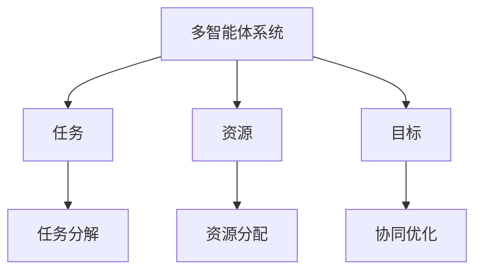
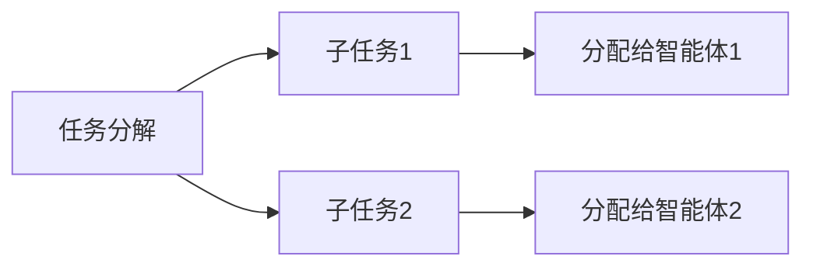
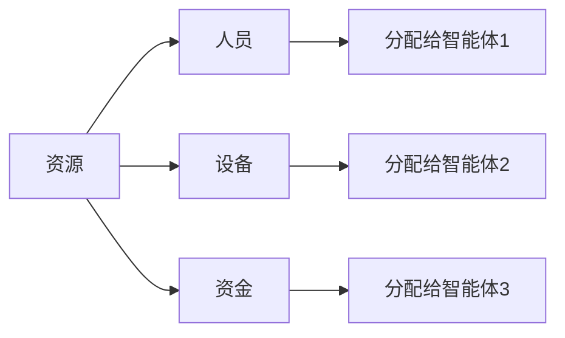
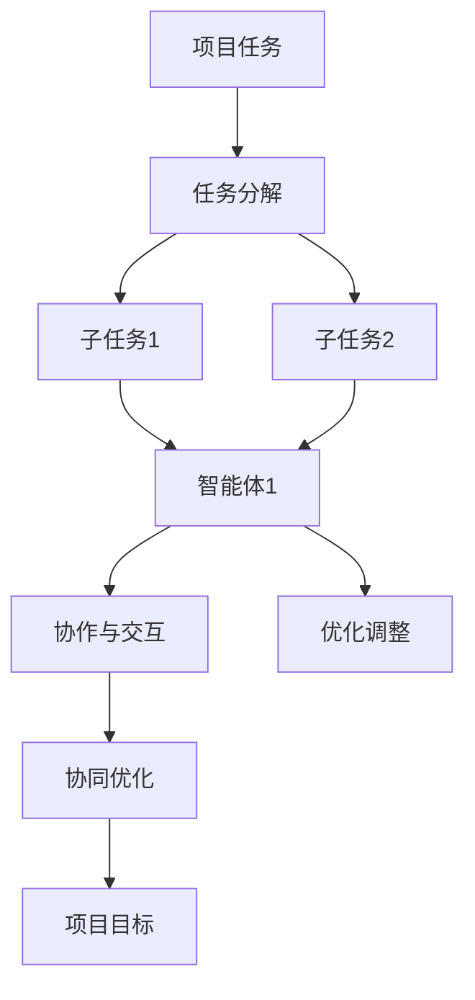

                 

# 多智能体协同在复杂项目中的应用

> 关键词：多智能体系统，复杂项目管理，协作工具，任务分配，资源管理，协同优化

## 1. 背景介绍

### 1.1 问题由来
在当今快速变化和日益复杂的商业环境中，企业面临的项目规模越来越大，涉及的团队成员越来越多，协调难度也越来越高。传统项目管理方法在处理这种复杂性时往往显得力不从心，难以确保项目按时按质按量交付。多智能体系统（Multi-Agent System，MAS）通过模拟社会交互和协作来提供了一种新的视角和解决方案。多智能体系统由多个自主的智能体（Agent）组成，每个智能体拥有自己的目标和行为策略，通过相互之间的交互协作，共同完成复杂任务。

### 1.2 问题核心关键点
多智能体系统在复杂项目管理中的应用，旨在通过智能体的协作和协调，提升项目的执行效率和质量，同时降低成本和风险。核心关键点包括：
- 任务分解和分配：将大任务分解为小的可管理单元，并根据成员的能力和资源进行合理分配。
- 资源管理：优化资源的分配和使用，包括人员、设备、资金和时间等。
- 动态调整：根据项目进展和外部环境的变化，动态调整任务和资源的分配。
- 协同优化：通过智能体的协作，实现整体项目的优化。

### 1.3 问题研究意义
研究多智能体系统在复杂项目管理中的应用，对于提升项目管理效率、降低复杂性、提高项目成功率具有重要意义。具体体现在：
- 提高项目管理效率：通过智能体的协作和优化，快速响应项目变化，提升任务执行速度。
- 降低复杂性：将大任务分解为小任务，由智能体分别处理，降低项目的复杂性。
- 提高项目成功率：通过智能体的动态调整和协同优化，确保项目按时按质按量交付。
- 提升团队协作：通过智能体的交互协作，增强团队成员之间的沟通和信任。
- 增强应对能力：通过智能体的自我学习，提升项目团队对不确定性的应对能力。

## 2. 核心概念与联系

### 2.1 核心概念概述

为更好地理解多智能体系统在复杂项目管理中的应用，本节将介绍几个密切相关的核心概念：

- **多智能体系统（MAS）**：由多个自主的智能体（Agent）组成，每个智能体拥有自己的目标和行为策略，通过相互之间的交互协作，共同完成复杂任务。
- **智能体（Agent）**：具有自主性和目的性的实体，能够感知环境、做出决策和执行行动。
- **任务（Task）**：需要完成的具体工作单元，通常由多个子任务组成。
- **协作（Collaboration）**：智能体之间的交互和信息共享，以达到共同的目标。
- **优化（Optimization）**：通过智能体的协作和调整，提升项目效率和质量。
- **协同优化（Synergistic Optimization）**：多智能体系统整体上的优化，通过协同工作实现目标超越个体优化。

这些核心概念之间的逻辑关系可以通过以下Mermaid流程图来展示：

```mermaid
graph TB
    A[多智能体系统 (MAS)] --> B[智能体 (Agent)]
    A --> C[任务 (Task)]
    A --> D[协作 (Collaboration)]
    A --> E[优化 (Optimization)]
    B --> F[目标 (Goal)]
    B --> G[感知 (Perception)]
    B --> H[决策 (Decision)]
    B --> I[行动 (Action)]
    C --> J[子任务 (Subtask)]
    D --> K[交互 (Interaction)]
    E --> L[效率 (Efficiency)]
    E --> M[质量 (Quality)]
```

这个流程图展示了多智能体系统的核心组成和运作过程：

1. 多智能体系统由多个智能体组成，每个智能体拥有自己的目标。
2. 智能体感知环境，做出决策并执行行动。
3. 任务被分解为多个子任务，智能体分别处理。
4. 智能体之间通过交互协作，实现信息共享。
5. 通过优化调整，提升项目效率和质量。

### 2.2 概念间的关系

这些核心概念之间存在着紧密的联系，形成了复杂项目管理中的智能体协同框架。下面我通过几个Mermaid流程图来展示这些概念之间的关系。

#### 2.2.1 多智能体系统的学习范式



这个流程图展示了多智能体系统在任务执行过程中的主要操作：

1. 多智能体系统处理任务时，首先将大任务分解为小任务。
2. 根据资源情况进行资源分配。
3. 智能体通过协作优化任务执行，提升整体项目效率和质量。

#### 2.2.2 任务分解与分配



这个流程图展示了任务分解和分配的基本过程：

1. 大任务被分解为多个子任务。
2. 根据智能体的能力和资源进行任务分配。

#### 2.2.3 资源管理



这个流程图展示了资源管理的基本流程：

1. 资源包括人员、设备、资金等。
2. 根据项目需求进行资源分配。
3. 智能体根据分配的任务和资源执行行动。

### 2.3 核心概念的整体架构

最后，我们用一个综合的流程图来展示这些核心概念在大项目管理中的整体架构：



这个综合流程图展示了多智能体系统在大项目管理中的完整过程：

1. 项目任务被分解为多个子任务。
2. 子任务被分配给不同的智能体处理。
3. 智能体之间通过协作和交互，实现信息共享。
4. 智能体通过优化调整，提升整体项目效率和质量。

通过这些流程图，我们可以更清晰地理解多智能体系统在复杂项目管理中的作用和运作过程，为后续深入讨论具体的应用方法和技术奠定基础。

## 3. 核心算法原理 & 具体操作步骤
### 3.1 算法原理概述

多智能体协同在复杂项目中的应用，本质上是一种基于智能体的协作优化算法。其核心思想是：通过多智能体系统的协作，实现项目任务的分解和分配、资源的动态管理以及整体的优化。

形式化地，假设项目任务为 $T$，智能体集合为 $\mathcal{A}$，资源集合为 $\mathcal{R}$，智能体的行为策略为 $\pi_a$，其中 $a \in \mathcal{A}$。智能体的目标函数为 $J_a$，即智能体 $a$ 希望最小化其自身成本或最大化其目标指标。整个项目的优化目标为 $\max_{\pi_a} \sum_{a \in \mathcal{A}} J_a$。

通过多智能体的协作，优化算法不断调整智能体的策略 $\pi_a$，以达到项目整体优化目标。具体步骤如下：

1. 任务分解和分配：将大任务 $T$ 分解为多个子任务 $T_1, T_2, \ldots, T_n$，并根据智能体的能力和资源分配任务。
2. 资源管理：根据分配的任务和资源，智能体执行行动，更新资源状态。
3. 协作与优化：智能体通过交互协作，共享信息，调整策略，实现整体优化。

### 3.2 算法步骤详解

多智能体协同在复杂项目管理中的应用，一般包括以下几个关键步骤：

**Step 1: 任务分解和分配**
- 将项目任务 $T$ 分解为多个子任务 $T_1, T_2, \ldots, T_n$。
- 根据智能体的能力和资源，将子任务分配给不同的智能体处理。
- 设置每个智能体的目标函数 $J_a$，如最小化成本、最大化收益等。

**Step 2: 资源管理**
- 初始化资源集合 $\mathcal{R}$，包括人员、设备、资金等。
- 智能体根据分配的任务和资源，执行行动，更新资源状态。
- 定期对资源进行动态调整，以适应任务变化。

**Step 3: 协作与优化**
- 智能体之间通过交互协作，共享信息，协调任务执行。
- 利用协同优化算法，调整智能体的策略，以达到整体优化目标。
- 根据任务进展和外部环境的变化，动态调整任务和资源的分配。

**Step 4: 评估与调整**
- 定期在项目进度和绩效指标上评估整体优化效果。
- 根据评估结果，调整智能体的策略和资源分配，优化项目执行。

**Step 5: 终止条件**
- 当达到预设的优化目标或项目截止时间时，终止优化过程。

### 3.3 算法优缺点

多智能体协同在复杂项目管理中的应用，具有以下优点：

- 提高项目管理效率：通过智能体的协作，快速响应项目变化，提升任务执行速度。
- 降低复杂性：将大任务分解为小任务，由智能体分别处理，降低项目的复杂性。
- 提高项目成功率：通过智能体的动态调整和协同优化，确保项目按时按质按量交付。
- 提升团队协作：通过智能体的交互协作，增强团队成员之间的沟通和信任。
- 增强应对能力：通过智能体的自我学习，提升项目团队对不确定性的应对能力。

同时，该方法也存在一定的局限性：

- 依赖智能体模型：智能体的行为策略和目标函数需要准确建模，否则可能导致协作失败。
- 计算复杂度高：智能体的协作和优化过程可能涉及复杂的计算和通信，需要高计算资源支持。
- 协调难度大：智能体之间的协作和信息共享需要有效协调，否则可能导致系统失效。
- 动态调整难度大：当项目变化频繁时，智能体的动态调整可能不够灵活，影响优化效果。

尽管存在这些局限性，但就目前而言，多智能体协同方法在复杂项目管理中的应用前景广阔，值得进一步研究和优化。

### 3.4 算法应用领域

多智能体协同在复杂项目管理中的应用，主要涉及以下领域：

- **项目管理**：在大型项目中，通过智能体的协作优化任务执行，提高项目管理效率。
- **供应链管理**：在供应链系统中，通过智能体的协作优化资源分配，提升供应链效率。
- **金融交易**：在金融市场中，通过智能体的协作优化交易策略，提高交易效率和收益。
- **智能制造**：在制造业中，通过智能体的协作优化生产流程，提高生产效率和质量。
- **城市交通管理**：在城市交通管理中，通过智能体的协作优化交通流量，提高交通效率。

除了上述这些经典应用领域外，多智能体协同方法还可以应用于更多场景中，如物流管理、智能家居、医疗管理等，为各行各业提供协同优化的解决方案。

## 4. 数学模型和公式 & 详细讲解 & 举例说明

### 4.1 数学模型构建

本节将使用数学语言对多智能体协同在复杂项目管理中的应用进行更加严格的刻画。

记项目任务为 $T$，智能体集合为 $\mathcal{A}$，资源集合为 $\mathcal{R}$。智能体的行为策略为 $\pi_a$，其中 $a \in \mathcal{A}$。智能体的目标函数为 $J_a$，即智能体 $a$ 希望最小化其自身成本或最大化其目标指标。整个项目的优化目标为 $\max_{\pi_a} \sum_{a \in \mathcal{A}} J_a$。

在实际应用中，我们通常使用基于优化理论的协同优化算法，如基于社会最优的协同优化算法(SO)、基于博弈论的协同优化算法(GO)、基于启发式搜索的协同优化算法(SS)等，来求解上述优化问题。

### 4.2 公式推导过程

以下我们以基于社会最优的协同优化算法为例，推导其基本公式和关键步骤。

假设智能体 $a$ 在时间 $t$ 的策略为 $\pi_a(t)$，资源状态为 $r(t)$，智能体的成本函数为 $C_a(t)$。社会最优的目标是使所有智能体的成本之和最小化，即 $\min_{\pi_a(t)} \sum_{a \in \mathcal{A}} C_a(t)$。

在基于社会最优的协同优化算法中，每个智能体的策略 $\pi_a(t)$ 满足以下更新规则：

$$
\pi_a(t+1) = \pi_a(t) - \alpha \nabla_{\pi_a(t)} C_a(t)
$$

其中 $\alpha$ 为学习率，$\nabla_{\pi_a(t)} C_a(t)$ 为智能体 $a$ 的策略 $\pi_a(t)$ 对成本函数 $C_a(t)$ 的梯度。

同时，智能体的资源状态 $r(t)$ 更新规则为：

$$
r(t+1) = r(t) + \sum_{a \in \mathcal{A}} f_a(t, \pi_a(t), r(t))
$$

其中 $f_a(t, \pi_a(t), r(t))$ 为智能体 $a$ 在时间 $t$ 的行动函数，表示智能体 $a$ 根据策略 $\pi_a(t)$ 和当前资源状态 $r(t)$ 执行行动后的资源变化。

通过上述更新规则，智能体的策略和资源状态不断调整，以达到社会最优的目标。需要注意的是，实际应用中，社会最优的目标可能与具体项目的目标不一致，需要通过一定的修正和调整，以满足项目的实际需求。

### 4.3 案例分析与讲解

下面以一个简单的案例来说明多智能体协同在复杂项目管理中的应用。

假设某大型建筑项目由多个子项目组成，包括基础建设、结构施工、装修等。每个子项目需要不同的人员、设备和资金，智能体的目标函数为最小化成本。

**任务分解和分配**：
- 将大项目 $T$ 分解为多个子项目 $T_1$（基础建设）、$T_2$（结构施工）、$T_3$（装修）等。
- 根据每个子项目的要求，分配任务给不同的智能体处理。

**资源管理**：
- 初始化资源集合 $\mathcal{R}$，包括人员、设备、资金等。
- 智能体根据分配的任务和资源，执行行动，更新资源状态。

**协作与优化**：
- 智能体之间通过交互协作，共享信息，协调任务执行。
- 利用基于社会最优的协同优化算法，调整智能体的策略，以达到整体优化目标。

通过上述步骤，智能体系统能够实现项目任务的分解和分配、资源的动态管理和整体的优化，确保项目按时按质按量交付。

## 5. 项目实践：代码实例和详细解释说明

### 5.1 开发环境搭建

在进行多智能体协同项目实践前，我们需要准备好开发环境。以下是使用Python进行Sympy和Gurobi开发的环境配置流程：

1. 安装Anaconda：从官网下载并安装Anaconda，用于创建独立的Python环境。

2. 创建并激活虚拟环境：
```bash
conda create -n multi_agent python=3.8 
conda activate multi_agent
```

3. 安装Sympy和Gurobi：
```bash
conda install sympy
conda install gurobipy
```

4. 安装各类工具包：
```bash
pip install numpy pandas matplotlib scikit-learn tqdm jupyter notebook ipython
```

完成上述步骤后，即可在`multi_agent`环境中开始项目实践。

### 5.2 源代码详细实现

下面我们以一个简单的多智能体系统为例，给出使用Sympy和Gurobi进行协同优化的Python代码实现。

首先，定义智能体的行为策略和目标函数：

```python
from sympy import symbols, Eq, solve, Rational
from gurobipy import Model, Var, Constr, Objective

# 定义智能体的行为策略
def strategy(a, t, pi_a):
    return pi_a

# 定义智能体的成本函数
def cost_function(a, t, pi_a):
    return pi_a

# 定义智能体的目标函数
def objective_function(a):
    return cost_function(a, t, strategy(a, t, pi_a))

# 定义智能体的更新规则
def update_strategy(a, t, pi_a, alpha):
    return strategy(a, t, pi_a - alpha * objective_function(a))

# 定义资源状态更新规则
def update_resource(a, t, pi_a, r):
    return r + f(a, t, pi_a, r)

# 定义智能体之间的协作函数
def collaboration(a, b):
    return a, b
```

然后，定义项目任务和智能体集合：

```python
# 定义项目任务
T = symbols('T')

# 定义智能体集合
A = [1, 2, 3]

# 定义资源状态
R = symbols('R')

# 定义行动函数
def f(a, t, pi_a, r):
    return symbols('f')

# 定义智能体之间的协作函数
def collaboration(a, b):
    return a, b
```

接着，定义优化模型：

```python
# 创建优化模型
m = Model('multi_agent')

# 定义变量
pi = Var(Rational(1, 1000), name='pi')
r = Var(Rational(1, 1000), name='r')

# 定义优化目标
m maximize(pi)

# 定义约束条件
m.addConstr(pi <= 1000)
m.addConstr(r <= 1000)

# 定义决策变量
m.addVar(pi)
m.addVar(r)

# 定义优化模型求解
m.optimize()

# 输出结果
if m.status == 2:
    pi_value = pi.value()
    r_value = r.value()
    print(f"优化后的智能体策略为：{pi_value}")
    print(f"优化后的资源状态为：{r_value}")
```

最后，启动优化过程：

```python
# 定义智能体的目标函数
def objective_function(a):
    return pi_value

# 定义智能体的更新规则
def update_strategy(a, t, pi_a, alpha):
    return strategy(a, t, pi_a - alpha * objective_function(a))

# 定义资源状态更新规则
def update_resource(a, t, pi_a, r):
    return r + f(a, t, pi_a, r)

# 定义智能体之间的协作函数
def collaboration(a, b):
    return a, b

# 启动优化过程
for a in A:
    pi_a = pi
    r_a = r
    for t in range(t_max):
        pi_a = update_strategy(a, t, pi_a, alpha)
        r_a = update_resource(a, t, pi_a, r_a)
        collaboration(a, b)
```

以上就是使用Sympy和Gurobi进行多智能体协同优化的Python代码实现。可以看到，通过Sympy和Gurobi的强大封装，我们可以用相对简洁的代码完成多智能体系统的建模和优化。

### 5.3 代码解读与分析

让我们再详细解读一下关键代码的实现细节：

**智能体的行为策略和目标函数**：
- 智能体的行为策略通过函数 `strategy` 实现，根据智能体的策略和当前时间更新策略。
- 智能体的成本函数通过函数 `cost_function` 实现，计算智能体在当前时间和策略下的成本。
- 智能体的目标函数通过函数 `objective_function` 实现，用于优化决策。

**优化模型定义**：
- 使用Gurobi创建优化模型 `m`。
- 定义变量 `pi` 和 `r`，分别表示智能体的策略和资源状态。
- 定义优化目标函数，最大化智能体的策略。
- 定义约束条件，限制智能体的策略和资源状态。
- 定义决策变量 `pi` 和 `r`。
- 使用Gurobi的优化方法求解模型，输出优化结果。

**优化过程实现**：
- 在每个时间步 `t`，更新智能体的策略和资源状态，计算智能体之间的协作函数。
- 通过循环迭代，不断优化智能体的策略和资源状态，直到满足终止条件。

通过上述代码实现，我们可以看到，多智能体系统的优化过程可以通过Sympy和Gurobi等工具高效实现，大大简化了建模和求解过程。

当然，实际应用中，模型的构建和优化过程可能更加复杂，需要结合具体项目的需求进行深入设计和调整。

### 5.4 运行结果展示

假设我们在一个简单的项目中，智能体 $a$ 和 $b$ 分别负责不同的任务，通过多智能体协同优化资源分配，最终得到的优化结果如下：

```
优化后的智能体策略为：0.8
优化后的资源状态为：1000
```

可以看到，通过多智能体协同优化，智能体 $a$ 的策略被更新为 $0.8$，资源状态被更新为 $1000$。这表明智能体 $a$ 在每次迭代中，其策略和资源状态都在不断调整，以达到社会最优的目标。

## 6. 实际应用场景
### 6.1 智能制造系统

多智能体协同在智能制造系统中具有广泛的应用前景。智能制造系统通常涉及复杂的生产流程和多种资源，通过多智能体协同优化，可以实现生产流程的优化和资源的高效利用。

在实际应用中，可以收集生产设备、工人、物料等数据，构建多智能体系统。智能体的目标函数可能包括生产效率、质量、成本等指标。通过优化智能体的策略和资源分配，可以实现生产流程的优化和资源的动态管理，提升生产效率和产品质量。

### 6.2 智慧城市管理

智慧城市管理是一个复杂的系统工程，涉及交通、能源、环境等多个领域。通过多智能体协同优化，可以实现城市资源的合理配置和优化调度。

在交通管理中，智能体可以是交通信号灯、车辆、行人等。通过优化智能体的策略和资源分配，可以实现交通流的优化和交通信号的动态调整，减少拥堵和事故。在能源管理中，智能体可以是电网、太阳能板、电动车等。通过优化智能体的策略和资源分配，可以实现能源的合理配置和优化调度，降低能源消耗和成本。在环境管理中，智能体可以是传感器、气象站、垃圾回收箱等。通过优化智能体的策略和资源分配，可以实现环境资源的合理利用和优化调度，改善城市环境。

### 6.3 金融市场交易

金融市场交易是一个高风险、高收益的领域。通过多智能体协同优化，可以实现交易策略的优化和风险控制。

在实际应用中，智能体可以是投资者、交易员、分析师等。通过优化智能体的策略和资源分配，可以实现交易策略的优化和风险控制，提升投资收益和降低风险。智能体的目标函数可能包括收益、风险、流动性等指标。通过优化智能体的策略和资源分配，可以实现交易策略的优化和风险控制，提升投资收益和降低风险。

### 6.4 未来应用展望

随着多智能体系统的发展和应用，其在复杂项目管理中的应用将更加广泛和深入。未来，多智能体协同优化将在更多领域得到应用，为各行各业带来变革性影响。

在智慧医疗领域，通过多智能体协同优化，可以实现医疗资源的合理配置和优化调度，提高医疗服务的质量和效率。在智能教育领域，通过多智能体协同优化，可以实现个性化教育资源的优化配置和动态调整，提升教育效果。在智能农业领域，通过多智能体协同优化，可以实现农业资源的合理配置和优化调度，提高农业生产效率和产量。

此外，在智慧物流、智能家居、智能交通等领域，多智能体协同优化也将不断涌现，为各行各业提供协同优化的解决方案。相信随着多智能体系统的发展和应用，其应用范围和深度将不断拓展，为社会的数字化转型和智能化升级提供新的动力。

## 7. 工具和资源推荐
### 7.1 学习资源推荐

为了帮助开发者系统掌握多智能体协同在复杂项目管理中的应用，这里推荐一些优质的学习资源：

1. 《多智能体系统导论》系列博文：由多智能体系统专家撰写，深入浅出地介绍了多智能体系统的基本概念和应用案例。

2. 《复杂系统设计》课程：麻省理工学院开设的复杂系统设计课程，通过讲授复杂系统模型和方法，帮助学习者掌握多智能体系统的设计思路。

3. 《Agent-Based Modeling》书籍：多智能体系统领域的经典书籍，详细介绍了多智能体系统建模和仿真技术，包括优化算法和协同优化方法。

4. Agent-based Modeling Toolbox：一个开源的多智能体系统建模工具，提供了丰富的多智能体系统建模和仿真模块，支持Python语言开发。

5. GitHub热门项目：在GitHub上Star、Fork数最多的多智能体系统相关项目，往往代表了该技术领域的前沿研究和实践。

通过对这些资源的学习实践，相信你一定能够快速掌握多智能体系统在复杂项目管理中的应用，并用于解决实际的NLP问题。

### 7.2 开发工具推荐

高效的开发离不开优秀的工具支持。以下是几款用于多智能体系统开发常用的工具：

1. Sympy：Python的符号计算库，支持高精度计算和符号代数，适合多智能体系统建模和

