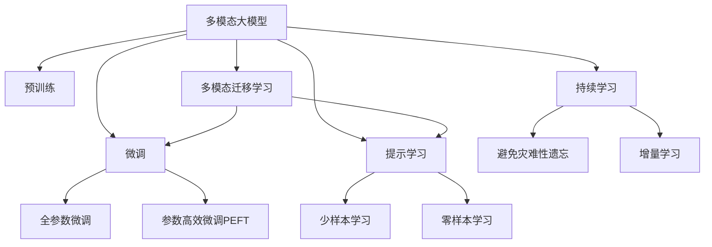
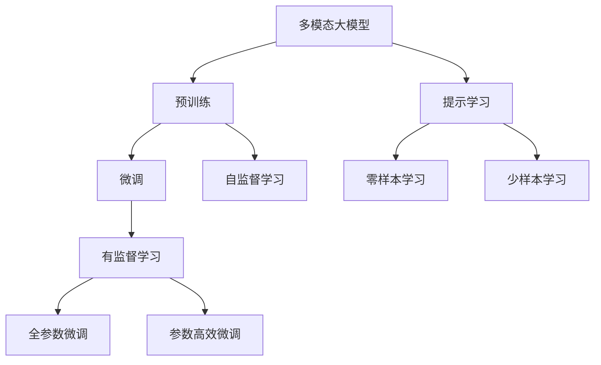
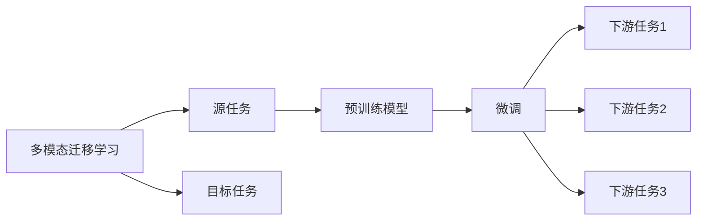
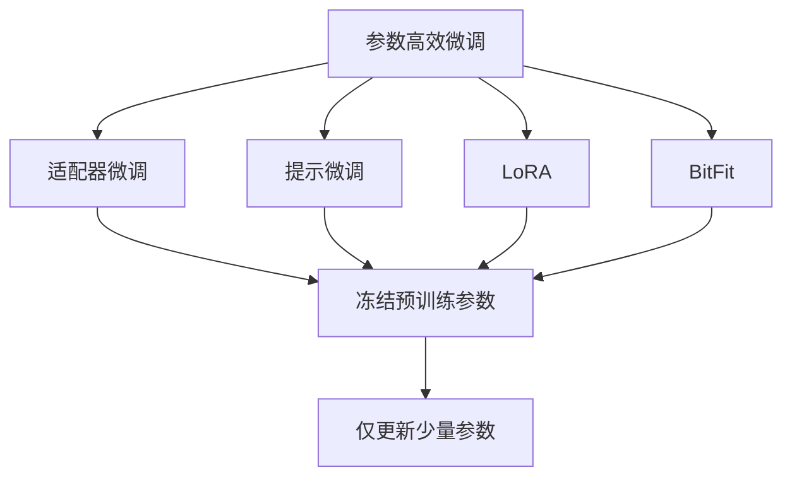
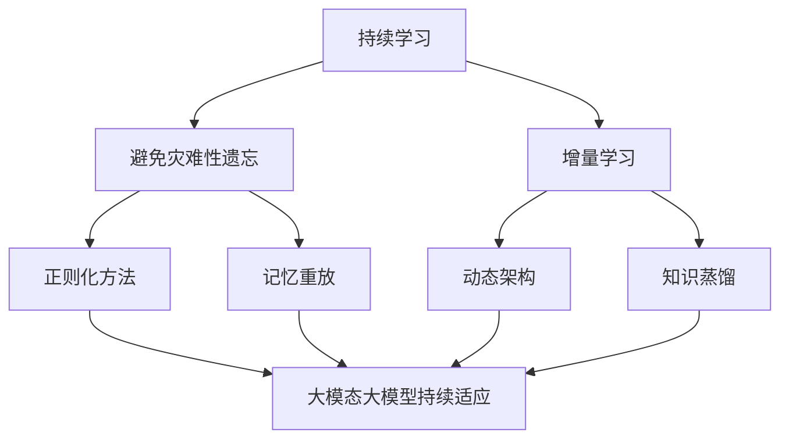

                 

# 多模态大模型：技术原理与实战 图像多模态技术

> 关键词：多模态大模型,图像多模态,Transformer,BERT,预训练,下游任务,参数高效微调,自然语言处理(NLP),计算机视觉(CV),图像描述生成,语义分割,实例分割

## 1. 背景介绍

### 1.1 问题由来
随着深度学习技术的快速发展，多模态学习（Multi-modal Learning）成为人工智能领域的前沿研究热点。多模态学习是指结合多种不同模态（如文本、图像、音频等）的特征信息，进行联合建模，从而提升模型的泛化能力和决策性能。其中，多模态大模型（Multi-modal Large Models）通过预训练大量跨模态数据，学习到丰富的语言、视觉和音频等知识，能够更好地适应各种复杂的现实场景，具备较强的综合理解和推理能力。

近年来，基于多模态大模型的应用在各个领域迅速崛起，涵盖了自然语言处理（NLP）、计算机视觉（CV）、语音识别（ASR）等多个领域，推动了人工智能技术的发展。例如，多模态大模型能够自动翻译图片、生成图像描述、进行图像语义分割、实例分割等，这些应用极大地拓展了人工智能的边界，带来了新的技术突破和应用前景。

### 1.2 问题核心关键点
目前，多模态大模型的核心研究范式包括两个方面：一是预训练，通过自监督学习任务，在大规模无标签数据上训练模型，学习到跨模态的表示知识；二是微调，在特定任务上对预训练模型进行有监督的微调，提升模型在特定任务上的性能。

预训练是基础，而微调是关键。预训练为模型提供了丰富的模态信息，微调则进一步精化模型，使其能够更精准地处理各种特定任务。然而，预训练-微调的范式也面临着一些挑战，如如何选择合适的预训练模型、如何设计有效的微调目标函数、如何处理不同模态数据之间的差异等。

### 1.3 问题研究意义
研究多模态大模型的微调方法，对于拓展模型的应用范围，提升下游任务的性能，加速人工智能技术的产业化进程，具有重要意义：

1. **降低应用开发成本**：多模态大模型的微调通常利用已有预训练模型，减少了从头开发所需的数据、计算和人力等成本投入。
2. **提升模型效果**：多模态大模型通过微调可以更好地适应特定任务，在应用场景中取得更优表现。
3. **加速开发进度**：使用预训练-微调的方式，开发者可以快速适配新任务，缩短开发周期。
4. **带来技术创新**：微调范式促进了对预训练-微调的深入研究，催生了新的研究方向，如多模态迁移学习、参数高效微调等。
5. **赋能产业升级**：多模态大模型微调使得人工智能技术更容易被各行各业所采用，为传统行业数字化转型升级提供新的技术路径。

## 2. 核心概念与联系

### 2.1 核心概念概述

为更好地理解基于监督学习的多模态大模型微调方法，本节将介绍几个密切相关的核心概念：

- **多模态大模型(Multi-modal Large Models)**：以自回归(如BERT)或自编码(如Transformer)模型为代表的大规模预训练模型。通过在大规模跨模态数据上预训练，学习到不同模态的联合表示，具备较强的跨模态理解和推理能力。
- **预训练(Pre-training)**：指在大规模无标签数据上，通过自监督学习任务训练通用多模态模型的过程。常见的预训练任务包括语言建模、图像分类、对象检测等。
- **微调(Fine-tuning)**：指在预训练模型的基础上，使用下游任务的少量标注数据，通过有监督学习优化模型在特定任务上的性能。通常只需要调整顶层分类器或解码器，并以较小的学习率更新全部或部分的模型参数。
- **多模态迁移学习(Multi-modal Transfer Learning)**：指将一个模态的学习知识，迁移应用到另一个不同但相关的模态的学习范式。多模态大模型的预训练-微调过程即是一种典型的多模态迁移学习方式。
- **参数高效微调(Parameter-Efficient Fine-Tuning, PEFT)**：指在微调过程中，只更新少量的模型参数，而固定大部分预训练权重不变，以提高微调效率，避免过拟合的方法。
- **提示学习(Prompt Learning)**：通过在输入文本中添加提示模板(Prompt Template)，引导多模态大模型进行特定任务的推理和生成。可以在不更新模型参数的情况下，实现零样本或少样本学习。
- **少样本学习(Few-shot Learning)**：指在只有少量标注样本的情况下，模型能够快速适应新任务的学习方法。在大模型中，通常通过在输入中提供少量示例来实现，无需更新模型参数。
- **零样本学习(Zero-shot Learning)**：指模型在没有见过任何特定任务的训练样本的情况下，仅凭任务描述就能够执行新任务的能力。大模型通过预训练获得的广泛知识，使其能够理解任务指令并生成相应输出。
- **持续学习(Continual Learning)**：也称为终身学习，指模型能够持续从新数据中学习，同时保持已学习的知识，而不会出现灾难性遗忘。这对于保持多模态大模型的时效性和适应性至关重要。

这些核心概念之间的逻辑关系可以通过以下Mermaid流程图来展示：



这个流程图展示了大模态大模型的核心概念及其之间的关系：

1. 多模态大模型通过预训练获得跨模态的基础能力。
2. 微调是对预训练模型进行任务特定的优化，可以分为全参数微调和参数高效微调（PEFT）。
3. 提示学习是一种不更新模型参数的方法，可以实现少样本学习和零样本学习。
4. 多模态迁移学习是连接预训练模型与下游任务的桥梁，可以通过微调或提示学习来实现。
5. 持续学习旨在使模型能够不断学习新知识，同时避免遗忘旧知识。

这些概念共同构成了多模态大模型的学习和应用框架，使其能够在各种场景下发挥强大的跨模态理解和推理能力。通过理解这些核心概念，我们可以更好地把握多模态大模型的工作原理和优化方向。

### 2.2 概念间的关系

这些核心概念之间存在着紧密的联系，形成了多模态大模型微调的完整生态系统。下面我通过几个Mermaid流程图来展示这些概念之间的关系。

#### 2.2.1 多模态大模型的学习范式



这个流程图展示了大模态大模型的三种主要学习范式：预训练、微调和提示学习。预训练主要采用自监督学习方法，而微调则是有监督学习的过程。提示学习可以实现零样本和少样本学习。微调又可以分为全参数微调和参数高效微调两种方式。

#### 2.2.2 多模态迁移学习与微调的关系



这个流程图展示了多模态迁移学习的基本原理，以及它与微调的关系。多模态迁移学习涉及源任务和目标任务，预训练模型在源任务上学习，然后通过微调适应各种下游任务（目标任务）。

#### 2.2.3 参数高效微调方法



这个流程图展示了几种常见的参数高效微调方法，包括适配器微调、提示微调、LoRA和BitFit。这些方法的共同特点是冻结大部分预训练参数，只更新少量参数，从而提高微调效率。

#### 2.2.4 持续学习在大模态大模型中的应用



这个流程图展示了持续学习在大模态大模型中的应用。持续学习的主要目标是避免灾难性遗忘和实现增量学习。通过正则化方法、记忆重放、动态架构和知识蒸馏等技术，可以使大模态大模型持续适应新的任务和数据。

## 3. 核心算法原理 & 具体操作步骤
### 3.1 算法原理概述

基于监督学习的多模态大模型微调，本质上是一个有监督的细粒度迁移学习过程。其核心思想是：将预训练的多模态大模型视作一个强大的"特征提取器"，通过在有标注数据的上游任务上微调，使得模型输出能够匹配任务标签，从而获得针对特定任务优化的模型。

形式化地，假设预训练的多模态大模型为 $M_{\theta}$，其中 $\theta$ 为预训练得到的模型参数。给定下游任务 $T$ 的标注数据集 $D=\{(x_i, y_i)\}_{i=1}^N$，微调的目标是找到新的模型参数 $\hat{\theta}$，使得：

$$
\hat{\theta}=\mathop{\arg\min}_{\theta} \mathcal{L}(M_{\theta},D)
$$

其中 $\mathcal{L}$ 为针对任务 $T$ 设计的损失函数，用于衡量模型预测输出与真实标签之间的差异。常见的损失函数包括交叉熵损失、均方误差损失等。

通过梯度下降等优化算法，微调过程不断更新模型参数 $\theta$，最小化损失函数 $\mathcal{L}$，使得模型输出逼近真实标签。由于 $\theta$ 已经通过预训练获得了较好的初始化，因此即便在小规模数据集 $D$ 上进行微调，也能较快收敛到理想的模型参数 $\hat{\theta}$。

### 3.2 算法步骤详解

基于监督学习的多模态大模型微调一般包括以下几个关键步骤：

**Step 1: 准备预训练模型和数据集**
- 选择合适的预训练多模态大模型 $M_{\theta}$ 作为初始化参数，如 BERT、GPT、ResNet 等。
- 准备下游任务 $T$ 的标注数据集 $D$，划分为训练集、验证集和测试集。一般要求标注数据与预训练数据的分布不要差异过大。

**Step 2: 添加任务适配层**
- 根据任务类型，在预训练模型顶层设计合适的输出层和损失函数。
- 对于分类任务，通常在顶层添加线性分类器和交叉熵损失函数。
- 对于生成任务，通常使用语言模型的解码器输出概率分布，并以负对数似然为损失函数。

**Step 3: 设置微调超参数**
- 选择合适的优化算法及其参数，如 AdamW、SGD 等，设置学习率、批大小、迭代轮数等。
- 设置正则化技术及强度，包括权重衰减、Dropout、Early Stopping 等。
- 确定冻结预训练参数的策略，如仅微调顶层，或全部参数都参与微调。

**Step 4: 执行梯度训练**
- 将训练集数据分批次输入模型，前向传播计算损失函数。
- 反向传播计算参数梯度，根据设定的优化算法和学习率更新模型参数。
- 周期性在验证集上评估模型性能，根据性能指标决定是否触发 Early Stopping。
- 重复上述步骤直到满足预设的迭代轮数或 Early Stopping 条件。

**Step 5: 测试和部署**
- 在测试集上评估微调后模型 $M_{\hat{\theta}}$ 的性能，对比微调前后的精度提升。
- 使用微调后的模型对新样本进行推理预测，集成到实际的应用系统中。
- 持续收集新的数据，定期重新微调模型，以适应数据分布的变化。

以上是基于监督学习微调多模态大模型的一般流程。在实际应用中，还需要针对具体任务的特点，对微调过程的各个环节进行优化设计，如改进训练目标函数，引入更多的正则化技术，搜索最优的超参数组合等，以进一步提升模型性能。

### 3.3 算法优缺点

基于监督学习的多模态大模型微调方法具有以下优点：
1. 简单高效。只需准备少量标注数据，即可对预训练模型进行快速适配，获得较大的性能提升。
2. 通用适用。适用于各种NLP、CV、ASR下游任务，设计简单的任务适配层即可实现微调。
3. 参数高效。利用参数高效微调技术，在固定大部分预训练参数的情况下，仍可取得不错的提升。
4. 效果显著。在学术界和工业界的诸多任务上，基于微调的方法已经刷新了最先进的性能指标。

同时，该方法也存在一定的局限性：
1. 依赖标注数据。微调的效果很大程度上取决于标注数据的质量和数量，获取高质量标注数据的成本较高。
2. 迁移能力有限。当目标任务与预训练数据的分布差异较大时，微调的性能提升有限。
3. 负面效果传递。预训练模型的固有偏见、有害信息等，可能通过微调传递到下游任务，造成负面影响。
4. 可解释性不足。微调模型的决策过程通常缺乏可解释性，难以对其推理逻辑进行分析和调试。

尽管存在这些局限性，但就目前而言，基于监督学习的微调方法仍是大模态大模型应用的最主流范式。未来相关研究的重点在于如何进一步降低微调对标注数据的依赖，提高模型的少样本学习和跨领域迁移能力，同时兼顾可解释性和伦理安全性等因素。

### 3.4 算法应用领域

基于多模态大模型的监督学习方法，在NLP、CV、ASR领域已经得到了广泛的应用，覆盖了几乎所有常见任务，例如：

- 文本分类：如情感分析、主题分类、意图识别等。通过微调使模型学习文本-标签映射。
- 命名实体识别：识别文本中的人名、地名、机构名等特定实体。通过微调使模型掌握实体边界和类型。
- 关系抽取：从文本中抽取实体之间的语义关系。通过微调使模型学习实体-关系三元组。
- 问答系统：对自然语言问题给出答案。将问题-答案对作为微调数据，训练模型学习匹配答案。
- 机器翻译：将源语言文本翻译成目标语言。通过微调使模型学习语言-语言映射。
- 文本摘要：将长文本压缩成简短摘要。将文章-摘要对作为微调数据，使模型学习抓取要点。
- 对话系统：使机器能够与人自然对话。将多轮对话历史作为上下文，微调模型进行回复生成。

除了上述这些经典任务外，多模态大模型微调也被创新性地应用到更多场景中，如可控文本生成、常识推理、代码生成、数据增强等，为NLP技术带来了全新的突破。随着预训练模型和微调方法的不断进步，相信NLP技术将在更广阔的应用领域大放异彩。

## 4. 数学模型和公式 & 详细讲解 & 举例说明
### 4.1 数学模型构建

本节将使用数学语言对基于监督学习的多模态大模型微调过程进行更加严格的刻画。

记预训练多模态大模型为 $M_{\theta}:\mathcal{X} \rightarrow \mathcal{Y}$，其中 $\mathcal{X}$ 为输入空间，$\mathcal{Y}$ 为输出空间，$\theta \in \mathbb{R}^d$ 为模型参数。假设微调任务的训练集为 $D=\{(x_i,y_i)\}_{i=1}^N, x_i \in \mathcal{X}, y_i \in \mathcal{Y}$。

定义模型 $M_{\theta}$ 在数据样本 $(x,y)$ 上的损失函数为 $\ell(M_{\theta}(x),y)$，则在数据集 $D$ 上的经验风险为：

$$
\mathcal{L}(\theta) = \frac{1}{N} \sum_{i=1}^N \ell(M_{\theta}(x_i),y_i)
$$

微调的优化目标是最小化经验风险，即找到最优参数：

$$
\theta^* = \mathop{\arg\min}_{\theta} \mathcal{L}(\theta)
$$

在实践中，我们通常使用基于梯度的优化算法（如SGD、Adam等）来近似求解上述最优化问题。设 $\eta$ 为学习率，$\lambda$ 为正则化系数，则参数的更新公式为：

$$
\theta \leftarrow \theta - \eta \nabla_{\theta}\mathcal{L}(\theta) - \eta\lambda\theta
$$

其中 $\nabla_{\theta}\mathcal{L}(\theta)$ 为损失函数对参数 $\theta$ 的梯度，可通过反向传播算法高效计算。

### 4.2 公式推导过程

以下我们以二分类任务为例，推导交叉熵损失函数及其梯度的计算公式。

假设模型 $M_{\theta}$ 在输入 $x$ 上的输出为 $\hat{y}=M_{\theta}(x) \in [0,1]$，表示样本属于正类的概率。真实标签 $y \in \{0,1\}$。则二分类交叉熵损失函数定义为：

$$
\ell(M_{\theta}(x),y) = -[y\log \hat{y} + (1-y)\log (1-\hat{y})]
$$

将其代入经验风险公式，得：

$$
\mathcal{L}(\theta) = -\frac{1}{N}\sum_{i=1}^N [y_i\log M_{\theta}(x_i)+(1-y_i)\log(1-M_{\theta}(x_i))]
$$

根据链式法则，损失函数对参数 $\theta_k$ 的梯度为：

$$
\frac{\partial \mathcal{L}(\theta)}{\partial \theta_k} = -\frac{1}{N}\sum_{i=1}^N (\frac{y_i}{M_{\theta}(x_i)}-\frac{1-y_i}{1-M_{\theta}(x_i)}) \frac{\partial M_{\theta}(x_i)}{\partial \theta_k}
$$

其中 $\frac{\partial M_{\theta}(x_i)}{\partial \theta_k}$ 可进一步递归展开，利用自动微分技术完成计算。

在得到损失函数的梯度后，即可带入参数更新公式，完成模型的迭代优化。重复上述过程直至收敛，最终得到适应下游任务的最优模型参数 $\theta^*$。

## 5. 项目实践：代码实例和详细解释说明
### 5.1 开发环境搭建

在进行微调实践前，我们需要准备好开发环境。以下是使用Python进行PyTorch开发的环境配置流程：

1. 安装Anaconda：从官网下载并安装Anaconda，用于创建独立的Python环境。

2. 创建并激活虚拟环境：
```bash
conda create -n pytorch-env python=3.8 
conda activate pytorch-env
```

3. 安装PyTorch：根据CUDA版本，从官网获取对应的安装命令。例如：
```bash
conda install pytorch torchvision torchaudio cudatoolkit=11.1 -c pytorch -c conda-forge
```

4. 安装Transformers库：
```bash
pip install transformers
```

5. 安装各类工具包：
```bash
pip install numpy pandas scikit-learn matplotlib tqdm jupyter notebook ipython
```

完成上述步骤后，即可在`pytorch-env`环境中开始微调实践。

### 5.2 源代码详细实现

下面我们以图像分类任务为例，给出使用Transformers库对ResNet模型进行微调的PyTorch代码实现。

首先，定义图像分类任务的数据处理函数：

```python
from torchvision import datasets, transforms

# 定义数据增强方式
transform_train = transforms.Compose([
    transforms.RandomResizedCrop(224),
    transforms.RandomHorizontalFlip(),
    transforms.ToTensor(),
    transforms.Normalize(mean=[0.485, 0.456, 0.406], std=[0.229, 0.224, 0.225])
])

# 定义测试数据处理方式
transform_test = transforms.Compose([
    transforms.Resize(256),
    transforms.CenterCrop(224),
    transforms.ToTensor(),
    transforms.Normalize(mean=[0.485, 0.456, 0.406], std=[0.229, 0.224, 0.225])
])

# 加载数据集
train_dataset = datasets.ImageFolder('path_to_train_set', transform=transform_train)
test_dataset = datasets.ImageFolder('path_to_test_set', transform=transform_test)

# 创建dataloader
train_loader = torch.utils.data.DataLoader(train_dataset, batch_size=32, shuffle=True)
test_loader = torch.utils.data.DataLoader(test_dataset, batch_size=32, shuffle=False)
```

然后，定义模型和优化器：

```python
from transformers import ResNetFeatureExtractor, ResNetForImageClassification

# 加载预训练模型和特征提取器
model = ResNetForImageClassification.from_pretrained('resnet18', num_labels=1000)
feature_extractor = ResNetFeatureExtractor.from_pretrained('resnet18')

# 定义优化器
optimizer = AdamW(model.parameters(), lr=5e-5)
```

接着，定义训练和评估函数：

```python
import torch
from tqdm import tqdm

device = torch.device('cuda') if torch.cuda.is_available() else torch.device('cpu')

def train_epoch(model, train_loader, optimizer):
    model.train()
    total_loss = 0
    for batch in tqdm(train_loader, desc='Training'):
        images, labels = batch[0].to(device), batch[1].to(device)
        outputs = model(images, return_dict=True)
        loss = outputs.loss
        total_loss += loss.item()
        loss.backward()
        optimizer.step()
        optimizer.zero_grad()
    return total_loss / len(train_loader)

def evaluate(model, test_loader):
    model.eval()
    total_correct = 0
    for batch in test_loader:
        images, labels = batch[0].to(device), batch[1].to(device)
        outputs = model(images, return_dict=True)
        logits = outputs.logits.argmax(dim=1)
        total_correct += (logits == labels).sum().item()
    return total_correct / len(test_loader.dataset)

# 训练和评估模型
epochs = 5
for epoch in range(epochs):
    train_loss = train_epoch(model, train_loader, optimizer)
    print(f'Epoch {epoch+1}, train loss: {train_loss:.4f}')
    
    test_accuracy = evaluate(model, test_loader)
    print(f'Epoch {epoch+1}, test accuracy: {test_accuracy:.4f}')
```

以上就是使用PyTorch对ResNet模型进行图像分类任务微调的完整代码实现。可以看到，得益于Transformers库的强大封装，我们可以用相对简洁的代码完成ResNet模型的加载和微调。

### 5.3 代码解读与分析

让我们再详细解读一下关键代码的实现细节：

**图像分类数据处理函数**：
- `transform_train`：定义训练数据增强方式，包括随机裁剪、水平翻转、标准化等。
- `transform_test`：定义测试数据处理方式，只进行标准化处理。
- `train_dataset` 和 `test_dataset`：分别加载训练集和测试集，并对样本进行数据增强和标准化处理。
- `train_loader` 和 `test_loader`：创建训练集和测试集的dataloader，用于批量输入数据进行模型训练和推理。

**模型和优化器**：
- `model`：加载预训练的ResNet模型，并指定分类数为1000。
- `feature_extractor`：加载预训练的ResNet特征提取器，用于提取图像特征。
- `optimizer`：定义优化器，使用AdamW算法，学习率为5e-5。

**训练和评估函数**：
- `train_epoch`：定义训练函数，在每个epoch中迭代训练集数据，计算并返回损失函数的总和。
- `evaluate`：定义评估函数，在测试集上评估模型的准确率，并返回正确预测的样本数。
- `train_loss` 和 `test_accuracy`：在每个epoch中训练和评估模型，输出训练损失和测试准确率。

**

