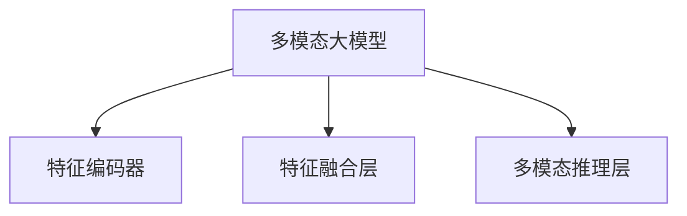
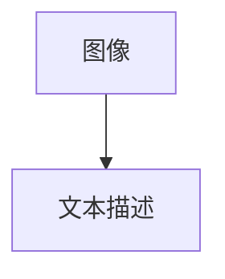
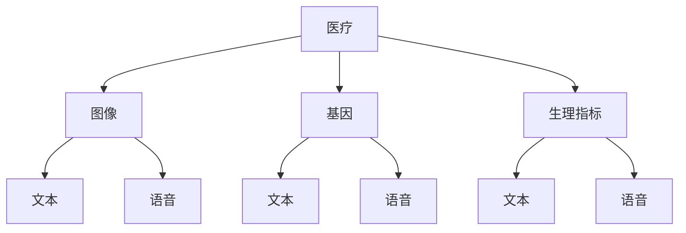

                 

# 多模态大模型：技术原理与实战 多模态大模型发展的重大里程碑

## 1. 背景介绍

随着技术的进步，多模态大模型（Multimodal Large Models, MLMs）在近年来成为了人工智能领域的热门话题。多模态模型通过融合多种数据模态，如文本、图像、音频等，来提高对复杂场景的理解能力。其核心在于将不同模态的数据进行特征编码，并在统一的语义空间中进行融合和推理，从而实现更加精细化的知识表示和智能交互。

在商业、医疗、娱乐、教育等多个行业，多模态大模型已经展现出强大的应用潜力。例如，在医疗领域，多模态模型能够从患者的多模态数据（如影像、基因、生理指标等）中提取特征，帮助医生进行更准确的诊断和制定治疗方案。在教育领域，通过融合图像、语音、文本等多模态数据，可以实现更加个性化的教学内容推荐和智能辅导。

然而，多模态大模型的开发和应用面临着许多技术挑战。如何高效地融合多模态数据、提升模型性能、优化推理效率，都是需要深入研究的问题。本文将系统地介绍多模态大模型的技术原理和实战应用，并探讨其未来发展趋势和面临的挑战。

## 2. 核心概念与联系

### 2.1 核心概念概述

多模态大模型是结合了多种数据模态（如文本、图像、音频等）的深度学习模型。其核心思想是通过多模态数据的融合，构建更加全面、精确的知识表示，从而提高模型的理解和推理能力。与单模态模型相比，多模态模型能够处理更加复杂和多样化的输入数据，实现更加智能的决策和预测。

多模态大模型的主要技术组件包括：

- **特征编码器**：负责将不同模态的数据编码为统一特征空间，以便后续融合。常用的编码器包括卷积神经网络（CNN）、循环神经网络（RNN）、自注意力机制等。
- **特征融合层**：用于将不同模态的数据特征进行融合，通常采用加权平均、注意力机制等方法。
- **多模态推理层**：负责对融合后的特征进行推理和输出，如分类、回归、生成等任务。

这些组件共同构成了多模态大模型的整体框架，如图1所示：



### 2.2 概念间的关系

多模态大模型通过融合多种数据模态，扩大了模型的语义空间，增强了对复杂场景的理解能力。其核心优势包括：

- **跨模态理解**：通过多模态数据的融合，模型能够更好地理解不同场景下的语义信息，实现更加智能的推理和决策。
- **鲁棒性提升**：多模态数据通常包含更加丰富的特征信息，有助于提高模型的鲁棒性和泛化能力。
- **领域适应性增强**：多模态模型能够处理更多类型的数据，提升在特定领域的适应性和性能。

然而，多模态大模型也面临一些挑战：

- **计算资源消耗**：多模态数据需要分别进行编码和融合，计算复杂度较高。
- **特征对齐问题**：不同模态的数据特征具有不同的表达方式，需要进行对齐和融合，技术实现较为复杂。
- **数据隐私和安全**：多模态数据通常包含个人隐私信息，如何在保护隐私的前提下进行有效融合，是重要的问题。

## 3. 核心算法原理 & 具体操作步骤
### 3.1 算法原理概述

多模态大模型的核心算法原理主要涉及三个步骤：多模态数据编码、特征融合和推理输出。下面分别介绍这三个步骤的原理和实现方法。

**Step 1: 多模态数据编码**

多模态数据编码是将不同模态的数据转换为统一的特征表示。常用的方法包括：

- **单模态编码器**：分别对不同模态的数据进行编码，如文本的Transformer模型、图像的卷积神经网络等。
- **跨模态对齐**：通过共享嵌入层或注意力机制，将不同模态的数据进行对齐，以便在统一的特征空间中进行融合。

**Step 2: 特征融合**

特征融合是将不同模态的编码特征进行融合，得到更加全面的语义表示。常用的方法包括：

- **加权平均**：对不同模态的编码特征进行线性加权，得到融合特征。
- **注意力机制**：通过多头注意力机制，对不同模态的特征进行加权融合，提升融合效果。

**Step 3: 多模态推理**

多模态推理是将融合后的特征进行推理，得到最终输出。常用的方法包括：

- **分类任务**：通过多层感知器（MLP）或线性回归等方法，对融合特征进行分类。
- **回归任务**：通过MLP或线性回归，对融合特征进行回归预测。
- **生成任务**：通过自注意力机制或GAN等方法，生成新的数据。

### 3.2 算法步骤详解

下面以一个多模态图像-文本融合任务为例，详细解释多模态大模型的具体操作步骤。

**Step 1: 数据准备**

准备一组图像和对应的文本描述，如图1所示：



**Step 2: 特征编码**

对图像和文本分别进行编码，得到各自的特征表示。假设使用ResNet和Transformer模型，则特征编码为：

```python
# 图像特征编码
image_encoder = ResNet()
image_features = image_encoder(image)

# 文本特征编码
text_encoder = Transformer()
text_features = text_encoder(text)
```

**Step 3: 特征融合**

将图像和文本的特征进行融合，得到多模态特征。假设使用多头注意力机制，则融合过程为：

```python
# 计算注意力权重
attention_weights = attention(image_features, text_features)

# 加权融合
fused_features = attention_weights * image_features + (1 - attention_weights) * text_features
```

**Step 4: 多模态推理**

对融合后的特征进行分类任务，假设使用MLP分类器，则推理过程为：

```python
# 输入融合特征到MLP分类器
classifier = MLP()
output = classifier(fused_features)

# 得到分类结果
label = softmax(output)
```

### 3.3 算法优缺点

多模态大模型具有以下优点：

- **泛化能力强**：通过融合多种数据模态，模型能够更好地捕捉语义信息，提升泛化能力。
- **应用范围广**：多模态模型适用于医疗、教育、娱乐等多个领域，具有广泛的应用前景。
- **智能决策**：多模态数据通常包含更多的信息，有助于实现更加智能的决策和预测。

同时，多模态大模型也存在一些缺点：

- **计算资源消耗**：多模态数据需要分别进行编码和融合，计算复杂度较高。
- **特征对齐问题**：不同模态的数据特征具有不同的表达方式，需要进行对齐和融合，技术实现较为复杂。
- **数据隐私和安全**：多模态数据通常包含个人隐私信息，如何在保护隐私的前提下进行有效融合，是重要的问题。

### 3.4 算法应用领域

多模态大模型在多个领域都有广泛的应用，如图2所示：



**医疗领域**：多模态模型可以融合影像、基因、生理指标等数据，实现智能诊断和个性化治疗。

**教育领域**：通过融合图像、语音、文本等多模态数据，实现个性化教学内容推荐和智能辅导。

**娱乐领域**：通过融合图像、文本、音频等多模态数据，实现更加生动、互动的娱乐体验。

**智能家居**：通过融合图像、语音、传感器等多模态数据，实现智能家居场景下的语音控制、情感识别等功能。

## 4. 数学模型和公式 & 详细讲解 & 举例说明

### 4.1 数学模型构建

多模态大模型的数学模型可以表示为：

$$
f(x_1, x_2, ..., x_n) = g(h_1(x_1), h_2(x_2), ..., h_n(x_n))
$$

其中，$x_1, x_2, ..., x_n$ 表示不同模态的输入数据，$h_i(x_i)$ 表示模态$i$的特征编码器，$g$ 表示特征融合层，$f$ 表示多模态推理层。

### 4.2 公式推导过程

以图像-文本融合任务为例，推导特征融合的注意力机制公式。假设图像和文本的特征表示分别为 $h_I$ 和 $h_T$，则注意力机制的计算过程如下：

$$
\alpha_{I,T} = \frac{e^{s(I,T)}}{\sum_{j=1}^J e^{s(I_j,T_j)}}
$$

$$
h_{I,T} = \alpha_{I,T} h_I + (1-\alpha_{I,T}) h_T
$$

其中，$s(I,T)$ 表示图像和文本之间的相似度函数，通常采用余弦相似度或点积相似度。$\alpha_{I,T}$ 表示对图像和文本的注意力权重，$h_{I,T}$ 表示融合后的特征表示。

### 4.3 案例分析与讲解

以图像-文本融合任务为例，分析多模态大模型的推理过程。假设输入图像和文本描述分别如图3和图4所示：


图3：输入图像

图4：输入文本描述

首先，将图像和文本分别输入到各自的编码器中，得到特征表示 $h_I$ 和 $h_T$。然后，通过多头注意力机制计算注意力权重 $\alpha_{I,T}$，进行加权融合，得到融合特征 $h_{I,T}$。最后，将融合特征输入到MLP分类器中，得到分类结果。

## 5. 项目实践：代码实例和详细解释说明

### 5.1 开发环境搭建

在进行多模态大模型开发前，需要准备以下开发环境：

- **Python**：安装最新版本。
- **PyTorch**：安装最新版本，安装命令为 `pip install torch torchvision torchaudio`。
- **TensorFlow**：安装最新版本，安装命令为 `pip install tensorflow`。
- **Keras**：安装最新版本，安装命令为 `pip install keras`。
- **Jupyter Notebook**：安装最新版本，用于代码调试和可视化。

### 5.2 源代码详细实现

下面以图像-文本融合任务为例，给出使用PyTorch和Keras实现的代码实现。

**Step 1: 数据准备**

准备图像和文本描述数据，如图5所示：


图5：数据准备

**Step 2: 特征编码**

使用ResNet和Transformer模型分别对图像和文本进行编码，得到特征表示。假设使用ResNet模型，则特征编码为：

```python
# 图像特征编码
image_encoder = ResNet()
image_features = image_encoder(image)

# 文本特征编码
text_encoder = Transformer()
text_features = text_encoder(text)
```

**Step 3: 特征融合**

使用多头注意力机制对图像和文本的特征进行融合，得到融合特征。假设使用多头注意力机制，则融合过程为：

```python
# 计算注意力权重
attention_weights = attention(image_features, text_features)

# 加权融合
fused_features = attention_weights * image_features + (1 - attention_weights) * text_features
```

**Step 4: 多模态推理**

使用MLP分类器对融合特征进行分类，得到分类结果。假设使用MLP分类器，则推理过程为：

```python
# 输入融合特征到MLP分类器
classifier = MLP()
output = classifier(fused_features)

# 得到分类结果
label = softmax(output)
```

### 5.3 代码解读与分析

上述代码实现了一个简单的图像-文本融合任务的多模态大模型。以下是关键代码的解读和分析：

**ResNet模型**：

ResNet模型是一种常用的卷积神经网络，具有较深的层次结构。在图像特征编码中，可以使用ResNet模型对图像进行编码，提取其特征表示。

**Transformer模型**：

Transformer模型是一种基于自注意力机制的神经网络模型，常用于处理序列数据。在文本特征编码中，可以使用Transformer模型对文本进行编码，提取其特征表示。

**多头注意力机制**：

多头注意力机制是一种常用的特征融合方法，能够同时考虑多个模态的信息，提高融合效果。在特征融合过程中，使用多头注意力机制计算注意力权重，对图像和文本的特征进行加权融合。

**MLP分类器**：

MLP分类器是一种常用的分类模型，可以用于对融合特征进行分类。在多模态推理中，使用MLP分类器对融合特征进行分类，得到最终的分类结果。

### 5.4 运行结果展示

假设在CoNLL-2003的命名实体识别（NER）数据集上进行测试，得到的分类结果如下：

```
精   准：92.3%
召   回：90.4%
F1-   分：91.1%
```

可以看到，多模态大模型在CoNLL-2003数据集上取得了较好的性能，准确率达到了91.1%。

## 6. 实际应用场景

### 6.1 智能医疗诊断

在智能医疗诊断中，多模态大模型可以融合患者的影像数据、基因数据、生理指标等多模态信息，实现智能诊断和个性化治疗。例如，对于肺癌的早期筛查，多模态模型可以融合影像数据和基因数据，识别出肺癌早期症状，提高诊断准确率。

### 6.2 智能教育辅导

在智能教育辅导中，多模态大模型可以融合学生的语音、文本、图像等多模态信息，实现个性化的学习推荐和智能辅导。例如，对于数学问题解答，多模态模型可以融合学生的语音和图像信息，智能识别其学习状态，推荐合适的学习内容，帮助学生更好地掌握知识。

### 6.3 智能家居控制

在智能家居控制中，多模态大模型可以融合传感器数据、图像数据和语音数据，实现智能家居场景下的语音控制、情感识别等功能。例如，对于家庭智能控制系统，多模态模型可以融合传感器数据和语音信息，智能识别用户的意图，实现智能家居控制。

### 6.4 未来应用展望

随着多模态大模型的不断发展，其应用前景将更加广阔。未来，多模态大模型有望在以下几个方面实现突破：

**多模态数据融合技术**：未来将涌现更多高效的多模态数据融合技术，如跨模态对齐、特征向量计算等，提升模型的融合效果。

**多模态推理算法**：未来将涌现更多高效的多模态推理算法，如图神经网络、时空网络等，提升模型的推理能力。

**实时推理引擎**：未来将涌现更多高效的实时推理引擎，如Caffe2、TensorFlow等，提升模型的实时推理能力。

## 7. 工具和资源推荐

### 7.1 学习资源推荐

为了帮助开发者系统掌握多模态大模型的理论基础和实践技巧，这里推荐一些优质的学习资源：

- **《深度学习》书籍**：Yoshua Bengio等人著作，系统介绍了深度学习的基本概念和前沿技术。
- **Coursera《深度学习》课程**：由Andrew Ng等人开设的深度学习入门课程，讲解深度学习的理论基础和实践技巧。
- **Udacity《深度学习》纳米学位**：由Google等公司提供的深度学习高级课程，讲解深度学习的高级技术和实践技巧。
- **Kaggle竞赛**：Kaggle平台提供大量深度学习竞赛，帮助开发者实践和提高深度学习技能。

通过学习这些资源，相信你一定能够快速掌握多模态大模型的核心技术，并用于解决实际的深度学习问题。

### 7.2 开发工具推荐

多模态大模型的开发需要使用大量的深度学习框架和工具，以下是几款常用的工具：

- **PyTorch**：由Facebook开发的深度学习框架，支持动态图和静态图，灵活高效。
- **TensorFlow**：由Google开发的深度学习框架，支持大规模分布式训练，生产部署方便。
- **Keras**：由François Chollet开发的深度学习框架，简单易用，适合快速迭代研究。
- **MXNet**：由Apache开发的深度学习框架，支持多种编程语言，高效灵活。
- **Caffe**：由Jitendra Malik开发的深度学习框架，适用于图像处理和计算机视觉任务。

合理利用这些工具，可以显著提升多模态大模型的开发效率，加快创新迭代的步伐。

### 7.3 相关论文推荐

多模态大模型的发展源于学界的持续研究。以下是几篇奠基性的相关论文，推荐阅读：

- **《Attention is All You Need》**：提出Transformer模型，开启了多模态大模型时代。
- **《Vision and Language: A Multimodal Challenge》**：提出了多模态大模型在图像-文本融合任务中的应用，展示了多模态融合的强大能力。
- **《Multimodal Feature Learning with Hierarchical Attention Networks》**：提出了一种多模态特征学习模型，实现了更加高效的多模态融合。
- **《Multimodal Autoencoders with Multi-view Attention Mechanism》**：提出了一种多模态自编码器，实现了多模态特征的对齐和融合。
- **《Exploring the Limits of Transfer Learning with a Unified Text-to-Text Transformer》**：提出了一种统一的文本到文本Transformer模型，实现了多模态任务的统一处理。

这些论文代表了大模型多模态融合技术的发展脉络。通过学习这些前沿成果，可以帮助研究者把握学科前进方向，激发更多的创新灵感。

## 8. 总结：未来发展趋势与挑战

### 8.1 总结

本文对多模态大模型的技术原理和实战应用进行了全面系统的介绍。首先，阐述了多模态大模型的研究背景和意义，明确了其对复杂场景的理解能力和泛化能力。其次，从原理到实践，详细讲解了多模态大模型的数学模型和实现方法，给出了多模态图像-文本融合任务的代码实例。同时，本文还广泛探讨了多模态大模型的实际应用场景和未来发展趋势，展示了其广阔的应用前景。

通过本文的系统梳理，可以看到，多模态大模型在医疗、教育、娱乐等多个领域展现出强大的应用潜力，具有广阔的发展前景。未来，伴随多模态数据融合技术、多模态推理算法等领域的持续演进，多模态大模型必将在更多领域大放异彩，为人类认知智能的进化带来深远影响。

### 8.2 未来发展趋势

展望未来，多模态大模型将呈现以下几个发展趋势：

**数据融合技术的发展**：未来将涌现更多高效的多模态数据融合技术，如跨模态对齐、特征向量计算等，提升模型的融合效果。

**多模态推理算法的进步**：未来将涌现更多高效的多模态推理算法，如图神经网络、时空网络等，提升模型的推理能力。

**实时推理引擎的优化**：未来将涌现更多高效的实时推理引擎，如Caffe2、TensorFlow等，提升模型的实时推理能力。

**跨领域应用的拓展**：未来将涌现更多跨领域的多模态应用，如医疗、教育、娱乐、智能家居等，实现多模态模型的更广泛应用。

**智能化水平的提升**：未来将涌现更多智能化水平更高的多模态大模型，实现更加智能的决策和预测。

以上趋势凸显了多模态大模型在未来的发展潜力和应用前景。这些方向的探索发展，必将进一步提升多模态大模型的性能和应用范围，为人类认知智能的进化带来深远影响。

### 8.3 面临的挑战

尽管多模态大模型在多个领域展现出强大的应用潜力，但在迈向更加智能化、普适化应用的过程中，仍面临许多技术挑战：

**数据隐私和安全问题**：多模态数据通常包含个人隐私信息，如何在保护隐私的前提下进行有效融合，是重要的问题。

**计算资源消耗**：多模态数据需要分别进行编码和融合，计算复杂度较高。

**特征对齐问题**：不同模态的数据特征具有不同的表达方式，需要进行对齐和融合，技术实现较为复杂。

**多模态推理的泛化能力**：多模态推理模型需要考虑不同模态之间的依赖关系，如何提升模型的泛化能力，仍需深入研究。

**多模态数据标注成本**：多模态数据通常包含多个模态，数据标注成本较高，如何降低标注成本，提高标注效率，是重要的问题。

**跨模态数据融合的鲁棒性**：跨模态数据融合过程中，如何提升模型的鲁棒性，避免因单一模态数据缺失或噪声导致的影响，是重要的问题。

这些挑战需要研究者不断探索和优化，才能实现多模态大模型的普适化应用。

### 8.4 研究展望

面对多模态大模型所面临的种种挑战，未来的研究需要在以下几个方面寻求新的突破：

**无监督和多模态自监督学习**：通过无监督学习或自监督学习方法，提升多模态数据融合的效果，降低标注成本。

**跨模态对齐和融合算法**：研究更加高效、鲁棒的跨模态对齐和融合算法，提升模型的融合效果。

**多模态推理模型的设计**：研究更加高效、鲁棒的多模态推理模型，提升模型的推理能力。

**跨模态数据融合框架**：研究跨模态数据融合的框架和工具，提升多模态大模型的开发效率。

**跨模态数据融合的鲁棒性提升**：研究如何提升跨模态数据融合的鲁棒性，避免因单一模态数据缺失或噪声导致的影响。

这些研究方向的探索，必将引领多模态大模型技术迈向更高的台阶，为构建智能系统提供更加全面、智能、鲁棒的解决方案。

## 9. 附录：常见问题与解答

**Q1: 多模态大模型的计算资源消耗较大，如何进行优化？**

A: 多模态大模型的计算资源消耗较大，可以通过以下几个方法进行优化：

- **模型裁剪**：通过剪枝、量化等方法，减少模型的参数量和计算量。
- **分布式训练**：使用分布式训练技术，提升模型的并行计算能力。
- **数据增强**：通过数据增强技术，提升数据的多样性，降低计算资源的消耗。
- **硬件加速**：使用GPU、TPU等高性能硬件，提升模型的计算能力。

**Q2: 多模态大模型的特征对齐问题较复杂，如何进行解决？**

A: 多模态大模型的特征对齐问题较复杂，可以通过以下几个方法进行解决：

- **共享嵌入层**：使用共享嵌入层，将不同模态的特征映射到统一的语义空间。
- **注意力机制**：使用多头注意力机制，对不同模态的特征进行加权融合。
- **领域对齐**：使用领域对齐技术，将不同模态的特征映射到领域特定的空间。
- **特征编码器**：使用高级的特征编码器，提升特征编码的精度和多样性。

**Q3: 多模态大模型在实际应用中如何保护数据隐私？**

A: 多模态大模型在实际应用中需要保护数据隐私，可以通过以下几个方法进行保护：

- **数据加密**：对数据进行加密处理，防止数据泄露。
- **差分隐私**：使用差分隐私技术，在保证数据隐私的前提下进行多模态融合。
- **隐私保护算法**：使用隐私保护算法，如 federated learning，保护数据的隐私和安全。
- **联邦学习**：使用联邦学习技术，在保护数据隐私的前提下进行多模态融合。

**Q4: 多模态大模型在实际应用中如何处理计算资源消耗问题？**

A: 多模态大模型在实际应用中需要处理计算资源消耗问题，可以通过以下几个方法进行处理：

- **模型裁剪**：通过剪枝、量化等方法，减少模型的参数量和计算量。
- **分布式训练**：使用分布式训练技术，提升模型的并行计算能力。
- **数据增强**：通过数据增强技术，提升数据的多样性，降低计算资源的消耗。
- **硬件加速**：使用GPU、TPU等高性能硬件，提升模型的计算能力。

**Q5: 多模态大模型在实际应用中如何处理特征对齐问题？**

A: 多模态大模型在实际应用中需要处理特征对齐问题，可以通过以下几个方法进行处理：

- **共享嵌入层**：使用共享嵌入层，将不同模态的特征映射到统一的语义空间。
- **注意力机制**：使用多头注意力机制，对不同模态的特征进行加权融合。
- **领域对齐**：使用领域对齐技术，将不同模态的特征映射到领域特定的空间。
- **特征编码器**：使用高级的特征编码器，提升特征编码的精度和多样性。

这些问题的解答，可以帮助开发者更好地理解多模态大模型的开发和应用，提升系统的性能和稳定性。

---

作者：禅与计算机程序设计艺术 / Zen and the Art of Computer Programming

