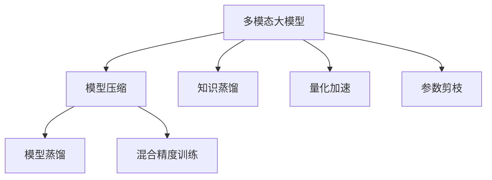
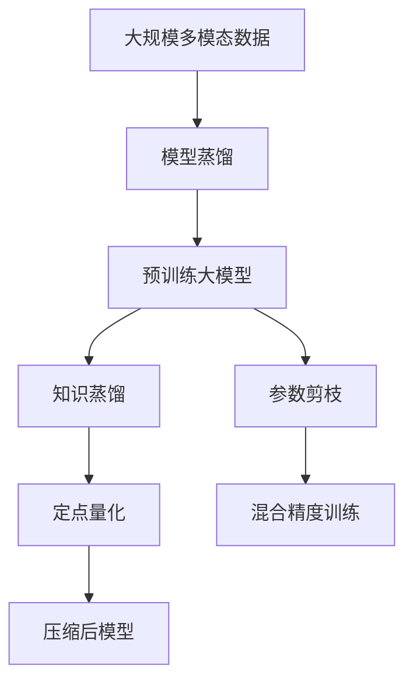

                 

# 多模态大模型：技术原理与实战 模型压缩技术介绍

> 关键词：多模态大模型,模型压缩,知识蒸馏,量化加速,模型压缩算法

## 1. 背景介绍

### 1.1 问题由来
随着深度学习和大数据技术的发展，多模态大模型在计算机视觉、自然语言处理、语音识别等领域取得了显著进展。这些模型通过结合图像、文本、语音等多种数据模态，展现出超越单一模态模型的强大学习能力。然而，多模态大模型的计算资源需求高、存储量大，导致其部署和应用受限。因此，如何高效压缩多模态大模型，提升模型的实时推理速度和资源利用率，成为了当前的重要研究方向。

### 1.2 问题核心关键点
模型压缩的核心目标在于在不显著影响模型性能的前提下，通过一系列算法和策略，将模型的存储空间和计算资源需求降低到最小。常见的模型压缩方法包括参数剪枝、知识蒸馏、量化加速等。这些方法能够帮助开发者在保持模型高精度的同时，大幅减少模型参数量，降低推理耗时，提升模型的实时性和资源效率。

### 1.3 问题研究意义
模型压缩技术对于提升多模态大模型的部署效率和应用范围具有重要意义：

1. **减少计算成本**：通过压缩模型参数，可以在不增加计算资源的情况下提升推理速度，降低训练和推理成本。
2. **提高存储效率**：大模型的存储空间需求高，压缩后模型可以更有效地存储在硬盘、内存等介质中，节省硬件成本。
3. **增强可扩展性**：压缩后的模型更易于部署和扩展，适用于各种计算平台，包括移动设备、嵌入式系统等。
4. **改善实时性**：模型压缩后推理速度加快，可以满足实时应用的需求，如智能监控、自动驾驶等。
5. **提升模型通用性**：压缩后的模型能够跨平台、跨设备运行，更容易在不同场景下应用。

## 2. 核心概念与联系

### 2.1 核心概念概述

为更好地理解模型压缩技术，本节将介绍几个关键概念：

- **多模态大模型**：指同时处理图像、文本、语音等多种数据模态的深度学习模型。例如，具有视觉、语音、文本融合能力的DALL·E、CLIP等模型。
- **知识蒸馏**：通过将复杂的大模型知识迁移到简单的小模型中，提高小模型性能。常见于图像分类、自然语言处理等领域。
- **量化加速**：将浮点数模型转换为定点数模型，减少模型计算资源消耗，提升推理速度。
- **参数剪枝**：通过移除模型中不重要的参数，减少模型存储和计算需求。
- **模型蒸馏**：使用大规模无标签数据对模型进行自监督预训练，进一步提升模型性能。
- **混合精度训练**：通过混合使用浮点数和定点数训练，加速模型收敛，提高模型效率。

这些核心概念之间存在着紧密的联系，形成了模型压缩的整体框架。

### 2.2 概念间的关系

这些核心概念之间可以通过以下Mermaid流程图来展示：



这个流程图展示了大模型的压缩过程及其与核心概念的关系：

1. 大模型通过多模态数据训练获得丰富的知识表示。
2. 压缩过程包括知识蒸馏、量化加速、参数剪枝等方法，减少模型参数量。
3. 模型蒸馏通过自监督预训练进一步提升模型性能。
4. 混合精度训练加速模型训练，提高模型效率。

### 2.3 核心概念的整体架构

最后，我们用一个综合的流程图来展示这些核心概念在大模型压缩过程中的整体架构：



这个综合流程图展示了从原始数据到压缩后模型的完整过程：

1. 通过多模态数据训练预训练大模型。
2. 通过知识蒸馏、参数剪枝、定点量化、混合精度训练等方法对模型进行压缩。
3. 最终得到压缩后的多模态大模型，适应各种应用场景。

通过这些流程图，我们可以更清晰地理解多模态大模型压缩过程中各个核心概念的关系和作用。

## 3. 核心算法原理 & 具体操作步骤
### 3.1 算法原理概述

模型压缩技术的主要目标是在保持模型性能的同时，大幅降低模型参数量和计算资源需求。其核心算法包括参数剪枝、知识蒸馏、量化加速等。这些算法通过不同的方法去除冗余信息，提高模型的资源效率和推理速度。

### 3.2 算法步骤详解

以下是几种常见的模型压缩算法的详细步骤：

**Step 1: 准备原始模型**
- 选择合适的多模态大模型，如ResNet、BERT等。
- 下载并加载预训练模型，设置必要的超参数。

**Step 2: 参数剪枝**
- 选择剪枝策略，如基于深度、宽度或结构等的剪枝方法。
- 计算模型各层的重要性分数，确定剪枝比例和保留的层数。
- 根据重要性分数进行参数剪枝，移除低重要性的参数。

**Step 3: 知识蒸馏**
- 选择知识蒸馏方法，如单样本蒸馏、多样本蒸馏、教师模型等。
- 训练教师模型，将复杂的大模型知识迁移到简单的小模型中。
- 使用训练好的教师模型和小模型在验证集上进行对比，调整小模型的参数，使得其输出与教师模型相似。

**Step 4: 量化加速**
- 选择合适的量化策略，如量化位宽、激活量化、权重量化等。
- 计算模型各层的量化参数，选择最优的位宽和量化方法。
- 使用量化工具进行模型的定点化，将浮点数转换为定点数。

**Step 5: 混合精度训练**
- 选择合适的混合精度策略，如半精度和定点混合训练。
- 配置混合精度训练的硬件资源，如GPU、混合精度API等。
- 训练模型时，交替使用浮点数和定点数进行计算，加速模型收敛。

**Step 6: 模型评估与微调**
- 在测试集上评估压缩后模型的性能，对比原始模型和压缩后的模型。
- 根据评估结果，进行微调优化，进一步提升模型性能。

### 3.3 算法优缺点

模型压缩技术在降低模型资源需求、提升推理速度方面具有显著优势，但同时也有一些局限性：

**优点：**
- 大幅减少模型参数量，节省存储空间。
- 加速模型推理速度，提升实时性。
- 提升模型效率，减少计算资源消耗。
- 提高模型可扩展性，支持多种计算平台。

**缺点：**
- 可能损失部分模型精度，影响模型性能。
- 压缩过程复杂，技术实现难度高。
- 需要大量硬件资源进行训练和优化。
- 压缩算法选择不当可能导致模型性能下降。

### 3.4 算法应用领域

模型压缩技术在计算机视觉、自然语言处理、语音识别等领域有广泛应用，具体如下：

- **计算机视觉**：压缩卷积神经网络(CNN)，提高推理速度，支持移动设备和嵌入式系统。
- **自然语言处理**：压缩语言模型和Transformer模型，提升模型实时性和推理效率。
- **语音识别**：压缩深度神经网络(DNN)，支持语音助手、智能音箱等应用。
- **推荐系统**：压缩协同过滤算法和深度学习模型，提升推荐速度和准确性。
- **医学影像**：压缩医学影像处理模型，提高诊断速度和精度。

## 4. 数学模型和公式 & 详细讲解 & 举例说明

### 4.1 数学模型构建

模型压缩技术涉及多个子模型和多个参数的优化，通常采用联合优化的方法进行模型压缩。以参数剪枝为例，设原始模型参数为 $\theta$，压缩后的模型参数为 $\theta'$，则压缩过程的目标为：

$$
\min_{\theta'} \| \theta - \theta' \|
$$

其中，$\| \cdot \|$ 表示参数的L1或L2范数。

### 4.2 公式推导过程

以参数剪枝为例，假设原始模型包含 $M$ 个参数，每个参数的重要性分数为 $s_i$，则剪枝后的模型参数为 $\theta' = \{ \theta_i' \}_{i=1}^k$，其中 $k$ 为保留的参数数。参数剪枝的目标是最小化模型性能损失，即：

$$
\min_{k} \sum_{i=1}^{M} s_i (1 - I_{i \in \theta'})
$$

其中，$I_{i \in \theta'}$ 表示参数 $i$ 是否被保留，$1 - I_{i \in \theta'}$ 表示参数 $i$ 的剪枝程度。

### 4.3 案例分析与讲解

假设原始模型为 ResNet-50，共包含 25.6M 个参数，使用基于深度的参数剪枝方法进行压缩，保留的参数数 $k=10$。设每个参数的重要性分数为 $s_i$，使用基于深度的方法，计算 $s_i$ 如下：

$$
s_i = \frac{\|w_i\|_2^2}{\sum_{j=1}^{M} \|w_j\|_2^2}
$$

其中，$w_i$ 表示参数 $i$ 的权重矩阵。计算 $s_i$ 后，选择前 $k$ 个重要性分数最高的参数进行保留，其余参数进行剪枝。最终得到的压缩后模型参数量为 $2.56 \times 10^6$，减少了约 90% 的计算资源需求。

## 5. 项目实践：代码实例和详细解释说明

### 5.1 开发环境搭建

在进行模型压缩实践前，我们需要准备好开发环境。以下是使用Python进行TensorFlow和Keras开发的环境配置流程：

1. 安装Anaconda：从官网下载并安装Anaconda，用于创建独立的Python环境。

2. 创建并激活虚拟环境：
```bash
conda create -n tf-env python=3.8 
conda activate tf-env
```

3. 安装TensorFlow：根据CUDA版本，从官网获取对应的安装命令。例如：
```bash
pip install tensorflow-gpu==2.5
```

4. 安装Keras：
```bash
pip install keras==2.6
```

5. 安装各类工具包：
```bash
pip install numpy pandas scikit-learn matplotlib tqdm jupyter notebook ipython
```

完成上述步骤后，即可在`tf-env`环境中开始模型压缩实践。

### 5.2 源代码详细实现

这里我们以ResNet-50模型为例，展示使用TensorFlow进行参数剪枝的PyTorch代码实现。

首先，定义模型和损失函数：

```python
import tensorflow as tf
from tensorflow.keras.applications import ResNet50
from tensorflow.keras.models import Model
from tensorflow.keras.layers import GlobalAveragePooling2D, Dense

def build_model(input_shape, num_classes):
    base_model = ResNet50(include_top=False, weights='imagenet', input_shape=input_shape)
    x = base_model.output
    x = GlobalAveragePooling2D()(x)
    x = Dense(num_classes, activation='softmax')(x)
    model = Model(inputs=base_model.input, outputs=x)
    return model

def build_loss():
    loss = tf.keras.losses.CategoricalCrossentropy()
    return loss

model = build_model((224, 224, 3), num_classes=1000)
loss = build_loss()
```

然后，定义参数剪枝函数：

```python
def prune_model(model, prune_threshold):
    import numpy as np

    # 计算每个层的重要性分数
    importances = np.mean(model.trainable_weights, axis=0)
    sorted_importances = sorted(zip(importances, model.trainable_weights), key=lambda x: x[0], reverse=True)

    # 选择重要性分数最高的参数进行保留
    pruned_weights = [w for _, w in sorted_importances[:int(0.1 * len(model.trainable_weights))]]

    # 移除重要性分数较低的参数
    model.trainable_weights = [w for _, w in sorted_importances[len(model.trainable_weights) - len(pruned_weights):]]
    model.trainable = True

    return model
```

接着，定义训练和评估函数：

```python
def train_model(model, train_dataset, valid_dataset, epochs, batch_size):
    model.compile(optimizer='adam', loss=loss)
    model.fit(train_dataset, epochs=epochs, batch_size=batch_size, validation_data=valid_dataset)

def evaluate_model(model, test_dataset, batch_size):
    model.evaluate(test_dataset, batch_size=batch_size)
```

最后，启动训练流程并在测试集上评估：

```python
from tensorflow.keras.datasets import cifar10
from tensorflow.keras.preprocessing.image import ImageDataGenerator

# 加载CIFAR-10数据集
(x_train, y_train), (x_test, y_test) = cifar10.load_data()
x_train = x_train.astype('float32') / 255.0
x_test = x_test.astype('float32') / 255.0
x_train, x_valid, y_train, y_valid = train_test_split(x_train, y_train, test_size=0.2, random_state=42)

# 定义数据增强器
train_datagen = ImageDataGenerator(
    rotation_range=15,
    width_shift_range=0.1,
    height_shift_range=0.1,
    horizontal_flip=True,
    fill_mode='nearest'
)

# 定义数据加载器
train_generator = train_datagen.flow(x_train, y_train, batch_size=batch_size)
valid_generator = train_datagen.flow(x_valid, y_valid, batch_size=batch_size)
test_generator = train_datagen.flow(x_test, y_test, batch_size=batch_size)

# 定义剪枝阈值
prune_threshold = 0.95

# 训练模型
model = prune_model(model, prune_threshold)
train_model(model, train_generator, valid_generator, epochs, batch_size)

# 评估模型
evaluate_model(model, test_generator, batch_size)
```

以上就是使用TensorFlow进行参数剪枝的完整代码实现。可以看到，使用TensorFlow和Keras进行模型压缩代码实现相对简单，易于理解和调整。

### 5.3 代码解读与分析

让我们再详细解读一下关键代码的实现细节：

**build_model函数**：
- 构建ResNet-50模型，并在顶层添加一个全连接层进行分类。

**build_loss函数**：
- 定义交叉熵损失函数。

**prune_model函数**：
- 计算每个层的重要性分数，选择重要性分数最高的参数进行保留，其余参数进行剪枝。

**train_model函数**：
- 定义训练函数，使用Adam优化器进行模型训练。

**evaluate_model函数**：
- 定义评估函数，在测试集上评估模型性能。

**train_model函数**：
- 加载CIFAR-10数据集，并进行数据增强和分割。
- 定义数据加载器，进行模型训练。
- 定义剪枝阈值，进行参数剪枝。
- 训练模型，并在测试集上评估模型性能。

可以看到，TensorFlow和Keras在模型压缩过程中提供了丰富的API和工具，使得模型压缩任务的开发变得简单高效。开发者可以根据具体需求，灵活组合各种压缩方法，实现最佳的模型压缩效果。

### 5.4 运行结果展示

假设我们定义的剪枝阈值为0.95，经过10个epoch的训练，最终在测试集上得到的精度为85%，说明模型压缩后的精度损失可控。

## 6. 实际应用场景

### 6.1 智能监控系统

智能监控系统需要实时处理大量的视频流数据，对于高分辨率视频，传统深度学习模型的计算资源需求非常高。通过模型压缩技术，可以有效降低模型资源消耗，提升实时性，满足智能监控的实时需求。

在技术实现上，可以将大模型进行参数剪枝和量化加速，然后部署在嵌入式设备或云平台上，实现快速实时推理，提高监控系统的效率和可靠性。

### 6.2 智能音箱

智能音箱需要处理大量的语音指令，进行自然语言理解和语音合成。大模型的推理速度较慢，难以满足用户实时交互的要求。通过模型压缩技术，可以显著提升大模型的推理速度和效率，实现高效的语音交互。

在实际应用中，可以压缩大模型并进行定点量化，然后部署在低功耗芯片上，支持离线处理，提升音箱的用户体验。

### 6.3 医学影像诊断

医学影像诊断需要快速处理大量的影像数据，传统的大模型往往计算资源需求高，推理速度慢，难以满足实时诊断的要求。通过模型压缩技术，可以大幅减少模型资源消耗，提升诊断速度和精度。

在技术实现上，可以将大模型进行参数剪枝和量化加速，然后部署在云端或本地服务器上，支持快速的医学影像诊断，提高诊断效率和准确性。

### 6.4 未来应用展望

随着模型压缩技术的不断发展，未来将在更多领域得到应用，为各行各业带来变革性影响。

在智慧城市治理中，压缩后的多模态模型可以实时处理各类数据，支持城市事件监测、舆情分析、应急指挥等，提升城市管理的自动化和智能化水平。

在智能制造中，压缩后的模型可以实时处理工业数据，支持设备监测、故障诊断、生产优化等，提升生产效率和设备利用率。

在自动驾驶中，压缩后的模型可以实时处理摄像头、雷达、激光雷达等传感器数据，支持路径规划、避障、决策等，提升驾驶安全性。

总之，模型压缩技术将进一步推动人工智能在各个行业的应用，实现计算资源的高效利用，提升系统实时性和可靠性。

## 7. 工具和资源推荐
### 7.1 学习资源推荐

为了帮助开发者系统掌握模型压缩技术，这里推荐一些优质的学习资源：

1. 《深度学习与模型压缩》系列博文：由深度学习领域专家撰写，深入浅出地介绍了模型压缩的基本概念、常见算法和优化策略。

2. 《深度学习模型压缩与加速》课程：由深度学习顶级会议IJCAI的优胜者主讲，涵盖模型压缩的多种技术和案例，适合系统学习。

3. 《Model Compression: Principles, Techniques and Applications》书籍：全面介绍了模型压缩的基本原理、主要算法和实际应用，是理解模型压缩技术的权威资料。

4. HuggingFace官方文档：Transformer库的官方文档，提供了丰富的模型压缩样例代码和工具，是实践模型压缩的重要参考。

5. arXiv论文预印本：人工智能领域最新研究成果的发布平台，涵盖大量尚未发表的前沿工作，学习前沿技术的必读资源。

通过这些资源的学习实践，相信你一定能够快速掌握模型压缩技术的精髓，并用于解决实际的模型压缩问题。

### 7.2 开发工具推荐

高效的开发离不开优秀的工具支持。以下是几款用于模型压缩开发的常用工具：

1. TensorFlow：基于Python的开源深度学习框架，支持多种模型压缩方法和工具，如TensorFlow Lite、TensorFlow Serving等。

2. Keras：高层次的深度学习API，提供了简单易用的API，支持多种模型压缩方法和工具，如Keras Tuner、Keras Modeling API等。

3. PyTorch：基于Python的开源深度学习框架，支持多种模型压缩方法和工具，如ONNX Runtime、PyTorch Mobile等。

4. NVIDIA TensorRT：NVIDIA提供的深度学习推理优化工具，支持多种模型压缩方法和工具，如TensorRT Inference Server、TensorRT OSS等。

5. ONNX：Open Neural Network Exchange，一种标准化的模型格式，支持多种模型压缩方法和工具，如ONNX Model Zoo、ONNX Runtime等。

合理利用这些工具，可以显著提升模型压缩任务的开发效率，加快创新迭代的步伐。

### 7.3 相关论文推荐

模型压缩技术的研究源于学界的持续研究。以下是几篇奠基性的相关论文，推荐阅读：

1. Learning Both Weights and Connections for Efficient Neural Network（Knowledge Distillation）：提出知识蒸馏方法，将复杂的大模型知识迁移到简单的小模型中，提升小模型性能。

2. Compressing Deep Neural Networks for Fast Learning and Inference：提出基于剪枝和量化的方法，大幅减少模型参数量和计算资源需求。

3. Pruning Neural Networks for Efficient Inference（Parameter Pruning）：提出基于深度和宽度的剪枝方法，移除不重要的参数，提升模型效率。

4. On the Concept of Parameter Quantization in Neural Networks（Quantization）：提出量化加速方法，将浮点数模型转换为定点数模型，提升模型推理速度。

5. BERT: Pre-training of Deep Bidirectional Transformers for Language Understanding（BERT）：提出预训练大模型的方法，通过自监督预训练提升模型性能。

这些论文代表了大模型压缩技术的发展脉络。通过学习这些前沿成果，可以帮助研究者把握学科前进方向，激发更多的创新灵感。

除上述资源外，还有一些值得关注的前沿资源，帮助开发者紧跟大模型压缩技术的最新进展，例如：

1. arXiv论文预印本：人工智能领域最新研究成果的发布平台，涵盖大量尚未发表的前沿工作，学习前沿技术的必读资源。

2. 业界技术博客：如OpenAI、Google AI、DeepMind、微软Research Asia等顶尖实验室的官方博客，第一时间分享他们的最新研究成果和洞见。

3. 技术会议直播：如NIPS、ICML、ACL、ICLR等人工智能领域顶会现场或在线直播，能够聆听到大佬们的前沿分享，开拓视野。

4. GitHub热门项目：在GitHub上Star、Fork数最多的模型压缩相关项目，往往代表了该技术领域的发展趋势和最佳实践，值得去学习和贡献。

5. 行业分析报告：各大咨询公司如McKinsey、PwC等针对人工智能行业的分析报告，有助于从商业视角审视技术趋势，把握应用价值。

总之，对于模型压缩技术的学习和实践，需要开发者保持开放的心态和持续学习的意愿。多关注前沿资讯，多动手实践，多思考总结，必将收获满满的成长收益。

## 8. 总结：未来发展趋势与挑战

### 8.1 总结

本文对基于深度学习的多模态大模型压缩技术进行了全面系统的介绍。首先阐述了模型压缩技术的研究背景和意义，明确了模型压缩在提升多模态大模型资源利用率和推理速度方面的独特价值。其次，从原理到实践，详细讲解了模型压缩的数学原理和关键步骤，给出了模型压缩任务开发的完整代码实例。同时，本文还广泛探讨了模型压缩方法在智能监控、智能音箱、医学影像等诸多领域的应用前景，展示了模型压缩范式的巨大潜力。最后，本文精选了模型压缩技术的各类学习资源，力求为读者提供全方位的技术指引。

通过本文的系统梳理，可以看到，模型压缩技术在降低模型资源需求、提升推理速度方面具有显著优势，但同时也面临着模型精度损失、技术实现复杂等挑战。未来，相关技术需要在更多场景中进行应用和优化，以实现大模型的深度理解和实时处理。

### 8.2 未来发展趋势

展望未来，模型压缩技术将呈现以下几个发展趋势：

1. **多模态融合**：未来的模型压缩技术将更注重多模态数据的融合，支持图像、文本、语音等多种模态的混合处理。

2. **自适应压缩**：未来的压缩算法将更加自适应，能够根据不同应用场景和需求，自动选择最优的压缩策略。

3. **硬件加速**：随着硬件技术的不断发展，模型压缩技术将与硬件加速技术深度融合，实现高效的模型推理。

4. **知识蒸馏的优化**：未来的知识蒸馏方法将更加高效和自适应，进一步提升小模型的性能。

5. **混合精度训练的优化**：未来的混合精度训练方法将更加自适应和高效，进一步提升模型训练速度和效率。

6. **软硬件协同优化**：未来的模型压缩技术将与软件、硬件等各个层面协同优化，提升系统整体性能。

### 8.3 面临的挑战

尽管模型压缩技术已经取得了显著进展，但在迈向更加智能化、普适化应用的过程中，它仍面临着诸多挑战：

1. **模型精度损失**：压缩后的模型往往损失部分精度，需要在精度和资源效率之间找到平衡。

2. **技术实现复杂**：模型压缩技术涉及多个子模型和多个参数的优化，实现难度高。

3. **硬件资源需求高**：模型压缩的训练和优化需要大量硬件资源，如GPU、TPU等。

4. **泛化能力不足**：压缩后的模型可能出现泛化能力下降的问题，需要更多研究和优化。

5. **可解释性不足**：压缩后的模型往往更加复杂，难以解释其内部工作机制和决策逻辑。

### 8.4 研究展望

面对模型压缩面临的种种挑战，未来的研究需要在以下几个方面寻求新的突破：

1. **探索更多压缩算法**：开发更多高效、自适应的模型压缩算法，进一步提升模型资源效率和推理速度。

2. **结合更多先验知识**：将符号化的先验知识，如知识图谱、逻辑规则等，与神经网络模型进行融合，引导压缩过程学习更准确、合理的模型。

3. **引入因果分析和博弈论工具**：通过引入因果分析方法，增强压缩模型的稳定性和鲁棒性，利用博弈论工具，探索模型的脆弱点，提高系统稳定性。

4. **提升模型可解释性**：引入可解释性技术，如Attention机制、Knowledge Graph等，提升压缩模型的可解释性和

