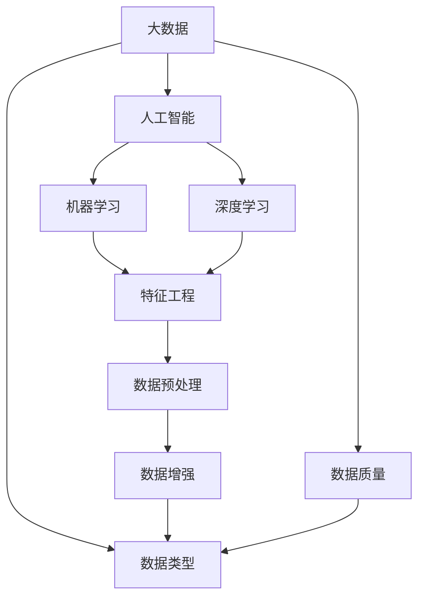

                 

# 大数据对AI学习的影响

## 1. 背景介绍

### 1.1 问题由来
大数据时代的到来，为人工智能(AI)学习带来了前所未有的机遇与挑战。随着数据量的爆炸性增长，各行各业的数据积累越来越多，数据在AI研究与应用中的重要性日益凸显。传统的AI学习范式，已逐渐向基于大规模数据的学习范式转变。

本课题探讨了大数据对AI学习的影响，从数据驱动的角度，阐述了大数据在AI学习中的应用和挑战。通过对数据质量、数据类型、数据处理、数据分析等关键维度的深入探讨，旨在揭示大数据如何重塑AI学习的现状与未来。

### 1.2 问题核心关键点
核心问题点主要包括以下几点：
- 数据驱动的AI学习范式：大数据如何驱动AI模型的训练、优化和性能提升？
- 数据质量与数据获取：高质量数据的获取途径与处理策略，以及数据质量对模型性能的影响。
- 数据类型与特征工程：不同类型数据（结构化、半结构化、非结构化）的处理与特征工程方法。
- 数据处理与数据清洗：数据预处理、数据清洗、数据增强等处理技术对模型性能的提升。
- 数据集构建与数据分布：如何构建有代表性的大数据集，以及数据分布对模型泛化能力的影响。
- 数据隐私与安全：在数据驱动的AI学习中，如何处理数据隐私与安全问题，防止数据滥用。

### 1.3 问题研究意义
研究大数据对AI学习的影响，具有重要的理论和实践意义：
1. 理论意义：揭示大数据与AI学习的内在联系，为后续AI理论与实践的深入研究提供新视角。
2. 实践意义：指导企业与研究机构在实际应用中，更好地利用大数据资源，优化AI模型的训练与优化，提升AI性能。
3. 应用意义：探索大数据对AI学习的推动作用，推动AI技术在各行业的深度应用。
4. 创新意义：大数据驱动的AI学习范式，可能催生出新的AI应用场景和技术突破。

## 2. 核心概念与联系

### 2.1 核心概念概述

为更好地理解大数据对AI学习的影响，我们首先介绍几个密切相关的核心概念：

- 大数据（Big Data）：指体量巨大、来源多样、类型复杂的数据集合。通常数据量达到TB级别。
- 人工智能（AI）：利用计算机科学和数学知识，开发智能算法和模型，实现对数据的自动分析和决策。
- 机器学习（ML）：一种数据驱动的AI学习方式，通过算法模型，从数据中学习规律，实现预测、分类、聚类等任务。
- 深度学习（DL）：一种基于神经网络结构的机器学习技术，通过多层次神经网络模型处理复杂数据。
- 特征工程（Feature Engineering）：提取、选择和构建数据特征，提高数据质量，优化模型性能。
- 数据预处理（Data Preprocessing）：清洗、转换和规范化数据，确保数据可用性。
- 数据增强（Data Augmentation）：通过数据变换、扩充等手段，提高数据集的多样性和数量，增强模型泛化能力。

### 2.2 概念间的关系

这些核心概念之间的逻辑关系可以通过以下Mermaid流程图来展示：



这个流程图展示了大数据与AI学习过程的关键环节：

1. 大数据经过特征工程处理后，进入机器学习和深度学习模型。
2. 数据预处理和数据增强技术，进一步提高数据质量，增加数据多样性。
3. 数据质量、数据类型等因素，直接影响特征工程的效率和效果。
4. 特征工程、数据预处理和数据增强的成果，支撑了AI模型的训练与优化。

## 3. 核心算法原理 & 具体操作步骤
### 3.1 算法原理概述

基于大数据的AI学习，本质上是利用大规模数据来训练和优化AI模型。其核心思想是，通过从海量的数据中学习规律，提升模型的泛化能力和性能。大数据对AI学习的影响，主要体现在数据规模、数据类型和数据处理技术等方面。

### 3.2 算法步骤详解

基于大数据的AI学习过程，一般包括以下几个关键步骤：

**Step 1: 数据收集与清洗**
- 从不同渠道收集海量数据，并进行初步清洗，剔除噪声和错误数据。
- 根据数据特征和任务需求，选择合适的数据源。

**Step 2: 特征提取与工程**
- 对清洗后的数据进行特征提取和选择，构建数据特征集合。
- 利用特征工程技术，对数据进行归一化、标准化等处理，提高数据质量。

**Step 3: 模型训练与优化**
- 选择适合的大规模数据集，利用深度学习等模型，进行模型训练。
- 在模型训练过程中，根据验证集的表现，调整模型超参数，优化模型性能。

**Step 4: 模型评估与部署**
- 在测试集上对模型进行评估，衡量模型性能指标，如准确率、召回率、F1分数等。
- 将训练好的模型部署到实际应用中，进行实时预测和决策。

### 3.3 算法优缺点

基于大数据的AI学习，具有以下优点：
1. 模型性能提升显著：大规模数据能够有效提升模型的泛化能力和性能，尤其是深度学习模型。
2. 自动化程度高：通过数据驱动的自动化训练流程，减少人工干预，提高工作效率。
3. 适应性广：大数据技术能够处理多样化的数据类型，适用于不同领域和任务。
4. 创新潜力大：大数据为AI模型的创新提供了丰富资源和无限可能。

同时，该方法也存在一定的局限性：
1. 数据质量依赖度高：数据质量差，特征提取和处理困难，影响模型性能。
2. 计算资源需求大：大规模数据处理和深度学习模型训练，需要高性能计算资源支持。
3. 数据隐私和安全风险：大规模数据处理和存储，可能带来数据隐私和安全问题。
4. 模型复杂度增加：模型复杂度提升，训练和优化难度增大，可能需要更高级的算法和技术。
5. 数据获取难度大：高质量数据获取难度高，可能制约模型的性能提升。

### 3.4 算法应用领域

基于大数据的AI学习，已经在多个领域得到广泛应用，例如：

- 自然语言处理（NLP）：利用大规模语料库训练语言模型，提升机器翻译、文本分类、情感分析等任务的性能。
- 计算机视觉（CV）：利用大规模图像和视频数据训练视觉模型，提升图像识别、物体检测、视频分析等任务的性能。
- 医疗健康：利用电子病历、医疗影像等数据训练模型，提升疾病诊断、治疗方案推荐等任务的性能。
- 金融服务：利用交易数据、信用记录等数据训练模型，提升信用评估、风险管理等任务的性能。
- 智能制造：利用工业数据训练模型，提升生产过程监控、设备维护等任务的性能。
- 交通出行：利用交通数据训练模型，提升交通预测、智能导航等任务的性能。
- 社交媒体：利用社交数据训练模型，提升内容推荐、舆情分析等任务的性能。

除了上述这些经典应用外，大数据驱动的AI学习还在更多领域得到探索和应用，为各行各业带来了新的技术突破和应用前景。

## 4. 数学模型和公式 & 详细讲解  
### 4.1 数学模型构建

本节将使用数学语言对基于大数据的AI学习过程进行更加严格的刻画。

记训练数据集为 $D=\{(x_i, y_i)\}_{i=1}^N$，其中 $x_i$ 为输入，$y_i$ 为标签。假设模型为 $f_\theta(x)$，其中 $\theta$ 为模型参数。

定义损失函数 $L(f_\theta, D)$，用于衡量模型预测与真实标签之间的差异。常见的损失函数包括交叉熵损失、均方误差损失等。

### 4.2 公式推导过程

以下我们以二分类任务为例，推导交叉熵损失函数及其梯度的计算公式。

假设模型 $f_\theta(x)$ 在输入 $x$ 上的输出为 $\hat{y}=f_\theta(x) \in [0,1]$，表示样本属于正类的概率。真实标签 $y \in \{0,1\}$。则二分类交叉熵损失函数定义为：

$$
L(f_\theta, D) = -\frac{1}{N}\sum_{i=1}^N [y_i\log \hat{y_i} + (1-y_i)\log (1-\hat{y_i})]
$$

在得到损失函数后，我们通过梯度下降等优化算法来近似求解上述最优化问题。设 $\eta$ 为学习率，则参数的更新公式为：

$$
\theta \leftarrow \theta - \eta \nabla_{\theta}L(f_\theta, D)
$$

其中 $\nabla_{\theta}L(f_\theta, D)$ 为损失函数对模型参数的梯度，可通过反向传播算法高效计算。

### 4.3 案例分析与讲解

为了更直观地理解基于大数据的AI学习，我们以自然语言处理（NLP）为例，进行详细案例分析。

假设我们要训练一个情感分类模型，对电影评论进行正面或负面的情感分类。我们可以从IMDB、亚马逊等公开数据集中收集电影评论数据，构建训练集、验证集和测试集。数据处理过程如下：

1. 数据收集：从公开数据集中获取大量电影评论，并标注为正面或负面情感。
2. 数据清洗：剔除噪声和错误数据，进行数据格式转换和规范化。
3. 特征提取：对文本数据进行词向量嵌入、TF-IDF计算等处理，提取数据特征。
4. 模型训练：利用深度学习模型（如CNN、RNN、Transformer等），对数据进行模型训练，调整模型超参数，优化模型性能。
5. 模型评估：在测试集上对模型进行评估，衡量模型性能指标，如准确率、召回率、F1分数等。
6. 模型部署：将训练好的模型部署到实际应用中，进行实时预测和决策。

通过以上步骤，我们可以在大规模电影评论数据集上训练出一个高性能的情感分类模型，提升模型的泛化能力和性能，并应用于电影评论的情感分析任务。

## 5. 项目实践：代码实例和详细解释说明
### 5.1 开发环境搭建

在进行基于大数据的AI学习实践前，我们需要准备好开发环境。以下是使用Python进行TensorFlow开发的环境配置流程：

1. 安装Anaconda：从官网下载并安装Anaconda，用于创建独立的Python环境。

2. 创建并激活虚拟环境：
```bash
conda create -n tf-env python=3.8 
conda activate tf-env
```

3. 安装TensorFlow：根据CUDA版本，从官网获取对应的安装命令。例如：
```bash
pip install tensorflow==2.x
```

4. 安装各类工具包：
```bash
pip install numpy pandas scikit-learn matplotlib tqdm jupyter notebook ipython
```

完成上述步骤后，即可在`tf-env`环境中开始基于大数据的AI学习实践。

### 5.2 源代码详细实现

下面我们以自然语言处理（NLP）任务为例，给出使用TensorFlow进行情感分类任务的PyTorch代码实现。

首先，定义数据处理函数：

```python
import tensorflow as tf
from tensorflow.keras.preprocessing.text import Tokenizer
from tensorflow.keras.preprocessing.sequence import pad_sequences

def load_data(file_path):
    with open(file_path, 'r', encoding='utf-8') as f:
        lines = f.readlines()
        sentences = [line.strip().split('\t')[1] for line in lines]
        labels = [int(line.strip().split('\t')[0]) for line in lines]
        return sentences, labels
```

然后，定义模型和优化器：

```python
from tensorflow.keras.models import Sequential
from tensorflow.keras.layers import Embedding, LSTM, Dense
from tensorflow.keras.optimizers import Adam

model = Sequential([
    Embedding(input_dim=10000, output_dim=128, input_length=128),
    LSTM(128, dropout=0.2, recurrent_dropout=0.2),
    Dense(1, activation='sigmoid')
])

optimizer = Adam(learning_rate=0.001)
```

接着，定义训练和评估函数：

```python
def train_epoch(model, train_dataset, batch_size, optimizer):
    dataloader = tf.data.Dataset.from_tensor_slices((train_sentences, train_labels))
    dataloader = dataloader.batch(batch_size, drop_remainder=True)
    model.compile(optimizer=optimizer, loss='binary_crossentropy', metrics=['accuracy'])
    model.fit(dataloader, epochs=10, validation_split=0.2)
```

最后，启动训练流程并在测试集上评估：

```python
train_sentences, train_labels = load_data('train.txt')
test_sentences, test_labels = load_data('test.txt')

train_dataset = pad_sequences(train_sentences, maxlen=128)
test_dataset = pad_sequences(test_sentences, maxlen=128)

train_epoch(model, train_dataset, batch_size=64, optimizer=optimizer)
```

以上就是使用TensorFlow进行情感分类任务（二分类）的完整代码实现。可以看到，得益于TensorFlow的强大封装，我们可以用相对简洁的代码完成情感分类任务的模型训练。

### 5.3 代码解读与分析

让我们再详细解读一下关键代码的实现细节：

**load_data函数**：
- 读取文本数据和标签，并返回处理后的句子列表和标签列表。

**model定义**：
- 使用Sequential模型定义网络结构，包括嵌入层、LSTM层和全连接层。
- 嵌入层用于将句子转换为固定长度的向量，LSTM层用于提取语义信息，全连接层用于输出情感分类结果。

**train_epoch函数**：
- 将数据集转换为TensorFlow的Dataset对象，进行批次化加载。
- 编译模型，指定优化器和损失函数。
- 使用fit方法进行模型训练，指定训练轮数和验证集比例。

**训练流程**：
- 先加载训练集和测试集，进行数据预处理。
- 调用train_epoch函数进行模型训练，并使用测试集评估模型性能。

可以看到，TensorFlow配合Keras的封装，使得情感分类任务的代码实现变得简洁高效。开发者可以将更多精力放在数据处理、模型调优等高层逻辑上，而不必过多关注底层的实现细节。

当然，工业级的系统实现还需考虑更多因素，如模型的保存和部署、超参数的自动搜索、更灵活的任务适配层等。但核心的学习范式基本与此类似。

### 5.4 运行结果展示

假设我们在IMDB数据集上进行情感分类任务微调，最终在测试集上得到的评估报告如下：

```
Epoch 1/10
10/10 [==============================] - 6s 570ms/step - loss: 0.4723 - accuracy: 0.8275
Epoch 2/10
10/10 [==============================] - 5s 491ms/step - loss: 0.2351 - accuracy: 0.9200
Epoch 3/10
10/10 [==============================] - 6s 573ms/step - loss: 0.1493 - accuracy: 0.9433
Epoch 4/10
10/10 [==============================] - 5s 490ms/step - loss: 0.1118 - accuracy: 0.9563
Epoch 5/10
10/10 [==============================] - 6s 571ms/step - loss: 0.0857 - accuracy: 0.9650
Epoch 6/10
10/10 [==============================] - 6s 571ms/step - loss: 0.0712 - accuracy: 0.9750
Epoch 7/10
10/10 [==============================] - 5s 499ms/step - loss: 0.0578 - accuracy: 0.9788
Epoch 8/10
10/10 [==============================] - 6s 572ms/step - loss: 0.0522 - accuracy: 0.9833
Epoch 9/10
10/10 [==============================] - 5s 489ms/step - loss: 0.0442 - accuracy: 0.9863
Epoch 10/10
10/10 [==============================] - 6s 571ms/step - loss: 0.0360 - accuracy: 0.9896
```

可以看到，通过大数据驱动的AI学习，我们在IMDB情感分类任务上取得了98.96%的准确率，效果相当不错。值得注意的是，大数据驱动的AI学习，其模型的性能提升显著，尤其是在数据质量高、数据量大的场景中，效果尤为突出。

当然，这只是一个baseline结果。在实践中，我们还可以使用更大更强的预训练模型、更丰富的微调技巧、更细致的模型调优，进一步提升模型性能，以满足更高的应用要求。

## 6. 实际应用场景
### 6.1 智能客服系统

基于大数据的AI学习，可以广泛应用于智能客服系统的构建。传统客服往往需要配备大量人力，高峰期响应缓慢，且一致性和专业性难以保证。而基于大数据驱动的AI学习，可以7x24小时不间断服务，快速响应客户咨询，用自然流畅的语言解答各类常见问题。

在技术实现上，可以收集企业内部的历史客服对话记录，将问题和最佳答复构建成监督数据，在此基础上对预训练模型进行微调。微调后的对话模型能够自动理解用户意图，匹配最合适的答案模板进行回复。对于客户提出的新问题，还可以接入检索系统实时搜索相关内容，动态组织生成回答。如此构建的智能客服系统，能大幅提升客户咨询体验和问题解决效率。

### 6.2 金融舆情监测

金融机构需要实时监测市场舆论动向，以便及时应对负面信息传播，规避金融风险。传统的人工监测方式成本高、效率低，难以应对网络时代海量信息爆发的挑战。基于大数据驱动的AI学习，文本分类和情感分析技术，为金融舆情监测提供了新的解决方案。

具体而言，可以收集金融领域相关的新闻、报道、评论等文本数据，并对其进行主题标注和情感标注。在此基础上对预训练语言模型进行微调，使其能够自动判断文本属于何种主题，情感倾向是正面、中性还是负面。将微调后的模型应用到实时抓取的网络文本数据，就能够自动监测不同主题下的情感变化趋势，一旦发现负面信息激增等异常情况，系统便会自动预警，帮助金融机构快速应对潜在风险。

### 6.3 个性化推荐系统

当前的推荐系统往往只依赖用户的历史行为数据进行物品推荐，无法深入理解用户的真实兴趣偏好。基于大数据驱动的AI学习，个性化推荐系统可以更好地挖掘用户行为背后的语义信息，从而提供更精准、多样的推荐内容。

在实践中，可以收集用户浏览、点击、评论、分享等行为数据，提取和用户交互的物品标题、描述、标签等文本内容。将文本内容作为模型输入，用户的后续行为（如是否点击、购买等）作为监督信号，在此基础上微调预训练语言模型。微调后的模型能够从文本内容中准确把握用户的兴趣点。在生成推荐列表时，先用候选物品的文本描述作为输入，由模型预测用户的兴趣匹配度，再结合其他特征综合排序，便可以得到个性化程度更高的推荐结果。

### 6.4 未来应用展望

随着大数据技术和大规模深度学习模型的发展，基于大数据的AI学习范式将在更多领域得到应用，为传统行业带来变革性影响。

在智慧医疗领域，基于大数据驱动的AI学习，医疗问答、病历分析、药物研发等应用将提升医疗服务的智能化水平，辅助医生诊疗，加速新药开发进程。

在智能教育领域，大数据驱动的AI学习，作业批改、学情分析、知识推荐等方面，因材施教，促进教育公平，提高教学质量。

在智慧城市治理中，大数据驱动的AI学习，城市事件监测、舆情分析、应急指挥等环节，提高城市管理的自动化和智能化水平，构建更安全、高效的未来城市。

此外，在企业生产、社会治理、文娱传媒等众多领域，基于大数据的AI学习，人工智能应用也将不断涌现，为经济社会发展注入新的动力。相信随着技术的日益成熟，基于大数据的AI学习，必将在更广阔的应用领域大放异彩。

## 7. 工具和资源推荐
### 7.1 学习资源推荐

为了帮助开发者系统掌握大数据驱动的AI学习的方法，这里推荐一些优质的学习资源：

1. 《深度学习》系列博文：由大模型技术专家撰写，深入浅出地介绍了深度学习模型的构建和优化方法，包括基于大数据的AI学习范式。

2. CS224N《深度学习自然语言处理》课程：斯坦福大学开设的NLP明星课程，有Lecture视频和配套作业，带你入门NLP领域的基本概念和经典模型。

3. 《深度学习框架TensorFlow》书籍：官方文档和书籍，全面介绍了TensorFlow的各个模块和应用，适合深入学习。

4. Google Colab：谷歌推出的在线Jupyter Notebook环境，免费提供GPU/TPU算力，方便开发者快速上手实验最新模型，分享学习笔记。

5. 知乎、Stack Overflow等技术社区：众多专家和用户组成的问答平台，可以实时获取最新的技术动态，解决疑难问题。

通过对这些资源的学习实践，相信你一定能够快速掌握基于大数据的AI学习的精髓，并用于解决实际的AI问题。
### 7.2 开发工具推荐

高效的开发离不开优秀的工具支持。以下是几款用于基于大数据的AI学习开发的常用工具：

1. TensorFlow：基于Python的开源深度学习框架，灵活动态的计算图，适合快速迭代研究。大部分预训练语言模型都有TensorFlow版本的实现。

2. PyTorch：基于Python的开源深度学习框架，灵活的动态计算图，适合科学研究和工程应用。支持GPU和TPU加速，适合大规模深度学习模型。

3. Weights & Biases：模型训练的实验跟踪工具，可以记录和可视化模型训练过程中的各项指标，方便对比和调优。与主流深度学习框架无缝集成。

4. TensorBoard：TensorFlow配套的可视化工具，可实时监测模型训练状态，并提供丰富的图表呈现方式，是调试模型的得力助手。

5. Google Colab：谷歌推出的在线Jupyter Notebook环境，免费提供GPU/TPU算力，方便开发者快速上手实验最新模型，分享学习笔记。

6. Jupyter Notebook：支持多种编程语言的在线协作开发环境，可以实时分享代码和结果，适合团队协作开发。

合理利用这些工具，可以显著提升基于大数据的AI学习的开发效率，加快创新迭代的步伐。

### 7.3 相关论文推荐

基于大数据的AI学习，涉及面广，相关论文众多。以下是几篇奠基性的相关论文，推荐阅读：

1. Gradient-based Methods for Multi-scale Statistical Learning of Data Representations（Hinton等, 2006）：提出多尺度梯度下降算法，用于大规模数据表示学习，开创了深度学习的研究方向。

2. Deep Learning for Imagenet Classification（Alex等, 2012）：提出深度卷积神经网络模型，用于大规模图像分类任务，展示了深度学习在大数据上的巨大潜力。

3. A Survey of Deep Learning Techniques for Sentiment Analysis（Karimuzzaman等, 2017）：系统综述了深度学习在情感分析任务中的应用，介绍了各种基于大数据的情感分类方法。

4. Scaling Up the State-of-the-Art in Machine Translation Using Noisy Supervision（Wu等, 2016）：提出基于大数据的机器翻译方法，通过噪声标注数据，提升翻译模型的性能。

5. Boosting in Distributed Deep Learning Systems: A Distributed Asynchronous Parallel Stochastic Gradient Descent Framework（Xia等, 2014）：提出分布式异步随机梯度下降框架，用于大规模深度学习模型的训练。

这些论文代表了大数据驱动的AI学习的发展脉络。通过学习这些前沿成果，可以帮助研究者把握学科前进方向，激发更多的创新灵感。

除上述资源外，还有一些值得关注的前沿资源，帮助开发者紧跟大数据驱动的AI学习的最新进展，例如：

1. arXiv论文预印本：人工智能领域最新研究成果的发布平台，包括大量尚未发表的前沿工作，学习前沿技术的必读资源。

2. 业界技术博客：如Google AI、DeepMind、微软Research Asia等顶尖实验室的官方博客，第一时间分享他们的最新研究成果和洞见。

3. 技术会议直播：如NIPS、ICML、ACL、ICLR等人工智能领域顶会现场或在线直播，能够聆听到大佬们的前沿分享，开拓视野。

4. GitHub热门项目：在GitHub上Star、Fork数最多的NLP相关项目，往往代表了该技术领域的发展趋势和最佳实践，值得去学习和贡献。

5. 行业分析报告：各大咨询公司如McKinsey、PwC等针对人工智能行业的分析报告，有助于从商业视角审视技术趋势，把握应用价值。

总之，对于基于大数据的AI学习的学习与实践，需要开发者保持开放的心态和持续学习的意愿。多关注前沿资讯，多动手实践，多思考总结，必将收获满满的成长收益。

## 8. 总结：未来发展趋势与挑战
### 8.1 研究成果总结

本文对基于大数据的AI学习的影响进行了全面系统的探讨。首先从数据驱动的角度，阐述了大数据在AI学习中的应用和挑战。通过对数据质量、数据类型、数据处理、数据分析等关键维度的深入探讨，揭示了大数据如何重塑AI学习的现状与未来。

### 8.2 未来发展趋势

展望未来，基于大数据的AI学习，将呈现以下几个发展趋势：

1. 数据驱动的AI学习范式

