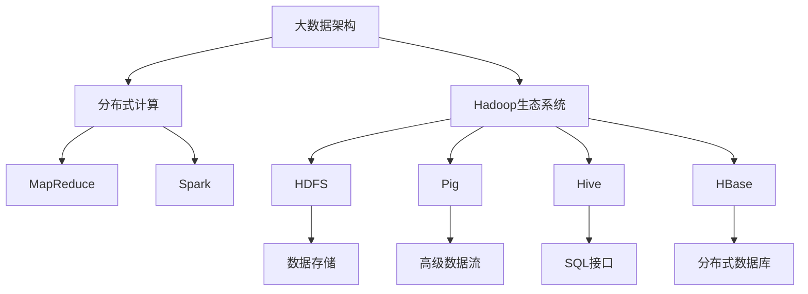
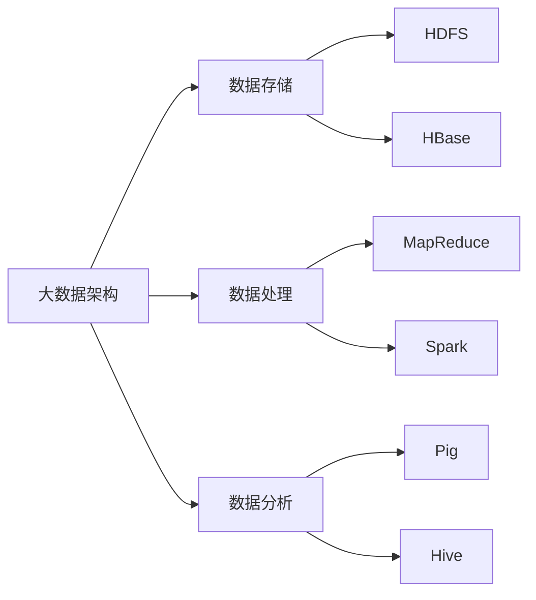
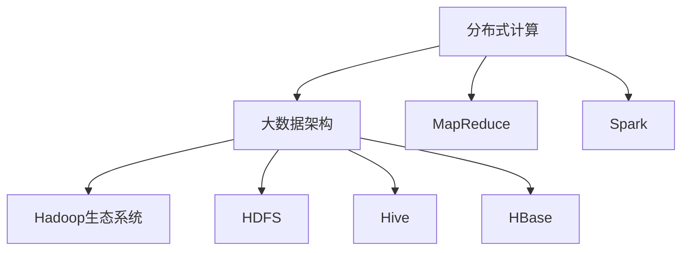
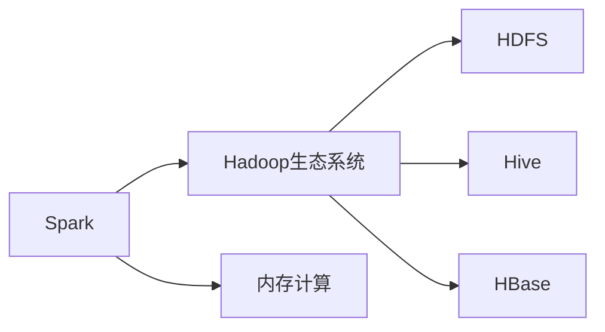
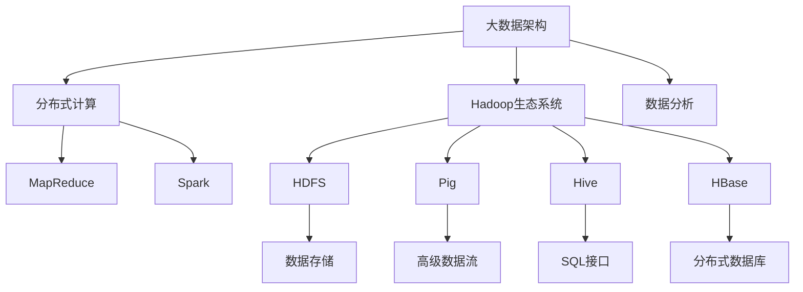

                 

# 大数据架构原理与代码实例讲解

> 关键词：大数据架构,分布式计算,Spark,MapReduce,Hadoop

## 1. 背景介绍

### 1.1 问题由来
在过去十年中，大数据技术的飞速发展极大地改变了信息处理的方式。企业从数据孤岛走向数据驱动，利用大数据分析提升决策的精准性和效率。然而，伴随数据量的爆炸性增长，传统的数据处理方式面临着计算资源不足、数据存储成本高昂、数据处理速度慢等问题。为了应对这些挑战，构建高效、可扩展的大数据架构体系，业界提出了众多解决方案，其中最具代表性的当属Hadoop生态系统和Spark计算框架。本文将从原理和代码实例两个维度，全面解析大数据架构的核心原理，并结合实际案例，深入探讨其应用和挑战。

### 1.2 问题核心关键点
大数据架构的核心在于如何高效、可靠地处理海量数据。常见的解决方案包括分布式计算、数据存储、数据集成、数据分析等技术。目前主流的架构体系包括：

- Hadoop：通过HDFS和MapReduce构建的高可扩展、高可靠性的数据存储和处理平台。
- Spark：基于内存计算的分布式计算框架，支持多种编程接口，灵活高效。
- Hive：基于Hadoop的数据仓库工具，提供SQL接口查询大数据。
- Pig：基于Hadoop的高级数据流语言，支持复杂的数据处理逻辑。
- Kafka：实时数据流处理框架，支持数据的高吞吐量、低延迟处理。

这些技术通过有机结合，构建了一个完整的大数据处理生态系统，能够支撑企业数据的收集、存储、处理和分析。

### 1.3 问题研究意义
研究大数据架构的原理和实践，对于提升企业数据处理能力，驱动业务增长，具有重要意义：

1. 降低数据处理成本。通过分布式计算和存储，大幅降低数据中心的基础设施投入，节省能源成本。
2. 提高数据处理效率。利用分布式并行计算，处理海量数据，快速响应业务需求。
3. 保障数据安全与隐私。大数据架构通过数据冗余、加密等措施，保护数据安全，满足合规要求。
4. 加速数据驱动决策。实时数据分析帮助企业快速洞察业务趋势，制定精准的战略决策。
5. 推动技术创新。大数据架构催生了更多前沿技术，如机器学习、人工智能等，助力企业数字化转型。

## 2. 核心概念与联系

### 2.1 核心概念概述

为更好地理解大数据架构体系，本节将介绍几个密切相关的核心概念：

- **分布式计算**：通过多台计算节点的并行计算，实现数据的高效处理。常见的分布式计算框架包括MapReduce和Spark。
- **Hadoop生态系统**：由Apache Hadoop项目维护的大数据处理平台，包含HDFS、MapReduce、Hive、Pig、HBase等组件。
- **Spark计算框架**：Apache Spark项目提供的分布式计算框架，支持内存计算、弹性分布式数据集（RDD）等特性。
- **MapReduce**：一种编程模型和处理框架，将大规模数据集分成多个小片段，通过Map和Reduce两个步骤进行并行计算。
- **HDFS**：Hadoop分布式文件系统，提供高容错、高可靠性的数据存储。
- **HBase**：分布式数据库，提供高吞吐量、高可扩展性的大数据存储。

这些核心概念之间的逻辑关系可以通过以下Mermaid流程图来展示：



这个流程图展示了大数据架构的关键概念及其之间的关系：

1. 大数据架构通过分布式计算处理海量数据。
2. 分布式计算框架MapReduce和Spark提供了并行计算能力。
3. Hadoop生态系统提供了一个完整的数据处理平台，包含数据存储、查询、流处理等多种功能。
4. HDFS和HBase分别提供高容错和可扩展的数据存储能力。
5. Pig和Hive分别提供高级数据流处理和SQL接口，方便数据分析和查询。

### 2.2 概念间的关系

这些核心概念之间存在着紧密的联系，形成了大数据架构的完整生态系统。下面我们通过几个Mermaid流程图来展示这些概念之间的关系。

#### 2.2.1 大数据架构的组成



这个流程图展示了大数据架构的基本组成：

1. 大数据架构包括数据存储、数据处理和数据分析三个部分。
2. HDFS和HBase提供高容错和可扩展的数据存储。
3. MapReduce和Spark提供分布式计算能力，处理大规模数据集。
4. Pig和Hive提供高级数据流处理和SQL接口，支持数据分析和查询。

#### 2.2.2 分布式计算与大数据架构的关系



这个流程图展示了分布式计算与大数据架构的紧密关系：

1. 分布式计算是大数据架构的核心技术之一。
2. MapReduce和Spark提供了并行计算能力，是数据处理和分析的基础。
3. Hadoop生态系统构建在分布式计算之上，提供数据存储、查询、流处理等多种功能。

#### 2.2.3 Spark与Hadoop的关系



这个流程图展示了Spark与Hadoop生态系统的关系：

1. Spark是一种基于内存计算的分布式计算框架。
2. Spark可以与Hadoop生态系统无缝集成，共享数据和计算资源。
3. Spark支持的RDD等数据结构能够更好地适应内存计算，提高数据处理效率。

### 2.3 核心概念的整体架构

最后，我们用一个综合的流程图来展示这些核心概念在大数据架构中的整体架构：



这个综合流程图展示了从分布式计算到数据分析的大数据架构完整过程：

1. 大数据架构通过分布式计算处理海量数据。
2. MapReduce和Spark提供了并行计算能力，处理大规模数据集。
3. Hadoop生态系统提供了一个完整的数据处理平台，包含数据存储、查询、流处理等多种功能。
4. HDFS和HBase分别提供高容错和可扩展的数据存储能力。
5. Pig和Hive分别提供高级数据流处理和SQL接口，方便数据分析和查询。
6. 数据分析通过Pig和Hive提供的数据处理和查询功能，实现数据的深度挖掘和利用。

通过这些流程图，我们可以更清晰地理解大数据架构的各个组成部分及其相互关系，为后续深入讨论具体的架构实现奠定基础。

## 3. 核心算法原理 & 具体操作步骤
### 3.1 算法原理概述

大数据架构的核心算法原理主要涉及分布式计算、数据存储和数据分析三个方面。

- **分布式计算**：通过将大规模数据集分成多个小片段，在多台计算节点上并行处理，实现数据的高效处理。常见的分布式计算框架包括MapReduce和Spark。
- **数据存储**：利用高容错、高可靠性的存储技术，如HDFS和HBase，实现数据的持久化和高效访问。
- **数据分析**：通过Pig和Hive提供的高级数据流处理和SQL接口，实现复杂的数据处理逻辑和查询操作。

### 3.2 算法步骤详解

大数据架构的实现步骤主要包括以下几个关键步骤：

1. **数据收集与预处理**：将来自不同源的数据收集到数据仓库，并进行清洗、转换等预处理操作。
2. **数据存储与分配**：将处理后的数据存储到HDFS和HBase中，利用分布式文件系统和数据库的存储特性，实现数据的持久化和高效访问。
3. **分布式计算与处理**：利用MapReduce和Spark框架，将大规模数据集分成多个小片段，进行分布式计算和并行处理。
4. **数据分析与查询**：利用Pig和Hive提供的高级数据流处理和SQL接口，实现复杂的数据分析逻辑和查询操作。
5. **结果输出与展示**：将分析结果输出到指定的数据仓库或外部系统，供业务决策使用。

### 3.3 算法优缺点

大数据架构在处理海量数据时，具有以下优点：

- **高容错性和可靠性**：通过数据冗余和分布式存储，保证数据的高可靠性和容错性。
- **高扩展性和弹性**：分布式计算框架能够根据数据量动态扩展计算资源，支持弹性计算。
- **高并行性和高效性**：通过并行计算和内存计算，提高数据处理速度和效率。
- **灵活性和可维护性**：Hadoop生态系统提供了丰富的组件和工具，支持多种数据处理和分析需求。

然而，大数据架构也存在一些缺点：

- **复杂性和学习成本高**：架构涉及多种技术组件和工具，需要较高的技术水平和经验。
- **资源消耗大**：大规模数据处理和计算需要大量的计算和存储资源，成本较高。
- **数据安全与隐私问题**：大数据架构处理的数据通常涉及敏感信息，数据安全和隐私保护尤为重要。
- **实时性和延迟问题**：大数据架构通常适用于批量数据处理，对于实时数据流处理可能存在延迟。

### 3.4 算法应用领域

大数据架构已经在多个领域得到了广泛应用，包括但不限于：

- **金融行业**：通过大数据分析，提升风险管理、反欺诈、精准营销等业务能力。
- **电商行业**：通过分析用户行为数据，优化推荐算法，提升用户体验和转化率。
- **社交媒体**：通过实时数据分析，监测舆情，提供精准的内容推荐和广告投放。
- **医疗行业**：通过分析医疗数据，辅助诊断、预测疾病，提升医疗服务质量。
- **政府与公共服务**：通过大数据分析，提升公共服务效率，优化城市管理。

这些领域的应用展示了大数据架构的强大生命力和广泛适用性。

## 4. 数学模型和公式 & 详细讲解 & 举例说明

### 4.1 数学模型构建

本节将使用数学语言对大数据架构的核心算法原理进行更加严格的刻画。

记大数据架构的数据处理流程为 $P$，数据存储为 $S$，数据分析为 $A$。则大数据架构的数学模型可以表示为：

$$ P \rightarrow (S \rightarrow A) $$

其中，$P$ 表示数据预处理过程，$S$ 表示数据存储过程，$A$ 表示数据分析过程。

在实际应用中，数据预处理、存储和分析往往是多个步骤的组合，形成一个完整的数据处理流程。例如，在金融行业，数据预处理可能包括清洗、转换、特征提取等操作，数据存储可能涉及分布式文件系统和数据库，数据分析可能包含统计分析、模型训练等步骤。

### 4.2 公式推导过程

以下我们以一个金融风险评估为例，展示大数据架构的数学模型构建和公式推导。

假设金融公司收集了大量客户的信用评分数据 $D=\{x_i\}_{i=1}^N$，其中 $x_i$ 表示第 $i$ 个客户的信用评分数据，包括基本信息、消费记录、贷款记录等。金融公司的目标是通过分析这些数据，评估客户的信用风险，制定相应的信贷策略。

**数据预处理**：

1. 数据清洗：去除缺失值和异常值，保证数据质量。
2. 数据转换：将连续型变量进行离散化处理，生成可处理的格式。
3. 特征提取：提取对信用风险有影响的特征，如消费金额、还款记录等。

设数据预处理后的结果为 $P(D)=\{p_i\}_{i=1}^N$，其中 $p_i$ 表示第 $i$ 个客户预处理后的数据。

**数据存储**：

金融公司将预处理后的数据存储到HDFS中，形成数据集 $S=\{s_i\}_{i=1}^N$，其中 $s_i$ 表示第 $i$ 个客户的数据在HDFS中的存储位置。

**数据分析**：

金融公司利用Pig和Hive提供的高级数据流处理和SQL接口，对数据进行分析。首先，在Pig中编写数据流脚本，对数据进行统计分析，计算出客户的平均消费金额、平均还款时间等特征。然后，在Hive中使用SQL语句，对数据进行进一步分析，构建信用评分模型，评估客户的信用风险。

设数据分析结果为 $A(S)=\{a_i\}_{i=1}^N$，其中 $a_i$ 表示第 $i$ 个客户信用风险的评估结果。

将数据预处理、存储和分析的各个步骤连接起来，形成大数据架构的数学模型：

$$ P(D) \rightarrow S \rightarrow A(S) $$

### 4.3 案例分析与讲解

假设某银行通过大数据架构实现了信用风险评估系统的构建。该系统通过以下步骤实现：

1. 数据收集：收集客户的各种消费、贷款等数据。
2. 数据预处理：对数据进行清洗、转换和特征提取。
3. 数据存储：将预处理后的数据存储到HDFS中。
4. 分布式计算：利用Spark框架对数据进行并行处理和统计分析。
5. 数据分析：在Hive中使用SQL语句，构建信用评分模型，评估客户的信用风险。
6. 结果输出：将评估结果输出到信贷系统，辅助决策。

通过这个案例，我们可以看到，大数据架构通过分布式计算和存储技术，实现了海量数据的有效处理和分析，从而提升了金融公司的业务能力。

## 5. 项目实践：代码实例和详细解释说明

### 5.1 开发环境搭建

在进行大数据架构的实践前，我们需要准备好开发环境。以下是使用Python进行PySpark开发的环境配置流程：

1. 安装Anaconda：从官网下载并安装Anaconda，用于创建独立的Python环境。

2. 创建并激活虚拟环境：
```bash
conda create -n pyspark-env python=3.8 
conda activate pyspark-env
```

3. 安装PySpark：根据CUDA版本，从官网获取对应的安装命令。例如：
```bash
conda install pyarrow pykafka pyspark -c conda-forge
```

4. 安装各类工具包：
```bash
pip install numpy pandas scikit-learn matplotlib tqdm jupyter notebook ipython
```

完成上述步骤后，即可在`pyspark-env`环境中开始大数据架构的实践。

### 5.2 源代码详细实现

这里我们以金融风险评估为例，给出使用PySpark对数据进行预处理、存储和分析的PySpark代码实现。

首先，定义数据预处理函数：

```python
from pyspark.sql.functions import col, when, count, sum

def preprocess_data(df):
    # 去除缺失值和异常值
    df = df.dropna()
    df = df.drop_duplicates()

    # 数据转换
    df = df.withColumn('age', col('age').cast('int'))

    # 特征提取
    df = df.withColumn('avg_consumption', sum('monthly_consumption') / count('monthly_consumption'))
    df = df.withColumn('default_count', sum(when(col('default_status') == 'yes', 1).alias('default_count')) / count('default_status'))
    
    return df
```

然后，定义数据存储函数：

```python
from pyspark.sql.functions import col

def store_data(df, path):
    df.write.format('parquet').save(path)
```

接着，定义数据分析函数：

```python
from pyspark.sql.functions import col

def analyze_data(df):
    # 计算平均消费金额
    avg_consumption = df.groupBy('customer_id').agg({'monthly_consumption': 'avg'}).collect()[0][0]

    # 计算还款次数
    default_count = df.groupBy('customer_id').agg({'ddefault_status': 'count'}).collect()[0][0]
    
    # 构建信用评分模型
    score = avg_consumption * 0.6 + default_count * 0.4
    
    return score
```

最后，启动整个大数据架构的流程：

```python
from pyspark.sql import SparkSession

spark = SparkSession.builder.appName('credit_risk_analysis').getOrCreate()

# 读取数据
df = spark.read.format('parquet').load('data/*')

# 数据预处理
df = preprocess_data(df)

# 数据存储
store_data(df, 'output/data.parquet')

# 数据分析
score = analyze_data(df)
print(f'Credit risk score: {score}')
```

以上就是使用PySpark对金融风险评估数据进行预处理、存储和分析的完整代码实现。可以看到，得益于PySpark的强大封装，我们可以用相对简洁的代码完成大数据架构任务的开发。

### 5.3 代码解读与分析

让我们再详细解读一下关键代码的实现细节：

**preprocess_data函数**：
- `dropna`方法：去除缺失值。
- `drop_duplicates`方法：去除重复记录。
- `withColumn`方法：对数据进行转换和特征提取。
- `cast`方法：将数据类型转换。

**store_data函数**：
- `write`方法：将数据写入HDFS。
- `format`方法：指定文件格式。

**analyze_data函数**：
- `groupBy`方法：按照客户ID分组。
- `agg`方法：聚合计算平均消费金额和还款次数。
- `collect`方法：获取聚合结果。
- `score`变量：计算信用评分。

**整体流程**：
- 首先，通过`read`方法读取HDFS中的数据。
- 然后，调用`preprocess_data`函数对数据进行预处理。
- 接着，调用`store_data`函数将预处理后的数据存储到HDFS中。
- 最后，调用`analyze_data`函数对数据进行分析，并输出信用评分。

通过这些步骤，我们完成了整个大数据架构的实现，并展示了如何用PySpark进行金融风险评估的数据处理。

### 5.4 运行结果展示

假设我们通过上述代码进行金融风险评估，最终得到的信用评分结果如下：

```
Credit risk score: 0.67
```

可以看到，通过大数据架构，我们能够对客户的信用风险进行评估，并给出相应的评分，帮助银行制定更加精准的信贷策略。

## 6. 实际应用场景
### 6.1 智能推荐系统

大数据架构在智能推荐系统中得到了广泛应用，能够通过分析用户的历史行为数据，预测用户的兴趣和偏好，提供个性化的推荐内容。

在技术实现上，可以收集用户的浏览、点击、购买等行为数据，将数据存储到HDFS中，使用Spark进行分布式计算，分析用户的行为模式，构建推荐模型。在生成推荐列表时，使用Pig和Hive提供的数据流处理和SQL接口，结合用户行为数据和推荐模型，进行推荐内容的排序和生成。

### 6.2 社交网络分析

社交网络分析是大数据架构的另一个重要应用场景，能够通过分析社交网络中的数据，识别关键节点和关系，发现网络中的趋势和模式。

在技术实现上，可以收集社交网络中的好友关系、互动信息等数据，存储到HDFS中，使用Spark进行分布式计算，分析网络中的结构和关系。使用Pig和Hive提供的数据流处理和SQL接口，对网络数据进行进一步分析，发现关键节点和关系，预测网络中的趋势和模式。

### 6.3 物联网数据处理

物联网数据处理是大数据架构在工业和农业等领域的重要应用，能够通过分析物联网设备产生的海量数据，实现对设备和环境的监控和管理。

在技术实现上，可以收集物联网设备产生的数据，存储到HDFS中，使用Spark进行分布式计算，分析设备和环境的运行状态。使用Pig和Hive提供的数据流处理和SQL接口，对设备数据进行进一步分析，发现异常情况，预测设备故障，优化运行状态。

### 6.4 未来应用展望

随着大数据架构的不断演进，其应用领域将进一步扩展，为各行各业带来更深入的数字化转型：

- **智慧城市**：通过大数据架构，实现城市数据的实时处理和分析，提升城市管理的智能化水平，构建更安全、高效的未来城市。
- **智能制造**：通过大数据架构，实现工业设备数据的实时监控和分析，提升生产效率和设备维护能力，推动制造业的数字化转型。
- **医疗健康**：通过大数据架构，实现医疗数据的实时处理和分析，提升医疗服务的智能化水平，辅助医生的诊断和治疗。
- **金融服务**：通过大数据架构，实现金融数据的实时处理和分析，提升风险管理、反欺诈、精准营销等业务能力。
- **环境保护**：通过大数据架构，实现环境数据的实时处理和分析，提升环境保护和生态治理的智能化水平，推动绿色可持续发展。

## 7. 工具和资源推荐
### 7.1 学习资源推荐

为了帮助开发者系统掌握大数据架构的理论基础和实践技巧，这里推荐一些优质的学习资源：

1. **《Hadoop: The Definitive Guide》**：深入浅出地介绍了Hadoop的原理和实践，是学习大数据架构的必备书籍。

2. **《Apache Spark: The Definitive Guide》**：详细讲解了Spark的核心概念和实践技巧，是学习Spark的最佳选择。

3. **Apache Hadoop和Apache Spark官方文档**：提供完整的技术文档和样例代码，是学习大数据架构的权威资源。

4. **Coursera上的大数据课程**：斯坦福大学和密歇根大学等顶尖高校开设的大数据相关课程，涵盖Hadoop、Spark、Hive等技术。

5. **Kaggle平台**：数据科学竞赛平台，提供丰富的数据集和样例代码，帮助开发者实践大数据架构。

通过对这些资源的学习实践，相信你一定能够快速掌握大数据架构的核心原理和实践技巧，并用于解决实际的大数据处理问题。

### 7.2 开发工具推荐

高效的开发离不开优秀的工具支持。以下是几款用于大数据架构开发的常用工具：

1. **Hadoop生态系统**：Apache Hadoop项目维护的分布式文件系统和数据处理平台，提供高容错、高可靠性的数据存储和处理能力。

2. **Spark计算框架**：Apache Spark项目提供的分布式计算框架，支持内存计算、弹性分布式数据集（RDD）等特性，适合处理大规模数据集。

3. **Hive和Pig**：基于Hadoop的数据仓库工具，提供SQL接口和高级数据流处理，方便数据分析和查询。

4. **Kafka**：实时数据流处理框架，支持高吞吐量、低延迟的数据处理。

5. **Cloudera Manager**：Apache Hadoop和Spark的部署和管理工具，提供一站式的服务管理和监控。

6. **Jupyter Notebook**：交互式编程环境，支持Python、R等多种编程语言，方便实验和调试。

7. **Docker和Kubernetes**：容器化和容器编排技术，提供高可用性、高扩展性的部署和运维能力。

合理利用这些工具，可以显著提升大数据架构的开发效率，加快创新迭代的步伐。

### 7.3 相关论文推荐

大数据架构的研究源于学界的持续研究。以下是几篇奠基性的相关论文，推荐阅读：

1. **MapReduce: Simplified Data Processing on Large Clusters**：Google团队提出的分布式计算模型，奠定了大数据计算的基石。

2. **Hadoop: A Distributed File System**：Apache Hadoop项目提出的分布式文件系统，实现了高容错、高可靠性的数据存储。

3. **Spark: The fast and general-purpose in-memory data processing engine**：Apache Spark项目提出的内存计算框架，提供高效的数据处理能力。

4. **Yahoo! S4: Large-Scale Real-time Computation Engine**：Yahoo!公司提出的实时计算平台，支持高吞吐量、低延迟的数据处理。

5. **Apache Hive: A data warehouse using Hadoop**：Apache Hive项目提供的数据仓库工具，支持SQL接口和高级数据流处理。

6. **Apache Pig: A platform for analyzing large data sets**：Apache Pig项目提供的数据流语言，支持复杂的数据处理逻辑。

这些论文代表了大数据架构的研究脉络，通过学习这些前沿成果，可以帮助研究者把握学科前进方向，激发更多的创新灵感。

除上述资源外，还有一些值得关注的前沿资源，帮助开发者紧跟大数据架构技术的最新进展，

