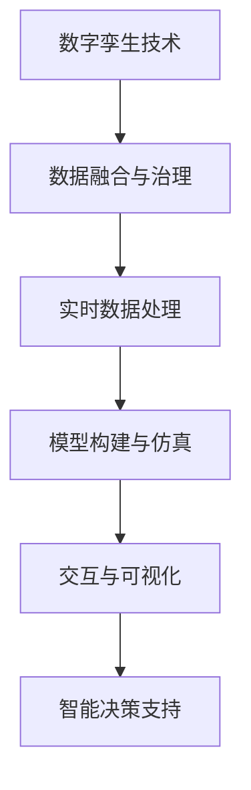
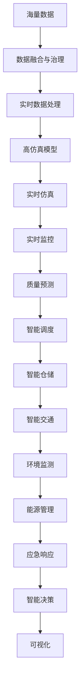

                 

# 大模型企业的数字孪生技术应用

> 关键词：数字孪生技术, 大模型企业, 仿真模拟, 实时数据分析, 虚拟现实, 数据驱动决策

## 1. 背景介绍

在当今数字化转型的大背景下，企业数字化、智能化建设已成为各行业发展的重要趋势。其中，数字孪生技术以其高仿真、实时性和交互性的特点，成为推动数字化转型和智能化升级的关键引擎。大模型企业，如智能制造、智慧物流、智能城市等领域，利用数字孪生技术在生产、运营、管理等多个环节中取得了显著成效。然而，大模型企业面临海量数据、复杂模型、实时需求等挑战，如何高效构建和应用数字孪生模型，仍然是一大难题。

### 1.1 问题由来
数字孪生技术是利用数字模型，实现物理与虚拟空间的双向映射和实时交互，可以为企业提供仿真模拟、实时分析、虚拟现实等多种功能。然而，构建高仿真数字孪生模型需要海量数据和复杂模型，实时数据处理和分析也对系统提出了高要求。传统数字孪生技术在数据存储、计算能力、仿真精度等方面存在局限性，难以满足大模型企业的需求。

### 1.2 问题核心关键点
要在大模型企业中高效构建和应用数字孪生技术，核心关键点包括：

- **数据融合与治理**：如何高效融合海量数据，实现跨系统的数据治理，确保数据的完整性、一致性和可靠性。
- **模型构建与仿真**：如何构建高仿真、高效的数字孪生模型，实现对现实系统的精确仿真和预测。
- **实时数据处理**：如何实现对实时数据的快速处理和分析，确保仿真和决策的实时性。
- **交互与可视化**：如何实现虚拟空间与现实系统的交互，以及交互结果的可视化展示。
- **智能决策支持**：如何利用数字孪生模型和实时数据，辅助企业进行数据驱动的智能决策。

### 1.3 问题研究意义
数字孪生技术在推动企业数字化和智能化建设中，具有以下重要意义：

- **提升运营效率**：通过仿真和预测，优化生产流程、减少资源浪费，提升企业的运营效率。
- **增强决策能力**：利用实时数据分析，辅助企业进行科学决策，提升决策的准确性和效率。
- **降低成本与风险**：通过仿真和预测，减少实验和测试成本，降低生产风险。
- **强化服务体验**：通过虚拟现实技术，增强客户体验，提升企业品牌形象。

数字孪生技术的应用，不仅能够帮助企业实现高效、智能、安全的运营，还能够为企业带来巨大的经济效益和竞争优势。因此，开展大模型企业数字孪生技术的研究，具有重要的理论和实践意义。

## 2. 核心概念与联系

### 2.1 核心概念概述

为了更好地理解数字孪生技术在大模型企业中的应用，本节将介绍几个核心概念及其相互关系：

- **数字孪生技术**：利用数字模型，实现物理与虚拟空间的双向映射和实时交互，包括仿真模拟、实时数据分析、虚拟现实等功能。
- **大模型企业**：如智能制造、智慧物流、智能城市等领域，数据量大、模型复杂，对数字孪生技术有较高要求。
- **数据融合与治理**：指对海量数据进行归一化、清洗、集成等处理，实现跨系统的数据共享和互操作。
- **模型构建与仿真**：构建高仿真、高效的数字孪生模型，实现对物理系统的精确仿真和预测。
- **实时数据处理**：对实时数据进行高效存储、处理和分析，满足仿真和决策的实时性需求。
- **交互与可视化**：利用虚拟现实技术，实现虚拟空间与现实系统的交互，以及交互结果的可视化展示。
- **智能决策支持**：利用数字孪生模型和实时数据，辅助企业进行数据驱动的智能决策。

这些核心概念之间的逻辑关系可以通过以下Mermaid流程图来展示：

这个流程图展示了数字孪生技术在大模型企业中的应用流程：首先，通过数据融合与治理，将跨系统的数据集成和处理，然后对实时数据进行高效处理和分析，构建高仿真模型，实现对物理系统的精确仿真和预测，最后利用虚拟现实技术，实现虚拟空间与现实系统的交互，以及交互结果的可视化展示，辅助企业进行数据驱动的智能决策。

### 2.2 概念间的关系

这些核心概念之间存在着紧密的联系，形成了数字孪生技术在大模型企业中的应用生态系统。下面通过几个Mermaid流程图来展示这些概念之间的关系。

#### 2.2.1 数字孪生技术的总体架构

这个流程图展示了数字孪生技术在大模型企业中的总体架构。首先，通过数据融合与治理，将跨系统的数据集成和处理，然后对实时数据进行高效处理和分析，构建高仿真模型，实现对物理系统的精确仿真和预测，最后利用虚拟现实技术，实现虚拟空间与现实系统的交互，以及交互结果的可视化展示，辅助企业进行数据驱动的智能决策。

#### 2.2.2 数字孪生技术在智能制造中的应用

这个流程图展示了数字孪生技术在智能制造中的应用。制造流程中的物理系统通过数字孪生技术进行仿真模拟，实时监控系统状态和性能，进行质量预测和智能调度，提升生产效率和产品质量。

#### 2.2.3 数字孪生技术在智慧物流中的应用

这个流程图展示了数字孪生技术在智慧物流中的应用。物流网络通过数字孪生技术进行路径规划和实时调度，进行风险预测和智能仓储，提升物流效率和可靠性。

#### 2.2.4 数字孪生技术在智能城市中的应用

这个流程图展示了数字孪生技术在智能城市中的应用。城市系统通过数字孪生技术进行智能交通、环境监测、能源管理和应急响应，提升城市管理的智能化水平。

### 2.3 核心概念的整体架构

最后，我们用一个综合的流程图来展示这些核心概念在大模型企业数字孪生技术应用中的整体架构：

这个综合流程图展示了从海量数据到数字孪生模型构建，再到实时仿真和监控、质量预测、智能调度、智能仓储、智能交通、环境监测、能源管理和应急响应，最终到智能决策和可视化展示的完整过程。

## 3. 核心算法原理 & 具体操作步骤
### 3.1 算法原理概述

数字孪生技术在大模型企业中的应用，主要是通过构建高仿真、高效的数字孪生模型，实现对物理系统的精确仿真和预测，从而辅助企业进行数据驱动的智能决策。其核心算法原理可以概括为以下几个步骤：

1. **数据融合与治理**：利用数据融合与治理技术，对海量数据进行归一化、清洗、集成等处理，确保数据的完整性、一致性和可靠性。
2. **模型构建与仿真**：构建高仿真、高效的数字孪生模型，实现对物理系统的精确仿真和预测。
3. **实时数据处理**：对实时数据进行高效存储、处理和分析，满足仿真和决策的实时性需求。
4. **交互与可视化**：利用虚拟现实技术，实现虚拟空间与现实系统的交互，以及交互结果的可视化展示。
5. **智能决策支持**：利用数字孪生模型和实时数据，辅助企业进行数据驱动的智能决策。

### 3.2 算法步骤详解

#### 3.2.1 数据融合与治理

数据融合与治理是数字孪生技术的第一步，其核心任务是实现跨系统的数据共享和互操作，确保数据的完整性、一致性和可靠性。

**步骤1：数据采集**  
采集来自不同来源和系统的数据，包括传感器数据、监控数据、业务数据等，并将数据按时间、空间、类型等维度进行分类。

**步骤2：数据清洗**  
对采集到的数据进行去重、去噪、填补缺失值等清洗操作，去除无效或异常数据。

**步骤3：数据归一化**  
对清洗后的数据进行归一化处理，确保不同类型、不同尺度的数据能够进行有效融合。

**步骤4：数据集成**  
将清洗和归一化后的数据进行集成，构建统一的数据仓库或数据湖，实现跨系统的数据共享。

**步骤5：数据治理**  
对数据仓库或数据湖中的数据进行治理，包括数据质量管理、数据安全管理、数据隐私管理等，确保数据的安全和合规性。

#### 3.2.2 模型构建与仿真

模型构建与仿真是数字孪生技术的核心环节，其目的是构建高仿真、高效的数字孪生模型，实现对物理系统的精确仿真和预测。

**步骤1：模型设计**  
根据企业的需求，设计数字孪生模型的结构和参数，包括物理模型的构建、数学模型的建立、仿真算法的确定等。

**步骤2：数据输入**  
将清洗和归一化后的数据输入到数字孪生模型中，作为模型的输入参数。

**步骤3：模型训练**  
利用训练数据集，对数字孪生模型进行训练，优化模型的参数和结构，确保模型的精度和鲁棒性。

**步骤4：模型验证**  
利用测试数据集对数字孪生模型进行验证，评估模型的仿真精度和稳定性，确保模型的可靠性和有效性。

**步骤5：模型部署**  
将训练好的数字孪生模型部署到实时仿真系统中，实现对物理系统的精确仿真和预测。

#### 3.2.3 实时数据处理

实时数据处理是数字孪生技术的关键步骤，其目的是对实时数据进行高效存储、处理和分析，满足仿真和决策的实时性需求。

**步骤1：数据收集**  
利用传感器、监控设备等实时收集数据，并传输到数字孪生系统中。

**步骤2：数据缓存**  
将收集到的实时数据缓存到高速缓存系统或内存中，确保数据的时效性和可用性。

**步骤3：数据处理**  
对缓存的实时数据进行高效处理，包括数据过滤、数据聚合、数据转换等操作，实现数据的快速分析和处理。

**步骤4：数据存储**  
将处理后的实时数据存储到数据库或分布式存储系统中，确保数据的长期保存和可追溯性。

**步骤5：数据查询**  
根据仿真和决策需求，实时查询存储的数据，进行分析和决策支持。

#### 3.2.4 交互与可视化

交互与可视化是数字孪生技术的重要功能，其目的是实现虚拟空间与现实系统的交互，以及交互结果的可视化展示。

**步骤1：虚拟现实技术**  
利用虚拟现实技术，构建虚拟空间，实现对物理系统的仿真和预测。

**步骤2：交互界面设计**  
设计交互界面，包括用户界面、数据界面、控制界面等，方便用户与虚拟空间进行交互。

**步骤3：数据可视化**  
将仿真结果和分析结果进行可视化展示，包括实时数据展示、仿真结果展示、预测结果展示等。

**步骤4：交互响应**  
根据用户交互行为，实时调整仿真和预测模型，优化系统的性能和效果。

#### 3.2.5 智能决策支持

智能决策支持是数字孪生技术的最终目标，其目的是利用数字孪生模型和实时数据，辅助企业进行数据驱动的智能决策。

**步骤1：数据融合与治理**  
将实时数据和历史数据进行融合与治理，构建统一的数据视图，确保数据的完整性和一致性。

**步骤2：模型构建与仿真**  
构建高仿真、高效的数字孪生模型，实现对物理系统的精确仿真和预测。

**步骤3：数据可视化**  
将仿真结果和分析结果进行可视化展示，包括实时数据展示、仿真结果展示、预测结果展示等。

**步骤4：智能决策**  
利用数据融合、模型仿真、数据可视化等技术，辅助企业进行数据驱动的智能决策，优化企业的运营和管理。

### 3.3 算法优缺点

数字孪生技术在大模型企业中的应用，具有以下优点：

1. **高仿真、高效能**：通过构建高仿真、高效的数字孪生模型，实现对物理系统的精确仿真和预测，提升企业的运营效率和决策能力。
2. **实时性、可靠性**：利用实时数据处理技术，实现对实时数据的快速处理和分析，确保仿真和决策的实时性和可靠性。
3. **交互性、可视化**：利用虚拟现实技术，实现虚拟空间与现实系统的交互，以及交互结果的可视化展示，提升用户体验和企业形象。
4. **数据驱动、智能决策**：利用数字孪生模型和实时数据，辅助企业进行数据驱动的智能决策，提升决策的准确性和效率。

然而，数字孪生技术在大模型企业中也存在以下缺点：

1. **数据质量问题**：数据融合与治理过程中，数据清洗和归一化可能存在误差，导致数据质量问题。
2. **模型复杂性**：模型构建与仿真过程中，高仿真、高效的数字孪生模型复杂度较高，需要大量的计算资源和时间。
3. **实时数据处理**：实时数据处理过程中，数据存储和查询可能存在延迟，影响系统的实时性。
4. **交互复杂性**：交互与可视化过程中，虚拟现实技术可能存在技术瓶颈，影响交互效果和用户体验。
5. **智能决策难度**：智能决策支持过程中，数据融合和模型仿真可能存在误差，导致决策结果的不确定性。

尽管存在这些缺点，但数字孪生技术在大模型企业中的应用仍然具有重要的实际意义，通过合理的设计和优化，可以最大化其优势，克服其不足。

### 3.4 算法应用领域

数字孪生技术在大模型企业中的应用，涵盖了多个领域，包括但不限于：

- **智能制造**：利用数字孪生技术进行生产流程优化、设备维护、质量控制等，提升制造企业的生产效率和产品质量。
- **智慧物流**：利用数字孪生技术进行路径规划、运输调度、库存管理等，提升物流企业的运营效率和可靠性。
- **智能城市**：利用数字孪生技术进行交通管理、环境监测、能源管理等，提升城市管理的智能化水平。
- **医疗健康**：利用数字孪生技术进行疾病预测、医疗资源分配、健康监测等，提升医疗服务的质量和效率。
- **金融服务**：利用数字孪生技术进行风险评估、信用评分、智能投顾等，提升金融服务的精准性和安全性。

以上领域只是数字孪生技术应用的一部分，随着技术的不断发展和完善，数字孪生技术将会在更多的领域得到应用，带来更多的创新和突破。

## 4. 数学模型和公式 & 详细讲解 & 举例说明

### 4.1 数学模型构建

数字孪生技术的数学模型构建，主要包括以下几个部分：

- **数据融合与治理模型**：利用数据融合与治理技术，对海量数据进行归一化、清洗、集成等处理，确保数据的完整性、一致性和可靠性。
- **模型构建与仿真模型**：构建高仿真、高效的数字孪生模型，实现对物理系统的精确仿真和预测。
- **实时数据处理模型**：对实时数据进行高效存储、处理和分析，满足仿真和决策的实时性需求。
- **交互与可视化模型**：利用虚拟现实技术，实现虚拟空间与现实系统的交互，以及交互结果的可视化展示。
- **智能决策支持模型**：利用数字孪生模型和实时数据，辅助企业进行数据驱动的智能决策。

### 4.2 公式推导过程

#### 4.2.1 数据融合与治理模型

**公式1：数据融合与治理模型**

设原始数据集为 $D=\{x_1,x_2,...,x_n\}$，其中 $x_i$ 为第 $i$ 个数据点。

数据融合与治理的目标是将原始数据集 $D$ 转换为处理后的数据集 $D'$，其中 $D'$ 包括 $D$ 的所有有效数据，且数据格式、数据类型一致。

数据融合与治理模型的目标函数为：

$$
\min_{D'} \left\{ \sum_{i=1}^{n} \alpha_i \cdot ||x_i - x'_i||^2 \right\}
$$

其中，$x'_i$ 为 $x_i$ 的融合与治理结果，$\alpha_i$ 为 $x_i$ 的权重系数。

数据融合与治理模型的求解步骤如下：

1. **数据清洗**：去除无效或异常数据，得到处理后的数据集 $D_1$。
2. **数据归一化**：将 $D_1$ 中的数据归一化到指定范围内，得到处理后的数据集 $D_2$。
3. **数据集成**：将 $D_2$ 中的数据进行集成，得到处理后的数据集 $D'$。
4. **数据治理**：对 $D'$ 中的数据进行治理，包括数据质量管理、数据安全管理、数据隐私管理等，得到最终的处理后的数据集 $D''$。

#### 4.2.2 模型构建与仿真模型

**公式2：模型构建与仿真模型**

设数字孪生模型为 $M_{\theta}:\mathcal{X} \rightarrow \mathcal{Y}$，其中 $\mathcal{X}$ 为输入空间，$\mathcal{Y}$ 为输出空间，$\theta$ 为模型参数。

假设输入数据集为 $X=\{x_1,x_2,...,x_n\}$，输出数据集为 $Y=\{y_1,y_2,...,y_n\}$，其中 $x_i \in \mathcal{X}$，$y_i \in \mathcal{Y}$。

模型构建与仿真的目标是最小化模型的损失函数，即：

$$
\min_{\theta} \left\{ \frac{1}{n} \sum_{i=1}^{n} \ell(M_{\theta}(x_i),y_i) \right\}
$$

其中，$\ell$ 为损失函数，用于衡量模型预测输出与真实标签之间的差异。

模型构建与仿真的求解步骤如下：

1. **模型设计**：根据企业的需求，设计数字孪生模型的结构和参数，包括物理模型的构建、数学模型的建立、仿真算法的确定等。
2. **数据输入**：将输入数据集 $X$ 输入到数字孪生模型 $M_{\theta}$ 中，得到输出数据集 $Y'$。
3. **模型训练**：利用训练数据集，对数字孪生模型 $M_{\theta}$ 进行训练，优化模型的参数和结构，确保模型的精度和鲁棒性。
4. **模型验证**：利用测试数据集对数字孪生模型 $M_{\theta}$ 进行验证，评估模型的仿真精度和稳定性，确保模型的可靠性和有效性。
5. **模型部署**：将训练好的数字孪生模型 $M_{\theta}$ 部署到实时仿真系统中，实现对物理系统的精确仿真和预测。

#### 4.2.3 实时数据处理模型

**公式3：实时数据处理模型**

设实时数据集为 $D_t=\{d_{t1},d_{t2},...,d_{tn}\}$，其中 $d_{ti}$ 为第 $t$ 个时刻的第 $i$ 个数据点。

实时数据处理的目标是将实时数据集 $D_t$ 转换为处理后的数据集 $D'_t$，其中 $D'_t$ 包括 $D_t$ 的所有有效数据，且数据格式、数据类型一致。

实时数据处理模型的目标函数为：

$$
\min_{D'_t} \left\{ \sum_{i=1}^{n} \beta_i \cdot ||d_{ti} - d'_{ti}||^2 \right\}
$$

其中，$d'_{ti}$ 为 $d_{ti}$ 的处理结果，$\beta_i$ 为 $d_{ti}$ 的权重系数。

实时数据处理模型的求解步骤如下：

1. **数据收集**：利用传感器、监控设备等实时收集数据，并传输到数字孪生系统中。
2. **数据缓存**：将收集到的实时数据缓存到高速缓存系统或内存中，确保数据的时效性和可用性。
3. **数据处理**：对缓存的实时数据进行高效处理，包括数据过滤、数据聚合、数据转换等操作，实现数据的快速分析和处理。
4. **数据存储**：将处理后的实时数据存储到数据库或分布式存储系统中，确保数据的长期保存和可追溯性。
5. **数据查询**：根据仿真和决策需求，实时查询存储的数据，进行分析和决策支持。

#### 4.2.4 交互与可视化模型

**公式4：交互与可视化模型**

设交互数据集为 $I=\{i_1,i_2,...,i_m\}$，其中 $i_j$ 为第 $j$ 个交互操作。

交互与可视化的目标是将交互数据集 $I$ 转换为可视化结果集 $V$，其中 $V$ 包括 $I$ 的交互效果，且可视化效果直观、清晰。

交互与可视化模型的目标函数为：

$$
\min_{V} \left\{ \sum_{j=1}^{m} \gamma_j \cdot ||i_j - v_j||^2 \right\}
$$

其中，$v_j$ 为 $i_j$ 的可视化结果，$\gamma_j$ 为 $i_j$ 的权重系数。

交互与可视化模型的求解步骤如下：

1. **虚拟现实技术**：利用虚拟现实技术，构建虚拟空间，实现对物理系统的仿真和预测。
2. **交互界面设计**：设计交互界面，包括用户界面、数据界面、控制界面等，方便用户与虚拟空间进行交互。
3. **数据可视化**：将仿真结果和分析结果进行可视化展示，包括实时数据展示、仿真结果展示、预测结果展示等。
4. **交互响应**：根据用户交互行为，实时调整仿真和预测模型，优化系统的性能和效果。

#### 4.2.5 智能决策支持模型

**公式5：智能决策支持模型**

设智能决策数据集为 $D_D=\{d_{D1},d_{D2},...,d_{Dn}\}$，其中 $d_{Di}$ 为第 $i$ 个智能决策结果。

智能决策支持的目标是将智能决策数据集 $D_D$ 转换为决策结果集 $R_D$，其中 $R_D$ 包括 $D_D$ 的决策结果，且决策结果合理、可行。

智能决策支持模型的目标函数为：

$$
\min_{R_D} \left\{ \sum_{i=1}^{n} \delta_i \cdot ||d_{Di} - r_{Di}||^2 \right\}
$$

其中，$r_{Di}$ 为 $d_{Di}$ 的决策结果，$\delta_i$ 为 $d_{Di}$ 的权重系数。

智能决策支持模型的求解步骤如下：

1. **数据融合与治理**：将实时数据和历史数据进行融合与治理，构建统一的数据视图，确保数据的完整性和一致性。
2. **模型构建与仿真**：构建高仿真、高效的数字孪生模型，实现对物理系统的精确仿真和预测。
3. **数据可视化**：将仿真结果和分析结果进行可视化展示，包括实时数据展示、仿真结果展示、预测结果展示等。
4. **智能决策**：利用数据融合、模型仿真、数据可视化等技术，辅助企业进行数据驱动的智能决策，优化企业的运营和管理。

### 4.3 案例分析与讲解

#### 4.3.1 智能制造中的应用

某智能制造企业通过数字孪生技术构建了完整的生产流程仿真模型，利用实时数据进行生产过程监控和质量预测。具体步骤如下：

1. **数据融合与治理**：将来自传感器、监控设备等的数据进行清洗、归一化和集成，构建统一的数据仓库。
2. **模型构建与仿真**：设计生产流程仿真模型，包括设备模型、工艺模型、生产模型等，实现对生产过程的精确仿真。
3. **实时数据处理**：利用传感器、监控设备等实时收集生产数据，进行高效存储和处理，确保数据的时效性和可用性。
4. **交互与可视化**：利用虚拟现实技术，构建虚拟生产车间，实现对生产过程的实时监控和可视化展示。
5. **智能决策支持**：利用仿真模型和实时数据，辅助企业进行生产调度、质量控制、设备维护等决策，提升生产效率和产品质量。

#### 4.3.2 智慧物流中的应用

某物流公司通过数字孪生技术构建了物流网络仿真模型，利用实时数据进行路径规划和运输调度。具体步骤如下：

1. **数据融合与治理**：将来自车辆传感器、监控设备等的数据进行清洗、归一化和集成，构建统一的数据仓库。

