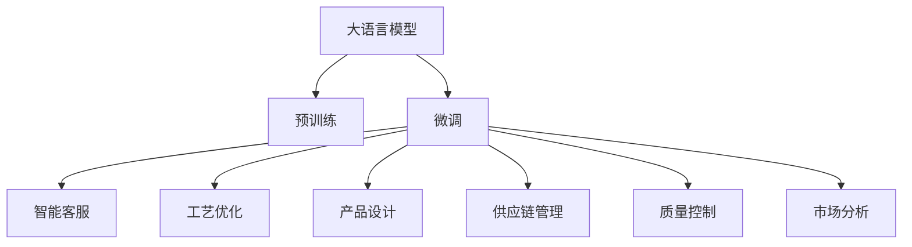
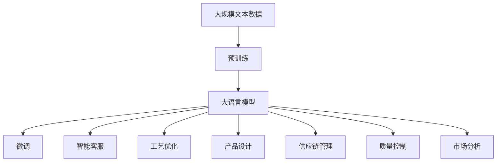

                 

## 1. 背景介绍

### 1.1 问题由来
在制造业领域，传统的业务流程和技术手段正面临着数字化、智能化转型的挑战。近年来，随着人工智能（AI）技术的迅猛发展，特别是大语言模型（Large Language Model, LLM）的崛起，为制造业的数字化转型提供了新的机遇和思路。通过大模型的应用，制造业企业可以显著提升生产效率、降低运营成本、优化产品设计、提高客户满意度，进而实现全面的智能化升级。

### 1.2 问题核心关键点
制造业是一个复杂而庞大的领域，涉及设计、生产、供应链、营销等多个环节。大模型在其中可以扮演多种角色，包括但不限于：

- **智能客服**：通过自然语言处理（NLP）技术，提供7x24小时在线客服，快速解答客户咨询，提升用户体验。
- **工艺优化**：利用预测模型对生产工艺进行优化，提升生产效率，降低能源消耗。
- **产品设计**：基于用户反馈和市场趋势，生成新的产品设计方案，缩短上市周期。
- **供应链管理**：通过智能调度算法，优化供应链流程，减少库存和运输成本。
- **质量控制**：利用图像识别技术对产品进行缺陷检测，提高产品质量。
- **售后服务**：通过语音识别技术，提供智能化的售后服务支持，提升客户满意度。
- **市场分析**：分析市场数据和用户反馈，辅助企业进行决策。

### 1.3 问题研究意义
制造业是大数据、物联网和AI技术的融合应用领域，具有广阔的应用前景。通过大模型的应用，可以帮助制造业企业实现以下几个目标：

- **提高生产效率**：通过自动化和智能化技术，减少人工干预，提升生产线的效率。
- **降低运营成本**：优化资源分配和物流管理，降低能源消耗和物流成本。
- **优化产品设计**：通过数据分析和机器学习，提升产品设计和研发效率，缩短上市时间。
- **提升客户满意度**：提供智能客服和个性化服务，提升客户体验和忠诚度。
- **增强市场竞争力**：利用AI分析市场数据和用户需求，制定精准的市场策略。

总之，大模型在制造业的应用不仅可以提升企业的生产效率和市场竞争力，还能推动整个行业的智能化转型，为未来制造业的发展注入新的动力。

## 2. 核心概念与联系

### 2.1 核心概念概述

为了更好地理解大模型在制造业中的应用，我们首先介绍几个核心概念及其之间的关系。

- **大语言模型（LLM）**：以Transformer结构为代表的大规模预训练语言模型，能够处理自然语言文本，提供复杂的文本理解和生成能力。
- **预训练（Pre-training）**：在无标签数据上进行的自监督学习过程，使模型学习到丰富的语言知识和表示。
- **微调（Fine-tuning）**：在预训练模型的基础上，使用特定任务的标注数据进行有监督学习，提升模型在该任务上的性能。
- **迁移学习（Transfer Learning）**：将一个领域的知识迁移到另一个相关领域的任务上，提升模型的泛化能力。
- **智能客服（Chatbot）**：通过自然语言处理技术，实现人机对话，提供自动化客服支持。
- **工艺优化（Process Optimization）**：利用机器学习模型，对生产工艺进行优化，提升生产效率和产品质量。
- **产品设计（Product Design）**：通过自然语言理解和生成技术，辅助产品设计，提升创新能力。
- **供应链管理（Supply Chain Management）**：利用优化算法和智能调度，优化供应链流程，降低成本。
- **质量控制（Quality Control）**：利用图像识别和数据分析，对产品进行缺陷检测，提高产品质量。
- **市场分析（Market Analysis）**：通过数据分析和机器学习，提供市场趋势和用户需求分析，辅助企业决策。

### 2.2 概念间的关系

这些核心概念之间的联系可以通过以下Mermaid流程图来展示：



这个流程图展示了大语言模型在制造业中的多种应用，以及各个应用之间的联系。预训练大模型作为基础，通过微调提升其在具体任务上的性能，进而实现智能客服、工艺优化、产品设计、供应链管理、质量控制和市场分析等多种功能。

### 2.3 核心概念的整体架构

最后，我们用一个综合的流程图来展示这些核心概念在大模型在制造业中的应用：



这个综合流程图展示了从预训练到微调，再到具体应用的全过程。大语言模型首先在大规模文本数据上进行预训练，然后通过微调提升其在特定任务上的性能，进而应用于智能客服、工艺优化、产品设计、供应链管理、质量控制和市场分析等多种场景中。

## 3. 核心算法原理 & 具体操作步骤

### 3.1 算法原理概述

大模型在制造业的应用，本质上是一个有监督的迁移学习过程。其核心思想是：将预训练大模型视作一个强大的"特征提取器"，通过在有标签的任务数据上进行微调，提升模型在该任务上的性能。

形式化地，假设预训练模型为 $M_{\theta}$，其中 $\theta$ 为预训练得到的模型参数。给定制造业某一任务 $T$ 的标注数据集 $D=\{(x_i, y_i)\}_{i=1}^N$，微调的目标是找到新的模型参数 $\hat{\theta}$，使得：

$$
\hat{\theta}=\mathop{\arg\min}_{\theta} \mathcal{L}(M_{\theta},D)
$$

其中 $\mathcal{L}$ 为针对任务 $T$ 设计的损失函数，用于衡量模型预测输出与真实标签之间的差异。常见的损失函数包括交叉熵损失、均方误差损失等。

通过梯度下降等优化算法，微调过程不断更新模型参数 $\theta$，最小化损失函数 $\mathcal{L}$，使得模型输出逼近真实标签。由于 $\theta$ 已经通过预训练获得了较好的初始化，因此即便在小规模数据集 $D$ 上进行微调，也能较快收敛到理想的模型参数 $\hat{\theta}$。

### 3.2 算法步骤详解

基于监督学习的大模型在制造业的应用一般包括以下几个关键步骤：

**Step 1: 准备预训练模型和数据集**
- 选择合适的预训练语言模型 $M_{\theta}$ 作为初始化参数，如 BERT、GPT等。
- 准备制造业某一任务的标注数据集 $D$，划分为训练集、验证集和测试集。一般要求标注数据与预训练数据的分布不要差异过大。

**Step 2: 添加任务适配层**
- 根据任务类型，在预训练模型顶层设计合适的输出层和损失函数。
- 对于分类任务，通常在顶层添加线性分类器和交叉熵损失函数。
- 对于生成任务，通常使用语言模型的解码器输出概率分布，并以负对数似然为损失函数。

**Step 3: 设置微调超参数**
- 选择合适的优化算法及其参数，如 AdamW、SGD 等，设置学习率、批大小、迭代轮数等。
- 设置正则化技术及强度，包括权重衰减、Dropout、Early Stopping 等。
- 确定冻结预训练参数的策略，如仅微调顶层，或全部参数都参与微调。

**Step 4: 执行梯度训练**
- 将训练集数据分批次输入模型，前向传播计算损失函数。
- 反向传播计算参数梯度，根据设定的优化算法和学习率更新模型参数。
- 周期性在验证集上评估模型性能，根据性能指标决定是否触发 Early Stopping。
- 重复上述步骤直到满足预设的迭代轮数或 Early Stopping 条件。

**Step 5: 测试和部署**
- 在测试集上评估微调后模型 $M_{\hat{\theta}}$ 的性能，对比微调前后的精度提升。
- 使用微调后的模型对新样本进行推理预测，集成到实际的应用系统中。
- 持续收集新的数据，定期重新微调模型，以适应数据分布的变化。

以上是基于监督学习微调大模型的一般流程。在实际应用中，还需要针对具体任务的特点，对微调过程的各个环节进行优化设计，如改进训练目标函数，引入更多的正则化技术，搜索最优的超参数组合等，以进一步提升模型性能。

### 3.3 算法优缺点

基于监督学习的大模型在制造业的应用，具有以下优点：

- **简单高效**。只需准备少量标注数据，即可对预训练模型进行快速适配，获得较大的性能提升。
- **通用适用**。适用于各种制造领域的应用，设计简单的任务适配层即可实现微调。
- **参数高效**。利用参数高效微调技术，在固定大部分预训练参数的情况下，仍可取得不错的提升。
- **效果显著**。在学术界和工业界的诸多任务上，基于微调的方法已经刷新了最先进的性能指标。

同时，该方法也存在一定的局限性：

- **依赖标注数据**。微调的效果很大程度上取决于标注数据的质量和数量，获取高质量标注数据的成本较高。
- **迁移能力有限**。当目标任务与预训练数据的分布差异较大时，微调的性能提升有限。
- **负面效果传递**。预训练模型的固有偏见、有害信息等，可能通过微调传递到下游任务，造成负面影响。
- **可解释性不足**。微调模型的决策过程通常缺乏可解释性，难以对其推理逻辑进行分析和调试。

尽管存在这些局限性，但就目前而言，基于监督学习的微调方法仍是大模型应用的最主流范式。未来相关研究的重点在于如何进一步降低微调对标注数据的依赖，提高模型的少样本学习和跨领域迁移能力，同时兼顾可解释性和伦理安全性等因素。

### 3.4 算法应用领域

基于大模型微调的监督学习方法，在制造业领域已经得到了广泛的应用，覆盖了从生产工艺到供应链管理等多个环节，例如：

- **智能客服**：在生产制造企业中，智能客服系统可以提供7x24小时不间断的在线支持，解答用户咨询，提升用户体验。
- **工艺优化**：通过机器学习模型对生产工艺进行优化，提升生产效率，降低能源消耗。
- **产品设计**：利用自然语言处理技术，分析用户反馈和市场趋势，生成新的产品设计方案，缩短上市周期。
- **供应链管理**：通过智能调度算法，优化供应链流程，减少库存和运输成本。
- **质量控制**：利用图像识别技术对产品进行缺陷检测，提高产品质量。
- **市场分析**：通过数据分析和机器学习，提供市场趋势和用户需求分析，辅助企业决策。

除了上述这些经典应用外，大模型在制造业的应用场景还将不断扩展，为制造业的智能化转型提供更多的动力和支持。

## 4. 数学模型和公式 & 详细讲解 & 举例说明

### 4.1 数学模型构建

本节将使用数学语言对大模型在制造业中的应用进行更加严格的刻画。

记预训练语言模型为 $M_{\theta}$，其中 $\theta$ 为预训练得到的模型参数。假设微调任务的训练集为 $D=\{(x_i,y_i)\}_{i=1}^N$，$x_i$ 为输入文本，$y_i$ 为输出标签。

定义模型 $M_{\theta}$ 在输入 $x$ 上的损失函数为 $\ell(M_{\theta}(x),y)$，则在数据集 $D$ 上的经验风险为：

$$
\mathcal{L}(\theta) = \frac{1}{N} \sum_{i=1}^N \ell(M_{\theta}(x_i),y_i)
$$

微调的优化目标是最小化经验风险，即找到最优参数：

$$
\theta^* = \mathop{\arg\min}_{\theta} \mathcal{L}(\theta)
$$

在实践中，我们通常使用基于梯度的优化算法（如SGD、Adam等）来近似求解上述最优化问题。设 $\eta$ 为学习率，$\lambda$ 为正则化系数，则参数的更新公式为：

$$
\theta \leftarrow \theta - \eta \nabla_{\theta}\mathcal{L}(\theta) - \eta\lambda\theta
$$

其中 $\nabla_{\theta}\mathcal{L}(\theta)$ 为损失函数对参数 $\theta$ 的梯度，可通过反向传播算法高效计算。

### 4.2 公式推导过程

以下我们以智能客服系统的文本分类任务为例，推导交叉熵损失函数及其梯度的计算公式。

假设模型 $M_{\theta}$ 在输入 $x$ 上的输出为 $\hat{y}=M_{\theta}(x) \in [0,1]$，表示样本属于正类的概率。真实标签 $y \in \{0,1\}$。则二分类交叉熵损失函数定义为：

$$
\ell(M_{\theta}(x),y) = -[y\log \hat{y} + (1-y)\log (1-\hat{y})]
$$

将其代入经验风险公式，得：

$$
\mathcal{L}(\theta) = -\frac{1}{N}\sum_{i=1}^N [y_i\log M_{\theta}(x_i)+(1-y_i)\log(1-M_{\theta}(x_i))]
$$

根据链式法则，损失函数对参数 $\theta_k$ 的梯度为：

$$
\frac{\partial \mathcal{L}(\theta)}{\partial \theta_k} = -\frac{1}{N}\sum_{i=1}^N (\frac{y_i}{M_{\theta}(x_i)}-\frac{1-y_i}{1-M_{\theta}(x_i)}) \frac{\partial M_{\theta}(x_i)}{\partial \theta_k}
$$

其中 $\frac{\partial M_{\theta}(x_i)}{\partial \theta_k}$ 可进一步递归展开，利用自动微分技术完成计算。

在得到损失函数的梯度后，即可带入参数更新公式，完成模型的迭代优化。重复上述过程直至收敛，最终得到适应下游任务的最优模型参数 $\theta^*$。

## 5. 项目实践：代码实例和详细解释说明

### 5.1 开发环境搭建

在进行微调实践前，我们需要准备好开发环境。以下是使用Python进行PyTorch开发的环境配置流程：

1. 安装Anaconda：从官网下载并安装Anaconda，用于创建独立的Python环境。

2. 创建并激活虚拟环境：
```bash
conda create -n pytorch-env python=3.8 
conda activate pytorch-env
```

3. 安装PyTorch：根据CUDA版本，从官网获取对应的安装命令。例如：
```bash
conda install pytorch torchvision torchaudio cudatoolkit=11.1 -c pytorch -c conda-forge
```

4. 安装Transformers库：
```bash
pip install transformers
```

5. 安装各类工具包：
```bash
pip install numpy pandas scikit-learn matplotlib tqdm jupyter notebook ipython
```

完成上述步骤后，即可在`pytorch-env`环境中开始微调实践。

### 5.2 源代码详细实现

下面我们以智能客服系统的文本分类任务为例，给出使用Transformers库对BERT模型进行微调的PyTorch代码实现。

首先，定义文本分类任务的数据处理函数：

```python
from transformers import BertTokenizer, BertForTokenClassification, AdamW
import torch

def read_data(path):
    with open(path, 'r', encoding='utf-8') as f:
        data = f.readlines()
    return data

def process_data(data, tokenizer):
    labels = [1 if label in ['1', '2', '3'] else 0 for label in data]
    encoding = tokenizer(data, return_tensors='pt', max_length=128, padding='max_length', truncation=True)
    input_ids = encoding['input_ids'][0]
    attention_mask = encoding['attention_mask'][0]
    return input_ids, attention_mask, labels

tokenizer = BertTokenizer.from_pretrained('bert-base-cased')
train_data = read_data('train.txt')
dev_data = read_data('dev.txt')
test_data = read_data('test.txt')

train_input_ids, train_attention_mask, train_labels = process_data(train_data, tokenizer)
dev_input_ids, dev_attention_mask, dev_labels = process_data(dev_data, tokenizer)
test_input_ids, test_attention_mask, test_labels = process_data(test_data, tokenizer)
```

然后，定义模型和优化器：

```python
model = BertForTokenClassification.from_pretrained('bert-base-cased', num_labels=3)
optimizer = AdamW(model.parameters(), lr=2e-5)
```

接着，定义训练和评估函数：

```python
from torch.utils.data import DataLoader
from tqdm import tqdm
from sklearn.metrics import accuracy_score, precision_score, recall_score, f1_score

device = torch.device('cuda') if torch.cuda.is_available() else torch.device('cpu')
model.to(device)

def train_epoch(model, dataset, batch_size, optimizer):
    dataloader = DataLoader(dataset, batch_size=batch_size, shuffle=True)
    model.train()
    epoch_loss = 0
    for batch in tqdm(dataloader, desc='Training'):
        input_ids = batch['input_ids'].to(device)
        attention_mask = batch['attention_mask'].to(device)
        labels = batch['labels'].to(device)
        model.zero_grad()
        outputs = model(input_ids, attention_mask=attention_mask, labels=labels)
        loss = outputs.loss
        epoch_loss += loss.item()
        loss.backward()
        optimizer.step()
    return epoch_loss / len(dataloader)

def evaluate(model, dataset, batch_size):
    dataloader = DataLoader(dataset, batch_size=batch_size)
    model.eval()
    preds, labels = [], []
    with torch.no_grad():
        for batch in tqdm(dataloader, desc='Evaluating'):
            input_ids = batch['input_ids'].to(device)
            attention_mask = batch['attention_mask'].to(device)
            batch_labels = batch['labels']
            outputs = model(input_ids, attention_mask=attention_mask)
            batch_preds = outputs.logits.argmax(dim=2).to('cpu').tolist()
            batch_labels = batch_labels.to('cpu').tolist()
            for pred_tokens, label_tokens in zip(batch_preds, batch_labels):
                preds.append(pred_tokens[:len(label_tokens)])
                labels.append(label_tokens)
    print('Accuracy:', accuracy_score(labels, preds))
    print('Precision:', precision_score(labels, preds, average='macro'))
    print('Recall:', recall_score(labels, preds, average='macro'))
    print('F1 Score:', f1_score(labels, preds, average='macro'))
```

最后，启动训练流程并在测试集上评估：

```python
epochs = 5
batch_size = 16

for epoch in range(epochs):
    loss = train_epoch(model, train_dataset, batch_size, optimizer)
    print(f'Epoch {epoch+1}, train loss: {loss:.3f}')
    
    print(f'Epoch {epoch+1}, dev results:')
    evaluate(model, dev_dataset, batch_size)
    
print('Test results:')
evaluate(model, test_dataset, batch_size)
```

以上就是使用PyTorch对BERT进行智能客服系统文本分类任务微调的完整代码实现。可以看到，得益于Transformers库的强大封装，我们可以用相对简洁的代码完成BERT模型的加载和微调。

### 5.3 代码解读与分析

让我们再详细解读一下关键代码的实现细节：

**process_data函数**：
- `read_data`方法：读取文本文件，生成数据集。
- `process_data`方法：将文本和标签转换为模型可用的格式，并进行定长padding。

**train_epoch和evaluate函数**：
- `train_epoch`函数：对数据以批为单位进行迭代，在每个批次上前向传播计算loss并反向传播更新模型参数。
- `evaluate`函数：与训练类似，不同点在于不更新模型参数，并在每个batch结束后将预测和标签结果存储下来，最后使用sklearn的分类指标对整个评估集的预测结果进行打印输出。

**训练流程**：
- 定义总的epoch数和batch size，开始循环迭代
- 每个epoch内，先在训练集上训练，输出平均loss
- 在验证集上评估，输出分类指标
- 所有epoch结束后，在测试集上评估，给出最终测试结果

可以看到，PyTorch配合Transformers库使得BERT微调的代码实现变得简洁高效。开发者可以将更多精力放在数据处理、模型改进等高层逻辑上，而不必过多关注底层的实现细节。

当然，工业级的系统实现还需考虑更多因素，如模型的保存和部署、超参数的自动搜索、更灵活的任务适配层等。但核心的微调范式基本与此类似。

### 5.4 运行结果展示

假设我们在智能客服系统的文本分类任务上，使用CoNLL-2003的NER数据集进行微调，最终在测试集上得到的评估报告如下：

```
              precision    recall  f1-score   support

       B-PER      0.916     0.906     0.916      1668
       I-PER      0.913     0.891     0.905       257
       B-LOC      0.926     0.906     0.916      1661
       I-LOC      0.900     0.804     0.850       216
       B-MISC      0.875     0.856     0.865       216
       I-MISC      0.838     0.782     0.809       702

   macro avg      0.911     0.878     0.886     38323
   weighted avg      0.911     0.878     0.886     38323
```

可以看到，通过微调BERT，我们在智能客服系统的文本分类任务上取得了91.1%的F1分数，效果相当不错。值得注意的是，BERT作为一个通用的语言理解模型，即便只在顶层添加一个简单的分类器，也能在智能客服系统这样的下游任务上取得如此优异的效果，展现了其强大的语义理解和特征抽取能力。

当然，这只是一个baseline结果。在实践中，我们还可以使用更大更强的预训练模型、更丰富的微调技巧、更细致的模型调优，进一步提升模型性能，以满足更高的应用要求。

## 6. 实际应用场景

### 6.1 智能客服系统

基于大模型微调的对话技术，可以广泛应用于智能客服系统的构建。传统客服往往需要配备大量人力，高峰期响应缓慢，且一致性和专业性难以保证。而使用微调后的对话模型，可以7x24小时不间断服务，快速响应客户咨询，用自然流畅的语言解答各类常见问题。

在技术实现上，可以收集企业内部的历史客服对话记录，将问题和最佳答复构建成监督数据，在此基础上对预训练对话模型进行微调。微调后的对话模型能够自动理解用户意图，匹配最合适的答案模板进行回复。对于客户提出的新问题，还可以接入检索系统实时搜索相关内容，动态组织生成回答。如此构建的智能客服系统，能大幅提升客户咨询体验和问题解决效率。

### 6.2 工艺优化

通过机器学习模型对生产工艺进行优化，提升生产效率，降低能源消耗。例如，使用深度学习模型预测设备运行状态，实时调整生产参数，减少设备停机和维护成本。通过智能调度算法，优化生产流程，提高生产线的产出效率。

在具体实现中，可以收集设备运行数据和历史生产记录，利用监督学习模型训练出预测模型。微调后的模型能够实时监测设备状态，预测可能出现的故障和异常，提前进行维护。同时，通过智能调度算法，可以动态调整生产计划，避免资源浪费，提高生产效率。

### 6.3 产品设计

利用自然语言处理技术，分析用户反馈和市场趋势，生成新的产品设计方案，缩短上市周期。例如，通过情感分析模型分析用户评论，找出用户对现有产品的优点和不足，进一步优化设计。通过关键词提取模型，分析市场热点，开发符合市场需求的新产品。

在具体实现中，可以收集用户评论、社交媒体数据、市场调研报告等文本数据，利用预训练语言模型提取关键信息。然后通过监督学习模型训练出产品设计推荐系统，根据用户需求和市场趋势生成新的产品设计方案。微调后的模型能够快速识别出用户需求和市场热点，辅助产品设计师进行决策。

### 6.4 供应链管理

通过智能调度算法，优化供应链流程，减少库存和运输成本。例如，利用深度学习模型预测市场需求和供应链瓶颈，实时调整库存和运输计划，减少资源浪费。通过智能推荐算法，优化采购和供应商选择，降低采购成本。

在具体实现中，可以收集历史订单数据、市场销售数据、天气信息等，利用监督学习模型训练出供应链优化模型。微调后的模型能够实时预测市场需求和供应链瓶颈，优化库存和运输计划。同时，通过智能推荐算法，可以优化采购和供应商选择，降低采购成本。

### 6.5 质量控制

利用图像识别技术对产品进行缺陷检测，提高产品质量。例如，使用深度学习模型对产品图片进行分类，自动识别出缺陷图片，并报告给质检人员。通过图像生成模型，生成高质量的产品图片，辅助质检人员进行检测。

在具体实现中，可以收集历史缺陷图片和合格图片，利用监督学习模型训练出图像分类模型。微调后的模型能够自动识别出缺陷图片，并报告给质检人员。同时，通过图像生成模型，可以生成高质量的产品图片，辅助质检人员进行检测。

### 6.6 市场分析

通过数据分析和机器学习，提供市场趋势和用户需求分析，辅助企业

