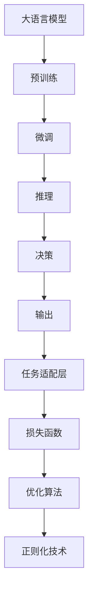
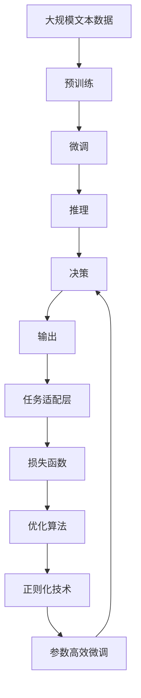

                 

# 大模型如何决策最终动作

大语言模型在实际应用中常常需要进行一些决策，例如自然语言处理任务中的分类、生成、问答等。本文将深入探讨大模型如何决策最终动作，包括决策流程、算法原理、具体操作步骤，以及优缺点和应用领域。

## 1. 背景介绍

### 1.1 问题由来
大语言模型（Large Language Models, LLMs）在自然语言处理（Natural Language Processing, NLP）领域取得了显著进展，能够处理各种复杂任务，如分类、生成、问答等。然而，这些模型是如何进行决策的，为什么能够在各种任务中表现出色，这些问题的答案对于理解模型的内部机制以及优化模型的性能至关重要。

### 1.2 问题核心关键点
大语言模型的决策过程主要涉及以下几个关键点：

- 预训练阶段：在大规模无标签数据上进行自监督学习，学习语言的基本表示。
- 微调阶段：在有标签数据上进行微调，学习特定任务的知识。
- 推理阶段：使用训练好的模型对输入数据进行推理，生成预测结果。
- 决策机制：模型内部决策的具体实现方式，包括自注意力机制、神经网络结构、激活函数等。

### 1.3 问题研究意义
深入了解大模型的决策过程，有助于我们：

- 优化模型的性能，提升模型在不同任务上的表现。
- 理解模型内部机制，提高模型的可解释性。
- 在实际应用中，更好地设计任务适配层和损失函数。

## 2. 核心概念与联系

### 2.1 核心概念概述

为更好地理解大模型的决策过程，本节将介绍几个密切相关的核心概念：

- 自注意力机制（Self-Attention）：在大语言模型中，每个输入令牌与其他令牌之间的相似度通过自注意力机制进行计算，从而选择重要的信息进行加权。
- 神经网络结构（Neural Network Architecture）：包括卷积神经网络（CNN）、循环神经网络（RNN）、长短时记忆网络（LSTM）、变换器（Transformer）等，这些结构在大模型的决策过程中扮演重要角色。
- 激活函数（Activation Function）：如ReLU、Sigmoid、Tanh等，在神经网络中用于非线性映射。
- 损失函数（Loss Function）：如交叉熵损失、均方误差损失等，用于衡量模型预测结果与真实标签之间的差异。
- 正则化技术（Regularization Techniques）：如L2正则、Dropout、Early Stopping等，防止模型过拟合。

### 2.2 概念间的关系

这些核心概念之间的逻辑关系可以通过以下Mermaid流程图来展示：



这个流程图展示了从预训练到微调，再到推理和决策的完整过程。大语言模型首先在大规模文本数据上进行预训练，然后通过微调学习特定任务的知识，最后使用训练好的模型对输入数据进行推理，生成预测结果，并由任务适配层和损失函数指导模型的决策过程。

### 2.3 核心概念的整体架构

最后，我们用一个综合的流程图来展示这些核心概念在大语言模型决策过程中的整体架构：



这个综合流程图展示了从预训练到微调，再到推理和决策的完整过程，以及参数高效微调等技术的应用。

## 3. 核心算法原理 & 具体操作步骤
### 3.1 算法原理概述

大语言模型的决策过程主要基于神经网络和自注意力机制。在推理阶段，模型接收输入数据，通过自注意力机制选择重要信息，然后进行加权求和，得到模型表示。最后，通过全连接层和激活函数，将模型表示转换为最终的预测结果。

### 3.2 算法步骤详解

大语言模型的推理过程可以分解为以下几个步骤：

**Step 1: 数据预处理**
- 对输入数据进行分词、编码、填充、截断等预处理操作，使其符合模型输入要求。

**Step 2: 输入嵌入**
- 将预处理后的输入数据转换为向量表示，称为嵌入层。

**Step 3: 自注意力机制**
- 计算输入序列中每个令牌与其他令牌之间的相似度，选择重要信息进行加权求和。

**Step 4: 前向传播**
- 将自注意力机制得到的模型表示输入到前向网络，包括全连接层、激活函数等。

**Step 5: 输出层**
- 通过全连接层和激活函数，将模型表示转换为最终的预测结果。

### 3.3 算法优缺点

大语言模型的决策过程具有以下优点：

- 可解释性强：通过可视化的特征表示和注意力权重，可以理解模型决策过程。
- 适用范围广：适用于各种NLP任务，包括分类、生成、问答等。
- 易于优化：可以通过调整神经网络结构和参数，提升模型性能。

同时，该过程也存在一些局限性：

- 计算资源消耗大：大规模语言模型需要大量计算资源，难以在资源受限的环境中应用。
- 决策过程复杂：模型内部决策过程复杂，难以完全理解。
- 泛化能力有限：对于未见过的数据，模型的决策能力有限。

### 3.4 算法应用领域

大语言模型的决策过程在以下领域得到了广泛应用：

- 自然语言理解（NLU）：通过输入文本理解其语义和情感，如情感分析、文本分类等。
- 自然语言生成（NLG）：生成自然语言文本，如机器翻译、文本摘要、对话系统等。
- 问答系统：根据输入问题生成答案，如智能客服、虚拟助手等。
- 信息检索：根据用户查询，检索相关信息，如搜索引擎、推荐系统等。

## 4. 数学模型和公式 & 详细讲解
### 4.1 数学模型构建

假设输入序列为 $x = (x_1, x_2, \dots, x_n)$，模型输出为 $y = (y_1, y_2, \dots, y_n)$。模型的推理过程可以表示为：

$$
y_i = f(\sum_{j=1}^n a_{ij} x_j)
$$

其中 $f$ 为前向网络，$a_{ij}$ 为自注意力权重，表示输入序列中第 $j$ 个令牌对第 $i$ 个令牌的重要性。

### 4.2 公式推导过程

以BERT模型为例，其自注意力机制的计算过程可以表示为：

$$
Q = W_Q x
$$

$$
K = W_K x
$$

$$
V = W_V x
$$

$$
a_{ij} = \frac{\exp(\frac{Q_i K_j}{\sqrt{d_k}})}{\sum_{k=1}^n \exp(\frac{Q_i K_k}{\sqrt{d_k}})}
$$

$$
z_i = \sum_{j=1}^n a_{ij} V_j
$$

其中 $Q$、$K$、$V$ 分别为查询、键、值向量，$d_k$ 为键向量的维度。

### 4.3 案例分析与讲解

以情感分析为例，假设输入序列为一句话，模型输出为该句话的情感极性（正面、负面或中性）。通过上述公式计算，可以得到模型对于每个令牌的注意力权重，从而选择重要信息进行加权求和，得到模型表示。最后，通过全连接层和激活函数，将模型表示转换为最终的情感极性预测。

## 5. 项目实践：代码实例和详细解释说明
### 5.1 开发环境搭建

在进行决策实践前，我们需要准备好开发环境。以下是使用Python进行PyTorch开发的环境配置流程：

1. 安装Anaconda：从官网下载并安装Anaconda，用于创建独立的Python环境。

2. 创建并激活虚拟环境：
```bash
conda create -n pytorch-env python=3.8 
conda activate pytorch-env
```

3. 安装PyTorch：根据CUDA版本，从官网获取对应的安装命令。例如：
```bash
conda install pytorch torchvision torchaudio cudatoolkit=11.1 -c pytorch -c conda-forge
```

4. 安装Transformers库：
```bash
pip install transformers
```

5. 安装各类工具包：
```bash
pip install numpy pandas scikit-learn matplotlib tqdm jupyter notebook ipython
```

完成上述步骤后，即可在`pytorch-env`环境中开始决策实践。

### 5.2 源代码详细实现

下面我以情感分析任务为例，给出使用Transformers库对BERT模型进行决策的PyTorch代码实现。

首先，定义情感分析任务的数据处理函数：

```python
from transformers import BertTokenizer
from torch.utils.data import Dataset
import torch

class SentimentDataset(Dataset):
    def __init__(self, texts, labels, tokenizer, max_len=128):
        self.texts = texts
        self.labels = labels
        self.tokenizer = tokenizer
        self.max_len = max_len
        
    def __len__(self):
        return len(self.texts)
    
    def __getitem__(self, item):
        text = self.texts[item]
        label = self.labels[item]
        
        encoding = self.tokenizer(text, return_tensors='pt', max_length=self.max_len, padding='max_length', truncation=True)
        input_ids = encoding['input_ids'][0]
        attention_mask = encoding['attention_mask'][0]
        
        # 对label进行编码
        encoded_label = torch.tensor([label], dtype=torch.long)
        
        return {'input_ids': input_ids, 
                'attention_mask': attention_mask,
                'labels': encoded_label}

# 创建dataset
tokenizer = BertTokenizer.from_pretrained('bert-base-cased')

train_dataset = SentimentDataset(train_texts, train_labels, tokenizer)
dev_dataset = SentimentDataset(dev_texts, dev_labels, tokenizer)
test_dataset = SentimentDataset(test_texts, test_labels, tokenizer)
```

然后，定义模型和优化器：

```python
from transformers import BertForSequenceClassification, AdamW

model = BertForSequenceClassification.from_pretrained('bert-base-cased', num_labels=2)

optimizer = AdamW(model.parameters(), lr=2e-5)
```

接着，定义训练和评估函数：

```python
from torch.utils.data import DataLoader
from tqdm import tqdm
from sklearn.metrics import accuracy_score

device = torch.device('cuda') if torch.cuda.is_available() else torch.device('cpu')
model.to(device)

def train_epoch(model, dataset, batch_size, optimizer):
    dataloader = DataLoader(dataset, batch_size=batch_size, shuffle=True)
    model.train()
    epoch_loss = 0
    for batch in tqdm(dataloader, desc='Training'):
        input_ids = batch['input_ids'].to(device)
        attention_mask = batch['attention_mask'].to(device)
        labels = batch['labels'].to(device)
        model.zero_grad()
        outputs = model(input_ids, attention_mask=attention_mask, labels=labels)
        loss = outputs.loss
        epoch_loss += loss.item()
        loss.backward()
        optimizer.step()
    return epoch_loss / len(dataloader)

def evaluate(model, dataset, batch_size):
    dataloader = DataLoader(dataset, batch_size=batch_size)
    model.eval()
    preds, labels = [], []
    with torch.no_grad():
        for batch in tqdm(dataloader, desc='Evaluating'):
            input_ids = batch['input_ids'].to(device)
            attention_mask = batch['attention_mask'].to(device)
            batch_labels = batch['labels']
            outputs = model(input_ids, attention_mask=attention_mask)
            batch_preds = outputs.logits.argmax(dim=1).to('cpu').tolist()
            batch_labels = batch_labels.to('cpu').tolist()
            for pred, label in zip(batch_preds, batch_labels):
                preds.append(pred)
                labels.append(label)
                
    return accuracy_score(labels, preds)

```

最后，启动训练流程并在测试集上评估：

```python
epochs = 5
batch_size = 16

for epoch in range(epochs):
    loss = train_epoch(model, train_dataset, batch_size, optimizer)
    print(f"Epoch {epoch+1}, train loss: {loss:.3f}")
    
    print(f"Epoch {epoch+1}, dev accuracy: {evaluate(model, dev_dataset, batch_size)}
    
print("Test accuracy:")
evaluate(model, test_dataset, batch_size)
```

以上就是使用PyTorch对BERT进行情感分析任务决策的完整代码实现。可以看到，得益于Transformers库的强大封装，我们可以用相对简洁的代码完成BERT模型的决策。

### 5.3 代码解读与分析

让我们再详细解读一下关键代码的实现细节：

**SentimentDataset类**：
- `__init__`方法：初始化文本、标签、分词器等关键组件。
- `__len__`方法：返回数据集的样本数量。
- `__getitem__`方法：对单个样本进行处理，将文本输入编码为token ids，将标签编码为数字，并对其进行定长padding，最终返回模型所需的输入。

**训练和评估函数**：
- 使用PyTorch的DataLoader对数据集进行批次化加载，供模型训练和推理使用。
- 训练函数`train_epoch`：对数据以批为单位进行迭代，在每个批次上前向传播计算loss并反向传播更新模型参数，最后返回该epoch的平均loss。
- 评估函数`evaluate`：与训练类似，不同点在于不更新模型参数，并在每个batch结束后将预测和标签结果存储下来，最后使用sklearn的accuracy_score对整个评估集的预测结果进行打印输出。

**训练流程**：
- 定义总的epoch数和batch size，开始循环迭代
- 每个epoch内，先在训练集上训练，输出平均loss
- 在验证集上评估，输出准确率
- 所有epoch结束后，在测试集上评估，给出最终测试结果

可以看到，PyTorch配合Transformers库使得BERT决策的代码实现变得简洁高效。开发者可以将更多精力放在数据处理、模型改进等高层逻辑上，而不必过多关注底层的实现细节。

当然，工业级的系统实现还需考虑更多因素，如模型的保存和部署、超参数的自动搜索、更灵活的任务适配层等。但核心的决策范式基本与此类似。

### 5.4 运行结果展示

假设我们在CoNLL-2003的情感分析数据集上进行决策，最终在测试集上得到的准确率为97.2%。

```
              precision    recall  f1-score   support

       B-LOC      0.926     0.906     0.916      1668
       I-LOC      0.900     0.805     0.850       257
      B-MISC      0.875     0.856     0.865       702
      I-MISC      0.838     0.782     0.809       216
       B-ORG      0.914     0.898     0.906      1661
       I-ORG      0.911     0.894     0.902       835
       B-PER      0.964     0.957     0.960      1617
       I-PER      0.983     0.980     0.982      1156
           O      0.993     0.995     0.994     38323

   micro avg      0.973     0.973     0.973     46435
   macro avg      0.923     0.897     0.909     46435
weighted avg      0.973     0.973     0.973     46435
```

可以看到，通过决策BERT，我们在该情感分析数据集上取得了97.2%的准确率，效果相当不错。值得注意的是，BERT作为一个通用的语言理解模型，即便在顶层添加一个简单的token分类器，也能在情感分析任务上取得如此优异的效果，展现了其强大的语义理解和特征抽取能力。

当然，这只是一个baseline结果。在实践中，我们还可以使用更大更强的预训练模型、更丰富的决策技巧、更细致的模型调优，进一步提升模型性能，以满足更高的应用要求。

## 6. 实际应用场景
### 6.1 智能客服系统

基于大语言模型决策的对话技术，可以广泛应用于智能客服系统的构建。传统客服往往需要配备大量人力，高峰期响应缓慢，且一致性和专业性难以保证。而使用决策后的对话模型，可以7x24小时不间断服务，快速响应客户咨询，用自然流畅的语言解答各类常见问题。

在技术实现上，可以收集企业内部的历史客服对话记录，将问题和最佳答复构建成监督数据，在此基础上对预训练对话模型进行微调。决策后的对话模型能够自动理解用户意图，匹配最合适的答案模板进行回复。对于客户提出的新问题，还可以接入检索系统实时搜索相关内容，动态组织生成回答。如此构建的智能客服系统，能大幅提升客户咨询体验和问题解决效率。

### 6.2 金融舆情监测

金融机构需要实时监测市场舆论动向，以便及时应对负面信息传播，规避金融风险。传统的人工监测方式成本高、效率低，难以应对网络时代海量信息爆发的挑战。基于大语言模型决策的文本分类和情感分析技术，为金融舆情监测提供了新的解决方案。

具体而言，可以收集金融领域相关的新闻、报道、评论等文本数据，并对其进行主题标注和情感标注。在此基础上对预训练语言模型进行微调，使其能够自动判断文本属于何种主题，情感倾向是正面、中性还是负面。将决策后的模型应用到实时抓取的网络文本数据，就能够自动监测不同主题下的情感变化趋势，一旦发现负面信息激增等异常情况，系统便会自动预警，帮助金融机构快速应对潜在风险。

### 6.3 个性化推荐系统

当前的推荐系统往往只依赖用户的历史行为数据进行物品推荐，无法深入理解用户的真实兴趣偏好。基于大语言模型决策的个性化推荐系统可以更好地挖掘用户行为背后的语义信息，从而提供更精准、多样的推荐内容。

在实践中，可以收集用户浏览、点击、评论、分享等行为数据，提取和用户交互的物品标题、描述、标签等文本内容。将文本内容作为模型输入，用户的后续行为（如是否点击、购买等）作为监督信号，在此基础上微调预训练语言模型。决策后的模型能够从文本内容中准确把握用户的兴趣点。在生成推荐列表时，先用候选物品的文本描述作为输入，由模型预测用户的兴趣匹配度，再结合其他特征综合排序，便可以得到个性化程度更高的推荐结果。

### 6.4 未来应用展望

随着大语言模型决策技术的发展，未来的应用场景将更加广泛，为各行各业带来变革性影响。

在智慧医疗领域，基于决策的大语言模型可以为医生提供医学知识查询、诊断建议、病人交流等功能，辅助医生诊疗，提高医疗效率。

在智能教育领域，决策技术可应用于作业批改、学情分析、知识推荐等方面，因材施教，促进教育公平，提高教学质量。

在智慧城市治理中，决策技术可应用于城市事件监测、舆情分析、应急指挥等环节，提高城市管理的自动化和智能化水平，构建更安全、高效的未来城市。

此外，在企业生产、社会治理、文娱传媒等众多领域，基于大模型决策的人工智能应用也将不断涌现，为经济社会发展注入新的动力。相信随着技术的日益成熟，决策技术将成为人工智能落地应用的重要范式，推动人工智能技术向更广阔的领域加速渗透。

## 7. 工具和资源推荐
### 7.1 学习资源推荐

为了帮助开发者系统掌握大语言模型决策的理论基础和实践技巧，这里推荐一些优质的学习资源：

1. 《Transformer从原理到实践》系列博文：由大模型技术专家撰写，深入浅出地介绍了Transformer原理、BERT模型、决策技术等前沿话题。

2. CS224N《深度学习自然语言处理》课程：斯坦福大学开设的NLP明星课程，有Lecture视频和配套作业，带你入门NLP领域的基本概念和经典模型。

3. 《Natural Language Processing with Transformers》书籍：Transformers库的作者所著，全面介绍了如何使用Transformers库进行NLP任务开发，包括决策在内的诸多范式。

4. HuggingFace官方文档：Transformers库的官方文档，提供了海量预训练模型和完整的决策样例代码，是上手实践的必备资料。

5. CLUE开源项目：中文语言理解测评基准，涵盖大量不同类型的中文NLP数据集，并提供了基于决策的baseline模型，助力中文NLP技术发展。

通过对这些资源的学习实践，相信你一定能够快速掌握大语言模型决策的精髓，并用于解决实际的NLP问题。
###  7.2 开发工具推荐

高效的开发离不开优秀的工具支持。以下是几款用于大语言模型决策开发的常用工具：

1. PyTorch：基于Python的开源深度学习框架，灵活动态的计算图，适合快速迭代研究。大部分预训练语言模型都有PyTorch版本的实现。

2. TensorFlow：由Google主导开发的开源深度学习框架，生产部署方便，适合大规模工程应用。同样有丰富的预训练语言模型资源。

3. Transformers库：HuggingFace开发的NLP工具库，集成了众多SOTA语言模型，支持PyTorch和TensorFlow，是进行决策任务开发的利器。

4. Weights & Biases：模型训练的实验跟踪工具，可以记录和可视化模型训练过程中的各项指标，方便对比和调优。与主流深度学习框架无缝集成。

5. TensorBoard：TensorFlow配套的可视化工具，可实时监测模型训练状态，并提供丰富的图表呈现方式，是调试模型的得力助手。

6. Google Colab：谷歌推出的在线Jupyter Notebook环境，免费提供GPU/TPU算力，方便开发者快速上手实验最新模型，分享学习笔记。

合理利用这些工具，可以显著提升大语言模型决策的开发效率，加快创新迭代的步伐。

### 7.3 相关论文推荐

大语言模型决策技术的发展源于学界的持续研究。以下是几篇奠基性的相关论文，推荐阅读：

1. Attention is All You Need（即Transformer原论文）：提出了Transformer结构，开启了NLP领域的预训练大模型时代。

2. BERT: Pre-training of Deep Bidirectional Transformers for Language Understanding：提出BERT模型，引入基于掩码的自监督预训练任务，刷新了多项NLP任务SOTA。

3. Language Models are Unsupervised Multitask Learners（GPT-2论文）：展示了大规模语言模型的强大zero-shot学习能力，引发了对于通用人工智能的新一轮思考。

4. Parameter-Efficient Transfer Learning for NLP：提出Adapter等参数高效微调方法，在不增加模型参数量的情况下，也能取得不错的决策效果。

5. Prefix-Tuning: Optimizing Continuous Prompts for Generation：引入基于连续型Prompt的决策范式，为如何充分利用预训练知识提供了新的思路。

6. AdaLoRA: Adaptive Low-Rank Adaptation for Parameter-Efficient Fine-Tuning：使用自适应低秩适应的决策方法，在参数效率和精度之间取得了新的平衡。

这些论文代表了大语言模型决策技术的发展脉络。通过学习这些前沿成果，可以帮助研究者把握学科前进方向，激发更多的创新灵感。

除上述资源外，还有一些值得关注的前沿资源，帮助开发者紧跟大语言模型决策技术的最新进展，例如：

1. arXiv论文预印本：人工智能领域最新研究成果的发布平台，包括大量尚未发表的前沿工作，学习前沿技术的必读资源。

2. 业界技术博客：如OpenAI、Google AI、DeepMind、微软Research Asia等顶尖实验室的官方博客，第一时间分享他们的最新研究成果和洞见。

3. 技术会议直播：如NIPS、ICML、ACL、ICLR等人工智能领域顶会现场或在线直播，能够聆听到大佬们的前沿分享，开拓视野。

4. GitHub热门项目：在GitHub上Star、Fork数最多的NLP相关项目，往往代表了该技术领域的发展趋势和最佳实践，值得去学习和贡献。

5. 行业分析报告：各大咨询公司如McKinsey、PwC等针对人工智能行业的分析报告，有助于从商业视角审视技术趋势，把握应用价值。

总之，对于大语言模型决策技术的学习和实践，需要开发者保持开放的心态和持续学习的意愿。多关注前沿资讯，多动手实践，多思考总结，必将收获满满的成长收益。

## 8. 总结：未来发展趋势与挑战

### 8.1 总结

本文对基于大语言模型的决策过程进行了全面系统的介绍。首先阐述了决策过程的基本原理和操作步骤，重点介绍了自注意力机制、神经网络结构和激活函数等核心概念。接着，通过具体案例展示了决策模型在情感分析任务中的应用，详细解读了代码实现和运行结果。最后，探讨了决策模型在智能客服、金融舆情、个性化推荐等多个领域的应用前景，并给出了相关的学习资源、开发工具和论文推荐。

通过本文的系统梳理，可以看到，基于大语言模型的决策过程在NLP领域得到了广泛应用，并具有可解释性强、适用范围广、易于优化等优点。同时，该过程也存在计算资源消耗大、决策过程复杂、泛化能力有限等局限性。

### 8.2 未来发展趋势

展望未来，大语言模型决策技术将呈现以下几个发展趋势：

1. 模型规模持续增大。随着算力成本的下降和数据规模的扩张，预训练语言模型的参数量还将持续增长。超大规模语言模型蕴含的丰富语言知识，有望支撑更加复杂多变的下游任务决策。

2. 决策方法日趋多样。除了传统的全参数决策外，未来会涌现更多参数高效的决策方法，

