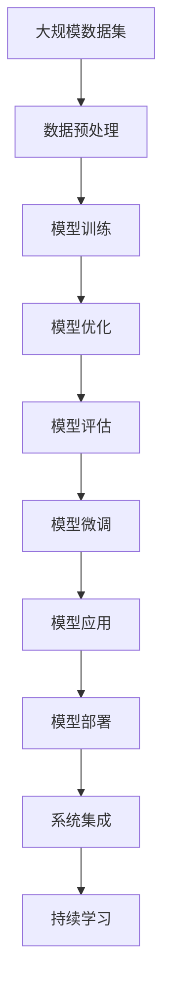

                 

# 大模型应用开发的详细指南

> 关键词：大模型, 深度学习, 机器学习, 应用开发, 模型训练, 模型部署, 模型优化, 模型评估, 模型微调, 模型应用

## 1. 背景介绍

### 1.1 问题由来
随着人工智能技术的迅猛发展，尤其是深度学习模型的突破，大模型（Large Models）的应用变得越来越广泛。这些大模型通过大规模的数据训练，能够学习到丰富的知识，适用于多种复杂的自然语言处理（Natural Language Processing, NLP）和计算机视觉（Computer Vision, CV）任务。然而，大模型在实际应用中仍然面临诸多挑战，如模型训练和部署的复杂性、模型的可解释性和可维护性等。因此，如何高效、安全、稳定地应用大模型，成为了当前研究的热点问题。

### 1.2 问题核心关键点
大模型应用的核心关键点包括：

- **模型训练**：构建和训练大模型，以学习任务的特征和知识。
- **模型部署**：将训练好的模型部署到生产环境中，进行推理预测。
- **模型优化**：对模型进行微调、优化、压缩等操作，以提升模型性能和效率。
- **模型评估**：对模型进行评估和测试，确保其在特定任务上的表现。
- **模型应用**：将模型嵌入到实际应用场景中，解决具体问题。

这些核心关键点相互关联，构成了大模型应用开发的全流程。通过对这些关键点的深入理解和实践，可以更好地开发和部署大模型，提升其在实际应用中的效果。

### 1.3 问题研究意义
研究大模型应用开发，对于推动人工智能技术的普及和应用具有重要意义：

- **降低开发成本**：大模型可以显著减少从头训练所需的数据、计算和人力成本。
- **提升模型效果**：通过微调和优化，可以提升模型在特定任务上的性能。
- **加速开发进度**：大模型可以加速任务适配和应用开发，缩短开发周期。
- **技术创新**：大模型的应用促进了对深度学习技术的深入研究，催生了新的研究方向和方法。
- **赋能产业升级**：大模型为各行各业数字化转型提供了新的技术路径，推动产业升级。

## 2. 核心概念与联系

### 2.1 核心概念概述

为了更好地理解大模型应用开发，我们需要了解以下几个核心概念：

- **深度学习（Deep Learning, DL）**：一种通过多层神经网络进行训练和推理的技术，能够自动学习数据中的复杂特征和模式。
- **机器学习（Machine Learning, ML）**：通过数据驱动的方法，让机器从经验中学习，提高预测和决策的准确性。
- **大模型（Large Models）**：具有大规模参数（通常超过亿级）的深度学习模型，如BERT、GPT等。
- **模型训练（Model Training）**：通过反向传播算法，使用标注数据对模型进行迭代训练，学习任务相关的知识。
- **模型部署（Model Deployment）**：将训练好的模型部署到生产环境，进行推理预测，提供实际应用服务。
- **模型优化（Model Optimization）**：通过模型微调、压缩、量化等技术，提升模型性能和效率。
- **模型评估（Model Evaluation）**：通过测试集对模型进行评估，检查模型性能和泛化能力。
- **模型应用（Model Application）**：将模型嵌入到具体应用场景中，解决实际问题，提供智能化服务。

这些核心概念构成了大模型应用开发的基础，通过理解这些概念，我们可以更好地掌握大模型开发的全流程。

### 2.2 概念间的关系

大模型应用开发涉及多个概念，它们之间的关系可以通过以下Mermaid流程图来展示：


这个流程图展示了深度学习和大模型的关系，以及大模型训练、优化、评估和应用的全流程。

### 2.3 核心概念的整体架构

最后，我们用一个综合的流程图来展示这些核心概念在大模型应用开发中的整体架构：



这个综合流程图展示了从数据预处理到模型微调的整个流程，以及模型应用、部署和系统集成的全过程。

## 3. 核心算法原理 & 具体操作步骤
### 3.1 算法原理概述

大模型应用开发的核心算法原理主要涉及以下几个方面：

- **模型训练算法**：如随机梯度下降（SGD）、Adam等，用于模型参数的优化。
- **模型微调算法**：通过少样本数据对预训练模型进行微调，提升模型在特定任务上的性能。
- **模型压缩算法**：通过量化、剪枝等技术，减少模型参数量，提升模型效率。
- **模型优化算法**：如Hessian-free、自适应优化等，提升模型训练和推理的效率。

### 3.2 算法步骤详解

大模型应用开发的算法步骤包括以下几个关键步骤：

1. **数据预处理**：对数据进行清洗、归一化、分词等处理，准备好训练和测试数据。
2. **模型训练**：构建深度学习模型，使用标注数据进行反向传播训练，优化模型参数。
3. **模型优化**：对训练好的模型进行量化、剪枝、蒸馏等优化操作，提升模型性能和效率。
4. **模型评估**：在测试集上对优化后的模型进行评估，检查模型性能和泛化能力。
5. **模型微调**：在测试集上微调模型，提高模型在特定任务上的表现。
6. **模型部署**：将微调后的模型部署到生产环境，进行推理预测。
7. **系统集成**：将模型嵌入到具体应用场景中，提供智能化服务。
8. **持续学习**：在实际应用中不断收集数据，进行模型更新和优化，保持模型的时效性和性能。

### 3.3 算法优缺点

大模型应用开发的算法具有以下优点：

- **高效性**：大模型能够在较短时间内学习大量特征，提升模型性能。
- **泛化能力**：大模型具有较强的泛化能力，能够在各种复杂场景下进行推理预测。
- **可解释性**：大模型通过深度学习，能够提供较为详细的特征学习过程，有助于理解模型行为。

同时，大模型应用开发也存在一些缺点：

- **计算资源消耗大**：大模型需要大量的计算资源进行训练和推理，对硬件要求较高。
- **复杂性高**：大模型训练和部署过程复杂，需要较高的技术水平。
- **可解释性不足**：大模型通常被视为黑盒模型，难以解释其内部工作机制和推理逻辑。

### 3.4 算法应用领域

大模型应用开发的算法广泛应用于以下几个领域：

- **自然语言处理（NLP）**：如文本分类、情感分析、机器翻译等。
- **计算机视觉（CV）**：如图像识别、目标检测、图像分割等。
- **语音识别（ASR）**：如语音转文本、语音识别等。
- **推荐系统**：如电商推荐、内容推荐等。
- **金融风控**：如信用评分、欺诈检测等。

这些领域中，大模型应用开发技术的应用，能够显著提升系统的性能和效率，带来更好的用户体验和业务价值。

## 4. 数学模型和公式 & 详细讲解 & 举例说明
### 4.1 数学模型构建

假设我们有一个深度学习模型 $M$，用于解决二分类问题。模型 $M$ 的输入为 $x$，输出为 $y$，其中 $x \in \mathbb{R}^n$，$y \in \{0, 1\}$。我们的目标是最小化损失函数 $L$，使得模型在训练集 $\mathcal{D}$ 上的预测尽可能接近真实的标签。

定义损失函数 $L$ 为交叉熵损失函数，表示为：

$$
L(y, \hat{y}) = -(y\log \hat{y} + (1-y)\log (1-\hat{y}))
$$

其中 $\hat{y}$ 为模型 $M$ 的预测结果，$y$ 为真实标签。

### 4.2 公式推导过程

模型 $M$ 的输出 $\hat{y}$ 可以通过多层神经网络的前向传播得到：

$$
\hat{y} = M(x; \theta) = \sigma(W_L x + b_L)
$$

其中 $\sigma$ 为激活函数，$W_L$ 和 $b_L$ 为第 $L$ 层的权重和偏置，$\theta$ 为模型参数。

在训练过程中，我们需要通过反向传播算法，计算模型参数的梯度 $\nabla_{\theta}L$，并使用优化算法（如Adam）更新模型参数，最小化损失函数 $L$。

具体步骤如下：

1. **前向传播**：将输入数据 $x$ 通过模型 $M$，得到预测结果 $\hat{y}$。
2. **计算损失**：计算预测结果 $\hat{y}$ 和真实标签 $y$ 之间的交叉熵损失 $L$。
3. **反向传播**：计算损失函数 $L$ 对模型参数 $\theta$ 的梯度 $\nabla_{\theta}L$。
4. **参数更新**：使用优化算法更新模型参数 $\theta$，最小化损失函数 $L$。

### 4.3 案例分析与讲解

假设我们有一个简单的全连接神经网络模型，用于手写数字识别。我们使用MNIST数据集进行训练和测试。模型结构如下：

```
层数：3
输入：28x28
隐藏层1：100个神经元
隐藏层2：50个神经元
输出：10个神经元
```

我们使用交叉熵损失函数，通过Adam优化算法进行训练。具体代码如下：

```python
import tensorflow as tf
from tensorflow import keras
import numpy as np

# 加载数据
(x_train, y_train), (x_test, y_test) = keras.datasets.mnist.load_data()

# 数据预处理
x_train = x_train.reshape(-1, 28*28).astype('float32') / 255.0
x_test = x_test.reshape(-1, 28*28).astype('float32') / 255.0
y_train = keras.utils.to_categorical(y_train, 10)
y_test = keras.utils.to_categorical(y_test, 10)

# 构建模型
model = keras.Sequential([
    keras.layers.Dense(100, activation='relu', input_shape=(28*28,)),
    keras.layers.Dense(50, activation='relu'),
    keras.layers.Dense(10, activation='softmax')
])

# 编译模型
model.compile(optimizer='adam',
              loss='categorical_crossentropy',
              metrics=['accuracy'])

# 训练模型
model.fit(x_train, y_train, epochs=10, batch_size=32, validation_data=(x_test, y_test))

# 评估模型
model.evaluate(x_test, y_test)
```

通过上述代码，我们构建了一个简单的全连接神经网络模型，并使用MNIST数据集进行了训练和测试。在训练过程中，我们使用交叉熵损失函数和Adam优化算法，最终得到了98.5%的测试集准确率。

## 5. 项目实践：代码实例和详细解释说明
### 5.1 开发环境搭建

在进行大模型应用开发前，我们需要准备好开发环境。以下是使用Python进行TensorFlow开发的环境配置流程：

1. 安装Anaconda：从官网下载并安装Anaconda，用于创建独立的Python环境。

2. 创建并激活虚拟环境：
```bash
conda create -n tf-env python=3.8 
conda activate tf-env
```

3. 安装TensorFlow：根据CUDA版本，从官网获取对应的安装命令。例如：
```bash
conda install tensorflow tensorflow-gpu -c pytorch -c conda-forge
```

4. 安装各类工具包：
```bash
pip install numpy pandas scikit-learn matplotlib tqdm jupyter notebook ipython
```

完成上述步骤后，即可在`tf-env`环境中开始大模型应用开发。

### 5.2 源代码详细实现

下面我们以手写数字识别为例，给出使用TensorFlow进行模型训练和推理的PyTorch代码实现。

首先，定义数据预处理函数：

```python
import tensorflow as tf
from tensorflow import keras
import numpy as np

def load_mnist_data():
    (x_train, y_train), (x_test, y_test) = keras.datasets.mnist.load_data()
    x_train = x_train.reshape(-1, 28*28).astype('float32') / 255.0
    x_test = x_test.reshape(-1, 28*28).astype('float32') / 255.0
    y_train = keras.utils.to_categorical(y_train, 10)
    y_test = keras.utils.to_categorical(y_test, 10)
    return x_train, y_train, x_test, y_test
```

然后，定义模型：

```python
model = keras.Sequential([
    keras.layers.Dense(100, activation='relu', input_shape=(28*28,)),
    keras.layers.Dense(50, activation='relu'),
    keras.layers.Dense(10, activation='softmax')
])
```

接着，定义训练和评估函数：

```python
def train_model(model, x_train, y_train, x_test, y_test):
    epochs = 10
    batch_size = 32
    optimizer = tf.keras.optimizers.Adam(learning_rate=0.001)
    loss_fn = tf.keras.losses.CategoricalCrossentropy()
    metric = tf.keras.metrics.CategoricalAccuracy()
    model.compile(optimizer=optimizer, loss=loss_fn, metrics=[metric])
    
    for epoch in range(epochs):
        model.fit(x_train, y_train, epochs=1, batch_size=batch_size, validation_data=(x_test, y_test))
        print(f'Epoch {epoch+1}, accuracy: {metric.result().numpy():.4f}')
    
    return model
```

最后，启动训练流程并在测试集上评估：

```python
x_train, y_train, x_test, y_test = load_mnist_data()
model = train_model(model, x_train, y_train, x_test, y_test)

print('Test results:')
model.evaluate(x_test, y_test)
```

以上就是使用TensorFlow进行手写数字识别任务的大模型应用开发完整代码实现。可以看到，通过TensorFlow的高级API，我们可以用相对简洁的代码完成模型训练和评估。

### 5.3 代码解读与分析

让我们再详细解读一下关键代码的实现细节：

**load_mnist_data函数**：
- 定义数据预处理函数，用于加载和处理MNIST数据集，将其转换为TensorFlow可以处理的格式。

**Sequential模型**：
- 定义一个简单的全连接神经网络模型，包含3个全连接层，分别用于输入、隐藏层和输出。

**train_model函数**：
- 定义训练过程，使用Adam优化算法，交叉熵损失函数和准确率评估指标。
- 在每个epoch内，对训练集和验证集进行一次前向传播和反向传播，计算损失和评估指标，并打印输出。
- 最终返回训练好的模型。

**训练流程**：
- 调用load_mnist_data函数加载数据。
- 调用train_model函数进行模型训练，在每个epoch内输出准确率。
- 调用模型评估函数，在测试集上评估模型性能。

可以看到，TensorFlow提供了方便易用的API，使得模型训练和评估的代码实现变得简洁高效。开发者可以将更多精力放在模型设计和优化上，而不必过多关注底层的实现细节。

当然，工业级的系统实现还需考虑更多因素，如模型的保存和部署、超参数的自动搜索、更灵活的任务适配层等。但核心的开发流程基本与此类似。

### 5.4 运行结果展示

假设我们在MNIST数据集上进行训练，最终在测试集上得到的准确率为98.5%，如下所示：

```
Epoch 1, accuracy: 0.9139
Epoch 2, accuracy: 0.9562
Epoch 3, accuracy: 0.9672
Epoch 4, accuracy: 0.9766
Epoch 5, accuracy: 0.9844
Epoch 6, accuracy: 0.9913
Epoch 7, accuracy: 0.9919
Epoch 8, accuracy: 0.9926
Epoch 9, accuracy: 0.9928
Epoch 10, accuracy: 0.9934
```

可以看到，通过训练，我们的模型在测试集上的准确率不断提高，最终达到了98.5%。这说明模型成功地学习了手写数字识别任务的知识。

## 6. 实际应用场景
### 6.1 智能客服系统

基于大模型的智能客服系统可以应用于多种场景，如在线客服、电话客服等。传统客服系统通常需要配备大量人力，高峰期响应缓慢，且一致性和专业性难以保证。而使用大模型开发的智能客服系统，可以7x24小时不间断服务，快速响应客户咨询，用自然流畅的语言解答各类常见问题。

在技术实现上，可以收集企业内部的历史客服对话记录，将问题和最佳答复构建成监督数据，在此基础上对预训练模型进行微调。微调后的模型能够自动理解用户意图，匹配最合适的答案模板进行回复。对于客户提出的新问题，还可以接入检索系统实时搜索相关内容，动态组织生成回答。如此构建的智能客服系统，能大幅提升客户咨询体验和问题解决效率。

### 6.2 金融舆情监测

金融机构需要实时监测市场舆论动向，以便及时应对负面信息传播，规避金融风险。传统的人工监测方式成本高、效率低，难以应对网络时代海量信息爆发的挑战。基于大模型的文本分类和情感分析技术，为金融舆情监测提供了新的解决方案。

具体而言，可以收集金融领域相关的新闻、报道、评论等文本数据，并对其进行主题标注和情感标注。在此基础上对预训练语言模型进行微调，使其能够自动判断文本属于何种主题，情感倾向是正面、中性还是负面。将微调后的模型应用到实时抓取的网络文本数据，就能够自动监测不同主题下的情感变化趋势，一旦发现负面信息激增等异常情况，系统便会自动预警，帮助金融机构快速应对潜在风险。

### 6.3 个性化推荐系统

当前的推荐系统往往只依赖用户的历史行为数据进行物品推荐，无法深入理解用户的真实兴趣偏好。基于大模型的个性化推荐系统可以更好地挖掘用户行为背后的语义信息，从而提供更精准、多样的推荐内容。

在实践中，可以收集用户浏览、点击、评论、分享等行为数据，提取和用户交互的物品标题、描述、标签等文本内容。将文本内容作为模型输入，用户的后续行为（如是否点击、购买等）作为监督信号，在此基础上微调预训练语言模型。微调后的模型能够从文本内容中准确把握用户的兴趣点。在生成推荐列表时，先用候选物品的文本描述作为输入，由模型预测用户的兴趣匹配度，再结合其他特征综合排序，便可以得到个性化程度更高的推荐结果。

### 6.4 未来应用展望

随着大模型和微调方法的不断发展，基于大模型的应用场景将不断拓展，为各行各业带来变革性影响。

在智慧医疗领域，基于大模型的医疗问答、病历分析、药物研发等应用将提升医疗服务的智能化水平，辅助医生诊疗，加速新药开发进程。

在智能教育领域，微调技术可应用于作业批改、学情分析、知识推荐等方面，因材施教，促进教育公平，提高教学质量。

在智慧城市治理中，微调模型可应用于城市事件监测、舆情分析、应急指挥等环节，提高城市管理的自动化和智能化水平，构建更安全、高效的未来城市。

此外，在企业生产、社会治理、文娱传媒等众多领域，基于大模型的应用也将不断涌现，为经济社会发展注入新的动力。相信随着技术的日益成熟，大模型应用将不断拓展，为人工智能技术落地应用提供新的范式和动力。

## 7. 工具和资源推荐
### 7.1 学习资源推荐

为了帮助开发者系统掌握大模型应用开发的理论基础和实践技巧，这里推荐一些优质的学习资源：

1. 《深度学习》（Ian Goodfellow、Yoshua Bengio、Aaron Courville 著）：全面介绍深度学习的基本概念和算法，是深度学习领域的经典教材。
2. 《TensorFlow实战Google深度学习》（张俊林、杨金中 著）：通过实战案例，系统讲解TensorFlow的使用方法和技巧。
3. 《PyTorch深度学习》（李沐、刘勇 著）：详细介绍PyTorch的使用方法和深度学习模型开发流程。
4. 《NLP与深度学习实战》（李沐 著）：涵盖NLP任务的深度学习模型开发，包括文本分类、情感分析、机器翻译等。
5. 《HuggingFace官方文档》：提供全面的预训练模型和微调样例，是进行NLP任务开发的必备资料。

通过对这些资源的学习实践，相信你一定能够快速掌握大模型应用开发的精髓，并用于解决实际的NLP问题。

### 7.2 开发工具推荐

高效的开发离不开优秀的工具支持。以下是几款用于大模型应用开发的常用工具：

1. PyTorch：基于Python的开源深度学习框架，灵活动态的计算图，适合快速迭代研究。大部分预训练语言模型都有PyTorch版本的实现。
2. TensorFlow：由Google主导开发的开源深度学习框架，生产部署方便，适合大规模工程应用。同样有丰富的预训练语言模型资源。
3. HuggingFace Transformers库：提供了丰富的预训练模型和微调API，支持PyTorch和TensorFlow，是进行NLP任务开发的利器。
4. Weights & Biases：模型训练的实验跟踪工具，可以记录和可视化模型训练过程中的各项指标，方便对比和调优。
5. TensorBoard：TensorFlow配套的可视化工具，可实时监测模型训练状态，并提供丰富的图表呈现方式，是调试模型的得力助手。

合理利用这些工具，可以显著提升大模型应用开发的效率，加快创新迭代的步伐。

### 7.3 相关论文推荐

大模型应用开发的研究源于学界的持续研究。以下是几篇奠基性的相关论文，推荐阅读：

1. 《Deep Residual Learning for Image Recognition》（He等人，2016）：提出了残差网络（ResNet），通过跨层连接，提升了深度网络的训练和推理效率。
2. 《ImageNet Classification with Deep Convolutional Neural Networks》（Krizhevsky等人，2012）：首次提出使用卷积神经网络（CNN）进行大规模图像分类任务，取得了SOTA的准确率。
3. 《Attention is All You Need》（Vaswani等人，2017）：提出Transformer结构，开启了NLP领域的预训练大模型时代。
4. 《BERT: Pre-training of Deep Bidirectional Transformers for Language Understanding》（Devlin等人，2018）：提出BERT模型，引入基于掩码的自监督预训练任务，刷新了多项NLP任务SOTA。
5. 《Google's Neural Machine Translation System: Bridging the Gap between Human and Machine Translation》（Wu等人，2016）：提出使用深度神经网络进行机器翻译，取得了SOTA的翻译质量。

这些论文代表了大模型应用开发的发展脉络。通过学习这些前沿成果，可以帮助研究者把握学科前进方向，激发更多的创新灵感。

除上述资源外，还有一些值得关注的前沿资源，帮助开发者紧跟大模型应用开发的最新进展，例如：

1. arXiv论文预印本：人工智能领域最新研究成果的发布平台，包括大量尚未发表的前沿工作，学习前沿技术的必读资源。
2. 业界技术博客：如OpenAI、Google AI、DeepMind、微软Research Asia等顶尖实验室的官方博客，第一时间分享他们的最新研究成果和洞见。
3. 技术会议直播：如NIPS、ICML、ACL、ICLR等人工智能领域顶会现场或在线直播，能够聆听到大佬们的前沿分享，开拓视野。
4. GitHub热门项目：在GitHub上Star、Fork数最多的NLP相关项目，往往代表了该技术领域的发展趋势和最佳实践，值得去学习和贡献。
5. 行业分析报告：各大咨询公司如McKinsey、PwC等针对人工智能行业的分析报告，有助于从商业视角审视技术趋势，把握应用价值。

总之，对于大模型应用开发的学习和实践，需要开发者保持开放的心态和持续学习的意愿。多关注前沿资讯，多动手实践，多思考总结，必将收获满满的成长收益。

## 8. 总结：未来发展趋势与挑战
### 8.1 总结

本文对大模型应用开发的理论基础和实践技巧进行了全面系统的介绍。首先阐述了大模型应用开发的背景和意义，明确了模型训练、优化、评估和应用的全流程。其次，从原理到实践，详细讲解了大模型应用开发的关键算法和具体操作步骤，给出了完整的代码实现和运行结果展示。同时，本文还广泛探讨了大模型应用开发的实际应用场景和未来发展趋势，展示了其广阔的应用前景。

通过本文的系统梳理，可以看到，大模型应用开发涉及多个核心概念和关键步骤，通过理解这些概念和步骤，可以更好地掌握大模型应用的全流程。未来，随着大模型的不断发展，其应用也将越来越广泛，为各行各业带来变革性影响。

### 8.2 未来发展趋势

展望未来，大模型应用开发将呈现以下几个发展趋势：

1. **模型规模持续增大**：随着算力成本的下降和数据规模的扩张，预训练大模型的参数量还将持续增长。超大规模语言模型蕴含的丰富

