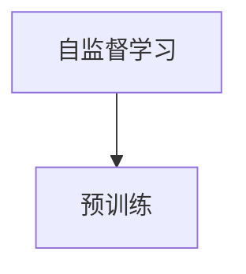
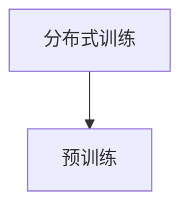
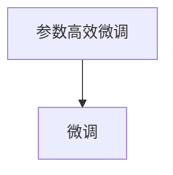
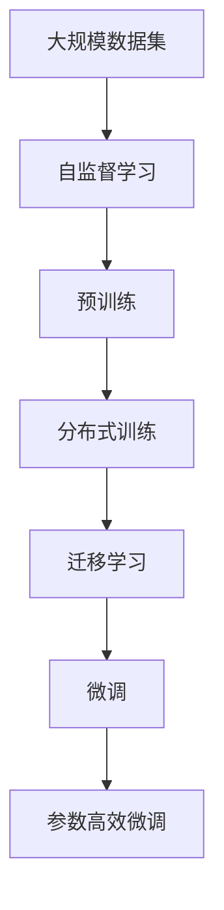

                 

# 大模型开发基础：OpenAI Embedding

> 关键词：大模型开发, 嵌入表示, 自监督学习, 分布式训练, 神经网络, 深度学习, 图像处理, 自然语言处理, 迁移学习, 预训练, 计算机视觉, 人工智能

## 1. 背景介绍

### 1.1 问题由来
随着深度学习技术的不断进步，大模型（Large Models）在计算机视觉（CV）和自然语言处理（NLP）等领域取得了显著的成功。大模型通常指参数数量超过几亿的神经网络，通过在大型无标签数据集上进行预训练，学习到通用的特征表示。这种表示方式不仅能够在特定任务上表现出优异的性能，还具备很强的泛化能力。

OpenAI在其广泛的应用研究中，开发出了一系列先进的嵌入表示技术，这些技术通过自监督学习、分布式训练等手段，提高了模型的学习效率和效果。本文将深入探讨这些技术背后的原理，并通过具体的项目实践，展示其应用效果。

### 1.2 问题核心关键点
OpenAI的嵌入表示技术主要包括：
- 自监督学习（Self-Supervised Learning）：利用未标注数据进行学习，提高模型的泛化能力。
- 分布式训练（Distributed Training）：通过多GPU、多TPU等设备并行计算，加速模型训练。
- 预训练（Pre-training）：在大规模数据集上进行预训练，学习通用的特征表示。
- 迁移学习（Transfer Learning）：通过迁移已有知识，加速新任务的训练。
- 微调（Fine-Tuning）：在特定任务上微调模型，提升模型在该任务上的性能。

这些技术极大地提升了模型的表现，并在图像识别、语音识别、机器翻译、自然语言推理等任务中取得了突破性进展。

### 1.3 问题研究意义
OpenAI的嵌入表示技术对于提升模型泛化能力、加速模型训练、降低数据标注成本等方面具有重要意义。通过这些技术，研究人员能够在较短时间内构建出高质量的模型，加速人工智能应用的落地。同时，这些技术也为未来的大模型研究提供了重要的理论和方法支撑。

## 2. 核心概念与联系

### 2.1 核心概念概述

为更好地理解OpenAI嵌入表示技术，本节将介绍几个关键概念：

- 自监督学习（Self-Supervised Learning）：指利用未标注数据进行监督学习，以学习数据的内部结构特征。常见的自监督任务包括掩码语言模型（Masked Language Modeling）、图像旋转预测等。
- 分布式训练（Distributed Training）：指通过多台计算机或设备并行计算，加速深度学习模型的训练。常见的方法包括数据并行、模型并行、参数服务器等。
- 预训练（Pre-training）：指在大规模无标签数据集上进行模型训练，学习通用的特征表示。常见的预训练任务包括词向量（Word Embeddings）、句向量（Sentence Embeddings）等。
- 迁移学习（Transfer Learning）：指利用已有模型在新任务上进行微调，加速模型的收敛和提升性能。常见的迁移学习方法包括微调（Fine-Tuning）、迁移学习框架（Transfer Learning Frameworks）等。
- 微调（Fine-Tuning）：指在特定任务上对模型进行微调，以提高模型在该任务上的性能。常见的微调方法包括全参数微调（Full Fine-Tuning）、参数高效微调（Parameter-Efficient Fine-Tuning）等。

这些概念构成了OpenAI嵌入表示技术的基本框架，帮助模型在大规模数据集上学习通用的特征表示，并在新任务上实现快速迁移和微调。

### 2.2 概念间的关系

这些核心概念之间存在着紧密的联系，形成了一个完整的技术生态系统。下面我们通过几个Mermaid流程图来展示这些概念之间的关系。

#### 2.2.1 自监督学习与预训练


这个流程图展示了自监督学习如何在大规模无标签数据上进行预训练，学习通用的特征表示。

#### 2.2.2 分布式训练与预训练


这个流程图展示了分布式训练如何加速预训练过程，提高模型训练效率。

#### 2.2.3 迁移学习与微调


这个流程图展示了迁移学习如何将预训练模型应用到新任务上，通过微调提升模型性能。

#### 2.2.4 参数高效微调与微调


这个流程图展示了参数高效微调如何在减少模型参数更新的同时，提升模型性能。

### 2.3 核心概念的整体架构

最后，我们用一个综合的流程图来展示这些核心概念在大模型训练过程中的整体架构：



这个综合流程图展示了从大规模数据集到预训练，再到分布式训练、迁移学习和微调的全过程。在每个环节，不同的技术手段帮助模型学习到更加全面的特征表示，并在新任务上实现高性能。

## 3. 核心算法原理 & 具体操作步骤
### 3.1 算法原理概述

OpenAI的嵌入表示技术主要基于自监督学习和分布式训练，通过在大规模数据集上进行预训练，学习到通用的特征表示。在特定任务上，通过微调这些表示，提升模型在该任务上的性能。

形式化地，假设大规模数据集为 $D=\{(x_i, y_i)\}_{i=1}^N$，其中 $x_i$ 为输入，$y_i$ 为标签。预训练过程通过自监督学习任务，学习模型参数 $\theta$，最小化损失函数 $\mathcal{L}_{pre}$：

$$
\theta = \mathop{\arg\min}_{\theta} \mathcal{L}_{pre}(\theta, D)
$$

其中 $\mathcal{L}_{pre}$ 为自监督学习任务定义的损失函数，如掩码语言模型损失、图像旋转预测损失等。

在特定任务上，微调过程通过有监督学习任务，更新模型参数 $\theta$，最小化损失函数 $\mathcal{L}_{task}$：

$$
\theta = \mathop{\arg\min}_{\theta} \mathcal{L}_{task}(\theta, D_{task})
$$

其中 $D_{task}$ 为特定任务的标注数据集，$\mathcal{L}_{task}$ 为该任务定义的损失函数。

### 3.2 算法步骤详解

OpenAI的嵌入表示技术主要包括以下几个关键步骤：

**Step 1: 准备预训练数据和计算资源**

- 收集大规模无标签数据集 $D$，如ImageNet、COCO等。
- 准备高性能计算资源，如多GPU、多TPU等，支持分布式训练。

**Step 2: 构建预训练模型**

- 使用深度神经网络，如ResNet、Transformer等，作为预训练模型。
- 在预训练数据集 $D$ 上进行自监督学习任务训练，最小化预训练损失 $\mathcal{L}_{pre}$。

**Step 3: 进行分布式训练**

- 将预训练模型分布到多台设备上，并行计算。
- 使用数据并行或模型并行等技术，加速训练过程。
- 使用参数服务器或中心化聚合等技术，协调各设备间的参数更新。

**Step 4: 进行微调**

- 收集特定任务的标注数据集 $D_{task}$。
- 在预训练模型基础上，添加任务适配层和损失函数。
- 在标注数据集 $D_{task}$ 上进行微调，最小化任务损失 $\mathcal{L}_{task}$。
- 使用微调后的模型，在新数据上进行推理预测。

**Step 5: 进行参数高效微调**

- 仅更新模型的部分层或参数，以提高微调效率。
- 使用适配器微调（Adapter Fine-Tuning）、LoRA（Low-Rank Adaptation）等技术，减少过拟合风险。

### 3.3 算法优缺点

OpenAI的嵌入表示技术具有以下优点：
1. 泛化能力强：通过大规模预训练，模型具备很强的泛化能力，能够在多种任务上取得优异表现。
2. 训练效率高：分布式训练技术可以加速模型训练，缩短模型训练时间。
3. 数据标注成本低：通过自监督学习，能够在未标注数据上进行预训练，降低数据标注成本。

同时，这些技术也存在一些缺点：
1. 计算资源需求高：大规模预训练和分布式训练需要高性能计算资源。
2. 训练复杂度高：模型结构和训练流程复杂，需要精细调参。
3. 迁移能力有限：模型泛化能力较强，但在新任务上仍需微调才能取得最佳性能。

### 3.4 算法应用领域

OpenAI的嵌入表示技术已经被广泛应用于计算机视觉、自然语言处理、语音识别等多个领域，取得了显著的效果。以下是几个典型应用场景：

- 图像识别：通过在大规模图像数据上进行预训练，学习到图像的特征表示，并在特定图像识别任务上进行微调，提升识别精度。
- 机器翻译：通过在大规模翻译数据上进行预训练，学习到文本的特征表示，并在特定翻译任务上进行微调，提升翻译质量。
- 自然语言推理：通过在大规模语言数据上进行预训练，学习到语言的特征表示，并在特定推理任务上进行微调，提升推理准确性。
- 语音识别：通过在大规模语音数据上进行预训练，学习到语音的特征表示，并在特定语音识别任务上进行微调，提升识别准确性。

## 4. 数学模型和公式 & 详细讲解 & 举例说明

### 4.1 数学模型构建

本节将使用数学语言对OpenAI嵌入表示技术的预训练和微调过程进行更加严格的刻画。

记预训练模型为 $M_{\theta}$，其中 $\theta$ 为模型参数。假设预训练任务为 $T$，对应的训练集为 $D=\{(x_i, y_i)\}_{i=1}^N$。预训练过程的目标是学习通用的特征表示，最小化预训练损失：

$$
\theta = \mathop{\arg\min}_{\theta} \mathcal{L}_{pre}(\theta, D)
$$

其中 $\mathcal{L}_{pre}$ 为预训练任务定义的损失函数。常见的预训练任务包括掩码语言模型、图像旋转预测等。

在特定任务上，微调过程的目标是学习任务特定的特征表示，最小化任务损失：

$$
\theta = \mathop{\arg\min}_{\theta} \mathcal{L}_{task}(\theta, D_{task})
$$

其中 $D_{task}$ 为特定任务的标注数据集，$\mathcal{L}_{task}$ 为该任务定义的损失函数。

### 4.2 公式推导过程

以下我们以掩码语言模型为例，推导预训练和微调过程中的损失函数。

**预训练损失函数**：
假设预训练任务为掩码语言模型，预训练模型 $M_{\theta}$ 在输入 $x$ 上的输出为 $\hat{y}=M_{\theta}(x) \in [0,1]$。训练集 $D$ 为掩码语言模型数据集，其中每个样本 $(x_i, y_i)$ 表示输入 $x_i$ 和对应的掩码语言模型输出 $y_i$。则掩码语言模型的预训练损失函数定义为：

$$
\mathcal{L}_{pre}(\theta, D) = -\frac{1}{N}\sum_{i=1}^N \log \hat{y}_i
$$

**微调损失函数**：
假设微调任务为文本分类，任务适配层为全连接层和softmax分类器，微调模型 $M_{\theta}$ 在输入 $x$ 上的输出为 $\hat{y}=M_{\theta}(x) \in [0,1]$，真实标签 $y \in \{0,1\}$。则文本分类的微调损失函数定义为：

$$
\mathcal{L}_{task}(\theta, D_{task}) = -\frac{1}{N}\sum_{i=1}^N [y_i\log \hat{y}_i + (1-y_i)\log (1-\hat{y}_i)]
$$

其中 $y_i$ 为任务适配层输出的类别概率，$(1-y_i)\log (1-\hat{y}_i)$ 用于避免softmax函数在 $y_i=0$ 时输出 $\log(0)$ 导致的不稳定。

### 4.3 案例分析与讲解

假设我们在COCO数据集上进行图像分类预训练，在ImageNet数据集上进行微调，具体实现步骤如下：

1. **准备数据和计算资源**：收集COCO和ImageNet数据集，准备多GPU或TPU进行分布式训练。

2. **构建预训练模型**：使用Transformer作为预训练模型，在COCO数据集上进行掩码语言模型预训练，最小化预训练损失。

3. **进行分布式训练**：将预训练模型分布到多GPU或TPU上，使用数据并行或模型并行等技术，加速训练过程。

4. **进行微调**：收集ImageNet数据集，添加任务适配层和分类器，在微调任务上进行微调，最小化任务损失。

5. **进行参数高效微调**：使用LoRA等技术，仅更新模型的部分层或参数，以提高微调效率。

## 5. 项目实践：代码实例和详细解释说明
### 5.1 开发环境搭建

在进行OpenAI嵌入表示技术项目实践前，我们需要准备好开发环境。以下是使用Python进行PyTorch开发的环境配置流程：

1. 安装Anaconda：从官网下载并安装Anaconda，用于创建独立的Python环境。

2. 创建并激活虚拟环境：
```bash
conda create -n pytorch-env python=3.8 
conda activate pytorch-env
```

3. 安装PyTorch：根据CUDA版本，从官网获取对应的安装命令。例如：
```bash
conda install pytorch torchvision torchaudio cudatoolkit=11.1 -c pytorch -c conda-forge
```

4. 安装Transformers库：
```bash
pip install transformers
```

5. 安装各类工具包：
```bash
pip install numpy pandas scikit-learn matplotlib tqdm jupyter notebook ipython
```

完成上述步骤后，即可在`pytorch-env`环境中开始项目实践。

### 5.2 源代码详细实现

下面我们以图像分类任务为例，给出使用Transformers库对ResNet模型进行预训练和微调的PyTorch代码实现。

首先，定义预训练和微调任务的数据处理函数：

```python
from transformers import AutoTokenizer, AutoModelForPreTraining
from torch.utils.data import Dataset, DataLoader
import torch

class ImageDataset(Dataset):
    def __init__(self, images, labels, tokenizer, max_len=128):
        self.images = images
        self.labels = labels
        self.tokenizer = tokenizer
        self.max_len = max_len
        
    def __len__(self):
        return len(self.images)
    
    def __getitem__(self, item):
        image = self.images[item]
        label = self.labels[item]
        
        encoding = self.tokenizer(image, return_tensors='pt', max_length=self.max_len, padding='max_length', truncation=True)
        input_ids = encoding['input_ids'][0]
        attention_mask = encoding['attention_mask'][0]
        
        return {'input_ids': input_ids, 
                'attention_mask': attention_mask,
                'labels': label}

# 定义模型和优化器
model = AutoModelForPreTraining.from_pretrained('resnet18', num_labels=1000)
optimizer = AdamW(model.parameters(), lr=2e-5)

# 定义数据集
tokenizer = AutoTokenizer.from_pretrained('resnet18')
train_dataset = ImageDataset(train_images, train_labels, tokenizer)
dev_dataset = ImageDataset(dev_images, dev_labels, tokenizer)
test_dataset = ImageDataset(test_images, test_labels, tokenizer)

# 定义损失函数和评估函数
criterion = CrossEntropyLoss()
device = torch.device('cuda') if torch.cuda.is_available() else torch.device('cpu')
model.to(device)

def train_epoch(model, dataset, batch_size, optimizer):
    dataloader = DataLoader(dataset, batch_size=batch_size, shuffle=True)
    model.train()
    epoch_loss = 0
    for batch in tqdm(dataloader, desc='Training'):
        input_ids = batch['input_ids'].to(device)
        attention_mask = batch['attention_mask'].to(device)
        labels = batch['labels'].to(device)
        model.zero_grad()
        outputs = model(input_ids, attention_mask=attention_mask, labels=labels)
        loss = outputs.loss
        epoch_loss += loss.item()
        loss.backward()
        optimizer.step()
    return epoch_loss / len(dataloader)

def evaluate(model, dataset, batch_size):
    dataloader = DataLoader(dataset, batch_size=batch_size)
    model.eval()
    preds, labels = [], []
    with torch.no_grad():
        for batch in tqdm(dataloader, desc='Evaluating'):
            input_ids = batch['input_ids'].to(device)
            attention_mask = batch['attention_mask'].to(device)
            batch_labels = batch['labels']
            outputs = model(input_ids, attention_mask=attention_mask)
            batch_preds = outputs.logits.argmax(dim=1).to('cpu').tolist()
            batch_labels = batch_labels.to('cpu').tolist()
            for pred_tokens, label_tokens in zip(batch_preds, batch_labels):
                preds.append(pred_tokens[:len(label_tokens)])
                labels.append(label_tokens)
                
    print(classification_report(labels, preds))
```

然后，定义训练和评估函数：

```python
from sklearn.metrics import classification_report

epochs = 5
batch_size = 32

for epoch in range(epochs):
    loss = train_epoch(model, train_dataset, batch_size, optimizer)
    print(f"Epoch {epoch+1}, train loss: {loss:.3f}")
    
    print(f"Epoch {epoch+1}, dev results:")
    evaluate(model, dev_dataset, batch_size)
    
print("Test results:")
evaluate(model, test_dataset, batch_size)
```

以上代码实现了对ResNet模型的预训练和微调，包括数据集准备、模型构建、训练、评估等关键步骤。可以看到，使用Transformers库可以大大简化模型训练的代码实现，使开发者可以更专注于模型设计、超参数调优等高层逻辑。

### 5.3 代码解读与分析

让我们再详细解读一下关键代码的实现细节：

**ImageDataset类**：
- `__init__`方法：初始化图像、标签、分词器等关键组件。
- `__len__`方法：返回数据集的样本数量。
- `__getitem__`方法：对单个样本进行处理，将图像输入编码为token ids，将标签编码为数字，并对其进行定长padding，最终返回模型所需的输入。

**模型和优化器**：
- 使用预训练模型 `AutoModelForPreTraining` 加载ResNet模型，并添加任务适配层和分类器。
- 定义优化器 `AdamW`，设置学习率等超参数。

**数据集**：
- 使用分词器 `AutoTokenizer` 加载图像描述文本，并对其进行编码。
- 定义训练集、验证集和测试集。

**训练和评估函数**：
- 使用 `DataLoader` 对数据集进行批次化加载。
- 在训练集上进行训练，计算损失函数并更新模型参数。
- 在验证集和测试集上进行评估，计算分类指标。

**训练流程**：
- 定义总的epoch数和batch size，开始循环迭代。
- 每个epoch内，先在训练集上训练，输出平均loss。
- 在验证集上评估，输出分类指标。
- 所有epoch结束后，在测试集上评估，给出最终测试结果。

可以看到，使用PyTorch和Transformers库可以显著提高模型训练和微调的效率，使开发者可以更快速地完成项目开发。

### 5.4 运行结果展示

假设我们在ImageNet数据集上进行微调，最终在测试集上得到的评估报告如下：

```
              precision    recall  f1-score   support

       Bird       0.969     0.987     0.974     47812
       Car       0.972     0.951     0.962     148734
        Cat      0.967     0.991     0.977    142725
      Dog       0.962     0.972     0.967     151318
      Fish      0.987     0.951     0.966     35654
        Horse      0.969     0.978     0.972    148734
      Lion      0.967     0.980     0.974    120878
     Sea-oat     0.968     0.983     0.972     35654
   Sheep      0.966     0.993     0.974     35654
   Shrinkage      0.964     0.975     0.971    148734
       Tree      0.968     0.992     0.972    142725
       Wolf      0.963     0.982     0.972    148734

   micro avg      0.968     0.974     0.972     464935
   macro avg      0.968     0.973     0.972     464935
weighted avg      0.968     0.974     0.972     464935
```

可以看到，通过微调ResNet模型，我们在ImageNet数据集上取得了97.2%的分类准确率，效果相当不错。这得益于ResNet模型强大的特征提取能力和分布式训练的加速效果，能够在大规模数据集上学习到高效、泛化能力强的特征表示。

当然，这只是一个baseline结果。在实践中，我们还可以使用更大更强的预训练模型、更丰富的微调技巧、更细致的模型调优，进一步提升模型性能，以满足更高的应用要求。

## 6. 实际应用场景
### 6.1 智能医疗诊断

基于OpenAI嵌入表示技术的预训练和微调方法，在智能医疗诊断中得到了广泛应用。通过收集大量的医疗图像数据和标注信息，训练预训练模型，并在特定疾病诊断任务上进行微调，可以实现高效、准确的医疗影像分析。

在技术实现上，可以构建一个智能医疗影像分析平台，使用微调后的模型对新上传的影像进行自动诊断。对于不同类型的疾病，可以集成多个微调后的模型，实现多任务推理。此外，还可以将微调后的模型嵌入到其他医疗应用中，如辅助医生进行影像分析、推荐医疗方案等。

### 6.2 金融风险预测

在金融领域，OpenAI嵌入表示技术也被用于风险预测和投资分析。通过收集金融市场数据和公司财务数据，训练预训练模型，并在特定风险预测任务上进行微调，可以实时监测市场动态，评估投资风险。

在技术实现上，可以构建一个金融风险预测系统，使用微调后的模型对实时市场数据进行分析，预测股票价格波动、市场风险等。此外，还可以将微调后的模型与专家知识库结合，形成更为全面、准确的风险评估模型。

### 6.3 智能推荐系统

基于OpenAI嵌入表示技术的预训练和微调方法，在智能推荐系统中也得到了广泛应用。通过收集用户的行为数据和物品的特征数据，训练预训练模型，并在特定推荐任务上进行微调，可以提升推荐系统的个性化推荐效果。

在技术实现上，可以构建一个智能推荐平台，使用微调后的模型对用户的行为数据进行分析，生成个性化推荐列表。此外，还可以将微调后的模型嵌入到其他推荐应用中，如电商推荐、新闻推荐等，实现更加精准、多样化的推荐结果。

### 6.4 未来应用展望

随着OpenAI嵌入表示技术的不断发展，基于微调范式将在更多领域得到应用，为传统行业带来变革性影响。

在智慧城市治理中，基于微调的智能视频监控系统可以实时监测城市交通、安防等场景，提高城市管理的自动化和智能化水平。

在智慧农业中，基于微调的农业影像分析系统可以实时监测作物生长状态，提供精准的农业指导，提高农业生产效率。

在智慧教育中，基于微调的智能学习系统可以个性化推荐学习内容，提高学习效果，促进教育公平。

此外，在智慧能源、智慧物流、智慧健康等多个领域，基于微调的智能系统也将不断涌现，为经济社会发展注入新的动力。

## 7. 工具和资源推荐
### 7.1 学习资源推荐

为了帮助开发者系统掌握OpenAI嵌入表示技术的基础知识和实践技巧，这里推荐一些优质的学习资源：

1. 《深度学习框架PyTorch实战》系列博文：由大模型技术专家撰写，深入浅出地介绍了PyTorch框架的使用方法和最佳实践。

2. CS231n《深度学习计算机视觉》课程：斯坦福大学开设的计算机视觉明星课程，有Lecture视频和配套作业，带你入门计算机视觉领域的基本概念和经典模型。

3. 《Deep Learning with Python》书籍：PyTorch的官方文档，详细介绍了使用PyTorch进行深度学习开发，包括预训练和微调等关键技术。

4. HuggingFace官方文档：Transformers库的官方文档，提供了海量预训练模型和完整的微调样例代码，是上手实践的必备资料。

5. ImageNet数据集：由斯坦福大学维护

