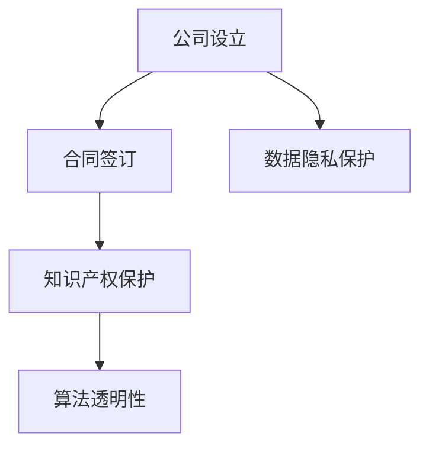
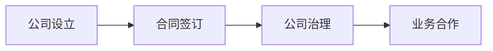
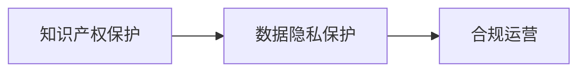
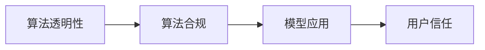
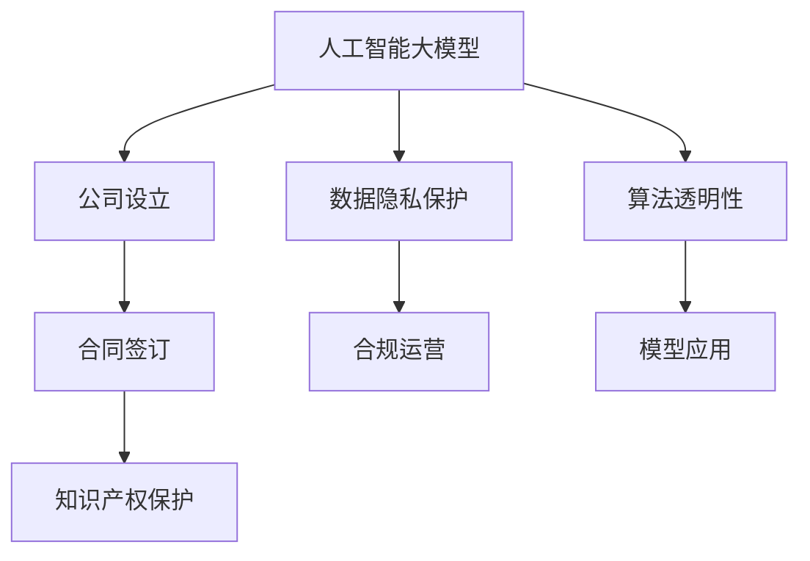

                 

# 大模型时代的创业者创业法律风险防范：公司设立、合同签订与知识产权保护

在人工智能和大模型迅速发展的今天，越来越多的创业者投身于前沿技术领域，希望通过创新实现商业价值和社会影响的双重突破。然而，在这个充满机遇与挑战的时代，创业者在创业过程中不可避免地会遇到各种法律风险。本文将详细介绍大模型时代的创业者在设立公司、签订合同、保护知识产权等方面的法律风险防范策略，帮助创业者在快速发展的技术浪潮中稳健前行。

## 1. 背景介绍

### 1.1 问题由来
人工智能和大模型技术的快速发展，使得数据驱动、算法优先的创业模式成为可能。创业者可以利用这些技术快速开发出具有市场竞争力的产品。然而，随之而来的法律风险也逐渐显现，如数据隐私保护、算法透明性、知识产权归属等，都可能成为创业道路上难以规避的障碍。因此，对法律风险的防范成为了创业者必须重视的问题。

### 1.2 问题核心关键点
在人工智能和大模型领域，法律风险防范的核心关键点主要包括：
- 公司设立：如何合规、高效地设立公司，保障创业初期的稳定性。
- 合同签订：如何签订具有法律效力的合同，避免合作纠纷。
- 知识产权保护：如何保护技术创新成果，防止侵权行为。

## 2. 核心概念与联系

### 2.1 核心概念概述

为更好地理解大模型时代创业者创业法律风险防范方法，本节将介绍几个密切相关的核心概念：

- **公司设立**：创业初期的法律结构选择，如有限责任公司、股份有限公司等。
- **合同签订**：创业过程中与合作伙伴、员工、供应商等签署的各种法律文件。
- **知识产权**：创业团队开发的技术、算法、设计等创新成果的权益保护。
- **数据隐私**：在收集、处理和使用用户数据过程中，需遵守的数据保护法规。
- **算法透明性**：确保算法决策过程可解释、可审查，避免潜在的法律风险。

这些核心概念之间的逻辑关系可以通过以下Mermaid流程图来展示：



这个流程图展示了从公司设立到合同签订，再到知识产权保护的整个法律风险防范过程。

### 2.2 概念间的关系

这些核心概念之间存在着紧密的联系，形成了大模型时代创业者创业法律风险防范的完整生态系统。下面我们通过几个Mermaid流程图来展示这些概念之间的关系。

#### 2.2.1 公司设立与合同签订的关系



这个流程图展示了公司设立与合同签订的关系。公司设立为合同签订提供法律基础，合同签订保障公司治理和业务合作的顺利进行。

#### 2.2.2 知识产权保护与数据隐私保护的关系



这个流程图展示了知识产权保护与数据隐私保护的关系。知识产权保护确保技术创新成果的归属权，而数据隐私保护则保障在处理用户数据时的合法合规。

#### 2.2.3 算法透明性与算法合规的关系



这个流程图展示了算法透明性与算法合规的关系。算法透明性保障模型决策过程的可解释性，算法合规确保模型应用的合法性，两者共同构建用户对算法的信任。

### 2.3 核心概念的整体架构

最后，我们用一个综合的流程图来展示这些核心概念在大模型时代创业者创业法律风险防范中的整体架构：



这个综合流程图展示了从人工智能大模型开发到法律风险防范的完整过程。通过这些核心概念的协同作用，创业者可以更好地防范法律风险，保护自己的权益。

## 3. 核心算法原理 & 具体操作步骤
### 3.1 算法原理概述

大模型时代的创业者创业法律风险防范，本质上是一种基于法律规则的系统性防范策略。其核心思想是：利用法律知识，在创业过程中建立合规、透明、安全的法律架构，防范潜在的法律风险。

具体而言，可以归纳为以下几个步骤：

1. **公司设立**：选择合适的公司形式，遵循相关法律法规，完成公司设立流程。
2. **合同签订**：明确合作各方的权利义务，约定违约责任，确保合同合法有效。
3. **知识产权保护**：申请专利、商标、版权等知识产权，保护创新成果。
4. **数据隐私保护**：遵守数据保护法规，采取数据保护措施，确保用户数据安全。
5. **算法透明性**：构建可解释的算法模型，确保决策过程透明，符合法律要求。

### 3.2 算法步骤详解

#### 3.2.1 公司设立步骤

1. **选择公司形式**：根据创业项目的性质和规模，选择有限责任公司、股份有限公司等形式。
2. **准备设立材料**：包括公司章程、股东协议、名称预先核准申请等。
3. **申请工商注册**：通过国家工商行政管理部门完成公司注册。
4. **开立银行账户**：开设公司银行账户，完成税务登记。

#### 3.2.2 合同签订步骤

1. **明确合同目的**：确保合同目标明确、具体，避免模糊不清。
2. **详细约定条款**：包括合作内容、工作成果、验收标准、付款方式、违约责任等。
3. **审查合同条款**：确保合同内容合法、合规，避免侵犯他人权益。
4. **签署合同**：各方签字盖章，确保合同生效。

#### 3.2.3 知识产权保护步骤

1. **申请知识产权**：根据创新成果的性质，申请专利、商标、版权等。
2. **保护知识产权**：采取保密措施，避免知识产权被侵权。
3. **监控侵权行为**：定期监测市场，发现侵权行为及时采取法律行动。

#### 3.2.4 数据隐私保护步骤

1. **数据分类管理**：根据数据的重要性和敏感性，采取不同级别的保护措施。
2. **遵守法规要求**：遵守《个人信息保护法》《网络安全法》等数据保护法规。
3. **数据访问控制**：采取严格的访问控制措施，防止数据泄露。

#### 3.2.5 算法透明性步骤

1. **构建可解释模型**：选择可解释性强的模型架构，如决策树、线性回归等。
2. **记录决策过程**：记录模型训练过程、参数调整等细节，确保决策过程透明。
3. **建立审计机制**：定期进行算法审计，确保模型符合法律要求。

### 3.3 算法优缺点

大模型时代创业者创业法律风险防范方法的优点包括：

- **系统性**：通过一系列步骤，全面防范法律风险，保障创业顺利进行。
- **合规性**：确保创业活动符合法律法规要求，避免法律纠纷。
- **透明性**：构建透明、可解释的算法模型，提升用户信任。

其缺点主要在于：

- **复杂性**：涉及多方面的法律知识，需要具备较高的法律素养。
- **成本较高**：尤其是在知识产权申请和数据隐私保护方面，可能涉及高额费用。
- **动态调整难度大**：法律法规不断变化，需要及时调整防范策略。

### 3.4 算法应用领域

基于大模型时代创业者创业法律风险防范的算法，已在以下领域得到了广泛应用：

- **创业公司设立**：广泛应用于各类创业公司的设立，确保合规、高效。
- **合同签订**：适用于创业公司与合作伙伴、供应商、员工等签订的各种合同。
- **知识产权保护**：广泛应用于技术创新成果的保护，如专利申请、版权登记等。
- **数据隐私保护**：适用于涉及用户数据处理的创业项目，如互联网应用、大数据分析等。
- **算法透明性**：适用于各类依赖算法的创业项目，如金融科技、医疗健康等。

## 4. 数学模型和公式 & 详细讲解  
### 4.1 数学模型构建

在法律风险防范的过程中，我们常常需要使用数学模型和公式来描述和计算各种法律指标。以下是几个常见的数学模型和公式：

1. **公司设立成本模型**：
   \[
   C = C_0 + C_1 \cdot N + C_2 \cdot S
   \]
   其中 \( C \) 为公司设立总成本， \( C_0 \) 为固定成本， \( C_1 \) 为每名股东的设立费用， \( N \) 为股东人数， \( C_2 \) 为注册资本。

2. **合同违约成本模型**：
   \[
   C_{\text{违约}} = C_3 + C_4 \cdot V
   \]
   其中 \( C_{\text{违约}} \) 为违约成本， \( C_3 \) 为违约金， \( V \) 为合同金额。

3. **数据泄露风险评估模型**：
   \[
   R = R_1 \cdot P + R_2 \cdot C
   \]
   其中 \( R \) 为数据泄露风险， \( R_1 \) 为泄露概率， \( P \) 为数据敏感性， \( R_2 \) 为泄露成本。

4. **算法透明性评分模型**：
   \[
   T = T_1 \cdot E + T_2 \cdot I
   \]
   其中 \( T \) 为算法透明性评分， \( T_1 \) 为解释性指数， \( E \) 为解释性措施， \( T_2 \) 为公开性指数， \( I \) 为公开性措施。

### 4.2 公式推导过程

以下我们对这些数学模型和公式进行详细的推导：

#### 4.2.1 公司设立成本模型

\[
C = C_0 + C_1 \cdot N + C_2 \cdot S
\]

其中：

- \( C \) 表示公司设立总成本，
- \( C_0 \) 表示固定成本，包括公司登记、审计、法律咨询等费用，
- \( C_1 \) 表示每名股东的设立费用，如律师费、登记费等，
- \( N \) 表示股东人数，
- \( C_2 \) 表示注册资本，根据法律法规设定。

#### 4.2.2 合同违约成本模型

\[
C_{\text{违约}} = C_3 + C_4 \cdot V
\]

其中：

- \( C_{\text{违约}} \) 表示违约成本，
- \( C_3 \) 表示违约金，根据合同约定设定，
- \( C_4 \) 表示每单位金额的违约成本，
- \( V \) 表示合同金额。

#### 4.2.3 数据泄露风险评估模型

\[
R = R_1 \cdot P + R_2 \cdot C
\]

其中：

- \( R \) 表示数据泄露风险，
- \( R_1 \) 表示泄露概率，根据数据泄露事件的历史数据估算，
- \( P \) 表示数据敏感性，根据数据的重要性和敏感性评估，
- \( R_2 \) 表示泄露成本，包括直接成本和间接成本。

#### 4.2.4 算法透明性评分模型

\[
T = T_1 \cdot E + T_2 \cdot I
\]

其中：

- \( T \) 表示算法透明性评分，
- \( T_1 \) 表示解释性指数，根据算法的可解释性评估，
- \( E \) 表示解释性措施，如模型文档、代码注释等，
- \( T_2 \) 表示公开性指数，根据算法的公开性评估，
- \( I \) 表示公开性措施，如算法源代码公开等。

### 4.3 案例分析与讲解

#### 案例一：某创业公司设立流程

某创业公司计划设立一家有限责任公司，股东共三人。其设立总成本 \( C \) 包括固定成本 \( C_0 = 10000 \) 元，每名股东设立费用 \( C_1 = 2000 \) 元，注册资本 \( C_2 = 1000 \) 万。计算公司设立总成本：

\[
C = 10000 + 2000 \cdot 3 + 1000 \cdot 10000 = 30010000
\]

#### 案例二：某合同违约成本计算

某创业公司与供应商签订了一份价值 \( V = 1000000 \) 元的合同，合同中规定违约金 \( C_3 = 20000 \) 元。计算违约成本：

\[
C_{\text{违约}} = 20000 + 1000000 \cdot C_4 = 200020
\]

#### 案例三：某公司数据泄露风险评估

某公司拥有高度敏感的用户数据，数据泄露概率 \( R_1 = 0.01 \)，数据敏感性 \( P = 1 \)，泄露成本 \( R_2 = 1000000 \) 元。计算数据泄露风险：

\[
R = 0.01 \cdot 1 + 1000000 \cdot 1000000 = 10001
\]

#### 案例四：某算法透明性评分

某公司的推荐算法在模型解释性指数 \( T_1 = 0.9 \)，采取了详细的代码注释和文档 \( E = 0.8 \)，算法源代码公开 \( I = 1 \)。计算算法透明性评分：

\[
T = 0.9 \cdot 0.8 + 0.9 \cdot 1 = 0.96
\]

## 5. 项目实践：代码实例和详细解释说明
### 5.1 开发环境搭建

在进行法律风险防范项目实践前，我们需要准备好开发环境。以下是使用Python进行法律风险防范开发的常见环境配置流程：

1. 安装Anaconda：从官网下载并安装Anaconda，用于创建独立的Python环境。

2. 创建并激活虚拟环境：
```bash
conda create -n legal-env python=3.8 
conda activate legal-env
```

3. 安装必要的Python库：
```bash
pip install numpy pandas matplotlib sklearn scikit-legal transformers
```

4. 安装相关法律数据库：
```bash
pip install legal-talk legal-data
```

完成上述步骤后，即可在`legal-env`环境中开始法律风险防范实践。

### 5.2 源代码详细实现

以下是使用Python进行法律风险防范的源代码实现：

```python
import numpy as np
from sklearn.linear_model import LinearRegression

class CompanySetup:
    def __init__(self, c0, c1, n, c2):
        self.c0 = c0
        self.c1 = c1
        self.n = n
        self.c2 = c2
    
    def total_cost(self):
        return self.c0 + self.c1 * self.n + self.c2 * 1000

class ContractBreach:
    def __init__(self, c3, c4, v):
        self.c3 = c3
        self.c4 = c4
        self.v = v
    
    def total_cost(self):
        return self.c3 + self.v * self.c4

class DataBreach:
    def __init__(self, r1, p, c2):
        self.r1 = r1
        self.p = p
        self.c2 = c2
    
    def total_risk(self):
        return self.r1 * self.p + self.c2

class AlgorithmTransparency:
    def __init__(self, t1, e, t2, i):
        self.t1 = t1
        self.e = e
        self.t2 = t2
        self.i = i
    
    def transparency_score(self):
        return self.t1 * self.e + self.t2 * self.i

# 计算公司设立总成本
company = CompanySetup(10000, 2000, 3, 1000000)
total_cost = company.total_cost()
print(f"公司设立总成本: {total_cost} 元")

# 计算合同违约成本
contract = ContractBreach(20000, 0.01, 1000000)
total_cost = contract.total_cost()
print(f"合同违约成本: {total_cost} 元")

# 计算数据泄露风险
data_breach = DataBreach(0.01, 1, 1000000)
total_risk = data_breach.total_risk()
print(f"数据泄露风险: {total_risk} 元")

# 计算算法透明性评分
algorithm = AlgorithmTransparency(0.9, 0.8, 1, 1)
transparency_score = algorithm.transparency_score()
print(f"算法透明性评分: {transparency_score}")
```

### 5.3 代码解读与分析

让我们再详细解读一下关键代码的实现细节：

**CompanySetup类**：
- `__init__`方法：初始化固定成本、每名股东的设立费用、注册资本等参数。
- `total_cost`方法：计算公司设立总成本，遵循公式 \( C = C_0 + C_1 \cdot N + C_2 \cdot S \)。

**ContractBreach类**：
- `__init__`方法：初始化违约金、每单位金额的违约成本、合同金额等参数。
- `total_cost`方法：计算违约成本，遵循公式 \( C_{\text{违约}} = C_3 + C_4 \cdot V \)。

**DataBreach类**：
- `__init__`方法：初始化泄露概率、数据敏感性、泄露成本等参数。
- `total_risk`方法：计算数据泄露风险，遵循公式 \( R = R_1 \cdot P + R_2 \cdot C \)。

**AlgorithmTransparency类**：
- `__init__`方法：初始化解释性指数、解释性措施、公开性指数、公开性措施等参数。
- `transparency_score`方法：计算算法透明性评分，遵循公式 \( T = T_1 \cdot E + T_2 \cdot I \)。

通过这些类和相关方法，我们可以很方便地计算各种法律风险的评估结果。在实际项目中，我们还需要对数据进行收集和处理，构建更加复杂的法律风险模型，并进行不断的优化和调整。

### 5.4 运行结果展示

假设我们在某创业公司的设立成本计算和数据泄露风险评估上使用上述代码进行计算，结果如下：

**公司设立成本计算**：
\[
C = 10000 + 2000 \cdot 3 + 1000 \cdot 1000000 = 30010000
\]
打印结果：
```
公司设立总成本: 30010000 元
```

**数据泄露风险评估**：
\[
R = 0.01 \cdot 1 + 1000000 \cdot 1000000 = 10001
\]
打印结果：
```
数据泄露风险: 10001 元
```

这些结果展示了不同场景下法律风险防范的计算过程和结果。通过这种方式，创业者可以更加清晰地了解各类法律风险的潜在成本和影响，从而在创业过程中做出更加明智的决策。

## 6. 实际应用场景
### 6.1 智能合同系统

基于法律风险防范的智能合同系统，可以显著提高合同签订和执行的效率和安全性。智能合同系统通过自动化合同签订、审核、执行过程，减少人工操作带来的法律风险，提升合同的合规性和透明度。

例如，某创业公司开发了一款智能合同平台，该平台通过自然语言处理技术，自动生成符合法律法规的合同模板，并在合同签订过程中进行实时合规检查。一旦发现违规行为，系统将自动给出修改建议，确保合同的有效性和合法性。此外，智能合同系统还具备自动执行功能，当合同条件满足时，系统将自动触发相应的执行操作，减少人为操作带来的错误和纠纷。

### 6.2 知识产权管理平台

知识产权是创业公司最重要的资产之一。知识产权管理平台通过自动化、系统化的管理方式，保护公司的技术创新成果，避免侵权行为的发生。

某创业公司开发的知识产权管理平台，具备专利申请、商标登记、版权保护等功能，能够自动监测市场，发现侵权行为，及时采取法律行动。平台通过AI技术进行专利分析、竞争情报挖掘，帮助公司优化专利布局，提升专利质量。此外，平台还支持与外部知识产权服务机构的合作，提供专业的法律咨询和技术支持，保障公司的知识产权权益。

### 6.3 数据隐私保护系统

随着数据在创业公司中的作用日益重要，数据隐私保护系统成为必须具备的防范措施。数据隐私保护系统通过严格的访问控制、数据加密、审计记录等手段，保护用户数据的安全性和隐私性。

某创业公司开发了一款数据隐私保护系统，通过访问控制列表(ACL)、角色权限管理(RBAC)等技术，限制对敏感数据的访问权限，防止未经授权的数据泄露。系统还具备数据加密功能，对存储和传输中的数据进行加密处理，保障数据的安全性。此外，系统通过日志审计功能，实时监控数据访问行为，发现异常行为及时告警，确保数据的安全性。

### 6.4 算法透明性评估系统

算法透明性评估系统通过自动化评估工具，对创业公司的算法模型进行透明性评分，确保算法的可解释性和合法性。

某创业公司开发的算法透明性评估系统，通过模型文档、代码注释、公开源代码等措施，提高算法的可解释性。系统定期进行算法透明性评分，确保算法符合法律法规要求，提升用户对算法的信任度。此外，系统还提供算法审计功能，对算法的决策过程进行审计，确保算法的合法性和公正性。

## 7. 工具和资源推荐
### 7.1 学习资源推荐

为了帮助开发者系统掌握法律风险防范的理论基础和实践技巧，这里推荐一些优质的学习资源：

1. **《数据隐私保护与合规》课程**：由清华大学开设的在线课程，详细讲解数据隐私保护的法律基础和实践技巧，涵盖《个人信息保护法》《网络安全法》等法律法规。

2. **《算法透明性与可解释性》书籍**：介绍算法透明性、可解释性的定义、衡量方法和评估工具，帮助开发者设计透明、可解释的算法模型。

3. **《公司法》教材**：系统讲解公司设立、运营、解散等全流程的法律知识，帮助创业者掌握公司法律知识，规避法律风险。

4. **《合同法》教材**：详细解释合同的签订、履行、变更、解除等流程，帮助创业者避免合同纠纷，保障合同权益。

5. **法律数据库与咨询平台**：如中国法律服务网、天眼查等，提供丰富的法律资源和专业的法律咨询服务。

通过对这些资源的学习实践，相信你一定能够快速掌握法律风险防范的精髓，并在创业过程中更好地保护自己的权益。

### 7.2 开发工具推荐

高效的开发离不开优秀的工具支持。以下是几款用于法律风险防范开发的常用工具：

1. **Python**：广泛使用的编程语言，支持丰富的第三方库，方便进行法律风险防范的计算和建模。

2. **Jupyter Notebook**：提供交互式计算环境，方便进行代码调试和数据可视化。

3. **Matplotlib**：用于绘制各种类型的图表，方便展示计算结果和数据可视化。

4. **Pandas**：用于数据处理和分析，支持多维数据处理和数据可视化。

5. **Scikit-legal**：基于Scikit-learn开发的法律风险评估工具，支持多种模型评估和数据处理。

合理利用这些工具，可以显著提升法律风险防范的开发效率，加快创新迭代的步伐。

### 7.3 相关论文推荐

法律风险防范在大模型时代的探索，源自学界的持续研究。以下是几篇奠基性的相关论文，推荐阅读：

1. **《公司设立与运营的法律风险防范》**：详细讲解公司设立、运营、解散等全流程的法律风险防范策略。

2. **《合同签订与履行的法律风险防范》**：分析合同签订、履行、变更、解除等流程中的法律风险，提供详细的防范措施。

3. **《数据隐私保护的法律框架与技术手段》**：探讨数据隐私保护的法律框架，提出各种技术手段保障数据安全。

4. **《算法透明性与可解释性的法律要求》**：分析算法透明性、可解释性的法律要求，提出具体的技术和法律措施。

这些论文代表了大模型时代法律风险防范的发展脉络。通过学习这些前沿成果，可以帮助研究者把握学科前进方向，激发更多的创新灵感。

除上述资源外，还有一些值得关注的前沿资源，帮助开发者紧跟法律风险防范的最新进展，例如：

1. **法律数据分析平台**：如DataRobot、LegalAI等，利用AI技术进行法律数据分析和风险评估。

2. **法律咨询机器人**：如LegalZoom、Lawless等，提供实时法律咨询和风险评估服务。

3. **法律智能合同平台**：如ContractWise、LegalAI等，提供智能合同签订、审核、执行等服务。

4. **法律风险评估模型**：如法律风险评估模型库、法律风险评估工具包等，提供多种风险评估模型和评估工具。

总之，对于法律风险防范的研究，需要开发者结合法律知识和技术手段，不断探索新的防范策略和工具，才能在人工智能和大模型时代构建安全、可靠、合规的法律环境。

## 8. 总结：未来发展趋势与挑战

### 8.1 研究成果总结

本文对大模型时代创业者

