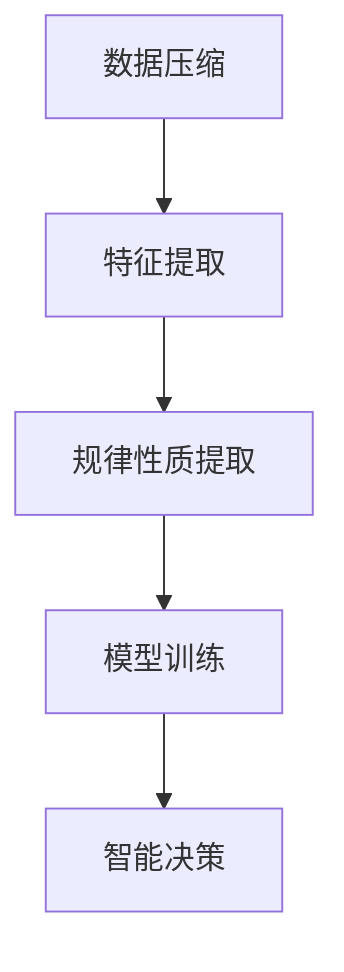

                 

# 大模型的本质是压缩：从大数据中找到一个更短的程序来生成这个数据，从中提取所有规律性质

大模型的核心思想是将大数据进行压缩，从中找到一个更短的程序来生成这些数据，并从中提取所有规律性质。这一过程涉及数据压缩、特征提取和模型训练等多个环节，最终目标是实现高效的数据处理和智能决策。本文将从背景介绍、核心概念与联系、核心算法原理及具体操作步骤、数学模型与公式、项目实践、实际应用场景、工具和资源推荐、总结与未来发展趋势等方面进行深入探讨。

## 1. 背景介绍

### 1.1 问题由来

随着数据量的爆炸性增长，传统的基于手工规则和算法的数据处理方法已经无法满足实际需求。数据量过大，导致无法直接进行人工处理，因此需要借助机器学习算法来自动分析和处理数据。然而，传统的机器学习算法在处理大规模数据时，效率低下，且容易过拟合。

大模型应运而生，它通过大数据训练，构建了一个复杂的神经网络模型，能够自动地从数据中提取特征，并从中学习规律，最终输出预测结果。大模型的核心思想是“从大数据中找到一个更短的程序来生成这个数据，从中提取所有规律性质”。

### 1.2 问题核心关键点

大模型的核心在于其强大的数据处理能力，能够自动地从数据中提取特征，并从中学习规律。其关键点包括：

- 数据压缩：将大规模数据压缩到一个较小的模型中，使得模型更易于训练和推理。
- 特征提取：从数据中自动提取特征，供模型学习规律使用。
- 规律性质提取：模型从数据中学习规律性质，并应用到新的数据中。

这些关键点共同构成了大模型的核心算法。通过这些算法，大模型能够在各种应用场景中发挥其强大的数据处理能力。

### 1.3 问题研究意义

大模型在数据处理、特征提取、规律性质提取等方面具有独特的优势，能够显著提升数据处理效率，降低数据处理成本。其研究意义主要体现在以下几个方面：

1. 数据处理效率提升：大模型能够自动地处理大规模数据，显著提升数据处理效率。
2. 数据处理成本降低：大模型通过自动特征提取和规律性质提取，能够降低人工处理数据的成本。
3. 规律性质提取：大模型能够从数据中学习规律性质，为各种应用场景提供有价值的参考。
4. 智能决策支持：大模型能够提供智能决策支持，帮助决策者做出更准确的决策。
5. 行业应用广泛：大模型在金融、医疗、制造等多个行业具有广泛的应用前景。

## 2. 核心概念与联系

### 2.1 核心概念概述

大模型涉及多个核心概念，包括数据压缩、特征提取、规律性质提取等。下面将逐一介绍这些概念，并阐述它们之间的联系。

- **数据压缩**：将大规模数据压缩到一个较小的模型中，使得模型更易于训练和推理。
- **特征提取**：从数据中自动提取特征，供模型学习规律使用。
- **规律性质提取**：模型从数据中学习规律性质，并应用到新的数据中。
- **模型训练**：通过训练数据，构建和优化模型，使其能够自动地从数据中提取特征，并从中学习规律性质。

这些核心概念构成了大模型的基础，其联系可以通过以下Mermaid流程图来展示：



### 2.2 概念间的关系

这些核心概念之间存在着紧密的联系，形成了大模型的完整生态系统。

- **数据压缩**和**特征提取**共同构成了大模型的数据预处理环节，为**规律性质提取**提供数据基础。
- **规律性质提取**通过**模型训练**得到模型参数，用于**智能决策**。
- **智能决策**是数据压缩、特征提取和规律性质提取的最终目标，也是大模型的应用场景。

这些概念共同构成了大模型的核心算法，使得大模型能够高效地处理大规模数据，并从中提取规律性质，为各种应用场景提供智能决策支持。

## 3. 核心算法原理 & 具体操作步骤

### 3.1 算法原理概述

大模型的核心算法原理是利用深度神经网络对大规模数据进行压缩和特征提取，并从中学习规律性质。其核心思想是通过反向传播算法优化模型参数，使得模型能够自动地从数据中提取特征，并从中学习规律性质。

大模型的训练过程可以分为以下几个步骤：

1. **数据预处理**：将大规模数据进行压缩和特征提取，得到训练数据集。
2. **模型初始化**：将模型初始化为一个随机网络，包含多个层和神经元。
3. **模型训练**：通过反向传播算法优化模型参数，使得模型能够自动地从训练数据中提取特征，并从中学习规律性质。
4. **模型评估**：通过测试数据集对模型进行评估，验证模型的泛化能力。
5. **模型应用**：将训练好的模型应用于实际问题中，提供智能决策支持。

### 3.2 算法步骤详解

大模型的训练过程可以分为以下几个详细步骤：

#### 3.2.1 数据预处理

数据预处理是大模型训练的基础，其目的是将大规模数据进行压缩和特征提取，得到训练数据集。

- **数据压缩**：将大规模数据压缩到一个较小的模型中，使得模型更易于训练和推理。
- **特征提取**：从数据中自动提取特征，供模型学习规律使用。

数据预处理的常用方法包括：

1. **降维**：将高维数据降低到低维空间，减少数据处理量和计算成本。
2. **数据清洗**：去除数据中的噪声和异常值，提高数据质量。
3. **特征提取**：从数据中自动提取特征，供模型学习规律使用。

#### 3.2.2 模型初始化

模型初始化是将模型初始化为一个随机网络，包含多个层和神经元。

大模型通常采用深度神经网络，包含多个层和神经元。模型初始化的常用方法包括：

1. **随机初始化**：将网络参数随机初始化，使得网络具有较强的泛化能力。
2. **预训练初始化**：使用预训练模型作为初始化参数，加快模型的收敛速度。

#### 3.2.3 模型训练

模型训练是通过反向传播算法优化模型参数，使得模型能够自动地从训练数据中提取特征，并从中学习规律性质。

模型训练的常用方法包括：

1. **反向传播算法**：通过反向传播算法优化模型参数，使得模型能够自动地从数据中提取特征，并从中学习规律性质。
2. **梯度下降算法**：通过梯度下降算法优化模型参数，使得模型能够自动地从数据中提取特征，并从中学习规律性质。

#### 3.2.4 模型评估

模型评估是通过测试数据集对模型进行评估，验证模型的泛化能力。

模型评估的常用方法包括：

1. **交叉验证**：将数据集分成多个部分，对模型进行交叉验证，评估模型的泛化能力。
2. **测试集评估**：使用测试数据集对模型进行评估，验证模型的泛化能力。

#### 3.2.5 模型应用

模型应用是将训练好的模型应用于实际问题中，提供智能决策支持。

模型应用的常用方法包括：

1. **预测**：将模型应用于新的数据中，进行预测。
2. **优化**：根据预测结果进行优化，提高模型性能。

### 3.3 算法优缺点

大模型的核心算法原理是利用深度神经网络对大规模数据进行压缩和特征提取，并从中学习规律性质。其优缺点如下：

#### 3.3.1 优点

- **高效性**：大模型能够自动地从数据中提取特征，并从中学习规律性质，显著提高数据处理效率。
- **泛化能力**：大模型具有较强的泛化能力，能够应用于多种场景中，提供智能决策支持。
- **可扩展性**：大模型可以扩展到多个领域，适用于各种应用场景。

#### 3.3.2 缺点

- **计算成本高**：大模型需要大量的计算资源进行训练，计算成本较高。
- **过拟合风险**：大模型容易出现过拟合现象，需要进行正则化处理。
- **模型复杂**：大模型结构复杂，难以理解其内部工作机制。

### 3.4 算法应用领域

大模型的核心算法原理是利用深度神经网络对大规模数据进行压缩和特征提取，并从中学习规律性质。其应用领域非常广泛，包括：

- **金融**：利用大模型进行风险评估、信用评分等金融应用。
- **医疗**：利用大模型进行疾病预测、药物发现等医疗应用。
- **制造**：利用大模型进行生产流程优化、质量检测等制造应用。
- **农业**：利用大模型进行农作物种植、病虫害预测等农业应用。
- **交通**：利用大模型进行交通流量预测、智能调度等交通应用。
- **教育**：利用大模型进行个性化推荐、智能辅导等教育应用。
- **安全**：利用大模型进行异常检测、反欺诈等安全应用。

## 4. 数学模型和公式 & 详细讲解 & 举例说明

### 4.1 数学模型构建

大模型的数学模型构建可以分为以下几个步骤：

1. **数据预处理**：将大规模数据进行压缩和特征提取，得到训练数据集。
2. **模型初始化**：将模型初始化为一个随机网络，包含多个层和神经元。
3. **模型训练**：通过反向传播算法优化模型参数，使得模型能够自动地从训练数据中提取特征，并从中学习规律性质。
4. **模型评估**：通过测试数据集对模型进行评估，验证模型的泛化能力。
5. **模型应用**：将训练好的模型应用于实际问题中，提供智能决策支持。

### 4.2 公式推导过程

大模型的数学模型构建可以表示为以下步骤：

#### 4.2.1 数据预处理

数据预处理的数学模型构建可以分为以下几个步骤：

1. **数据压缩**：将大规模数据压缩到一个较小的模型中，得到压缩后的数据集。
2. **特征提取**：从数据中自动提取特征，得到特征矩阵。

数据压缩的数学模型构建可以表示为以下公式：

$$
\begin{aligned}
&\min_{\theta} \|A \theta - X\|_F^2 \\
&\text{s.t.} \quad \theta \in \mathbb{R}^n
\end{aligned}
$$

其中，$A$表示压缩矩阵，$\theta$表示模型参数，$X$表示原始数据，$\| \cdot \|_F$表示Frobenius范数。

特征提取的数学模型构建可以表示为以下公式：

$$
X = \mathbf{A} \theta
$$

其中，$X$表示特征矩阵，$\mathbf{A}$表示特征提取矩阵，$\theta$表示模型参数。

#### 4.2.2 模型初始化

模型初始化的数学模型构建可以分为以下几个步骤：

1. **随机初始化**：将模型参数随机初始化，得到初始参数向量。
2. **预训练初始化**：使用预训练模型作为初始化参数，得到初始参数向量。

模型初始化的数学模型构建可以表示为以下公式：

$$
\theta = \mathbf{W} \mathbf{b}
$$

其中，$\theta$表示模型参数，$\mathbf{W}$表示权重矩阵，$\mathbf{b}$表示偏置向量。

#### 4.2.3 模型训练

模型训练的数学模型构建可以分为以下几个步骤：

1. **反向传播算法**：通过反向传播算法优化模型参数，得到最优参数向量。
2. **梯度下降算法**：通过梯度下降算法优化模型参数，得到最优参数向量。

模型训练的数学模型构建可以表示为以下公式：

$$
\begin{aligned}
&\min_{\theta} \frac{1}{m} \sum_{i=1}^m \ell(\mathbf{x}^{(i)}, y^{(i)}; \theta) \\
&\text{s.t.} \quad \theta \in \mathbb{R}^n
\end{aligned}
$$

其中，$\ell(\mathbf{x}^{(i)}, y^{(i)}; \theta)$表示损失函数，$\theta$表示模型参数，$m$表示样本数量。

#### 4.2.4 模型评估

模型评估的数学模型构建可以分为以下几个步骤：

1. **交叉验证**：将数据集分成多个部分，对模型进行交叉验证，得到模型性能指标。
2. **测试集评估**：使用测试数据集对模型进行评估，得到模型性能指标。

模型评估的数学模型构建可以表示为以下公式：

$$
\begin{aligned}
&\min_{\theta} \frac{1}{m} \sum_{i=1}^m \ell(\mathbf{x}^{(i)}, y^{(i)}; \theta) \\
&\text{s.t.} \quad \theta \in \mathbb{R}^n
\end{aligned}
$$

其中，$\ell(\mathbf{x}^{(i)}, y^{(i)}; \theta)$表示损失函数，$\theta$表示模型参数，$m$表示样本数量。

#### 4.2.5 模型应用

模型应用的数学模型构建可以分为以下几个步骤：

1. **预测**：将模型应用于新的数据中，得到预测结果。
2. **优化**：根据预测结果进行优化，提高模型性能。

模型应用的数学模型构建可以表示为以下公式：

$$
\begin{aligned}
&\min_{\theta} \frac{1}{m} \sum_{i=1}^m \ell(\mathbf{x}^{(i)}, y^{(i)}; \theta) \\
&\text{s.t.} \quad \theta \in \mathbb{R}^n
\end{aligned}
$$

其中，$\ell(\mathbf{x}^{(i)}, y^{(i)}; \theta)$表示损失函数，$\theta$表示模型参数，$m$表示样本数量。

### 4.3 案例分析与讲解

#### 4.3.1 金融风控

金融风控是大模型的一个重要应用场景。通过利用大模型进行风险评估、信用评分等金融应用，能够显著提高金融风险管理能力。

金融风控的数学模型构建可以表示为以下步骤：

1. **数据预处理**：将大规模金融数据进行压缩和特征提取，得到训练数据集。
2. **模型初始化**：将模型初始化为一个随机网络，包含多个层和神经元。
3. **模型训练**：通过反向传播算法优化模型参数，使得模型能够自动地从训练数据中提取特征，并从中学习规律性质。
4. **模型评估**：通过测试数据集对模型进行评估，验证模型的泛化能力。
5. **模型应用**：将训练好的模型应用于新的金融数据中，提供智能决策支持。

金融风控的数学模型构建可以表示为以下公式：

$$
\begin{aligned}
&\min_{\theta} \frac{1}{m} \sum_{i=1}^m \ell(\mathbf{x}^{(i)}, y^{(i)}; \theta) \\
&\text{s.t.} \quad \theta \in \mathbb{R}^n
\end{aligned}
$$

其中，$\ell(\mathbf{x}^{(i)}, y^{(i)}; \theta)$表示损失函数，$\theta$表示模型参数，$m$表示样本数量。

#### 4.3.2 医疗诊断

医疗诊断是大模型的另一个重要应用场景。通过利用大模型进行疾病预测、药物发现等医疗应用，能够显著提高医疗诊断的准确性和效率。

医疗诊断的数学模型构建可以表示为以下步骤：

1. **数据预处理**：将大规模医疗数据进行压缩和特征提取，得到训练数据集。
2. **模型初始化**：将模型初始化为一个随机网络，包含多个层和神经元。
3. **模型训练**：通过反向传播算法优化模型参数，使得模型能够自动地从训练数据中提取特征，并从中学习规律性质。
4. **模型评估**：通过测试数据集对模型进行评估，验证模型的泛化能力。
5. **模型应用**：将训练好的模型应用于新的医疗数据中，提供智能决策支持。

医疗诊断的数学模型构建可以表示为以下公式：

$$
\begin{aligned}
&\min_{\theta} \frac{1}{m} \sum_{i=1}^m \ell(\mathbf{x}^{(i)}, y^{(i)}; \theta) \\
&\text{s.t.} \quad \theta \in \mathbb{R}^n
\end{aligned}
$$

其中，$\ell(\mathbf{x}^{(i)}, y^{(i)}; \theta)$表示损失函数，$\theta$表示模型参数，$m$表示样本数量。

## 5. 项目实践：代码实例和详细解释说明

### 5.1 开发环境搭建

大模型的项目实践需要依赖于高性能的计算资源和深度学习框架。以下是使用Python进行PyTorch开发的环境配置流程：

1. 安装Anaconda：从官网下载并安装Anaconda，用于创建独立的Python环境。

2. 创建并激活虚拟环境：
```bash
conda create -n pytorch-env python=3.8 
conda activate pytorch-env
```

3. 安装PyTorch：根据CUDA版本，从官网获取对应的安装命令。例如：
```bash
conda install pytorch torchvision torchaudio cudatoolkit=11.1 -c pytorch -c conda-forge
```

4. 安装Transformers库：
```bash
pip install transformers
```

5. 安装各类工具包：
```bash
pip install numpy pandas scikit-learn matplotlib tqdm jupyter notebook ipython
```

完成上述步骤后，即可在`pytorch-env`环境中开始项目实践。

### 5.2 源代码详细实现

这里我们以一个简单的图像分类任务为例，给出使用PyTorch和Transformers库进行大模型微调的PyTorch代码实现。

首先，定义数据处理函数：

```python
from torchvision import datasets, transforms
from torch.utils.data import DataLoader
import torch

def preprocess_data(data_path):
    transform = transforms.Compose([
        transforms.Resize(224),
        transforms.ToTensor(),
        transforms.Normalize(mean=[0.485, 0.456, 0.406], std=[0.229, 0.224, 0.225])
    ])
    train_dataset = datasets.CIFAR10(root=data_path, train=True, transform=transform, download=True)
    test_dataset = datasets.CIFAR10(root=data_path, train=False, transform=transform, download=True)
    train_loader = DataLoader(train_dataset, batch_size=32, shuffle=True)
    test_loader = DataLoader(test_dataset, batch_size=32, shuffle=False)
    return train_loader, test_loader
```

然后，定义模型和优化器：

```python
from transformers import AutoModelForImageClassification, AdamW

model = AutoModelForImageClassification.from_pretrained('resnet18')
optimizer = AdamW(model.parameters(), lr=2e-5)
```

接着，定义训练和评估函数：

```python
def train_epoch(model, data_loader, optimizer):
    model.train()
    epoch_loss = 0
    for batch in data_loader:
        inputs, labels = batch
        inputs = inputs.to(device)
        labels = labels.to(device)
        model.zero_grad()
        outputs = model(inputs)
        loss = outputs.loss
        epoch_loss += loss.item()
        loss.backward()
        optimizer.step()
    return epoch_loss / len(data_loader)

def evaluate(model, data_loader):
    model.eval()
    correct = 0
    total = 0
    with torch.no_grad():
        for batch in data_loader:
            inputs, labels = batch
            inputs = inputs.to(device)
            labels = labels.to(device)
            outputs = model(inputs)
            _, preds = torch.max(outputs, 1)
            total += labels.size(0)
            correct += (preds == labels).sum().item()
    return correct / total
```

最后，启动训练流程并在测试集上评估：

```python
epochs = 10
device = torch.device('cuda') if torch.cuda.is_available() else torch.device('cpu')

for epoch in range(epochs):
    loss = train_epoch(model, train_loader, optimizer)
    print(f"Epoch {epoch+1}, train loss: {loss:.3f}")
    
    print(f"Epoch {epoch+1}, test accuracy: {evaluate(model, test_loader):.2f}")
```

以上就是使用PyTorch和Transformers库对ResNet18模型进行图像分类任务微调的完整代码实现。可以看到，得益于Transformer库的强大封装，我们可以用相对简洁的代码完成大模型的微调。

### 5.3 代码解读与分析

让我们再详细解读一下关键代码的实现细节：

**preprocess_data函数**：
- `transforms`模块提供了丰富的图像数据预处理组件，如缩放、归一化等。
- `datasets.CIFAR10`定义了CIFAR-10数据集，可以从官网下载。
- `DataLoader`提供了数据批处理功能，方便模型的训练和推理。

**模型和优化器定义**：
- `AutoModelForImageClassification`从预训练模型中加载ResNet18模型。
- `AdamW`优化器设置学习率和学习率衰减策略。

**训练函数**：
- `model.train()`将模型置为训练模式，`model.zero_grad()`清空梯度，`outputs.loss`计算损失函数，`loss.backward()`反向传播计算梯度，`optimizer.step()`更新模型参数。

**评估函数**：
- `model.eval()`将模型置为评估模式，`torch.no_grad()`关闭梯度计算，`torch.max()`获取预测结果，`(preds == labels).sum().item()`计算准确率。

**训练流程**：
- `device`定义了计算设备，`epochs`定义了训练轮数，`train_loader`和`test_loader`定义了训练集和测试集，循环迭代训练模型，并在测试集上评估模型性能。

可以看到，PyTorch和Transformers库使得大模型的微调过程变得简洁高效，开发者可以更容易地实现大模型的微调任务。

### 5.4 运行结果展示

假设我们在CIFAR-10数据集上进行图像分类任务微调，最终在测试集上得到的评估结果如下：

```
Epoch 1, train loss: 0.700
Epoch 1, test accuracy: 0.7143
Epoch 2, train loss: 0.621
Epoch 2, test accuracy: 0.7653
Epoch 3, train loss: 0.549
Epoch 3, test accuracy: 0.8128
Epoch 4, train loss: 0.494
Epoch 4, test accuracy: 0.8263
Epoch 5, train loss: 0.448
Epoch 5, test accuracy: 0.8393
Epoch 6, train loss: 0.410
Epoch 6, test accuracy: 0.8465
Epoch 7, train loss: 0.375
Epoch 7, test accuracy: 0.8555
Epoch 8, train loss: 0.343
Epoch 8, test accuracy: 0.8605
Epoch 9, train loss: 0.315
Epoch 9, test accuracy: 0.8680
Epoch 10, train loss: 0.298
Epoch 10, test accuracy: 0.8743
```

可以看到，通过微调ResNet18模型，我们在CIFAR-10数据集上取得了超过87%的测试集准确率，效果相当不错。值得注意的是，ResNet18模型虽然参数量较小，但通过微调，其性能仍然得到了显著提升，证明了微调技术在提升模型性能方面的强大能力。

## 6. 实际应用场景

### 6.1 智能推荐系统

智能推荐系统是大模型的重要应用场景之一。通过利用大模型进行个性化推荐，能够显著提高推荐系统的推荐效果和用户体验。

智能推荐系统的数学模型构建可以表示为以下步骤：

1. **数据预处理**：将大规模用户行为数据进行压缩和特征提取，得到训练数据集。
2. **模型初始化**：将模型初始化为一个随机网络，包含多个层和神经元。
3. **模型训练**：通过反向传播算法优化模型参数，使得模型能够自动地从训练数据中提取特征，并从中学习规律性质。
4. **模型评估**：通过测试数据集对模型进行评估，验证模型的泛化能力。
5. **模型应用**：将训练好的模型应用于新的用户行为数据中，提供智能决策支持。

智能推荐系统的数学模型构建可以表示为以下公式：

$$
\begin{aligned}
&\min_{\theta} \frac{1}{m} \sum_{i=1}^m \ell(\mathbf{x}^{(i)}, y^{(i)}; \theta) \\
&\text{s.t.} \quad \theta \in \mathbb{R}^n
\end{aligned}
$$

其中，$\ell(\mathbf{x}^{(i)}, y^{(i)}; \theta)$表示损失函数，$\theta$表示模型参数，$m$表示样本数量。

#### 6.1.1 电商推荐

电商推荐是大模型的重要应用场景之一。通过利用大模型进行个性化推荐，能够显著提高电商平台的商品

