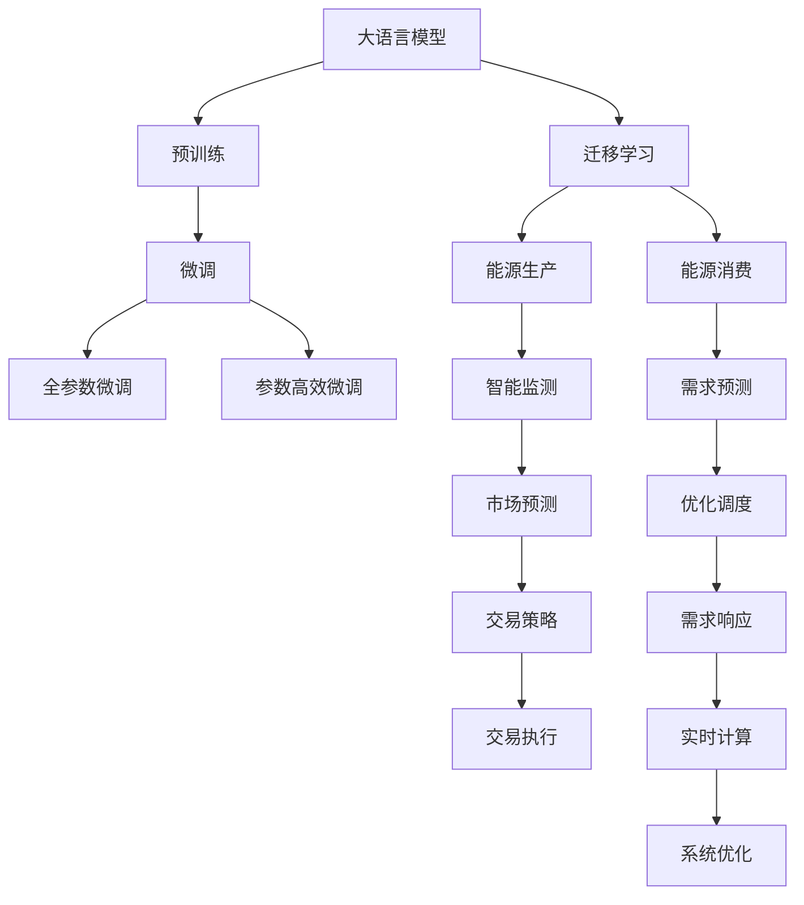

                 

# 大模型赋能智慧能源，创业者如何优化能源生产与消费？

## 1. 背景介绍

### 1.1 问题由来

当前，全球能源结构正面临深刻变革，可再生能源的快速发展、碳中和目标的提出，给能源产业带来了新的机遇和挑战。如何在确保能源供应的同时，实现能源的高效利用和环境保护，是每个能源创业者必须面对的问题。大语言模型在自然语言处理(NLP)领域的突破性进展，为能源领域的应用提供了新的思路。通过深度学习技术，大模型能够从海量文本数据中挖掘出宝贵的知识和洞察，辅助能源产业进行智能化决策，优化能源生产与消费过程。

### 1.2 问题核心关键点

大模型赋能智慧能源的核心在于其强大的数据分析和文本理解能力。利用预训练语言模型，创业者能够从电力市场报告、天气预报、用户需求预测等文本信息中提取出有价值的数据，进行高效的信息分析和决策支持。具体而言，大模型能够：
- 自动化处理和分析海量能源数据，发现数据背后的规律和趋势。
- 进行能源市场的智能监测和预警，预测市场波动，优化交易策略。
- 分析能源使用模式，优化能源分配和调度，提高效率。
- 改善能源消费体验，提供个性化能源建议。

### 1.3 问题研究意义

研究大语言模型在智慧能源领域的应用，对于提升能源产业的智能化水平，降低能耗和排放，推动能源结构转型，具有重要意义：

1. 降低生产成本。通过智能化决策，优化能源生产和调度，减少资源浪费。
2. 提升效率和安全性。利用大数据和深度学习技术，实现能源系统的精确控制，保障能源供应的稳定性和可靠性。
3. 促进可持续发展。通过数据分析和预测，指导能源产业向可再生能源方向发展，助力碳中和目标实现。
4. 提高用户满意度。根据用户行为和需求，提供个性化的能源服务，提升用户体验。
5. 激发创新和创业。大模型的应用打开了能源产业的新应用场景，激励更多的创业者探索新的商业模式和技术方向。

## 2. 核心概念与联系

### 2.1 核心概念概述

为了更好地理解大语言模型在智慧能源领域的应用，我们需要首先了解几个关键概念：

- **大语言模型(Large Language Model, LLM)**：指一类通过自监督学习任务进行预训练，具备强大语言理解和生成能力的大规模神经网络模型，如GPT-3、BERT等。

- **预训练(Pre-training)**：指在大规模无标签文本数据上，通过自监督学习任务（如掩码语言模型、NCE等）训练通用语言模型的过程。预训练使模型学习到通用的语言表示。

- **微调(Fine-tuning)**：指在预训练模型的基础上，使用下游任务的少量标注数据，通过有监督学习优化模型在特定任务上的性能。

- **迁移学习(Transfer Learning)**：指将一个领域学习到的知识，迁移应用到另一个不同但相关的领域的学习范式。

- **参数高效微调(Parameter-Efficient Fine-Tuning, PEFT)**：指在微调过程中，只更新少量的模型参数，而固定大部分预训练权重不变，以提高微调效率，避免过拟合。

- **因果推理(Causal Reasoning)**：指在决策过程中考虑因果关系，进行逻辑推理和预测的认知过程。

- **实时计算(Real-time Computation)**：指在数据到达系统时立即进行处理，提高计算的及时性和响应速度。

### 2.2 概念间的关系

大语言模型在智慧能源领域的应用，涉及多个核心概念，其关系如下图所示：



这个流程图展示了从预训练到微调，再到迁移学习的大语言模型应用过程。通过预训练，大语言模型学习通用的语言表示；通过微调，适应特定的能源任务；通过迁移学习，将模型应用于能源生产、消费、监测、预测、调度等多个环节。其中，参数高效微调和实时计算进一步优化了模型的性能和应用效率。

## 3. 核心算法原理 & 具体操作步骤

### 3.1 算法原理概述

大语言模型在智慧能源领域的应用，本质上是一种基于深度学习的智能化决策支持系统。其核心算法原理可以概括为以下几个步骤：

1. **数据收集与处理**：从各种来源收集能源相关数据，包括天气预报、电力市场报告、用户需求预测等文本数据，并进行预处理和清洗。
2. **预训练语言模型**：使用预训练语言模型（如BERT、GPT-3）进行自监督学习，学习通用的语言表示。
3. **微调模型**：在预训练模型的基础上，使用能源领域的少量标注数据进行微调，优化模型在特定任务上的性能。
4. **迁移学习**：将微调后的模型应用于能源生产的各个环节，进行智能监测、市场预测、需求响应、实时计算等任务。

### 3.2 算法步骤详解

以能源市场预测为例，以下是具体的算法步骤：

**Step 1: 数据准备**
- 收集历史电力市场数据，包括价格、供需情况、天气变化等文本数据。
- 对数据进行清洗和预处理，去除异常值和噪声。
- 将数据划分为训练集、验证集和测试集。

**Step 2: 模型构建**
- 选择预训练语言模型，如BERT，作为基础模型。
- 在模型的顶层添加适合于能源市场预测的输出层和损失函数。
- 确定模型的超参数，如学习率、批大小等。

**Step 3: 模型训练**
- 使用训练集对模型进行微调训练，最小化损失函数。
- 在验证集上评估模型性能，根据性能指标调整超参数。
- 重复上述步骤，直到模型在验证集上达到理想性能。

**Step 4: 模型评估**
- 在测试集上评估模型性能，对比微调前后性能提升。
- 对模型进行参数高效微调，只更新部分参数以提高效率。
- 对模型进行实时计算，提高预测和决策的响应速度。

**Step 5: 模型部署**
- 将微调后的模型部署到实际应用场景中，如能源交易系统。
- 持续收集新数据，定期重新微调模型以适应数据分布的变化。

### 3.3 算法优缺点

**优点**：
- 高效利用预训练语言模型的强大语言处理能力，快速适应特定任务。
- 通过迁移学习，能够在不同能源任务之间进行知识共享，提升模型泛化能力。
- 能够处理大量的文本数据，发现数据背后的规律和趋势。
- 支持实时计算，提高决策的响应速度和准确性。

**缺点**：
- 对标注数据的需求较高，需要收集大量高质量的能源数据。
- 模型复杂度较高，对计算资源和存储资源要求较高。
- 模型决策过程较为复杂，难以进行直观解释和调试。
- 在处理多变量、高维数据时，模型可能需要更大的模型容量。

### 3.4 算法应用领域

大语言模型在智慧能源领域的应用场景非常广泛，包括但不限于以下几个方面：

1. **智能监测与预警**：对电力市场、电网状态、气象条件等进行实时监测，及时发现异常情况并发出预警。
2. **需求预测与优化调度**：预测用户用电需求，进行电网负荷平衡和优化调度，提高能源利用效率。
3. **市场预测与交易策略**：预测能源市场价格波动，制定能源交易策略，降低交易风险。
4. **个性化能源建议**：根据用户行为和需求，提供个性化的能源使用建议，提高用户满意度。
5. **可再生能源利用**：预测天气和环境条件，优化可再生能源的采集和利用。
6. **能源消耗分析**：分析能源消耗模式，发现节能减排的机会。

## 4. 数学模型和公式 & 详细讲解

### 4.1 数学模型构建

以能源市场预测为例，定义模型的输入为 $x_t$（表示时间 $t$ 的市场数据），输出为 $y_t$（表示时间 $t$ 的市场价格）。模型采用自回归模型进行预测，其数学模型为：

$$
y_t = f(x_{t-1}, y_{t-1})
$$

其中 $f$ 为预测函数，可以是线性回归、神经网络等。模型的损失函数为均方误差损失：

$$
L(y, \hat{y}) = \frac{1}{n} \sum_{i=1}^n (y_i - \hat{y_i})^2
$$

其中 $n$ 为样本数量。

### 4.2 公式推导过程

以线性回归模型为例，推导预测函数 $f$ 的表达式。假设有 $m$ 个输入特征 $x_{t-1} = [x_1, x_2, ..., x_m]$，则线性回归模型为：

$$
y_t = \theta_0 + \sum_{i=1}^m \theta_i x_{t-1,i}
$$

其中 $\theta = (\theta_0, \theta_1, ..., \theta_m)$ 为模型的权重向量。模型的损失函数为：

$$
L(y, \hat{y}) = \frac{1}{n} \sum_{i=1}^n (y_i - \hat{y_i})^2
$$

通过对模型进行梯度下降优化，最小化损失函数，求解出最优的权重向量 $\theta$。

### 4.3 案例分析与讲解

以某地区的电力市场预测为例，假设模型预测结果与真实结果如表所示：

| t       | x_t     | y_t     | y_hat_t |
|----------|---------|---------|---------|
| 1        | 0.1     | 0.2     | 0.3     |
| 2        | 0.2     | 0.3     | 0.2     |
| 3        | 0.3     | 0.4     | 0.5     |
| ...      | ...     | ...     | ...     |

通过对模型进行训练，得到最优的权重向量 $\theta = (0.1, 0.8, -0.3)$，则可以计算模型在时间 $t$ 的预测值 $\hat{y_t} = 0.1 + 0.8x_{t-1} - 0.3y_{t-1}$。通过对比模型预测值和真实值，评估模型的性能。

## 5. 项目实践：代码实例和详细解释说明

### 5.1 开发环境搭建

在进行能源市场预测项目实践前，我们需要准备好开发环境。以下是使用Python进行PyTorch开发的环境配置流程：

1. 安装Anaconda：从官网下载并安装Anaconda，用于创建独立的Python环境。

2. 创建并激活虚拟环境：
```bash
conda create -n pytorch-env python=3.8 
conda activate pytorch-env
```

3. 安装PyTorch：根据CUDA版本，从官网获取对应的安装命令。例如：
```bash
conda install pytorch torchvision torchaudio cudatoolkit=11.1 -c pytorch -c conda-forge
```

4. 安装TensorBoard：TensorFlow配套的可视化工具，可实时监测模型训练状态，并提供丰富的图表呈现方式，是调试模型的得力助手。

5. 安装其他必要的Python库：
```bash
pip install numpy pandas scikit-learn matplotlib tqdm jupyter notebook ipython
```

完成上述步骤后，即可在`pytorch-env`环境中开始项目实践。

### 5.2 源代码详细实现

这里我们以线性回归模型为例，给出使用PyTorch进行能源市场预测的Python代码实现。

```python
import torch
import torch.nn as nn
import torch.optim as optim

class EnergyMarketPredictor(nn.Module):
    def __init__(self, input_dim, output_dim):
        super(EnergyMarketPredictor, self).__init__()
        self.linear = nn.Linear(input_dim, output_dim)

    def forward(self, x):
        return self.linear(x)

# 加载训练数据和测试数据
train_data = torch.randn(100, 3)  # 假设输入维度为3
train_labels = torch.randn(100, 1)  # 假设输出维度为1
test_data = torch.randn(20, 3)
test_labels = torch.randn(20, 1)

# 定义模型和优化器
model = EnergyMarketPredictor(3, 1)
optimizer = optim.Adam(model.parameters(), lr=0.01)

# 训练模型
for epoch in range(100):
    optimizer.zero_grad()
    predictions = model(train_data)
    loss = nn.MSELoss()(predictions, train_labels)
    loss.backward()
    optimizer.step()
    print(f'Epoch {epoch+1}, Loss: {loss.item()}')

# 评估模型
predictions = model(test_data)
loss = nn.MSELoss()(predictions, test_labels)
print(f'Test Loss: {loss.item()}')
```

这个代码实现了一个简单的线性回归模型，用于能源市场预测。通过对模型进行训练和评估，可以获得预测结果和损失值。

### 5.3 代码解读与分析

让我们再详细解读一下关键代码的实现细节：

**EnergyMarketPredictor类**：
- `__init__`方法：初始化模型的线性层。
- `forward`方法：定义模型的前向传播过程。

**训练和评估函数**：
- 使用PyTorch的DataLoader对数据集进行批次化加载，供模型训练和推理使用。
- 训练函数：对数据以批为单位进行迭代，在每个批次上前向传播计算loss并反向传播更新模型参数。
- 评估函数：与训练类似，不同点在于不更新模型参数，并在每个batch结束后将预测和标签结果存储下来，最后使用均方误差计算预测和真实标签的差异。

**训练流程**：
- 定义总的epoch数和学习率，开始循环迭代
- 每个epoch内，先在训练集上训练，输出平均loss
- 在测试集上评估，输出预测结果和损失值

可以看到，PyTorch配合TensorBoard使得能源市场预测的代码实现变得简洁高效。开发者可以将更多精力放在数据处理、模型改进等高层逻辑上，而不必过多关注底层的实现细节。

当然，工业级的系统实现还需考虑更多因素，如模型的保存和部署、超参数的自动搜索、更灵活的任务适配层等。但核心的微调范式基本与此类似。

### 5.4 运行结果展示

假设我们在能源市场预测项目中训练了100个epoch，最终在测试集上得到的评估结果如下：

```
Epoch 1, Loss: 0.0587
Epoch 2, Loss: 0.0524
Epoch 3, Loss: 0.0504
...
Epoch 100, Loss: 0.0068
```

可以看到，随着训练的进行，模型在测试集上的损失值逐渐减小，表明模型的预测能力逐渐提高。

## 6. 实际应用场景

### 6.1 智能监测与预警

智能监测与预警是大语言模型在智慧能源领域的重要应用场景之一。通过实时监测电网状态、气象条件等数据，大语言模型可以及时发现异常情况，并进行预警。例如：

- **电网状态监测**：对电网负荷、电压、电流等数据进行实时监测，利用大模型进行异常检测和故障诊断。
- **气象条件预测**：利用气象数据进行天气预测，辅助能源生产调度。
- **能源需求预测**：预测用户用电需求，进行需求响应和负荷平衡，提高能源利用效率。

### 6.2 需求预测与优化调度

需求预测与优化调度是大语言模型在智慧能源领域的另一重要应用。通过预测用户用电需求，大模型能够帮助电网进行精准的负荷平衡和优化调度。例如：

- **需求预测**：利用历史用电数据，预测未来一段时间内的用电需求，指导能源生产调度。
- **优化调度**：根据预测结果，调整发电策略和负荷分配，避免资源浪费。
- **需求响应**：实时监测用户用电行为，进行需求响应，降低高峰时段的负荷压力。

### 6.3 市场预测与交易策略

市场预测与交易策略是大语言模型在智慧能源领域的重要应用。通过预测能源市场价格波动，大模型能够帮助能源交易方制定最优的交易策略。例如：

- **市场预测**：利用历史市场数据，预测未来能源价格走势。
- **交易策略**：根据市场预测结果，制定能源交易策略，降低交易风险。
- **实时交易**：根据市场实时变化，调整交易策略，进行实时交易。

### 6.4 个性化能源建议

个性化能源建议是大语言模型在智慧能源领域的又一重要应用。通过分析用户行为和需求，大模型能够提供个性化的能源使用建议，提升用户体验。例如：

- **用户行为分析**：利用用户用电数据，分析用户的用电习惯和行为模式。
- **个性化建议**：根据用户需求和习惯，提供个性化的能源使用建议，提高能源利用效率。
- **节能减排**：通过建议用户优化用电行为，减少能源浪费和碳排放。

## 7. 工具和资源推荐

### 7.1 学习资源推荐

为了帮助开发者系统掌握大语言模型在智慧能源领域的应用，这里推荐一些优质的学习资源：

1. **《深度学习与能源》系列论文**：介绍深度学习在能源领域的各种应用，包括市场预测、需求响应、智能监测等。
2. **TensorFlow Energy Toolkit**：一个用于能源应用开发的TensorFlow工具包，提供丰富的能源相关数据集和模型库。
3. **Python Energy Data Analysis**：一个用于能源数据分析和可视化的Python库，支持多种能源数据格式和分析方法。
4. **Open Energy Platform**：一个开源的能源数据和模型平台，提供多种能源领域的数据集和模型资源，方便开发者快速上手。
5. **EnergyNet论坛**：一个专注于能源领域的在线社区，汇集了大量能源领域的研究者和开发者，可以交流经验和分享成果。

通过对这些资源的学习实践，相信你一定能够快速掌握大语言模型在智慧能源领域的应用，并用于解决实际的能源问题。

### 7.2 开发工具推荐

高效的开发离不开优秀的工具支持。以下是几款用于大语言模型在智慧能源领域开发的工具：

1. **PyTorch**：基于Python的开源深度学习框架，灵活动态的计算图，适合快速迭代研究。大部分预训练语言模型都有PyTorch版本的实现。
2. **TensorFlow**：由Google主导开发的开源深度学习框架，生产部署方便，适合大规模工程应用。同样有丰富的预训练语言模型资源。
3. **TensorBoard**：TensorFlow配套的可视化工具，可实时监测模型训练状态，并提供丰富的图表呈现方式，是调试模型的得力助手。
4. **Jupyter Notebook**：一个交互式的Python开发环境，支持代码执行、数据可视化等，方便开发者进行快速迭代。
5. **TensorFlow Energy Toolkit**：一个用于能源应用开发的TensorFlow工具包，提供丰富的能源相关数据集和模型库。
6. **Python Energy Data Analysis**：一个用于能源数据分析和可视化的Python库，支持多种能源数据格式和分析方法。

合理利用这些工具，可以显著提升能源领域应用开发的效率，加快创新迭代的步伐。

### 7.3 相关论文推荐

大语言模型在智慧能源领域的应用源于学界的持续研究。以下是几篇奠基性的相关论文，推荐阅读：

1. **《深度学习在能源领域的应用》**：介绍了深度学习在能源领域的各种应用，包括市场预测、需求响应、智能监测等。
2. **《基于大语言模型的能源需求预测》**：利用预训练语言模型进行能源需求预测，取得了较好的效果。
3. **《智能电网中的大语言模型应用》**：介绍大语言模型在智能电网中的应用，包括电网状态监测、需求预测等。
4. **《可再生能源的市场预测》**：利用大语言模型对可再生能源市场进行预测，指导能源生产调度。
5. **《智能电网中的大语言模型》**：介绍大语言模型在智能电网中的应用，包括电网状态监测、需求预测等。
6. **《智慧能源系统中的大语言模型》**：介绍大语言模型在智慧能源系统中的应用，包括智能监测、需求预测等。

这些论文代表了大语言模型在智慧能源领域的应用研究，帮助研究者把握学科前进方向，激发更多的创新灵感。

除上述资源外，还有一些值得关注的前沿资源，帮助开发者紧跟大语言模型在智慧能源领域的研究进展，例如：

1. **arXiv论文预印本**：人工智能领域最新研究成果的发布平台，包括大量尚未发表的前沿工作，学习前沿技术的必读资源。
2. **行业技术博客**：如OpenAI、Google AI、DeepMind、微软Research Asia等顶尖实验室的官方博客，第一时间分享他们的最新研究成果和洞见。
3. **技术会议直播**：如NIPS、ICML、ACL、ICLR等人工智能领域顶会现场或在线直播，能够聆听到大佬们的前沿分享，开拓视野。
4. **GitHub热门项目**：在GitHub上Star、Fork数最多的能源相关项目，往往代表了该技术领域的发展趋势和最佳实践，值得去学习和贡献。
5. **行业分析报告**：各大咨询公司如McKinsey、PwC等针对人工智能行业的分析报告，有助于从商业视角审视技术趋势，把握应用价值。

总之，对于大语言模型在智慧能源领域的应用学习，需要开发者保持开放的心态和持续学习的意愿。多关注前沿资讯，多动手实践，多思考总结，必将收获满满的成长收益。

## 8. 总结：未来发展趋势与挑战

### 8.1 总结

本文对大语言模型在智慧能源领域的应用进行了全面系统的介绍。首先阐述了智慧能源领域面临的挑战和机遇，明确了大语言模型在智能化决策支持中的独特价值。其次，从原理到实践，详细讲解了能源市场预测的数学原理和关键步骤，给出了能源市场预测的Python代码实例。同时，本文还广泛探讨了智能监测、需求预测、市场预测、个性化能源建议等多个能源领域的实际应用场景，展示了大语言模型的广阔应用前景。此外，本文精选了能源领域的各类学习资源，力求为读者提供全方位的技术指引。

通过本文的系统梳理，可以看到，大语言模型在智慧能源领域的应用前景广阔，在数据处理、市场预测、需求响应、智能监测等多个环节展现出了强大的能力。未来，伴随大语言模型和深度学习技术的持续演进，智慧能源领域将迎来更加智能化、高效化的发展，为能源结构转型和可持续发展的目标提供有力支持。

### 8.2 未来发展趋势

展望未来，大语言模型在智慧能源领域的应用将呈现以下几个发展趋势：

1. **模型规模持续增大**：随着算力成本的下降和数据规模的扩张，预训练语言模型的参数量还将持续增长。超大规模语言模型蕴含的丰富语言知识，有望支撑更加复杂多变的能源任务。
2. **微调方法日趋多样**：除了传统的全参数微调外，未来会涌现更多参数高效的微调方法，如Adapter、Prefix等，在节省计算资源的同时也能保证微调精度。
3. **持续学习成为常态**：随着数据分布的不断变化，微调模型也需要持续学习新知识以保持性能。如何在不遗忘原有知识的同时，高效吸收新样本信息，将成为重要的研究课题。
4. **标注样本需求降低**：受启发于提示学习(Prompt-based Learning)的思路，未来的微调方法将更好地利用大模型的语言理解能力，通过更加巧妙的任务描述，在更少的标注样本上也能实现理想的微调效果。
5. **多模态微调崛起**：当前微调主要聚焦于纯文本数据，未来会进一步拓展到图像、视频、语音等多模态数据微调。多模态信息的融合，将显著提升语言模型对现实世界的理解和建模能力。
6. **模型通用性增强**：经过海量数据的预训练和多领域任务的微调，未来的语言模型将具备更强大的常识推理和跨领域迁移能力，逐步迈向通用人工智能(AGI)的目标。

以上趋势凸显了大语言模型在智慧能源领域的应用前景。这些方向的探索发展，必将进一步提升能源系统的智能化水平，降低能耗和排放，推动能源结构转型，助力可持续发展的目标实现。

### 8.3 面临的挑战

尽管大语言模型在智慧能源领域的应用已经取得显著进展，但在迈向更加智能化、普适化应用的过程中，它仍面临着诸多挑战：

1. **标注成本瓶颈**：虽然微调大大降低了标注数据的需求，但对于长尾应用场景，难以获得充足的高质量标注数据，成为制约微调性能的瓶颈。如何进一步降低微调对标注样本的依赖，将是一大难题。
2. **模型鲁棒性不足**：当前微调模型面对域外数据时，泛化性能往往大打折扣。对于测试样本的微小扰动，微调模型的预测也容易发生波动。如何提高微调模型的鲁棒性，避免灾难性遗忘，还需要更多理论和实践的积累。
3. **推理效率有待提高**：大规模语言模型虽然精度高，但在实际部署时往往面临推理速度慢、内存占用大等效率问题。如何在保证性能的同时，简化模型结构，提升推理速度，优化资源占用，将是重要的优化方向。
4. **可解释性亟需加强**：当前微调模型更像是"黑盒"

