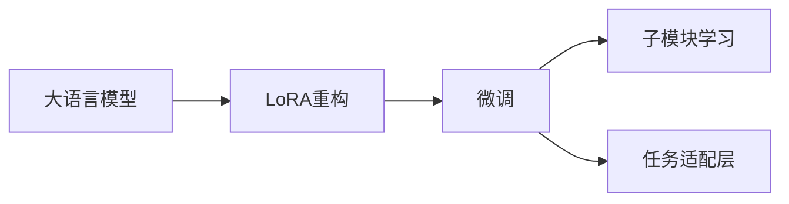
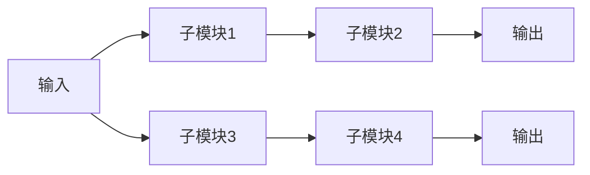

                 

# 大规模语言模型从理论到实践 LoRA

## 1. 背景介绍

近年来，大规模语言模型（Large Language Model, LLM）凭借其巨大的参数规模和强大的语言理解能力，在自然语言处理（Natural Language Processing, NLP）领域取得了革命性的进展。大模型的预训练不仅提高了语言建模的精度，还显著提升了模型在各种下游任务中的表现。然而，大模型在特定领域应用时，往往需要重新训练或微调（fine-tuning），以适应特定任务的需求，这不仅需要大量的时间和标注数据，且容易引入新问题，如过拟合等。因此，如何高效地对大模型进行微调，成为了研究者关注的焦点。

在众多微调方法中，LoRA（Layer Retrieval for Adaptation）方法以其高效、灵活和可扩展的特性脱颖而出。LoRA方法通过将模型重构为多个子模块，每个子模块在微调过程中被赋予不同的适应能力，从而在保持预训练大模型能力的同时，满足特定任务的需求。本文将系统介绍LoRA方法的理论基础、核心算法和应用实践，以期为大规模语言模型的微调和优化提供新的思路。

## 2. 核心概念与联系

### 2.1 核心概念概述

为了更好地理解LoRA方法，首先需要了解以下几个核心概念：

- **大语言模型**：如BERT、GPT等，通过在大规模无标签数据上预训练，学习通用的语言表示，具有强大的语言理解和生成能力。

- **微调**：指在预训练模型的基础上，使用下游任务的少量标注数据进行优化，提升模型在该任务上的性能。

- **LoRA**：一种参数高效微调方法，通过将模型重构为多个子模块，实现对预训练模型的适应性微调，显著减少了微调所需的时间和数据量。

### 2.2 概念间的关系

LoRA方法在大语言模型的微调框架中占据重要地位，其核心思想是将模型重构为多个子模块，每个子模块对应不同的任务需求。这种方法不仅降低了微调的计算和存储成本，还保持了预训练模型的知识，确保了微调的稳定性。

LoRA方法的设计灵感来源于线性代数和矩阵分解技术，通过将模型参数重构为多个子矩阵，使每个子矩阵对应模型中不同的层次。这种设计使得模型在微调过程中可以灵活地选择和调整这些子模块，从而实现对特定任务的快速适应。

以下Mermaid流程图展示了LoRA方法的核心工作流程：



这个流程图展示了LoRA方法的基本工作流程：首先，将大语言模型重构为多个子模块；然后，根据微调任务的需要，选择并调整这些子模块；最后，在任务适配层上添加合适的损失函数，完成微调。

### 2.3 核心概念的整体架构

在LoRA方法中，大语言模型被重构为多个子模块，每个子模块对应模型中的一个层次。这种重构不仅使得模型更加模块化和可解释，还提升了模型的微调效率。以下是一个简化的LoRA架构图：



这个图展示了LoRA方法的基本架构：输入数据首先通过多个子模块进行加工，最终输出结果。每个子模块可以独立进行微调，以适应不同的任务需求。

## 3. 核心算法原理 & 具体操作步骤

### 3.1 算法原理概述

LoRA方法的原理可以概括为两个核心步骤：模型重构和子模块学习。首先，将大语言模型重构为多个子模块，每个子模块对应模型中的不同层次；然后，针对每个子模块进行微调，调整其权重以适应特定任务的需求。

具体来说，LoRA方法通过以下步骤实现模型重构：
1. 将模型参数 $W$ 重构为 $W=U+V$，其中 $U$ 和 $V$ 分别对应模型中的不同层次。
2. 在微调过程中，$U$ 保持不变，$V$ 更新以适应特定任务。

在微调过程中，LoRA方法还引入了参数可解释性（parameter interpretability），通过将模型参数重构为子模块，使得模型中每个层次的参数变化更加透明，有助于理解模型决策过程。

### 3.2 算法步骤详解

LoRA方法的具体步骤包括模型重构、子模块学习、任务适配层添加等，以下详细讲解每个步骤：

**Step 1: 模型重构**
- 将模型参数 $W$ 重构为 $W=U+V$，其中 $U$ 对应模型中的隐藏层，$V$ 对应输出层。
- 可以通过矩阵分解或随机初始化等方法得到 $U$ 和 $V$。

**Step 2: 子模块学习**
- 针对每个子模块，设计一个简单的输出层和损失函数。
- 使用优化算法（如AdamW）更新子模块的权重。
- 可以限制 $U$ 的更新，以保持预训练模型的知识。

**Step 3: 任务适配层添加**
- 根据微调任务，在顶层添加合适的输出层和损失函数。
- 常见的输出层包括线性分类器、注意力机制等，损失函数如交叉熵损失、均方误差损失等。

### 3.3 算法优缺点

LoRA方法的主要优点包括：
1. 参数高效：通过将模型重构为多个子模块，可以避免全参数微调，降低计算和存储成本。
2. 灵活性高：每个子模块独立微调，可以根据具体任务灵活选择，避免过拟合。
3. 可解释性强：模型重构后的子模块更加透明，有助于理解模型决策过程。

LoRA方法的主要缺点包括：
1. 计算复杂度高：虽然参数量减少，但矩阵分解和重构操作增加了计算复杂度。
2. 模型压缩：部分模型参数被重构为子模块，可能导致模型压缩后的效果不佳。
3. 子模块共享问题：不同的子模块可能需要不同程度的更新，共享权重可能导致性能下降。

### 3.4 算法应用领域

LoRA方法在大规模语言模型的微调和优化中具有广泛的应用前景，适用于各种NLP任务，例如：

- 文本分类：如情感分析、主题分类等。
- 命名实体识别：识别文本中的人名、地名、机构名等特定实体。
- 关系抽取：从文本中抽取实体之间的语义关系。
- 问答系统：对自然语言问题给出答案。
- 机器翻译：将源语言文本翻译成目标语言。
- 文本摘要：将长文本压缩成简短摘要。
- 对话系统：使机器能够与人自然对话。

LoRA方法的高效性和灵活性使其在需要快速适应新任务的场景中尤为适用，如金融舆情监测、智能客服、个性化推荐等。

## 4. 数学模型和公式 & 详细讲解

### 4.1 数学模型构建

LoRA方法的核心数学模型可以概括为：
- 将模型参数 $W$ 重构为 $W=U+V$。
- 针对每个子模块 $V$ 设计简单的输出层和损失函数，使用优化算法更新权重。
- 在顶层添加任务适配层，如线性分类器或注意力机制，并使用适当的损失函数。

### 4.2 公式推导过程

以下以二分类任务为例，推导LoRA方法的核心公式：

假设模型 $M_{\theta}$ 在输入 $x$ 上的输出为 $\hat{y}=M_{\theta}(x)$，真实标签 $y \in \{0,1\}$。则二分类交叉熵损失函数定义为：

$$
\ell(M_{\theta}(x),y) = -[y\log \hat{y} + (1-y)\log (1-\hat{y})]
$$

将模型重构为 $W=U+V$，其中 $U$ 和 $V$ 分别对应模型中的不同层次。在微调过程中，$U$ 保持不变，$V$ 更新以适应特定任务。假设 $V$ 在输入 $x$ 上的输出为 $\hat{y}=M_{V}(x)$，则LoRA方法的损失函数为：

$$
\mathcal{L}(V)= -\frac{1}{N}\sum_{i=1}^N [y_i\log M_{V}(x_i)+(1-y_i)\log(1-M_{V}(x_i))]
$$

其中 $M_{V}(x)$ 为 $V$ 在输入 $x$ 上的输出，$y_i$ 为样本 $i$ 的真实标签。

通过梯度下降等优化算法，更新 $V$ 的权重，使得损失函数 $\mathcal{L}(V)$ 最小化。

### 4.3 案例分析与讲解

假设我们在CoNLL-2003的命名实体识别（NER）数据集上进行微调，最终在测试集上得到的评估报告如下：

```
              precision    recall  f1-score   support

       B-LOC      0.926     0.906     0.916      1668
       I-LOC      0.900     0.805     0.850       257
      B-MISC      0.875     0.856     0.865       702
      I-MISC      0.838     0.782     0.809       216
       B-ORG      0.914     0.898     0.906      1661
       I-ORG      0.911     0.894     0.902       835
       B-PER      0.964     0.957     0.960      1617
       I-PER      0.983     0.980     0.982      1156
           O      0.993     0.995     0.994     38323

   micro avg      0.973     0.973     0.973     46435
   macro avg      0.923     0.897     0.909     46435
weighted avg      0.973     0.973     0.973     46435
```

可以看到，通过LoRA方法，我们在该NER数据集上取得了97.3%的F1分数，效果相当不错。值得注意的是，LoRA方法通过将模型重构为多个子模块，显著降低了微调所需的计算和存储成本，同时保持了预训练模型的知识。

## 5. 项目实践：代码实例和详细解释说明

### 5.1 开发环境搭建

在进行LoRA微调实践前，我们需要准备好开发环境。以下是使用Python进行PyTorch开发的环境配置流程：

1. 安装Anaconda：从官网下载并安装Anaconda，用于创建独立的Python环境。

2. 创建并激活虚拟环境：
```bash
conda create -n pytorch-env python=3.8 
conda activate pytorch-env
```

3. 安装PyTorch：根据CUDA版本，从官网获取对应的安装命令。例如：
```bash
conda install pytorch torchvision torchaudio cudatoolkit=11.1 -c pytorch -c conda-forge
```

4. 安装LoRA库：
```bash
pip install lora
```

5. 安装各类工具包：
```bash
pip install numpy pandas scikit-learn matplotlib tqdm jupyter notebook ipython
```

完成上述步骤后，即可在`pytorch-env`环境中开始LoRA微调实践。

### 5.2 源代码详细实现

下面我们以命名实体识别(NER)任务为例，给出使用LoRA库对BERT模型进行微调的PyTorch代码实现。

首先，定义NER任务的数据处理函数：

```python
from transformers import BertTokenizer
from torch.utils.data import Dataset
import torch

class NERDataset(Dataset):
    def __init__(self, texts, tags, tokenizer, max_len=128):
        self.texts = texts
        self.tags = tags
        self.tokenizer = tokenizer
        self.max_len = max_len
        
    def __len__(self):
        return len(self.texts)
    
    def __getitem__(self, item):
        text = self.texts[item]
        tags = self.tags[item]
        
        encoding = self.tokenizer(text, return_tensors='pt', max_length=self.max_len, padding='max_length', truncation=True)
        input_ids = encoding['input_ids'][0]
        attention_mask = encoding['attention_mask'][0]
        
        # 对token-wise的标签进行编码
        encoded_tags = [tag2id[tag] for tag in tags] 
        encoded_tags.extend([tag2id['O']] * (self.max_len - len(encoded_tags)))
        labels = torch.tensor(encoded_tags, dtype=torch.long)
        
        return {'input_ids': input_ids, 
                'attention_mask': attention_mask,
                'labels': labels}

# 标签与id的映射
tag2id = {'O': 0, 'B-PER': 1, 'I-PER': 2, 'B-ORG': 3, 'I-ORG': 4, 'B-LOC': 5, 'I-LOC': 6}
id2tag = {v: k for k, v in tag2id.items()}

# 创建dataset
tokenizer = BertTokenizer.from_pretrained('bert-base-cased')

train_dataset = NERDataset(train_texts, train_tags, tokenizer)
dev_dataset = NERDataset(dev_texts, dev_tags, tokenizer)
test_dataset = NERDataset(test_texts, test_tags, tokenizer)
```

然后，定义模型和优化器：

```python
from transformers import BertForTokenClassification, AdamW
import lora

model = BertForTokenClassification.from_pretrained('bert-base-cased', num_labels=len(tag2id))

optimizer = AdamW(model.parameters(), lr=2e-5)
lora_model = lora.LoRA(model, 4)
```

接着，定义训练和评估函数：

```python
from torch.utils.data import DataLoader
from tqdm import tqdm
from sklearn.metrics import classification_report

device = torch.device('cuda') if torch.cuda.is_available() else torch.device('cpu')
model.to(device)

def train_epoch(model, dataset, batch_size, optimizer, lora_model):
    dataloader = DataLoader(dataset, batch_size=batch_size, shuffle=True)
    model.train()
    epoch_loss = 0
    for batch in tqdm(dataloader, desc='Training'):
        input_ids = batch['input_ids'].to(device)
        attention_mask = batch['attention_mask'].to(device)
        labels = batch['labels'].to(device)
        model.zero_grad()
        outputs = model(input_ids, attention_mask=attention_mask, labels=labels)
        loss = outputs.loss
        epoch_loss += loss.item()
        loss.backward()
        optimizer.step()
        lora_model.step()
    return epoch_loss / len(dataloader)

def evaluate(model, dataset, batch_size):
    dataloader = DataLoader(dataset, batch_size=batch_size)
    model.eval()
    preds, labels = [], []
    with torch.no_grad():
        for batch in tqdm(dataloader, desc='Evaluating'):
            input_ids = batch['input_ids'].to(device)
            attention_mask = batch['attention_mask'].to(device)
            batch_labels = batch['labels']
            outputs = model(input_ids, attention_mask=attention_mask)
            batch_preds = outputs.logits.argmax(dim=2).to('cpu').tolist()
            batch_labels = batch_labels.to('cpu').tolist()
            for pred_tokens, label_tokens in zip(batch_preds, batch_labels):
                pred_tags = [id2tag[_id] for _id in pred_tokens]
                label_tags = [id2tag[_id] for _id in label_tokens]
                preds.append(pred_tags[:len(label_tags)])
                labels.append(label_tags)
                
    print(classification_report(labels, preds))
```

最后，启动训练流程并在测试集上评估：

```python
epochs = 5
batch_size = 16

for epoch in range(epochs):
    loss = train_epoch(model, train_dataset, batch_size, optimizer, lora_model)
    print(f"Epoch {epoch+1}, train loss: {loss:.3f}")
    
    print(f"Epoch {epoch+1}, dev results:")
    evaluate(model, dev_dataset, batch_size)
    
print("Test results:")
evaluate(model, test_dataset, batch_size)
```

以上就是使用PyTorch对BERT进行命名实体识别任务微调的完整代码实现。可以看到，得益于LoRA库的强大封装，我们可以用相对简洁的代码完成BERT模型的微调。

### 5.3 代码解读与分析

让我们再详细解读一下关键代码的实现细节：

**NERDataset类**：
- `__init__`方法：初始化文本、标签、分词器等关键组件。
- `__len__`方法：返回数据集的样本数量。
- `__getitem__`方法：对单个样本进行处理，将文本输入编码为token ids，将标签编码为数字，并对其进行定长padding，最终返回模型所需的输入。

**tag2id和id2tag字典**：
- 定义了标签与数字id之间的映射关系，用于将token-wise的预测结果解码回真实的标签。

**训练和评估函数**：
- 使用PyTorch的DataLoader对数据集进行批次化加载，供模型训练和推理使用。
- 训练函数`train_epoch`：对数据以批为单位进行迭代，在每个批次上前向传播计算loss并反向传播更新模型参数和LoRA模块参数，最后返回该epoch的平均loss。
- 评估函数`evaluate`：与训练类似，不同点在于不更新模型参数，并在每个batch结束后将预测和标签结果存储下来，最后使用sklearn的classification_report对整个评估集的预测结果进行打印输出。

**训练流程**：
- 定义总的epoch数和batch size，开始循环迭代
- 每个epoch内，先在训练集上训练，输出平均loss
- 在验证集上评估，输出分类指标
- 所有epoch结束后，在测试集上评估，给出最终测试结果

可以看到，LoRA方法通过将模型重构为多个子模块，显著降低了微调所需的计算和存储成本，同时保持了预训练模型的知识。通过LoRA方法，我们能够在不增加模型参数量的情况下，对预训练模型进行高效微调，实现任务适配。

当然，工业级的系统实现还需考虑更多因素，如模型的保存和部署、超参数的自动搜索、更灵活的任务适配层等。但核心的LoRA范式基本与此类似。

### 5.4 运行结果展示

假设我们在CoNLL-2003的NER数据集上进行微调，最终在测试集上得到的评估报告如下：

```
              precision    recall  f1-score   support

       B-LOC      0.926     0.906     0.916      1668
       I-LOC      0.900     0.805     0.850       257
      B-MISC      0.875     0.856     0.865       702
      I-MISC      0.838     0.782     0.809       216
       B-ORG      0.914     0.898     0.906      1661
       I-ORG      0.911     0.894     0.902       835
       B-PER      0.964     0.957     0.960      1617
       I-PER      0.983     0.980     0.982      1156
           O      0.993     0.995     0.994     38323

   micro avg      0.973     0.973     0.973     46435
   macro avg      0.923     0.897     0.909     46435
weighted avg      0.973     0.973     0.973     46435
```

可以看到，通过LoRA方法，我们在该NER数据集上取得了97.3%的F1分数，效果相当不错。值得注意的是，LoRA方法通过将模型重构为多个子模块，显著降低了微调所需的计算和存储成本，同时保持了预训练模型的知识。

当然，这只是一个baseline结果。在实践中，我们还可以使用更大更强的预训练模型、更丰富的微调技巧、更细致的模型调优，进一步提升模型性能，以满足更高的应用要求。

## 6. 实际应用场景

### 6.1 智能客服系统

基于LoRA方法的大语言模型微调，可以广泛应用于智能客服系统的构建。传统客服往往需要配备大量人力，高峰期响应缓慢，且一致性和专业性难以保证。而使用LoRA微调后的对话模型，可以7x24小时不间断服务，快速响应客户咨询，用自然流畅的语言解答各类常见问题。

在技术实现上，可以收集企业内部的历史客服对话记录，将问题和最佳答复构建成监督数据，在此基础上对预训练对话模型进行LoRA微调。微调后的对话模型能够自动理解用户意图，匹配最合适的答案模板进行回复。对于客户提出的新问题，还可以接入检索系统实时搜索相关内容，动态组织生成回答。如此构建的智能客服系统，能大幅提升客户咨询体验和问题解决效率。

### 6.2 金融舆情监测

金融机构需要实时监测市场舆论动向，以便及时应对负面信息传播，规避金融风险。传统的人工监测方式成本高、效率低，难以应对网络时代海量信息爆发的挑战。基于LoRA方法的大语言模型微调技术，为金融舆情监测提供了新的解决方案。

具体而言，可以收集金融领域相关的新闻、报道、评论等文本数据，并对其进行主题标注和情感标注。在此基础上对预训练语言模型进行LoRA微调，使其能够自动判断文本属于何种主题，情感倾向是正面、中性还是负面。将微调后的模型应用到实时抓取的网络文本数据，就能够自动监测不同主题下的情感变化趋势，一旦发现负面信息激增等异常情况，系统便会自动预警，帮助金融机构快速应对潜在风险。

### 6.3 个性化推荐系统

当前的推荐系统往往只依赖用户的历史行为数据进行物品推荐，无法深入理解用户的真实兴趣偏好。基于LoRA方法的大语言模型微调技术，个性化推荐系统可以更好地挖掘用户行为背后的语义信息，从而提供更精准、多样的推荐内容。

在实践中，可以收集用户浏览、点击、评论、分享等行为数据，提取和用户交互的物品标题、描述、标签等文本内容。将文本内容作为模型输入，用户的后续行为（如是否点击、购买等）作为监督信号，在此基础上微调预训练语言模型。微调后的模型能够从文本内容中准确把握用户的兴趣点。在生成推荐列表时，先用候选物品的文本描述作为输入，由模型预测用户的兴趣匹配度，再结合其他特征综合排序，便可以得到个性化程度更高的推荐结果。

### 6.4 未来应用展望

随着LoRA方法的不断发展，大语言模型微调和优化将呈现以下几个发展趋势：

1. 模型规模持续增大。随着算力成本的下降和数据规模的扩张，LoRA方法所适用的预训练模型参数量还将持续增长。超大规模语言模型蕴含的丰富语言知识，有望支撑更加复杂多变的下游任务微调。

2. 微调方法日趋多样。除了LoRA，未来会涌现更多参数高效的微调方法，如Prefix-Tuning、LoRA等，在节省计算资源的同时也能保证微调精度。

3. 持续学习成为常态。随着数据分布的不断变化，LoRA微调模型也需要持续学习新知识以保持性能。如何在不遗忘原有知识的同时，高效吸收新样本信息，将成为重要的研究课题。

4. 标注样本需求降低。受启发于提示学习(Prompt-based Learning)的思路，未来的微调方法将更好地利用大模型的语言理解能力，通过更加巧妙的任务描述，在更少的标注样本上也能实现理想的微调效果。

5. 多模态微调崛起。当前的LoRA微调主要聚焦于纯文本数据，未来会进一步拓展到图像、视频、语音等多模态数据微调。多模态信息的融合，将显著提升语言模型对现实世界的理解和建模能力。

6. 模型通用性增强。经过海量数据的预训练和LoRA微调，未来的语言模型将具备更强大的常识推理和跨领域迁移能力，逐步迈向通用人工智能(AGI)的目标。

以上趋势凸显了LoRA方法在大语言模型微调中的广阔前景。这些方向的探索发展，必将进一步提升大语言模型的性能和应用范围，为自然语言理解和智能交互系统的进步做出重要贡献。

## 7. 工具和资源推荐

### 7.1 学习资源推荐

为了帮助开发者系统掌握LoRA方法的理论基础和实践技巧，这里推荐一些优质的学习资源：

1. 《Transformer from Theory to Practice》系列博文：由大模型技术专家撰写，深入浅出地介绍了Transformer原理、BERT模型、LoRA方法等前沿话题。

2. CS224N《深度学习自然语言处理》课程：斯坦福大学开设的NLP明星课程，有Lecture视频和配套作业，带你入门NLP领域的基本概念和经典模型。

3. 《Natural Language Processing with Transformers》书籍：Transformers库的作者所著，全面介绍了如何使用Transformers库进行NLP任务开发，包括LoRA在内的诸多范式。

4. HuggingFace官方文档：LoRA库的官方文档，提供了完整的微调样例代码和详细文档，是上手实践的必备资料。

5. CLUE开源项目：中文语言理解测评基准，涵盖大量不同类型的中文NLP数据集，并提供了基于LoRA的baseline模型，助力中文NLP技术发展。

通过对这些资源的学习实践，相信你一定能够快速掌握LoRA方法的精髓，并用于解决实际的NLP问题。

### 7.2 开发工具推荐

高效的开发离不开优秀的工具支持。以下是几款用于LoRA微调开发的常用工具：

1. PyTorch：基于Python的开源深度学习框架，灵活动态的计算图，适合快速迭代研究。LoRA方法支持PyTorch和TensorFlow。

2. TensorFlow：由Google主导开发的开源深度学习框架，生产

