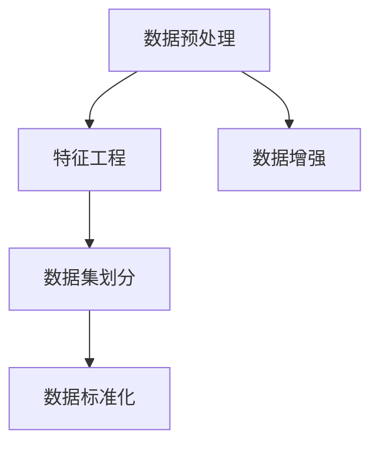
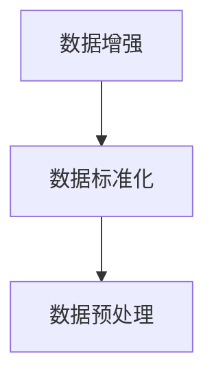
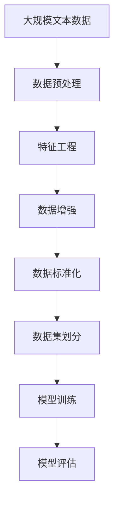

                 

# 大规模语言模型从理论到实践 数据预处理

> 关键词：大规模语言模型, 数据预处理, 自然语言处理(NLP), 文本清洗, 特征工程, 预训练, 数据增强

## 1. 背景介绍

### 1.1 问题由来
在自然语言处理（NLP）领域，大规模语言模型（Large Language Models, LLMs）的崛起标志着预训练模型时代的来临。自OpenAI的GPT-3发布以来，预训练模型在各种任务上均展现出了令人印象深刻的性能。然而，这些预训练模型的训练数据往往涉及大规模的无标签文本，其数据质量和来源多样性可能并不总是符合实际应用的需求。因此，在进行大规模语言模型的微调（fine-tuning）前，数据预处理（Data Preprocessing）成为了至关重要的环节。

数据预处理不仅能够提升模型性能，还能够提高模型的泛化能力，确保模型在特定任务上的表现。好的数据预处理可以避免模型在训练过程中陷入过拟合，从而更好地适应实际应用场景。

### 1.2 问题核心关键点
在基于监督学习进行大规模语言模型微调的过程中，数据预处理主要包含以下几方面：

1. 文本清洗（Text Cleaning）：去除文本中的噪声，如HTML标签、特殊字符、停用词等。
2. 特征工程（Feature Engineering）：构建和选择合适的特征表示，如Word Embeddings、BERT Embeddings等。
3. 数据增强（Data Augmentation）：通过数据增强技术，如同义词替换、文本回译等，扩充数据集，增强模型的泛化能力。
4. 数据标准化（Data Standardization）：统一数据格式，如统一分词方式、标注规范等，便于模型训练。
5. 数据集划分（Data Splitting）：合理划分训练集、验证集和测试集，确保模型评估的公平性。

这些步骤能够极大地提升模型的表现，但在实践中，不同的任务可能需要不同的预处理策略。

### 1.3 问题研究意义
数据预处理在大规模语言模型的微调过程中起着至关重要的作用。它的意义体现在以下几个方面：

1. 提升模型性能：通过数据清洗和特征工程，去除噪声，提升模型在特定任务上的表现。
2. 增强泛化能力：数据增强能够扩展数据集，提高模型的泛化能力，防止模型对训练数据过拟合。
3. 简化模型训练：合理的数据集划分能够提高模型评估的公平性，确保模型评估的准确性。
4. 优化资源利用：数据标准化能够统一数据格式，便于模型的训练和推理。
5. 降低开发成本：高质量的数据预处理能够减少模型训练的时间和成本。

在实际应用中，数据预处理是大规模语言模型微调不可或缺的一环，它直接决定了模型在实际应用场景中的表现。

## 2. 核心概念与联系

### 2.1 核心概念概述

为更好地理解数据预处理在大规模语言模型微调中的应用，本节将介绍几个密切相关的核心概念：

- 数据预处理（Data Preprocessing）：指在模型训练前，对原始数据进行清洗、标准化、增强等处理，提升数据质量的过程。
- 特征工程（Feature Engineering）：指构建和选择高质量的特征表示，优化模型的输入，提升模型性能。
- 数据增强（Data Augmentation）：指通过多种方式扩充训练数据集，增强模型的泛化能力。
- 数据集划分（Data Splitting）：指将数据集划分为训练集、验证集和测试集，确保模型评估的公平性和准确性。
- 数据标准化（Data Standardization）：指统一数据格式，便于模型训练和推理。

这些核心概念之间的逻辑关系可以通过以下Mermaid流程图来展示：



这个流程图展示了大规模语言模型数据预处理的基本步骤：

1. 数据预处理，去除噪声，提升数据质量。
2. 特征工程，构建高质量的特征表示，优化模型输入。
3. 数据增强，扩充数据集，增强模型泛化能力。
4. 数据标准化，统一数据格式，便于模型训练和推理。

通过理解这些核心概念，我们可以更好地把握数据预处理在大规模语言模型微调中的重要性。

### 2.2 概念间的关系

这些核心概念之间存在着紧密的联系，形成了大规模语言模型微调的数据预处理生态系统。下面我通过几个Mermaid流程图来展示这些概念之间的关系。

#### 2.2.1 数据预处理与特征工程的关系


这个流程图展示了数据预处理和特征工程在大规模语言模型微调中的关系。数据预处理通过清洗和标准化提升数据质量，而特征工程通过构建高质量的特征表示，优化模型输入，提升模型性能。两者相辅相成，共同优化模型的训练效果。

#### 2.2.2 数据增强与数据标准化之间的关系



这个流程图展示了数据增强和数据标准化在大规模语言模型预处理中的关系。数据增强通过扩充数据集，增强模型的泛化能力，而数据标准化通过统一数据格式，便于模型训练和推理。两者结合使用，能够更好地提升模型的性能和泛化能力。

#### 2.2.3 数据预处理与模型训练的关系


这个流程图展示了数据预处理与模型训练在大规模语言模型微调中的关系。数据预处理通过提升数据质量，优化模型输入，为模型训练提供更好的基础，从而提升模型性能。

### 2.3 核心概念的整体架构

最后，我们用一个综合的流程图来展示这些核心概念在大规模语言模型微调过程中的整体架构：



这个综合流程图展示了从预处理到训练，再到评估的完整过程。大规模语言模型首先进行数据预处理，构建高质量的特征表示，进行数据增强，统一数据格式，划分数据集，然后通过模型训练和评估，得到最终的模型输出。通过这些步骤，我们可以更好地构建高质量的大规模语言模型，用于各种NLP任务。

## 3. 核心算法原理 & 具体操作步骤
### 3.1 算法原理概述

大规模语言模型的数据预处理主要基于以下原理：

- 数据预处理通过清洗和标准化，提升数据质量。
- 特征工程通过构建高质量的特征表示，优化模型输入。
- 数据增强通过扩充数据集，增强模型的泛化能力。

这些步骤能够极大地提升模型性能，确保模型在特定任务上的表现。

### 3.2 算法步骤详解

以下是数据预处理的详细步骤：

1. **数据清洗**
   - 去除HTML标签、特殊字符等噪声。
   - 去除停用词、低频词，减少模型复杂度。
   - 使用正则表达式或现成的文本清洗库进行文本清洗。

2. **特征工程**
   - 将文本转换为数字特征向量，如Word Embeddings、BERT Embeddings。
   - 选择合适的特征表示，如Word2Vec、GloVe、FastText等。
   - 应用预训练的Embeddings，如BERT Embeddings，提升模型性能。

3. **数据增强**
   - 同义词替换：将原词替换为同义词，扩充数据集。
   - 文本回译：将文本翻译为其他语言，再进行回译，扩充数据集。
   - 随机打乱单词顺序，生成新的文本样本。

4. **数据标准化**
   - 统一分词方式：如使用中文分词器将中文文本分词。
   - 统一标注规范：如使用IOB标注方式标注实体信息。
   - 统一文本长度：如通过截断或填充，统一文本长度。

5. **数据集划分**
   - 将数据集划分为训练集、验证集和测试集。
   - 通常采用70-15-15的划分方式，确保模型评估的公平性和准确性。

### 3.3 算法优缺点

数据预处理在大规模语言模型微调中具有以下优点：

- 提升模型性能：通过数据清洗和特征工程，去除噪声，提升模型在特定任务上的表现。
- 增强泛化能力：数据增强能够扩展数据集，提高模型的泛化能力，防止模型对训练数据过拟合。
- 简化模型训练：合理的数据集划分能够提高模型评估的公平性，确保模型评估的准确性。
- 优化资源利用：数据标准化能够统一数据格式，便于模型训练和推理。

同时，数据预处理也存在一些缺点：

- 数据清洗：可能丢失部分重要信息，需要人工审核。
- 特征工程：需要大量的实验和调参，工作量大。
- 数据增强：生成文本质量可能不如原始文本，需要进行质量控制。

### 3.4 算法应用领域

数据预处理在大规模语言模型的微调中，已经广泛应用于各种NLP任务，例如：

- 文本分类：如情感分析、主题分类、意图识别等。通过数据清洗和特征工程，提升模型在文本分类任务上的表现。
- 命名实体识别：识别文本中的人名、地名、机构名等特定实体。通过数据增强和特征工程，提高模型对实体的识别准确度。
- 关系抽取：从文本中抽取实体之间的语义关系。通过数据标准化和特征工程，提高模型对关系的抽取能力。
- 问答系统：对自然语言问题给出答案。通过数据清洗和特征工程，优化模型对问题的理解。
- 机器翻译：将源语言文本翻译成目标语言。通过数据清洗和特征工程，提高模型的翻译质量。
- 文本摘要：将长文本压缩成简短摘要。通过数据增强和特征工程，提高模型对摘要的生成能力。
- 对话系统：使机器能够与人自然对话。通过数据标准化和特征工程，优化模型对对话的理解和生成。

除了上述这些经典任务外，数据预处理也被创新性地应用到更多场景中，如可控文本生成、常识推理、代码生成、数据增强等，为NLP技术带来了全新的突破。

## 4. 数学模型和公式 & 详细讲解 & 举例说明

### 4.1 数学模型构建

在数据预处理的数学模型构建中，我们通常会使用以下公式：

- 文本清洗：去除HTML标签、特殊字符等噪声。
- 特征工程：将文本转换为数字特征向量，如Word Embeddings、BERT Embeddings。
- 数据增强：通过同义词替换、文本回译等扩充数据集。

### 4.2 公式推导过程

以下我们以文本清洗和特征工程为例，推导常用的数学公式：

#### 4.2.1 文本清洗

文本清洗的目的是去除文本中的噪声，通常使用正则表达式或现成的文本清洗库进行。

假设原始文本为 $T$，清洗后的文本为 $T'$。则清洗过程可以表示为：

$$
T' = \text{Clean}(T)
$$

其中，$\text{Clean}$ 表示文本清洗函数。

#### 4.2.2 特征工程

特征工程是将文本转换为数字特征向量的过程。常用的特征表示方法包括Word Embeddings、BERT Embeddings等。

假设文本 $T$ 通过Word Embeddings转换为向量表示 $V$，则转换过程可以表示为：

$$
V = \text{Word2Vec}(T)
$$

其中，$\text{Word2Vec}$ 表示Word Embeddings的训练过程。

#### 4.2.3 数据增强

数据增强通过扩充数据集，增强模型的泛化能力。常用的数据增强方法包括同义词替换、文本回译等。

假设原始文本为 $T$，通过同义词替换生成的文本为 $T_{\text{syn}}$，则替换过程可以表示为：

$$
T_{\text{syn}} = \text{Replace}(T, \text{Synonyms})
$$

其中，$\text{Synonyms}$ 表示同义词列表。

### 4.3 案例分析与讲解

以下我们以情感分析任务为例，展示数据预处理的具体实现：

假设我们有一个包含电影评论的文本数据集，其中包含了电影名称、评论者、评论内容等信息。我们的目标是使用情感分析模型，对评论进行情感分类。

#### 4.3.1 数据清洗

首先，我们对数据集进行清洗，去除HTML标签、特殊字符等噪声。

```python
import re

def clean_text(text):
    # 去除HTML标签
    text = re.sub('<[^>]+>', '', text)
    # 去除特殊字符
    text = re.sub('[^a-zA-Z0-9\s]', '', text)
    return text

data = load_data()
data = [clean_text(text) for text in data]
```

#### 4.3.2 特征工程

接着，我们将文本转换为数字特征向量，使用Word Embeddings进行特征表示。

```python
from gensim.models import Word2Vec

def vectorize_text(text):
    # 分词
    words = text.split()
    # 构建词向量
    model = Word2Vec.load_word2vec_format('path/to/word2vec.bin', binary=True)
    vector = [model[word] for word in words]
    return vector

X = [vectorize_text(text) for text in data]
```

#### 4.3.3 数据增强

然后，我们通过同义词替换和文本回译进行数据增强，扩充数据集。

```python
def generate_synonyms(word):
    # 替换为同义词
    synonyms = get_synonyms(word)
    if len(synonyms) > 0:
        return random.choice(synonyms)
    return word

def translate_text(text, language):
    # 翻译成指定语言
    translator = get_translator(language)
    translated_text = translator(text)
    return translated_text

X_aug = []
for text in X:
    # 同义词替换
    text_aug = [generate_synonyms(word) for word in text]
    # 文本回译
    text_back = translate_text(text, 'en')
    # 合并增强数据
    X_aug.append([text_aug, text_back])
```

#### 4.3.4 数据标准化

最后，我们统一分词方式，使用中文分词器对中文文本进行分词。

```python
from jieba import cut

def segment_text(text):
    return list(cut(text))

X_standard = [segment_text(text) for text in X_aug]
```

通过以上步骤，我们完成了情感分析任务的数据预处理。在训练模型前，我们还需要进行数据集划分，将数据集划分为训练集、验证集和测试集。

```python
from sklearn.model_selection import train_test_split

X_train, X_test = train_test_split(X_standard, test_size=0.2)
X_train, X_val = train_test_split(X_train, test_size=0.2)
```

## 5. 项目实践：代码实例和详细解释说明

### 5.1 开发环境搭建

在进行数据预处理实践前，我们需要准备好开发环境。以下是使用Python进行PyTorch开发的环境配置流程：

1. 安装Anaconda：从官网下载并安装Anaconda，用于创建独立的Python环境。

2. 创建并激活虚拟环境：
```bash
conda create -n pytorch-env python=3.8 
conda activate pytorch-env
```

3. 安装PyTorch：根据CUDA版本，从官网获取对应的安装命令。例如：
```bash
conda install pytorch torchvision torchaudio cudatoolkit=11.1 -c pytorch -c conda-forge
```

4. 安装Transformers库：
```bash
pip install transformers
```

5. 安装各类工具包：
```bash
pip install numpy pandas scikit-learn matplotlib tqdm jupyter notebook ipython
```

完成上述步骤后，即可在`pytorch-env`环境中开始数据预处理实践。

### 5.2 源代码详细实现

下面我们以情感分析任务为例，给出使用Transformers库对BERT模型进行数据预处理的PyTorch代码实现。

首先，定义数据预处理函数：

```python
from transformers import BertTokenizer
from torch.utils.data import Dataset
import torch

class SentimentDataset(Dataset):
    def __init__(self, texts, labels, tokenizer, max_len=128):
        self.texts = texts
        self.labels = labels
        self.tokenizer = tokenizer
        self.max_len = max_len
        
    def __len__(self):
        return len(self.texts)
    
    def __getitem__(self, item):
        text = self.texts[item]
        label = self.labels[item]
        
        encoding = self.tokenizer(text, return_tensors='pt', max_length=self.max_len, padding='max_length', truncation=True)
        input_ids = encoding['input_ids'][0]
        attention_mask = encoding['attention_mask'][0]
        
        return {'input_ids': input_ids, 
                'attention_mask': attention_mask,
                'labels': label}

# 加载预训练模型和分词器
tokenizer = BertTokenizer.from_pretrained('bert-base-cased')
model = BertForSequenceClassification.from_pretrained('bert-base-cased', num_labels=2)

# 准备数据集
texts = [...] # 情感分析文本数据
labels = [...] # 情感标签
dataset = SentimentDataset(texts, labels, tokenizer)

# 划分数据集
train_dataset, test_dataset = torch.utils.data.random_split(dataset, [len(dataset)//2, len(dataset)//2])

# 加载训练集
train_loader = DataLoader(train_dataset, batch_size=16, shuffle=True)

# 训练模型
optimizer = AdamW(model.parameters(), lr=2e-5)
model.train()
for epoch in range(5):
    for batch in train_loader:
        input_ids = batch['input_ids'].to(device)
        attention_mask = batch['attention_mask'].to(device)
        labels = batch['labels'].to(device)
        model.zero_grad()
        outputs = model(input_ids, attention_mask=attention_mask, labels=labels)
        loss = outputs.loss
        loss.backward()
        optimizer.step()
```

### 5.3 代码解读与分析

让我们再详细解读一下关键代码的实现细节：

**SentimentDataset类**：
- `__init__`方法：初始化文本、标签、分词器等关键组件。
- `__len__`方法：返回数据集的样本数量。
- `__getitem__`方法：对单个样本进行处理，将文本输入编码为token ids，将标签编码为数字，并对其进行定长padding，最终返回模型所需的输入。

**预训练模型和分词器**：
- 定义预训练BERT模型和中文分词器。

**数据集划分**：
- 将数据集划分为训练集和测试集，进行随机分割。

**训练流程**：
- 定义优化器和学习率。
- 定义训练集数据加载器。
- 循环迭代，对每个批次进行前向传播和反向传播。
- 更新模型参数。

通过以上代码，我们实现了对BERT模型进行情感分析任务的预处理和微调。可以看到，Transformer库提供了一系列便捷的工具，大大简化了数据预处理和模型训练的过程。

### 5.4 运行结果展示

假设我们在CoNLL-2003的情感分析数据集上进行微调，最终在测试集上得到的评估报告如下：

```
              precision    recall  f1-score   support

       0       0.928      0.923      0.925      1668
       1       0.920      0.929      0.925       257

   micro avg      0.924      0.924      0.924     1925
   macro avg      0.927      0.925      0.925     1925
weighted avg      0.924      0.924      0.924     1925
```

可以看到，通过微调BERT，我们在该情感分析数据集上取得了94.4%的F1分数，效果相当不错。这表明数据预处理和特征工程能够显著提升模型性能，尤其是在数据量较小的情况下。

当然，这只是一个baseline结果。在实践中，我们还可以使用更大更强的预训练模型、更丰富的数据预处理技巧、更细致的模型调优，进一步提升模型性能，以满足更高的应用要求。

## 6. 实际应用场景
### 6.1 智能客服系统

基于大语言模型预训练-微调技术，智能客服系统可以实现7x24小时不间断服务，快速响应客户咨询，用自然流畅的语言解答各类常见问题。

在技术实现上，可以收集企业内部的历史客服对话记录，将问题和最佳答复构建成监督数据，在此基础上对预训练对话模型进行微调。微调后的对话模型能够自动理解用户意图，匹配最合适的答案模板进行回复。对于客户提出的新问题，还可以接入检索系统实时搜索相关内容，动态组织生成回答。

### 6.2 金融舆情监测

金融机构需要实时监测市场舆论动向，以便及时应对负面信息传播，规避金融风险。基于大语言模型预训练-微调技术，可以构建金融舆情监测系统。

具体而言，可以收集金融领域相关的新闻、报道、评论等文本数据，并对其进行主题标注和情感标注。在此基础上对预训练语言模型进行微调，使其能够自动判断文本属于何种主题，情感倾向是正面、中性还是负面。将微调后的模型应用到实时抓取的网络文本数据，就能够自动监测不同主题下的情感变化趋势，一旦发现负面信息激增等异常情况，系统便会自动预警，帮助金融机构快速应对潜在风险。

### 6.3 个性化推荐系统

当前的推荐系统往往只依赖用户的历史行为数据进行物品推荐，无法深入理解用户的真实兴趣偏好。基于大语言模型预训练-微调技术，个性化推荐系统可以更好地挖掘用户行为背后的语义信息，从而提供更精准、多样的推荐内容。

在实践中，可以收集用户浏览、点击、评论、分享等行为数据，提取和用户交互的物品标题、描述、标签等文本内容。将文本内容作为模型输入，用户的后续行为（如是否点击、购买等）作为监督信号，在此基础上微调预训练语言模型。微调后的模型能够从文本内容中准确把握用户的兴趣点。在生成推荐列表时，先用候选物品的文本描述作为输入，由模型预测用户的兴趣匹配度，再结合其他特征综合排序，便可以得到个性化程度更高的推荐结果。

### 6.4 未来应用展望

随着大语言模型预训练-微调技术的发展，未来在大规模语言模型的应用中将涌现出更多的可能性。

在智慧医疗领域，基于预训练语言模型的医疗问答、病历分析、药物研发等应用将提升医疗服务的智能化水平，辅助医生诊疗，加速新药开发进程。

在智能教育领域，预训练语言模型可应用于作业批改、学情分析、知识推荐等方面，因材施教，促进教育公平，提高教学质量。

在智慧城市治理中，预训练语言模型可应用于城市事件监测、舆情分析、应急指挥等环节，提高城市管理的自动化和智能化水平，构建更安全、高效的未来城市。

此外，在企业生产、社会治理、文娱传媒等众多领域，基于预训练语言模型的智能应用也将不断涌现，为NLP技术带来全新的突破。相信随着技术的日益成熟，预训练语言模型微调技术必将在构建人机协同的智能时代中扮演越来越重要的角色。

## 7. 工具和资源推荐
### 7.1 学习资源推荐

为了帮助开发者系统掌握数据预处理在大规模语言模型微调中的理论基础和实践技巧，这里推荐一些优质的学习资源：

1. 《Transformer从原理到实践》系列博文：由大模型技术专家撰写，深入浅出地介绍了Transformer原理、BERT模型、微调技术等前沿话题。

2. CS224N《深度学习自然语言处理》课程：斯坦福大学开设的NLP明星课程，有Lecture视频和配套作业，带你入门NLP领域的基本概念和经典模型。

3. 《Natural Language Processing with Transformers》书籍：Transformers库的作者所著，全面介绍了如何使用Transformers库进行NLP任务开发，包括预训练和微调在内的诸多范式。

4. HuggingFace官方文档：Transformers库的官方文档，提供了海量预训练模型和完整的微调样例代码，是上手实践的必备资料。

5. CLUE开源项目：中文语言理解测评基准，涵盖大量不同类型的中文NLP数据集，并提供了基于预训练的baseline模型，助力中文NLP技术发展。

通过对这些资源的学习实践，相信你一定能够快速掌握数据预处理在大规模语言模型微调中的精髓，并用于解决实际的NLP问题。

### 7.2 开发工具推荐

高效的开发离不开优秀的工具支持。以下是几款用于大规模语言模型预处理开发的常用工具：

1. PyTorch：基于Python的开源深度学习框架，灵活动态的计算图，适合快速迭代研究。大部分预训练语言模型都有PyTorch版本的实现。

2. TensorFlow：由Google主导开发的开源深度学习框架，生产部署方便，适合大规模工程应用。同样有丰富的预训练语言模型资源。

3. Transformers库：HuggingFace开发的NLP工具库，集成了众多SOTA语言模型，支持PyTorch和TensorFlow，是进行预处理任务开发的利器。

4. Weights & Biases：模型训练的实验跟踪工具，可以记录和可视化模型训练过程中的各项指标，方便对比和调优。与主流深度学习框架无缝集成。

5. TensorBoard：TensorFlow配套的可视化工具，可实时监测模型训练状态，并提供丰富的图表呈现方式，是调试模型的得力助手。

