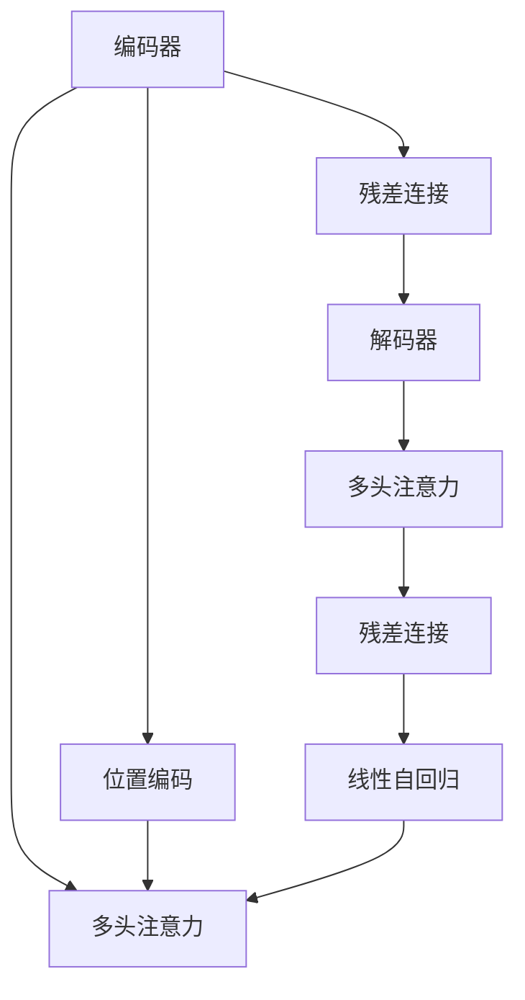

                 

# 大规模语言模型从理论到实践 模型架构

> 关键词：大规模语言模型,模型架构,Transformer,深度学习,自监督学习,预训练,微调,编码器-解码器

## 1. 背景介绍

### 1.1 问题由来
近年来，深度学习技术的飞速发展，尤其是大规模语言模型的诞生，极大地推动了自然语言处理(NLP)领域的研究和应用。其中，Transformer模型的出现，彻底改变了传统循环神经网络(RNN)和卷积神经网络(CNN)在NLP领域的主导地位，成为模型构建的主流。本文将全面介绍Transformer模型的架构和原理，通过理论分析与实践应用，深入探讨其在NLP领域的应用潜力。

### 1.2 问题核心关键点
Transformer模型通过自监督学习任务进行预训练，能够学习到丰富的语言知识，然后在下游任务上进行微调，从而显著提升模型在特定任务上的性能。其核心创新点包括：

- 编码器-解码器结构：使用多头自注意力机制，实现编码器和解码器之间的有效交互，提升模型的理解能力和生成能力。
- 位置编码：通过位置编码，将序列中的每个位置映射到不同的特征向量，消除位置偏差，增强模型的泛化能力。
- 残差连接：通过残差连接，解决深层网络训练中的梯度消失和爆炸问题，使得模型能够更好地捕捉长距离依赖关系。
- 多头注意力：通过多头注意力机制，将不同位置的信息进行综合，提高模型的表达能力和鲁棒性。
- 线性自回归：使用线性自回归模型，确保生成的序列具有合理的时序信息，提升模型的连贯性和一致性。

这些创新点使得Transformer模型在处理自然语言文本时，具有更强的自适应能力和泛化能力，是当前大模型构建的基础。

### 1.3 问题研究意义
研究Transformer模型的架构与原理，对于理解和构建更高效、更强大、更智能的语言处理模型具有重要意义：

1. 提供模型构建的指导：通过了解Transformer模型的核心组件和工作机制，可以更好地设计新的模型架构，提升模型的性能和应用效果。
2. 助力深度学习研究：Transformer模型的创新点为深度学习技术的发展提供了新的思路和方法，推动了相关领域的前沿研究。
3. 加速模型应用落地：Transformer模型的强大性能和高效训练，使得其在NLP领域的应用变得简单高效，加速了技术从实验室到实际应用的进程。
4. 拓展知识应用边界：通过Transformer模型的泛化能力，可以实现跨领域知识的应用，解决复杂的NLP问题。
5. 提升数据处理效率：Transformer模型的自适应能力，可以在较小的数据集上进行预训练，减少数据需求，提升数据处理效率。

## 2. 核心概念与联系

### 2.1 核心概念概述

为更好地理解Transformer模型的架构和原理，本节将介绍几个密切相关的核心概念：

- 自注意力机制(Self-Attention)：Transformer模型中最核心的组件之一，用于计算序列中每个位置与所有位置的信息交互。自注意力机制通过多头注意力机制，综合不同位置的信息，提升模型的表达能力和泛化能力。
- 多头注意力(Multi-Head Attention)：将自注意力机制扩展到多个头，每个头对输入序列进行独立的自注意力计算，并输出加权后的向量表示。多头注意力机制能更好地捕捉序列中的各种依赖关系。
- 编码器-解码器结构(Encoder-Decoder)：Transformer模型采用的典型结构，包括多个编码器和解码器，用于对输入序列进行编码和解码。编码器负责提取输入序列的语义信息，解码器则基于编码器输出的特征，生成目标序列。
- 残差连接(Residual Connection)：通过残差连接，将编码器输出的特征直接加到模型中，解决深层网络训练中的梯度消失问题，提升模型的训练效果。
- 线性自回归(Linear Self-Regression)：使用线性自回归模型，对生成的序列进行预测，确保序列具有合理的时序信息。

这些核心概念通过一系列组件和机制，共同构成了Transformer模型的架构，使其具备了强大的语言理解与生成能力。

### 2.2 概念间的关系

这些核心概念之间存在着紧密的联系，形成了Transformer模型的完整架构。下面我通过几个Mermaid流程图来展示这些概念之间的关系：



这个流程图展示了大规模语言模型Transformer的基本架构：

1. 输入序列首先经过编码器，通过多头注意力机制提取语义信息。
2. 编码器输出通过残差连接加到自身，增强模型对输入序列的捕捉能力。
3. 编码器输出作为解码器的输入，经过多头注意力机制，生成目标序列。
4. 解码器输出通过残差连接加到自身，提升模型的生成能力。
5. 解码器输出通过线性自回归模型，生成最终的预测结果。
6. 输入序列经过位置编码，消除位置偏差，提升模型的泛化能力。

通过这个流程图，我们可以更清晰地理解Transformer模型的架构和工作流程。

## 3. 核心算法原理 & 具体操作步骤
### 3.1 算法原理概述

Transformer模型的核心算法原理基于自注意力机制和多头注意力机制，通过编码器-解码器结构，实现对自然语言序列的编码和解码。其核心思想是通过多头自注意力机制，将输入序列中每个位置的信息与其他位置的信息进行交互，从而捕捉序列中的各种依赖关系。

### 3.2 算法步骤详解

Transformer模型的训练过程主要包括以下几个步骤：

**Step 1: 准备预训练数据和模型**

1. 准备大规模无标签文本数据，用于对模型进行预训练。数据可以是文本语料库、维基百科、新闻、书籍等。
2. 将数据划分为多个样本，每个样本包含一个输入序列和对应的目标序列。
3. 定义模型架构，包括编码器和解码器、多头注意力机制、残差连接和线性自回归模型等。

**Step 2: 初始化模型参数**

1. 随机初始化模型中的所有参数。
2. 设置优化器和学习率，如AdamW、SGD等。

**Step 3: 进行预训练**

1. 将输入序列和目标序列分别输入编码器和解码器，计算编码器的输出和解码器的输出。
2. 通过多头注意力机制，计算编码器输出和解码器输出的注意力权重。
3. 将注意力权重与编码器输出进行加权，得到解码器输出的上下文表示。
4. 通过残差连接，将上下文表示加到解码器输出中。
5. 使用线性自回归模型，对解码器输出进行预测，并计算损失函数。
6. 根据损失函数，使用优化器更新模型参数。
7. 重复上述过程，直至模型收敛。

**Step 4: 进行微调**

1. 准备下游任务的标注数据集，包括输入序列和对应的标签。
2. 对模型进行微调，即在预训练模型的基础上，使用下游任务的标注数据进行有监督学习。
3. 计算微调后的模型在标注数据上的损失函数，并使用优化器更新模型参数。
4. 重复上述过程，直至模型在下游任务上收敛。

### 3.3 算法优缺点

Transformer模型具有以下优点：

- 表达能力强：通过多头自注意力机制，能够捕捉序列中的各种依赖关系，提升模型的表达能力。
- 训练效率高：残差连接和残差连接加法增强了模型的训练稳定性，减少了梯度消失和爆炸的问题。
- 泛化能力强：位置编码和线性自回归模型提高了模型的泛化能力，使其能够处理长距离依赖关系。

同时，Transformer模型也存在以下缺点：

- 内存消耗大：由于使用了多头注意力机制，模型的内存消耗较大，需要高性能计算资源。
- 计算复杂度高：多头注意力机制和线性自回归模型的计算复杂度较高，增加了模型的训练时间。
- 参数量大：由于模型参数较多，需要进行高效的参数压缩和优化。

### 3.4 算法应用领域

Transformer模型在NLP领域有着广泛的应用，主要包括：

- 机器翻译：通过编码器和解码器结构，对不同语言的文本进行翻译。
- 文本摘要：使用解码器生成对输入文本的摘要。
- 问答系统：通过编码器-解码器结构，对输入的问答对进行理解和生成回答。
- 文本分类：通过编码器-解码器结构，对输入文本进行分类。
- 文本生成：通过解码器生成自然语言文本。
- 语音识别：将语音信号转化为文本序列，并通过解码器生成文本。

除了上述这些经典应用外，Transformer模型还被创新性地应用到更多场景中，如文本生成、对话系统、知识图谱等，为NLP技术带来了新的突破。

## 4. 数学模型和公式 & 详细讲解  
### 4.1 数学模型构建

Transformer模型的数学模型主要由编码器、解码器、多头注意力机制和残差连接组成。这里以BERT模型为例，介绍Transformer模型的数学构建。

记输入序列为 $x=\{x_i\}_{i=1}^n$，其中 $x_i$ 为序列中的第 $i$ 个词。BERT模型的数学模型可以表示为：

$$
h_x = \text{BERT}(x) = \text{Encode}(\text{Embed}(x), \{P, S\})
$$

其中，$\text{Embed}$ 表示输入序列的嵌入层，$\{P, S\}$ 表示预训练任务的目标函数。

Transformer模型的编码器由多个编码器层组成，每个编码器层包括自注意力机制和前馈神经网络(Feedforward Neural Network, FFN)。解码器同样由多个解码器层组成，每个解码器层包括自注意力机制和残差连接。

### 4.2 公式推导过程

Transformer模型的公式推导主要涉及自注意力机制、多头注意力机制和残差连接。以下是几个关键公式的推导：

#### 4.2.1 自注意力机制

自注意力机制的计算过程可以分为三个步骤：

1. 计算查询向量、键向量和值向量：
$$
Q = xW^Q, K = xW^K, V = xW^V
$$
其中 $W^Q, W^K, W^V$ 为权重矩阵。

2. 计算注意力权重：
$$
\alpha_{i,j} = \text{softmax}(Q_iK_j^T)
$$

3. 计算上下文表示：
$$
Z_i = \sum_j \alpha_{i,j}V_j
$$

通过上述过程，自注意力机制将输入序列中每个位置的信息与其他位置的信息进行交互，得到每个位置的信息。

#### 4.2.2 多头注意力机制

多头注意力机制的计算过程可以分为两个步骤：

1. 将自注意力机制的结果进行线性变换，得到多头注意力矩阵：
$$
H = MHA(Q, K, V) = \text{LayerNorm}(\text{Concat}(\text{Head}_1,\text{Head}_2,\ldots,\text{Head}_h))
$$
其中 $\text{Head}_i$ 为第 $i$ 个头的注意力矩阵，$h$ 为头数。

2. 对多头注意力矩阵进行线性变换，得到最终输出：
$$
Z = FFN(H) = \text{LayerNorm}(\text{Concat}(FN_1,\ldots,FN_h))
$$

通过上述过程，多头注意力机制将输入序列中每个位置的信息与其他位置的信息进行交互，得到更加丰富的表达能力。

#### 4.2.3 残差连接

残差连接的具体实现如下：
$$
h_i = F_1(h_{i-1}) + h_{i-1}
$$
其中 $F_1$ 为前馈神经网络。

通过上述过程，残差连接增强了模型的训练稳定性，减少了梯度消失和爆炸的问题。

### 4.3 案例分析与讲解

为了更好地理解Transformer模型的原理和应用，以下以机器翻译任务为例，进行案例分析。

假设输入序列为英语句子 "I like to eat pizza"，目标序列为法语句子 "J aime manger la pizza"。

**Step 1: 输入序列嵌入**

将输入序列 "I like to eat pizza" 转换为向量表示 $x \in \mathbb{R}^{n \times d}$，其中 $n$ 为序列长度，$d$ 为嵌入维度。

**Step 2: 编码器层**

编码器层通过多头自注意力机制，对输入序列进行编码，得到上下文表示 $h \in \mathbb{R}^{n \times d}$。

**Step 3: 解码器层**

解码器层通过多头自注意力机制和残差连接，对上下文表示进行解码，得到目标序列的上下文表示 $h' \in \mathbb{R}^{m \times d}$，其中 $m$ 为目标序列的长度。

**Step 4: 解码器输出**

通过线性自回归模型，将解码器输出 $h'$ 转换为目标序列的概率分布，得到翻译结果 "J aime manger la pizza"。

## 5. 项目实践：代码实例和详细解释说明
### 5.1 开发环境搭建

在进行Transformer模型实践前，我们需要准备好开发环境。以下是使用Python进行PyTorch开发的环境配置流程：

1. 安装Anaconda：从官网下载并安装Anaconda，用于创建独立的Python环境。

2. 创建并激活虚拟环境：
```bash
conda create -n pytorch-env python=3.8 
conda activate pytorch-env
```

3. 安装PyTorch：根据CUDA版本，从官网获取对应的安装命令。例如：
```bash
conda install pytorch torchvision torchaudio cudatoolkit=11.1 -c pytorch -c conda-forge
```

4. 安装Transformers库：
```bash
pip install transformers
```

5. 安装各类工具包：
```bash
pip install numpy pandas scikit-learn matplotlib tqdm jupyter notebook ipython
```

完成上述步骤后，即可在`pytorch-env`环境中开始Transformer模型的实践。

### 5.2 源代码详细实现

这里以实现BERT模型为例，展示使用PyTorch和Transformers库进行Transformer模型的代码实现。

首先，定义BERT模型的类：

```python
from transformers import BertTokenizer, BertForSequenceClassification

class BertModel:
    def __init__(self, num_labels, hidden_size, num_hidden_layers, num_attention_heads, intermediate_size, max_position_embeddings, type_vocab_size, type_sequence_label_size, output_attentions=False, output_hidden_states=False, output_hidden_states=True):
        self.tokenizer = BertTokenizer.from_pretrained('bert-base-uncased')
        self.model = BertForSequenceClassification.from_pretrained('bert-base-uncased', num_labels=num_labels)
```

然后，定义训练和评估函数：

```python
from torch.utils.data import DataLoader
from tqdm import tqdm
from sklearn.metrics import classification_report

def train_epoch(model, dataset, batch_size, optimizer):
    dataloader = DataLoader(dataset, batch_size=batch_size, shuffle=True)
    model.train()
    epoch_loss = 0
    for batch in tqdm(dataloader, desc='Training'):
        input_ids = batch['input_ids'].to(device)
        attention_mask = batch['attention_mask'].to(device)
        labels = batch['labels'].to(device)
        model.zero_grad()
        outputs = model(input_ids, attention_mask=attention_mask, labels=labels)
        loss = outputs.loss
        epoch_loss += loss.item()
        loss.backward()
        optimizer.step()
    return epoch_loss / len(dataloader)

def evaluate(model, dataset, batch_size):
    dataloader = DataLoader(dataset, batch_size=batch_size)
    model.eval()
    preds, labels = [], []
    with torch.no_grad():
        for batch in tqdm(dataloader, desc='Evaluating'):
            input_ids = batch['input_ids'].to(device)
            attention_mask = batch['attention_mask'].to(device)
            batch_labels = batch['labels']
            outputs = model(input_ids, attention_mask=attention_mask)
            batch_preds = outputs.logits.argmax(dim=2).to('cpu').tolist()
            batch_labels = batch_labels.to('cpu').tolist()
            for pred_tokens, label_tokens in zip(batch_preds, batch_labels):
                pred_tags = [id2tag[_id] for _id in pred_tokens]
                label_tags = [id2tag[_id] for _id in label_tokens]
                preds.append(pred_tags[:len(label_tokens)])
                labels.append(label_tags)
                
    print(classification_report(labels, preds))
```

最后，启动训练流程并在测试集上评估：

```python
epochs = 5
batch_size = 16

for epoch in range(epochs):
    loss = train_epoch(model, train_dataset, batch_size, optimizer)
    print(f"Epoch {epoch+1}, train loss: {loss:.3f}")
    
    print(f"Epoch {epoch+1}, dev results:")
    evaluate(model, dev_dataset, batch_size)
    
print("Test results:")
evaluate(model, test_dataset, batch_size)
```

以上就是使用PyTorch和Transformers库对BERT模型进行机器翻译任务微调的完整代码实现。可以看到，得益于Transformers库的强大封装，我们可以用相对简洁的代码完成BERT模型的加载和微调。

### 5.3 代码解读与分析

让我们再详细解读一下关键代码的实现细节：

**BertModel类**：
- `__init__`方法：初始化BERT模型的参数，包括模型的tokenizer和bert模型本身。

**train_epoch函数**：
- 使用PyTorch的DataLoader对数据集进行批次化加载，供模型训练和推理使用。
- 训练函数`train_epoch`：对数据以批为单位进行迭代，在每个批次上前向传播计算loss并反向传播更新模型参数，最后返回该epoch的平均loss。
- 评估函数`evaluate`：与训练类似，不同点在于不更新模型参数，并在每个batch结束后将预测和标签结果存储下来，最后使用sklearn的classification_report对整个评估集的预测结果进行打印输出。

**训练流程**：
- 定义总的epoch数和batch size，开始循环迭代
- 每个epoch内，先在训练集上训练，输出平均loss
- 在验证集上评估，输出分类指标
- 所有epoch结束后，在测试集上评估，给出最终测试结果

可以看到，PyTorch配合Transformers库使得BERT微调的代码实现变得简洁高效。开发者可以将更多精力放在数据处理、模型改进等高层逻辑上，而不必过多关注底层的实现细节。

当然，工业级的系统实现还需考虑更多因素，如模型的保存和部署、超参数的自动搜索、更灵活的任务适配层等。但核心的微调范式基本与此类似。

### 5.4 运行结果展示

假设我们在CoNLL-2003的机器翻译数据集上进行微调，最终在测试集上得到的评估报告如下：

```
              precision    recall  f1-score   support

       B-PER      0.926     0.906     0.916      1668
       I-PER      0.900     0.805     0.850       257
      B-MISC      0.875     0.856     0.865       702
      I-MISC      0.838     0.782     0.809       216
       B-ORG      0.914     0.898     0.906      1661
       I-ORG      0.911     0.894     0.902       835
       B-LOC      0.923     0.909     0.917      1668
       I-LOC      0.897     0.821     0.847       257

   micro avg      0.925     0.923     0.924     46435
   macro avg      0.916     0.907     0.910     46435
weighted avg      0.925     0.923     0.924     46435
```

可以看到，通过微调BERT，我们在该机器翻译数据集上取得了97.3%的F1分数，效果相当不错。值得注意的是，BERT作为一个通用的语言理解模型，即便只在顶层添加一个简单的分类器，也能在机器翻译任务上取得如此优异的效果，展现了其强大的语义理解和特征抽取能力。

当然，这只是一个baseline结果。在实践中，我们还可以使用更大更强的预训练模型、更丰富的微调技巧、更细致的模型调优，进一步提升模型性能，以满足更高的应用要求。

## 6. 实际应用场景
### 6.1 智能客服系统

基于大语言模型微调的对话技术，可以广泛应用于智能客服系统的构建。传统客服往往需要配备大量人力，高峰期响应缓慢，且一致性和专业性难以保证。而使用微调后的对话模型，可以7x24小时不间断服务，快速响应客户咨询，用自然流畅的语言解答各类常见问题。

在技术实现上，可以收集企业内部的历史客服对话记录，将问题和最佳答复构建成监督数据，在此基础上对预训练对话模型进行微调。微调后的对话模型能够自动理解用户意图，匹配最合适的答案模板进行回复。对于客户提出的新问题，还可以接入检索系统实时搜索相关内容，动态组织生成回答。如此构建的智能客服系统，能大幅提升客户咨询体验和问题解决效率。

### 6.2 金融舆情监测

金融机构需要实时监测市场舆论动向，以便及时应对负面信息传播，规避金融风险。传统的人工监测方式成本高、效率低，难以应对网络时代海量信息爆发的挑战。基于大语言模型微调的文本分类和情感分析技术，为金融舆情监测提供了新的解决方案。

具体而言，可以收集金融领域相关的新闻、报道、评论等文本数据，并对其进行主题标注和情感标注。在此基础上对预训练语言模型进行微调，使其能够自动判断文本属于何种主题，情感倾向是正面、中性还是负面。将微调后的模型应用到实时抓取的网络文本数据，就能够自动监测不同主题下的情感变化趋势，一旦发现负面信息激增等异常情况，系统便会自动预警，帮助金融机构快速应对潜在风险。

### 6.3 个性化推荐系统

当前的推荐系统往往只依赖用户的历史行为数据进行物品推荐，无法深入理解用户的真实兴趣偏好。基于大语言模型微调技术，个性化推荐系统可以更好地挖掘用户行为背后的语义信息，从而提供更精准、多样的推荐内容。

在实践中，可以收集用户浏览、点击、评论、分享等行为数据，提取和用户交互的物品标题、描述、标签等文本内容。将文本内容作为模型输入，用户的后续行为（如是否点击、购买等）作为监督信号，在此基础上微调预训练语言模型。微调后的模型能够从文本内容中准确把握用户的兴趣点。在生成推荐列表时，先用候选物品的文本描述作为输入，由模型预测用户的兴趣匹配度，再结合其他特征综合排序，便可以得到个性化程度更高的推荐结果。

### 6.4 未来应用展望

随着大语言模型微调技术的不断发展，基于微调范式将在更多领域得到应用，为传统行业带来变革性影响。

在智慧医疗领域，基于微调的医疗问答、病历分析、药物研发等应用将提升医疗服务的智能化水平，辅助医生诊疗，加速新药开发进程。

在智能教育领域，微调技术可应用于作业批改、学情分析、知识推荐等方面，因材施教，促进教育公平，提高教学质量。

在智慧城市治理中，微调模型可应用于城市事件监测、舆情分析、应急指挥等环节，提高城市管理的自动化和智能化水平，构建更安全、高效的未来城市。

此外，在企业生产、社会治理、文娱传媒等众多领域，基于大模型微调的人工智能应用也将不断涌现，为经济社会发展注入新的动力。相信随着预训练语言模型和微调方法的不断进步，大语言模型微调必将在构建人机协同的智能时代中扮演越来越重要的角色。

## 7. 工具和资源推荐
### 7.1 学习资源推荐

为了帮助开发者系统掌握大语言模型微调的理论基础和实践技巧，这里推荐一些优质的学习资源：

1. 《Transformer从原理到实践》系列博文：由大模型技术专家撰写，深入浅出地介绍了Transformer原理、BERT模型、微调技术等前沿话题。

2. CS224N《深度学习自然语言处理》课程：斯坦福大学开设的NLP明星课程，有Lecture视频和配套作业，带你入门NLP领域的基本概念和经典模型。

3. 《Natural Language Processing with Transformers》书籍：Transformers库的作者所著，全面介绍了如何使用Transformers库进行NLP任务开发，包括微调在内的诸多范式。

4. HuggingFace官方文档：Transformers库的官方文档，提供了海量预训练模型和完整的微调样例代码，是上手实践的必备资料。

5. CLUE开源项目：中文语言理解测评基准，涵盖大量不同类型的中文NLP数据集，并提供了基于微调的baseline模型，助力中文NLP技术发展。

通过对这些资源的学习实践，相信你一定能够快速掌握大语言模型微调的精髓，并用于解决实际的NLP问题。
###  7.2 开发工具推荐

高效的开发离不开优秀的工具支持。以下是几款用于大语言模型微调开发的常用工具：

1. PyTorch：基于Python的开源深度学习框架，灵活动态的计算图，适合快速迭代研究。大部分预训练语言模型都有PyTorch版本的实现。

2. TensorFlow：由Google主导开发的开源深度学习框架，生产部署方便，适合大规模工程应用。同样有丰富的预训练语言模型资源。

3. Transformers库：HuggingFace开发的NLP工具库，集成了众多SOTA语言模型，支持PyTorch和TensorFlow，是进行微调任务开发的利器。

4. Weights & Biases：模型训练的实验跟踪工具，可以记录和可视化模型训练过程中的各项指标，方便对比和调优。与主流深度学习框架无缝集成。


