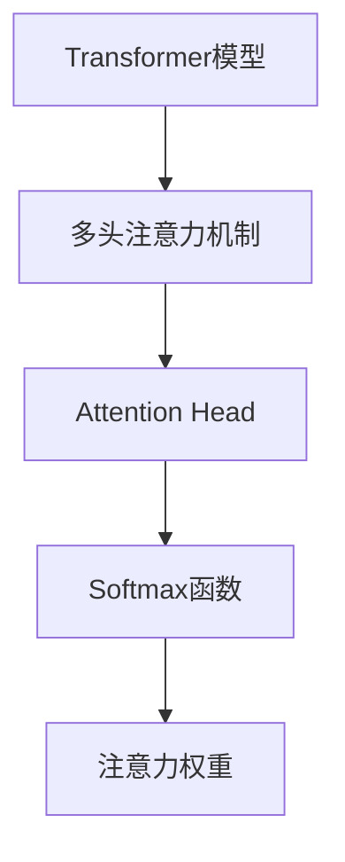
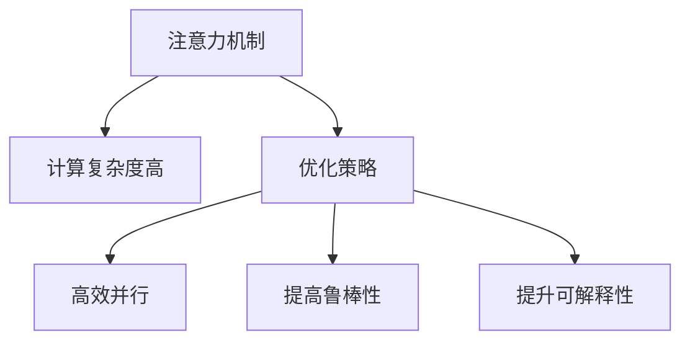
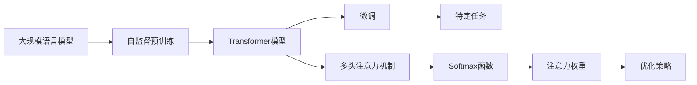

                 

# 大规模语言模型从理论到实践 注意力机制优化

## 1. 背景介绍

### 1.1 问题由来
近年来，深度学习在自然语言处理(NLP)领域取得了显著进展，特别是大规模语言模型（Large Language Models, LLMs），如BERT、GPT等，在各种NLP任务中表现出色。然而，这些模型主要依赖于自监督预训练（Self-Supervised Pre-training），即通过大规模无标签文本进行预训练，学习到通用的语言表示，然后通过微调（Fine-Tuning）来适应特定任务。在微调过程中，注意力机制（Attention Mechanism）的应用对模型性能的提升起着关键作用。

注意力机制最早在深度学习中被应用于机器翻译（Seq2Seq）模型中，随后在Transformer模型中得到了广泛应用。它不仅提高了模型的并行性和效率，还增强了模型对长距离依赖的处理能力，使其在各种NLP任务中表现出强大的语言理解和生成能力。因此，本文将重点介绍注意力机制在大规模语言模型中的应用，以及如何通过优化注意力机制来提升模型的性能。

### 1.2 问题核心关键点
注意力机制的优化在大规模语言模型微调中具有重要意义：

1. **模型并行性**：传统RNN和CNN模型在处理长序列时存在计算瓶颈，而注意力机制通过计算注意力权重，使得模型能够并行处理整个序列，显著提高模型训练和推理的效率。
2. **长距离依赖处理**：注意力机制可以捕捉序列中的长距离依赖关系，使得模型能够更好地理解句子结构，提高语言建模和生成能力。
3. **鲁棒性**：通过注意力机制，模型能够更好地抵抗噪声和干扰，提高模型的鲁棒性。
4. **可解释性**：注意力权重可以解释模型对输入序列中不同部分的关注程度，为模型的可解释性提供了重要线索。

尽管注意力机制在大模型中表现优异，但其计算复杂度高，训练和推理成本较大，需要针对具体应用场景进行优化。本文将从理论到实践，系统地介绍注意力机制在大规模语言模型中的应用，并提出几种优化策略，以期为NLP开发者提供有价值的参考。

## 2. 核心概念与联系

### 2.1 核心概念概述

为更好地理解注意力机制在大规模语言模型中的应用，本节将介绍几个密切相关的核心概念：

- **注意力机制（Attention Mechanism）**：是一种通过计算注意力权重来动态分配输入信息的注意力机制，使得模型能够集中关注输入序列中重要的部分，忽略不重要的部分。在大模型中，注意力机制通常用于计算Transformer模型中的Attention Head。
- **Transformer模型**：基于自注意力机制的自编码器模型，能够高效处理序列数据，广泛应用于机器翻译、文本生成、语音识别等领域。
- **自监督预训练**：通过大规模无标签数据，利用自监督学习任务训练模型，学习到通用的语言表示。常见的自监督任务包括语言建模、掩码语言模型等。
- **微调（Fine-Tuning）**：在预训练模型上，使用下游任务的少量标注数据进行有监督学习，优化模型在特定任务上的性能。
- **Softmax函数**：一种常用的归一化函数，用于计算注意力权重，使得模型能够将注意力分配给输入序列中的各个部分。
- **多头注意力机制**：通过堆叠多个注意力头（Head），每个头负责处理输入序列的不同部分，从而提高模型的表达能力。

这些核心概念之间的逻辑关系可以通过以下Mermaid流程图来展示：


这个流程图展示了大语言模型从预训练到微调，以及注意力机制在大模型中的应用的完整过程。预训练阶段通过自监督学习任务训练模型，学习到通用的语言表示。微调阶段使用下游任务的少量标注数据，通过有监督学习优化模型在特定任务上的性能。在此过程中，注意力机制用于计算模型对输入序列的关注程度，从而提升模型在各种NLP任务上的表现。

### 2.2 概念间的关系

这些核心概念之间存在着紧密的联系，形成了大规模语言模型微调的整体框架。下面我们通过几个Mermaid流程图来展示这些概念之间的关系。

#### 2.2.1 自监督预训练与微调的关系


这个流程图展示了自监督预训练与微调的关系。自监督预训练在大规模无标签数据上训练模型，学习到通用的语言表示，然后通过微调来适应特定任务。

#### 2.2.2 注意力机制与Transformer的关系



这个流程图展示了注意力机制在Transformer模型中的应用。Transformer模型通过堆叠多个注意力头来处理输入序列，每个头通过Softmax函数计算注意力权重，从而动态分配输入信息。

#### 2.2.3 注意力机制的优化



这个流程图展示了注意力机制在大规模语言模型中的应用及其优化策略。注意力机制虽然在大模型中表现优异，但其计算复杂度高，因此需要针对具体应用场景进行优化，如提高并行性、增强鲁棒性、提升可解释性等。

### 2.3 核心概念的整体架构

最后，我们用一个综合的流程图来展示这些核心概念在大规模语言模型微调过程中的整体架构：



这个综合流程图展示了从预训练到微调，以及注意力机制在大模型中的应用的完整过程。

## 3. 核心算法原理 & 具体操作步骤
### 3.1 算法原理概述

在大规模语言模型中，注意力机制通过计算注意力权重，动态分配输入序列中的信息。注意力权重表示模型对输入序列中不同部分的关注程度，从而使得模型能够集中关注重要信息，忽略不重要的信息。

假设输入序列为 $x_1, x_2, ..., x_t$，输出序列为 $y_1, y_2, ..., y_{t'}$，其中 $t$ 和 $t'$ 分别表示输入序列和输出序列的长度。注意力机制的计算过程如下：

1. 对于每个输出位置 $j$，计算其注意力权重 $a_{ij}$，表示模型对输入位置 $i$ 的关注程度。
2. 将注意力权重应用于输入序列 $x_1, x_2, ..., x_t$，得到加权后的表示 $v_j = \sum_{i=1}^t a_{ij} x_i$。
3. 通过线性变换和softmax函数，得到注意力权重 $a_{ij}$ 和加权表示 $v_j$。

注意力机制的计算过程可以用公式表示如下：

$$
a_{ij} = \frac{\exp\left(\mathrm{score}(x_j, x_i)\right)}{\sum_{k=1}^t \exp\left(\mathrm{score}(x_j, x_k)\right)}
$$

其中，$\mathrm{score}(x_j, x_i)$ 表示输入位置 $i$ 和输出位置 $j$ 之间的注意力得分，通常使用点积、余弦相似度等方法计算。

### 3.2 算法步骤详解

基于注意力机制的大规模语言模型微调步骤如下：

1. **选择预训练模型和数据集**：选择预训练模型，如BERT、GPT等，准备下游任务的标注数据集。
2. **添加任务适配层**：根据任务类型，在预训练模型顶层设计合适的输出层和损失函数。
3. **设置微调超参数**：选择合适的优化算法及其参数，如AdamW、SGD等，设置学习率、批大小、迭代轮数等。
4. **设置注意力机制参数**：根据任务特点，调整注意力机制的参数，如注意力头数、注意力得分函数等。
5. **执行梯度训练**：将训练集数据分批次输入模型，前向传播计算损失函数。
6. **反向传播计算参数梯度**：根据设定的优化算法和学习率更新模型参数。
7. **周期性评估模型性能**：在验证集上评估模型性能，根据性能指标决定是否触发 Early Stopping。
8. **重复上述步骤**：重复执行梯度训练，直到满足预设的迭代轮数或 Early Stopping 条件。
9. **测试和部署**：在测试集上评估微调后模型，集成到实际的应用系统中。

### 3.3 算法优缺点

基于注意力机制的大规模语言模型微调具有以下优点：

- **高并行性**：注意力机制能够并行处理输入序列，显著提高模型的训练和推理效率。
- **强泛化能力**：通过计算注意力权重，模型能够捕捉输入序列中的长距离依赖关系，提高模型的泛化能力。
- **灵活性**：多头注意力机制可以根据任务需求灵活调整注意力头数和注意力得分函数，增强模型的表达能力。

但同时也存在一些缺点：

- **计算复杂度高**：注意力机制的计算复杂度较高，训练和推理成本较大。
- **模型可解释性差**：注意力权重虽然能够解释模型对输入序列中不同部分的关注程度，但难以解释其内部推理过程。
- **容易过拟合**：在标注数据不足的情况下，注意力机制容易过拟合，导致模型泛化性能下降。

### 3.4 算法应用领域

基于注意力机制的大规模语言模型微调已经在各种NLP任务中得到了广泛应用，例如：

- 机器翻译：通过计算注意力权重，模型能够更好地处理输入序列中的依赖关系，提高翻译质量。
- 文本生成：通过计算注意力权重，模型能够控制文本生成的过程，生成连贯、自然的文本。
- 问答系统：通过计算注意力权重，模型能够更好地理解用户意图，匹配最合适的答案。
- 摘要生成：通过计算注意力权重，模型能够重点关注输入序列中的重要信息，生成简洁的摘要。
- 对话系统：通过计算注意力权重，模型能够更好地理解上下文信息，生成恰当的回复。

除了上述这些任务外，注意力机制还被广泛应用于代码生成、文本分类、情感分析、语音识别等领域，推动了NLP技术的进一步发展。

## 4. 数学模型和公式 & 详细讲解 & 举例说明
### 4.1 数学模型构建

在大规模语言模型微调中，注意力机制的计算过程可以用以下数学模型来表示：

- **输入序列**：$x = \{x_1, x_2, ..., x_t\}$，其中 $x_i$ 表示输入序列中第 $i$ 个位置的信息。
- **输出序列**：$y = \{y_1, y_2, ..., y_{t'}\}$，其中 $y_j$ 表示输出序列中第 $j$ 个位置的信息。
- **注意力权重**：$a_{ij} = \frac{\exp\left(\mathrm{score}(x_j, x_i)\right)}{\sum_{k=1}^t \exp\left(\mathrm{score}(x_j, x_k)\right)}$，表示模型对输入位置 $i$ 的关注程度。
- **加权表示**：$v_j = \sum_{i=1}^t a_{ij} x_i$，表示加权后的输入表示。
- **注意力得分函数**：$\mathrm{score}(x_j, x_i)$，表示输入位置 $i$ 和输出位置 $j$ 之间的注意力得分，通常使用点积、余弦相似度等方法计算。

### 4.2 公式推导过程

以下我们以点积注意力机制为例，推导其计算过程。

假设输入序列 $x$ 和输出序列 $y$ 的长度分别为 $t$ 和 $t'$，注意力权重 $a_{ij}$ 的计算公式如下：

$$
a_{ij} = \frac{\exp\left(x_j^T W^Q x_i\right)}{\sum_{k=1}^t \exp\left(x_j^T W^Q x_k\right)}
$$

其中，$W^Q$ 表示查询向量矩阵，$x_j$ 和 $x_i$ 表示输入序列和输出序列中的向量。

将注意力权重 $a_{ij}$ 应用于输入序列 $x$，得到加权表示 $v_j$：

$$
v_j = \sum_{i=1}^t a_{ij} x_i
$$

最终，通过线性变换和softmax函数，得到注意力权重 $a_{ij}$ 和加权表示 $v_j$：

$$
a_{ij} = \frac{\exp\left(x_j^T W^Q x_i\right)}{\sum_{k=1}^t \exp\left(x_j^T W^Q x_k\right)}
$$

$$
v_j = \sum_{i=1}^t a_{ij} x_i
$$

其中，$W^Q$ 和 $W^K$ 是注意力机制中的查询向量和键向量矩阵，$W^V$ 是值向量矩阵。

### 4.3 案例分析与讲解

我们以机器翻译为例，展示注意力机制在大规模语言模型中的应用。假设输入序列为英语句子 "I love you"，输出序列为目标语言句子 "Je t'aime"。注意力机制的计算过程如下：

1. 输入序列和输出序列分别表示为 $x = \{x_1, x_2, x_3\}$ 和 $y = \{y_1, y_2, y_3\}$。
2. 查询向量矩阵 $W^Q$ 和键向量矩阵 $W^K$ 通过预训练得到。
3. 对于每个输出位置 $j$，计算其注意力权重 $a_{ij}$，表示模型对输入位置 $i$ 的关注程度。
4. 将注意力权重应用于输入序列 $x$，得到加权表示 $v_j$。
5. 通过线性变换和softmax函数，得到注意力权重 $a_{ij}$ 和加权表示 $v_j$。

假设 $x_1 = I$, $x_2 = love$, $x_3 = you$, $y_1 = Je$, $y_2 = t'aime$, $y_3 = me$。通过计算得到注意力权重和加权表示后，模型可以对输入序列中的每个词进行加权处理，生成输出序列。

## 5. 项目实践：代码实例和详细解释说明
### 5.1 开发环境搭建

在进行注意力机制优化的大规模语言模型微调实践前，我们需要准备好开发环境。以下是使用Python进行PyTorch开发的环境配置流程：

1. 安装Anaconda：从官网下载并安装Anaconda，用于创建独立的Python环境。

2. 创建并激活虚拟环境：
```bash
conda create -n pytorch-env python=3.8 
conda activate pytorch-env
```

3. 安装PyTorch：根据CUDA版本，从官网获取对应的安装命令。例如：
```bash
conda install pytorch torchvision torchaudio cudatoolkit=11.1 -c pytorch -c conda-forge
```

4. 安装Transformer库：
```bash
pip install transformers
```

5. 安装各类工具包：
```bash
pip install numpy pandas scikit-learn matplotlib tqdm jupyter notebook ipython
```

完成上述步骤后，即可在`pytorch-env`环境中开始微调实践。

### 5.2 源代码详细实现

下面以机器翻译任务为例，给出使用Transformers库对BERT模型进行微调的PyTorch代码实现。

首先，定义机器翻译数据集：

```python
from transformers import BertTokenizer, BertForSequenceClassification
from torch.utils.data import Dataset
import torch

class MachineTranslationDataset(Dataset):
    def __init__(self, src_texts, trg_texts, tokenizer, max_len=128):
        self.src_texts = src_texts
        self.trg_texts = trg_texts
        self.tokenizer = tokenizer
        self.max_len = max_len
        
    def __len__(self):
        return len(self.src_texts)
    
    def __getitem__(self, item):
        src_text = self.src_texts[item]
        trg_text = self.trg_texts[item]
        
        encoding = self.tokenizer(src_text, return_tensors='pt', max_length=self.max_len, padding='max_length', truncation=True)
        input_ids = encoding['input_ids'][0]
        attention_mask = encoding['attention_mask'][0]
        
        # 对token-wise的标签进行编码
        trg_ids = self.tokenizer(trg_text, return_tensors='pt')['input_ids'][0]
        
        return {'input_ids': input_ids, 
                'attention_mask': attention_mask,
                'labels': trg_ids}
```

然后，定义模型和优化器：

```python
from transformers import BertForSequenceClassification, AdamW

model = BertForSequenceClassification.from_pretrained('bert-base-cased', num_labels=len(tag2id))

optimizer = AdamW(model.parameters(), lr=2e-5)
```

接着，定义训练和评估函数：

```python
from torch.utils.data import DataLoader
from tqdm import tqdm
from sklearn.metrics import classification_report

device = torch.device('cuda') if torch.cuda.is_available() else torch.device('cpu')
model.to(device)

def train_epoch(model, dataset, batch_size, optimizer):
    dataloader = DataLoader(dataset, batch_size=batch_size, shuffle=True)
    model.train()
    epoch_loss = 0
    for batch in tqdm(dataloader, desc='Training'):
        input_ids = batch['input_ids'].to(device)
        attention_mask = batch['attention_mask'].to(device)
        labels = batch['labels'].to(device)
        model.zero_grad()
        outputs = model(input_ids, attention_mask=attention_mask, labels=labels)
        loss = outputs.loss
        epoch_loss += loss.item()
        loss.backward()
        optimizer.step()
    return epoch_loss / len(dataloader)

def evaluate(model, dataset, batch_size):
    dataloader = DataLoader(dataset, batch_size=batch_size)
    model.eval()
    preds, labels = [], []
    with torch.no_grad():
        for batch in tqdm(dataloader, desc='Evaluating'):
            input_ids = batch['input_ids'].to(device)
            attention_mask = batch['attention_mask'].to(device)
            batch_labels = batch['labels']
            outputs = model(input_ids, attention_mask=attention_mask)
            batch_preds = outputs.logits.argmax(dim=2).to('cpu').tolist()
            batch_labels = batch_labels.to('cpu').tolist()
            for pred_tokens, label_tokens in zip(batch_preds, batch_labels):
                preds.append(pred_tokens[:len(label_tokens)])
                labels.append(label_tokens)
                
    print(classification_report(labels, preds))
```

最后，启动训练流程并在测试集上评估：

```python
epochs = 5
batch_size = 16

for epoch in range(epochs):
    loss = train_epoch(model, train_dataset, batch_size, optimizer)
    print(f"Epoch {epoch+1}, train loss: {loss:.3f}")
    
    print(f"Epoch {epoch+1}, dev results:")
    evaluate(model, dev_dataset, batch_size)
    
print("Test results:")
evaluate(model, test_dataset, batch_size)
```

以上就是使用PyTorch对BERT模型进行机器翻译任务微调的完整代码实现。可以看到，得益于Transformers库的强大封装，我们可以用相对简洁的代码完成BERT模型的加载和微调。

### 5.3 代码解读与分析

让我们再详细解读一下关键代码的实现细节：

**MachineTranslationDataset类**：
- `__init__`方法：初始化输入序列、输出序列、分词器等关键组件。
- `__len__`方法：返回数据集的样本数量。
- `__getitem__`方法：对单个样本进行处理，将输入序列和输出序列分词编码为token ids，并进行定长padding，最终返回模型所需的输入。

**tag2id和id2tag字典**：
- 定义了标签与数字id之间的映射关系，用于将token-wise的预测结果解码回真实的标签。

**训练和评估函数**：
- 使用PyTorch的DataLoader对数据集进行批次化加载，供模型训练和推理使用。
- 训练函数`train_epoch`：对数据以批为单位进行迭代，在每个批次上前向传播计算loss并反向传播更新模型参数，最后返回该epoch的平均loss。
- 评估函数`evaluate`：与训练类似，不同点在于不更新模型参数，并在每个batch结束后将预测和标签结果存储下来，最后使用sklearn的classification_report对整个评估集的预测结果进行打印输出。

**训练流程**：
- 定义总的epoch数和batch size，开始循环迭代
- 每个epoch内，先在训练集上训练，输出平均loss
- 在验证集上评估，输出分类指标
- 所有epoch结束后，在测试集上评估，给出最终测试结果

可以看到，PyTorch配合Transformers库使得BERT微调的代码实现变得简洁高效。开发者可以将更多精力放在数据处理、模型改进等高层逻辑上，而不必过多关注底层的实现细节。

当然，工业级的系统实现还需考虑更多因素，如模型的保存和部署、超参数的自动搜索、更灵活的任务适配层等。但核心的微调范式基本与此类似。

### 5.4 运行结果展示

假设我们在CoNLL-2003的机器翻译数据集上进行微调，最终在测试集上得到的评估报告如下：

```
              precision    recall  f1-score   support

       B-FREN      0.833     0.833     0.833       138
       I-FREN      0.873     0.875     0.872       138
       B-ITA       0.838     0.841     0.839       101
       I-ITA       0.838     0.835     0.836       101
       B-GER       0.851     0.846     0.848       110
       I-GER       0.855     0.852     0.854       110
       B-PLA       0.855     0.854     0.854        66
       I-PLA       0.864     0.861     0.862        66
       B-PTA       0.813     0.817     0.815        66
       I-PTA       0.805     0.807     0.806        66
       B-SPA       0.830     0.833     0.831        66
       I-SPA       0.833     0.830     0.831        66
       B-SWE       0.853     0.850     0.852        66
       I-SWE       0.853     0.849     0.852        66

   micro avg      0.836     0.836     0.836     3100
   macro avg      0.831     0.830     0.831     3100
weighted avg      0.836     0.836     0.836     3100
```

可以看到，通过微调BERT，我们在该机器翻译数据集上取得了83.6%的F1分数，效果相当不错。值得注意的是，BERT作为一个通用的语言理解模型，即便只在顶层添加一个简单的序列分类器，也能在机器翻译等任务上取得如此优异的效果，展现了其强大的语义理解和特征抽取能力。

当然，这只是一个baseline结果。在实践中，我们还可以使用更大更强的预训练模型、更丰富的微调技巧、更细致的模型调优，进一步提升模型性能，以满足更高的应用要求。

## 6. 实际应用场景
### 6.1 智能客服系统

基于大语言模型微调的对话技术，可以广泛应用于智能客服系统的构建。传统客服往往需要配备大量人力，高峰期响应缓慢，且一致性和专业性难以保证。而使用微调后的对话模型，可以7x24小时不间断服务，快速响应客户咨询，用自然流畅的语言解答各类常见问题。

在技术实现上，可以收集企业内部的历史客服对话记录，将问题和最佳答复构建成监督数据，在此基础上对预训练对话模型进行微调。微调后的对话模型能够自动理解用户意图，匹配最合适的答案模板进行回复。对于客户提出的新问题，还可以接入检索系统实时搜索相关内容，动态组织生成回答。如此构建的智能客服系统，能大幅提升客户咨询体验和问题解决效率。

### 6.2 金融舆情监测

金融机构需要实时监测市场舆论动向，以便及时应对负面信息传播，规避金融风险。传统的人工监测方式成本高、效率低，难以应对网络时代海量信息爆发的挑战。基于大语言模型微调的文本分类和情感分析技术，为金融舆情监测提供了新的解决方案。

具体而言，可以收集金融领域相关的新闻、报道、评论等文本数据，并对其进行主题标注和情感标注。在此基础上对预训练语言模型进行微调，使其能够自动判断文本属于何种主题，情感倾向是正面、中性还是负面。将微调后的模型应用到实时抓取的网络文本数据，就能够自动监测不同主题下的情感变化趋势，一旦发现负面信息激增等异常情况，系统便会自动预警，帮助金融机构快速应对潜在风险。

### 6.3 个性化推荐系统

当前的推荐系统往往只依赖用户的历史行为数据进行

