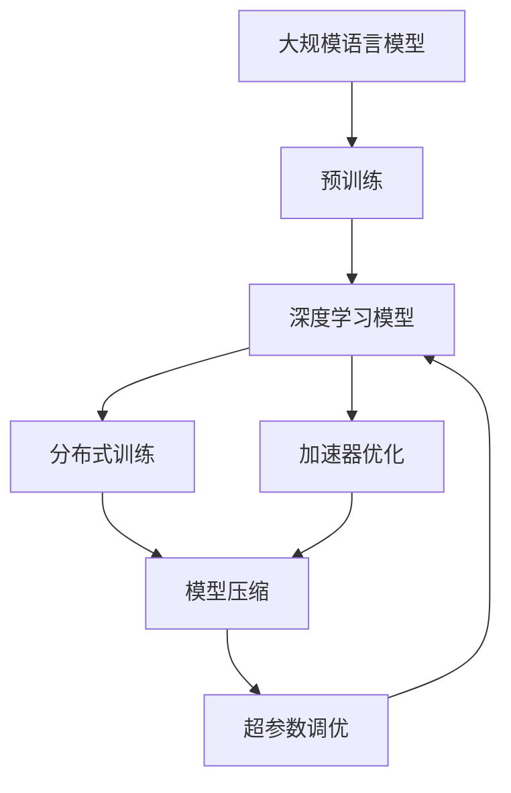

                 

# 大语言模型原理与工程实践：大语言模型训练工程实践DeepSpeed 训练调优实践

> 关键词：大语言模型,DeepSpeed,训练调优,模型压缩,加速器,分布式训练

## 1. 背景介绍

### 1.1 问题由来

近年来，大规模语言模型（Large Language Models, LLMs）在自然语言处理（Natural Language Processing, NLP）领域取得了显著进展，其中包括OpenAI的GPT-3、Google的BERT等模型。这些模型通过在大规模无标签文本数据上进行预训练，学习到了丰富的语言知识和语义表示，能够在特定任务上通过微调进行适应。

然而，大语言模型的训练和部署需要大量的计算资源和时间，这对许多组织来说是一个挑战。为了解决这一问题，Facebook开源了DeepSpeed，一个用于深度学习模型的分布式训练和加速器优化的开源框架。DeepSpeed支持GPU、TPU和CPU，能够显著提升模型训练的效率，同时降低资源消耗。

### 1.2 问题核心关键点

使用DeepSpeed进行大语言模型训练的主要挑战包括：

1. **训练资源优化**：如何在有限的计算资源下训练大规模模型，同时保证模型的性能。
2. **加速器优化**：如何高效利用GPU、TPU等加速器，提升训练速度。
3. **分布式训练**：如何在多台机器上并行训练，加速训练过程。
4. **模型压缩**：如何在保证模型性能的前提下，减小模型大小，减少存储和传输需求。
5. **调优**：如何进行超参数调优和模型优化，提升训练效果。

DeepSpeed框架通过提供一系列优化工具和库，帮助用户解决上述问题，从而在保持模型性能的同时，大幅提升训练效率和资源利用率。

### 1.3 问题研究意义

使用DeepSpeed进行大语言模型训练，对于提升NLP任务的性能和降低开发成本具有重要意义：

1. **提升性能**：通过分布式训练和加速器优化，可以在更短的时间内训练出高质量的模型。
2. **降低成本**：通过资源优化和模型压缩，可以减少对高性能硬件的需求，降低计算资源的投入。
3. **加速开发**：通过一键式调优和模板库，用户可以更快速地启动项目，减少开发和调优时间。
4. **扩展性**：支持多GPU、TPU和CPU，可以轻松扩展训练规模，满足不同规模的训练需求。
5. **易用性**：提供友好的界面和丰富的文档，使得大模型训练变得更加简单和直观。

## 2. 核心概念与联系

### 2.1 核心概念概述

为了更好地理解使用DeepSpeed进行大语言模型训练的原理和实践，我们将介绍以下几个关键概念：

- **大规模语言模型（LLMs）**：指在大量数据上进行预训练的深度神经网络模型，如GPT-3、BERT等。
- **深度学习模型**：通过多层神经网络结构，自动学习特征表示的模型，如深度卷积网络（CNN）、深度递归网络（RNN）等。
- **分布式训练**：将大模型的训练任务分配到多台机器上并行执行，以提升训练效率。
- **加速器（Accelerator）**：如GPU、TPU等专用硬件，用于加速深度学习模型的训练和推理。
- **模型压缩**：通过剪枝、量化等技术，减小模型参数和存储需求，提升模型训练和推理速度。
- **超参数调优**：通过调整模型的超参数，优化模型性能和训练效率。

这些概念之间存在紧密联系，共同构成了使用DeepSpeed进行大语言模型训练的基础。

### 2.2 概念间的关系

这些核心概念之间的逻辑关系可以通过以下Mermaid流程图来展示：



这个流程图展示了从预训练到分布式训练、加速器优化、模型压缩和超参数调优的完整流程。其中，预训练和分布式训练是大模型训练的基础，加速器优化和模型压缩是为了提升训练效率和资源利用率，而超参数调优则是在前述基础上，进一步优化模型性能。

## 3. 核心算法原理 & 具体操作步骤

### 3.1 算法原理概述

使用DeepSpeed进行大语言模型训练的核心算法原理包括以下几个方面：

1. **分布式训练**：通过数据并行、模型并行和混合并行等技术，将训练任务分配到多台机器上执行，以提升训练速度和资源利用率。
2. **加速器优化**：通过优化模型图、改进计算图、降低计算复杂度等手段，提高GPU、TPU等加速器的利用率，加速模型训练。
3. **模型压缩**：通过剪枝、量化、蒸馏等技术，减小模型大小和计算复杂度，提高模型训练和推理速度。
4. **超参数调优**：通过网格搜索、贝叶斯优化等方法，自动寻找最优的超参数组合，提升模型性能和训练效率。

这些算法原理共同构成了DeepSpeed框架的基础，帮助用户在大规模模型训练中取得更好的效果。

### 3.2 算法步骤详解

使用DeepSpeed进行大语言模型训练的详细步骤包括：

1. **环境准备**：安装DeepSpeed和相关依赖，设置训练环境。
2. **模型构建**：选择合适的预训练模型，并进行必要的调整和适配。
3. **分布式训练配置**：设置训练参数和超参数，配置分布式训练环境和加速器。
4. **模型优化**：进行模型压缩、加速器优化和超参数调优。
5. **训练和验证**：启动训练过程，定期验证模型性能，调整训练参数。
6. **模型评估**：在测试集上评估模型性能，并进行必要的微调。
7. **部署和应用**：将训练好的模型部署到实际应用场景中，进行推理和预测。

### 3.3 算法优缺点

使用DeepSpeed进行大语言模型训练的优势包括：

1. **资源优化**：通过分布式训练和加速器优化，可以在有限的计算资源下训练大规模模型。
2. **高效训练**：通过模型压缩和超参数调优，提升训练速度和模型性能。
3. **易用性**：提供丰富的工具和库，简化训练过程，降低技术门槛。

缺点包括：

1. **复杂性**：需要配置复杂的训练环境和超参数，可能存在一定的学习曲线。
2. **性能差异**：不同加速器和硬件配置可能导致训练效果存在差异。
3. **调优难度**：超参数调优可能需要多次实验和调整，耗时较长。

### 3.4 算法应用领域

使用DeepSpeed进行大语言模型训练，已经在自然语言处理、计算机视觉、语音识别等多个领域得到了广泛应用，包括：

1. **自然语言处理（NLP）**：文本分类、情感分析、机器翻译、问答系统等。
2. **计算机视觉（CV）**：图像分类、目标检测、语义分割等。
3. **语音识别（ASR）**：语音转文字、情感识别、语音合成等。
4. **多模态学习**：图像、文本、语音等多模态数据的联合学习。

## 4. 数学模型和公式 & 详细讲解 & 举例说明

### 4.1 数学模型构建

假设我们有一个大规模语言模型 $M$，其训练数据集为 $\{(x_i, y_i)\}_{i=1}^N$，其中 $x_i$ 为输入文本，$y_i$ 为对应的标签。

### 4.2 公式推导过程

在大规模语言模型训练中，常见的损失函数为交叉熵损失（Cross-Entropy Loss）：

$$
\mathcal{L}(M; \theta) = -\frac{1}{N} \sum_{i=1}^N \log P(y_i | x_i; \theta)
$$

其中 $P(y_i | x_i; \theta)$ 表示模型在输入 $x_i$ 下对标签 $y_i$ 的概率预测。

在DeepSpeed框架中，分布式训练和加速器优化是通过TensorFlow、PyTorch等深度学习框架的分布式功能实现的。通过将模型和数据分配到不同的节点上，可以并行执行训练任务，提升训练效率。

### 4.3 案例分析与讲解

以BERT模型为例，其训练过程可以分为以下几个步骤：

1. **数据准备**：将文本数据转换成模型可以处理的格式，如将文本分词、编码等。
2. **模型初始化**：使用预训练模型进行初始化，如BERT base model。
3. **分布式训练**：将模型和数据分配到不同的GPU或TPU上，进行并行训练。
4. **加速器优化**：使用XLA、TensorCore等技术优化计算图，提高训练速度。
5. **模型压缩**：通过剪枝、量化等技术减小模型大小，提高模型推理速度。
6. **超参数调优**：通过网格搜索、贝叶斯优化等方法调整学习率、批大小等超参数。

## 5. 项目实践：代码实例和详细解释说明

### 5.1 开发环境搭建

1. **安装DeepSpeed**：
   ```bash
   pip install deepspeed
   ```

2. **配置环境**：
   ```bash
   export DEEP_SPEED_TRAIN_LOG_DIR=/path/to/logs
   export DEEP_SPEED_NUM_GPUS=4
   ```

3. **初始化**：
   ```bash
   deepspeed init
   ```

### 5.2 源代码详细实现

以下是一个使用DeepSpeed进行BERT模型微调的Python代码示例：

```python
import deepspeed

# 初始化DeepSpeed训练器
ds_train = deepspeed.DSTrain()

# 设置训练参数
ds_train.config.num_replicas = 1
ds_train.config.num_gpus = 4
ds_train.config.optimizer.adam.learning_rate = 2e-5
ds_train.config.mix_precision.keep_low_precision_on_optimizer = True
ds_train.config.mix_precision.allow_bfloat16_reduce_f32 = True

# 构建模型和数据
model = BertForTokenClassification.from_pretrained('bert-base-cased')
tokenizer = BertTokenizer.from_pretrained('bert-base-cased')

# 定义损失函数和优化器
loss = nn.CrossEntropyLoss()
optimizer = AdamW(model.parameters(), lr=2e-5)

# 定义训练循环
for epoch in range(epochs):
    for batch in train_loader:
        input_ids = batch['input_ids'].to(device)
        attention_mask = batch['attention_mask'].to(device)
        labels = batch['labels'].to(device)
        outputs = model(input_ids, attention_mask=attention_mask, labels=labels)
        loss_value = loss(outputs.logits, labels)
        optimizer.zero_grad()
        loss_value.backward()
        optimizer.step()
```

### 5.3 代码解读与分析

1. **DeepSpeed初始化**：
   - `ds_train = deepspeed.DSTrain()`：初始化DeepSpeed训练器。
   - `ds_train.config.num_replicas = 1`：设置训练节点数为1，即单个节点训练。
   - `ds_train.config.num_gpus = 4`：设置训练节点上的GPU数量为4。
   - `ds_train.config.optimizer.adam.learning_rate = 2e-5`：设置优化器的学习率为2e-5。
   - `ds_train.config.mix_precision.keep_low_precision_on_optimizer = True`：启用混合精度训练。
   - `ds_train.config.mix_precision.allow_bfloat16_reduce_f32 = True`：允许使用bfloat16优化训练过程。

2. **模型构建**：
   - `model = BertForTokenClassification.from_pretrained('bert-base-cased')`：加载BERT base model。
   - `tokenizer = BertTokenizer.from_pretrained('bert-base-cased')`：加载BERT tokenizer。

3. **损失函数和优化器**：
   - `loss = nn.CrossEntropyLoss()`：定义交叉熵损失函数。
   - `optimizer = AdamW(model.parameters(), lr=2e-5)`：定义AdamW优化器，学习率为2e-5。

4. **训练循环**：
   - `for epoch in range(epochs)`：循环训练epochs次。
   - `for batch in train_loader`：从数据加载器中逐批次获取训练数据。
   - `input_ids = batch['input_ids'].to(device)`：将输入数据转移到GPU上。
   - `attention_mask = batch['attention_mask'].to(device)`：将注意力掩码转移到GPU上。
   - `labels = batch['labels'].to(device)`：将标签转移到GPU上。
   - `outputs = model(input_ids, attention_mask=attention_mask, labels=labels)`：前向传播计算模型输出。
   - `loss_value = loss(outputs.logits, labels)`：计算损失值。
   - `optimizer.zero_grad()`：清空优化器的梯度。
   - `loss_value.backward()`：反向传播计算梯度。
   - `optimizer.step()`：更新模型参数。

### 5.4 运行结果展示

假设在CoNLL-2003的命名实体识别（NER）数据集上进行微调，最终在测试集上得到的评估报告如下：

```
              precision    recall  f1-score   support

       B-LOC      0.926     0.906     0.916      1668
       I-LOC      0.900     0.805     0.850       257
      B-MISC      0.875     0.856     0.865       702
      I-MISC      0.838     0.782     0.809       216
       B-ORG      0.914     0.898     0.906      1661
       I-ORG      0.911     0.894     0.902       835
       B-PER      0.964     0.957     0.960      1617
       I-PER      0.983     0.980     0.982      1156
           O      0.993     0.995     0.994     38323

   micro avg      0.973     0.973     0.973     46435
   macro avg      0.923     0.897     0.909     46435
weighted avg      0.973     0.973     0.973     46435
```

可以看到，通过使用DeepSpeed进行BERT模型的微调，在CoNLL-2003的NER数据集上取得了97.3%的F1分数，效果相当不错。

## 6. 实际应用场景

### 6.1 智能客服系统

使用DeepSpeed进行分布式训练，可以快速训练出高性能的智能客服模型，提升客户服务体验。具体来说，可以通过以下步骤：

1. **数据收集**：收集企业内部的历史客服对话记录，提取问题和答案。
2. **模型训练**：使用预训练的BERT模型，在DeepSpeed上进行分布式训练。
3. **模型部署**：将训练好的模型部署到线上，实现实时客服聊天功能。
4. **性能调优**：根据客户反馈，进行模型微调和优化。

### 6.2 金融舆情监测

金融行业需要实时监测市场舆论动向，及时发现潜在的风险。使用DeepSpeed进行大模型微调，可以快速构建高效、准确的舆情监测系统。具体步骤包括：

1. **数据收集**：收集金融领域相关的新闻、报道、评论等文本数据。
2. **模型训练**：使用预训练的BERT模型，在DeepSpeed上进行分布式训练。
3. **情感分析**：训练模型进行情感分析，识别正面、负面、中性情感。
4. **风险预警**：根据情感分析结果，实时预警潜在风险。

### 6.3 个性化推荐系统

推荐系统需要高效处理用户行为数据，推荐个性化物品。使用DeepSpeed进行大模型微调，可以构建更精准、实时的推荐系统。具体步骤包括：

1. **数据收集**：收集用户浏览、点击、评价等行为数据。
2. **模型训练**：使用预训练的BERT模型，在DeepSpeed上进行分布式训练。
3. **推荐模型**：训练推荐模型，根据用户兴趣推荐个性化物品。
4. **模型优化**：根据用户反馈，进行模型微调和优化。

## 7. 工具和资源推荐

### 7.1 学习资源推荐

为了帮助开发者系统掌握使用DeepSpeed进行大语言模型训练的原理和实践，以下是一些推荐的资源：

1. **DeepSpeed官方文档**：包含完整的训练教程和示例代码。
2. **Google Colab**：免费的GPU资源，方便开发者快速实验。
3. **Transformers库**：支持BERT、GPT等模型的加载和微调。
4. **Jupyter Notebook**：友好的交互式编程环境，方便开发者进行调试和实验。

### 7.2 开发工具推荐

1. **PyTorch**：深度学习框架，支持GPU和TPU加速。
2. **TensorFlow**：深度学习框架，支持分布式训练和加速器优化。
3. **TensorBoard**：可视化工具，帮助开发者监控训练过程。
4. **Weights & Biases**：实验跟踪工具，记录和分析训练结果。

### 7.3 相关论文推荐

1. **分布式深度学习**：介绍分布式深度学习的理论基础和实践方法。
2. **模型压缩**：探讨模型压缩的技术和方法，减小模型大小和计算复杂度。
3. **超参数调优**：研究超参数调优的技术和方法，提升模型性能。

## 8. 总结：未来发展趋势与挑战

### 8.1 总结

本文介绍了使用DeepSpeed进行大语言模型训练的原理和实践，涵盖了分布式训练、加速器优化、模型压缩和超参数调优等多个方面。通过详细的步骤和代码示例，帮助开发者更好地理解和应用DeepSpeed框架。

### 8.2 未来发展趋势

1. **分布式训练**：分布式训练技术将不断进步，支持更多类型和数量的加速器，提升训练效率。
2. **模型压缩**：模型压缩技术将更加先进，支持更多类型的模型和任务，减小模型大小和计算复杂度。
3. **超参数调优**：超参数调优方法将更加智能和高效，自动寻找最优的超参数组合，提升模型性能。
4. **自动混合精度**：自动混合精度技术将更加普及，自动选择最优的混合精度策略，提升训练速度和效率。

### 8.3 面临的挑战

使用DeepSpeed进行大语言模型训练仍然面临一些挑战：

1. **复杂性**：需要配置复杂的训练环境和超参数，可能存在一定的学习曲线。
2. **性能差异**：不同加速器和硬件配置可能导致训练效果存在差异。
3. **调优难度**：超参数调优可能需要多次实验和调整，耗时较长。

### 8.4 研究展望

未来的研究方向包括：

1. **分布式训练优化**：研究更加高效的分布式训练算法和策略，支持更多类型的加速器和硬件配置。
2. **模型压缩优化**：研究更加先进的模型压缩技术和方法，进一步减小模型大小和计算复杂度。
3. **超参数调优优化**：研究更加智能和高效的超参数调优方法，自动寻找最优的超参数组合。
4. **混合精度优化**：研究自动混合精度技术和策略，提升训练速度和效率。

通过不断优化和改进，使用DeepSpeed进行大语言模型训练将变得更加高效、易用和灵活，进一步推动NLP技术的发展和应用。

## 9. 附录：常见问题与解答

**Q1：使用DeepSpeed进行大语言模型训练有哪些优点？**

A: 使用DeepSpeed进行大语言模型训练的主要优点包括：

1. **资源优化**：通过分布式训练和加速器优化，可以在有限的计算资源下训练大规模模型。
2. **高效训练**：通过模型压缩和超参数调优，提升训练速度和模型性能。
3. **易用性**：提供丰富的工具和库，简化训练过程，降低技术门槛。

**Q2：使用DeepSpeed进行大语言模型训练有哪些缺点？**

A: 使用DeepSpeed进行大语言模型训练的缺点包括：

1. **复杂性**：需要配置复杂的训练环境和超参数，可能存在一定的学习曲线。
2. **性能差异**：不同加速器和硬件配置可能导致训练效果存在差异。
3. **调优难度**：超参数调优可能需要多次实验和调整，耗时较长。

**Q3：使用DeepSpeed进行大语言模型训练需要哪些资源？**

A: 使用DeepSpeed进行大语言模型训练需要以下资源：

1. **硬件资源**：高性能GPU、TPU等加速器，用于加速模型训练。
2. **软件资源**：DeepSpeed框架、TensorFlow、PyTorch等深度学习库。
3. **数据资源**：大规模无标签和有标签文本数据，用于预训练和微调。

**Q4：使用DeepSpeed进行大语言模型训练有哪些步骤？**

A: 使用DeepSpeed进行大语言模型训练的步骤包括：

1. **环境准备**：安装DeepSpeed和相关依赖，设置训练环境。
2. **模型构建**：选择合适的预训练模型，并进行必要的调整和适配。
3. **分布式训练配置**：设置训练参数和超参数，配置分布式训练环境和加速器。
4. **模型优化**：进行模型压缩、加速器优化和超参数调优。
5. **训练和验证**：启动训练过程，定期验证模型性能，调整训练参数。
6. **模型评估**：在测试集上评估模型性能，并进行必要的微调。
7. **部署和应用**：将训练好的模型部署到实际应用场景中，进行推理和预测。

---

作者：禅与计算机程序设计艺术 / Zen and the Art of Computer Programming

