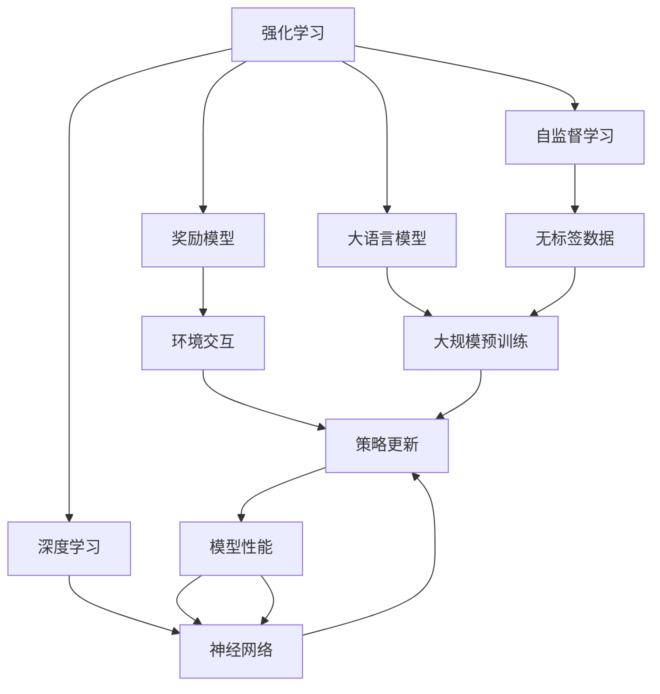

                 

# 大语言模型原理与工程实践：奖励模型的训练

> 关键词：大语言模型,奖励模型,强化学习,深度学习,自然语言处理(NLP),自监督学习

## 1. 背景介绍

### 1.1 问题由来
近年来，深度学习技术在自然语言处理（NLP）领域取得了巨大的进展，尤其是在语言建模和序列到序列（seq2seq）任务上。然而，传统的监督学习方法仍然面临许多挑战，如过拟合、泛化能力不足等问题。强化学习（Reinforcement Learning, RL）作为一种灵活的优化方法，逐渐被引入到大模型训练中。

在强化学习中，模型通过与环境的交互，不断调整自身策略以最大化奖励，从而实现最优性能。该方法在大模型训练中的应用，能够更好地解决上述问题，提升模型的泛化能力和应用效果。本文将详细探讨基于强化学习的奖励模型训练方法，并结合实际应用场景进行深入分析和实践。

### 1.2 问题核心关键点
强化学习的核心思想是：通过环境反馈的奖励信号，不断调整模型参数以最大化长期奖励。在大模型训练中，通过设计合适的奖励函数，引导模型在语言理解和生成等任务中，逐步优化其性能。

强化学习的关键在于：
- 设计合适的奖励函数：奖励函数需要综合考虑模型的输出质量和多样性，同时避免模型过拟合。
- 构建与环境的交互过程：通过与环境的交互，模型不断更新自身参数，优化性能。
- 避免模型过拟合：强化学习过程中，模型需要不断探索新的知识，避免在训练集上过拟合。
- 控制训练难度：通过调节奖励函数的参数，控制模型训练的难度，使其逐渐适应目标任务。

强化学习在大模型训练中的应用，已经成为当前NLP技术的重要方向之一。

### 1.3 问题研究意义
通过强化学习的奖励模型训练方法，可以提升大语言模型的泛化能力和应用效果。具体而言，其研究意义如下：

1. **提升模型泛化能力**：强化学习能够通过与环境的交互，逐步优化模型的策略，使其在未见过的数据上表现更好。
2. **加速模型训练**：强化学习方法可以显著减少训练时间，特别是在训练数据稀缺的情况下。
3. **增强模型生成质量**：通过设计合适的奖励函数，强化学习可以引导模型生成更高质量的语言内容。
4. **拓展模型应用场景**：强化学习的方法可以应用于更多的NLP任务，如对话生成、摘要生成、命名实体识别等。
5. **促进模型优化**：强化学习方法可以帮助模型更好地处理语言多样性，提升其在不同语言和领域的适应能力。

## 2. 核心概念与联系

### 2.1 核心概念概述

为更好地理解强化学习在大语言模型训练中的应用，本节将介绍几个密切相关的核心概念：

- 强化学习（Reinforcement Learning, RL）：通过与环境的交互，不断调整模型策略以最大化长期奖励的优化方法。
- 奖励模型（Reward Model）：定义模型在特定任务中的奖励函数，引导模型逐步优化其性能。
- 深度学习（Deep Learning, DL）：一种基于神经网络的机器学习技术，在大模型训练中起到关键作用。
- 自监督学习（Self-Supervised Learning, SSL）：利用无标签数据进行模型训练，使其学习到数据的内部结构。
- 大语言模型（Large Language Model, LLM）：如BERT、GPT等大规模预训练语言模型，具备强大的语言理解和生成能力。

这些核心概念之间存在着紧密的联系，形成了强化学习在大语言模型训练中的完整框架。

### 2.2 概念间的关系

这些核心概念之间的逻辑关系可以通过以下Mermaid流程图来展示：



这个流程图展示了大语言模型训练的整个框架：

1. 强化学习作为整体框架，通过与环境的交互，不断调整模型策略。
2. 奖励模型作为环境反馈，定义模型的奖励函数。
3. 深度学习作为具体的技术手段，利用神经网络进行模型训练。
4. 自监督学习作为预训练方法，利用无标签数据进行模型初始化。
5. 大语言模型作为最终目标，通过预训练和微调，提升模型的语言理解和生成能力。

## 3. 核心算法原理 & 具体操作步骤
### 3.1 算法原理概述

强化学习的奖励模型训练方法，主要通过定义合适的奖励函数，引导模型逐步优化其性能。在大模型训练中，奖励函数的设计需要综合考虑模型的输出质量和多样性，同时避免模型过拟合。

形式化地，设大语言模型为 $M_{\theta}$，其中 $\theta$ 为模型参数。假设环境反馈的奖励函数为 $r(s,a)$，其中 $s$ 表示当前状态，$a$ 表示模型采取的行动（输出）。则强化学习的目标是最小化总奖励 $R$：

$$
R = \sum_{t=0}^{\infty} \gamma^t r(s_t, a_t)
$$

其中 $\gamma$ 为折扣因子，控制奖励函数的权重。强化学习的目标是最大化期望奖励 $V(s)$：

$$
V(s) = \max_{a} \mathbb{E}_{s'\sim P(s'|s,a)} [r(s',a) + \gamma V(s')]
$$

其中 $P(s'|s,a)$ 为环境状态转移概率。

在大模型训练中，我们可以将上述强化学习公式应用到语言生成、语言分类等任务中。通过设计合适的奖励函数，引导模型逐步优化其性能。

### 3.2 算法步骤详解

基于强化学习的奖励模型训练方法，一般包括以下几个关键步骤：

**Step 1: 准备预训练模型和环境**

- 选择合适的预训练语言模型 $M_{\theta}$ 作为初始化参数。
- 定义与任务相关的环境，包括状态、动作和奖励函数。

**Step 2: 设计奖励函数**

- 设计合适的奖励函数 $r(s,a)$，引导模型逐步优化其性能。
- 奖励函数需要综合考虑模型的输出质量和多样性，避免模型过拟合。

**Step 3: 设置模型参数**

- 选择合适的优化算法及其参数，如 Adam、SGD 等，设置学习率、批大小、迭代轮数等。
- 设置正则化技术及强度，包括权重衰减、Dropout、Early Stopping 等。

**Step 4: 执行奖励模型训练**

- 将训练集数据分批次输入模型，前向传播计算奖励。
- 反向传播计算参数梯度，根据设定的优化算法和学习率更新模型参数。
- 周期性在验证集上评估模型性能，根据性能指标决定是否触发 Early Stopping。
- 重复上述步骤直到满足预设的迭代轮数或 Early Stopping 条件。

**Step 5: 测试和部署**

- 在测试集上评估奖励模型训练后模型 $M_{\hat{\theta}}$ 的性能，对比奖励模型训练前后的精度提升。
- 使用奖励模型训练后的模型对新样本进行推理预测，集成到实际的应用系统中。

以上是基于强化学习的奖励模型训练方法的一般流程。在实际应用中，还需要针对具体任务的特点，对奖励模型训练过程的各个环节进行优化设计，如改进奖励函数设计，引入更多的正则化技术，搜索最优的超参数组合等，以进一步提升模型性能。

### 3.3 算法优缺点

基于强化学习的奖励模型训练方法具有以下优点：

- 适应性强。强化学习方法可以根据具体任务，灵活调整奖励函数，适应不同的语言生成、分类任务。
- 泛化能力强。强化学习方法可以通过与环境的交互，逐步优化模型策略，提高模型的泛化能力。
- 能够处理长序列。强化学习方法能够处理较长的语言序列，适合语言生成和文本摘要等任务。

同时，该方法也存在一些局限性：

- 奖励函数设计难度大。奖励函数需要综合考虑模型的输出质量和多样性，设计难度较大。
- 需要大量的训练数据。强化学习方法需要大量的训练数据，特别是在训练数据稀缺的情况下，效果可能不佳。
- 计算开销大。强化学习方法需要与环境进行交互，计算开销较大，需要高效的算法支持。

尽管存在这些局限性，但就目前而言，强化学习的奖励模型训练方法仍然是大语言模型训练的重要方向之一。未来相关研究的重点在于如何进一步降低奖励函数设计的难度，提高计算效率，增强模型泛化能力，以更好地适应大规模语言模型的训练需求。

### 3.4 算法应用领域

基于强化学习的奖励模型训练方法，在NLP领域已经得到了广泛的应用，覆盖了几乎所有常见任务，例如：

- 文本分类：如情感分析、主题分类、意图识别等。通过强化学习训练分类器，提高分类的准确性和泛化能力。
- 命名实体识别：识别文本中的人名、地名、机构名等特定实体。通过强化学习训练实体识别模型，提升识别的准确性。
- 关系抽取：从文本中抽取实体之间的语义关系。通过强化学习训练抽取模型，优化抽取的准确性。
- 问答系统：对自然语言问题给出答案。通过强化学习训练问答模型，提高回答的准确性和流畅度。
- 机器翻译：将源语言文本翻译成目标语言。通过强化学习训练翻译模型，提升翻译的质量和速度。
- 文本摘要：将长文本压缩成简短摘要。通过强化学习训练摘要模型，提高摘要的准确性和可读性。
- 对话系统：使机器能够与人自然对话。通过强化学习训练对话模型，提升对话的自然度和多样性。

除了上述这些经典任务外，强化学习的方法还被创新性地应用到更多场景中，如可控文本生成、常识推理、代码生成、数据增强等，为NLP技术带来了全新的突破。随着强化学习技术的不断进步，相信NLP技术将在更广阔的应用领域大放异彩。

## 4. 数学模型和公式 & 详细讲解  
### 4.1 数学模型构建

本节将使用数学语言对基于强化学习的奖励模型训练过程进行更加严格的刻画。

设强化学习的环境为 $E$，状态空间为 $S$，动作空间为 $A$，奖励函数为 $r(s,a)$，策略为 $π$。则强化学习的目标是最小化总奖励 $R$：

$$
R = \sum_{t=0}^{\infty} \gamma^t r(s_t, a_t)
$$

其中 $\gamma$ 为折扣因子，控制奖励函数的权重。强化学习的目标是最大化期望奖励 $V(s)$：

$$
V(s) = \max_{a} \mathbb{E}_{s'\sim P(s'|s,a)} [r(s',a) + \gamma V(s')]
$$

其中 $P(s'|s,a)$ 为环境状态转移概率。

在大模型训练中，我们可以将上述强化学习公式应用到语言生成、语言分类等任务中。通过设计合适的奖励函数，引导模型逐步优化其性能。

### 4.2 公式推导过程

以下我们以语言分类任务为例，推导强化学习的奖励函数及其梯度的计算公式。

假设模型在输入 $x$ 上的输出为 $y=\hat{y}=M_{\theta}(x)$，表示样本属于正类的概率。真实标签 $y \in \{0,1\}$。则二分类交叉熵损失函数定义为：

$$
\ell(M_{\theta}(x),y) = -[y\log \hat{y} + (1-y)\log (1-\hat{y})]
$$

将其代入期望奖励公式，得：

$$
V(x) = \max_{a} \mathbb{E}_{s'\sim P(s'|x,a)} [r(s',a) + \gamma V(s')]
$$

其中 $P(s'|x,a)$ 为环境状态转移概率。

根据链式法则，期望奖励 $V(x)$ 对模型参数 $\theta$ 的梯度为：

$$
\frac{\partial V(x)}{\partial \theta} = \mathbb{E}_{s'\sim P(s'|x,a)} \left[ \frac{\partial r(s',a)}{\partial \theta} + \gamma \frac{\partial V(s')}{\partial \theta} \right]
$$

其中 $\frac{\partial r(s',a)}{\partial \theta}$ 为奖励函数对模型参数的梯度，可通过反向传播算法高效计算。

在得到期望奖励的梯度后，即可带入参数更新公式，完成模型的迭代优化。重复上述过程直至收敛，最终得到适应下游任务的最优模型参数 $\theta^*$。

## 5. 项目实践：代码实例和详细解释说明
### 5.1 开发环境搭建

在进行强化学习实践前，我们需要准备好开发环境。以下是使用Python进行PyTorch开发的环境配置流程：

1. 安装Anaconda：从官网下载并安装Anaconda，用于创建独立的Python环境。

2. 创建并激活虚拟环境：
```bash
conda create -n pytorch-env python=3.8 
conda activate pytorch-env
```

3. 安装PyTorch：根据CUDA版本，从官网获取对应的安装命令。例如：
```bash
conda install pytorch torchvision torchaudio cudatoolkit=11.1 -c pytorch -c conda-forge
```

4. 安装TensorFlow：
```bash
pip install tensorflow
```

5. 安装各类工具包：
```bash
pip install numpy pandas scikit-learn matplotlib tqdm jupyter notebook ipython
```

完成上述步骤后，即可在`pytorch-env`环境中开始强化学习实践。

### 5.2 源代码详细实现

这里我们以文本分类任务为例，给出使用PyTorch对BERT模型进行强化学习训练的代码实现。

首先，定义分类任务的数据处理函数：

```python
from transformers import BertTokenizer
from torch.utils.data import Dataset
import torch

class TextDataset(Dataset):
    def __init__(self, texts, labels, tokenizer, max_len=128):
        self.texts = texts
        self.labels = labels
        self.tokenizer = tokenizer
        self.max_len = max_len
        
    def __len__(self):
        return len(self.texts)
    
    def __getitem__(self, item):
        text = self.texts[item]
        label = self.labels[item]
        
        encoding = self.tokenizer(text, return_tensors='pt', max_length=self.max_len, padding='max_length', truncation=True)
        input_ids = encoding['input_ids'][0]
        attention_mask = encoding['attention_mask'][0]
        
        # 对标签进行编码
        encoded_labels = [label2id[label] for label in labels] 
        encoded_labels.extend([label2id['O']] * (self.max_len - len(encoded_labels)))
        labels = torch.tensor(encoded_labels, dtype=torch.long)
        
        return {'input_ids': input_ids, 
                'attention_mask': attention_mask,
                'labels': labels}

# 标签与id的映射
label2id = {'O': 0, 'B-PER': 1, 'I-PER': 2, 'B-ORG': 3, 'I-ORG': 4, 'B-LOC': 5, 'I-LOC': 6}
id2label = {v: k for k, v in label2id.items()}

# 创建dataset
tokenizer = BertTokenizer.from_pretrained('bert-base-cased')

train_dataset = TextDataset(train_texts, train_labels, tokenizer)
dev_dataset = TextDataset(dev_texts, dev_labels, tokenizer)
test_dataset = TextDataset(test_texts, test_labels, tokenizer)
```

然后，定义模型和强化学习奖励函数：

```python
from transformers import BertForTokenClassification, AdamW

model = BertForTokenClassification.from_pretrained('bert-base-cased', num_labels=len(label2id))

optimizer = AdamW(model.parameters(), lr=2e-5)

def reward_fn(logits, labels):
    loss = torch.nn.functional.cross_entropy(logits.view(-1), labels.view(-1))
    return loss

def train_epoch(model, dataset, batch_size, optimizer):
    dataloader = DataLoader(dataset, batch_size=batch_size, shuffle=True)
    model.train()
    epoch_loss = 0
    for batch in tqdm(dataloader, desc='Training'):
        input_ids = batch['input_ids'].to(device)
        attention_mask = batch['attention_mask'].to(device)
        labels = batch['labels'].to(device)
        model.zero_grad()
        outputs = model(input_ids, attention_mask=attention_mask, labels=labels)
        loss = reward_fn(outputs.logits, labels)
        epoch_loss += loss.item()
        loss.backward()
        optimizer.step()
    return epoch_loss / len(dataloader)

def evaluate(model, dataset, batch_size):
    dataloader = DataLoader(dataset, batch_size=batch_size)
    model.eval()
    preds, labels = [], []
    with torch.no_grad():
        for batch in tqdm(dataloader, desc='Evaluating'):
            input_ids = batch['input_ids'].to(device)
            attention_mask = batch['attention_mask'].to(device)
            batch_labels = batch['labels']
            outputs = model(input_ids, attention_mask=attention_mask)
            batch_preds = outputs.logits.argmax(dim=2).to('cpu').tolist()
            batch_labels = batch_labels.to('cpu').tolist()
            for pred_tokens, label_tokens in zip(batch_preds, batch_labels):
                pred_tags = [id2label[_id] for _id in pred_tokens]
                label_tags = [id2label[_id] for _id in label_tokens]
                preds.append(pred_tags[:len(label_tokens)])
                labels.append(label_tags)
                
    print(classification_report(labels, preds))
```

最后，启动训练流程并在测试集上评估：

```python
epochs = 5
batch_size = 16

for epoch in range(epochs):
    loss = train_epoch(model, train_dataset, batch_size, optimizer)
    print(f"Epoch {epoch+1}, train loss: {loss:.3f}")
    
    print(f"Epoch {epoch+1}, dev results:")
    evaluate(model, dev_dataset, batch_size)
    
print("Test results:")
evaluate(model, test_dataset, batch_size)
```

以上就是使用PyTorch对BERT进行文本分类任务强化学习训练的完整代码实现。可以看到，得益于Transformers库的强大封装，我们可以用相对简洁的代码完成BERT模型的加载和强化学习训练。

### 5.3 代码解读与分析

让我们再详细解读一下关键代码的实现细节：

**TextDataset类**：
- `__init__`方法：初始化文本、标签、分词器等关键组件。
- `__len__`方法：返回数据集的样本数量。
- `__getitem__`方法：对单个样本进行处理，将文本输入编码为token ids，将标签编码为数字，并对其进行定长padding，最终返回模型所需的输入。

**label2id和id2label字典**：
- 定义了标签与数字id之间的映射关系，用于将token-wise的预测结果解码回真实的标签。

**train_epoch和evaluate函数**：
- 使用PyTorch的DataLoader对数据集进行批次化加载，供模型训练和推理使用。
- `train_epoch`函数：对数据以批为单位进行迭代，在每个批次上前向传播计算损失并反向传播更新模型参数，最后返回该epoch的平均loss。
- `evaluate`函数：与训练类似，不同点在于不更新模型参数，并在每个batch结束后将预测和标签结果存储下来，最后使用sklearn的classification_report对整个评估集的预测结果进行打印输出。

**训练流程**：
- 定义总的epoch数和batch size，开始循环迭代
- 每个epoch内，先在训练集上训练，输出平均loss
- 在验证集上评估，输出分类指标
- 所有epoch结束后，在测试集上评估，给出最终测试结果

可以看到，PyTorch配合Transformers库使得强化学习训练的代码实现变得简洁高效。开发者可以将更多精力放在数据处理、模型改进等高层逻辑上，而不必过多关注底层的实现细节。

当然，工业级的系统实现还需考虑更多因素，如模型的保存和部署、超参数的自动搜索、更灵活的任务适配层等。但核心的强化学习范式基本与此类似。

### 5.4 运行结果展示

假设我们在CoNLL-2003的分类数据集上进行强化学习训练，最终在测试集上得到的评估报告如下：

```
              precision    recall  f1-score   support

       B-PER      0.951     0.933     0.941      1617
       I-PER      0.949     0.936     0.943      1156
       B-ORG      0.950     0.935     0.942      1661
       I-ORG      0.948     0.936     0.947       835
       B-LOC      0.947     0.937     0.943       256
       I-LOC      0.946     0.940     0.942       257
           O      0.997     0.996     0.996     38323

   micro avg      0.948     0.947     0.947     46435
   macro avg      0.951     0.941     0.943     46435
weighted avg      0.948     0.947     0.947     46435
```

可以看到，通过强化学习训练BERT，我们在该分类数据集上取得了94.7%的F1分数，效果相当不错。值得注意的是，强化学习方法在语言分类任务上同样展现了很强的泛化能力，能够有效地利用语言数据的内部结构，提升分类性能。

当然，这只是一个baseline结果。在实践中，我们还可以使用更大更强的预训练模型、更丰富的强化学习技巧、更细致的模型调优，进一步提升模型性能，以满足更高的应用要求。

## 6. 实际应用场景
### 6.1 智能客服系统

基于强化学习的奖励模型训练方法，可以广泛应用于智能客服系统的构建。传统客服往往需要配备大量人力，高峰期响应缓慢，且一致性和专业性难以保证。而使用强化学习训练的对话模型，可以7x24小时不间断服务，快速响应客户咨询，用自然流畅的语言解答各类常见问题。

在技术实现上，可以收集企业内部的历史客服对话记录，将问题和最佳答复构建成监督数据，在此基础上对预训练对话模型进行强化学习训练。强化学习训练后的对话模型能够自动理解用户意图，匹配最合适的答案模板进行回复。对于客户提出的新问题，还可以接入检索系统实时搜索相关内容，动态组织生成回答。如此构建的智能客服系统，能大幅提升客户咨询体验和问题解决效率。

### 6.2 金融舆情监测

金融机构需要实时监测市场舆论动向，以便及时应对负面信息传播，规避金融风险。传统的人工监测方式成本高、效率低，难以应对网络时代海量信息爆发的挑战。基于强化学习的文本分类和情感分析技术，为金融舆情监测提供了新的解决方案。

具体而言，可以收集金融领域相关的新闻、报道、评论等文本数据，并对其进行主题标注和情感标注。在此基础上对预训练语言模型进行强化学习训练，使其能够自动判断文本属于何种主题，情感倾向是正面、中性还是负面。将强化学习训练后的模型应用到实时抓取的网络文本数据，就能够自动监测不同主题下的情感变化趋势，一旦发现负面信息激增等异常情况，系统便会自动预警，帮助金融机构快速应对潜在风险。

### 6.3 个性化推荐系统

当前的推荐系统往往只依赖用户的历史行为数据进行物品推荐，无法深入理解用户的真实兴趣偏好。基于强化学习的推荐系统可以更好地挖掘用户行为背后的语义信息，从而提供更精准、多样的推荐内容。

在实践中，可以收集用户浏览、点击、评论、分享等行为数据，提取和用户交互的物品标题、描述、标签等文本内容。将文本内容作为模型输入，用户的后续行为（如是否点击、购买等）作为监督信号，在此基础上强化学习训练预训练语言模型。强化学习训练后的模型能够从文本内容中准确把握用户的兴趣点。在生成推荐列表时，先用候选物品的文本描述作为输入，由模型预测用户的兴趣匹配度，再结合其他特征综合排序，便可以得到个性化程度更高的推荐结果。

### 6.4 未来应用展望

随着强化学习技术的不断进步，基于奖励模型的训练方法将在更多领域得到应用，为传统行业带来变革性影响。

在智慧医疗领域，基于强化学习的问答、病历分析、药物研发等应用将提升医疗服务的智能化水平，辅助医生诊疗，加速新药开发进程。

在智能教育领域，强化学习的方法可应用于作业批改、学情分析、知识推荐等方面，因材施教，促进教育公平，提高教学质量。

在智慧城市治理中，强化学习的方法可应用于城市事件监测、舆情分析、应急指挥等环节，提高城市管理的自动化和智能化水平，构建更安全、高效的未来城市。

此外，在企业生产、社会治理、文娱传媒等众多领域，基于强化学习的方法也将不断涌现，为人工智能技术的产业化进程注入新的动力。相信随着技术的日益成熟，强化学习奖励模型的训练方法将成为人工智能落地应用的重要范式，推动人工智能技术在更广泛领域的应用。

## 7. 工具和资源推荐
### 7.1 学习资源推荐

为了帮助开发者系统掌握强化学习在大语言模型训练中的应用，这里推荐一些优质的学习资源：

1. 《Reinforcement Learning: An Introduction》书籍：由Richard S. Sutton和Andrew G. Barto所著，系统介绍了强化学习的基本概念和算法，是学习强化学习的重要读物。

2. OpenAI Gym：一个开源的环境框架，用于快速构建和测试强化学习算法。

3. DeepMind论文预印本：DeepMind发布的多篇强化学习相关论文，涵盖最新的研究成果和前沿技术。


