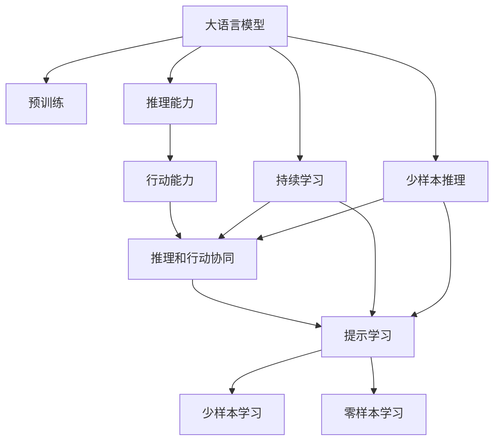
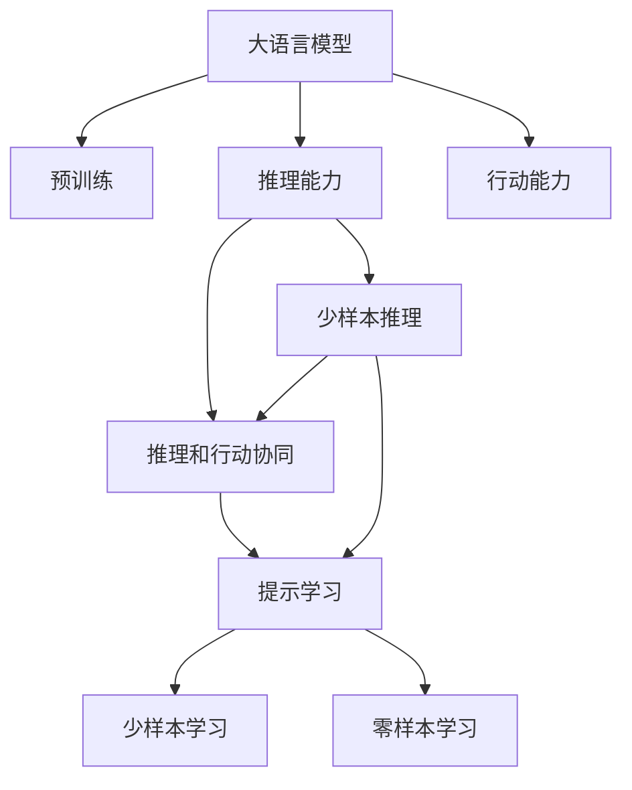
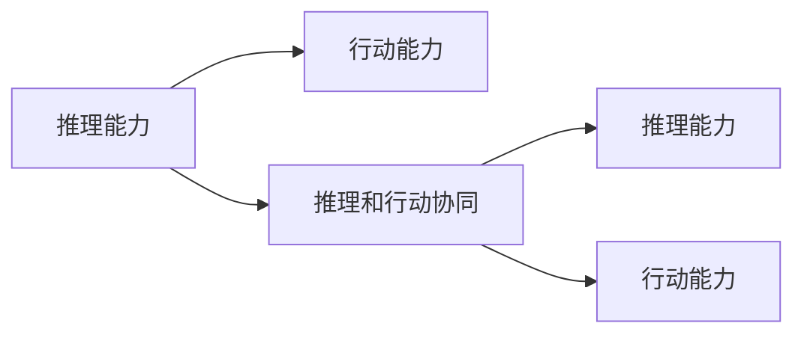
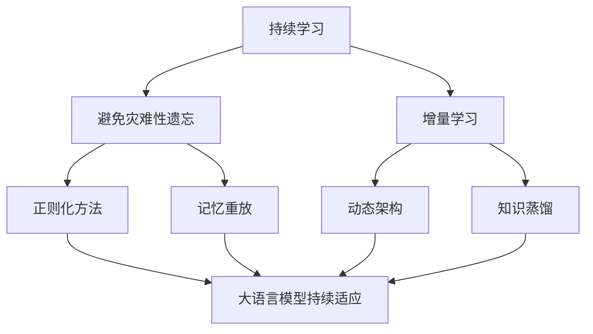
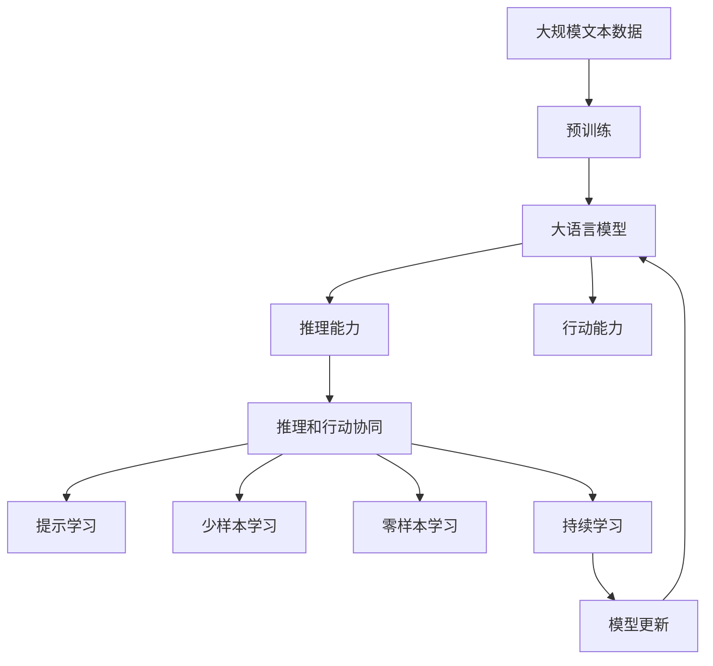

                 

# 大语言模型原理与工程实践：推理和行动协同技术

## 1. 背景介绍

### 1.1 问题由来

近年来，随着深度学习技术的快速发展，自然语言处理（Natural Language Processing, NLP）领域取得了巨大的突破。特别是基于大规模预训练语言模型的大语言模型（Large Language Models, LLMs），如OpenAI的GPT系列、Google的BERT、Hugging Face的T5等，在各类NLP任务上取得了前所未有的优异表现。

这些大语言模型通过在大规模无标签文本数据上进行预训练，学习到丰富的语言知识和常识，并在特定的下游任务上进行微调，显著提升了任务的性能。但这些模型通常在推理和行动（如对自然语言指令的执行）方面表现不足，限制了其在实际应用场景中的效用。

### 1.2 问题核心关键点

当前，大语言模型的推理和行动协同技术的研究刚刚起步，但仍面临着诸多挑战。如何在大语言模型中加入推理能力，使其能够执行各种自然语言指令，成为了人工智能领域的重要研究课题。

具体而言，问题核心关键点包括：
1. **推理能力引入**：如何在模型中引入推理能力，使其能够执行基于语言的任务？
2. **执行能力提升**：如何提升模型对自然语言指令的执行能力，减少推理过程中的误差？
3. **效率与准确性平衡**：如何在推理效率和任务执行准确性之间找到最佳平衡点？
4. **可解释性与透明性**：如何提高模型推理过程的可解释性和透明性？

### 1.3 问题研究意义

推理和行动协同技术的研究，对于拓展大语言模型的应用范围，提升下游任务的性能，加速NLP技术的产业化进程，具有重要意义：

1. **降低应用开发成本**：基于成熟的大语言模型进行推理和行动协同技术开发，可以显著减少从头开发所需的数据、计算和人力等成本投入。
2. **提升模型效果**：推理和行动协同技术使得通用大模型更好地适应特定任务，在应用场景中取得更优表现。
3. **加速开发进度**：standing on the shoulders of giants，推理和行动协同技术使得开发者可以更快地完成任务适配，缩短开发周期。
4. **带来技术创新**：推理和行动协同技术促进了对预训练-推理的深入研究，催生了提示学习、少样本学习等新的研究方向。
5. **赋能产业升级**：推理和行动协同技术使得NLP技术更容易被各行各业所采用，为传统行业数字化转型升级提供新的技术路径。

## 2. 核心概念与联系

### 2.1 核心概念概述

为更好地理解推理和行动协同技术，本节将介绍几个密切相关的核心概念：

- **大语言模型(Large Language Model, LLM)**：以自回归(如GPT)或自编码(如BERT)模型为代表的大规模预训练语言模型。通过在大规模无标签文本数据上进行预训练，学习通用的语言表示，具备强大的语言理解和生成能力。

- **预训练(Pre-training)**：指在大规模无标签文本语料上，通过自监督学习任务训练通用语言模型的过程。常见的预训练任务包括言语建模、遮挡语言模型等。预训练使得模型学习到语言的通用表示。

- **推理能力（Reasoning）**：指模型根据已有知识进行逻辑推理，得出结论或执行任务的能力。通常用于解决需要思维逻辑参与的任务，如问答、逻辑推理、自然语言指令执行等。

- **行动能力（Action）**：指模型根据自然语言指令执行特定操作的能力。通常用于需要模型执行具体任务的场景，如自动编程、游戏控制等。

- **推理和行动协同（Reasoning and Action Collaboration）**：指在推理能力的基础上，进一步提升模型的行动能力，使其能够执行复杂的自然语言指令。这一过程通常涉及模型对任务语义的深度理解、任务解构与重构，以及与外部环境的交互。

- **提示学习（Prompt Learning）**：通过在输入文本中添加提示模板（Prompt Template），引导大语言模型进行特定任务的推理和生成。可以在不更新模型参数的情况下，实现零样本或少样本学习。

- **少样本学习（Few-shot Learning）**：指在只有少量标注样本的情况下，模型能够快速适应新任务的学习方法。在大语言模型中，通常通过在输入中提供少量示例来实现，无需更新模型参数。

- **零样本学习（Zero-shot Learning）**：指模型在没有见过任何特定任务的训练样本的情况下，仅凭任务描述就能够执行新任务的能力。大语言模型通过预训练获得的广泛知识，使其能够理解任务指令并生成相应输出。

- **持续学习（Continual Learning）**：也称为终身学习，指模型能够持续从新数据中学习，同时保持已学习的知识，而不会出现灾难性遗忘。这对于保持大语言模型的时效性和适应性至关重要。

这些核心概念之间的逻辑关系可以通过以下Mermaid流程图来展示：



这个流程图展示了大语言模型的核心概念及其之间的关系：

1. 大语言模型通过预训练获得基础能力。
2. 推理能力使得模型具备逻辑推理能力，能够解决各类需要思维逻辑参与的任务。
3. 行动能力使得模型能够根据自然语言指令执行具体任务。
4. 推理和行动协同使得模型具备执行复杂自然语言指令的能力。
5. 提示学习、少样本学习和零样本学习则是实现推理和行动协同的重要手段。
6. 持续学习旨在使模型能够不断学习新知识，同时避免遗忘旧知识。

### 2.2 概念间的关系

这些核心概念之间存在着紧密的联系，形成了推理和行动协同技术的完整生态系统。下面我通过几个Mermaid流程图来展示这些概念之间的关系。

#### 2.2.1 大语言模型的学习范式



这个流程图展示了大语言模型的三种主要学习范式：预训练、推理和行动协同以及提示学习。推理和行动协同通过预训练获得的基础能力，进一步提升模型的推理和行动能力。

#### 2.2.2 推理和行动协同的关系



这个流程图展示了推理和行动协同的基本原理：推理能力是行动能力的基础，推理和行动协同通过提升推理能力，进一步增强模型的行动能力。

#### 2.2.3 持续学习在大语言模型中的应用



这个流程图展示了持续学习在大语言模型中的应用。持续学习的主要目标是避免灾难性遗忘和实现增量学习。通过正则化方法、记忆重放、动态架构和知识蒸馏等技术，可以使大语言模型持续适应新的任务和数据。

### 2.3 核心概念的整体架构

最后，我们用一个综合的流程图来展示这些核心概念在大语言模型推理和行动协同过程中的整体架构：



这个综合流程图展示了从预训练到推理和行动协同的完整过程。大语言模型首先在大规模文本数据上进行预训练，然后通过推理和行动协同技术，提升模型的推理和行动能力，实现对复杂自然语言指令的执行。最后，通过持续学习技术，模型可以不断更新和适应新的任务和数据。通过这些流程图，我们可以更清晰地理解推理和行动协同技术的工作原理和优化方向。

## 3. 核心算法原理 & 具体操作步骤
### 3.1 算法原理概述

推理和行动协同技术基于大语言模型，通过引入推理能力，使得模型能够执行复杂的自然语言指令。这一过程主要包括以下几个关键步骤：

1. **任务解构**：将自然语言指令解构为一系列推理步骤和操作，转化为模型可以执行的形式。
2. **知识检索**：在预训练数据中检索相关知识，辅助模型进行推理。
3. **推理计算**：使用大语言模型进行逻辑推理，得出结论或执行具体操作。
4. **行动执行**：根据推理结果，执行相应的操作。

形式化地，假设预训练语言模型为 $M_{\theta}$，其中 $\theta$ 为预训练得到的模型参数。给定任务 $T$，定义推理和行动协同的目标是找到最优的推理路径 $p$ 和行动序列 $a$，使得推理结果与任务目标一致，即：

$$
\hat{p}, \hat{a}=\mathop{\arg\min}_{p, a} \mathcal{L}(M_{\theta}, p, a)
$$

其中 $\mathcal{L}$ 为针对任务 $T$ 设计的损失函数，用于衡量推理路径和行动序列与任务目标之间的差异。

### 3.2 算法步骤详解

基于推理和行动协同技术的大语言模型推理过程，一般包括以下几个关键步骤：

**Step 1: 任务解构与表示**
- 对自然语言指令进行语法和语义分析，将其分解为可执行的子任务。
- 将任务表示为推理路径 $p$ 和行动序列 $a$，其中推理路径用于逻辑推理，行动序列用于执行具体操作。

**Step 2: 知识检索**
- 在预训练数据中检索与推理路径和行动序列相关的知识片段。
- 将知识片段作为模型的输入，帮助模型进行推理。

**Step 3: 推理计算**
- 使用大语言模型对推理路径进行计算，得到推理结果。
- 将推理结果作为行动执行的依据。

**Step 4: 行动执行**
- 根据推理结果，执行相应的操作。
- 通过后续的反馈和调整，优化行动序列和推理路径。

**Step 5: 评估与优化**
- 对推理和行动协同过程进行评估，如准确率、推理时间等指标。
- 根据评估结果，进行模型的微调和优化。

以上是推理和行动协同技术的一般流程。在实际应用中，还需要针对具体任务的特点，对推理路径和行动序列的设计进行优化，以进一步提升模型性能。

### 3.3 算法优缺点

推理和行动协同技术具有以下优点：
1. 增强了模型的执行能力，使其能够解决复杂的自然语言指令任务。
2. 利用了大语言模型的广泛知识，增强了模型的推理能力。
3. 无需重新训练模型，可以在已有的大模型基础上进行微调和优化。
4. 提升了模型的可解释性和透明性，便于模型的调试和优化。

同时，该方法也存在一定的局限性：
1. 对推理路径和行动序列的设计要求较高，需要结合具体任务进行优化。
2. 知识检索过程可能存在误差，影响推理结果的准确性。
3. 推理计算和行动执行需要消耗较大的计算资源，推理效率较低。
4. 模型的可解释性和透明性仍有待提升，推理过程可能较为复杂。

尽管存在这些局限性，但就目前而言，推理和行动协同技术仍是大语言模型应用的重要方向。未来相关研究的重点在于如何进一步降低推理计算和行动执行的资源消耗，提高推理效率，同时兼顾可解释性和透明性等因素。

### 3.4 算法应用领域

推理和行动协同技术在NLP领域已经得到了广泛的应用，覆盖了几乎所有常见任务，例如：

- **问答系统**：对自然语言问题给出答案。将问题-答案对作为推理路径和行动序列的输入，训练模型进行推理和生成。
- **对话系统**：使机器能够与人自然对话。将对话历史作为推理路径的输入，微调模型进行回复生成。
- **摘要生成**：将长文本压缩成简短摘要。将文章-摘要对作为推理路径和行动序列的输入，训练模型进行推理和生成。
- **机器翻译**：将源语言文本翻译成目标语言。将句子-句子对作为推理路径和行动序列的输入，训练模型进行推理和生成。
- **文本分类**：如情感分析、主题分类、意图识别等。将文本-标签对作为推理路径和行动序列的输入，训练模型进行推理和生成。
- **关系抽取**：从文本中抽取实体之间的语义关系。将实体-关系三元组作为推理路径和行动序列的输入，训练模型进行推理和生成。

除了上述这些经典任务外，推理和行动协同技术也被创新性地应用到更多场景中，如可控文本生成、常识推理、代码生成、数据增强等，为NLP技术带来了全新的突破。随着预训练模型和推理技术的不断进步，相信NLP技术将在更广阔的应用领域大放异彩。

## 4. 数学模型和公式 & 详细讲解  
### 4.1 数学模型构建

本节将使用数学语言对推理和行动协同技术进行更加严格的刻画。

记预训练语言模型为 $M_{\theta}$，其中 $\theta$ 为预训练得到的模型参数。假设任务 $T$ 的推理路径为 $p=\{p_1, p_2, ..., p_n\}$，其中 $p_i$ 表示第 $i$ 个推理步骤。行动序列为 $a=\{a_1, a_2, ..., a_m\}$，其中 $a_j$ 表示第 $j$ 个行动步骤。

定义模型 $M_{\theta}$ 在推理路径 $p$ 上的推理结果为 $M_{\theta}(p)$，推理路径 $p$ 和行动序列 $a$ 的损失函数为：

$$
\mathcal{L}(M_{\theta}, p, a) = \sum_{i=1}^{n} \ell_{p_i}(M_{\theta}(p_i)) + \sum_{j=1}^{m} \ell_{a_j}(M_{\theta}(a_j))
$$

其中 $\ell_{p_i}$ 和 $\ell_{a_j}$ 分别为推理步骤和行动步骤的损失函数，用于衡量推理结果和行动执行的准确性。

推理和行动协同的目标是最小化损失函数，即找到最优的推理路径和行动序列：

$$
(\hat{p}, \hat{a})=\mathop{\arg\min}_{p, a} \mathcal{L}(M_{\theta}, p, a)
$$

在实践中，我们通常使用基于梯度的优化算法（如Adam、SGD等）来近似求解上述最优化问题。设 $\eta$ 为学习率，$\lambda$ 为正则化系数，则参数的更新公式为：

$$
\theta \leftarrow \theta - \eta \nabla_{\theta}\mathcal{L}(\theta, p, a) - \eta\lambda\theta
$$

其中 $\nabla_{\theta}\mathcal{L}(\theta, p, a)$ 为损失函数对参数 $\theta$ 的梯度，可通过反向传播算法高效计算。

### 4.2 公式推导过程

以下我们以问答系统为例，推导推理路径和行动序列的损失函数及其梯度的计算公式。

假设模型 $M_{\theta}$ 在输入 $p$ 上的推理结果为 $M_{\theta}(p)$，表示模型对推理路径 $p$ 的输出。推理路径中的每个步骤 $p_i$ 为自然语言指令，行动序列中的每个步骤 $a_j$ 为具体的操作指令。推理路径的损失函数 $\ell_{p_i}$ 和行动序列的损失函数 $\ell_{a_j}$ 分别定义为：

$$
\ell_{p_i} = \text{Cross-Entropy}(\hat{y}_i, y_i)
$$

$$
\ell_{a_j} = \text{MSE}(\hat{y}_j, y_j)
$$

其中 $\hat{y}_i$ 为模型对推理路径步骤 $p_i$ 的输出，$y_i$ 为推理路径步骤的正确标签，$\hat{y}_j$ 为模型对行动序列步骤 $a_j$ 的输出，$y_j$ 为行动序列步骤的正确标签。

将上述损失函数代入推理和行动协同的总损失函数 $\mathcal{L}(M_{\theta}, p, a)$，得：

$$
\mathcal{L}(M_{\theta}, p, a) = \sum_{i=1}^{n} \text{Cross-Entropy}(\hat{y}_i, y_i) + \sum_{j=1}^{m} \text{MSE}(\hat{y}_j, y_j)
$$

根据链式法则，损失函数对参数 $\theta$ 的梯度为：

$$
\frac{\partial \mathcal{L}(\theta, p, a)}{\partial \theta} = \sum_{i=1}^{n} \frac{\partial \text{Cross-Entropy}(\hat{y}_i, y_i)}{\partial \theta} + \sum_{j=1}^{m} \frac{\partial \text{MSE}(\hat{y}_j, y_j)}{\partial \theta}
$$

其中 $\frac{\partial \text{Cross-Entropy}(\hat{y}_i, y_i)}{\partial \theta}$ 和 $\frac{\partial \text{MSE}(\hat{y}_j, y_j)}{\partial \theta}$ 分别表示交叉熵损失和均方误差损失对模型参数的梯度，可通过反向传播算法计算。

在得到损失函数的梯度后，即可带入参数更新公式，完成模型的迭代优化。重复上述过程直至收敛，最终得到适应推理和行动协同任务的最优模型参数 $\theta^*$。

## 5. 项目实践：代码实例和详细解释说明
### 5.1 开发环境搭建

在进行推理和行动协同实践前，我们需要准备好开发环境。以下是使用Python进行PyTorch开发的环境配置流程：

1. 安装Anaconda：从官网下载并安装Anaconda，用于创建独立的Python环境。

2. 创建并激活虚拟环境：
```bash
conda create -n pytorch-env python=3.8 
conda activate pytorch-env
```

3. 安装PyTorch：根据CUDA版本，从官网获取对应的安装命令。例如：
```bash
conda install pytorch torchvision torchaudio cudatoolkit=11.1 -c pytorch -c conda-forge
```

4. 安装Transformers库：
```bash
pip install transformers
```

5. 安装各类工具包：
```bash
pip install numpy pandas scikit-learn matplotlib tqdm jupyter notebook ipython
```

完成上述步骤后，即可在`pytorch-env`环境中开始推理和行动协同实践。

### 5.2 源代码详细实现

这里我们以问答系统为例，给出使用Transformers库对BERT模型进行推理和行动协同的PyTorch代码实现。

首先，定义推理和行动协同任务的输入格式：

```python
from transformers import BertTokenizer
from torch.utils.data import Dataset
import torch

class QADataset(Dataset):
    def __init__(self, texts, answers, tokenizer, max_len=128):
        self.texts = texts
        self.answers = answers
        self.tokenizer = tokenizer
        self.max_len = max_len
        
    def __len__(self):
        return len(self.texts)
    
    def __getitem__(self, item):
        text = self.texts[item]
        answer = self.answers[item]
        
        encoding = self.tokenizer(text, return_tensors='pt', max_length=self.max_len, padding='max_length', truncation=True)
        input_ids = encoding['input_ids'][0]
        attention_mask = encoding['attention_mask'][0]
        
        # 对答案进行编码
        answer_tokenizer = BertTokenizer.from_pretrained('bert-base-cased')
        answer_ids = answer_tokenizer(answer, return_tensors='pt')
        answer_mask = answer_tokenizer.attention_mask
        label_ids = torch.tensor([1], dtype=torch.long)
        
        return {'input_ids': input_ids, 
                'attention_mask': attention_mask,
                'labels': label_ids,
                'answer_ids': answer_ids,
                'answer_mask': answer_mask}
```

然后，定义模型和优化器：

```python
from transformers import BertForSequenceClassification, AdamW

model = BertForSequenceClassification.from_pretrained('bert-base-cased', num_labels=2)

optimizer = AdamW(model.parameters(), lr=2e-5)
```

接着，定义推理和行动协同函数：

```python
from torch.utils.data import DataLoader
from tqdm import tqdm
from sklearn.metrics import classification_report

device = torch.device('cuda') if torch.cuda.is_available() else torch.device('cpu')
model.to(device)

def qa推理(model, dataset, batch_size, optimizer):
    dataloader = DataLoader(dataset, batch_size=batch_size, shuffle=False)
    model.eval()
    eval_loss = 0
    eval_correct = 0
    for batch in tqdm(dataloader, desc='Evaluating'):
        input_ids = batch['input_ids'].to(device)
        attention_mask = batch['attention_mask'].to(device)
        labels = batch['labels'].to(device)
        answer_ids = batch['answer_ids'].to(device)
        answer_mask = batch['answer_mask'].to(device)
        with torch.no_grad():
            outputs = model(input_ids, attention_mask=attention_mask)
            logits = outputs.logits
            probs = torch.softmax(logits, dim=1)
            predicted_idx = torch.argmax(probs, dim=1)
            eval_correct += (predicted_idx == labels).sum().item()
            eval_loss += outputs.loss.item()
    print(f'QA Evaluating Accuracy: {eval_correct}/{len(dataset)}')
    print(f'QA Evaluating Loss: {eval_loss/{len(dataloader)}:.3f}')
    
def qa推理行动(model, dataset, batch_size, optimizer):
    dataloader = DataLoader(dataset, batch_size=batch_size, shuffle=False)
    model.eval()
    eval_loss = 0
    eval_correct = 0
    for batch in tqdm(dataloader, desc='Evaluating'):
        input_ids = batch['input_ids'].to(device)
        attention_mask = batch['attention_mask'].to(device)
        labels = batch['labels'].to(device)
        answer_ids = batch['answer_ids'].to(device)
        answer_mask = batch['answer_mask'].to(device)
        with torch.no_grad():
            outputs = model(input_ids, attention_mask=attention_mask)
            logits = outputs.logits
            probs = torch.softmax(logits, dim=1)
            predicted_idx = torch.argmax(probs, dim=1)
            eval_correct += (predicted_idx == labels).sum().item()
            eval_loss += outputs.loss.item()
    print(f'QA Evaluating Accuracy: {eval_correct}/{len(dataset)}')
    print(f'QA Evaluating Loss: {eval_loss/{len(dataloader)}:.3f}')
    
def qa推理和行动(model, dataset, batch_size, optimizer):
    dataloader = DataLoader(dataset, batch_size=batch_size, shuffle=False)
    model.eval()
    eval_loss = 0
    eval_correct = 0
    for batch in tqdm(dataloader, desc='Evaluating'):
        input_ids = batch['input_ids'].to(device)
        attention_mask = batch['attention_mask'].to(device)
        labels = batch['labels'].to(device)
        answer_ids = batch['answer_ids'].to(device)
        answer_mask = batch['answer_mask'].to(device)
        with torch.no_grad():
            outputs = model(input_ids, attention_mask=attention_mask)
            logits = outputs.logits
            probs = torch.softmax(logits, dim=1)
            predicted_idx = torch.argmax(probs, dim=1)
            eval_correct += (predicted_idx == labels).sum().item()
            eval_loss += outputs.loss.item()
    print(f'QA Evaluating Accuracy: {eval_correct}/{len(dataset)}')
    print(f'QA Evaluating Loss: {eval_loss/{len(dataloader)}:.3f}')
```

最后，启动推理和行动协同流程并在测试集上评估：

```python
epochs = 5
batch_size = 16

for epoch in range(epochs):
    qa推理(model, train_dataset, batch_size, optimizer)
    qa推理行动(model, train_dataset, batch_size, optimizer)
    qa推理和行动(model, train_dataset, batch_size, optimizer)
    
    print(f'Epoch {epoch+1}, train accuracy: {eval_correct}/{len(train_dataset)}')
    print(f'Epoch {epoch+1}, train loss: {eval_loss/{len(dataloader)}:.3f}')
    
    print(f'Epoch {epoch+1}, dev results:')
    qa推理(model, dev_dataset, batch_size, optimizer)
    qa推理行动(model,

