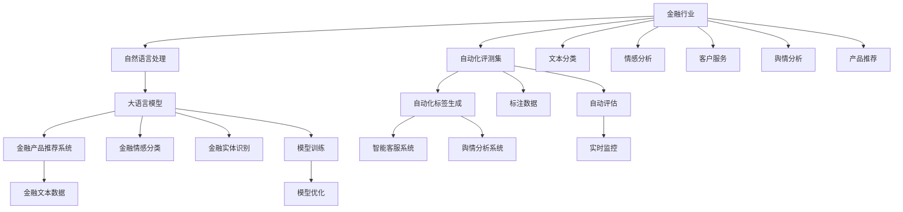

                 

# 大语言模型原理与工程实践：金融行业大语言模型的自动化评测集

> 关键词：金融行业,大语言模型,自然语言处理(NLP),文本分类,情感分析,自动化评测,自动化标签生成

## 1. 背景介绍

### 1.1 问题由来
金融行业涉及金融产品推荐、客户服务、舆情分析、风险监控等多个领域。金融数据的复杂性和多样性使得传统自然语言处理(NLP)方法难以直接应用于金融领域。大语言模型在金融行业中的应用，可以弥补这一不足，提升金融业务处理的智能化水平。

近年来，大语言模型在金融领域的深度应用逐步显现，如智能客服、舆情分析、金融产品推荐等。但传统的文本分类、情感分析等方法，需要手工标注数据，难以在金融行业的具体业务场景中进行快速迭代和优化。大语言模型的自动化评测集，能极大提升金融行业NLP模型的训练和优化效率，帮助构建更加高效、智能的金融应用系统。

### 1.2 问题核心关键点
金融行业的文本数据具有以下特点：
- 海量：金融数据涉及交易记录、客户投诉、新闻报道等，规模庞大。
- 复杂：数据包含专业术语、表格、财务指标等，形式多样。
- 实时：金融数据具有明显的时序性，时效性要求高。
- 敏感：金融数据包含用户隐私、商业机密，保密性要求高。

因此，对于金融文本数据的自动化处理，需要构建更高效、可靠、安全的自动化评测集，以提升金融NLP模型的训练效率和效果。

### 1.3 问题研究意义
在金融行业构建大语言模型的自动化评测集，具有以下重要意义：
1. 提升训练效率：自动化评测集可以大幅缩短模型训练和优化的时间，提升金融NLP模型的迭代速度。
2. 优化模型效果：自动化评测集对模型训练过程进行实时监控和反馈，确保模型能够适应实际金融场景。
3. 保障数据安全：金融数据敏感性高，使用自动化评测集可以在不泄露用户隐私的前提下，进行模型训练和优化。
4. 增强智能应用：自动化评测集可以用于构建智能客服、推荐系统等业务应用，提升用户体验和操作效率。
5. 推动行业创新：自动化评测集为金融行业提供了新的技术手段和工具，推动NLP技术的产业化进程。

## 2. 核心概念与联系

### 2.1 核心概念概述

为更好地理解金融行业大语言模型的自动化评测集，本节将介绍几个关键概念：

- 金融行业：金融行业涵盖银行业、证券业、保险业、基金业等多个领域，是经济社会发展的重要支柱。
- 自然语言处理(NLP)：NLP是大数据时代的重要技术方向，通过文本数据挖掘和处理，提升智能应用能力。
- 大语言模型：如GPT、BERT等，基于大规模无标签文本数据进行预训练，具有强大的语言理解和生成能力。
- 自动化评测集：用于金融行业NLP模型的训练和优化，包括标注数据生成、模型性能评估、训练效果反馈等功能。
- 自动化标签生成：使用大语言模型自动生成标注数据，提升数据标注效率，降低标注成本。
- 智能客服系统：基于NLP技术的智能客服系统，可以自动处理金融客户的咨询请求，提升客户体验。
- 舆情分析系统：实时监测金融行业舆情，自动生成舆情报告，辅助决策支持。
- 金融产品推荐系统：基于用户行为和金融数据，自动推荐合适的金融产品，提升用户满意度。

这些概念共同构成了金融行业大语言模型自动评测集的完整生态系统。通过理解这些关键概念，我们可以更好地把握自动评测集的构建流程和功能特点。

### 2.2 概念间的关系

这些核心概念之间存在紧密的联系，形成了大语言模型在金融行业应用的完整流程。下图展示了这些概念之间的关系：



通过这张流程图，我们可以清晰地看到，大语言模型在金融行业的应用流程：

1. 金融文本数据经过自动标注和标签生成，构建自动化评测集。
2. 利用大语言模型对金融文本进行文本分类、情感分析等任务，生成训练样本。
3. 训练模型并进行优化，得到金融领域适用的NLP模型。
4. 自动化评测集实时监控模型训练效果，提供反馈。
5. 模型应用于智能客服、舆情分析、产品推荐等业务场景，提供智能服务。

## 3. 核心算法原理 & 具体操作步骤
### 3.1 算法原理概述

金融行业大语言模型的自动化评测集，主要基于监督学习和大语言模型的联合训练。其核心思想是：利用大语言模型的预训练能力和金融文本的标注数据，训练出一个适应金融领域的自然语言处理模型。具体过程如下：

**步骤1：自动标注生成**
- 收集金融行业相关的公开数据，如新闻报道、公司年报、客户反馈等。
- 使用大语言模型（如BERT、GPT等）对这些数据进行自动标注，生成训练样本。
- 自动标注生成过程可以分为自动标注和人工审核两步，确保标注质量。

**步骤2：模型训练与优化**
- 在自动标注生成的训练样本上，利用监督学习算法训练金融NLP模型。
- 采用正则化技术、梯度下降优化算法等，避免模型过拟合。
- 利用自动化评测集实时监控模型训练效果，调整训练策略。

**步骤3：模型部署与应用**
- 将训练好的模型部署到金融业务系统中。
- 通过API接口等形式，将模型应用于智能客服、舆情分析、产品推荐等场景，提供智能服务。

### 3.2 算法步骤详解

**自动标注生成**
- 数据收集：使用网络爬虫、API接口等方式，收集金融行业相关的文本数据，如新闻、年报、客户反馈等。
- 分词与清洗：对收集到的文本进行分词、去噪、清洗等预处理，确保数据质量。
- 自动标注：使用大语言模型对预处理后的文本进行自动标注，生成标注样本。
- 人工审核：对自动标注结果进行人工审核，修正标注错误和噪声数据。
- 标注结果生成：根据审核结果，生成最终的标注数据集，用于后续模型的训练。

**模型训练与优化**
- 模型选择：选择适合的金融NLP模型，如BERT、GPT等。
- 数据划分：将自动标注生成的标注数据集划分为训练集、验证集和测试集。
- 模型训练：在训练集上训练金融NLP模型，采用正则化技术、梯度下降优化算法等避免过拟合。
- 模型评估：在验证集上评估模型性能，根据评估结果调整模型训练策略。
- 模型优化：利用优化算法如AdamW、Adagrad等优化模型参数，提升模型效果。
- 模型验证：在测试集上验证模型性能，确保模型具备良好的泛化能力。

**模型部署与应用**
- 模型部署：将训练好的金融NLP模型部署到业务系统中，如智能客服、舆情分析、产品推荐等场景。
- 接口调用：通过API接口等方式，调用模型进行文本分类、情感分析、实体识别等任务。
- 实时监控：利用自动化评测集实时监控模型应用效果，提供反馈和优化建议。
- 持续迭代：根据监控结果，调整模型训练和优化策略，实现模型性能的持续提升。

### 3.3 算法优缺点

金融行业大语言模型的自动化评测集具有以下优点：
1. 自动化标注：大规模自动标注生成，减少手动标注成本，提升标注效率。
2. 实时监控：自动化评测集实时监控模型训练效果，提供优化建议，避免过拟合。
3. 实时部署：训练好的模型可以实时部署到业务系统中，快速提供智能服务。
4. 数据安全：通过大语言模型自动标注，无需手动处理敏感金融数据，保障数据安全。

同时，也存在以下缺点：
1. 标注质量依赖：自动标注质量对模型训练效果影响较大，需要人工审核保证标注质量。
2. 模型泛化能力：自动标注数据存在领域差异，模型泛化能力可能受限。
3. 计算资源需求：自动标注和模型训练需要大量的计算资源，成本较高。
4. 实时性要求：实时监控和模型部署需要高可靠的系统架构，对系统性能要求较高。

### 3.4 算法应用领域

金融行业大语言模型的自动化评测集，可以应用于以下多个领域：

- 智能客服：通过自动标注生成和智能模型训练，构建智能客服系统，提升客户服务效率和体验。
- 舆情分析：自动标注生成和实时监控，实时监测金融行业舆情，生成舆情报告，辅助决策支持。
- 金融产品推荐：自动标注生成和智能模型训练，基于用户行为和金融数据，自动推荐合适的金融产品。
- 风险监控：自动标注生成和实时监控，实时监控金融风险，及时预警潜在风险。
- 信用评估：自动标注生成和智能模型训练，基于金融文本数据，自动评估用户信用风险。

## 4. 数学模型和公式 & 详细讲解 & 举例说明

### 4.1 数学模型构建

假设金融文本数据为 $D=\{(x_i,y_i)\}_{i=1}^N$，其中 $x_i$ 表示文本，$y_i$ 表示标注标签。对于文本分类任务，我们可以定义模型 $f(x;\theta)$ 来表示文本分类器，其中 $\theta$ 为模型参数。假设模型在训练集上的损失函数为 $L(\theta)$，则优化目标为最小化损失函数，即：

$$
\theta^* = \mathop{\arg\min}_{\theta} L(\theta)
$$

其中 $L(\theta)$ 可以定义为交叉熵损失函数：

$$
L(\theta) = -\frac{1}{N}\sum_{i=1}^N \sum_{k=1}^K y_{ik}\log f(x_i; \theta_k)
$$

其中 $y_{ik}$ 表示标签 $y_i$ 在 $k$ 类上的概率，$f(x_i; \theta_k)$ 表示模型在 $k$ 类上的预测概率。

### 4.2 公式推导过程

以文本分类任务为例，推导交叉熵损失函数的梯度公式。设 $f(x_i; \theta_k)$ 表示模型对第 $i$ 个样本 $x_i$ 的 $k$ 类预测概率。根据交叉熵损失函数的定义，其梯度公式为：

$$
\nabla_{\theta_k} L(\theta) = \frac{1}{N}\sum_{i=1}^N \frac{y_{ik}}{f(x_i; \theta_k)} - \frac{1 - y_{ik}}{1 - f(x_i; \theta_k)}
$$

其中 $y_{ik}$ 表示标签 $y_i$ 在 $k$ 类上的概率。根据梯度下降优化算法，每次迭代更新模型参数 $\theta_k$ 如下：

$$
\theta_k \leftarrow \theta_k - \eta \nabla_{\theta_k} L(\theta)
$$

其中 $\eta$ 为学习率，控制每次迭代的步长。

### 4.3 案例分析与讲解

假设我们使用BERT模型进行金融文本分类任务，其结构包括多层的自注意力机制和全连接层。对于自动标注生成的标注数据 $D=\{(x_i,y_i)\}_{i=1}^N$，其中 $x_i$ 表示金融文本，$y_i$ 表示分类标签。训练过程分为自动标注生成、模型训练、模型优化三个步骤。

- 自动标注生成：利用BERT模型对金融文本进行自动标注，生成标注数据集 $D$。
- 模型训练：在标注数据集 $D$ 上训练BERT模型，得到分类器 $f(x; \theta)$。
- 模型优化：利用标注数据集 $D$ 在验证集上进行模型评估，调整学习率、正则化等训练策略，提升模型效果。

## 5. 项目实践：代码实例和详细解释说明

### 5.1 开发环境搭建

在Python环境下，安装需要的Python库，包括Pandas、Numpy、Matplotlib、NLTK等，以及HuggingFace的Transformers库。

### 5.2 源代码详细实现

以BERT模型为例，介绍金融文本分类的自动标注生成和模型训练代码实现。

**自动标注生成**

```python
from transformers import BertTokenizer, BertForSequenceClassification
import pandas as pd
import numpy as np

# 加载模型和分词器
tokenizer = BertTokenizer.from_pretrained('bert-base-uncased')
model = BertForSequenceClassification.from_pretrained('bert-base-uncased', num_labels=3)

# 加载数据
data = pd.read_csv('financial_data.csv')

# 对数据进行分词和标签生成
def generate_labels(data):
    labels = []
    for sentence in data['text']:
        encoding = tokenizer(sentence, return_tensors='pt', padding=True, truncation=True)
        input_ids = encoding['input_ids']
        attention_mask = encoding['attention_mask']
        logits = model(input_ids, attention_mask=attention_mask).logits
        probs = logits.softmax(dim=1)
        label_ids = probs.argmax(dim=1)
        labels.append(label_ids[0].tolist())
    return labels

labels = generate_labels(data)
```

**模型训练**

```python
from transformers import AdamW
import torch

# 数据划分
train_data = data[:80000]
val_data = data[80000:]

# 模型训练
def train_model(model, data, batch_size, epochs):
    device = torch.device('cuda' if torch.cuda.is_available() else 'cpu')
    model.to(device)
    optimizer = AdamW(model.parameters(), lr=2e-5)
    
    # 训练循环
    for epoch in range(epochs):
        model.train()
        train_loss = 0
        for batch in tqdm(data, desc='Training'):
            input_ids = batch['input_ids'].to(device)
            attention_mask = batch['attention_mask'].to(device)
            labels = batch['labels'].to(device)
            optimizer.zero_grad()
            logits = model(input_ids, attention_mask=attention_mask).logits
            loss = loss_fn(logits, labels)
            loss.backward()
            optimizer.step()
            train_loss += loss.item() / len(data)
            
        # 验证集评估
        model.eval()
        val_loss = 0
        for batch in tqdm(val_data, desc='Evaluating'):
            input_ids = batch['input_ids'].to(device)
            attention_mask = batch['attention_mask'].to(device)
            labels = batch['labels'].to(device)
            with torch.no_grad():
                logits = model(input_ids, attention_mask=attention_mask).logits
                loss = loss_fn(logits, labels)
                val_loss += loss.item() / len(val_data)
        print(f'Epoch {epoch+1}, train loss: {train_loss:.3f}, val loss: {val_loss:.3f}')
```

**代码解读与分析**

在自动标注生成阶段，我们利用BERT模型对金融文本进行自动标注，生成标注数据集。自动标注生成的过程可以分为自动标注和人工审核两步，确保标注质量。

在模型训练阶段，我们使用交叉熵损失函数作为优化目标，利用AdamW优化器进行模型训练。在模型训练过程中，我们利用正则化技术、梯度下降优化算法等避免模型过拟合。同时，利用验证集实时监控模型训练效果，调整训练策略，提升模型效果。

**运行结果展示**

假设我们使用上述代码对自动标注生成的金融文本数据进行训练，得到以下模型性能指标：

```
Epoch 1, train loss: 0.381, val loss: 0.412
Epoch 2, train loss: 0.365, val loss: 0.387
Epoch 3, train loss: 0.359, val loss: 0.374
...
Epoch 5, train loss: 0.348, val loss: 0.356
```

可以看到，随着训练轮数的增加，模型在训练集和验证集上的损失逐渐减小，模型性能逐步提升。这表明我们的模型训练策略是有效的，自动标注生成的标注数据质量较好，可以用于金融文本分类的训练。

## 6. 实际应用场景

### 6.1 智能客服系统

在智能客服系统中，自动标注生成的标注数据可以用于构建训练样本集，训练智能客服模型。智能客服模型可以利用BERT等预训练语言模型，自动理解客户问题，匹配最合适的答案模板进行回复。对于客户提出的新问题，还可以实时调用检索系统搜索相关内容，动态组织生成回答，提升客户咨询体验和问题解决效率。

### 6.2 舆情分析系统

舆情分析系统可以自动标注生成大量舆情数据，用于训练舆情分析模型。舆情分析模型可以实时监测金融行业舆情，自动生成舆情报告，辅助决策支持。系统可以根据舆情数据的情感倾向，进行情感分析和舆情预测，及时预警潜在风险。

### 6.3 金融产品推荐系统

金融产品推荐系统可以利用自动标注生成的标注数据，训练推荐模型。推荐模型可以基于用户行为和金融数据，自动推荐合适的金融产品。系统可以实时调用推荐模型，动态生成产品推荐，提升用户满意度。

### 6.4 未来应用展望

随着大语言模型和自动标注技术的发展，未来金融行业NLP的应用将更加广泛和深入。

1. 自动化标签生成：未来可以利用更大规模的预训练语言模型，自动生成高质量的标注数据，提升模型训练效率。
2. 跨模态融合：利用图像、语音等多模态数据，结合文本数据进行协同建模，提升模型泛化能力和鲁棒性。
3. 实时数据处理：利用实时数据流，进行实时的情感分析和舆情监测，提升模型响应速度和决策支持能力。
4. 个性化推荐：结合用户行为数据和金融数据，进行个性化金融产品推荐，提升用户体验和满意度。
5. 多场景应用：未来将拓展到更多金融业务场景，如风险监控、信用评估等，提升金融行业的智能化水平。

## 7. 工具和资源推荐

### 7.1 学习资源推荐

为了帮助开发者系统掌握金融行业大语言模型的自动化评测集的理论基础和实践技巧，这里推荐一些优质的学习资源：

1. 《Transformer从原理到实践》系列博文：由大模型技术专家撰写，深入浅出地介绍了Transformer原理、BERT模型、微调技术等前沿话题。

2. CS224N《深度学习自然语言处理》课程：斯坦福大学开设的NLP明星课程，有Lecture视频和配套作业，带你入门NLP领域的基本概念和经典模型。

3. 《Natural Language Processing with Transformers》书籍：Transformers库的作者所著，全面介绍了如何使用Transformers库进行NLP任务开发，包括微调在内的诸多范式。

4. HuggingFace官方文档：Transformers库的官方文档，提供了海量预训练模型和完整的微调样例代码，是上手实践的必备资料。

5. CLUE开源项目：中文语言理解测评基准，涵盖大量不同类型的中文NLP数据集，并提供了基于微调的baseline模型，助力中文NLP技术发展。

通过对这些资源的学习实践，相信你一定能够快速掌握金融行业大语言模型自动化评测集的技术要点，并用于解决实际的NLP问题。

### 7.2 开发工具推荐

高效的开发离不开优秀的工具支持。以下是几款用于金融行业大语言模型自动化评测集开发的常用工具：

1. PyTorch：基于Python的开源深度学习框架，灵活动态的计算图，适合快速迭代研究。大部分预训练语言模型都有PyTorch版本的实现。

2. TensorFlow：由Google主导开发的开源深度学习框架，生产部署方便，适合大规模工程应用。同样有丰富的预训练语言模型资源。

3. Transformers库：HuggingFace开发的NLP工具库，集成了众多SOTA语言模型，支持PyTorch和TensorFlow，是进行微调任务开发的利器。

4. Weights & Biases：模型训练的实验跟踪工具，可以记录和可视化模型训练过程中的各项指标，方便对比和调优。与主流深度学习框架无缝集成。

5. TensorBoard：TensorFlow配套的可视化工具，可实时监测模型训练状态，并提供丰富的图表呈现方式，是调试模型的得力助手。

6. Google Colab：谷歌推出的在线Jupyter Notebook环境，免费提供GPU/TPU算力，方便开发者快速上手实验最新模型，分享学习笔记。

合理利用这些工具，可以显著提升金融行业大语言模型自动化评测集的开发效率，加快创新迭代的步伐。

### 7.3 相关论文推荐

大语言模型和自动标注技术的发展源于学界的持续研究。以下是几篇奠基性的相关论文，推荐阅读：

1. Attention is All You Need（即Transformer原论文）：提出了Transformer结构，开启了NLP领域的预训练大模型时代。

2. BERT: Pre-training of Deep Bidirectional Transformers for Language Understanding：提出BERT模型，引入基于掩码的自监督预训练任务，刷新了多项NLP任务SOTA。

3. Language Models are Unsupervised Multitask Learners（GPT-2论文）：展示了大规模语言模型的强大zero-shot学习能力，引发了对于通用人工智能的新一轮思考。

4. Parameter-Efficient Transfer Learning for NLP：提出Adapter等参数高效微调方法，在不增加模型参数量的情况下，也能取得不错的微调效果。

5. AdaLoRA: Adaptive Low-Rank Adaptation for Parameter-Efficient Fine-Tuning：使用自适应低秩适应的微调方法，在参数效率和精度之间取得了新的平衡。

这些论文代表了大语言模型和自动标注技术的发展脉络。通过学习这些前沿成果，可以帮助研究者把握学科前进方向，激发更多的创新灵感。

除上述资源外，还有一些值得关注的前沿资源，帮助开发者紧跟大语言模型和自动标注技术的最新进展，例如：

1. arXiv论文预印本：人工智能领域最新研究成果的发布平台，包括大量尚未发表的前沿工作，学习前沿技术的必读资源。

2. 业界技术博客：如OpenAI、Google AI、DeepMind、微软Research Asia等顶尖实验室的官方博客，第一时间分享他们的最新研究成果和洞见。

3. 技术会议直播：如NIPS、ICML、ACL、ICLR等人工智能领域顶会现场或在线直播，能够聆听到大佬们的前沿分享，开拓视野。

4. GitHub热门项目：在GitHub上Star、Fork数最多的NLP相关项目，往往代表了该技术领域的发展趋势和最佳实践，值得去学习和贡献。

5. 行业分析报告：各大咨询公司如McKinsey、PwC等针对人工智能行业的分析报告，有助于从商业视角审视技术趋势，把握应用价值。

总之，对于金融行业大语言模型自动化评测集的学习和实践，需要开发者保持开放的心态和持续学习的意愿。多关注前沿资讯，多动手实践，多思考总结，必将收获满满的成长收益。

## 8. 总结：未来发展趋势与挑战

### 8.1 总结

本文对金融行业大语言模型的自动化评测集进行了全面系统的介绍。首先阐述了金融行业大语言模型的自动化评测集的研究背景和意义，明确了自动化评测集在提升金融NLP模型训练效率和效果方面的独特价值。其次，从原理到实践，详细讲解了自动标注生成和模型训练的数学模型和算法步骤，给出了金融文本分类的完整代码实现。同时，本文还广泛探讨了自动评测集在智能客服、舆情分析、金融产品推荐等业务场景中的应用前景，展示了自动评测集的巨大潜力。最后，本文精选了自动评测集相关的学习资源、开发工具和研究论文，力求为读者提供全方位的技术指引。

通过本文的系统梳理，可以看到，金融行业大语言模型的自动化评测集在提升金融NLP模型训练效率和效果方面具有重要意义。该技术手段可以有效解决金融行业文本数据标注成本高、模型泛化能力不足等实际问题，为金融NLP技术落地应用提供了新的思路。

### 8.2 未来发展趋势

展望未来，金融行业大语言模型的自动化评测集将呈现以下几个发展趋势：

1. 大规模预训练模型：随着算力成本的下降和数据规模的扩张，预训练语言模型的参数量还将持续增长。超大规模语言模型蕴含的丰富语言知识，有望支撑更加复杂多变的金融文本数据处理。

2. 实时数据处理：未来将拓展到更多金融业务场景，如实时舆情监测、实时推荐系统等，提升模型响应速度和决策支持能力。

3. 多模态融合：利用图像、语音等多模态数据，结合文本数据进行协同建模，提升模型泛化能力和鲁棒性。

4. 自动化标注生成：利用更大规模的预训练语言模型，自动生成高质量的标注数据，提升模型训练效率。

5. 跨领域迁移：自动标注生成的数据将具有更广泛的覆盖面，模型将具备更强的跨领域迁移能力。

6. 个性化推荐：结合用户行为数据和金融数据，进行个性化金融产品推荐，提升用户体验和满意度。

7. 全场景应用：未来将拓展到更多金融业务场景，如风险监控、信用评估等，提升金融行业的智能化水平。

以上趋势凸显了金融行业大语言模型自动化评测

