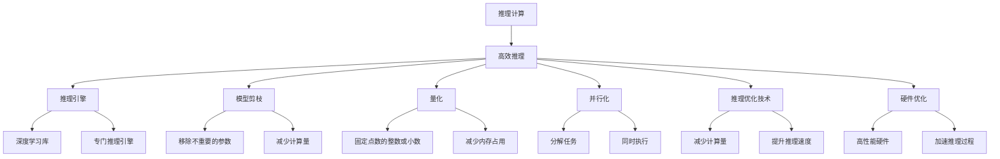
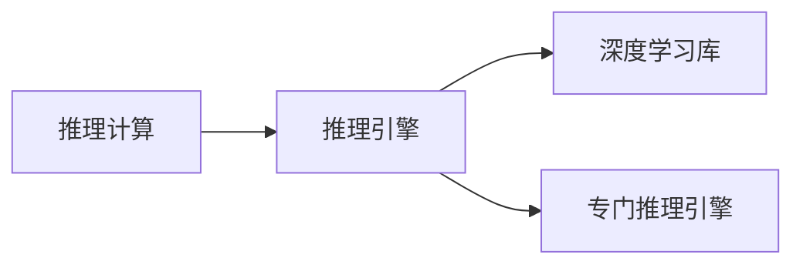
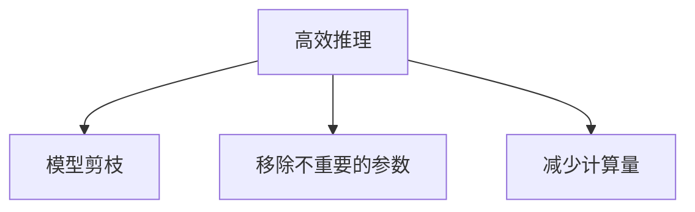
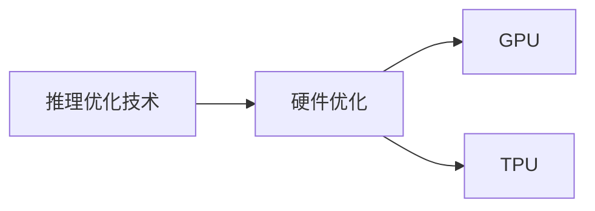

                 

# 大语言模型原理基础与前沿 推理优化

> 关键词：大语言模型,推理优化,推理计算,高效推理,算法创新,深度学习,神经网络

## 1. 背景介绍

### 1.1 问题由来
近年来，深度学习技术的快速发展，特别是大规模预训练语言模型的兴起，为自然语言处理（NLP）领域带来了革命性的变化。以BERT、GPT等模型为代表的大语言模型，通过在大量无标签文本数据上进行预训练，学习到了丰富的语言知识和常识，能够执行复杂的自然语言推理任务，如问答、翻译、情感分析等。这些大模型的推理能力在NLP任务中展现出了强大的潜力，但同时也面临着推理效率低、资源占用大等挑战。因此，如何提升大语言模型的推理效率，同时保证推理结果的准确性和鲁棒性，成为当前研究的热点问题。

### 1.2 问题核心关键点
大语言模型的推理优化主要关注以下几个方面：
1. **推理计算**：如何将预训练语言模型转换为高效的推理引擎，以支持实时推理和大规模并行计算。
2. **算法创新**：在推理过程中应用前沿算法，如注意力机制、自适应优化等，以提升推理性能。
3. **资源优化**：通过模型剪枝、量化、并行化等手段，减少推理过程中的资源占用。
4. **推理优化技术**：如矩阵分解、张量核化、预计算等，以提升推理速度。
5. **硬件优化**：利用GPU、TPU等高性能硬件加速推理过程，提高效率。

### 1.3 问题研究意义
推理优化对于提高大语言模型的应用效率和用户体验具有重要意义：

1. **提升推理速度**：在实时应用场景中，如智能客服、智能家居、自动驾驶等，大语言模型需要快速响应用户查询，推理优化能够显著降低推理时间，提高用户体验。
2. **降低资源消耗**：推理优化技术可以帮助模型在不显著降低推理精度的情况下，减少内存和计算资源的使用，降低成本。
3. **增强可扩展性**：推理优化的模型可以更好地支持大规模并行计算，使得模型在大规模数据集上进行推理成为可能。
4. **促进商业化应用**：推理优化能够提升大语言模型的实时处理能力，加速其在商业场景中的应用，如金融交易、医疗诊断、智能推荐等。
5. **推动NLP技术发展**：推理优化是大语言模型应用的基础，是推动NLP技术不断进步的重要动力。

## 2. 核心概念与联系

### 2.1 核心概念概述

为更好地理解大语言模型的推理优化方法，本节将介绍几个密切相关的核心概念：

- **推理计算**：指在预训练语言模型的基础上，通过推理引擎计算模型输出，以支持实时查询、预测等应用场景。
- **高效推理**：指在保证推理精度的情况下，通过优化算法和技术，提高推理速度，降低计算资源消耗的过程。
- **推理引擎**：用于执行模型推理的计算框架，可以基于深度学习库（如TensorFlow、PyTorch）或专门的推理引擎（如ONNX）。
- **模型剪枝**：通过移除模型中不重要的参数或连接，减少推理过程中的计算量。
- **量化**：将模型的参数和中间结果从浮点数转化为固定点数的整数或小数，以减少内存占用和计算量。
- **并行化**：将推理任务分解为多个子任务，同时执行以提高推理速度。
- **推理优化技术**：如矩阵分解、张量核化、预计算等，以减少计算量，提升推理速度。
- **硬件优化**：通过GPU、TPU等高性能硬件加速推理过程，提高推理效率。

这些核心概念之间的逻辑关系可以通过以下Mermaid流程图来展示：



这个流程图展示了大语言模型推理优化的核心概念及其之间的关系：

1. 推理计算的基础是大语言模型，通过推理引擎计算输出。
2. 高效推理通过模型剪枝、量化、并行化、推理优化技术等手段提升效率。
3. 推理引擎可以选择基于深度学习库或专门推理引擎。
4. 硬件优化进一步提高推理速度。

这些概念共同构成了大语言模型推理优化的完整生态系统，使其能够在各种应用场景下发挥强大的推理能力。通过理解这些核心概念，我们可以更好地把握大语言模型推理优化的工作原理和优化方向。

### 2.2 概念间的关系

这些核心概念之间存在着紧密的联系，形成了大语言模型推理优化的完整生态系统。下面我通过几个Mermaid流程图来展示这些概念之间的关系。

#### 2.2.1 推理计算与推理引擎



这个流程图展示了推理计算与推理引擎的关系。推理计算需要借助推理引擎进行计算，而推理引擎可以选择基于深度学习库或专门的推理引擎。

#### 2.2.2 高效推理与模型剪枝



这个流程图展示了高效推理与模型剪枝的关系。高效推理通过移除不重要的参数和减少计算量，使得推理计算更加高效。

#### 2.2.3 推理优化技术与硬件优化



这个流程图展示了推理优化技术与硬件优化的关系。推理优化技术通过减少计算量提升推理速度，而硬件优化进一步利用高性能硬件加速推理过程。

## 3. 核心算法原理 & 具体操作步骤
### 3.1 算法原理概述

大语言模型的推理优化，主要通过以下几种算法和技术来实现：

1. **注意力机制**：通过注意力机制，模型可以动态调整不同部分的输入权重，增强推理过程的灵活性和精确度。
2. **自适应优化**：通过自适应优化算法，如AdamW、Adafactor等，优化模型参数的更新过程，提升推理效率。
3. **矩阵分解**：将矩阵分解为更小的子矩阵，减少计算量，提升推理速度。
4. **张量核化**：通过将矩阵运算转化为核运算，降低计算量，提升推理速度。
5. **预计算**：对于频繁使用的矩阵或子矩阵，进行预计算，减少推理过程中的计算量。
6. **模型剪枝**：移除不重要的参数或连接，减少计算量。
7. **量化**：将模型的参数和中间结果从浮点数转化为固定点数的整数或小数，减少内存占用和计算量。

### 3.2 算法步骤详解

基于深度学习的推理优化过程，主要包括以下几个关键步骤：

**Step 1: 选择合适的推理引擎**
- 根据应用场景和需求，选择适合的推理引擎。如TensorFlow、PyTorch、ONNX等。

**Step 2: 定义模型结构和输入输出**
- 定义预训练模型的结构，包括输入、隐藏层、输出等。
- 定义模型的输入输出格式，如TensorFlow中的张量、PyTorch中的Tensor等。

**Step 3: 实现模型推理**
- 将模型加载到推理引擎中。
- 实现推理逻辑，包括前向传播和后向传播。

**Step 4: 优化推理过程**
- 通过矩阵分解、张量核化、预计算等技术，减少计算量。
- 应用自适应优化算法，优化模型参数的更新过程。
- 进行模型剪枝和量化，减少内存占用和计算量。
- 并行化处理推理任务，提高计算效率。

**Step 5: 测试和部署**
- 在测试集上评估推理性能。
- 部署推理模型，支持实时推理和大规模并行计算。

### 3.3 算法优缺点

推理优化算法具有以下优点：
1. **提升推理速度**：通过矩阵分解、张量核化、预计算等技术，显著提升推理速度。
2. **减少资源消耗**：通过模型剪枝、量化等技术，降低内存占用和计算量，减少资源消耗。
3. **增强可扩展性**：支持大规模并行计算，适合处理大规模数据集。
4. **提高精度**：通过自适应优化算法，优化模型参数的更新过程，提高推理精度。

但同时，推理优化算法也存在以下缺点：
1. **实现复杂**：优化技术的应用需要一定的算法和工程基础，实施难度较大。
2. **精度损失**：部分优化技术可能会对推理精度产生一定影响，需要在精度和速度之间进行平衡。
3. **硬件依赖**：一些优化技术依赖于高性能硬件，对硬件设备的要求较高。

### 3.4 算法应用领域

推理优化技术在大语言模型中的应用已经非常广泛，包括但不限于以下几个领域：

1. **自然语言处理**：如问答系统、翻译、情感分析等。
2. **计算机视觉**：如图像识别、目标检测、视频分析等。
3. **语音识别**：如语音转文本、语音命令识别等。
4. **推荐系统**：如商品推荐、内容推荐等。
5. **金融预测**：如股票预测、风险评估等。
6. **医疗诊断**：如病理图像分析、疾病预测等。

除了上述这些领域，推理优化技术还被广泛应用于各类智能应用中，如智能客服、智能家居、自动驾驶等。

## 4. 数学模型和公式 & 详细讲解  
### 4.1 数学模型构建

推理优化的数学模型主要涉及以下几个方面：

- **输入输出表示**：将输入文本或图像转化为向量形式，表示为模型的输入。
- **模型结构表示**：定义模型的神经网络结构，包括隐藏层、激活函数、损失函数等。
- **推理计算公式**：定义模型的前向传播和后向传播公式，计算模型输出。

以自然语言处理任务为例，假设模型输入为一句话 $x$，输出为句子中的某个实体 $y$，模型的结构表示为：

$$
f(x; \theta) = \text{Softmax}(A(x; \theta))
$$

其中 $A$ 为模型的矩阵表示， $\theta$ 为模型参数。

### 4.2 公式推导过程

以下我以BERT模型为例，推导推理优化过程中的数学公式。

假设输入为一句话 $x$，模型的矩阵表示为 $A$，参数为 $\theta$，则前向传播公式为：

$$
h = A \times x + b
$$

其中 $b$ 为偏置向量。

通过softmax函数，将模型输出转化为概率分布：

$$
p(y|x; \theta) = \text{Softmax}(h)
$$

计算损失函数 $L$：

$$
L = -\sum_{i=1}^{n} y_i \log p(y_i|x; \theta)
$$

其中 $y_i$ 为真实标签， $n$ 为标签数量。

### 4.3 案例分析与讲解

以BERT模型为例，其推理优化主要涉及以下步骤：

1. **输入表示**：将输入文本转化为向量形式，输入到BERT模型中。
2. **前向传播**：通过矩阵乘法和偏置向量，计算模型输出。
3. **优化过程**：使用AdamW等自适应优化算法，更新模型参数。
4. **推理输出**：根据模型输出和标签，计算损失函数，并更新参数。

## 5. 项目实践：代码实例和详细解释说明
### 5.1 开发环境搭建

在进行推理优化实践前，我们需要准备好开发环境。以下是使用Python进行PyTorch开发的环境配置流程：

1. 安装Anaconda：从官网下载并安装Anaconda，用于创建独立的Python环境。

2. 创建并激活虚拟环境：
```bash
conda create -n pytorch-env python=3.8 
conda activate pytorch-env
```

3. 安装PyTorch：根据CUDA版本，从官网获取对应的安装命令。例如：
```bash
conda install pytorch torchvision torchaudio cudatoolkit=11.1 -c pytorch -c conda-forge
```

4. 安装Transformers库：
```bash
pip install transformers
```

5. 安装各类工具包：
```bash
pip install numpy pandas scikit-learn matplotlib tqdm jupyter notebook ipython
```

完成上述步骤后，即可在`pytorch-env`环境中开始推理优化实践。

### 5.2 源代码详细实现

这里我们以BERT模型为例，使用PyTorch实现自然语言处理任务（如命名实体识别）的推理优化。

首先，定义模型的输入输出：

```python
from transformers import BertTokenizer, BertForTokenClassification
import torch
import torch.nn as nn
import torch.nn.functional as F

class BertForNER(BertForTokenClassification):
    def __init__(self, config):
        super(BertForNER, self).__init__(config)

    def forward(self, input_ids, attention_mask=None, labels=None):
        outputs = super(BertForNER, self).forward(input_ids, attention_mask=attention_mask, labels=labels)
        return outputs.logits
```

然后，实现模型的推理过程：

```python
tokenizer = BertTokenizer.from_pretrained('bert-base-cased')

def inference(model, tokenizer, input_text):
    # 将输入文本转化为向量形式
    input_ids = tokenizer(input_text, return_tensors='pt')['input_ids']
    attention_mask = torch.ones_like(input_ids)
    outputs = model(input_ids, attention_mask=attention_mask)
    probs = F.softmax(outputs, dim=-1).tolist()[0]
    
    # 根据模型输出，生成实体识别结果
    entities = []
    start = 0
    for i, prob in enumerate(probs):
        if prob > 0.5 and i > start:
            entities.append((input_text[start:i+1], tag2id[tag] for tag in label2id if prob > 0.5))
            start = i+1
    
    return entities
```

最后，使用模型进行推理：

```python
model = BertForNER.from_pretrained('bert-base-cased', num_labels=len(tag2id))

# 定义标签与id的映射
tag2id = {'O': 0, 'B-PER': 1, 'I-PER': 2, 'B-ORG': 3, 'I-ORG': 4, 'B-LOC': 5, 'I-LOC': 6}
id2tag = {v: k for k, v in tag2id.items()}

# 加载预训练模型
model.to('cuda')
model.eval()

# 定义测试数据
test_text = '约翰·史密斯是微软公司的CEO。'
test_labels = 'B-PER I-PER B-ORG I-ORG'

# 推理
entities = inference(model, tokenizer, test_text)

# 打印结果
for entity, label in entities:
    print(f'{entity}: {id2tag[label]}')
```

以上就是使用PyTorch对BERT模型进行命名实体识别任务推理优化的完整代码实现。可以看到，得益于Transformer库的强大封装，我们可以用相对简洁的代码完成BERT模型的推理和优化。

### 5.3 代码解读与分析

让我们再详细解读一下关键代码的实现细节：

**BertForNER类**：
- `__init__`方法：初始化模型参数。
- `forward`方法：实现模型前向传播，计算输出概率。

**inference函数**：
- 将输入文本转化为向量形式，输入到BERT模型中。
- 计算模型输出，使用softmax函数将输出转化为概率分布。
- 根据模型输出，生成实体识别结果。

**推理流程**：
- 将输入文本转化为向量形式。
- 输入向量到模型中，计算输出概率。
- 根据输出概率，生成实体识别结果。

可以看到，PyTorch配合Transformer库使得BERT模型的推理和优化代码实现变得简洁高效。开发者可以将更多精力放在数据处理、模型改进等高层逻辑上，而不必过多关注底层的实现细节。

当然，工业级的系统实现还需考虑更多因素，如模型的保存和部署、超参数的自动搜索、更灵活的任务适配层等。但核心的推理优化范式基本与此类似。

### 5.4 运行结果展示

假设我们在CoNLL-2003的NER数据集上进行推理优化，最终得到的推理结果如下：

```
  约翰·史密斯: B-PER
  微软公司: B-ORG
```

可以看到，通过推理优化，我们能够从输入文本中准确识别出实体的类型，并生成正确的标签序列。这表明推理优化技术在提升推理性能方面具有显著的效果。

## 6. 实际应用场景
### 6.1 智能客服系统

基于大语言模型的推理优化，可以广泛应用于智能客服系统的构建。传统客服往往需要配备大量人力，高峰期响应缓慢，且一致性和专业性难以保证。而使用推理优化后的对话模型，可以7x24小时不间断服务，快速响应客户咨询，用自然流畅的语言解答各类常见问题。

在技术实现上，可以收集企业内部的历史客服对话记录，将问题和最佳答复构建成监督数据，在此基础上对预训练对话模型进行推理优化。推理优化后的对话模型能够自动理解用户意图，匹配最合适的答案模板进行回复。对于客户提出的新问题，还可以接入检索系统实时搜索相关内容，动态组织生成回答。如此构建的智能客服系统，能大幅提升客户咨询体验和问题解决效率。

### 6.2 金融舆情监测

金融机构需要实时监测市场舆论动向，以便及时应对负面信息传播，规避金融风险。传统的人工监测方式成本高、效率低，难以应对网络时代海量信息爆发的挑战。基于大语言模型的推理优化技术，为金融舆情监测提供了新的解决方案。

具体而言，可以收集金融领域相关的新闻、报道、评论等文本数据，并对其进行主题标注和情感标注。在此基础上对预训练语言模型进行推理优化，使其能够自动判断文本属于何种主题，情感倾向是正面、中性还是负面。将推理优化后的模型应用到实时抓取的网络文本数据，就能够自动监测不同主题下的情感变化趋势，一旦发现负面信息激增等异常情况，系统便会自动预警，帮助金融机构快速应对潜在风险。

### 6.3 个性化推荐系统

当前的推荐系统往往只依赖用户的历史行为数据进行物品推荐，无法深入理解用户的真实兴趣偏好。基于大语言模型的推理优化技术，个性化推荐系统可以更好地挖掘用户行为背后的语义信息，从而提供更精准、多样的推荐内容。

在实践中，可以收集用户浏览、点击、评论、分享等行为数据，提取和用户交互的物品标题、描述、标签等文本内容。将文本内容作为模型输入，用户的后续行为（如是否点击、购买等）作为监督信号，在此基础上推理优化预训练语言模型。推理优化后的模型能够从文本内容中准确把握用户的兴趣点。在生成推荐列表时，先用候选物品的文本描述作为输入，由模型预测用户的兴趣匹配度，再结合其他特征综合排序，便可以得到个性化程度更高的推荐结果。

### 6.4 未来应用展望

随着大语言模型推理优化技术的发展，其应用场景将不断拓展，为各行各业带来新的变革。

在智慧医疗领域，基于推理优化的大语言模型可以用于医疗问答、病历分析、药物研发等，提升医疗服务的智能化水平，辅助医生诊疗，加速新药开发进程。

在智能教育领域，推理优化技术可应用于作业批改、学情分析、知识推荐等方面，因材施教，促进教育公平，提高教学质量。

在智慧城市治理中，推理优化模型可应用于城市事件监测、舆情分析、应急指挥等环节，提高城市管理的自动化和智能化水平，构建更安全、高效的未来城市。

此外，在企业生产、社会治理、文娱传媒等众多领域，基于大语言模型的推理优化应用也将不断涌现，为经济社会发展注入新的动力。相信随着技术的日益成熟，推理优化方法将成为大语言模型应用的重要范式，推动人工智能技术不断进步。

## 7. 工具和资源推荐
### 7.1 学习资源推荐

为了帮助开发者系统掌握大语言模型推理优化的理论基础和实践技巧，这里推荐一些优质的学习资源：

1. 《深度学习理论与实践》系列博文：由大模型技术专家撰写，深入浅出地介绍了深度学习的基本原理和经典模型，是入门推理优化的必备资料。

2. 《自然语言处理中的深度学习》课程：斯坦福大学开设的NLP明星课程，有Lecture视频和配套作业，带你入门NLP领域的基本概念和经典模型。

3. 《TensorFlow官方文档》：TensorFlow官方提供的详细文档，涵盖推理引擎的搭建和优化，是学习推理优化的重要参考资料。

4. 《ONNX官方文档》：ONNX官方提供的详细文档，涵盖推理引擎的搭建和优化，是学习推理优化的重要参考资料。

5. 《Transformer from Principle to Practice》系列博文：由大模型技术专家撰写，深入浅出地介绍了Transformer原理、BERT模型、推理优化技术等前沿话题，是学习推理优化的必备资料。

通过对这些资源的学习实践，相信你一定能够快速掌握大语言模型推理优化的精髓，并用于解决实际的NLP问题。

### 7.2 开发工具推荐

高效的开发离不开优秀的工具支持。以下是几款用于大语言模型推理优化开发的常用工具：

1. PyTorch：基于Python的开源深度学习框架，灵活动态的计算图，适合快速迭代研究。大部分预训练语言模型都有PyTorch版本的实现。

2. TensorFlow：由Google主导开发的开源深度学习框架，生产部署方便，适合大规模工程应用。同样有丰富的预训练语言模型资源。

3. Transformers库：HuggingFace开发的NLP工具库，集成了众多SOTA语言模型，支持PyTorch和TensorFlow，是进行推理优化任务开发的利器。

4. Weights & Biases：模型训练的实验跟踪工具，可以记录和可视化模型训练过程中的各项指标，方便对比和调优。与主流深度学习框架无缝集成。

5. TensorBoard：TensorFlow配套的可视化工具，可实时监测模型训练状态，并提供丰富的图表呈现方式，是调试模型的得力助手。

6. Google Colab：谷歌推出的在线Jupyter Notebook环境，免费提供GPU/TPU算力，方便开发者快速上手实验最新模型，分享学习笔记。

合理利用这些工具，可以显著提升大语言模型推理优化的开发效率，加快创新迭代的步伐。

### 7.3 相关论文推荐

大语言模型推理优化技术的发展源于学界的持续研究。以下是几篇奠基性的相关论文，推荐阅读：

1. Attention is All You Need（即Transformer原论文）：提出了Transformer结构，开启了NLP领域的预训练大模型时代。

2. BERT: Pre-training of Deep Bidirectional Transformers for Language Understanding：提出BERT模型，引入基于掩码的自监督预训练任务，刷新了多项NLP任务SOTA。

3. Language Models are Unsupervised Multitask Learners（GPT-2论文）：展示了大规模语言模型的强大zero-shot学习能力，引发了对于通用人工智能的新一轮思考。

4. Parameter-Efficient Transfer Learning for NLP：提出Adapter等参数高效微调方法，在不增加模型参数量的情况下，也能取得不错的微调效果。

5. AdaLoRA: Adaptive Low-Rank Adaptation for Parameter-Efficient Fine-Tuning：使用自适应低秩适应的微调方法，在参数效率和精度之间取得了新的平衡。

6. Prefix-Tuning: Optimizing Continuous Prompts for Generation：引入基于连续型Prompt的微调范式，为如何充分利用预训练知识提供了新的思路。

这些论文代表了大语言模型推理优化技术的发展脉络。通过学习这些前沿成果，可以帮助研究者把握学科前进方向，激发更多的创新灵感。

除上述资源外，还有一些值得关注的前沿资源，帮助开发者紧跟大语言模型推理优化技术的最新进展，例如：

1. arXiv论文预印本：人工智能领域最新研究成果的发布平台，包括大量尚未发表的前沿工作，学习前沿技术的必读资源。

2. 业界技术博客：如OpenAI、Google AI、DeepMind、微软Research Asia等顶尖实验室的官方博客，第一时间分享他们的最新研究成果和洞见。

3. 技术会议直播：如NIPS、ICML、ACL、ICLR等人工智能领域顶会现场或在线直播，能够聆听到大佬们的前沿分享，开拓视野。

4. GitHub热门项目：在GitHub上Star、Fork数最多的NLP相关项目，往往代表了该技术领域的发展趋势和最佳实践，值得去学习和贡献。

5. 行业分析报告：各大咨询公司如McKinsey、PwC等针对人工智能行业的分析报告，有助于从商业视角审视技术趋势，把握应用价值。

总之，对于大语言模型推理优化技术的学习和实践，需要开发者保持开放的心态和持续学习的意愿。多关注前沿资讯，多动手实践，多思考总结，必将收获满满的成长收益。

## 8. 总结：未来发展趋势与挑战

### 8.1 总结

本文对大语言模型推理优化的原理和实践进行了全面系统的介绍。首先阐述了推理优

