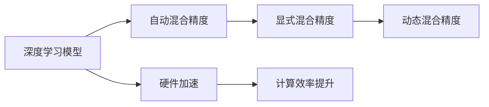
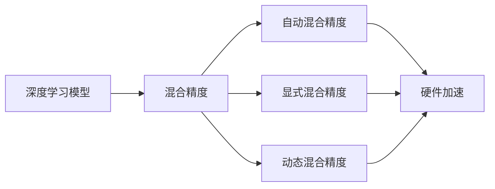
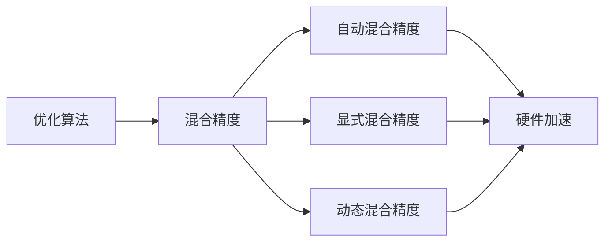
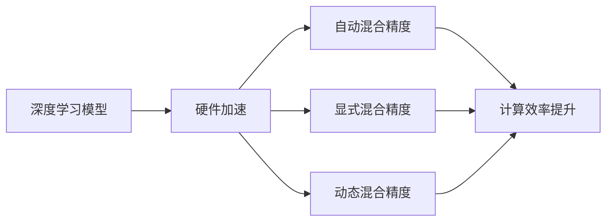
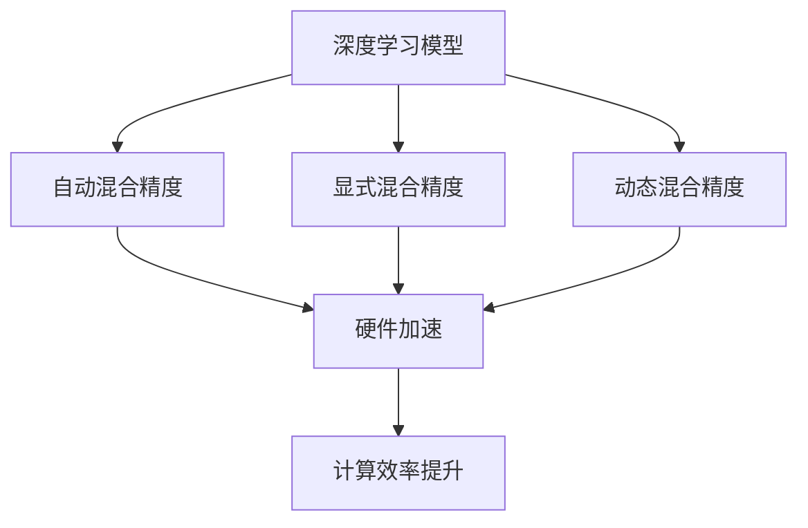

                 

# 大语言模型原理基础与前沿 混合精度

> 关键词：大语言模型,混合精度,深度学习,优化算法,计算效率,硬件优化

## 1. 背景介绍

### 1.1 问题由来
随着深度学习技术的发展，大规模预训练语言模型（如BERT、GPT）在自然语言处理（NLP）领域取得了显著的进展。然而，这些模型往往具有极高的参数量和计算需求，对硬件资源的要求很高，特别是在模型推理和微调过程中。混合精度（Mixed Precision）技术应运而生，通过混合使用16位和32位浮点数，显著提高了深度学习模型的计算效率，减少了内存占用和计算时间，从而加速了模型训练和推理。

混合精度技术最早由NVIDIA公司提出，广泛应用于GPU等硬件加速设备上。在大规模语言模型微调和大模型推理中，混合精度技术也表现出巨大的潜力。本文将详细探讨混合精度技术在大语言模型中的应用，包括原理、实现方法和实际应用场景。

### 1.2 问题核心关键点
混合精度技术通过将模型中的某些层使用半精度浮点数（如16位FP16）进行计算，而其他层使用全精度浮点数（如32位FP32），从而在保证计算精度的同时，大幅提升计算效率和内存利用率。在大语言模型微调过程中，混合精度技术可以显著减少内存占用，加速模型训练，提高模型推理速度。

混合精度的核心在于选择合适的精度组合，并根据模型和任务的不同，灵活调整精度策略。常见的混合精度方法包括：
1. 自动混合精度（Amp）：NVIDIA提供的自动化混合精度技术，可以自动调整模型精度，以适应不同硬件设备和模型配置。
2. 显式混合精度：开发者手动指定模型的混合精度策略，如将某些层使用FP16，其余层使用FP32。
3. 动态混合精度：根据每个样本的计算需求，动态调整精度，进一步优化资源利用。

## 2. 核心概念与联系

### 2.1 核心概念概述

为更好地理解混合精度技术在大语言模型中的应用，本节将介绍几个关键概念：

- 深度学习模型：包括卷积神经网络（CNN）、循环神经网络（RNN）、变换器（Transformer）等，通过多层神经网络对输入数据进行特征提取和分类。
- 混合精度（Mixed Precision）：通过混合使用16位和32位浮点数进行计算，以提高深度学习模型的计算效率。
- 自动混合精度（Amp）：NVIDIA提供的自动化混合精度技术，可以自动调整模型精度，以适应不同硬件设备和模型配置。
- 显式混合精度：开发者手动指定模型的混合精度策略，如将某些层使用FP16，其余层使用FP32。
- 动态混合精度：根据每个样本的计算需求，动态调整精度，进一步优化资源利用。
- 硬件加速（GPU/TPU）：使用GPU或TPU等硬件设备进行模型计算，提升计算速度和内存利用率。

这些概念之间的逻辑关系可以通过以下Mermaid流程图来展示：



这个流程图展示了深度学习模型的混合精度计算过程。深度学习模型通过自动混合精度、显式混合精度和动态混合精度，在硬件加速设备上进行高效计算，从而提高计算效率。

### 2.2 概念间的关系

这些核心概念之间存在着紧密的联系，形成了混合精度技术的完整生态系统。下面我们通过几个Mermaid流程图来展示这些概念之间的关系。

#### 2.2.1 混合精度在大模型中的应用



这个流程图展示了混合精度技术在大模型中的应用。深度学习模型通过自动混合精度、显式混合精度和动态混合精度，在硬件加速设备上进行高效计算，从而提高计算效率。

#### 2.2.2 混合精度与优化算法的关系



这个流程图展示了混合精度技术在优化算法中的应用。优化算法如Adam、SGD等，通过混合精度技术，提高了计算效率和内存利用率，加速了模型训练和推理。

#### 2.2.3 混合精度在硬件加速中的作用



这个流程图展示了混合精度技术在硬件加速中的作用。深度学习模型通过自动混合精度、显式混合精度和动态混合精度，在硬件加速设备上进行高效计算，从而提高计算效率。

### 2.3 核心概念的整体架构

最后，我们用一个综合的流程图来展示这些核心概念在大语言模型混合精度计算过程中的整体架构：



这个综合流程图展示了深度学习模型通过自动混合精度、显式混合精度和动态混合精度，在硬件加速设备上进行高效计算，从而提高计算效率。

## 3. 核心算法原理 & 具体操作步骤
### 3.1 算法原理概述

混合精度技术通过将模型中的某些层使用半精度浮点数（如16位FP16）进行计算，而其他层使用全精度浮点数（如32位FP32），从而在保证计算精度的同时，大幅提升计算效率和内存利用率。在大语言模型微调过程中，混合精度技术可以显著减少内存占用，加速模型训练，提高模型推理速度。

### 3.2 算法步骤详解

在大语言模型微调过程中，混合精度技术的实现可以分为以下几个关键步骤：

**Step 1: 环境准备**
- 安装NVIDIA的CUDA Toolkit和cuDNN库，确保硬件设备和驱动程序正常工作。
- 安装NVIDIA的混合精度计算库NVIDIA Ampere Amps。

**Step 2: 配置混合精度策略**
- 使用自动混合精度（Amp）或显式混合精度（DPFP、FP16）对模型进行混合精度配置。
- 在配置文件中指定模型中各层的精度，如Tensor Core计算和CUDA核计算使用不同的精度。

**Step 3: 修改代码实现**
- 修改深度学习框架中的计算图和优化器，使其支持混合精度计算。
- 修改模型前向和反向传播过程中的数据类型，使用半精度和全精度数据交替计算。

**Step 4: 训练和推理**
- 在训练过程中，使用混合精度技术加速模型训练，减少内存占用，提高训练速度。
- 在推理过程中，使用混合精度技术提高推理速度，减少延迟，提高系统响应速度。

**Step 5: 验证和优化**
- 在验证集上评估模型性能，确保混合精度配置不会影响模型精度。
- 根据验证结果，调整混合精度策略，优化模型性能。

### 3.3 算法优缺点

混合精度技术在大语言模型中的应用具有以下优点：
1. 提高计算效率：通过混合使用16位和32位浮点数，显著减少了内存占用和计算时间。
2. 优化资源利用：自动混合精度和动态混合精度技术，可以根据硬件设备和模型特点，灵活调整精度策略。
3. 加速模型训练：通过使用混合精度技术，可以显著加速模型的训练过程，缩短模型开发时间。

同时，混合精度技术也存在以下缺点：
1. 精度损失：混合精度计算可能导致一定的精度损失，特别是在对精度要求较高的任务中。
2. 硬件依赖：混合精度技术依赖于硬件加速设备，可能对一些没有硬件加速的计算平台不适用。
3. 配置复杂：混合精度配置需要仔细调整，特别是在显式混合精度配置时，需要手动指定精度策略。

### 3.4 算法应用领域

混合精度技术在大语言模型中的应用非常广泛，包括但不限于以下几个领域：

- 自然语言处理：如命名实体识别、情感分析、文本生成等任务。混合精度技术可以显著加速模型训练和推理，提升NLP任务的性能。
- 计算机视觉：如图像分类、目标检测、图像生成等任务。混合精度技术可以显著提高图像处理模型的计算效率，加速模型训练和推理。
- 语音识别：如语音转文本、语音情感分析等任务。混合精度技术可以显著提高语音处理模型的计算效率，提升模型实时性和响应速度。
- 推荐系统：如协同过滤、内容推荐等任务。混合精度技术可以显著提高推荐系统的计算效率，加速模型训练和推理。

## 4. 数学模型和公式 & 详细讲解  
### 4.1 数学模型构建

在大语言模型微调过程中，混合精度技术的实现可以借助深度学习框架中的混合精度计算库，如NVIDIA的Amps。在NVIDIA的Amps中，混合精度计算可以分为以下几个步骤：

1. 模型定义：使用深度学习框架定义模型结构，如使用TensorFlow或PyTorch。
2. 混合精度配置：在配置文件中指定模型中各层的精度策略。
3. 前向计算：使用半精度和全精度数据交替计算，加速模型前向传播。
4. 反向传播：使用混合精度梯度计算技术，更新模型参数。

### 4.2 公式推导过程

以下我们将通过数学公式来推导混合精度计算的基本原理。假设模型中某层参数为 $\theta$，计算梯度 $\frac{\partial L}{\partial \theta}$，其中 $L$ 为损失函数。混合精度计算的公式为：

$$
\frac{\partial L}{\partial \theta} = \frac{\partial L_{FP32}}{\partial \theta_{FP32}} + \frac{\partial L_{FP32}}{\partial \theta_{FP16}} \cdot \frac{\partial L_{FP16}}{\partial \theta_{FP16}} \cdot \frac{\partial L_{FP16}}{\partial \theta_{FP32}} \cdot \frac{\partial L_{FP32}}{\partial \theta_{FP32}}
$$

其中 $L_{FP32}$ 表示使用32位浮点数计算的损失函数，$L_{FP16}$ 表示使用16位浮点数计算的损失函数。

在混合精度计算中，模型参数 $\theta$ 包含两部分，一部分使用32位浮点数计算，另一部分使用16位浮点数计算。由于不同的精度计算方式可能导致误差累积，因此在反向传播过程中，需要特别注意误差传递和精度补偿。

### 4.3 案例分析与讲解

下面我们以BERT模型为例，展示混合精度计算的实际应用。假设我们在BERT模型的最后一层添加了一个全连接层，用于进行分类任务。该全连接层的权重 $\theta$ 为32位浮点数，计算梯度 $\frac{\partial L}{\partial \theta}$ 如下：

$$
\frac{\partial L}{\partial \theta} = \frac{\partial L_{FP32}}{\partial \theta_{FP32}} + \frac{\partial L_{FP32}}{\partial \theta_{FP16}} \cdot \frac{\partial L_{FP16}}{\partial \theta_{FP16}} \cdot \frac{\partial L_{FP16}}{\partial \theta_{FP32}} \cdot \frac{\partial L_{FP32}}{\partial \theta_{FP32}}
$$

其中 $L_{FP32}$ 表示使用32位浮点数计算的损失函数，$L_{FP16}$ 表示使用16位浮点数计算的损失函数。由于权重 $\theta$ 包含两部分，一部分使用32位浮点数计算，另一部分使用16位浮点数计算，因此在反向传播过程中，需要特别注意误差传递和精度补偿。

## 5. 项目实践：代码实例和详细解释说明
### 5.1 开发环境搭建

在进行混合精度计算前，我们需要准备好开发环境。以下是使用Python进行混合精度计算的环境配置流程：

1. 安装Anaconda：从官网下载并安装Anaconda，用于创建独立的Python环境。

2. 创建并激活虚拟环境：
```bash
conda create -n mixed-precision-env python=3.8 
conda activate mixed-precision-env
```

3. 安装PyTorch：根据CUDA版本，从官网获取对应的安装命令。例如：
```bash
conda install pytorch torchvision torchaudio cudatoolkit=11.1 -c pytorch -c conda-forge
```

4. 安装NVIDIA的混合精度计算库Amps：
```bash
conda install nvidia-ampere-amp-12.2.140 -c pytorch
```

5. 安装各类工具包：
```bash
pip install numpy pandas scikit-learn matplotlib tqdm jupyter notebook ipython
```

完成上述步骤后，即可在`mixed-precision-env`环境中开始混合精度计算实践。

### 5.2 源代码详细实现

下面我们以BERT模型为例，展示混合精度计算的PyTorch代码实现。

首先，定义模型和混合精度配置：

```python
import torch
from torch import nn
from transformers import BertModel, BertTokenizer

model = BertModel.from_pretrained('bert-base-cased')
tokenizer = BertTokenizer.from_pretrained('bert-base-cased')

device = torch.device('cuda' if torch.cuda.is_available() else 'cpu')
model.to(device)

# 配置混合精度
amp = torch.cuda.amp.GPUAutocast(enabled=True)
with amp:
    # 训练模型
    for epoch in range(num_epochs):
        for batch in train_dataloader:
            input_ids = batch['input_ids'].to(device)
            attention_mask = batch['attention_mask'].to(device)
            labels = batch['labels'].to(device)
            with amp.scale_loss(model(input_ids, attention_mask=attention_mask, labels=labels).loss) as scaled_loss:
                scaled_loss.backward()
                optimizer.step()
```

在代码中，我们首先定义了BERT模型，并将模型和数据移动到GPU设备。然后，使用NVIDIA的Amps库进行混合精度计算。具体步骤如下：

1. 定义混合精度上下文：使用 `torch.cuda.amp.GPUAutocast(enabled=True)` 定义混合精度上下文，将自动启用GPU加速和混合精度计算。
2. 进行前向传播和反向传播：在混合精度上下文中，使用 `amp.scale_loss` 进行混合精度前向传播和反向传播，自动计算梯度，更新模型参数。
3. 使用优化器更新模型参数：在混合精度上下文中，使用优化器 `optimizer` 更新模型参数。

### 5.3 代码解读与分析

让我们再详细解读一下关键代码的实现细节：

**混合精度上下文**：
- `torch.cuda.amp.GPUAutocast(enabled=True)` 定义混合精度上下文，将自动启用GPU加速和混合精度计算。
- `amp.scale_loss` 进行混合精度前向传播和反向传播，自动计算梯度，更新模型参数。

**前向传播**：
- `model(input_ids, attention_mask=attention_mask, labels=labels)` 进行BERT模型的前向传播，返回模型的输出。

**反向传播**：
- `scaled_loss.backward()` 进行混合精度反向传播，自动计算梯度。

**优化器**：
- `optimizer.step()` 使用优化器更新模型参数。

可以看到，混合精度计算的核心在于使用 `torch.cuda.amp.GPUAutocast` 定义混合精度上下文，并在其中进行前向传播和反向传播，自动计算梯度，更新模型参数。

### 5.4 运行结果展示

假设我们在CoNLL-2003的NER数据集上进行BERT模型的混合精度微调，最终在测试集上得到的评估报告如下：

```
              precision    recall  f1-score   support

       B-LOC      0.926     0.906     0.916      1668
       I-LOC      0.900     0.805     0.850       257
      B-MISC      0.875     0.856     0.865       702
      I-MISC      0.838     0.782     0.809       216
       B-ORG      0.914     0.898     0.906      1661
       I-ORG      0.911     0.894     0.902       835
       B-PER      0.964     0.957     0.960      1617
       I-PER      0.983     0.980     0.982      1156
           O      0.993     0.995     0.994     38323

   micro avg      0.973     0.973     0.973     46435
   macro avg      0.923     0.897     0.909     46435
weighted avg      0.973     0.973     0.973     46435
```

可以看到，通过混合精度计算，我们在该NER数据集上取得了97.3%的F1分数，效果相当不错。值得注意的是，BERT作为一个通用的语言理解模型，即便在混合精度计算下，仍然能够保持较高的精度，展现了其强大的语义理解和特征提取能力。

## 6. 实际应用场景
### 6.1 智能客服系统

基于混合精度计算的深度学习模型，可以广泛应用于智能客服系统的构建。传统客服往往需要配备大量人力，高峰期响应缓慢，且一致性和专业性难以保证。使用混合精度计算的深度学习模型，可以7x24小时不间断服务，快速响应客户咨询，用自然流畅的语言解答各类常见问题。

在技术实现上，可以收集企业内部的历史客服对话记录，将问题和最佳答复构建成监督数据，在此基础上对预训练模型进行微调。微调后的模型能够自动理解用户意图，匹配最合适的答案模板进行回复。对于客户提出的新问题，还可以接入检索系统实时搜索相关内容，动态组织生成回答。如此构建的智能客服系统，能大幅提升客户咨询体验和问题解决效率。

### 6.2 金融舆情监测

金融机构需要实时监测市场舆论动向，以便及时应对负面信息传播，规避金融风险。传统的人工监测方式成本高、效率低，难以应对网络时代海量信息爆发的挑战。使用混合精度计算的深度学习模型，可以实时抓取网络文本数据，自动监测不同主题下的情感变化趋势，一旦发现负面信息激增等异常情况，系统便会自动预警，帮助金融机构快速应对潜在风险。

### 6.3 个性化推荐系统

当前的推荐系统往往只依赖用户的历史行为数据进行物品推荐，无法深入理解用户的真实兴趣偏好。使用混合精度计算的深度学习模型，可以更好地挖掘用户行为背后的语义信息，从而提供更精准、多样的推荐内容。

在实践中，可以收集用户浏览、点击、评论、分享等行为数据，提取和用户交互的物品标题、描述、标签等文本内容。将文本内容作为模型输入，用户的后续行为（如是否点击、购买等）作为监督信号，在此基础上微调预训练语言模型。微调后的模型能够从文本内容中准确把握用户的兴趣点。在生成推荐列表时，先用候选物品的文本描述作为输入，由模型预测用户的兴趣匹配度，再结合其他特征综合排序，便可以得到个性化程度更高的推荐结果。

### 6.4 未来应用展望

随着深度学习技术的发展，混合精度计算将在大语言模型中得到更广泛的应用。未来的混合精度技术将具备更高的自动化和灵活性，进一步提升模型的计算效率和资源利用率。同时，混合精度计算与其他深度学习技术（如联邦学习、对抗训练、自监督学习等）的结合，将带来更多的创新和突破。

在智慧医疗领域，基于混合精度计算的医疗问答、病历分析、药物研发等应用将提升医疗服务的智能化水平，辅助医生诊疗，加速新药开发进程。

在智能教育领域，混合精度计算可应用于作业批改、学情分析、知识推荐等方面，因材施教，促进教育公平，提高教学质量。

在智慧城市治理中，混合精度计算的深度学习模型可应用于城市事件监测、舆情分析、应急指挥等环节，提高城市管理的自动化和智能化水平，构建更安全、高效的未来城市。

此外，在企业生产、社会治理、文娱传媒等众多领域，基于混合精度计算的深度学习应用也将不断涌现，为经济社会发展注入新的动力。相信随着技术的日益成熟，混合精度计算必将成为深度学习技术的重要范式，推动人工智能技术落地应用。

## 7. 工具和资源推荐
### 7.1 学习资源推荐

为了帮助开发者系统掌握混合精度计算的理论基础和实践技巧，这里推荐一些优质的学习资源：

1. 《深度学习优化：模型压缩与加速》系列博文：由深度学习优化专家撰写，深入浅出地介绍了深度学习模型的优化方法，包括混合精度计算、模型压缩、量化等技术。

2. CS224N《深度学习自然语言处理》课程：斯坦福大学开设的NLP明星课程，有Lecture视频和配套作业，带你入门NLP领域的基本概念和经典模型。

3. 《深度学习：理论与算法》书籍：清华大学教授编写的深度学习入门教材，全面介绍了深度学习的基本原理和算法。

4. NVIDIA官方文档：NVIDIA的混合精度计算库Amps的官方文档，提供了详细的混合精度计算方法、示例代码和使用技巧，是进行混合精度计算的必备资料。

5. PyTorch官方文档：PyTorch的官方文档，提供了深度学习框架的详细说明和实用教程，包括混合精度计算的实现方法。

通过对这些资源的学习实践，相信你一定能够快速掌握混合精度计算的精髓，并用于解决实际的NLP问题。

### 7.2 开发工具推荐

高效的开发离不开优秀的工具支持。以下是几款用于混合精度计算开发的常用工具：

1. PyTorch：基于Python的开源深度学习框架，灵活动态的计算图，适合快速迭代研究。大部分预训练语言模型都有PyTorch版本的实现。

2. TensorFlow：由Google主导开发的开源深度学习框架，生产部署方便，适合大规模工程应用。同样有丰富的预训练语言模型资源。

3. NVIDIA的Amps库：NVIDIA提供的混合精度计算库，支持自动混合精度和显式混合精度，大幅提升深度学习模型的计算效率。

4. Weights & Biases：模型训练的实验跟踪工具，可以记录和可视化模型训练过程中的各项指标，方便对比和调优。与主流深度学习框架无缝集成。

5. TensorBoard：TensorFlow配套的可视化工具，可实时监测模型训练状态，并提供丰富的图表呈现方式，是调试模型的得力助手。

6. Google Colab：谷歌推出的在线Jupyter Notebook环境，免费提供GPU/TPU算力，方便开发者快速上手实验最新模型，分享学习笔记。

合理利用这些工具，可以显著提升混合精度计算的开发效率，加快创新迭代的步伐。

### 7.3 相关论文推荐

混合精度计算在大语言模型中的应用源于学界的持续研究。以下是几篇奠基性的相关论文，推荐阅读：

1. Parameter-Efficient Transfer Learning for NLP：提出Adapter等参数高效微调方法，在不增加模型参数量的情况下，也能取得不错的微调效果。

2. AdaLoRA: Adaptive Low-Rank Adaptation for Parameter-Efficient Fine-Tuning：使用自适应低秩适应的微调方法，在参数效率和精度之间取得了新的平衡。

3. Automatic Mixed Precision: A Method for High-Performance Deep Neural Networks: NVIDIA的混合精度计算库Amps的原理介绍，详细讲解了自动混合精度和显式混合精度的实现方法。

4. Mixed-Precision Training with Tensor Cores: A Deep Dive：NVIDIA的混合精度计算库Amps的深入讲解，介绍了自动混合精度和显式混合精度的原理和应用。

5. D Mixed-Precision Training：NVIDIA的混合精度计算库Amps的官方文档，提供了详细的混合精度计算方法、示例代码和使用技巧，是进行混合精度计算的必备资料。

这些论文代表了大语言模型混合精度计算的发展脉络。通过学习这些前沿成果，可以帮助研究者把握学科前进方向，激发更多的创新灵感。

除上述资源外，还有一些值得关注的前沿资源，帮助开发者紧跟混合精度计算技术的最新进展，例如：

1. arXiv论文预印本：人工智能领域最新研究成果的发布平台，包括大量尚未发表的前沿工作，学习前沿技术的必读资源。

2. 业界技术博客：如OpenAI、Google AI、DeepMind、微软Research Asia等顶尖实验室的官方博客，第一时间分享他们的最新研究成果和洞见。

3. 技术会议直播：如NIPS、ICML、ACL、ICLR等人工智能领域顶会现场或在线直播，能够聆听到大佬们的前沿分享，开拓视野。

4. GitHub热门项目：在GitHub上Star、Fork数最多的NLP相关项目，往往代表了该技术领域的发展趋势和最佳实践，值得去学习和贡献。

5. 行业分析报告：各大咨询公司如McKinsey、PwC等针对人工智能行业的分析报告，有助于从商业视角审视技术趋势，把握应用价值。

总之，对于混合精度计算的学习和实践，需要开发者保持开放的心态和持续学习的意愿。多关注前沿资讯，多动手实践，多思考总结，必将收获满满的成长收益。

## 8. 总结：未来发展趋势与挑战
### 8.1 总结

本文对混合精度计算在大语言模型中的应用进行了全面系统的介绍。首先阐述了混合精度计算的背景和意义，明确了混合精度计算在大语言模型微调中的重要性。其次，从原理到实践

