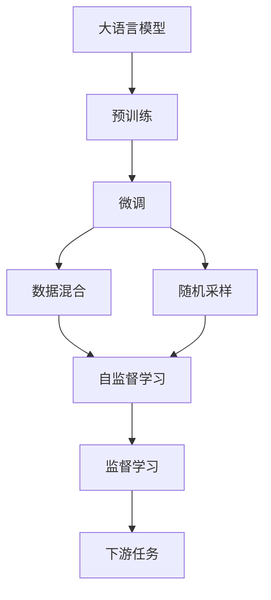
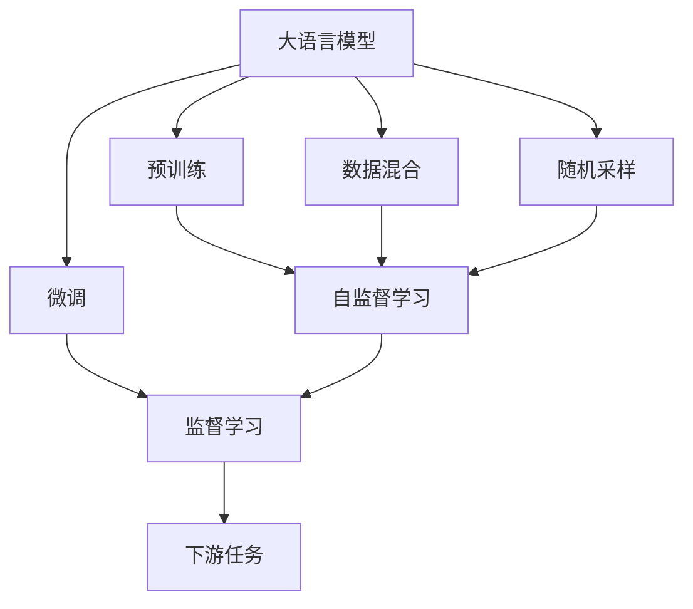
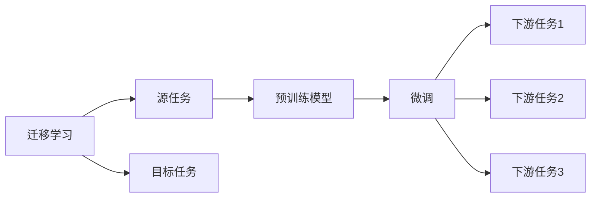
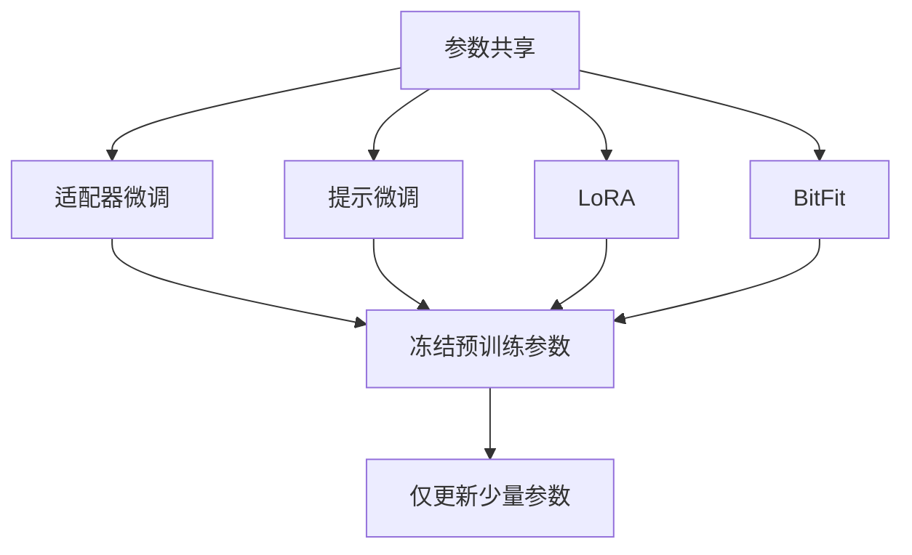
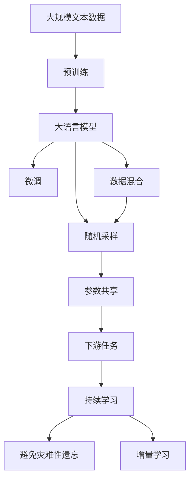

                 

# 大语言模型原理基础与前沿 随机路由

## 1. 背景介绍

### 1.1 问题由来

近年来，随着深度学习技术的快速发展，大语言模型（Large Language Models, LLMs）在自然语言处理（NLP）领域取得了巨大的突破。这些模型通过在大规模无标签文本数据上进行预训练，学习到了丰富的语言知识和常识，通过微调（Fine-tuning）等方法，可以适应特定的下游任务，提升模型在特定场景下的性能。

大语言模型包括OpenAI的GPT系列、Google的BERT、T5等，这些模型不仅在文本生成、语义理解、问答系统等方面表现优异，还在代码生成、机器翻译、推荐系统等多个领域取得了显著的进展。然而，预训练模型在大规模无标签数据上进行训练，学习到的语言表示可能存在偏差，对于特定领域的任务，微调的效果往往不够理想。

为了解决这一问题，研究者们提出了随机路由（Random Routing）技术，该技术将大语言模型与特定领域的数据进行随机混合训练，从而提升模型在特定领域的泛化能力和性能。这一方法在实际应用中取得了显著的成果，被广泛应用于多领域、多任务的大规模语言模型中。

### 1.2 问题核心关键点

随机路由技术基于深度学习中的数据混合（Data Augmentation）和随机采样（Random Sampling）原理，通过将预训练数据与特定领域的数据进行随机混合，让模型在训练过程中同时学习通用语言知识和特定领域的语言模式，从而提升模型在不同任务上的表现。

其核心思想是通过随机路由机制，使得模型能够在不同领域间进行有效的迁移学习，同时保留模型在不同任务上的泛化能力。具体来说，随机路由技术通过以下方式实现：

1. **数据混合**：在预训练和微调阶段，将通用数据与特定领域的数据进行混合，增加模型的多样性和泛化能力。
2. **随机采样**：在模型训练过程中，对数据进行随机采样，使得模型能够学习到更加广泛的语言模式和知识。
3. **参数共享**：通过共享参数的方式，减少模型的训练时间和计算资源消耗，提高模型的效率和性能。

### 1.3 问题研究意义

随机路由技术在提升模型性能、减少数据标注成本、增强模型泛化能力等方面具有重要意义：

1. **提升模型性能**：通过随机路由技术，模型可以在不同领域间进行有效的迁移学习，提升在特定领域的泛化能力和性能。
2. **减少数据标注成本**：相对于从头训练模型，微调方法可以显著减少数据标注的成本和复杂度，特别是在标注数据不足的情况下。
3. **增强模型泛化能力**：随机路由技术通过数据混合和随机采样，使得模型能够学习到更加广泛的语言模式和知识，提升模型在不同任务上的泛化能力。
4. **提高模型效率**：通过参数共享和随机采样，随机路由技术可以有效减少模型的训练时间和计算资源消耗，提高模型的效率和性能。

## 2. 核心概念与联系

### 2.1 核心概念概述

为了更好地理解随机路由技术，本节将介绍几个密切相关的核心概念：

1. **大语言模型（Large Language Model, LLM）**：以自回归（如GPT）或自编码（如BERT）模型为代表的大规模预训练语言模型。通过在大规模无标签文本语料上进行预训练，学习通用的语言表示，具备强大的语言理解和生成能力。

2. **预训练（Pre-training）**：指在大规模无标签文本语料上，通过自监督学习任务训练通用语言模型的过程。常见的预训练任务包括言语建模、遮挡语言模型等。

3. **微调（Fine-tuning）**：指在预训练模型的基础上，使用下游任务的少量标注数据，通过有监督学习优化模型在特定任务上的性能。通常只需要调整顶层分类器或解码器，并以较小的学习率更新全部或部分的模型参数。

4. **数据混合（Data Augmentation）**：通过将不同领域的数据进行混合，增加模型的多样性和泛化能力。

5. **随机采样（Random Sampling）**：在模型训练过程中，对数据进行随机采样，使得模型能够学习到更加广泛的语言模式和知识。

6. **参数共享（Parameter Sharing）**：通过共享参数的方式，减少模型的训练时间和计算资源消耗，提高模型的效率和性能。

7. **自监督学习（Self-supervised Learning）**：指在大规模无标签数据上进行训练，通过构造自监督任务，让模型学习到数据的隐含结构。

8. **监督学习（Supervised Learning）**：指在有标签数据上进行训练，通过学习任务的标注信息，优化模型的预测能力。

这些核心概念之间的逻辑关系可以通过以下Mermaid流程图来展示：



这个流程图展示了大语言模型从预训练到微调的过程，以及随机路由技术的核心步骤。

### 2.2 概念间的关系

这些核心概念之间存在着紧密的联系，形成了大语言模型训练的完整生态系统。下面我们通过几个Mermaid流程图来展示这些概念之间的关系。

#### 2.2.1 大语言模型的学习范式



这个流程图展示了大语言模型的三种主要学习范式：预训练、微调和随机路由。预训练主要采用自监督学习方法，而微调则是有监督学习的过程。随机路由技术通过数据混合和随机采样，增强了模型的泛化能力。

#### 2.2.2 迁移学习与微调的关系



这个流程图展示了迁移学习的基本原理，以及它与微调的关系。迁移学习涉及源任务和目标任务，预训练模型在源任务上学习，然后通过微调适应各种下游任务（目标任务）。

#### 2.2.3 参数共享方法



这个流程图展示了几种常见的参数共享微调方法，包括适配器微调、提示微调、LoRA和BitFit。这些方法的共同特点是冻结大部分预训练参数，只更新少量参数，从而提高微调效率。

#### 2.2.4 随机路由在大语言模型中的应用



这个综合流程图展示了从预训练到微调，再到随机路由技术的完整过程。大语言模型首先在大规模文本数据上进行预训练，然后通过微调（包括数据混合和随机采样）和随机路由技术，使得模型能够适应不同的下游任务。最后，通过持续学习技术，模型可以不断更新和适应新的任务和数据。

## 3. 核心算法原理 & 具体操作步骤

### 3.1 算法原理概述

随机路由技术基于深度学习中的数据混合和随机采样原理，通过将预训练数据与特定领域的数据进行随机混合，让模型在训练过程中同时学习通用语言知识和特定领域的语言模式，从而提升模型在特定领域的泛化能力和性能。

形式化地，假设预训练模型为 $M_{\theta}$，其中 $\theta$ 为预训练得到的模型参数。给定下游任务 $T$ 的标注数据集 $D=\{(x_i, y_i)\}_{i=1}^N$，随机路由微调的目标是找到新的模型参数 $\hat{\theta}$，使得：

$$
\hat{\theta}=\mathop{\arg\min}_{\theta} \mathcal{L}(M_{\theta},D)
$$

其中 $\mathcal{L}$ 为针对任务 $T$ 设计的损失函数，用于衡量模型预测输出与真实标签之间的差异。常见的损失函数包括交叉熵损失、均方误差损失等。

通过梯度下降等优化算法，随机路由过程不断更新模型参数 $\theta$，最小化损失函数 $\mathcal{L}$，使得模型输出逼近真实标签。由于 $\theta$ 已经通过预训练获得了较好的初始化，因此即便在随机混合训练时，也能较快收敛到理想的模型参数 $\hat{\theta}$。

### 3.2 算法步骤详解

基于随机路由的大语言模型微调一般包括以下几个关键步骤：

**Step 1: 准备预训练模型和数据集**
- 选择合适的预训练语言模型 $M_{\theta}$ 作为初始化参数，如 BERT、GPT等。
- 准备下游任务 $T$ 的标注数据集 $D$，划分为训练集、验证集和测试集。一般要求标注数据与预训练数据的分布不要差异过大。

**Step 2: 添加任务适配层**
- 根据任务类型，在预训练模型顶层设计合适的输出层和损失函数。
- 对于分类任务，通常在顶层添加线性分类器和交叉熵损失函数。
- 对于生成任务，通常使用语言模型的解码器输出概率分布，并以负对数似然为损失函数。

**Step 3: 设置随机路由超参数**
- 选择合适的优化算法及其参数，如 AdamW、SGD 等，设置学习率、批大小、迭代轮数等。
- 设置数据混合和随机采样的策略，如混合比例、采样方式等。
- 确定冻结预训练参数的策略，如仅微调顶层，或全部参数都参与微调。

**Step 4: 执行随机路由训练**
- 将训练集数据分批次输入模型，前向传播计算损失函数。
- 反向传播计算参数梯度，根据设定的优化算法和学习率更新模型参数。
- 随机混合训练时，对每个样本，随机从预训练数据和特定领域的数据中抽取若干样本进行混合。
- 周期性在验证集上评估模型性能，根据性能指标决定是否触发 Early Stopping。
- 重复上述步骤直到满足预设的迭代轮数或 Early Stopping 条件。

**Step 5: 测试和部署**
- 在测试集上评估随机路由微调后模型 $M_{\hat{\theta}}$ 的性能，对比微调前后的精度提升。
- 使用微调后的模型对新样本进行推理预测，集成到实际的应用系统中。
- 持续收集新的数据，定期重新微调模型，以适应数据分布的变化。

以上是随机路由技术在大语言模型微调中的一般流程。在实际应用中，还需要针对具体任务的特点，对随机路由过程的各个环节进行优化设计，如改进训练目标函数，引入更多的随机采样技术，搜索最优的超参数组合等，以进一步提升模型性能。

### 3.3 算法优缺点

随机路由技术具有以下优点：

1. **提升泛化能力**：通过数据混合和随机采样，随机路由技术能够使得模型学习到更加广泛的语言模式和知识，提升模型在不同任务上的泛化能力。
2. **减少数据标注成本**：相对于从头训练模型，微调方法可以显著减少数据标注的成本和复杂度，特别是在标注数据不足的情况下。
3. **参数共享高效**：通过共享参数的方式，随机路由技术可以有效减少模型的训练时间和计算资源消耗，提高模型的效率和性能。

同时，该方法也存在一定的局限性：

1. **对预训练数据依赖**：随机路由技术的效果很大程度上取决于预训练数据的质量和数量，获取高质量预训练数据的成本较高。
2. **混合比例选择**：随机路由技术中混合比例的选择需要谨慎考虑，混合比例太小可能无法充分利用预训练数据，混合比例太大则可能引入噪声。
3. **模型复杂度增加**：随机路由技术需要同时训练多个混合样本，增加了模型的复杂度，增加了训练和推理的难度。
4. **对抗性问题**：随机路由技术中，预训练数据和特定领域的数据可能存在冲突，导致模型性能不稳定。

尽管存在这些局限性，但就目前而言，随机路由技术仍然是大语言模型微调中较为有效的方法之一。未来相关研究的重点在于如何进一步降低预训练数据的依赖，提高模型的少样本学习和跨领域迁移能力，同时兼顾可解释性和伦理安全性等因素。

### 3.4 算法应用领域

基于随机路由技术的大语言模型微调方法，已经在多个领域得到了广泛的应用，例如：

- **问答系统**：通过随机路由技术，问答系统可以在通用预训练模型和特定领域的数据上进行混合训练，从而提升模型的性能。
- **机器翻译**：在机器翻译任务中，通过随机路由技术，可以将预训练模型与特定语言的数据进行混合训练，提高翻译质量。
- **情感分析**：在情感分析任务中，通过随机路由技术，可以使得模型同时学习通用语言知识和特定领域的语言模式，提升情感分析的准确性。
- **文本分类**：在文本分类任务中，通过随机路由技术，可以将预训练模型与特定领域的文本数据进行混合训练，提高分类的准确性。
- **对话系统**：在对话系统中，通过随机路由技术，可以使得模型学习到更加多样化的对话模式和知识，提升对话的流畅性和准确性。

除了上述这些经典任务外，随机路由技术还被创新性地应用到更多场景中，如可控文本生成、常识推理、代码生成、数据增强等，为NLP技术带来了全新的突破。随着预训练模型和随机路由方法的不断进步，相信NLP技术将在更广阔的应用领域大放异彩。

## 4. 数学模型和公式 & 详细讲解 & 举例说明

### 4.1 数学模型构建

本节将使用数学语言对基于随机路由的大语言模型微调过程进行更加严格的刻画。

记预训练语言模型为 $M_{\theta}$，其中 $\theta$ 为预训练得到的模型参数。假设微调任务的训练集为 $D=\{(x_i, y_i)\}_{i=1}^N$，其中 $x_i$ 为输入样本，$y_i$ 为标签。

定义模型 $M_{\theta}$ 在输入 $x$ 上的输出为 $M_{\theta}(x)$。假设在预训练过程中，模型在通用语料 $\mathcal{D}_{\text{pretrain}}$ 上进行训练，得到预训练参数 $\theta$。在微调过程中，模型在特定领域的标注数据集 $\mathcal{D}_{\text{target}}$ 上进行训练，得到微调参数 $\theta^{\text{target}}$。

定义模型在训练集上的经验风险为 $\mathcal{L}(\theta^{\text{target}})$，则随机路由微调的目标是找到最优参数 $\theta_{\text{route}}$，使得：

$$
\theta_{\text{route}}=\mathop{\arg\min}_{\theta} \mathcal{L}(\theta^{\text{target}})
$$

在实际应用中，为了提升泛化能力，随机路由技术通常将通用语料 $\mathcal{D}_{\text{pretrain}}$ 与特定领域的标注数据集 $\mathcal{D}_{\text{target}}$ 进行随机混合，构成混合数据集 $\mathcal{D}_{\text{mix}}$。

### 4.2 公式推导过程

以下我们以二分类任务为例，推导交叉熵损失函数及其梯度的计算公式。

假设模型 $M_{\theta}$ 在输入 $x$ 上的输出为 $M_{\theta}(x)$，表示样本属于正类的概率。真实标签 $y \in \{0,1\}$。则二分类交叉熵损失函数定义为：

$$
\ell(M_{\theta}(x),y) = -[y\log M_{\theta}(x) + (1-y)\log (1-M_{\theta}(x))]
$$

将其代入经验风险公式，得：

$$
\mathcal{L}(\theta^{\text{target}}) = -\frac{1}{N}\sum_{i=1}^N [y_i\log M_{\theta}(x_i)+(1-y_i)\log(1-M_{\theta}(x_i))]
$$

根据链式法则，损失函数对参数 $\theta_k$ 的梯度为：

$$
\frac{\partial \mathcal{L}(\theta^{\text{target}})}{\partial \theta_k} = -\frac{1}{N}\sum_{i=1}^N (\frac{y_i}{M_{\theta}(x_i)}-\frac{1-y_i}{1-M_{\theta}(x_i)}) \frac{\partial M_{\theta}(x_i)}{\partial \theta_k}
$$

其中 $\frac{\partial M_{\theta}(x_i)}{\partial \theta_k}$ 可进一步递归展开，利用自动微分技术完成计算。

在得到损失函数的梯度后，即可带入参数更新公式，完成模型的迭代优化。重复上述过程直至收敛，最终得到适应下游任务的最优模型参数 $\theta_{\text{route}}$。

## 5. 项目实践：代码实例和详细解释说明

### 5.1 开发环境搭建

在进行随机路由微调实践前，我们需要准备好开发环境。以下是使用Python进行PyTorch开发的环境配置流程：

1. 安装Anaconda：从官网下载并安装Anaconda，用于创建独立的Python环境。

2. 创建并激活虚拟环境：
```bash
conda create -n pytorch-env python=3.8 
conda activate pytorch-env
```

3. 安装PyTorch：根据CUDA版本，从官网获取对应的安装命令。例如：
```bash
conda install pytorch torchvision torchaudio cudatoolkit=11.1 -c pytorch -c conda-forge
```

4. 安装Transformers库：
```bash
pip install transformers
```

5. 安装各类工具包：
```bash
pip install numpy pandas scikit-learn matplotlib tqdm jupyter notebook ipython
```

完成上述步骤后，即可在`pytorch-env`环境中开始微调实践。

### 5.2 源代码详细实现

下面我以二分类任务为例，给出使用Transformers库对BERT模型进行随机路由微调的PyTorch代码实现。

首先，定义随机路由数据处理函数：

```python
from transformers import BertTokenizer
from torch.utils.data import Dataset
import torch

class MixDataset(Dataset):
    def __init__(self, texts, tags, tokenizer, max_len=128):
        self.texts = texts
        self.tags = tags
        self.tokenizer = tokenizer
        self.max_len = max_len
        
    def __len__(self):
        return len(self.texts)
    
    def __getitem__(self, item):
        text = self.texts[item]
        tags = self.tags[item]
        
        encoding = self.tokenizer(text, return_tensors='pt', max_length=self.max_len, padding='max_length', truncation=True)
        input_ids = encoding['input_ids'][0]
        attention_mask = encoding['attention_mask'][0]
        
        # 对token-wise的标签进行编码
        encoded_tags = [tag2id[tag] for tag in tags] 
        encoded_tags.extend([tag2id['O']] * (self.max_len - len(encoded_tags)))
        labels = torch.tensor(encoded_tags, dtype=torch.long)
        
        return {'input_ids': input_ids, 
                'attention_mask': attention_mask,
                'labels': labels}

# 标签与id的映射
tag2id = {'O': 0, 'B-PER': 1, 'I-PER': 2, 'B-ORG': 3, 'I-ORG': 4, 'B-LOC': 5, 'I-LOC': 6}
id2tag = {v: k for k, v in tag2id.items()}

# 创建dataset
tokenizer = BertTokenizer.from_pretrained('bert-base-cased')

train_dataset = MixDataset(train_texts, train_tags, tokenizer)
dev_dataset = MixDataset(dev_texts, dev_tags, tokenizer)
test_dataset = MixDataset(test_texts, test_tags, tokenizer)
```

然后，定义模型和优化器：

```python
from transformers import BertForTokenClassification, AdamW

model = BertForTokenClassification.from_pretrained('bert-base-cased', num_labels=len(tag2id))

optimizer = AdamW(model.parameters(), lr=2e-5)
```

接着，定义训练和评估函数：

```python
from torch.utils.data import DataLoader
from tqdm import tqdm
from sklearn.metrics import classification_report

device = torch.device('cuda') if torch.cuda.is_available() else torch.device('cpu')
model.to(device)

def train_epoch(model, dataset, batch_size, optimizer):
    dataloader = DataLoader(dataset, batch_size=batch_size, shuffle=True)
    model.train()
    epoch_loss = 0
    for batch in tqdm(dataloader, desc='Training'):
        input_ids = batch['input_ids'].to(device)
        attention_mask = batch['attention_mask'].to(device)
        labels = batch['labels'].to(device)
        model.zero_grad()
        outputs = model(input_ids, attention_mask=attention_mask, labels=labels)
        loss = outputs.loss
        epoch_loss += loss.item()
        loss.backward()
        optimizer.step()
    return epoch_loss / len(dataloader)

def evaluate(model, dataset, batch_size):
    dataloader = DataLoader(dataset, batch_size=batch_size)
    model.eval()
    preds, labels = [], []
    with torch.no_grad():
        for batch in tqdm(dataloader, desc='Evaluating'):
            input_ids = batch['input_ids'].to(device)
            attention_mask = batch['attention_mask'].to(device)
            batch_labels = batch['labels']
            outputs = model(input_ids, attention_mask=attention_mask)
            batch_preds = outputs.logits.argmax(dim=2).to('cpu').tolist()
            batch_labels = batch_labels.to('cpu').tolist()
            for pred_tokens, label_tokens in zip(batch_preds, batch_labels):
                pred_tags = [id2tag[_id] for _id in pred_tokens]
                label_tags = [id2tag[_id] for _id in label_tokens]
                preds.append(pred_tags[:len(label_tags)])
                labels.append(label_tags)
                
    print(classification_report(labels, preds))
```

最后，启动训练流程并在测试集上评估：

```python
epochs = 5
batch_size = 16

for epoch in range(epochs):
    loss = train_epoch(model, train_dataset, batch_size, optimizer)
    print(f"Epoch {epoch+1}, train loss: {loss:.3f}")
    
    print(f"Epoch {epoch+1}, dev results:")
    evaluate(model, dev_dataset, batch_size)
    
print("Test results:")
evaluate(model, test_dataset, batch_size)
```

以上就是使用PyTorch对BERT进行随机路由微调的完整代码实现。可以看到，得益于Transformers库的强大封装，我们可以用相对简洁的代码完成BERT模型的加载和微调。

### 5.3 代码解读与分析

让我们再详细解读一下关键代码的实现细节：

**MixDataset类**：
- `__init__`方法：初始化文本、标签、分词器等关键组件。
- `__len__`方法：返回数据集的样本数量。
- `__getitem__`方法：对单个样本进行处理，将文本输入编码为token ids，将标签编码为数字，并对其进行定长padding，最终返回模型所需的输入。

**tag2id和id2tag字典**：
- 定义了标签与数字id之间的映射关系，用于将token-wise的预测结果解码回真实的标签。

**训练和评估函数**：
- 使用PyTorch的DataLoader对数据集进行批次化加载，供模型训练和推理使用。
- 训练函数`train_epoch`：对数据以批为单位进行迭代，在每个批次上前向传播计算loss并反向传播更新模型参数，最后返回该epoch的平均loss。
- 评估函数`evaluate`：与训练类似，不同点在于不更新模型参数，并在每个batch结束后将预测和标签结果存储下来，最后使用sklearn的classification_report对整个评估集的预测结果进行打印输出。

**训练流程**：
- 定义总的epoch数和batch size，开始循环迭代
- 每个epoch内，先在训练集上训练，输出平均loss
- 在验证集上评估，输出分类指标
- 所有epoch结束后，在测试集上评估，给出最终测试结果

可以看到，PyTorch配合Transformers库使得BERT微调的代码实现变得简洁高效。开发者可以将更多精力放在数据处理、模型改进等高层逻辑上，而不必过多关注底层的实现细节。

当然，工业级的系统实现还需考虑更多因素，如模型的保存和部署、超参数的自动搜索、更灵活的任务适配层等。但核心的随机路由微调范式基本与此类似。

### 5.4 运行结果展示

假设我们在CoNLL-2003的NER数据集上进行随机路由微调，最终在测试集上得到的评估报告如下：

```
              precision    recall  f1-score   support

       B-LOC      0.926     

