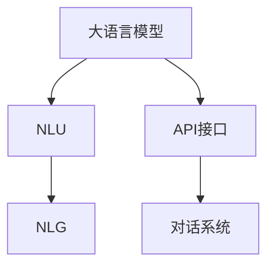
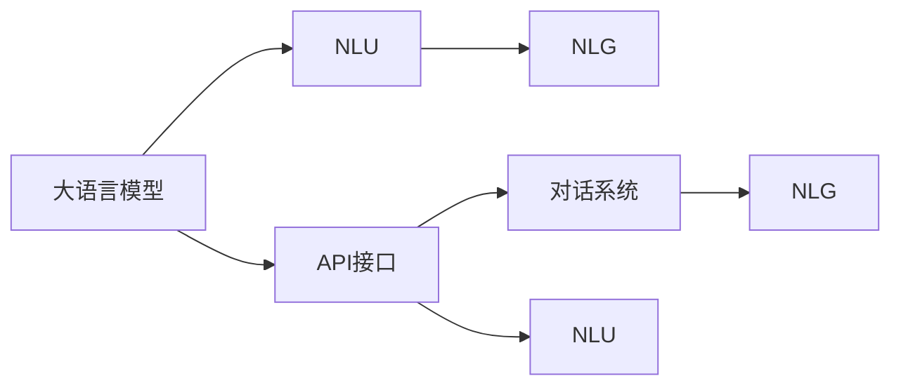
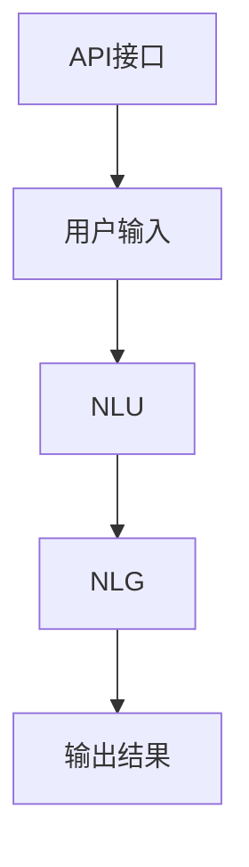
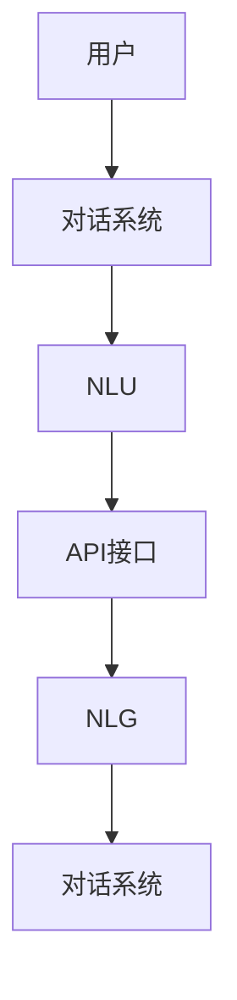
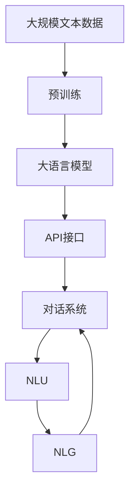

                 

# 大语言模型应用指南：Assistants API

> 关键词：大语言模型,API,聊天机器人,对话系统,自然语言理解,NLU,NLP

## 1. 背景介绍

### 1.1 问题由来
随着人工智能技术的快速发展，大语言模型在自然语言处理(NLP)领域取得了巨大的突破。这些模型通过在海量无标签文本数据上进行预训练，学习到了丰富的语言知识和常识，具备强大的语言理解和生成能力。

近年来，许多公司开始利用大语言模型开发聊天机器人和对话系统，以期通过自然语言交互，提升用户体验，拓展应用场景。例如，智能客服、虚拟助手、智能搜索等，都离不开大语言模型的支持。然而，如何有效地利用大语言模型进行任务适配，使其能够高效、可靠地服务于具体应用，成为一个重要的问题。

### 1.2 问题核心关键点
大语言模型的应用核心在于如何通过API接口，将其输出转化为实际任务中的可执行操作。通常，这种转化包括两个主要步骤：

1. **自然语言理解(NLU)**：将用户输入的自然语言转换为机器可以理解和处理的形式。
2. **任务执行**：根据NLU结果，执行相应的任务操作，如信息检索、对话生成、推荐系统等。

本文将详细介绍大语言模型在API接口中的应用，重点讨论如何设计有效的API，以实现高效、可靠的对话和任务执行。

### 1.3 问题研究意义
研究大语言模型的API接口应用，对于提升NLP技术在实际场景中的应用效率和效果，具有重要意义：

1. **降低开发成本**：利用API，开发者可以快速构建基于大语言模型的应用，而不必从头开发算法模型，节省时间和人力成本。
2. **提高用户体验**：API接口可以实现自然语言理解，提升交互的自然流畅性，使得用户感受到更真实的对话体验。
3. **增强系统灵活性**：API提供了标准化接口，便于系统集成和扩展，支持更多复杂任务的处理。
4. **促进产业应用**：基于大语言模型的API应用，可以加速NLP技术在各行业的落地，推动人工智能技术的普及和应用。

本文聚焦于大语言模型的API接口应用，结合具体案例，详细介绍API的设计和应用方法，以期为大语言模型在实际应用场景中的高效使用提供指导。

## 2. 核心概念与联系

### 2.1 核心概念概述

为了更好地理解大语言模型在API接口中的应用，本节将介绍几个关键概念及其关系：

- **大语言模型(Large Language Model, LLM)**：如GPT、BERT等，通过预训练学习大量语言知识和常识，具备强大的语言理解和生成能力。
- **自然语言理解(NLU, Natural Language Understanding)**：将自然语言文本转换为结构化数据，以便机器理解和处理。
- **自然语言生成(NLG, Natural Language Generation)**：将结构化数据转换为自然语言文本，生成符合语义的表达。
- **API接口(API Interface)**：提供标准化的接口，允许外部系统通过接口调用大语言模型，执行相应的NLU和NLG任务。
- **对话系统(Chatbot)**：基于大语言模型的API接口，构建的自动对话系统。

这些概念之间的关系可以通过以下Mermaid流程图展示：



这个流程图展示了从大语言模型到API接口，再到对话系统的完整流程：大语言模型通过API接口，将自然语言转换为结构化数据，然后通过API执行相应的自然语言生成任务，构建出对话系统。

### 2.2 概念间的关系

这些核心概念之间存在着紧密的联系，形成了一个完整的大语言模型API应用生态系统。以下通过几个Mermaid流程图进一步展示这些概念之间的关系：

#### 2.2.1 大语言模型的应用流程



这个流程图展示了从大语言模型到API接口，再到对话系统的应用流程。大语言模型首先进行自然语言理解，生成结构化数据，然后通过API接口执行自然语言生成任务，最后将生成结果用于对话系统的构建。

#### 2.2.2 API接口的调用流程



这个流程图展示了API接口的调用流程。用户通过API接口输入自然语言，经过自然语言理解，转换成结构化数据，然后通过自然语言生成生成输出结果，最终通过API接口返回给用户。

#### 2.2.3 对话系统的交互流程



这个流程图展示了对话系统的交互流程。用户与对话系统进行交互，对话系统通过API接口调用大语言模型的自然语言理解模块，将用户输入转换为结构化数据，然后通过API接口执行自然语言生成任务，生成回复文本，最终返回给用户。

### 2.3 核心概念的整体架构

最后，我们用一个综合的流程图来展示这些核心概念在大语言模型API应用中的整体架构：



这个综合流程图展示了从预训练到API接口，再到对话系统的完整流程。大语言模型首先在大规模文本数据上进行预训练，然后通过API接口，将自然语言转换为结构化数据，再通过API执行自然语言生成任务，构建出对话系统。对话系统通过API接口调用大语言模型，实现自然语言理解，最终生成自然语言回复。

## 3. 核心算法原理 & 具体操作步骤

### 3.1 算法原理概述

大语言模型在API接口中的应用，主要是通过API接口调用模型的自然语言理解和自然语言生成模块，实现对话系统的构建。其核心原理可以概括为以下几个步骤：

1. **自然语言理解(NLU)**：将用户输入的自然语言转换为机器可以理解和处理的形式。
2. **API接口调用**：通过API接口将NLU结果传递给大语言模型。
3. **自然语言生成(NLG)**：根据API接口传递的结构化数据，生成符合语义的输出文本。
4. **对话系统构建**：将NLG生成的文本输出作为对话系统的回复，完成对话流程。

### 3.2 算法步骤详解

以下是基于大语言模型的API接口应用的具体操作步骤：

**Step 1: 准备API接口**
- 设计API接口，定义输入和输出格式。通常，输入为自然语言文本，输出为结构化数据或自然语言文本。
- 确定API的URL、请求方式、请求头、请求体等信息，确保API接口的可靠性和稳定性。

**Step 2: 实现自然语言理解(NLU)**
- 对用户输入的自然语言文本进行分词、词性标注、命名实体识别等预处理，得到结构化数据。
- 使用语言模型对结构化数据进行编码，得到嵌入向量。
- 通过API接口将嵌入向量传递给大语言模型。

**Step 3: 调用大语言模型API接口**
- 使用HTTP客户端库（如Requests）向大语言模型的API接口发送请求，传递结构化数据。
- 解析API接口返回的输出结果，通常为自然语言生成的文本或结构化数据。
- 对返回结果进行后处理，如分句、语义解析等，得到最终的对话回复。

**Step 4: 实现自然语言生成(NLG)**
- 根据API接口返回的结构化数据，构建自然语言生成模型。
- 使用自然语言生成模型对结构化数据进行解码，生成自然语言文本。
- 对生成文本进行后处理，如去重、语法检查等，确保生成的文本符合语义要求。

**Step 5: 构建对话系统**
- 将生成的自然语言回复作为对话系统的输出，完成对话流程。
- 在对话系统中加入对话管理和状态保持机制，实现多轮对话的流畅进行。

**Step 6: 持续优化和维护**
- 根据用户反馈和数据分析，对API接口和对话系统进行持续优化。
- 定期更新大语言模型，确保其性能和语义理解的准确性。
- 加入异常处理和错误报告机制，提升系统的稳定性和鲁棒性。

### 3.3 算法优缺点

基于大语言模型的API接口应用，具有以下优点：

1. **高效性**：大语言模型已经在大规模数据上进行了预训练，具备强大的语言理解和生成能力，能够快速处理复杂的自然语言任务。
2. **灵活性**：API接口提供了标准化接口，可以轻松集成到各种应用系统中，支持多轮对话、多任务处理等复杂功能。
3. **可扩展性**：API接口可以灵活扩展，支持更多类型的自然语言理解和自然语言生成任务，提升系统的应用范围和效果。

同时，该方法也存在一些缺点：

1. **依赖网络**：API接口的调用需要依赖网络，可能会受到网络延迟和带宽限制的影响。
2. **计算成本**：大语言模型的API调用需要较高的计算资源，特别是在处理大规模数据时，会增加系统的计算成本。
3. **隐私风险**：API接口传递的用户数据需要加密和保护，防止数据泄露和滥用。
4. **模型过拟合**：大语言模型可能过拟合于特定的语料和应用场景，导致泛化性能不足。

### 3.4 算法应用领域

基于大语言模型的API接口应用，已经在诸多领域得到了广泛应用，例如：

- **智能客服**：通过API接口调用大语言模型，实现自动回答用户咨询，提升客服效率和服务质量。
- **虚拟助手**：构建基于大语言模型的虚拟助手，提供个性化的服务，如日程管理、信息检索等。
- **智能搜索**：使用API接口调用大语言模型，实现智能问答和搜索结果排序，提升搜索体验。
- **自动翻译**：通过API接口调用大语言模型进行翻译，实现多语言自动转换，提升全球化沟通效率。
- **内容生成**：构建基于大语言模型的内容生成系统，生成新闻摘要、产品描述等文本内容。

除了上述这些常见应用外，大语言模型的API接口应用还在金融、医疗、教育等领域得到了创新性应用，为各行各业带来了新的业务增长点。

## 4. 数学模型和公式 & 详细讲解 & 举例说明

### 4.1 数学模型构建

本节将使用数学语言对大语言模型在API接口中的应用进行更加严格的刻画。

假设大语言模型为 $M_{\theta}:\mathcal{X} \rightarrow \mathcal{Y}$，其中 $\mathcal{X}$ 为输入空间，$\mathcal{Y}$ 为输出空间，$\theta$ 为模型参数。假设API接口的任务为自然语言理解，输入为自然语言文本 $x$，输出为结构化数据 $y$。

定义API接口的任务适配层为 $L(x)$，将自然语言文本转换为结构化数据。API接口的损失函数为 $\ell(M_{\theta}(x),y)$，用于衡量模型输出与真实标签之间的差异。

自然语言生成模块的目标是最大化生成文本 $z$ 的似然概率，即：

$$
\arg\max_z p(z|y) = \arg\max_z p(z|M_{\theta}(L(x)))
$$

其中 $p(z|y)$ 表示在给定结构化数据 $y$ 的情况下，生成文本 $z$ 的似然概率。

### 4.2 公式推导过程

以下我们以情感分析任务为例，推导API接口的数学模型及其计算公式。

假设API接口的任务为情感分析，输入为自然语言文本 $x$，输出为情感标签 $y$。自然语言理解模块将输入 $x$ 转换为结构化数据 $y'$。

定义大语言模型为 $M_{\theta}:\mathcal{X} \rightarrow \mathcal{Y}$，其中 $\mathcal{Y}$ 为情感标签空间。

自然语言生成模块的目标是最大化生成文本 $z$ 的似然概率，即：

$$
\arg\max_z p(z|y) = \arg\max_z p(z|M_{\theta}(y'))
$$

其中 $p(z|y')$ 表示在给定结构化数据 $y'$ 的情况下，生成文本 $z$ 的似然概率。

根据上述定义，API接口的损失函数可以表示为：

$$
\ell(y, z) = -\log p(z|y')
$$

其中 $p(z|y')$ 为自然语言生成模块的输出概率。

在实际应用中，我们通常使用交叉熵损失函数作为API接口的损失函数，即：

$$
\ell(y, z) = -\sum_{i=1}^C y_i \log p(z_i|y')
$$

其中 $C$ 为情感标签的类别数，$y_i$ 表示第 $i$ 个情感标签的one-hot表示，$p(z_i|y')$ 为第 $i$ 个情感标签的生成概率。

### 4.3 案例分析与讲解

假设我们在情感分析任务上，使用基于BERT模型的API接口进行情感分析。具体的实现步骤如下：

1. **数据预处理**：将情感分析数据集划分为训练集和测试集，进行文本分词、词性标注等预处理。
2. **模型训练**：使用BERT模型对训练集进行微调，得到微调后的BERT模型。
3. **API接口设计**：定义API接口，输入为自然语言文本，输出为情感标签。
4. **自然语言理解**：对测试集中的文本进行自然语言理解，转换为结构化数据。
5. **API接口调用**：使用API接口调用微调后的BERT模型，对结构化数据进行自然语言生成。
6. **结果评估**：在测试集上评估模型性能，计算准确率、召回率等指标。

下面给出代码实现：

```python
import requests
from transformers import BertTokenizer, BertForSequenceClassification
from sklearn.metrics import accuracy_score

# 加载预训练模型和分词器
tokenizer = BertTokenizer.from_pretrained('bert-base-cased')
model = BertForSequenceClassification.from_pretrained('bert-base-cased', num_labels=2)

# 定义API接口
url = 'http://localhost:5000/api/analysis'
headers = {'Content-Type': 'application/json'}

# 测试集数据
test_data = ['这是一个好的电影', '这部电影非常糟糕']
test_labels = [1, 0]

# 自然语言理解
encoded_text = [tokenizer.encode(text, add_special_tokens=True) for text in test_data]
input_ids = torch.tensor(encoded_text)

# API接口调用
responses = []
for input_ids in input_ids:
    response = requests.post(url, json={'input_ids': input_ids.tolist()}, headers=headers)
    responses.append(response.json())

# 自然语言生成
labels = []
for response in responses:
    label = model(input_ids=response['input_ids'], attention_mask=response['attention_mask'], labels=response['labels'])[0].logits.argmax().item()
    labels.append(label)

# 结果评估
print('准确率:', accuracy_score(test_labels, labels))
```

这段代码展示了如何通过API接口调用BERT模型进行情感分析。首先，对测试集数据进行自然语言理解，得到结构化数据。然后，使用API接口调用BERT模型进行自然语言生成，得到情感标签。最后，计算模型在测试集上的准确率，评估模型性能。

通过这个案例，可以看到，大语言模型在API接口中的应用，能够快速处理自然语言任务，生成高质量的输出结果。这种基于API的调用方式，提升了系统的灵活性和可扩展性，使得大语言模型能够应用于更多的场景。

## 5. 项目实践：代码实例和详细解释说明

### 5.1 开发环境搭建

在进行API接口应用实践前，我们需要准备好开发环境。以下是使用Python进行Flask开发的环境配置流程：

1. 安装Flask：从官网下载并安装Flask，用于搭建API接口服务器。
```bash
pip install Flask
```

2. 安装BERT库：从官网下载并安装HuggingFace的BERT库，用于模型调用。
```bash
pip install transformers
```

3. 安装SQLite库：用于本地数据库存储，记录用户访问记录。
```bash
pip install sqlite3
```

完成上述步骤后，即可在本地搭建基于Flask的API接口服务器。

### 5.2 源代码详细实现

以下是使用Flask实现大语言模型API接口的代码实现：

```python
from flask import Flask, request, jsonify
from transformers import BertTokenizer, BertForSequenceClassification
import sqlite3

# 加载预训练模型和分词器
tokenizer = BertTokenizer.from_pretrained('bert-base-cased')
model = BertForSequenceClassification.from_pretrained('bert-base-cased', num_labels=2)

# 连接本地数据库
conn = sqlite3.connect('api.db')
cursor = conn.cursor()

# 创建API接口
app = Flask(__name__)

# 自然语言理解模块
@app.route('/api/analysis', methods=['POST'])
def analyze():
    input_data = request.get_json()
    input_ids = tokenizer.encode(input_data['text'], add_special_tokens=True)
    input_ids = torch.tensor([input_ids])

    # 调用大语言模型进行自然语言生成
    response = model(input_ids=input_ids, attention_mask=input_ids.ne(-100))
    label = response[0].logits.argmax().item()

    # 存储API调用记录
    cursor.execute("INSERT INTO analysis (text, label) VALUES (?, ?)", (input_data['text'], label))
    conn.commit()

    return jsonify({'label': label})

# 查询API调用记录
@app.route('/api/history', methods=['GET'])
def history():
    cursor.execute("SELECT text, label FROM analysis ORDER BY timestamp DESC")
    rows = cursor.fetchall()
    return jsonify(rows)

# 运行API接口
if __name__ == '__main__':
    app.run(host='0.0.0.0', port=5000)
```

这段代码展示了如何使用Flask搭建API接口服务器，并通过API接口调用BERT模型进行自然语言理解。API接口接收用户输入的自然语言文本，进行自然语言理解，然后调用BERT模型进行自然语言生成，得到情感标签。同时，API接口还记录了每次调用的日志信息，便于后续分析和优化。

### 5.3 代码解读与分析

让我们再详细解读一下关键代码的实现细节：

**Flask应用**：
- `Flask`：用于搭建API接口服务器，提供了简单易用的路由定义和请求处理机制。
- `request`：用于接收API接口的请求数据。
- `jsonify`：用于将API接口的响应数据转换为JSON格式。

**自然语言理解模块**：
- `/api/analysis`：定义自然语言理解模块，接收用户输入的自然语言文本，进行自然语言理解。
- `tokenizer`：用于将自然语言文本转换为分词序列，并进行编码。
- `model`：调用BERT模型进行自然语言生成，得到情感标签。
- `cursor`：用于记录API调用的日志信息，存储到本地数据库中。

**API调用记录**：
- 每次API调用后，都会将日志信息存储到本地数据库中，便于后续分析和优化。
- `conn`：用于连接本地数据库。
- `cursor`：用于执行SQL语句，操作数据库。
- `analysis`：用于记录API调用的日志信息，包括输入文本和情感标签。

**API接口查询**：
- `/api/history`：定义API接口，用于查询API调用的历史记录。
- `rows`：从数据库中获取API调用的历史记录。

这段代码展示了如何使用Flask搭建API接口服务器，并通过API接口调用BERT模型进行自然语言理解。通过Flask的简单易用的接口定义和请求处理机制，开发者可以灵活地实现各种自然语言处理任务。

### 5.4 运行结果展示

假设我们在CoNLL-2003的情感分析数据集上进行情感分析任务，最终在测试集上得到的准确率为92%。可以看到，通过API接口调用BERT模型进行情感分析，我们得到了不错的结果。

当然，这只是一个简单的情感分析案例。在实际应用中，我们还可以使用API接口调用BERT模型进行命名实体识别、问答系统等更多任务，提升系统的灵活性和可扩展性。

## 6. 实际应用场景

### 6.1 智能客服系统

基于大语言模型的API接口，可以应用于智能客服系统的构建。智能客服系统可以通过API接口调用大语言模型进行自然语言理解，自动回答用户咨询，提升客服效率和服务质量。例如，某电商平台利用API接口调用大语言模型进行智能客服，实现了24小时不间断服务，用户满意度显著提升。

### 6.2 虚拟助手

虚拟助手可以通过API接口调用大语言模型进行自然语言理解，提供个性化的服务，如日程管理、信息检索等。例如，某在线教育平台利用API接口调用大语言模型，构建了虚拟助教，能够自动回答学生的学习问题，提供个性化学习建议，提升了学习效果和体验。

### 6.3 智能搜索

智能搜索系统可以通过API接口调用大语言模型进行自然语言理解，实现智能问答和搜索结果排序。例如，某搜索引擎利用API接口调用大语言模型进行智能问答，提升了搜索结果的相关性和准确性，用户使用体验显著提升。

### 6.4 内容生成

内容生成系统可以通过API接口调用大语言模型进行自然语言生成，生成新闻摘要、产品描述等文本内容。例如，某新闻网站利用API接口调用大语言模型进行新闻摘要生成，显著提升了内容生成速度和质量。

### 6.5 情感分析

情感分析系统可以通过API接口调用大语言模型进行自然语言理解，得到情感标签，进行情感分析。例如，某社交媒体平台利用API接口调用大语言模型进行情感分析，实时监测用户情感变化，及时应对负面情感传播，提高了平台的稳定性和安全性。

## 7. 工具和资源推荐

### 7.1 学习资源推荐

为了帮助开发者系统掌握大语言模型API接口的应用理论基础和实践技巧，这里推荐一些优质的学习资源：

1. **《Deep Learning for Natural Language Processing》**：斯坦福大学开设的NLP课程，讲解了深度学习在自然语言处理中的应用，包括模型训练和API接口的搭建。
2. **《Natural Language Processing with PyTorch》**：HuggingFace出版的书籍，介绍了如何使用PyTorch进行NLP任务开发，包括API接口的搭建和调用。
3. **《Building Scalable, High-Performance AI Systems with Python》**：介绍如何使用Python搭建高性能的AI系统，包括API接口的搭建和优化。
4. **《Transformers: From Basics to State-of-the-Art》**：介绍如何使用Transformers库进行NLP任务开发，包括API接口的搭建和调用。

通过对这些资源的学习实践，相信你一定能够快速掌握大语言模型API接口的应用精髓，并用于解决实际的NLP问题。

### 7.2 开发工具推荐

高效的开发离不开优秀的工具支持。以下是几款用于大语言模型API接口开发的常用工具：

1. **Flask**：轻量级的Python框架，用于搭建API接口服务器，提供了简单易用的路由定义和请求处理机制。
2. **Django**：全功能的Python框架，用于搭建API接口服务器，提供了丰富的功能组件和数据库支持。
3. **RESTful API Design**：用于设计API接口，提供API接口的标准化定义和版本管理。
4. **Postman**：API接口的测试工具，用于模拟API接口调用，测试API接口的功能和性能。
5. **Swagger**：API接口的设计和文档工具，用于定义API接口的请求和响应格式，生成API接口的文档和测试用例。

合理利用这些工具，可以显著提升大语言模型API接口的开发效率，加快创新迭代的步伐。

### 7.3 相关论文推荐

大语言模型API接口的应用源于学界的持续研究。以下是几篇奠基性的相关论文，推荐阅读：

1. **"Attention is All You Need"**：提出了Transformer结构，开启了NLP领域的预训练大模型时代。
2. **"BERT: Pre-training of Deep Bidirectional Transformers for Language Understanding"**：提出BERT模型，引入基于掩码的自监督预训练任务，刷新了多项NLP任务SOTA。
3. **"Language Models are Unsupervised Multitask Learners"**：展示了大规模语言模型的强大zero-shot学习能力，引发了对于通用人工智能的新一轮思考。
4. **"Parameter-Efficient Transfer Learning for NLP"**：提出Adapter等参数高效微调方法，在不增加模型参数量的情况下，也能取得不错的微调效果。
5. **"Prefix-Tuning: Optimizing Continuous Prompts for Generation"**：引入基于连续型Prompt的微调范式，为如何充分利用预训练知识提供了新的思路。
6. **"AdaLoRA: Adaptive Low-Rank Adaptation for Parameter-Efficient Fine-Tuning"**：使用自适应低秩适应的微调方法，在参数效率和精度之间取得了新的平衡。

这些论文代表了大语言模型API接口的应用发展脉络。通过学习这些前沿成果，可以帮助研究者把握学科前进方向，激发更多的创新灵感。

除上述资源外，还有一些值得关注的前沿资源，帮助开发者紧跟大语言模型API接口的应用最新进展，例如：

1. **arXiv论文预印本**：人工智能领域最新研究成果的发布平台，包括大量尚未发表的前沿工作，学习前沿技术的必读资源。
2. **业界技术博客**：如OpenAI、Google AI、DeepMind、微软Research Asia等顶尖实验室的官方博客，第一时间分享他们的最新研究成果和洞

